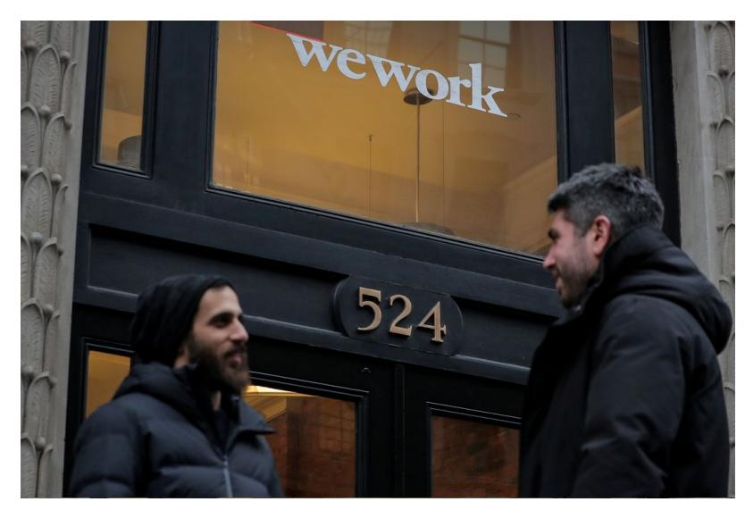

[U.S.](https://www.wsj.com/news/us?mod=breadcrumb)

## Unicorns' Pre-IPO Profit Claims Get Scrutinized

While private, some firms stretch the definition of profitability, but regulatory filings before they go public tell a different story

*By [Jean Eaglesham](https://www.wsj.com/news/author/jean-eaglesham)* Follow

Sept. 22, 2019 1:20 pm ET

We Co., the parent of WeWork, reported a net loss of more than \$904 million for the six months through June, according to a filing for its IPO. PHOTO: BRENDAN MCDERMID/REUTERS

Investors are starting to demand profits, or at least profits in the near future, from richly valued tech companies when they go public.

That has put a spotlight on claims of profitability from companies including Peloton Interactive Inc., WeWork parent We Co. and [Lyft](https://www.wsj.com/market-data/quotes/LYFT) Inc.

New York-based fitness company Peloton is set this week to join a string of rapidly growing tech companies [trying to go public](https://www.wsj.com/articles/peloton-to-pursue-nasdaq-listing-dual-class-stock-structure-in-ipo-11566948809?mod=article_inline) at multibillion-dollar valuations, even though it is still spilling red ink.

While they were private, these companies could easily paint rosy pictures of their finances. But going public means they have to report numbers based on standard accounting rules, which often reveal losses, sometimes huge ones.

profitable," John Foley, the company's chief executive and co-founder, said during a CNBC interview.

The audited financial statements unveiled ahead of Peloton's initial public offering tell a different story. Peloton lost \$196 million in the year through June, has been running at a loss since its 2012 formation—including when Mr. Foley said it was profitable—and expects to continue to incur net losses "for the foreseeable future," according to its regulatory filing.

The only measure on which Peloton is making money is gross profit, which is revenue less the cost of its exercise bikes and other products. Add in the costs of running its business and the profit disappears.

Lynn Turner, a former Securities and Exchange Commission chief accountant, said profits mean one thing and other definitions are misleading. "When people say that they're profitable, they're talking about the bottom line," he said.

A Peloton spokeswoman declined to comment, as the company is in a quiet period ahead of going public.

Peloton is far from the only unicorn—privately held startups valued at more than \$1 billion—that has tried to polish its financial image. We Co. [delayed its o](https://www.wsj.com/articles/wework-parent-expected-to-postpone-ipo-11568671322?mod=article_inline)ffering last week amid investor skepticism about its valuation, finances and governance.

In a 2014 investor presentation, We put up a slide with the headline "Proven, profitable business model." The slide went on to state that "WeWork locations operate…with average margins greater than 40%."

This optimism was repeated in stories about the company. "By February 2010, just one month after launch, WeWork turned its first profit and has never stopped," Forbes reported the same year. In 2016, The Real Deal, a real-estate industry publication, said that "unlike many other real estate startups…WeWork has been profitable for years."

Stuart Elliott, editor in chief of The Real Deal, said the 2016 article was based on leaked WeWork documents. A Forbes spokeswoman said "the information in the story was provided by [We CEO] Adam Neumann directly."

June and said in a filing for its IPO that it "may be unable to achieve profitability at a company level…for the foreseeable future."

The filing included a chart of contribution margin that showed a positive \$340 million in the first half of the year, though the number excludes almost \$200 million in lease costs and more than \$1.5 billion of other charges covering everything from "pre-opening location expenses"—refurbishing buildings before renting them out—to new market development.

A spokeswoman for We declined to comment as the company is in a quiet period ahead of its IPO. We has said contribution margin allows investors to "analyze the core operating performance of our locations."

Scott Galloway, a marketing professor at New York University, said the challenges facing We's IPO show the importance of conventional financial statements.

Rapidly growing companies say metrics that exclude the costs of expanding their businesses, such as advertising to attract new customers, are a good gauge of their long-term prospects, rather than conventional metrics that require them to account for upfront costs.

Companies that claimed profitability while they were private sometimes persist after their IPOs. Lyft, which [went public in March](https://www.wsj.com/articles/lyft-to-seek-valuation-of-up-to-23-billion-in-its-ipo-11552876866?mod=article_inline), reported a \$1.8 billion net loss for the first half of the year, as well as record revenues.

But Brian Roberts, the chief financial officer, cited a sharp jump in Lyft's "contribution" in a call with investors last month. Contribution, the company says, is a measure of gross profit that strips out some charges from the cost of sales. A Lyft spokeswoman said the company believes it has a clear path to profitability. She added that the metrics Lyft offers investors "are useful for them to understand the ongoing success of our product, platform and operations."

Mr. Galloway, the New York University professor, questioned whether there was a role for the SEC to step in more aggressively when companies "start trying to contaminate traditional accounting terms."

*Appeared in the September 23, 2019, print edition.*

The regulator polices disclosures by public companies, which are barred from giving nonstandard metrics more prominence than their traditional accounting equivalents. The SEC last year filed a cease-and-desist order against [ADT](https://www.wsj.com/market-data/quotes/ADT) Inc., a Boca Raton, Fla.-based security business, for trumpeting its "adjusted Ebitda" in two earnings releases without also highlighting a higher net loss. A spokeswoman for ADT, which paid \$100,000 to settle the allegations without admitting liability, declined to comment.

The SEC also can take action against private companies for statements that mislead investors. It uses this power sparingly, in part because investors in those companies tend to be big and sophisticated, lawyers say.

James Cox, a law professor at Duke University, said it is "unusual for the SEC to pursue private companies for misrepresenting their finances, unless there's immediate trading in the securities or plans to raise money from small investors."

An SEC spokeswoman declined to comment.

*—Maureen Farrell contributed to this article.*

Write to Jean Eaglesham at [jean.eaglesham@wsj.com](mailto:jean.eaglesham@wsj.com)