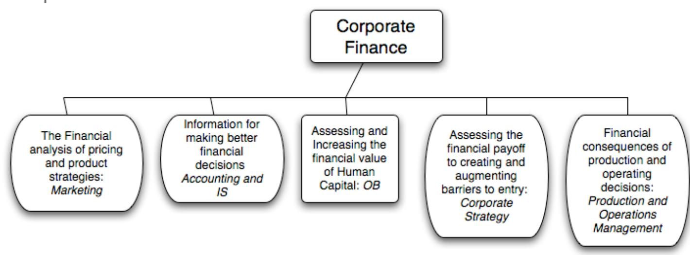
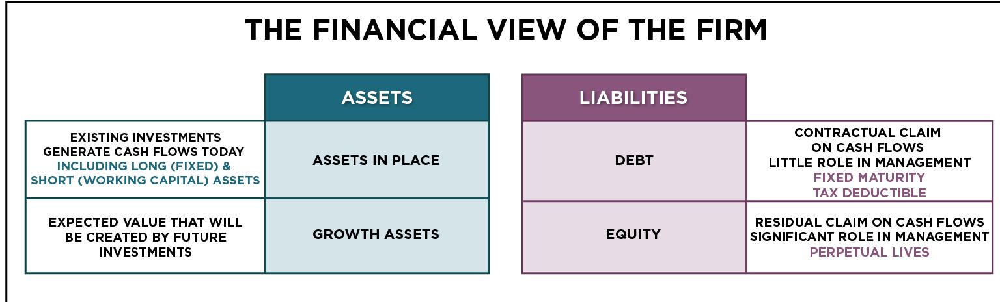
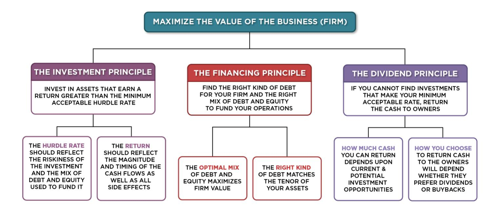
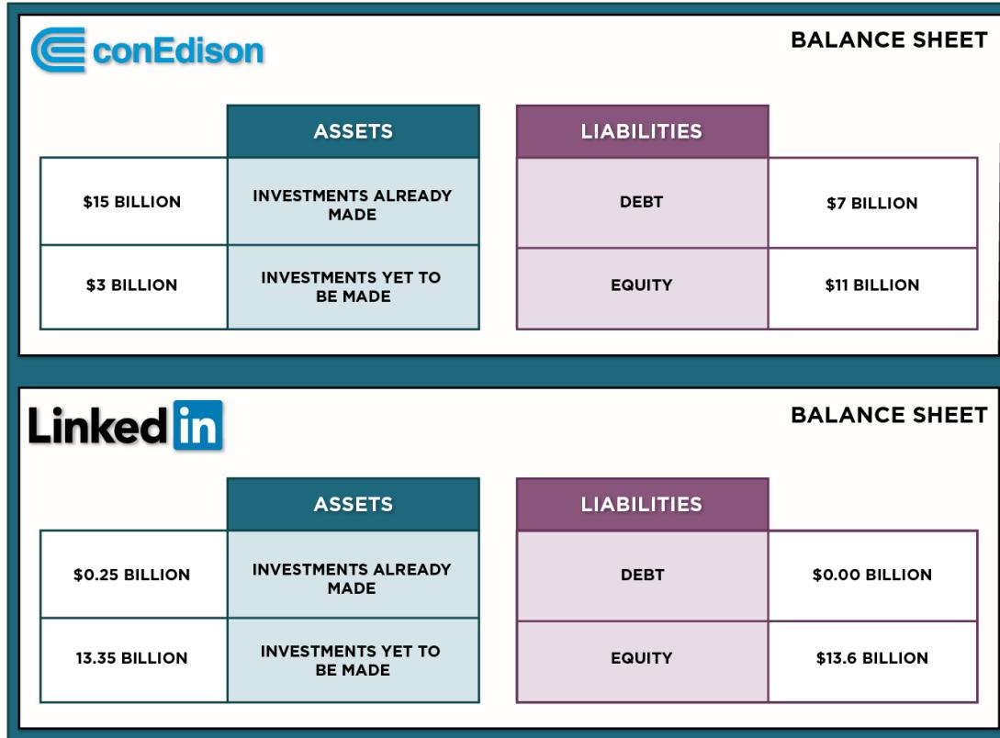
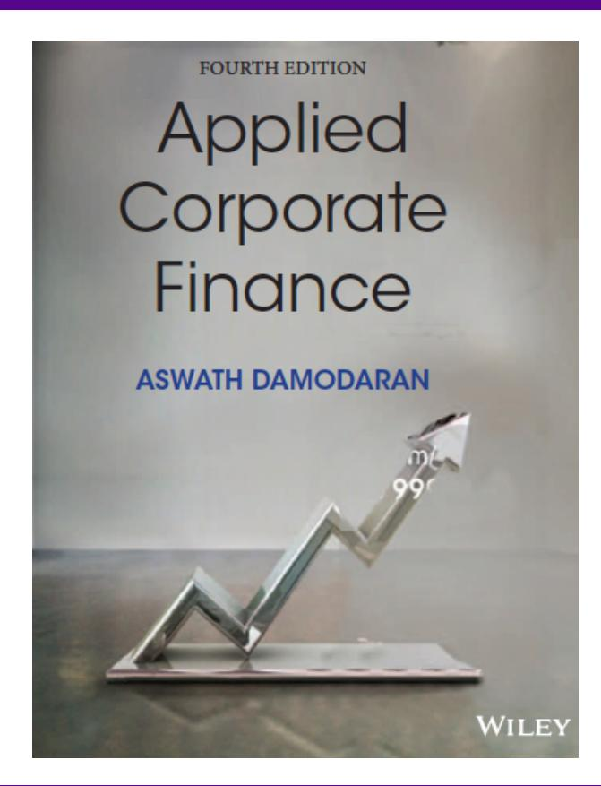

# **SESSION 1: CORPORATE FINANCE WHAT IS IT?**

## **WHAT IS CORPORATE FINANCE?**

- Every decision that a business makes has financial implications, and any decision which affects the finances of a business is a corporate finance decision.
- Defined broadly, everything that a business does fits under the rubric of corporate finance.

## **OBJECTIVES**

- To give you the capacity to understand the theory and apply, in real world situations, the techniques that have been developed in corporate finance. o Motto for class: If it cannot be applied, who cares?.
- To give you the big picture of corporate finance so that you can understand how things fit together. o Motto for class: You can forget the details, but don't miss the storyline.
- To show you that corporate finance is fun. o Motto for class: Are we having fun yet?

### **THE TRADITIONAL ACCOUNTING BALANCE SHEET**

## THE BALANCE SHEET

| ASSETS                                                   |                       |
|----------------------------------------------------------|-----------------------|
| LONG-LIVED REAL ASSETS                                   | FIXED ASSETS          |
| SHORT-LIVED ASSETS                                       | CURRENT ASSETS        |
| INVESTMENT IN SECURITIES & ASSETS OF OTHER FIRMS         | FINANCIAL INVESTMENTS |
| ASSETS WHICH ARE NOT PHYSICAL, LIKE PATENTS & TRADEMARKS | INTANGIBLE ASSETS     |

| <b>LIABILITIES</b>         |                                           |
|----------------------------|-------------------------------------------|
| <b>CURRENT LIABILITIES</b> | <b>SHORT-TERM LIABILITIES OF THE FIRM</b> |
| <b>DEBT</b>                | <b>DEBT OBLIGATIONS</b>                   |
| <b>OTHER LIABILITIES</b>   | <b>OTHER LONG-TERM OBLIGATIONS</b>        |
| <b>EQUITY</b>              | <b>EQUITY INVESTMENT IN FIRM</b>          |

### **THE FINANCIAL VIEW OF THE FIRM**

## THE FINANCIAL VIEW OF THE FIRM

### **FIRST PRINCIPLES & THE BIG PICTURE**

# THEME 1: CORPORATE FINANCE IS “COMMON SENSE”

- • There is nothing earth shattering about any of the first principles that govern corporate finance. After all, arguing that taking investments that make 9% with funds that cost 10% to raise seems to be stating the obvious (the investment decision), as is noting that it is better to find a funding mix which costs 10% instead of 11% (the financing decision) or positing that if most of your investment opportunities generate returns less than your cost of funding, it is best to return the cash to the owners of the business and shrink the business.
- • Shrewd business people, notwithstanding their lack of exposure to corporate finance theory, have always recognized these fundamentals and put them into practice.

## **THEME 2: CORPORATE FINANCE IS FOCUSED…**

- It is the focus on maximizing the value of the business that gives corporate finance its focus. As a result of this singular objective, we can o Choose the "right" investment decision rule to use, given a menu of such rules. o Determine the "right" mix of debt and equity for a specific business o Examine the "right" amount of cash that should be returned to the owners of a business and the "right" amount to hold back as a cash balance.
- This certitude does come at a cost. To the extent that you accept the objective of maximizing firm value, everything in corporate finance makes complete sense. If you do not, nothing will.

# THEME 3: THE FOCUS CHANGES ACROSS THE LIFE CYCLE...

## **THEME 4: CORPORATE FINANCE IS UNIVERSAL…**

- Every business, small or large, public or private, US or emerging market, has to make investment, financing and dividend decisions.
- The objective in corporate finance for all of these businesses remains the same: maximizing value.
- While the constraints and challenges that firms face can vary dramatically across firms, the first principles do not change. o Apply to both public and private companies, though they face different constraints. o Apply to firms in both developed and emerging markets

## **THEME 5: IF YOU VIOLATE 1ST PRINCIPLES, YOU WILL PAY!**

- There are some investors/analysts/managers who convince themselves that the first principles dont apply to them because of their superior education, standing or past successes, and then proceed to put into place strategies or schemes that violate first principles.
- Sooner or later, these strategies will blow up and create huge costs.
- Almost every corporate disaster or bubble has its origins in a violation of first principles.

## **AND IT WILL BE APPLIED…**

Applied Corporate Finance

### **Disney**

Sector: Entertainment Incorporated in: US Operations: Multinational Size: Large market cap

### **Vale**

Sector: Mining/Metals Incorporated in: Brazil Operations: Multinational Size: Large market cap Other: Government stake

### **Tata Motors**

Sector: Automotive Incorporated in: India Operations: Multinational Size: Mid market cap Other: Family Group

#### **Baidu**

Sector: Online Search Incorporated in: Cayman Isl Operations: China Size: Mid market cap Other: Shell company (VIE)

### **Deutsche Bank**

Sector: Bank/ Investment Bank Incorporated in: Germany Operations: Multinational Size: Large market cap Other: Regulated

#### **Bookscape**

Sector: Book Retail Incorporated in: US Operations: New York Other: Privately owned

# SESSION 1: CORPORATE FINANCE WHAT IS IT?

## SET UP AND OBJECTIVE

1. 1. WHAT IS CORPORATE FINANCE?
2. 2. THE OBJECTIVE: UTOPIA AND LET DOWN
3. 3. THE OBJECTIVE: REALITY AND REACTION

### THE INVESTMENT PRINCIPLE

INVEST IN ASSETS THAT EARN A RETURN GREATER THAN THE MINIMUM ACCEPTABLE HURDLE RATE

#### HURDLE RATE

1. 4. DEFINE & MEASURE RISK
2. 5. THE RISK FREE RATE
3. 6. EQUITY RISK PREMIUMS
4. 7. COUNTRY RISK PREMIUMS
5. 8. REGRESSION BETAS
6. 9. BETA FUNDAMENTALS
7. 10. BOTTOM-UP BETAS
8. 11. THE "RIGHT" BETA
9. 12. DEBT: MEASURE & COST
10. 13. FINANCING WEIGHTS

#### INVESTMENT RETURN

1. 14. EARNINGS AND CASH FLOWS
2. 15. TIME WEIGHTING CASH FLOWS
3. 16. LOOSE ENDS

### THE FINANCING PRINCIPLE

FIND THE RIGHT KIND OF DEBT FOR YOUR FIRM AND THE RIGHT MIX OF DEBT AND EQUITY TO FUND YOUR OPERATIONS

#### FINANCING MIX

1. 17. THE TRADE OFF
2. 18. COST OF CAPITAL: APPROACH
3. 19. COST OF CAPITAL: FOLLOW UP
4. 20. COST OF CAPITAL: WRAP UP
5. 21. ALTERNATIVE APPROACHES
6. 22. MOVING TO THE OPTIMAL

#### FINANCING TYPE

1. 23. THE RIGHT FINANCING

1. 36. FINAL THOUGHTS

### THE DIVIDEND PRINCIPLE

IF YOU CANNOT FIND INVESTMENTS THAT MAKE YOUR MINIMUM ACCEPTABLE RATE, RETURN THE CASH TO OWNERS

#### DIVIDEND POLICY

1. 24. TRENDS & MEASURES
2. 25. THE TRADE OFF
3. 26. ASSESSMENTS
4. 27. ACTION & FOLLOW UP
5. 28. THE END GAME

#### VALUATION

1. 29. FIRST STEPS
2. 30. CASH FLOWS
3. 31. GROWTH
4. 32. TERMINAL VALUE
5. 33. TO VALUE PER SHARE
6. 34. VALUE OF CONTROL
7. 35. RELATIVE VALUATION

**Optional: Read Chapter 1**