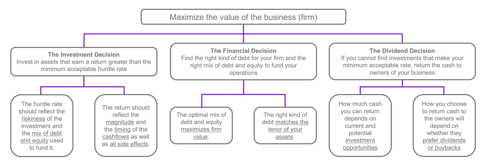
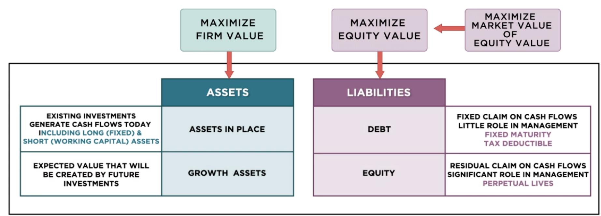
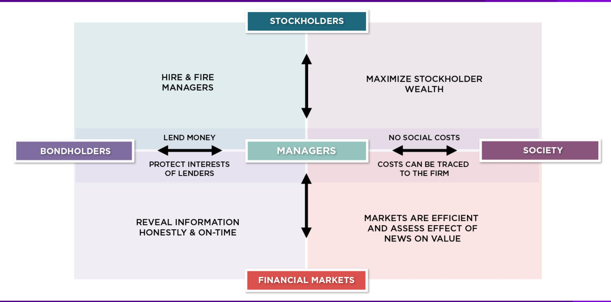
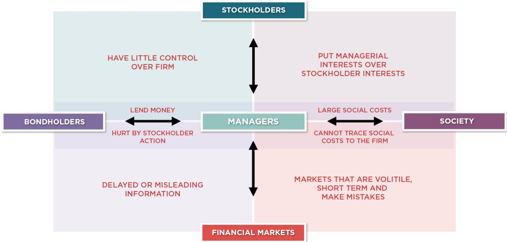
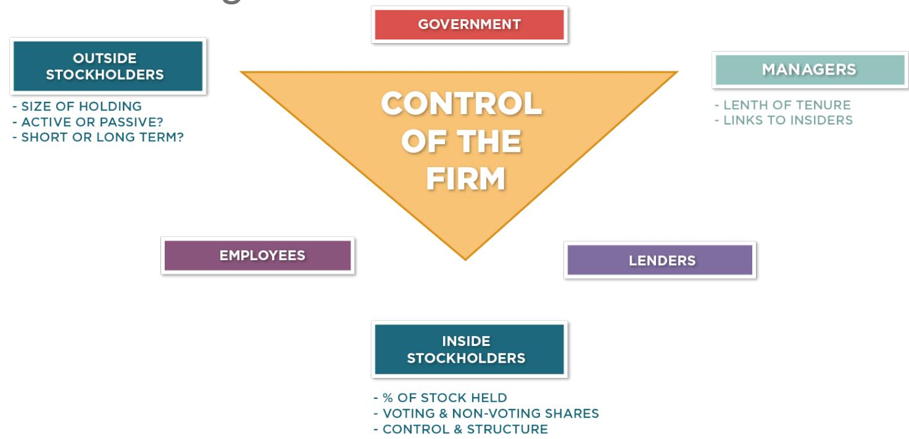
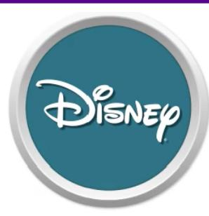
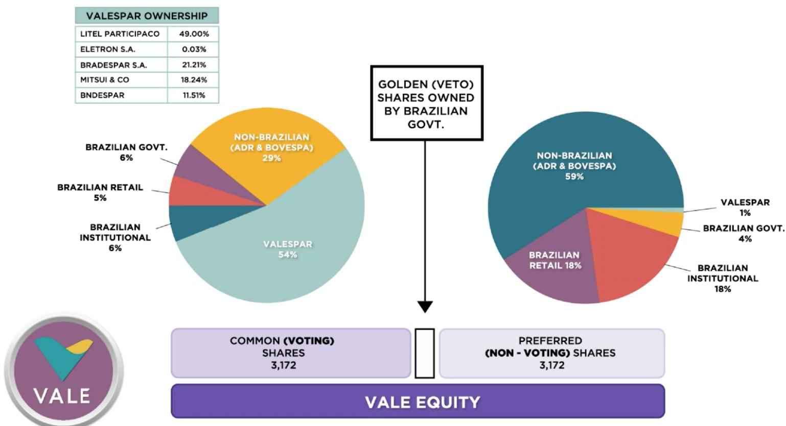
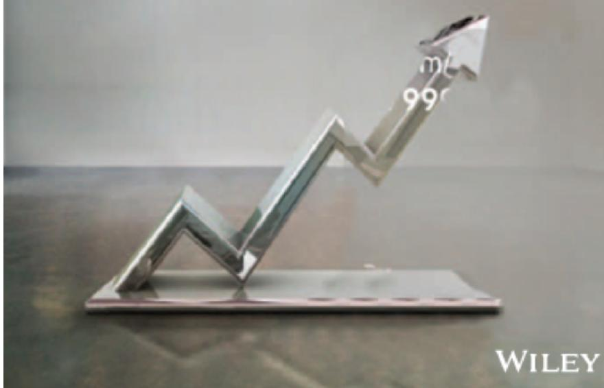

# **SESSION 02: THE OBJECTIVE: UTOPIA AND LET DOWN**

If you don't know where you are going, it does not matter how you get there!

### **SESSION 02: THE OBJECTIVE: UTOPIA AND LET DOWN**

### **FIRST PRINCIPLES**

# **THE OBJECTIVE IN DECISION MAKING**

- In traditional corporate finance, the objective in decision making is to maximize the value of the firm.
- A narrower objective is to maximize stockholder wealth. When the stock is traded and markets are viewed to be efficient, the objective is to maximize the stock.

# **THE CLASSICAL OBJECTIVE**

# WHAT CAN GO WRONG?

# WHO'S ON BOARD? THE DISNEY EXPERIENCE (1997)

## 1997 - WHO'S ON BOARD?

### BOARD OF DIRECTORS

*Reveta F. Bowers*1,2,4,5

Head of School  
Center for Early Education

*Roy E. Disney*3

Vice Chairman  
The Walt Disney Company

*Michael D. Eisner*3

Chairman and Chief Executive Officer  
The Walt Disney Company

*Stanley P. Gold*2,4,5

President and Chief Executive Officer  
Shamrock Holdings, Inc.

*Sanford M. Litvack*

Senior Executive Vice President and Chief of  
Corporate Operations  
The Walt Disney Company

*Ignacio E. Lozano, Jr.*1,2,4

Chairman  
Lozano Communications

*George J. Mitchell*1,5

Special Counsel  
Verner, Liipfert, Bernard, McPherson and Hand

*Thomas S. Murphy*2,3

Former Chairman  
Capital Cities/ABC, Inc.

3Member of Nominating Committee

4Member of Executive Performance Subcommittee of the Compensation Committee

*Richard A. Nunis*

Chairman  
Walt Disney Attractions

*Leo J. O'Donovan, S.J.*1

President  
Georgetown University

*Sidney Poitier*2,4

Chief Executive Officer  
Verdon-Cedric Productions, Ltd.

*Irwin E. Russell*2

Attorney at Law

*Robert A.M. Stern*

Senior Partner  
Robert A.M. Stern Architects

*E. Cardon Walker*1

Former Chairman and Chief Executive Officer  
The Walt Disney Company

*Raymond L. Watson*1,2,3

Vice Chairman  
The Irvine Company

*Gary L. Wilson*5

Chairman  
Northwest Airlines Corporation

1Member of Audit Review Committee

2Member of Compensation Committee

3Member of Executive Committee

# **SO, WHAT NEXT? WHEN THE CAT IS IDLE, THE MICE WILL PLAY . . .**

- When managers do not fear stockholders, they will often put their interests over stockholder interests o Greenmail: The (managers of ) target of a hostile takeover buy out the potential acquirer's existing stake, at a price much greater than the price paid by the raider, in return for the signing of a 'standstill' agreement. o Golden Parachutes: Provisions in employment contracts, that allows for the payment of a lump-sum or cash flows over a period, if managers covered by these contracts lose their jobs in a takeover. o Poison Pills: A security, the rights or cashflows on which are triggered by an outside event, generally a hostile takeover, is called a poison pill. o Shark Repellents: Anti-takeover amendments are also aimed at dissuading hostile takeovers, but differ on one very important count. They require the assent of stockholders to be instituted. o Overpaying on takeovers: Acquisitions often are driven by management interests rather than stockholder interests.

# 6 **APPLICATION TEST: WHO OWNS/RUNS YOUR FIRM?**

- Look at: Bloomberg printout HDS for your firm
- Who are the top stockholders in your firm?
- What are the potential conflicts of interest that you see emerging from this stockholding structure?

### **CASE 1: SPLINTERING OF STOCKHOLDERS DISNEY'S TOP STOCKHOLDERS IN 2003**

## 2003 - DISNEY'S TOP STOCKHOLDERS

| CHELP for explanation.                                                |                      |                  |         | dgp Equity HDS |                    |         |  |
|-----------------------------------------------------------------------|----------------------|------------------|---------|----------------|--------------------|---------|--|
| Enter #GDP to select aggregate portfolio and see detailed information |                      |                  |         | CUSIP 25468710 |                    |         |  |
| 00118658224-000                                                       |                      | HOLDINGS SEARCH  |         | Page           |                    | 1 / 100 |  |
| DIS US                                                                |                      | DISHEY (WALT) CO |         |                |                    |         |  |
| Holder name                                                           | Portfolio Name       | Source           | Held    | Percent Durtsd | Latest Change Date | Filing  |  |
| 1BARCLAYS GLOBAL                                                      | BARCLAYS BANK PLC    | 13F              | 83,630M | 4.095          | 1,750M 09/02       |         |  |
| * 2CITIGROUP INC                                                      | CITIGROUP INCORPORAT | 13F              | 62,857M | 3.078          | 4,811M 09/02       |         |  |
| * 3FIDELITY MANAGEM                                                   | FIDELITY MANAGEMENT  | 13F              | 56,125M | 2.748          | 5,992M 09/02       |         |  |
| 4STATE STREET                                                         | STATE STREET CORPORA | 13F              | 54,635M | 2.675          | 2,239M 09/02       |         |  |
| * 5SOUTHEASTRN ASST                                                   | SOUTHEASTERN ASSET M | 13F              | 47,333M | 2.318          | 14,604M 09/02      |         |  |
| 6ST FARM MU AUTO                                                      | STATE FARM MUTUAL AU | 13F              | 41,938M | 2.054          | 120,599 09/02      |         |  |
| 7WANGUARD GROUP                                                       | WANGUARD GROUP INC   | 13F              | 34,721M | 1.700          | -83,839 09/02      |         |  |
| 8MELLON BANK N A                                                      | MELLON BANK CORP     | 13F              | 32,693M | 1.601          | 957,489 09/02      |         |  |
| 9PUTNAM INVEST                                                        | PUTNAM INVESTMENT MA | 13F              | 28,153M | 1.379          | -11,468M 09/02     |         |  |
| 10LORD ABBETT & CO                                                    | LORD ABBETT & CO     | 13F              | 24,541M | 1.202          | 5,385M 09/02       |         |  |
| 11MONTAG CALDWELL                                                     | MONTAG & CALDWELL IN | 13F              | 24,466M | 1.198          | -11,373M 09/02     |         |  |
| 12DEUTSCHE BANK AK                                                    | DEUTSCHE BANK AG     | 13F              | 23,239M | 1.138          | -5,002M 09/02      |         |  |
| 13MORGAN STANLEY                                                      | MORGAN STANLEY       | 13F              | 19,655M | 0.962          | 3,482M 09/02       |         |  |
| 14PRICE T ROWE                                                        | T ROWE PRICE ASSOCIA | 13F              | 19,133M | 0.937          | 2,925M 09/02       |         |  |
| 15ROY EDWARD DISNE                                                    | n/a                  | PROXY            | 17,547M | 0.859-126,710  | 12/01              |         |  |
| 16PANA FINANCIAL                                                      | ALLIANCE CAPITAL MAN | 13F              | 14,283M | 0.699          | 69,353 09/02       |         |  |
| 17UP MORGAN CHASE                                                     | JP MORGAN CHASE & CO | 13F              | 14,209M | 0.696-462,791  | 09/02              |         |  |
| Sub-totals for current page!                                          |                      |                  |         | 599,159M       | 29.340             |         |  |

\* Honey market directory info available. Select portfolio, then hit IPGDP.

Distribution as 2 8777 8000 Distrib: 5511 3048 4500 Europe 44 20 7739 7500 Centerly 49 69 500810  
 Hong Kong 052 2577 6000 Japan 01 3 3281 0000 Singapore 05 212 1000 U.S. 1 212 318 2000  
 Copyright 2002 Blooming L.P. HODP-275-0 20-Sep-02 17:41:58

#### **CASE 2: VOTING VERSUS NON-VOTING SHARES & GOLDEN SHARES VALE**

Vale has eleven members on its board of directors, ten of whom were nominated by Valepar and the board was chaired by Don Conrado, the CEO of Valepar.

# CASE 3: CROSS AND PYRAMID HOLDINGS TATA MOTOR'S TOP STOCKHOLDERS IN 2013

## TOP STOCKHOLDERS IN 2013

| TTMT IN Equity                                                                                                                                                                                                                                                                            |                      | 25 Settings   |     | 99 Feedback  |       | Holdings: Current |          |                 |  |                   |  |
|-------------------------------------------------------------------------------------------------------------------------------------------------------------------------------------------------------------------------------------------------------------------------------------------|----------------------|---------------|-----|--------------|-------|-------------------|----------|-----------------|--|-------------------|--|
| Tata Motors Ltd                                                                                                                                                                                                                                                                           |                      |               |     |              |       | ISIN INE155A01022 |          |                 |  |                   |  |
| 1) Current                                                                                                                                                                                                                                                                                |                      | 2) Historical |     | 3) Matrix    |       | 4) Ownership      |          | 5) Transactions |  | 6) Options        |  |
| Search Name                                                                                                                                                                                                                                                                               |                      | --            |     | 2) Save      |       | 2) Delete         |          | 3) Saved        |  | 24) Refine Search |  |
| Text Search                                                                                                                                                                                                                                                                               |                      |               |     | Holder Group |       | All Holders       |          |                 |  | 20 Export         |  |
| Holder Name                                                                                                                                                                                                                                                                               | Portfolio Name       | Source        | Opt | Amt Held     | % Out | Latest Chg        | File Dt  |                 |  |                   |  |
| 1. TATA SONS LTD                                                                                                                                                                                                                                                                          | n/a                  | Co File       |     | 702,333.345  | 26.07 | 0                 | 09/30/13 | ✓               |  |                   |  |
| 2. CITIBANK NA                                                                                                                                                                                                                                                                            | n/a                  | 20F           |     | 446,246.135  | 16.56 | 0                 | 06/30/12 | ✓               |  |                   |  |
| 3. LIFE INSURANCE CORP OF I                                                                                                                                                                                                                                                               | n/a                  | Co File       |     | 168,754.477  | 6.26  | -119,728,333      | 09/30/13 | ✓               |  |                   |  |
| 4. TATA STEEL LTD                                                                                                                                                                                                                                                                         | n/a                  | Co File       |     | 147,810.695  | 5.49  | 0                 | 09/30/13 | ✓               |  |                   |  |
| 5. CAPITAL GROUP COMPANIES                                                                                                                                                                                                                                                                | n/a                  | ULT-AGG       |     | 97,689.911   | 3.63  | -877,871          | 09/30/13 |                 |  |                   |  |
| 6. TATA INDUSTRIES LTD                                                                                                                                                                                                                                                                    | n/a                  | Co File       |     | 68,436.485   | 2.54  | 0                 | 09/30/13 | ✓               |  |                   |  |
| 7. VANGUARD GROUP INC                                                                                                                                                                                                                                                                     | n/a                  | ULT-AGG       |     | 41,285.983   | 1.53  | 4,535,434         | 09/30/13 |                 |  |                   |  |
| 8. PRUDENTIAL PLC                                                                                                                                                                                                                                                                         | n/a                  | ULT-AGG       |     | 34,080.063   | 1.26  | 147,814           | 09/30/13 |                 |  |                   |  |
| 9. GIC PRIVATE LIMITED                                                                                                                                                                                                                                                                    | n/a                  | ULT-AGG       |     | 30,428.428   | 1.13  | 0                 | 09/30/13 |                 |  |                   |  |
| 10. WILLIAM BLAIR & COMPANY                                                                                                                                                                                                                                                               | WILLIAM BLAIR & COMP | 13F           |     | 30,093.943   | 1.12  | 3,997,149         | 06/30/13 | ✓               |  |                   |  |
| 11. JPMORGAN CHASE & CO                                                                                                                                                                                                                                                                   | n/a                  | ULT-AGG       |     | 24,918.852   | 0.92  | -2,157,750        | 08/31/13 |                 |  |                   |  |
| 12. SCHRODER INVESTMENT MGM                                                                                                                                                                                                                                                               | Multiple Portfolios  | MF-AGG        |     | 19,136.665   | 0.71  | 2,578,904         | 06/30/13 |                 |  |                   |  |
| 13. BLACKROCK                                                                                                                                                                                                                                                                             | n/a                  | ULT-AGG       |     | 14,100.725   | 0.52  | -265,173          | 10/31/13 |                 |  |                   |  |
| 14. NORGES BANK                                                                                                                                                                                                                                                                           | Multiple Portfolios  | MF-AGG        |     | 10,762.579   | 0.40  | 0                 | 12/31/12 |                 |  |                   |  |
| 15. T ROWE PRICE ASSOCIATES                                                                                                                                                                                                                                                               | Multiple Portfolios  | MF-AGG        |     | 10,056.366   | 0.37  | 324,353           | 09/30/13 |                 |  |                   |  |
| 16. TATA INVESTMENT CORP LTD                                                                                                                                                                                                                                                              | n/a                  | Co File       |     | 10,025.000   | 0.37  | 0                 | 09/30/13 | ✓               |  |                   |  |
| 17. SBI LIFE INSURANCE CO LTD                                                                                                                                                                                                                                                             | Multiple Portfolios  | MF-AGG        |     | 9,256.170    | 0.34  | -151,323          | 09/30/13 |                 |  |                   |  |
| 18. ALLIANZ ASSET MANAGEMENT                                                                                                                                                                                                                                                              | n/a                  | ULT-AGG       |     | 8,129.923    | 0.30  | 2,071,551         | 09/30/13 |                 |  |                   |  |
| % Out 76.19                                                                                                                                                                                                                                                                               |                      |               |     |              |       | Zoom 100%         |          |                 |  |                   |  |
| Australia 61 2 9777 8600 Brazil 5511 3048 4500 Europe 44 20 7330 7500 Germany 49 69 9204 1210 Hong Kong 852 2977 6000 Japan 81 3 3201 8900 Singapore 65 6212 1000 U.S. 1 212 318 2000 Copyright 2013 Bloomberg Finance L.P. SN 636136 EST GMT-5:00 G627-2830-0 04-Nov-2013 12:31:34 |                      |               |     |              |       |                   |          |                 |  |                   |  |

### **CASE 4: LEGAL RIGHTS AND CORPORATE STRUCTURES BAIDU**

- The Board: The company has six directors, one of whom is Robin Li, who is the founder/CEO of Baidu. Mr. Li also owns a majority stake of Class B shares, which have ten times the voting rights of Class A shares, granting him effective control of the company.
- The structure: Baidu is a Chinese company, but it is incorporated in the Cayman Islands, its primary stock listing is on the NASDAQ and the listed company is structured as a shell company, to get around Chinese government restrictions of foreign investors holding shares in Chinese corporations.
- The legal system: Baidu's operating counterpart in China is structured as a Variable Interest Entity (VIE), and it is unclear how much legal power the shareholders in the shell company have to enforce changes at the VIE.

# **THINGS CHANGE . . . DISNEY'S TOP STOCKHOLDERS IN 2009**

| Walt Disney Co/The |                       |                    |                 |                      |             | CUSIP 25468710 |         |         |  |
|--------------------|-----------------------|--------------------|-----------------|----------------------|-------------|----------------|---------|---------|--|
| 21) Sources        | 22) Types             | 23) Countries      | 24) Metro Areas | 25) Advanced Filters | Name Filter | Sourt By       | Mkt Val |         |  |
|                    | Holder Name           | Portfolio Name     | Source          | Mkt Val              | % Out       | Mkt Val        | Chg     | File Dt |  |
| 1)                 | JOBS STEVEN PAUL      | n/a                | Form 4          | 3.34BLN              | 7.46        | 0              |         | 5/5/06  |  |
| 2)                 | FIDELITY MANAGEMENT & | FIDELITY MANAGEMEN | 13F             | 2.05BLN              | 4.58        | -36.12MLN      |         | 9/30/08 |  |
| 3)                 | STATE STREET CORP     | STATE STREET CORPO | 13F             | 1.7BLN               | 3.79        | -18.6MLN       |         | 9/30/08 |  |
| 4)                 | BARCLAYS GLOBAL INVES | BARCLAYS GLOBAL IN | 13F             | 1.66BLN              | 3.70        | -160.12MLN     |         | 9/30/08 |  |
| 5)                 | VANGUARD GROUP INC    | VANGUARD GROUP IN  | 13F             | 1.38BLN              | 3.08        | -6.82MLN       |         | 9/30/08 |  |
| 6)                 | SOUTHEASTERN ASSET M  | SOUTHEASTERN ASSE  | 13F             | 1.12BLN              | 2.50        | -14.03MLN      |         | 9/30/08 |  |
| 7)                 | STATE FARM MUTUAL AU  | STATE FARM MUTUAL  | 13F             | 1.02BLN              | 2.28        | 0              |         | 9/30/08 |  |
| 8)                 | WELLINGTON MANAGEMEN  | WELLINGTON MANAGE  | 13F             | 939.38MLN            | 2.09        | 110.6MLN       |         | 9/30/08 |  |
| 9)                 | CLEARBRIDGE ADVISORS  | CLEARBRIDGE ADVISO | 13F             | 815.91MLN            | 1.82        | -47.04MLN      |         | 9/30/08 |  |
| 10)                | JP MORGAN CHASE & CO  | JP MORGAN CHASE &  | 13F             | 693.31MLN            | 1.55        | -18.89MLN      |         | 9/30/08 |  |
| 11)                | MASSACHUSETTS FINANCI | MASSACHUSETTS FINA | 13F             | 682.16MLN            | 1.52        | 112.29MLN      |         | 9/30/08 |  |
| 12)                | BANK OF NEW YORK MELL | BANK OF NEW YORK   | 13F             | 681.68MLN            | 1.52        | -57.13MLN      |         | 9/30/08 |  |
| 13)                | NORTHERN TRUST CORP   | NORTHERN TRUST CO  | 13F             | 610.26MLN            | 1.36        | -4.81MLN       |         | 9/30/08 |  |
| 14)                | AXA                   | AXA                | 13F             | 486.28MLN            | 1.08        | 47.05MLN       |         | 9/30/08 |  |
| 15)                | BLACKROCK INVESTMENT  | BLACKROCK INVESTME | 13F             | 476.12MLN            | 1.06        | -47.11MLN      |         | 9/30/08 |  |
| 16)                | JENNISON ASSOCIATES L | JENNISON ASSOCIATE | 13F             | 428.85MLN            | 0.96        | -102.77MLN     |         | 9/30/08 |  |
| 17)                | T ROWE PRICE ASSOCIAT | T ROWE PRICE ASSOC | 13F             | 351.61MLN            | 0.78        | -9.94MLN       |         | 9/30/08 |  |

## Applied Corporate Finance

**Optional: Read** Chapter 2

**Task** Assess corporate governance at your company

