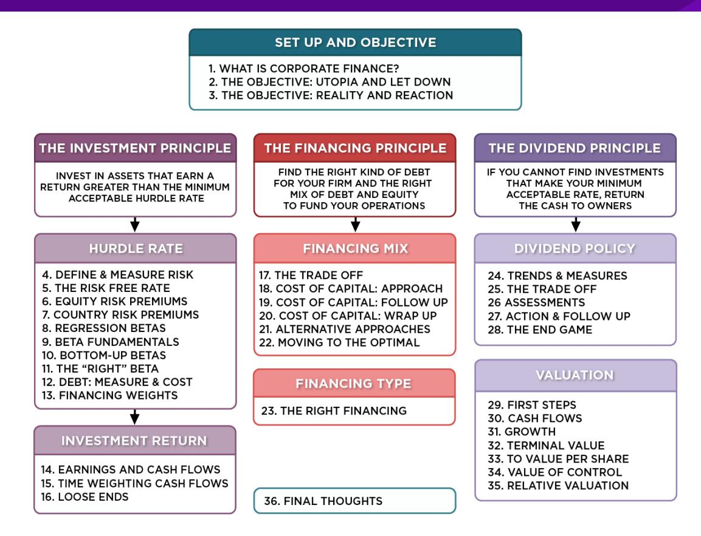
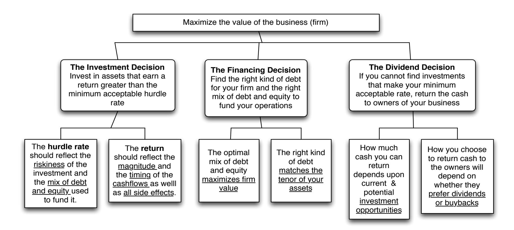
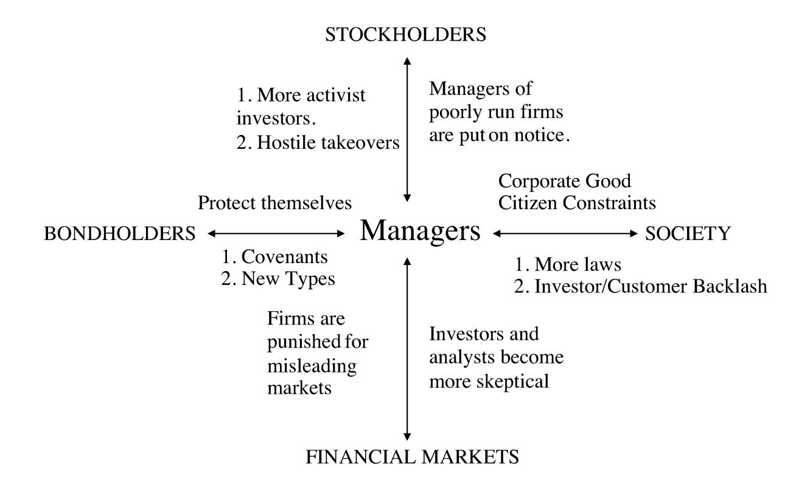
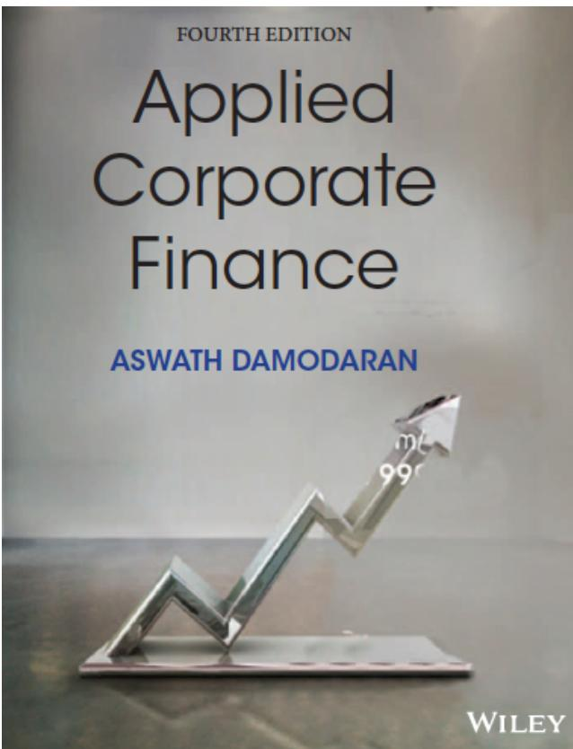

# **SESSION 3: THE OBJECTIVE: REALITY AND REACTION**

Reality intrudes!

## **SESSION 3: THE OBJECTIVE: REALITY AND REACTION**

## **FIRST PRINCIPLES**

### **WHEN TRADITIONAL CORPORATE FINANCIAL THEORY BREAKS DOWN, THE SOLUTION IS:**

- To choose a different mechanism for corporate governance, i.e., assign the responsibility for monitoring managers to someone other than stockholders.
- To choose a different objective for the firm.
- To maximize stock price, but reduce the potential for conflict and breakdown: o Making managers (decision makers) and employees into stockholders o Protect lenders from expropriation o By providing information honestly and promptly to financial markets o Minimize social costs

# **I. AN ALTERNATIVE CORPORATE GOVERNANCE SYSTEM**

- Germany and Japan developed a different mechanism for corporate governance, based upon corporate cross holdings. o In Germany, the banks form the core of this system. o In Japan, it is the keiretsus o Other Asian countries have modeled their system after Japan, with family companies forming the core of the new corporate families
- At their best, the most efficient firms in the group work at bringing the less efficient firms up to par. They provide a corporate welfare system that makes for a more stable corporate structure
- At their worst, the least efficient and poorly run firms in the group pull down the most efficient and best run firms down. The nature of the cross holdings makes its very difficult for outsiders (including investors in these firms) to figure out how well or badly the group is doing.

# **II. CHOOSE A DIFFERENT OBJECTIVE FUNCTION**

- Firms can always focus on a different objective function. Examples would include o maximizing earnings o maximizing revenues o maximizing firm size o maximizing market share o maximizing EVA
- The key thing to remember is that these are intermediate objective functions. o To the degree that they are correlated with the long term health and value of the company, they work well. o To the degree that they do not, the firm can end up with a disaster

# **III. A MARKET BASED SOLUTION**

# **DISNEY: EISNER'S RISE & FALL FROM GRACE**

- In his early years at Disney, Michael Eisner brought about long-delayed changes in the company and put it on the path to being an entertainment giant that it is today. His success allowed him to consolidate power and the boards that he created were increasingly captive ones (see the 1997 board).
- In 1996, Eisner spearheaded the push to buy ABC and the board rubberstamped his decision, as they had with other major decisions. In the years following, the company ran into problems both on its ABC acquisition and on its other operations and stockholders started to get restive, especially as the stock price halved between 1998 and 2002.
- In 2003, Roy Disney and Stanley Gold resigned from the Disney board, arguing against Eisner's autocratic style.
- In early 2004, Comcast made a hostile bid for Disney and later in the year, 43% of Disney shareholders withheld their votes for Eisner's reelection to the board of directors. Following that vote, the board of directors at Disney voted unanimously to elect George Mitchell as the Chair of the board, replacing Eisner, who vowed to stay on as CEO.
- In October 2005, Eisner stepped down as CEO, to be replaced by Bob Iger.

### **A MARKET SOLUTION: EISNER**'**S EXIT… AND A NEW AGE DAWNS? DISNEY**'**S BOARD IN 2008**

## A MARKET SOLUTION: DISNEY'S BOARD - 2008

| <i>Board Members</i>              | <i>Occupation</i>                                      |
|-----------------------------------|--------------------------------------------------------|
| John E. Pepper, Jr. (Chairman) | Retired Chairman and CEO, Procter & Gamble Co.         |
| Susan E. Arnold                   | President, Global Business Units, Procter & Gamble Co. |
| John E. Bryson                    | Retired Chairman and CEO, Edison International         |
| John S. Chen                      | Chairman,, CEO & President, Sybase, Inc.               |
| Judith L. Estrin                  | CEO, JLabs, LLC.                                       |
| Robert A. Iger                    | CEO, Disney                                            |
| Steven P. Jobs                    | CEO, Apple                                             |
| Fred Langhammer                   | Chairman, Global Affairs, The Estee Lauder Companies   |
| Aylwin B. Lewis                   | President and CEO, Potbelly Sandwich Works             |
| Monica Lozano                     | Publisher and CEO, La Opinion                          |
| Robert W. Matschullat             | Retired Vice Chairman and CFO, The Seagram Co.         |
| Orin C. Smith                     | Retired President and CEO, Starbucks Corporation       |

### **BUT AS A CEO'S TENURE LENGTHENS, DOES CORPORATE GOVERNANCE SUFFER?**

- While the board size has stayed compact (at twelve members), there has been only one change since 2008, with Sheryl Sandberg, COO of Facebook, replacing the deceased Steve Jobs.
- The board voted reinstate Iger as chair of the board in 2011, reversing a decision made to separate the CEO and Chair positions after the Eisner years.
- In 2011, Iger announced his intent to step down as CEO in 2015 but Disney's board convinced Iger to stay on as CEO for an extra year, for the "the good of the company".
- There were signs of restiveness among Disney's stockholders, especially those interested in corporate governance. Activist investors (CalSTRS) starting making noise and Institutional Shareholder Services (ISS), which gauges corporate governance at companies, raised red flags about compensation and board monitoring at Disney.

## Applied Corporate Finance

**Optional: Read Chapter 2**

**Task** Based on it's actions, assess your company's objective