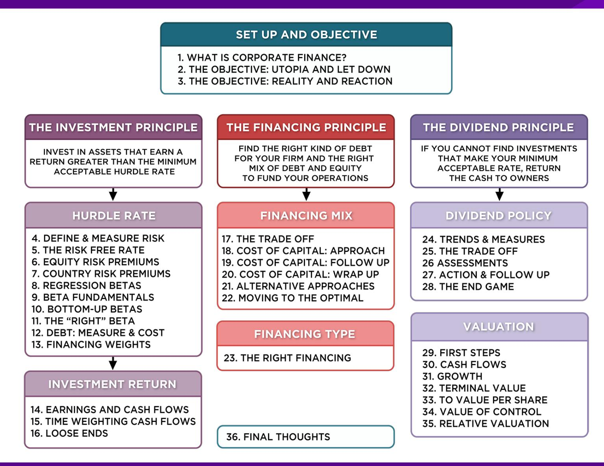
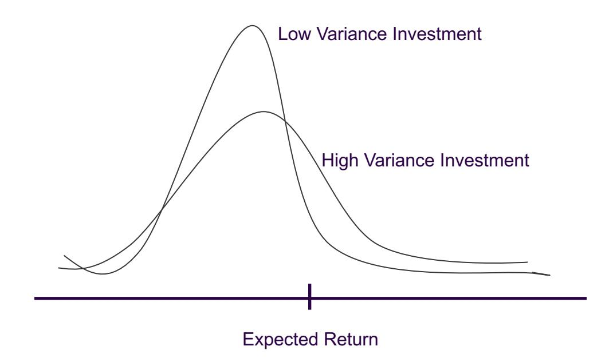
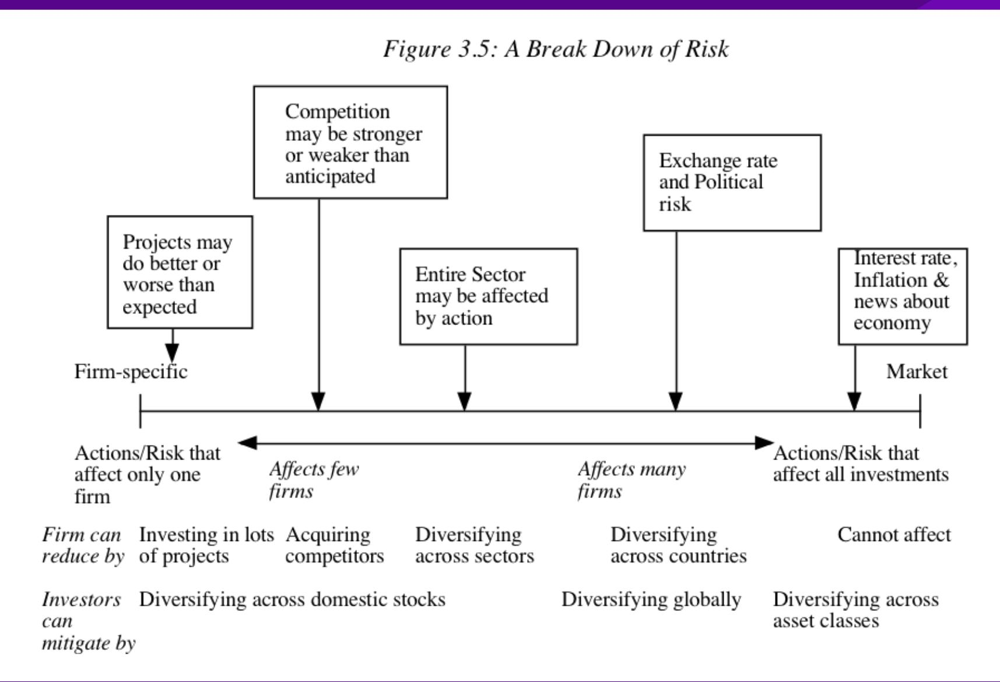

## **SESSION 04: DEFINE AND MEASURE RISK**

Risk = Danger + Opportunity

#### **SESSION 04: DEFINE AND MEASURE RISK**

#### **FIRST PRINCIPLES**

#### **THE NOTION OF A BENCHMARK**

- Since financial resources are finite, there is a hurdle that projects have to cross before being deemed acceptable.
- This hurdle will be higher for riskier projects than for safer projects*.*
- A simple representation of the hurdle rate is as follows: Hurdle rate = Riskless Rate + Risk Premium
- The two basic questions that every risk and return model in finance tries to answer are:
  - How do you measure risk?
  - How do you translate this risk measure into risk premium?

#### **WHAT IS RISK?**

- Risk, in traditional terms, is viewed as a 'negative'. Webster' s dictionary, for instance, defines risk as "exposing to danger or hazard". The Chinese symbols for risk, reproduced below, give a much better description of risk:

# 危机

- The first symbol is the symbol for "danger", while the second is the symbol for "opportunity", making risk a mix of danger and opportunity. You cannot have one, without the other.
- Risk is therefore neither good nor bad. It is just a fact of life. The question that businesses have to address is therefore not whether to avoid risk but how best to incorporate it into their decision making.

### **A GOOD RISK AND RETURN MODEL SHOULD . . .**

- 1. It should come up with a measure of risk that applies to all assets and not be asset-specific.
- 2. It should clearly delineate what types of risk are rewarded and what are not, and provide a rationale for the delineation.
- 3. It should come up with standardized risk measures, i.e., an investor presented with a risk measure for an individual asset should be able to draw conclusions about whether the asset is above-average or below-average risk.
- 4. It should translate the measure of risk into a rate of return that the investor should demand as compensation for bearing the risk.
- 5. It should work well not only at explaining past returns, but also in predicting future expected returns.

### **THE CAPITAL ASSET PRICING MODEL**

- 1. Uses variance of actual returns around an expected return as a measure of risk.
- 2. Specifies that a portion of variance can be diversified away, and that is only the non-diversifiable portion that is rewarded.
- 3. Measures the non-diversifiable risk with beta, which is standardized around one.
- 4. Translates beta into expected return Expected Return = Riskfree rate + Beta \* Risk Premium
- 5. Works as well as the next best alternative in most cases.

#### **1. THE MEAN-VARIANCE FRAMEWORK**

- The variance on any investment measures the disparity between actual and expected returns.

#### **2. THE IMPORTANCE OF DIVERSIFICATION: RISK TYPES**

### **THE ROLE OF THE MARGINAL INVESTOR**

- The marginal investor in a firm is the investor who is most likely to be the buyer or seller on the next trade and to influence the stock price.
- Generally speaking, the marginal investor in a stock has to own a lot of stock and also trade that stock on a regular basis.
- Since trading is required, the largest investor may not be the marginal investor, especially if he or she is a founder/manager of the firm (Larry Ellison at Oracle, Mark Zuckerberg at Facebook).
- **In all risk and return models in finance, we assume that the marginal investor is well diversified**.

#### **3. THE LIMITING CASE: THE MARKET PORTFOLIO**

- The big assumptions & the follow up: Assuming diversification costs nothing (in terms of transactions costs), and that all assets can be traded, the limit of diversification is to hold a portfolio of every single asset in the economy (in proportion to market value). This portfolio is called the market portfolio.
- The consequence: Individual investors will adjust for risk, by adjusting their allocations to this market portfolio and a riskless asset (such as a T-Bill):

| Preferred Risk Level | Allocation                               | Decision                |
|----------------------|------------------------------------------|-------------------------|
| No risk              | 100%                                     | in T-bills              |
| Some risk            | 50% in T-Bills;                          | 50% in Market Portfolio |
| A little more risk   | 25% in T-Bills; 75% in Market Portfolio  |                         |
| Even more risk       | 100% in Market Portfolio                 |                         |
| A risk hog . . .     | Borrow money, invest in Market Portfolio |                         |

#### **4. THE RISK OF AN INDIVIDUAL ASSET**

- The essence: The risk of any asset is the risk that it adds to the market portfolio Statistically, this risk can be measured by how much an asset moves with the market (called the covariance)
- The measure: Beta is a standardized measure of this covariance, obtained by dividing the covariance of any asset with the market by the variance of the market. It is a measure of the non-diversifiable risk for any asset can be measured by the covariance of its returns with returns on a market index, which is defined to be the asset's beta.
- The result: The required return on an investment will be a linear function of its beta:
  - Expected Return = Riskfree Rate+ Beta \* (Expected Return on the Market Portfolio - Riskfree Rate)

#### **ALTERNATIVES TO THE CAPM**

| The CAPM                                                                                                                                                                                                                                                         | The APM                                                                                                                                                                                                                    | Multi-Factor Models                                                                                                                                                         | Proxy Models                                                                                                                                                                                                                                                  |
|------------------------------------------------------------------------------------------------------------------------------------------------------------------------------------------------------------------------------------------------------------------|----------------------------------------------------------------------------------------------------------------------------------------------------------------------------------------------------------------------------|-----------------------------------------------------------------------------------------------------------------------------------------------------------------------------|---------------------------------------------------------------------------------------------------------------------------------------------------------------------------------------------------------------------------------------------------------------|
| If there is 1. no private information 2. no transactions cost the optimal diversified portfolio includes every traded asset. Everyone will hold this <u>market portfolio</u> <b>Market Risk = Risk added by any investment to the market portfolio:</b> | If there are no arbitrage opportunities then the market risk of any asset must be captured by betas relative to factors that affect all investments. <b>Market Risk = Risk exposures of any asset to market factors</b> | Since market risk affects most or all investments, it must come from macro economic factors. <b>Market Risk = Risk exposures of any asset to macro economic factors.</b> | In an efficient market, differences in returns across long periods must be due to market risk differences. Looking for variables correlated with returns should then give us proxies for this risk. <b>Market Risk = Captured by the Proxy Variable(s)</b> |
| Beta of asset relative to Market portfolio (from a regression)                                                                                                                                                                                                   | Betas of asset relative to unspecified market factors (from a factor analysis)                                                                                                                                             | Betas of assets relative to specified macro economic factors (from a regression)                                                                                            | Equation relating returns to proxy variables (from a regression)                                                                                                                                                                                              |

### **LIMITATIONS OF THE CAPM**

- 1. The model makes unrealistic assumptions
- 2. The parameters of the model cannot be estimated precisely
  - Definition of a market index
  - Firm may have changed during the 'estimation' period'
- 3. The model does not work well
  - If the model is right, there should be o a linear relationship between returns and betas o the only variable that should explain returns is beta.
  - The reality is that o the relationship between betas and returns is weak o other variables (size, price/book value) seem to explain differences in returns better.

#### **WHY THE CAPM PERSISTS . . .**

- The CAPM, notwithstanding its many critics and limitations, has survived as the default model for risk in equity valuation and corporate finance. The alternative models that have been presented as better models (APM, Multifactor model) have made inroads in performance evaluation but not in prospective analysis because: o The alternative models (which are richer) do a much better job than the CAPM in explaining past return, but their effectiveness drops off when it comes to estimating expected future returns (because the models tend to shift and change). o The alternative models are more complicated and require more information than the CAPM. o For most companies, the expected returns you get with the the alternative models is not different enough to be worth the extra trouble of estimating four additional betas.

#### **GAUGING THE MARGINAL INVESTOR: DISNEY IN 2009**

| DIS US \$ 1        |                                          | 24.2422 +.7422 D 2s  |        | EquityHDS            |       |                            |         |  |
|--------------------|------------------------------------------|----------------------|--------|----------------------|-------|----------------------------|---------|--|
| DELAY 14:27 Vol    |                                          | 6,135,972 Op 23.81 Z |        | Hi 24.34 T Lo 23.8 T |       | ValTrd 148.014m            |         |  |
| DIS US Equity      |                                          | 95) Saved Searches   |        | 96) Default Settings |       | Page 1/150 Holdings Search |         |  |
| Walt Disney Co/The |                                          |                      |        |                      |       | CUSIP 25468710             |         |  |
| 21) Sources        |                                          | 22) Types            |        | 23) Countries        |       | 24) Metro Areas            |         |  |
| Name Filter        |                                          |                      |        |                      |       | Sort By Mkt Val            |         |  |
|                    | Holder Name                              | Portfolio Name       | Source | Mkt Val              | % Out | Mkt Val Chg                | File Dt |  |
| 1)                 | JOBS STEVEN PAUL                         | n/a                  | Form 4 | 3.34BLN              | 7.46  | 0                          | 5/5/06  |  |
| 2)                 | FIDELITY MANAGEMENT & FIDELITY MANAGEMEN | FIDELITY MANAGEMEN   | 13F    | 2.05BLN              | 4.58  | -36.12MLN                  | 9/30/08 |  |
| 3)                 | STATE STREET CORP                        | STATE STREET CORPO   | 13F    | 1.7BLN               | 3.79  | -18.6MLN                   | 9/30/08 |  |
| 4)                 | BARCLAYS GLOBAL INVES                    | BARCLAYS GLOBAL IN   | 13F    | 1.66BLN              | 3.70  | -160.12MLN                 | 9/30/08 |  |
| 5)                 | VANGUARD GROUP INC                       | VANGUARD GROUP IN    | 13F    | 1.38BLN              | 3.08  | -6.82MLN                   | 9/30/08 |  |
| 6)                 | SOUTHEASTERN ASSET M                     | SOUTHEASTERN ASSE    | 13F    | 1.12BLN              | 2.50  | -14.03MLN                  | 9/30/08 |  |
| 7)                 | STATE FARM MUTUAL AU                     | STATE FARM MUTUAL    | 13F    | 1.02BLN              | 2.28  | 0                          | 9/30/08 |  |
| 8)                 | WELLINGTON MANAGEMEN                     | WELLINGTON MANAGE    | 13F    | 939.38MLN            | 2.09  | 110.6MLN                   | 9/30/08 |  |
| 9)                 | CLEARBRIDGE ADVISORS                     | CLEARBRIDGE ADVISO   | 13F    | 815.91MLN            | 1.82  | -47.04MLN                  | 9/30/08 |  |
| 10)                | JP MORGAN CHASE & CO                     | JP MORGAN CHASE &    | 13F    | 693.31MLN            | 1.55  | -18.89MLN                  | 9/30/08 |  |
| 11)                | MASSACHUSETTS FINANCI                    | MASSACHUSETTS FINA   | 13F    | 682.16MLN            | 1.52  | 112.29MLN                  | 9/30/08 |  |
| 12)                | BANK OF NEW YORK MELL                    | BANK OF NEW YORK     | 13F    | 681.68MLN            | 1.52  | -57.13MLN                  | 9/30/08 |  |
| 13)                | NORTHERN TRUST CORP                      | NORTHERN TRUST CO    | 13F    | 610.26MLN            | 1.36  | -4.81MLN                   | 9/30/08 |  |
| 14)                | AXA                                      | AXA                  | 13F    | 486.28MLN            | 1.08  | 47.05MLN                   | 9/30/08 |  |
| 15)                | BLACKROCK INVESTMENT                     | BLACKROCK INVESTME   | 13F    | 476.12MLN            | 1.06  | -47.11MLN                  | 9/30/08 |  |
| 16)                | JENNISON ASSOCIATES L                    | JENNISON ASSOCIATE   | 13F    | 428.85MLN            | 0.96  | -102.77MLN                 | 9/30/08 |  |
| 17)                | T ROWE PRICE ASSOCIAT                    | T ROWE PRICE ASSOC   | 13F    | 351.61MLN            | 0.78  | -9.94MLN                   | 9/30/08 |  |
| 26) Lates          |                                          |                      |        |                      |       |                            |         |  |

#### **EXTENDING THE ASSESSMENT OF THE INVESTOR BASE**

- In all five of the publicly traded companies that we are looking at, institutions are big holders of the company's stock.

|              | Disney | Deutsche Bank | Vale (preferred) | Tata Motors | Baidu (Class A) |
|--------------|--------|---------------|------------------|-------------|-----------------|
| Institutions | 70.2%  | 40.9%         | 71.2%            | 44%         | 70%             |
| Individuals  | 21.3%  | 58.9%         | 27.8%            | 25%         | 20%             |
| Insiders     | 7.5%   | 0.2%          | 1.0%             | 31%         | 10%             |

|                  | Largest Holder         | Number of institutional investors |
|------------------|------------------------|-----------------------------------|
| Disney           | Laurene Jobs (7.3%)    | 8                                 |
| Deutsche Bank    | Blackrock (4.69%)      | 10                                |
| Vale (preferred) | Aberdeen (7.40%)       | 8                                 |
| Tata Motors      | Tata Sons (26.07%)     | 7                                 |
| Baidu (Class A)  | Capital Group (12.46%) | 10                                |

#### 6 **APPLICATION TEST: WHO IS THE MARGINAL INVESTOR IN YOUR FIRM?**

- Looking at the breakdown of stockholders in your firm, consider whether the marginal investor is o An institutional investor o An individual investor o An insider

B DES Page 3 PB Page 13

## Applied Corporate Finance

Optional: Read Chapter 3

**Task** Who is the marginal investor in your firm?

