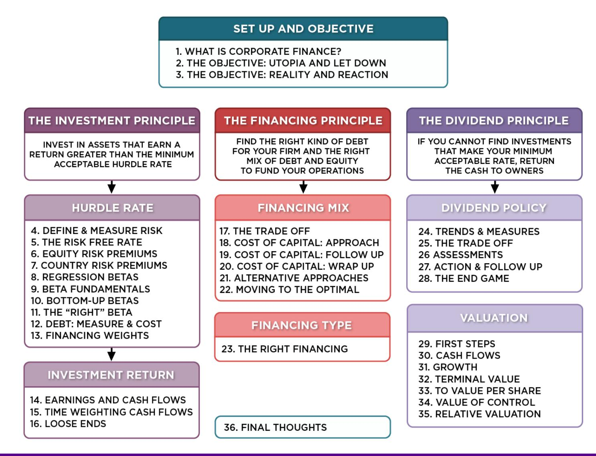
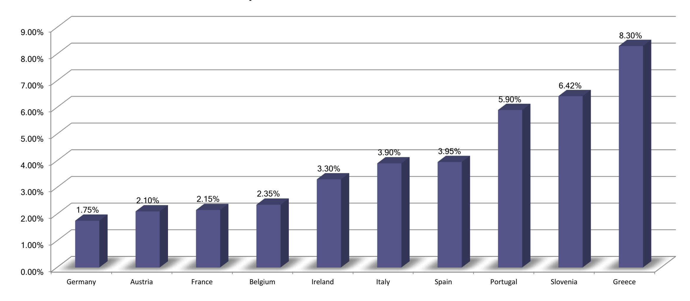
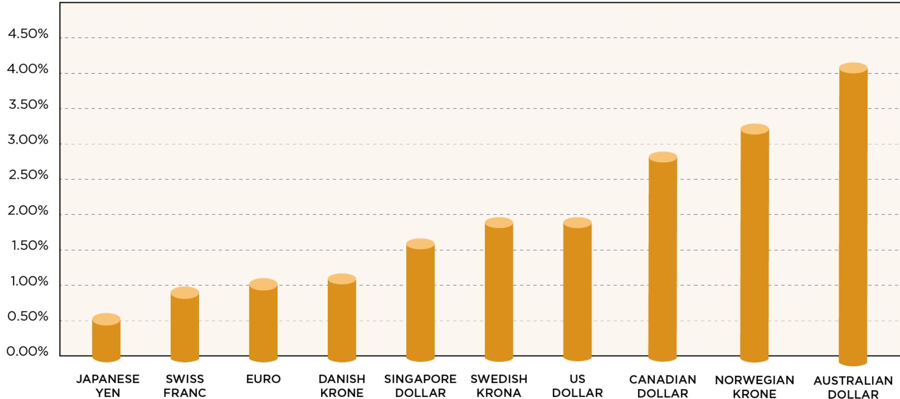
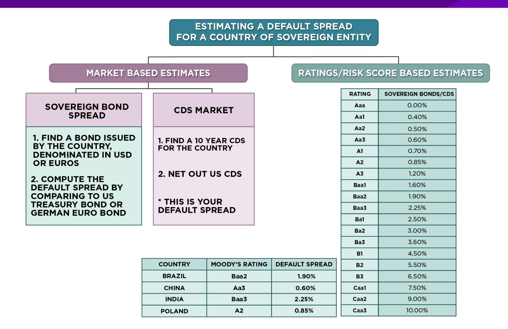
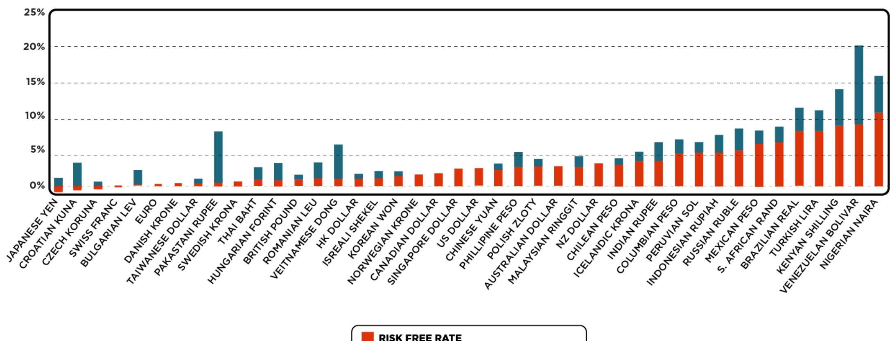
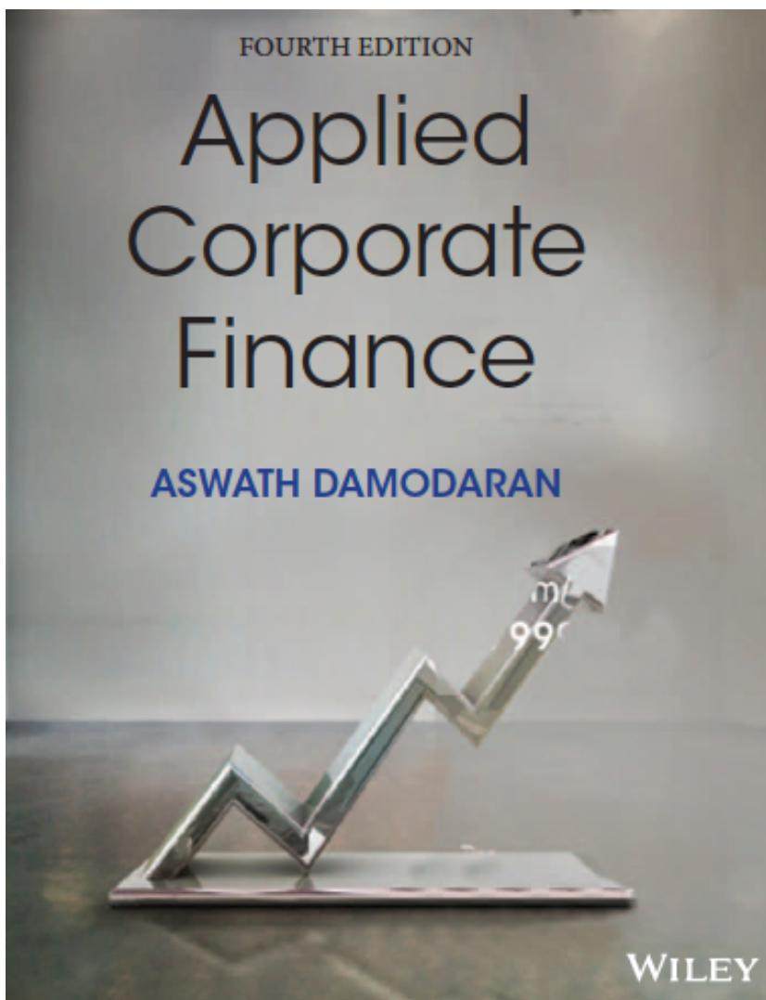

# **SESSION 5: THE RISK FREE RATE**

Nothing in life is guaranteed, right?

### **SESSION 5: THE RISK FREE RATE**

# **INPUTS REQUIRED TO USE THE CAPM -**

- The capital asset pricing model yields the following expected return: o Expected Return = Riskfree Rate+ Beta \* (Expected Return on the Market Portfolio - Riskfree Rate)
- To use the model we need three inputs: o The current risk-free rate o The expected market risk premium (the premium expected for investing in risky assets (market portfolio) over the riskless asset) o The beta of the asset being analyzed.

# **THE RISKFREE RATE AND TIME HORIZON**

- On a riskfree asset, the actual return is always equal to the expected return. For an investment to be riskfree, i.e., to have an actual return be equal to the expected return, two conditions have to be met – o There has to be no default risk, which generally implies that the security has to be issued by the government. Note, however, that not all governments can be viewed as default free. o There can be no uncertainty about reinvestment rates, which implies that it is a zero coupon security with the same maturity as the cash flow being analyzed.
- Theoretically, this translates into using different riskfree rates for each cash flow the 1 year zero coupon rate for the cash flow in year 1, the 2-year zero coupon rate for the cash flow in year 2 ...
- Practically speaking, if there is substantial uncertainty about expected cash flows, the present value effect of using time varying riskfree rates is small enough that it may not be worth it.

# **THE BOTTOM LINE ON RISKFREE RATES**

- Using a long term government rate (even on a coupon bond) as the riskfree rate on all of the cash flows in a long term analysis will yield a close approximation of the true value. For short term analysis, it is entirely appropriate to use a short term government security rate as the riskfree rate.
- The riskfree rate that you use in an analysis should be in the same currency that your cashflows are estimated in. o In other words, if your cashflows are in U.S. dollars, your riskfree rate has to be in U.S. dollars as well. o If your cash flows are in Euros, your riskfree rate should be a Euro riskfree rate.
- The conventional practice of estimating riskfree rates is to use the government bond rate, with the government being the one that is in control of issuing that currency. **In November 2013**, for instance, the rate on a ten-year US treasury bond (2.75%) is used as the risk free rate in US dollars.

### **WHAT IS THE EURO RISKFREE RATE? AN EXERCISE IN NOVEMBER 2013**

**Rate on 10-year Euro Government Bonds: November 2013**

# WHEN THE GOVERNMENT IS DEFAULT FREE: RISK FREE RATES – IN NOVEMBER 2013

**WHEN THE GOVERNMENT IS DEFAULT FREE: RISK FREE RATES  
NOVEMBER 2013**

### **WHAT IF THERE IS NO DEFAULT-FREE ENTITY? RISK FREE RATES IN NOVEMBER 2013**

- If the government is perceived to have default risk, the government bond rate will have a default spread component in it and not be riskfree. There are three choices we have, when this is the case. o Adjust the local currency government borrowing rate for default risk to get a riskless local currency rate. § In November 2013, the Indian government rupee bond rate was 8.82%. the local currency rating from Moody's was Baa3 and the default spread for a Baa3 rated country bond was 2.25%.

Riskfree rate in Rupees = 8.82% - 2.25% = 6.57%

§ In November 2013, the Chinese Renmimbi government bond rate was 4.30% and the local currency rating was Aa3, with a default spread of 0.8%.

Riskfree rate in Chinese Renmimbi = 4.30% - 0.8% = 3.5%

o Do the analysis in an alternate currency, where getting the riskfree rate is easier. With Vale in 2013, we could chose to do the analysis in US dollars (rather than estimate a riskfree rate in R\$). The riskfree rate is then the US treasury bond rate. o Do your analysis in real terms, in which case the riskfree rate has to be a real riskfree rate. The inflation-indexed treasury rate is a measure of a real riskfree rate.

### **ESTIMATING A SOVEREIGN DEFAULT SPREAD**

### **RISK FREE RATES WILL VARY ACROSS CURRENCIES: JANUARY 2017**

**TEN-YEAR GOVERNMENT BOND RATES, NET OF DEFAULT SPREAD (BASED ON SOVEREIGN RATING)**

## Applied Corporate Finance

**Task** Estimate the risk free rate in the currency of your choice

Optional: Read Chapter 4