# **Equity Risk Premiums (ERP): Determinants, Estimation and Implications – The 2017 Edition**

*Updated: March 2017*

*Aswath Damodaran*

*Stern School of Business*

*adamodar@stern.nyu.edu*

# **Equity Risk Premiums (ERP): Determinants, Estimation and Implications – The 2017 Edition**

The equity risk premium is the price of risk in equity markets and is a key input in estimating costs of equity and capital in both corporate finance and valuation. Given its importance, it is surprising how haphazard the estimation of equity risk premiums remains in practice. We begin this paper by looking at the economic determinants of equity risk premiums, including investor risk aversion, information uncertainty and perceptions of macroeconomic risk. In the standard approach to estimating the equity risk premium, historical returns are used, with the difference in annual returns on stocks versus bonds, over a long period, comprising the expected risk premium. We note the limitations of this approach, even in markets like the United States, which have long periods of historical data available, and its complete failure in emerging markets, where the historical data tends to be limited and volatile. We look at two other approaches to estimating equity risk premiums – the survey approach, where investors and managers are asked to assess the risk premium and the implied approach, where a forward-looking estimate of the premium is estimated using either current equity prices or risk premiums in non-equity markets. In the next section, we look at the relationship between the equity risk premium and risk premiums in the bond market (default spreads) and in real estate (cap rates) and how that relationship can be mined to generated expected equity risk premiums. We close the paper by examining why different approaches yield different values for the equity risk premium, and how to choose the "right" number to use in analysis.

| Equity	Risk	Premiums:	Importance	and	Determinants                                                                                                                  | .............................................5                                                                                     |
|--------------------------------------------------------------------------------------------------------------------------------------------------------------------|------------------------------------------------------------------------------------------------------------------------------------|
| Expected	Returns	and	Discount	Rates                                                                                                                                | ...................................................................................................6                               |
| Risk	Aversion	and	Consumption	Preferences                                                                                                                          | 10                                                                                                                                 |
| Economic	Risk                                                                                                                                                      | 11                                                                                                                                 |
| Information.....................................................................................................................................................   | 14                                                                                                                                 |
| Liquidity	and	Fund	Flows.........................................................................................................................                  | 15                                                                                                                                 |
| Catastrophic	Risk                                                                                                                                                  | 16                                                                                                                                 |
| Government	Policy                                                                                                                                                  | 18                                                                                                                                 |
| Monetary	Policy............................................................................................................................................        | 19                                                                                                                                 |
| The	behavioral/	irrational	component...............................................................................................                                | 20                                                                                                                                 |
| The	Equity	Risk	Premium	Puzzle                                                                                                                                     | ..............................................................................................21                                   |
| Estimation	Approaches                                                                                                                                              | 24                                                                                                                                 |
| Investors                                                                                                                                                          | 24                                                                                                                                 |
| Managers.......................................................................................................................................................... | 27                                                                                                                                 |
| Academics........................................................................................................................................................  | 28                                                                                                                                 |
| Estimation	Questions	and	Consequences..........................................................................................                                    | 30                                                                                                                                 |
| Estimates	for	the	United	States..............................................................................................................                      | 35                                                                                                                                 |
| Pre-tax	or	Post-tax	risk	premium?                                                                                                                                  | 38                                                                                                                                 |
| Global	Estimates                                                                                                                                                   | 40                                                                                                                                 |
| The	survivor	bias..........................................................................................................................................        | 41                                                                                                                                 |
| Decomposing	the	historical	equity	risk	premium                                                                                                                     | 44                                                                                                                                 |
| Historical	Premium	Plus                                                                                                                                            | ..............................................................................................................45                   |
| Small	cap	and	other	risk	premiums                                                                                                                                  | 46                                                                                                                                 |
| Country	Risk	Premiums                                                                                                                                              | 52                                                                                                                                 |
| Implied	Equity	Premiums                                                                                                                                            | ............................................................................................................79                     |
| 1.	DCF	Model	Based	Premiums                                                                                                                                        | 79                                                                                                                                 |
| 2.	Default	Spread	Based	Equity	Risk	Premiums                                                                                                                       | ...........................................................................112                                                     |
| 3.	Option	Pricing	Model	based	Equity	Risk	Premium                                                                                                                  | ................................................................116                                                                |
| Which	approach	is	the	“best”	approach?                                                                                                                             | .............................................................................121                                                   |
| Five	myths	about	equity	risk	premiums                                                                                                                              | ..............................................................................124                                                  |
| Summary                                                                                                                                                            | ...............................................................................................................................126 |
| Appendix	1:	Historical	Returns	on	Stocks,	Bonds	and	Bills	–                                                                                                        | United	States.....................127                                                                                              |
| Appendix	2:	Sovereign	Ratings	by	Country-                                                                                                                          | January	2016 .....................................................130                                                              |
| Appendix	3:	Country	Risk	Scores	from	the	PRS	Group	–                                                                                                               | January	2017.............................132                                                                                       |
| and	Country	Risk	Premiums	(Weekly	returns	from	1/14	–                                                                                                              | 1/16).......................................134                                                                                    |
| Appendix	5:	Equity	Market	Volatility	versus	Bond	Market/CDS	volatility-                                                                                            | January	2017                                                                                                                       |

The notion that risk matters, and that riskier investments should have higher expected returns than safer investments, to be considered good investments, is intuitive and central to risk and return models in finance. Thus, the expected return on any investment can be written as the sum of the riskfree rate and a risk premium to compensate for the risk. The disagreement, in both theoretical and practical terms, remains on how to measure the risk in an investment, and how to convert the risk measure into an expected return that compensates for risk. A central number in this debate is the premium that investors demand for investing in the 'average risk' equity investment (or for investing in equities as a class), i.e., the equity risk premium.

In this paper, we begin by examining competing risk and return models in finance and the role played by equity risk premiums in each of them. We argue that equity risk premiums are central components in every one of these models and consider what the determinants of these premiums might be. We follow up by looking at three approaches for estimating the equity risk premium in practice. The first is to survey investors or managers with the intent of finding out what they require as a premium for investing in equity as a class, relative to the riskfree rate. The second is to look at the premiums earned historically by investing in stocks, as opposed to riskfree investments. The third is to back out an equity risk premium from market prices today. We consider the pluses and minuses of each approach and how to choose between the very different numbers that may emerge from these approaches.

# **Equity Risk Premiums: Importance and Determinants**

Since the equity risk premium is a key component of every valuation, let's begin by looking at not only why it matters in the first place but also the factors that influence its level at any point in time and why that level changes over time. In this section, we look at the role played by equity risk premiums in corporate financial analysis, valuation and portfolio management, and then consider the determinants of equity risk premiums.

#### **Why does the equity risk premium matter?**

The equity risk premium reflects fundamental judgments we make about how much risk we see in an economy/market and what price we attach to that risk. In the process, it affects the expected return on every risky investment and the value that we estimate for that investment. Consequently, it makes a difference in both how we allocate wealth across different asset classes and which specific assets or securities we invest in within each asset class.

#### *A Price for Risk*

To illustrate why the equity risk premium is the price attached to risk, consider an alternate (though unrealistic) world where investors are risk neutral. In this world, the value of an asset would be the present value of expected cash flows, discounted back at a risk free rate. The expected cash flows would capture the cash flows under all possible scenarios (good and bad) and there would be no risk adjustment needed. In the real world, investors are risk averse and will pay a lower price for risky cash flows than for riskless cash flows, with the same expected value. How much lower? That is where equity risk premiums come into play. In effect, the equity risk premium is the premium that investors demand for the average risk investment, and by extension, the discount that they apply to expected cash flows with average risk. When equity risk premiums rise, investors are charging a higher price for risk and will therefore pay lower prices for the same set of risky expected cash flows.

#### *Expected Returns and Discount Rates*

Building on the theme that the equity risk premium is the price for taking risk, it is a key component into the expected return that we demand for a risky investment. This expected return, is a determinant of both the cost of equity and the cost of capital, essential inputs into corporate financial analysis and valuation.

While there are several competing risk and return models in finance, they all share some common assumptions about risk. First, they all define risk in terms of variance in actual returns around an expected return; thus, an investment is riskless when actual returns are always equal to the expected return. Second, they argue that risk has to be measured from the perspective of the marginal investor in an asset, and that this marginal investor is well diversified. Therefore, the argument goes, it is only the risk that an investment adds on to a diversified portfolio that should be measured and compensated. In fact, it is this view of risk that leads us to break the risk in any investment into two components. There is a firm-specific component that measures risk that relates only to that investment or to a

few investments like it, and a market component that contains risk that affects a large subset or all investments. It is the latter risk that is not diversifiable and should be rewarded.

All risk and return models agree on this crucial distinction, but they part ways when it comes to how to measure this market risk. In the capital asset pricing model (CAPM), the market risk is measured with a beta, which when multiplied by the equity risk premium yields the total risk premium for a risky asset. In the competing models, such as the arbitrage pricing and multi-factor models, betas are estimated against individual market risk factors, and each factor has its own price (risk premium). Table 1 summarizes four models, and the role that equity risk premiums play in each one:

*Table 1: Equity Risk Premiums in Risk and Return Models*

|                               | Model                                                                                                                                                                  | Equity Risk Premium                                                                                                 |
|-------------------------------|------------------------------------------------------------------------------------------------------------------------------------------------------------------------|---------------------------------------------------------------------------------------------------------------------|
| The CAPM                      | Expected Return = Riskfree Rate + β_Asset (Equity Risk Premium)                                                                                                        | Risk Premium for investing in the market portfolio, which includes all risky assets, relative to the riskless rate. |
| Arbitrage pricing model (APM) | Expected Return = Riskfree Rate + Σ_(j=1 to k) β_j (Risk Premium_j)                                                                                                    | Risk Premiums for individual (unspecified) market risk factors.                                                     |
| Multi-Factor Model            | Expected Return = Riskfree Rate + Σ_(j=1 to k) β_j (Risk Premium_j)                                                                                                    | Risk Premiums for individual (specified) market risk factors                                                        |
| Proxy Models                  | Expected Return = a + b (Proxy 1) + c (Proxy 2) (where the proxies are firm characteristics such as market capitalization, price to book ratios or return momentum) | No explicit risk premium computation, but coefficients on proxies reflect risk preferences.                         |

All of the models other than proxy models require three inputs. The first is the riskfree rate, simple to estimate in currencies where a default free entity exists, but more complicated in markets where there are no default free entities. The second is the beta (in the CAPM) or betas (in the APM or multi-factor models) of the investment being analyzed, and the third is the appropriate risk premium for the portfolio of all risky assets (in the CAPM) and the factor risk premiums for the market risk factors in the APM and multifactor models. While I examine the issues of riskfree rate and beta estimation in companion pieces, I will concentrate on the measurement of the risk premium in this paper.

Note that the equity risk premium in all of these models is a market-wide number, in the sense that it is not company-specific or asset-specific but affects expected returns on all risky investments. Using a larger equity risk premium will increase the expected returns for all risky investments, and by extension, reduce their value. Consequently, the choice of an equity risk premium may have much larger consequences for value than firm-specific inputs such as cash flows, growth and even firm-specific risk measures (such as betas).

#### *Investment and Policy Implications*

It may be tempting for those not in the midst of valuation or corporate finance analysis to pay little heed to the debate about equity risk premium, but it would be a mistake to do so, since its effects are far reaching.

- The amounts set aside by both corporations and governments to meet future pension fund and health care obligations are determined by their expectations of returns from investing in equity markets, i.e., their views on the equity risk premium. Assuming that the equity risk premium is 6% will lead to far less being set aside each year to cover future obligations than assuming a premium of 4%. If the actual premium delivered by equity markets is only 2%, the fund's assets will be insufficient to meet its liabilities, leading to fund shortfalls which have to be met by raising taxes (for governments) or reducing profits (for corporations) In some cases, the pension benefits can be put at risk, if plan administrators use unrealistically high equity risk premiums, and set aside too little each year.
- Business investments in new assets and capacity is determined by whether the businesses think they can generate higher returns on those investments than the cost that they attach to the capital in that investment. If equity risk premiums increase, the cost of equity and capital will have to increase with them, leading to less overall investment in the economy and lower economic growth.
- Regulated monopolies, such as utility companies, are often restricted in terms of the prices that they charge for their products and services. The regulatory commissions that determine "reasonable" prices base them on the assumption that these companies have to earn a fair rate of return for their equity investors. To come up with this fair rate of

return, they need estimates of equity risk premiums; using higher equity risk premiums will translate into higher prices for the customers in these companies.1

- Judgments about how much you should save for your retirement or health care and where you should invest your savings are clearly affected by how much return you think you can make on your investments. Being over optimistic about equity risk premiums will lead you to save too little to meet future needs and to over investment in risky asset classes.

Thus, the debate about equity risk premiums has implications for almost every aspect of our lives.

#### *Market Timing and Risk Premiums*

Any one who invests has a view on equity risk premiums, though few investors are explicit about their views. In particular, if you believe that equity markets are efficient, you are arguing that the equity risk premiums built into market prices today are correct. If you believe that stock markets are over valued or in a bubble, you are asserting that the equity risk premiums built into prices today are too low, relative to what they should be (based on the risk in equities and investor risk aversion). Conversely, investors who believe that stocks are collectively underpriced or cheap are also making a case that the equity risk premium in the market today is much higher than what you should be making (again based on the risk in equities and investor risk aversion). Thus, every debate about the overall equity market can be translated into a debate about equity risk premiums.

Put differently, asset allocation decisions that investors make are explicitly or implicitly affected by investor views on risk premiums and how they vary across asset classes and geographically. Thus, if you believe that equity risk premiums are low, relative to the risk premiums in corporate bond markets (which take the form or default spreads on bonds), you will allocate more of your overall portfolio to bonds. Your allocation of equities across geographical markets are driven by your perceptions of equity risk premiums in those markets, with more of your portfolio going into markets where the

1 The Society of Utility and Regulatory Financial Analysts (SURFA) has annual meetings of analysts involved primarily in this debate. Not surprisingly, they spend a good chunk of their time discussing equity risk premiums, with analysts working for the utility firms arguing for higher equity risk premiums and analysts working for the state or regulatory authorities wanting to use lower risk premiums.

equity risk premium is higher than it should be (given the risk of those markets). Finally, if you determine that the risk premiums in financial assets (stocks and bonds) are too low, relative to what you can earn in real estate or other real assets, you will redirect more of your portfolio into the latter.

By making risk premiums the focus of asset allocation decisions, you give focus to those decisions. While it is very difficult to compare PE ratios for stocks to interest rates on bonds and housing price indicators, you can compare equity risk premiums to default spreads to real estate capitalization rates to make judgments about where you get the best trade off on risk and return. In fact, we will make these comparisons later in this paper.

#### **What are the determinants of equity risk premiums?**

Before we consider different approaches for estimating equity risk premiums, we should examine the factors that determine equity risk premiums. After all, equity risk premiums should reflect not only the risk that investors see in equity investments but also the price they attach to that risk.

#### *Risk Aversion and Consumption Preferences*

The first and most critical factor, obviously, is the risk aversion of investors in the markets. As investors become more risk averse, equity risk premiums will climb, and as risk aversion declines, equity risk premiums will fall. While risk aversion will vary across investors, it is the collective risk aversion of investors that determines equity risk premium, and changes in that collective risk aversion will manifest themselves as changes in the equity risk premium. While there are numerous variables that influence risk aversion, we will focus on the variables most likely to change over time.

- a. Investor Age: There is substantial evidence that individuals become more risk averse as they get older. The logical follow up to this proposition is that markets with older investors, in the aggregate, should have higher risk premiums than markets with younger investors, for any given level of risk. Bakshi and Chen (1994), for instance, examined risk premiums in the United States and noted an increase in risk premiums as investors aged.2 Liu and Spiegel computed the ratio of the middle-age cohort (40-49

2 Bakshi, G. S., and Z. Chen, 1994, *Baby Boom, Population Aging, and Capital Markets*, The Journal of Business, LXVII, 165-202.

years) to the old-age cohort (60-69) and found that PE ratios are closely and positively related to the Middle-age/Old-age ratio for the US equity market from 1954 to 2010; since the equity risk premium is inversely related to the PE, this would suggest that investor age does play a role in determining equity risk premiums.3

- b. Preference for current consumption: We would expect the equity risk premium to increase as investor preferences for current over future consumption increase. Put another way, equity risk premiums should be lower, other things remaining equal, in markets where individuals are net savers than in markets where individuals are net consumers. Consequently, equity risk premiums should increase as savings rates decrease in an economy. Rieger, Wang and Hens (2012) compare equity risk premiums and time discount factors across 27 countries and find that premiums are higher in countries where investors are more short term.4

Relating risk aversion to expected equity risk premiums is not straightforward. While the direction of the relationship is simple to establish – higher risk aversion should translate into higher equity risk premiums- getting beyond that requires us to be more precise in our judgments about investor utility functions, specifying how investor utility relates to wealth (and variance in that wealth). As we will see later in this paper, there has been a significant angst among financial economics that most conventional utility models do not do a good job of explaining observed equity risk premiums.

#### *Economic Risk*

The risk in equities as a class comes from more general concerns about the health and predictability of the overall economy. Put in more intuitive terms, the equity risk premium should be lower in an economy with predictable inflation, interest rates and economic growth than in one where these variables are volatile. Lettau, Ludwigson and Wachter (2008) link the changing equity risk premiums in the United States to shifting volatility in the real economy.5 They attribute the lower equity risk premiums of the 1990s

3 Liu, Z. and M.M. Siegel, 2011, *Boomer Retirement: Headwinds for US Equity Markets?* FRBSF Economic Letters, v26.

4 Rieger, M.O., M. Wang and T. Hens, 2012, International Evidence on the Equity Risk Premium Puzzle and Time Discounting, SSRN Working Paper, http://papers.ssrn.com/sol3/papers.cfm?abstract\_id=2120442

5 Lettau, M., S.C. Ludvigson and J.A. Wachter, 2008. *The Declining Equity Risk Premium: What role does macroeconomic risk play?* Review of Financial Studies, v21, 1653-1687.

(and higher equity values) to reduced volatility in real economic variables including employment, consumption and GDP growth. One of the graphs that they use to illustrate the correlation looks at the relationship between the volatility in GDP growth and the dividend/ price ratio (which is the loose estimate that they use for equity risk premiums), and it is reproduced in figure 1.

*Figure 1: Volatility in GDP growth and Equity Risk Premiums (US)*

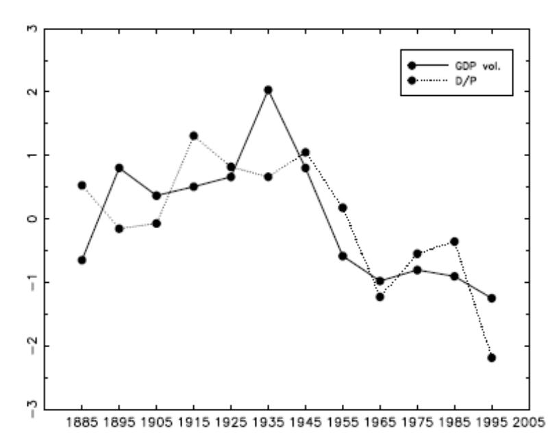

GDP relativity and the DP ratio — the reward evidence This figure plots the standard deviations of GDP growth and the mean DP ratio by decade starting in 1880 until 2000. Both series are demeaned and divided by their standard deviation. The GDP data are from Ray Fair's website (<http://fairmodel.econ.yale.edu/RAYFAIR/PDF/2002DTBL.HTM>) based on Balke and Gordon (1989). The dividend yield data is from Robert Shiller's website ([http://aida.econ.yale.edu/~shiller/data/ie\\_data.htm](http://aida.econ.yale.edu/~shiller/data/ie_data.htm)).

Note how closely the dividend yield has tracked the volatility in the real economy over this very long period.

Gollier (2001) noted that the linear absolute risk tolerance often assumed in standard models breaks down when there is income inequality and the resulting concave absolute risk tolerance should lead to higher equity risk premiums.6 Hatchondo (2008) attempted to quantify the impact on income inequality on equity risk premiums. In his model, which is narrowly structured, the equity risk premium is higher in an economy with

 6 Gollier, C., 2001. *Wealth Inequality and Asset Pricing*, Review of Economic Studies, v68, 181–203.

unequal income than in an egalitarian setting, but only by a modest amount (less than 0.50%).7

A related strand of research examines the relationship between equity risk premium and inflation, with mixed results. Studies that look at the relationship between the level of inflation and equity risk premiums find little or no correlation. In contrast, Brandt and Wang (2003) argue that news about inflation dominates news about real economic growth and consumption in determining risk aversion and risk premiums.8 They present evidence that equity risk premiums tend to increase if inflation is higher than anticipated and decrease when it is lower than expected. Another strand of research on the Fisher equation, which decomposes the riskfree rate into expected inflation and a real interest rate, argues that when inflation is stochastic, there should be a third component in the risk free rate: an inflation risk premium, reflecting uncertainty about future inflation.9 Reconciling the findings, it seems reasonable to conclude that it is not so much the level of inflation that determines equity risk premiums but uncertainty about that level, and that some of the inflation uncertainty premium may be captured in the risk free rate, rather than in the equity risk premiums.

Since the 2008 crisis, with its aftermath of low government bond rates and a simmering economic crisis, equity risk premiums in the United States have behaved differently than they have historically. Connolly and Dubofsky (2015) find that equity risk premiums have increased (decreased) as US treasury bond rates decrease (increase), and have moved inversely with inflation (with higher inflation leading to lower equity risk premiums), both behaviors at odds with the relationship in the pre-2008 period, suggesting a structural break in 2008.10

7 Hatchondo, J.C., 2008, *A Quantitative Study of the Role of Income Inequality on Asset Prices*, Economic Quarterly, v94, 73–96.

8 Brandt, M.W. and K.Q. Wang. 2003. *Time-varying risk aversion and unexpected inflation*, Journal of Monetary Economics, v50, pp. 1457-1498.

9 Benninga, S., and A. Protopapadakis, 1983, *Real and Nominal Interest Rates under Uncertainty: The* 

*Fisher Problem and the Term Structure*, Journal of Political Economy, vol. 91, pp. 856–67.

10 Connolly, R. and D. Dubofsky, 2015, *Risk Perceptions, Inflation and Financial Asset Returns: A Tale of Two Connections*, Working Paper, SSRN #2527213.

#### *Information*

When you invest in equities, the risk in the underlying economy is manifested in volatility in the earnings and cash flows reported by individual firms in that economy. Information about these changes is transmitted to markets in multiple ways, and it is clear that there have been significant changes in both the quantity and quality of information available to investors over the last two decades. During the market boom in the late 1990s, there were some who argued that the lower equity risk premiums that we observed in that period were reflective of the fact that investors had access to more information about their investments, leading to higher confidence and lower risk premiums in 2000. After the accounting scandals that followed the market collapse, there were others who attributed the increase in the equity risk premium to deterioration in the quality of information as well as information overload. In effect, they were arguing that easy access to large amounts of information of varying reliability was making investors less certain about the future.

As these contrary arguments suggest, the relationship between information and equity risk premiums is complex. More precise information should lead to lower equity risk premiums, other things remaining equal. However, precision here has to be defined in terms of what the information tells us about future earnings and cash flows. Consequently, it is possible that providing more information about last period's earnings may create more uncertainty about future earnings, especially since investors often disagree about how best to interpret these numbers. Yee (2006) defines earnings quality in terms of volatility of future earnings and argues that equity risk premiums should increase (decrease) as earnings quality decreases (increases).11

Empirically, is there a relationship between earnings quality and observed equity risk premiums? The evidence is mostly anecdotal, but there are several studies that point to the deteriorating quality of earnings in the United States, with the blame distributed widely. First, the growth of technology and service firms has exposed inconsistencies in accounting definitions of earnings and capital expenditures – the treatment of R&D as an operating expense is a prime example. Second, audit firms have been accused of conflicts of interest leading to the abandonment of their oversight responsibility. Finally, the

11 Yee*,* K. K.,, 2006, *Earnings Quality and the Equity Risk Premium: A Benchmark Model*, Contemporary Accounting Research, 23: 833–877.

earnings game, where analysts forecast what firms will earn and firms then try to beat these forecasts has led to the stretching (and breaking) of accounting rules and standards. If earnings have become less informative in the aggregate, it stands to reason that equity investors will demand large equity risk premiums to compensate for the added uncertainty.

Information differences may be one reason why investors demand larger risk premiums in some emerging markets than in others. After all, markets vary widely in terms of transparency and information disclosure requirements. Markets like Russia, where firms provide little (and often flawed) information about operations and corporate governance, should have higher risk premiums than markets like India, where information on firms is not only more reliable but also much more easily accessible to investors. Lau, Ng and Zhang (2011) look at time series variation in risk premiums in 41 countries and conclude that countries with more information disclosure, measured using a variety of proxies, have less volatile risk premiums and that the importance of information is heightened during crises (illustrated using the 1997 Asian financial crisis and the 2008 Global banking crisis).12

### *Liquidity and Fund Flows*

In addition to the risk from the underlying real economy and imprecise information from firms, equity investors also have to consider the additional risk created by illiquidity. If investors have to accept large discounts on estimated value or pay high transactions costs to liquidate equity positions, they will be pay less for equities today (and thus demand a large risk premium).

The notion that market for publicly traded stocks is wide and deep has led to the argument that the net effect of illiquidity on aggregate equity risk premiums should be small. However, there are two reasons to be skeptical about this argument. The first is that not all stocks are widely traded and illiquidity can vary widely across stocks; the cost of trading a widely held, large market cap stock is very small but the cost of trading an overthe-counter stock will be much higher. The second is that the cost of illiquidity in the aggregate can vary over time, and even small variations can have significant effects on

12 Lau. S.T., L. Ng and B. Zhang, 2011, *Information Environment and Equity Risk Premium Volatility around the World*, Management Science, Forthcoming.

equity risk premiums. In particular, the cost of illiquidity seems to increase when economies slow down and during periods of crisis, thus exaggerating the effects of both phenomena on the equity risk premium.

While much of the empirical work on liquidity has been done on cross sectional variation across stocks (and the implications for expected returns), there have been attempts to extend the research to look at overall market risk premiums. Gibson and Mougeot (2004) look at U.S. stock returns from 1973 to 1997 and conclude that liquidity accounts for a significant component of the overall equity risk premium, and that its effect varies over time.13 Baekart, Harvey and Lundblad (2006) present evidence that the differences in equity returns (and risk premiums) across emerging markets can be partially explained by differences in liquidity across the markets.14

Another way of framing the liquidity issue is in terms of funds flows, where the equity risk premium is determined by funds flows into and out of equities. Thus, if more funds are flowing into an equity market, either from other asset classes or other geographies, other things remaining equal, the equity risk premium should decrease, whereas funds flowing out of an equity market will lead to higher equity risk premiums.

#### *Catastrophic Risk*

When investing in equities, there is always the potential for catastrophic risk, i.e. events that occur infrequently but can cause dramatic drops in wealth. Examples in equity markets would include the great depression from 1929-30 in the United States and the collapse of Japanese equities in the last 1980s. In cases like these, many investors exposed to the market declines saw the values of their investments drop so much that it was unlikely that they would be made whole again in their lifetimes.15 While the possibility of catastrophic events occurring may be low, they cannot be ruled out and the equity risk premium has to reflect that risk.

13 Gibson R., Mougeot N., 2004, *The Pricing of Systematic Liquidity Risk: Empirical Evidence from the US Stock Market*. Journal of Banking and Finance, v28: 157–78.

14 Bekaert G., Harvey C. R., Lundblad C., 2006, *Liquidity and Expected Returns: Lessons from Emerging Markets*, The Review of Financial Studies.

15 An investor in the US equity markets who invested just prior to the crash of 1929 would not have seen index levels return to pre-crash levels until the 1940s. An investor in the Nikkei in 1987, when the index was at 40000, would still be facing a deficit of 50% (even after counting dividends) in 2008,

Rietz (1988) uses the possibility of catastrophic events to justify higher equity risk premiums and Barro (2006) extends this argument. In the latter's paper, the catastrophic risk is modeled as both a drop in economic output (an economic depression) and partial default by the government on its borrowing.16 Gabaix (2009) extends the Barro-Rietz model to allow for time varying losses in disasters.17 Barro, Nakamura, Steinsson and Ursua (2009) use panel data on 24 countries over more than 100 years to examine the empirical effects of disasters.18 They find that the average length of a disaster is six years and that half of the short run impact is reversed in the long term. Investigating the asset pricing implications, they conclude that the consequences for equity risk premiums will depend upon investor utility functions, with some utility functions (power utility, for instance) yielding low premiums and others generating much higher equity risk premiums. Barro and Ursua (2008) look back to 1870 and identify 87 crises through 2007, with an average impact on stock prices of about 22%, and estimate that investors would need to generate an equity risk premium of 7% to compensate for risk taken.19 Wachter (2012) builds a consumption model, where consumption follows a normal distribution with low volatility most of the time, with a time-varying probability of disasters that explains high equity risk premiums.20 Barro and Jin(2017) estimate a model with rare events and long run risks, using long term consumption data for 42 countries, and argue that much of the movement in equity risk premiums comes from shifts in the assessed likelihood of rare events.21

There have been attempts to measure the likelihood of catastrophic risk and incorporate them into models that predict equity risk premiums. In a series of papers with

16 Rietz, T. A., 1988, *The equity premium~: A solution*, Journal of Monetary Economics, v22, 117-131; Barro R J., 2006, *Rare Disasters and Asset Markets in the Twentieth Century*, Quarterly Journal of Economics, August, 823-866.

17Gabaix, Xavier, 2012, *Variable Rare Disasters: An Exactly Solved Framework for Ten Puzzles in Macro-Finance*, The Quarterly Journal of Economics, v127, 645-700.

18 Barro, R.J. , E. Nakamura, J. Steinsson and J. Ursua, 2009, *Crises and Recoveries in an Empirical Model* 

*of Consumption Disasters*, Working Paper, http://papers.ssrn.com/sol3/papers.cfm?abstract\_id=1594554. 19 Barro, R.J. and J. Ursua, 2008, Macroeconomic Crises since 1870, Working Paper, http://papers.ssrn.com/sol3/papers.cfm?abstract\_id=1124864.

20 Wachter, J.A., 2013, *Can time-varying risk of rare disasters explain aggregate stock market volatility?* Journal of Finance, v68, 987-1035. See also Tsai, J. and J. Wachter, 2015, *Disaster Risk and its*

*Implications for Asset Pricing*, Annual Review of Financial Economics, Vol. 7, pp. 219-252, 2015. 21 Barro, R.J and T. Jin, 2017, *Rare Events and Long Term Risks*, Working Paper, https://papers.ssrn.com/sol3/papers.cfm?abstract\_id=2933697

different co-authors, Bollerslev uses the variance risk premium, i.e., the difference between the implied variance in stock market options and realized variance, as a proxy for expectations of catastrophic risk, and documents a positive correlation with equity risk premiums.22 Kelly (2012) looks at extreme stock market movements as a measure of expected future jump (catastrophic) risk and finds a positive link between jump risk and equity risk premiums. 23 Guo, Liu, Wang, Zhou and Zuo (2014) refine this analysis by decomposing jumps into bad (negative) and good (positive) ones and find that it is the risk of downside jumps that determines equity risk premiums.. 24 Maheu, McCurdy and Zhao (2013) used a time-varying jump-arrival process and a two-component GARCH model on US stock market data from 1926 to 2011, and estimated that each additional jump per year increased the equity risk premium by 0.1062% and that there were, on average, 34 jumps a year, leading to a jump equity risk premium of 3.61%.25

The banking and financial crisis of 2008, where financial and real estate markets plunged in the last quarter of the year, has provided added ammunition to this school. As we will see later in the paper, risk premiums in all markets (equity, bond and real estate) climbed sharply during the weeks of the market crisis. In fact, the series of macro crises in the last four years that have affected markets all over the world has led some to hypothesize that the globalization may have increased the frequency and probability of disasters and by extension, equity risk premiums, in all markets.

#### *Government Policy*

The prevailing wisdom, at least until 2008, was that while government policy affected equity risk premiums in emerging markets, it was not a major factor in determining equity risk premiums in developed markets. The banking crisis of 2008 and the government responses to it have changed some minds, as both the US government and European

 22 Bollerslev, T. M., T. H. Law, and G. Tauchen, 2008, *Risk, Jumps, and Diversification*, Journal of Econometrics, 144, 234-256; Bollerslev, T. M., G. Tauchen, and H. Zhou, 2009, *Expected Stock Returns and Variance Risk Premia*, Review of Financial Studies, 101-3, 552-573; Bollerselv, T.M., and V. Todorov, 2011, *Tails, Fears, and Risk Premia*, Journal of Finance, 66-6, 2165-2211.

23 Kelly, B., 2012, *Tail Risk and Asset Prices*, Working Paper, University of Chicago.

24 Guo, H., Z. Liu, K. Wang, H. Zhou and H. Zuo, 2014, *Good Jumps, Bad Jumps and Conditional Equity Risk Premium*, Working Paper, SSRN #2516074.

25 Maheu, J.M., T.H. McCurdy and X. Wang, 2013, *Do Jumps Contribute to the Dynamics of the Equity Premium,* Journal of Financial Economics, v110, 457-477.

governments have made policy changes that at times have calmed markets and at other times roiled them, potentially affecting equity risk premiums.

Pastor and Veronesi (2012) argue that uncertainty about government policy can translate into higher equity risk premiums.26 The model they develop has several testable implications. First, government policy changes will be more likely just after economic downturns, thus adding policy uncertainty to general economic uncertainty and pushing equity risk premiums upwards. Second, you should expect to see stock prices fall, on average, across all policy changes, with the magnitude of the negative returns increasing for policy changes create more uncertainty. Third, policy changes will increase stock market volatility and the correlation across stocks.

Lam and Zhang (2014) try to capture the potential policy shocks from either an unstable government (government stability) or an incompetent bureaucracy (bureaucracy quality) in 49 countries from 1995 to 2006, using two measures of policy uncertainty drawn from the international country risk guide (ICG). They do find that equity risk premiums are higher in countries with more policy risk from either factor, with more bureaucratic risk increasing the premium by approximately 8%.27

#### *Monetary Policy*

Do central banks affect equity risk premiums? While the conventional channel for the influence has always been through macro economic variables, i.e., the effects that monetary policy has on inflation and real growth, and through these variables, n equity risk premiums, increased activism on the part of central banks since the 2008 crisis has started on a debate on whether central banking policy can affect equity risk premiums. This has significant policy implications, since the notion that lower interest rates will give rise to higher prices for financial assets and more investment by businesses is built on the predication that equity risk premiums don't change when rates are lowered.

One argument for a feedback effect is that when central banks act aggressively to lower interest rates, using the mechanisms that they control, they send signals to investors

 26 Pástor, L. and P. Veronesi, 2012. *Uncertainty about Government policy and Stock Prices*. Journal of Finance 67: 1219-1264.

27 Lam, S.S. and W. Zhang, 2014, *Does Policy Uncertainty matter for International Equity Markets?* Working Paper, SSRN #2297133.

and businesses about future growth and perhaps even about future risk in investing. In particular, as central bank move the rates they control to zero and below, markets may push up equity risk premiums and default spreads in bond markets, neutralizing or even countering whatever positive benefits might have been expected to flow from lower rates.

Peng and Zervou (2015) argue that monetary policy rules can have substantial effects on equity risk premiums and that an inflation-targeting policy will create more volatility in equity risk premiums and a higher equity risk premium than alternate rules that generate more stability.28 The 2008 crisis and the low interest rates that followed in most of the developing markets has rekindled the debate about how much central banks can affect equity risk premiums with interest rate policy. As we will see later in this paper, there is evidence that equity risk premiums have risen since 2008 but much of that rise can be attributed to lower interest rates rather than higher required returns on stocks.

#### *The behavioral/ irrational component*

Investors do not always behave rationally, and there are some who argue that equity risk premiums are determined, at least partially, by quirks in human behavior. While there are several strands to this analysis, we will focus on three:

- a. The Money Illusion: As equity prices declined significantly and inflation rates increased in the late 1970s, Modigliani and Cohn (1979) argued that low equity values of that period were the consequence of investors being inconsistent about their dealings with inflation. They argued that investors were guilty of using historical growth rates in earnings, which reflected past inflation, to forecast future earnings, but current interest rates, which reflected expectations of future inflation, to estimate discount rates.29 When inflation increases, this will lead to a mismatch, with high discount rates and low cash flows resulting in asset valuations that are too low (and risk premiums that are too high). In the Modigliani-Cohn model, equity risk premiums will rise in periods when inflation is higher than expected and drop in periods when inflation in lower than expected. Campbell and Voulteenaho

28 Peng, Y. and A. S. Zervou, 2015, Monetary Policy Rules and the Equity Risk Premium, Working Paper,

http://papers.ssrn.com/sol3/papers.cfm?abstract\_id=2498684. 29 Modigliani, Franco and Cohn, Richard. 1979, *Inflation, Rational Valuation, and the Market*, Financial Analysts Journal, v37(3), pp. 24-44.

(2004) update the Modigliani-Cohn results by relating changes in the dividend to price ratio to changes in the inflation rate over time and find strong support for the hypothesis.30

- b. Narrow Framing: In conventional portfolio theory, we assume that investors assess the risk of an investment in the context of the risk it adds to their overall portfolio, and demand a premium for this risk. Behavioral economists argue that investors offered new gambles often evaluate those gambles in isolation, separately from other risks that they face in their portfolio, leading them to over estimate the risk of the gamble. In the context of the equity risk premium, Benartzi and Thaler (1995) use this "narrow framing" argument to argue that investors over estimate the risk in equity, and Barberis, Huang and Santos (2001) build on this theme.31

#### **The Equity Risk Premium Puzzle**

While many researchers have focused on individual determinants of equity risk premiums, there is a related question that has drawn almost as much attention. Are the equity risk premiums that we have observed in practice compatible with the theory? Mehra and Prescott (1985) fired the opening shot in this debate by arguing that the observed historical risk premiums (which they estimated at about 6% at the time of their analysis) were too high, and that investors would need implausibly high risk-aversion coefficients to demand these premiums.32 In the years since, there have been many attempts to provide explanations for this puzzle:

- 1. Statistical artifact: The historical risk premium obtained by looking at U.S. data is biased upwards because of a survivor bias (induced by picking one of the most successful equity markets of the twentieth century). The true premium, it is argued, is much lower. This view is backed up by a study of large equity markets over the twentieth century, which concluded that the historical risk premium is closer to 4%

30 Campbell, J.Y. and T. Vuolteenaho, 2004, *Inflation Illusion and Stock Prices,* American Economic Review, v94, 19-23.

31 Benartzi, S. and R. Thaler, 1995, *Myopic Loss Aversion and the Equity Premium Puzzle*, Quarterly Journal of Economics; Barberis, N., M. Huang, and T. Santos, 2001, *Prospect Theory and Asset Prices*, Quarterly Journal of Economics, v 116(1), 1-53.

32 Mehra, Rajnish, and Edward C.Prescott, 1985, *The Equity Premium: A Puzzle*, Journal of Monetary Economics, v15, 145–61. Using a constant relative risk aversion utility function and plausible risk aversion coefficients, they demonstrate the equity risk premiums should be much lower (less than 1%).

than the 6% cited by Mehra and Prescott.33 However, even the lower risk premium would still be too high, if we assumed reasonable risk aversion coefficients.

- 2. Disaster Insurance: A variation on the statistical artifact theme, albeit with a theoretical twist, is that the observed volatility in an equity market does not fully capture the potential volatility, which could include rare but disastrous events that reduce consumption and wealth substantially. Reitz, referenced earlier, argues that investments that have dividends that are proportional to consumption (as stocks do) should earn much higher returns than riskless investments to compensate for the possibility of a disastrous drop in consumption. Prescott and Mehra (1988) counter than the required drops in consumption would have to be of such a large magnitude to explain observed premiums that this solution is not viable. 34 Berkman, Jacobsen and Lee (2011) use data from 447 international political crises between 1918 and 2006 to create a crisis index and note that increases in the index increase equity risk premiums, with disproportionately large impacts on the industries most exposed to the crisis.35
- 3. Taxes: One possible explanation for the high equity returns in the period after the Second World War is the declining marginal tax rate during that period. McGrattan and Prescott (2001), for instance, provide a hypothetical illustration where a drop in the tax rate on dividends from 50% to 0% over 40 years would cause equity prices to rise about 1.8% more than the growth rate in GDP; adding the dividend yield to this expected price appreciation generates returns similar to the observed equity risk premium. 36 In reality, though, the drop in marginal tax rates was much smaller and cannot explain the surge in equity risk premiums.
- 4. Alternative Preference Structures: There are some who argue that the equity risk premium puzzle stems from its dependence upon conventional expected utility theory to derive premiums. In particular, the constant relative risk aversion (CRRA)

33 Dimson, E., P. March and M. Staunton, 2002, *Triumph of the Optimists*, Princeton University Press.

34 Mehra, R. and E.C. Prescott, 1988, *The Equity Risk Premium: A Solution?* Journal of Monetary Economics, v22, 133-136.

35 Berkman, H., B. Jacobsen and J. Lee, 2011, *Time-varying Disaster Risk and Stock Returns*, Journal of Financial Economics, v101, 313-332

36 McGrattan, E.R., and E.C. Prescott. 2001, *Taxes, Regulations, and Asset Prices*, Working Paper, http://papers.ssrn.com/sol3/papers.cfm?abstract\_id=292522.

function used by Mehra and Prescott in their paper implies that if an investor is risk averse to variation in consumption across different states of nature at a point in time, he or she will also be equally risk averse to consumption variation across time. Epstein and Zin consider a class of utility functions that separate risk aversion (to consumption variation at a point in time) from risk aversion to consumption variation across time. They argue that individuals are much more risk averse when it comes to the latter and claim that this phenomenon explain the larger equity risk premiums.37 Put in more intuitive terms, individuals will choose a lower and more stable level of wealth and consumption that they can sustain over the long term over a higher level of wealth and consumption that varies widely from period to period. Constantinides (1990) adds to this argument by noting that individuals become used to maintaining past consumption levels and that even small changes in consumption can cause big changes in marginal utility. The returns on stocks are correlated with consumption, decreasing in periods when people have fewer goods to consume (recessions, for instance); the additional risk explains the higher observed equity risk premiums.38

- 5. Myopic Loss Aversion: Myopic loss aversion refers to the finding in behavioral finance that the loss aversion already embedded in individuals becomes more pronounced as the frequency of their monitoring increases. Thus, investors who receive constant updates on equity values actually perceive more risk in equities, leading to higher risk premiums. The paper that we cited earlier by Benartzi and Thaler yields estimates of the risk premium very close to historical levels using a one-year time horizon for investors with plausible loss aversion characteristics (of about 2, which is backed up by the experimental research).

In conclusion, it is not quite clear what to make of the equity risk premium puzzle. It is true that historical risk premiums are higher than could be justified using conventional utility models for wealth. However, that may tell us more about the dangers of using historical data and the failures of classic utility models than they do about equity risk premiums. In

 37 Epstein, L.G., and S.E. Zin. 1991. *Substitution, Risk Aversion, and the Temporal Behavior of* 

*Consumption and Asset Returns: An Empirical Analysis*, Journal of Political Economy, v99, 263–286.

38 Constantinides, G.M. 1990. *Habit Formation: A Resolution of the Equity Premium Puzzle*, Journal of Political Economy, v98, no. 3 (June):519–543.

fact, the last decade of poor stock returns in the US and declining equity risk premiums may have made the equity risk premium puzzle less of a puzzle, since explaining a historical premium of 4% (the premium in 2011) is far easier than explaining a historical premium of 6% (the premium in 1999).

# **Estimation Approaches**

There are three broad approaches used to estimate equity risk premiums. One is to survey subsets of investors and managers to get a sense of their expectations about equity returns in the future. The second is to assess the returns earned in the past on equities relative to riskless investments and use this historical premium as the expectation. The third is to attempt to estimate a forward-looking premium based on the market rates or prices on traded assets today; we will categorize these as implied premiums.

#### **Survey Premiums**

If the equity risk premium is what investors demand for investing in risky assets today, the most logical way to estimate it is to ask these investors what they require as expected returns. Since investors in equity markets number in the millions, the challenge is often finding a subset of investors that best reflects the aggregate market. In practice, se see surveys of investors, managers and even academics, with the intent of estimating an equity risk premium.

#### *Investors*

When surveying investors, we can take one of two tacks. The first is to focus on individual investors and get a sense of what they expect returns on equity markets to be in the future. The second is to direct the question of what equities will deliver as a premium at portfolio managers and investment professionals, with the rationale that their expectations should matter more in the aggregate, since they have the most money to invest.

- a. Individual Investors: The oldest continuous index of investor sentiment about equities was developed by Robert Shiller in the aftermath of the crash of 1987 and has been updated since.39 UBS/Gallup has also polled individual investors since 1996 about their

39 The data is available at http://bit.ly/NcgTW7.

optimism about future stock prices and reported a measure of investor sentiment.40 While neither survey provides a direct measure of the equity risk premium, they both yield broad measure of where investors expect stock prices to go in the near future. The Securities Industry Association (SIA) surveyed investors from 1999 to 2004 on the expected return on stocks and yields numbers that can be used to extract equity risk premiums. In the 2004 survey, for instance, they found that the median expected return across the 1500 U.S. investors they questioned was 12.8%, yielding a risk premium of roughly 8.3% over the treasury bond rate at that time.41 While there are services that continue to survey individual investors, they seem to be designed more to capture shifts in sentiments rather than to estimate equity risk premiums.42

- b. Institutional Investors/ Investment Professionals: Investors Intelligence, an investment service, tracks more than a hundred newsletters and categorizes them as bullish, bearish or neutral, resulting in a consolidated advisor sentiment index about the future direction of equities. Like the Shiller and UBS surveys, it is a directional survey that does not yield an equity risk premium. Merrill Lynch, in its monthly survey of institutional investors globally, explicitly poses the question about equity risk premiums to these investors. In its February 2007 report, for instance, Merrill reported an average equity risk premium of 3.5% from the survey, but that number jumped to 4.1% by March, after a market downturn.43 As markets settled down in 2009, the survey premium has also settled back to 3.76% in January 2010. Through much of 2010, the survey premium stayed in a tight range (3.85% - 3.90%) but the premium climbed to 4.08% in the January 2012 update. In February 2014, the survey yielded a risk premium of 4.6%, though it may not be directly comparable to the earlier numbers because of changes in the survey. 44

40 The data is available at http://www.ubs.com/us/en/wealth/misc/investor-watch.html

41 See http://www.sifma.org/research/surveys.aspx. The 2004 survey seems to be the last survey done by SIA. The survey yielded expected stock returns of 10% in 2003, 13% in 2002, 19% in 2001, 33% in 2000 and 30% in 1999.

42 The American Association of Individual Investors (AAII) surveys investors every week and reports

sentiments shifts, http://www.aaii.com/files/surveys/sentiment.xls.

43 See http://www.ml.com/index.asp?id=7695\_8137\_47928. 44 Global Fund Manager Survey, Bank of America Merrill Lynch, February 2014. In more recent surveys, we were unable to find this premium.

While survey premiums have become more accessible, very few practitioners seem to be inclined to use the numbers from these surveys in computations and there are several reasons for this reluctance:

- 1. Survey risk premiums are responsive to recent stock prices movements, with survey numbers generally increasing after bullish periods and decreasing after market decline. Thus, the peaks in the SIA survey premium of individual investors occurred in the bull market of 1999, and the more moderate premiums of 2003 and 2004 occurred after the market collapse in 2000 and 2001.
- 2. Survey premiums are sensitive not only to whom the question is directed at but how the question is asked. For instance, individual investors seem to have higher (and more volatile) expected returns on equity than institutional investors and the survey numbers vary depending upon the framing of the question.45
- 3. In keeping with other surveys that show differences across sub-groups, the premium seems to vary depending on who gets surveyed. Kaustia, Lehtoranta and Puttonen (2011) surveyed 1,465 Finnish investment advisors and note that not only are male advisors more likely to provide an estimate but that their estimated premiums are roughly 2% lower than those obtained from female advisors, after controlling for experience, education and other factors.46
- 4. Studies that have looked at the efficacy of survey premiums indicate that if they have any predictive power, it is in the wrong direction. Fisher and Statman (2000) document the negative relationship between investor sentiment (individual and institutional) and stock returns.47 In other words, investors becoming more optimistic (and demanding a larger premium) is more likely to be a precursor to poor (rather than good) market returns.

As technology aids the process, the number and sophistication of surveys of both individual and institutional investors will also increase. However, it is also likely that these survey premiums will be more reflections of the recent past rather than good forecasts of the future.

45 Asking the question "What do you think stocks will do next year?" generates different numbers than asking "What should the risk premium be for investing in stocks?"

46 Kaustia, M., A. Lehtoranta and V. Puttonen, 2011, *Sophistication and Gender Effects in Financial Advisers Expectations*, Working Paper, Aalto University.

47 Fisher, K.L., and M. Statman, 2000, *Investor Sentiment and Stock Returns*, Financial Analysts Journal, v56, 16-23.

#### *Managers*

As noted in the first section, equity risk premiums are a key input not only in investing but also in corporate finance. The hurdle rates used by companies – costs of equity and capital – are affected by the equity risk premiums that they use and have significant consequences for investment, financing and dividend decisions. Graham and Harvey have been conducting annual surveys of Chief Financial Officers (CFOs) or companies for roughly the last decade with the intent of estimating what these CFOs think is a reasonable equity risk premium (for the next 10 years over the ten-year bond rate). In their March 2015 survey, they report an average equity risk premium of 4.51% across survey respondents, up from the average premium of 3.73% a year earlier. The median premium in the June 2016 survey was 3.19%, close to the prior year's value but lower than the numbers in earlier years. 48

To get a sense of how these assessed equity risk premiums have behaved over time, we have graphed the average and median values of the premium and the cross sectional standard deviation in the estimates in each CFO survey, from 2001 to 2016, in Figure 2.

48 Graham, J.R. and C.R. Harvey, 2016, *The Equity Risk Premium in 2016*, Working paper, https://papers.ssrn.com/sol3/papers.cfm?abstract\_id=2816603 . See also Graham, J.R. and C.R. Harvey, 2009, *The Equity Risk Premium amid a Global Financial Crisis*, Working paper, http://papers.ssrn.com/sol3/papers.cfm?abstract\_id=1405459.

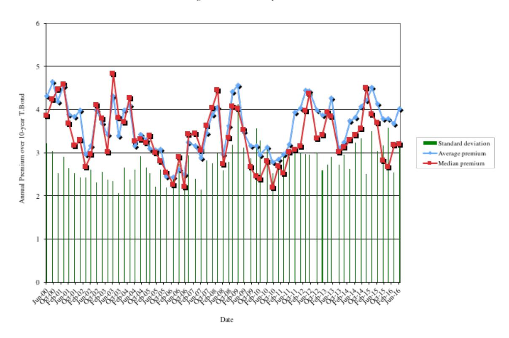

Note the survey premium peak was 4.56% in February 2009, right after the crisis, and had its lowest recording (2.5%) in September 2006. The average across all 15 years of surveys (more than 10,000 responses) was 3.58%, but the standard deviation in the survey responses did increase after the 2008 crisis.

#### *Academics*

Most academics are neither big players in equity markets, nor do they make many major corporate finance decisions. Notwithstanding this lack of real world impact, what they think about equity risk premiums may matter for two reasons. The first is that many of the portfolio managers and CFOs that were surveyed in the last two sub-sections received their first exposure to the equity risk premium debate in the classroom and may have been influenced by what was presented as the right risk premium in that setting. The second is that practitioners often offer academic work (textbooks and papers) as backing for the numbers that they use.

Welch (2000) surveyed 226 financial economists on the magnitude of the equity risk premium and reported interesting results. On average, economists forecast an average annual risk premium (arithmetic) of about 7% for a ten-year time horizon and 6-7% for one to five-year time horizons. As with the other survey estimates, there is a wide range on the estimates, with the premiums ranging from 2% at the pessimistic end to 13% at the optimistic end. Interestingly, the survey also indicates that economists believe that their estimates are higher than the consensus belief and try to adjust the premiums down to reflect that view.49

Fernandez (2010) examined widely used textbooks in corporate finance and valuation and noted that equity risk premiums varied widely across the books and that the moving average premium has declined from 8.4% in 1990 to 5.7% in 2010. 50 In another survey, Fernandez, Aguirreamalloa and L. Corres (2011) compared both the level and standard deviation of equity risk premium estimates for analysts, companies and academics in the United States:51

| Group     | Average Equity Risk Premium | Standard deviation in Equity Risk Premium estimates |
|-----------|-----------------------------|-----------------------------------------------------|
| Academics | 5.6%                        | 1.6%                                                |
| Analysts  | 5.0%                        | 1.1%                                                |
| Companies | 5.5%                        | 1.6%                                                |

The range on equity risk premiums in use is also substantial, with a low of 1.5% and a high of 15%, often citing the same sources. Fenandez, Pizarro and Acin also report survey responses from the same groups (academics, analysts and companies) in 71 countries in 2016` and note that those in emerging markets use higher risk premiums (not surprisingly) than those in developed markets.52 In a 2015 survey, Fernandez, Ortiz and Acin report big differences in equity risk premiums across analysts within the same country; in the US, for

49 Welch, I., 2000, *Views of Financial Economists on the Equity Premium and on Professional Controversies*, Journal of Business, v73, 501-537.

50 Fernandez, P., 2010, *The Equity Premium in 150 Textbooks*, Working Paper,

http://papers.ssrn.com/sol3/papers.cfm?abstract\_id=1473225. He notes that the risk premium actually varies within the book in as many as a third of the textbooks surveyed.

51 Fernandez, P., J. Aguirreamalloa and L. Corres, 2011, Equity Premium used in 2011 for the USA by Analysts, Companies and Professors: A Survey, Working Paper, http://papers.ssrn.com/sol3/papers.cfm?abstract\_id=1805852&rec=1&srcabs=1822182.

52 Fernandez, P., A.O. Pizarro and I.F. Acin, 2016, Market Risk Premium used in 71 countries in 2016, A Survey with 6932 Answers, https://papers.ssrn.com/sol3/papers.cfm?abstract\_id=2776636

instance, they note that while the average ERP across analysts was 5.8%, the numbers used ranged from 3.2% to 10.5%.53

#### **Historical Premiums**

While our task is to estimate equity risk premiums in the future, much of the data we use to make these estimates is in the past. Most investors and managers, when asked to estimate risk premiums, look at historical data. In fact, the most widely used approach to estimating equity risk premiums is the historical premium approach, where the actual returns earned on stocks over a long period is estimated, and compared to the actual returns earned on a default-free (usually government security). The difference, on an annual basis, between the two returns is computed and represents the historical risk premium. In this section, we will take a closer look at the approach.

#### *Estimation Questions and Consequences*

While users of risk and return models may have developed a consensus that historical premium is, in fact, the best estimate of the risk premium looking forward, there are surprisingly large differences in the actual premiums we observe being used in practice, with the numbers ranging from 3% at the lower end to 12% at the upper end. Given that we are almost all looking at the same historical data, these differences may seem surprising. There are, however, three reasons for the divergence in risk premiums: different time periods for estimation, differences in riskfree rates and market indices and differences in the way in which returns are averaged over time.

#### *1. Time Period*

Even if we agree that historical risk premiums are the best estimates of future equity risk premiums, we can still disagree about how far back in time we should go to estimate this premium. For decades, Ibbotson Associates was the most widely used estimation service, reporting stock return data and risk free rates going back to 1926,54 and Duff and

 53 Fernandez, P., A. Ortiz and I.F. Acin, 2015, Huge dispersion of the Risk-Free Rate and Market Risk Premium used by analysts in USA and Europe in 2015, SSRN Working Paper: http://papers.ssrn.com/sol3/papers.cfm?abstract\_id=2684740.

54 Ibbotson Stocks, Bonds, Bills and Inflation Yearbook (SBBI), 2011 Edition, Morningstar.

Phelps now provides the same service55. There are other less widely used databases that go further back in time to 1871 or even to 1792.56

While there are many analysts who use all the data going back to the inception date, there are almost as many analysts using data over shorter time periods, such as fifty, twenty or even ten years to come up with historical risk premiums. The rationale presented by those who use shorter periods is that the risk aversion of the average investor is likely to change over time, and that using a shorter and more recent time period provides a more updated estimate. This has to be offset against a cost associated with using shorter time periods, which is the greater noise in the risk premium estimate. In fact, given the annual standard deviation in stock returns57 between 1928 and 2016 of 19.76% (approximated to 20%), the standard error associated with the risk premium estimate can be estimated in table 2 follows for different estimation periods:58

*Table 2: Standard Errors in Historical Risk Premiums*

| Estimation Period | Standard Error of Risk Premium Estimate |              |
|-------------------|-----------------------------------------|--------------|
| 5 years           | 20%/                                    | √ 5 = 8.94%  |
| 10 years          | 20%/                                    | √ 10 = 6.32% |
| 25 years          | 20% /                                   | √ 25 = 4.00% |
| 50 years          | 20% /                                   | √ 50 = 2.83% |
| 80 years          | 20% /                                   | √ 80 = 2.23% |

Even using all of the data (about 88 years) yields a substantial standard error of 2.2%. Note that that the standard errors from ten-year and twenty-year estimates are likely to be almost as large or larger than the actual risk premium estimated. This cost of using shorter time

55 Duff and Phelps, 2015 Valuation Handbook, Industry Cost of Capital.

56 Siegel, in his book, Stocks for the Long Run, estimates the equity risk premium from 1802-1870 to be 2.2% and from 1871 to 1925 to be 2.9%. (Siegel, Jeremy J., Stocks for the Long Run, Second Edition, McGraw Hill, 1998). Goetzmann and Ibbotson estimate the premium from 1792 to 1925 to be 3.76% on an arithmetic average basis and 2.83% on a geometric average basis. Goetzmann. W.N. and R. G. Ibbotson, 2005, History and the Equity Risk Premium, Working Paper, Yale University. Available at http://papers.ssrn.com/sol3/papers.cfm?abstract\_id=702341. You can get stock returns going back to 1871 on Professor Robert Shiller's web site.

57 For the historical data on stock returns, bond returns and bill returns check under "updated data" in

http://www.damodaran.com. 58 The standard deviation in annual stock returns between 1928 and 2014 is 19.90%; the standard deviation in the risk premium (stock return – bond return) is a little higher at 21.59%. These estimates of the standard error are probably understated, because they are based upon the assumption that annual returns are uncorrelated over time. There is substantial empirical evidence that returns are correlated over time, which would make this standard error estimate much larger. The raw data on returns is provided in Appendix 1.

periods seems, in our view, to overwhelm any advantages associated with getting a more updated premium.

What are the costs of going back even further in time (to 1871 or before)? First, the data is much less reliable from earlier time periods, when trading was lighter and record keeping more haphazard. Second, and more important, the market itself has changed over time, resulting in risk premiums that may not be appropriate for today. The U.S. equity market in 1871 more closely resembled an emerging market, in terms of volatility and risk, than a mature market. Consequently, using the earlier data may yield premiums that have little relevance for today's markets.

There are two other solutions offered by some researchers. The first is to break the annual data down into shorter return intervals – quarters or even months – with the intent of increasing the data points over any given time period. While this will increase the sample size, the effect on the standard error will be minimal.59 The second is to use the entire data but to give a higher weight to more recent data, thus getting more updated premiums while preserving the data. While this option seems attractive, weighting more recent data will increase the standard error of the estimate. After all, using only the last ten years of data is an extreme form of time weighting, with the data during that period being weighted at one and the data prior to the period being weighted at zero.

#### *2. Riskfree Security and Market Index*

The second estimation question we face relates to the riskfree rate. We can compare the expected return on stocks to either short-term government securities (treasury bills) or long term government securities (treasury bonds) and the risk premium for stocks can be estimated relative to either. Given that the yield curve in the United States has been upward sloping for most of the last eight decades, the risk premium is larger when estimated relative to short term government securities (such as treasury bills) than when estimated against treasury bonds.

Some practitioners and a surprising number of academics (and textbooks) use the treasury bill rate as the riskfree rate, with the alluring logic that there is no price risk in a

59 If returns are uncorrelated over time, the variance in quarterly (monthly) risk premiums will be approximately one-quarter (one twelfth) the variance in annual risk premiums.

treasury bill, whereas the price of a treasury bond can be affected by changes in interest rates over time. That argument does make sense, but only if we are interested in a single period equity risk premium (say, for next year). If your time horizon is longer (say 5 or 10 years), it is the treasury bond that provides the more predictable returns.60 Investing in a 6 month treasury bill may yield a guaranteed return for the next six months, but rolling over this investment for the next five years will create reinvestment risk. In contrast, investing in a ten-year treasury bond, or better still, a ten-year zero coupon bond will generate a guaranteed return for the next ten years.61

The riskfree rate chosen in computing the premium has to be consistent with the riskfree rate used to compute expected returns. Thus, if the treasury bill rate is used as the riskfree rate, the premium has to be the premium earned by stocks over that rate. If the treasury bond rate is used as the riskfree rate, the premium has to be estimated relative to that rate. For the most part, in corporate finance and valuation, the riskfree rate will be a long-term default-free (government) bond rate and not a short-term rate. Thus, the risk premium used should be the premium earned by stocks over treasury bonds.

The historical risk premium will also be affected by how stock returns are estimated. Using an index with a long history, such as the Dow 30, seems like an obvious solution, but returns on the Dow may not be a good reflection of overall returns on stocks. In theory, at least, we would like to use the broadest index of stocks to compute returns, with two caveats. The first is that the index has to be market-weighted, since the overall returns on equities will be tilted towards larger market cap stocks. The second is that the returns should be free of survivor bias; estimating returns only on stocks that have survived that last 80 years will yield returns that are too high. Stock returns should incorporate those equity investments from earlier years that did not make it through the estimation period, either because the companies in question went bankrupt or were acquired.

Finally, there is some debate about whether the equity risk premiums should be computed using nominal returns or real returns. While the choice clearly makes a

60 For more on risk free rates, see Damodaran, A., 2008, *What is the riskfree rate?* Working Paper,

http://papers.ssrn.com/sol3/papers.cfm?abstract\_id=1317436. 61 There is a third choice that is sometimes employed, where the short term government security (treasury bills) is used as the riskfree rate and a "term structure spread" is added to this to get a normalized long term rate.

difference, if we estimate the return on stocks or the government security return standing alone, it is less of an issue, when computing equity risk premiums, where we look at the difference between the two values. Put simply, subtracting out the inflation rate from both stock and bond returns each years should yield roughly the same premium as what you would have obtained with the nominal returns.

#### *3. Averaging Approach*

The final sticking point when it comes to estimating historical premiums relates to how the average returns on stocks, treasury bonds and bills are computed. The arithmetic average return measures the simple mean of the series of annual returns, whereas the geometric average looks at the compounded return62. Many estimation services and academics argue for the arithmetic average as the best estimate of the equity risk premium. In fact, if annual returns are uncorrelated over time, and our objective was to estimate the risk premium for the next year, the arithmetic average is the best and most unbiased estimate of the premium. There are, however, strong arguments that can be made for the use of geometric averages. First, empirical studies seem to indicate that returns on stocks are negatively correlated63 over time. Consequently, the arithmetic average return is likely to over state the premium. Second, while asset pricing models may be single period models, the use of these models to get expected returns over long periods (such as five or ten years) suggests that the estimation period may be much longer than a year. In this context, the argument for geometric average premiums becomes stronger. Indro and Lee (1997) compare arithmetic and geometric premiums, find them both wanting, and argue for a weighted average, with the weight on the geometric premium increasing with the time horizon.64

Geometric Average = ValueN Value0 ! " # \$ % & 1/*N* −1

62 The compounded return is computed by taking the value of the investment at the start of the period (Value0) and the value at the end (ValueN), and then computing the following:

63 In other words, good years are more likely to be followed by poor years, and vice versa. The evidence on negative serial correlation in stock returns over time is extensive, and can be found in Fama and French (1988). While they find that the one-year correlations are low, the five-year serial correlations are strongly negative for all size classes. Fama, E.F. and K.R. French, 1992, *The Cross-Section of Expected Returns*, Journal of Finance, Vol 47, 427-466.

64 Indro, D.C. and W. Y. Lee, 1997, *Biases in Arithmetic and Geometric Averages as Estimates of Longrun Expected Returns and Risk Premium*, Financial Management, v26, 81-90.

In closing, the averaging approach used clearly matters. Arithmetic averages will be yield higher risk premiums than geometric averages, but using these arithmetic average premiums to obtain discount rates, which are then compounded over time, seems internally inconsistent. In corporate finance and valuation, at least, the argument for using geometric average premiums as estimates is strong.

#### *Estimates for the United States*

The questions of how far back in time to go, what risk free rate to use and how to average returns (arithmetic or geometric) may seem trivial until you see the effect that the choices you make have on your equity risk premium. Rather than rely on the summary values that are provided by data services, we will use raw return data on stocks, treasury bills and treasury bonds from 1928 to 2016 to make this assessment.65 In figure 3, we begin with a chart of the annual returns on stock, treasury bills and bonds for each year:

65 The raw data for treasury rates is obtained from the Federal Reserve data archive (http://research.stlouisfed.org/fred2/) at the Fed site in St. Louis, with the 3-month treasury bill rate used for treasury bill returns and the 10-year treasury bond rate used to compute the returns on a constant maturity 10-year treasury bond. The stock returns represent the returns on the S&P 500. Appendix 1 provides the returns by year on stocks, bonds and bills, by year, from 1928 through the current year.

It is difficult to make much of this data other than to state the obvious, which is that stock returns are volatile, which is at the core of the demand for an equity risk premium in the first place. In table 3, we present summary statistics for stock, 3-month Treasury bill and ten-year Treasury bond returns from 1928 to 2016:

*Table 3: Summary Statistics- U.S. Stocks, T. Bills and T. Bonds- 1928-2016*

|                    | Stocks   | T. Bills | T. Bonds |
|--------------------|----------|----------|----------|
| Mean               | 11.42%   | 3.46%    | 5.18%    |
| Standard Error     | 2.09%    | 0.32%    | 0.82%    |
| Median             | 13.52%   | 3.08%    | 3.29%    |
| Standard Deviation | 19.70%   | 3.06%    | 7.76%    |
| Kurtosis           | 3.01716  | 3.83519  | 4.482    |
| Skewness           | -0.39716 | 0.98532  | 0.9773   |
| Minimum            | -43.84%  | 0.03%    | -11.12%  |
| Maximum            | 52.56%   | 14.30%   | 32.81%   |
| 25th percentile    | -1.19%   | 0.96%    | 0.92%    |
| 75th percentile    | 25.06%   | 5.13%    | 8.46%    |

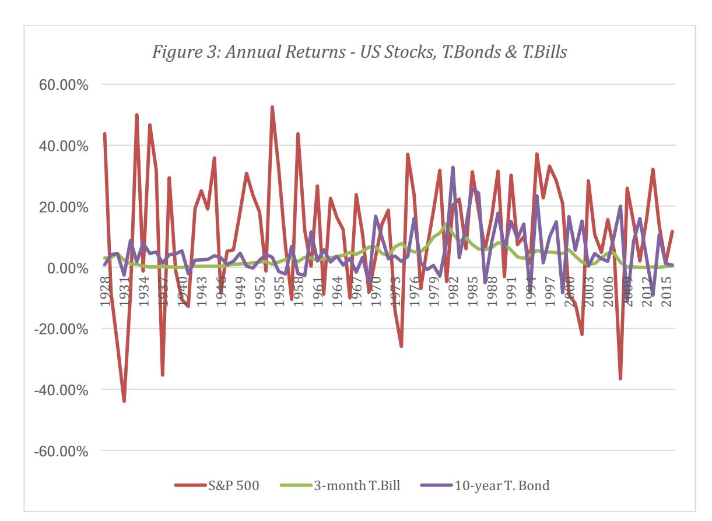

While U.S. equities have delivered much higher returns than treasuries over this period, they have also been more volatile, as evidenced both by the higher standard deviation in returns and by the extremes in the distribution. Using this table, we can take a first shot at estimating a risk premium by taking the difference between the average returns on stocks and the average return on treasuries, yielding a risk premium of 7.96% for stocks over T.Bills (11.42% minus 3.46%) and 6.24% for stocks over T.Bonds (11.42% minus 5.18%). Note, though, that these represent arithmetic average, long-term premiums for stocks over treasuries.

How much will the premium change if we make different choices on historical time periods, riskfree rates and averaging approaches? To answer this question, we estimated the arithmetic and geometric risk premiums for stocks over both treasury bills and bonds over different time periods in table 4, with standard errors reported in brackets below the arithmetic averages:

*Table 4: Historical Equity Risk Premiums (ERP) –Estimation Period, Riskfree Rate and Averaging Approach*

|           | Arithmetic Average: Stocks - Bills | Arithmetic Average: Stocks - Bonds | Geometric Average: Stocks - Bills | Geometric Average: Stocks - Bonds |
|-----------|----------------|-----------------------------------|----------------|----------------------------------|
| 1928-2016 | 7.96%          | 6.24%                             | 6.11%          | 4.62%                            |
|           | (2.12%)        | (2.26%)                           |                |                                  |
| 1967-2016 | 6.57%          | 4.37%                             | 5.25%          | 3.42%                            |
|           | (2.39%)        | (2.72%)                           |                |                                  |
| 2007-2016 | 7.90%          | 3.62%                             | 6.15%          | 2.30%                            |
|           | (6.06%)        | (8.63%)                           |                |                                  |

Note that even with only three slices of history considered, the premiums range from 2.30% to 7.96%, depending upon the choices made. If we take the earlier discussion about the "right choices" to heart, and use a long-term geometric average premium over the longterm rate as the risk premium to use in valuation and corporate finance, the equity risk premium that we would use would be 4.62%. The caveats that we would offer, though, are that this estimate comes with significant standard error and is reflective of time periods (such as 1920s and 1930s) when the U.S. equity market (and investors in it) had very different characteristics.

There have been attempts to extend the historical time period to include years prior to 1926, the start of the Ibbotson database. Goetzmann and Jorion (1999) estimate the returns on stocks and bonds between 1792 and 1925 and report an arithmetic average premium, for stocks over bonds, of 2.76% and a geometric average premium of 2.83%.66 The caveats about data reliability and changing market characteristics that we raised in an earlier section apply to these estimates.

There is one more troublesome (or at least counter intuitive) characteristic of historical risk premiums. The geometric average equity risk premium through the end of 2007 was 4.79%, higher than the 3.88% estimated though the end of 2008; in fact, every single equity risk premium number in this table would have been much higher, if we had stopped with 2007 as the last year. Adding the data for 2008, an abysmal year for stocks and a good year for bonds, lowers the historical premium dramatically, even when computed using a long period of history. In effect, the historical risk premium approach would lead investors to conclude, after one of worst stock market crisis in several decades, that stocks were less risky than they were before the crisis and that investors should therefore demand lower premiums. In contrast, adding the data for 2009, a good year for stocks (+25.94%) and a bad year for bonds (-11.12%) would have increased the equity risk premium from 3.88% to 4.29%. As a general rule, historical risk premiums will tend to rise when markets are buoyant and investors are less risk averse and will fall as markets collapse and investor fears rise.

#### *Pre-tax or Post-tax risk premium?*

Is the equity risk premium that you extract from the historical data a pre-tax or a post-tax number? That is a question that seldom gets asked because most analysts who use this premium to come up with costs of equity and capital apply them on corporate valuations, where the cash flows are after corporate taxes. The answer is in the numbers. Since the returns are to equity investors and are based upon dividends and stock price

66 Jorion, Philippe and William N. Goetzmann, 1999, *Global Stock Markets in the Twentieth Century*, Journal of Finance, 54(3), 953-980.

changes each year, they are returns after corporate taxes but before personal taxes to the investor.

There are cases, though, where it is inappropriate to use the equity risk premium in its unadjusted form to compute discount rates and here are two:

- 1. Cash flows after personal taxes: There are some cases where investors value companies after personal taxes, arguing that the cash flows that you should be looking at should be after the investor pays taxes on dividends and capital gains. If your cash flows are computed after personal taxes, you have to adjust your discount rate to also make it after personal taxes. To illustrate, consider the historical risk premium of 4.62% computed using historical data on stocks and treasury bonds between 1928 and 2016 and assume that you add this on to the treasury bond rate of 2.45% at the start of 2017 to arrive at a cost of equity of 7.07%. This is your required return as an equity investor, after corporate taxes and before personal taxes. Assume, for simplicity, that dividends and capital gains get taxed at 20%. The post-personal tax return will be lower:

Post-personal tax cost of equity = 7.07% (1-.20) = 5.66%

Note that if dividends and capital gains are taxed at different rates, the computation will become a little more complicated and require you to break down your expected return into dividend and price appreciation components. If, for instance, your tax rate on dividends is 40% and that on capital gains is 20%, and the expected dividend yield on stocks is 2%, your post-personal tax cost of equity is:

Post-personal tax cost of equity = 2.00% (1-.4) + 5.07% (1-.20) = 5.26%

It is this lower cost of equity that you should be using in discounting post-personal tax cash flows.

- 2. Cash flows before corporate taxes: There are other cases where investors choose to estimate cash flows before corporate taxes. If that is the case, you have to then adjust the expected returns to make them pre-corporate tax. Here again, the simplest version of this adjustment will use the average corporate tax rate to scale up the required return. Using the average effective tax rate of 25% that US companies paid in 2016, for instance, the pre-corporate tax cost of equity for an average risk US company would be higher than 7.07%:

Pre-corporate tax cost of equity = 7.07%/ (1-.25) = 9.43%

If you are discounting pre-corporate tax cash flows, you would use this higher discount rate.

- 3. Pass Through Entities: The messiest case is when you value entities which are passthrough entities, where the entity pays no tax but the income is taxed at the investor level. That is the case with master limited partnerships (MLPs) and real estate investment trusts (REITs). In these cases, the analyst has to decide whether he or she wants to discount the cash flows at the entity level, with no taxes, and use the pre-corporate tax discount rate (computed in the last section) or use the cash flows at the investor level, in which case the discount rate will need two adjustments, the first one to eliminate the corporate tax effect and the second one to incorporate the individual tax rate. The first adjustment will raise the discount rate and the second one will lower it and the net effect will depend upon the differential tax rate. Thus, for instance, if the individual tax rate is 40% and the corporate tax rate is 25%, the adjusted cost of equity will be as follows:

Adjusted Cost of equity for post-personal tax cash flows on a pass-through entity

$$= \frac{\text{Unadjusted Cost of equity (1-Personal tax rate)}}{(1-\text{Corporate tax rate})} = \frac{7.07\% (1-.25)}{(1-.40)} = 5.67\%$$

#### *Global Estimates*

If it is difficult to estimate a reliable historical premium for the US market, it becomes doubly so, when looking at markets with short, volatile and transitional histories. This is clearly true for emerging markets, where equity markets have often been in existence for only short time periods (Eastern Europe, China) or have seen substantial changes over the last few years (Latin America, India). It also true for many West European equity markets. While the economies of Germany, Italy and France can be categorized as mature, their equity markets did not share the same characteristics until recently. They tended to be dominated by a few large companies, many businesses remained private, and trading was thin except on a few stocks.

Notwithstanding these issues, services have tried to estimate historical risk premiums for non-US markets with the data that they have available. To capture some of the danger in this practice, Table 5 summarizes historical arithmetic average equity risk premiums for major non-US markets below for 1976 to 2001, and reports the standard error in each estimate:67

*Table 5: Risk Premiums for non-US Markets: 1976- 2001*

| Country | Monthly average | Monthly Standard Deviation | Equity Risk Premium | Standard error |
|---------|-----------------|----------------------------|---------------------|----------------|
| Canada  | 0.14%           | 5.73%                      | 1.69%               | 3.89%          |
| France  | 0.40%           | 6.59%                      | 4.91%               | 4.48%          |
| Germany | 0.28%           | 6.01%                      | 3.41%               | 4.08%          |
| Italy   | 0.32%           | 7.64%                      | 3.91%               | 5.19%          |
| Japan   | 0.32%           | 6.69%                      | 3.91%               | 4.54%          |
| UK      | 0.36%           | 5.78%                      | 4.41%               | 3.93%          |
| India   | 0.34%           | 8.11%                      | 4.16%               | 5.51%          |
| Korea   | 0.51%           | 11.24%                     | 6.29%               | 7.64%          |
| Chile   | 1.19%           | 10.23%                     | 15.25%              | 6.95%          |
| Mexico  | 0.99%           | 12.19%                     | 12.55%              | 8.28%          |
| Brazil  | 0.73%           | 15.73%                     | 9.12%               | 10.69%         |

Before we attempt to come up with rationale for why the equity risk premiums vary across countries, it is worth noting the magnitude of the standard errors on the estimates, largely because the estimation period includes only 25 years. Based on these standard errors, we cannot even reject the hypothesis that the equity risk premium in each of these countries is zero, let alone attach a value to that premium.

If the standard errors on these estimates make them close to useless, consider how much more noise there is in estimates of historical risk premiums for some emerging market equity markets, which often have a reliable history of ten years or less, and very large standard deviations in annual stock returns. Historical risk premiums for emerging markets may provide for interesting anecdotes, but they clearly should not be used in risk and return models.

#### *The survivor bias*

Given how widely the historical risk premium approach is used, it is surprising that the flaws in the approach have not drawn more attention. Consider first the underlying assumption that investors' risk premiums have not changed over time and that the average

67 Salomons, R. and H. Grootveld, 2003, *The equity risk premium: Emerging vs Developed Markets,* Emerging Markets Review, v4, 121-144.

risk investment (in the market portfolio) has remained stable over the period examined. We would be hard pressed to find anyone who would be willing to sustain this argument with fervor. The obvious fix for this problem, which is to use a more recent time period, runs directly into a second problem, which is the large noise associated with historical risk premium estimates. While these standard errors may be tolerable for very long time periods, they clearly are unacceptably high when shorter periods are used.

Even if there is a sufficiently long time period of history available, and investors' risk aversion has not changed in a systematic way over that period, there is a final problem. Markets such as the United States, which have long periods of equity market history, represent "survivor markets". In other words, assume that one had invested in the largest equity markets in the world in 1926, of which the United States was one.68 In the period extending from 1926 to 2000, investments in many of the other equity markets would have earned much smaller premiums than the US equity market, and some of them would have resulted in investors earning little or even negative returns over the period. Thus, the survivor bias will result in historical premiums that are larger than expected premiums for markets like the United States, even assuming that investors are rational and factor risk into prices.

How can we mitigate the survivor bias? One solution is to look at historical risk premiums across multiple equity markets across very long time periods. In the most comprehensive attempt of this analysis, Dimson, Marsh and Staunton (2002, 2008) estimated equity returns for 17 markets and obtained both local and a global equity risk premium.69 In their most recent update in 2017, they provide the risk premiums from 1900 to 2016 for 21 markets, with standard errors on each estimate (reported in table 6):70

68 Jorion, Philippe and William N. Goetzmann, 1999, *Global Stock Markets in the Twentieth Century*, Journal of Finance, 54(3), 953-980. They looked at 39 different equity markets and concluded that the US was the best performing market from 1921 to the end of the century. They estimated a geometric average premium of 3.84% across all of the equity markets that they looked at, rather than just the US and estimated that the survivor bias added 1.5% to the US equity risk premium (with arithmetic averages) and 0.9% with geometric averages.

69 Dimson, E., P Marsh and M Staunton, 2002, *Triumph of the Optimists: 101 Years of Global Investment Returns,* Princeton University Press, NJ; Dimson, E.,, P Marsh and M Staunton, 2008, The Worldwide Equity Risk Premium: a smaller puzzle, Chapter 11 in the Handbook of the Equity Risk Premium, edited by R. Mehra, Elsevier.

70 *Credit Suisse Global Investment Returns Yearbook,* 2017, Credit Suisse/ London Business School. Summary data is accessible at the Credit Suisse website.

*Table 6: Historical Risk Premiums across Equity Markets – 1900 – 2016 (in %)*

| Country         | Geometric Mean (Stocks minus Short term Governments) | Arithmetic Mean (Stocks minus Short term Governments) | Standard Error (Stocks minus Short term Governments) | Standard Deviation (Stocks minus Short term Governments) | Geometric Mean (Stocks minus Long term Governments) | Arithmetic Mean (Stocks minus Long term Governments) | Standard Error (Stocks minus Long term Governments) | Standard Deviation (Stocks minus Long term Governments) |
|-----------------|----------------|-----------------|----------------|--------------------|----------------|-----------------|----------------|--------------------|
| Australia       | 6.0%           | 7.4%            | 1.5%           | 16.4%              | 5.0%           | 6.6%            | 1.7%           | 18.1%              |
| Austria         | 5.6%           | 10.4%           | 3.5%           | 37.1%              | 2.7%           | 21.4%           | 14.2%          | 152.2%             |
| Belgium         | 3.0%           | 5.4%            | 2.2%           | 23.6%              | 2.2%           | 4.3%            | 1.9%           | 20.9%              |
| Canada          | 4.2%           | 5.6%            | 1.6%           | 16.9%              | 3.4%           | 5.0%            | 1.7%           | 18.2%              |
| Denmark         | 3.3%           | 5.2%            | 1.9%           | 20.6%              | 2.1%           | 3.7%            | 1.7%           | 18.0%              |
| Finland         | 5.9%           | 9.4%            | 2.7%           | 29.6%              | 5.2%           | 8.7%            | 2.8%           | 29.9%              |
| France          | 6.2%           | 8.7%            | 2.2%           | 24.0%              | 3.0%           | 5.3%            | 2.1%           | 22.6%              |
| Germany         | 6.1%           | 9.9%            | 2.9%           | 31.2%              | 5.0%           | 8.4%            | 2.6%           | 28.3%              |
| Ireland         | 3.6%           | 5.9%            | 2.0%           | 21.3%              | 2.7%           | 4.7%            | 1.8%           | 19.8%              |
| Italy           | 5.7%           | 9.5%            | 2.9%           | 31.3%              | 3.1%           | 6.4%            | 2.7%           | 29.2%              |
| Japan           | 6.2%           | 9.3%            | 2.6%           | 27.5%              | 5.1%           | 9.1%            | 3.0%           | 32.4%              |
| Netherlands     | 4.5%           | 6.6%            | 2.1%           | 22.3%              | 3.2%           | 5.5%            | 2.0%           | 22.1%              |
| New Zealand     | 4.4%           | 6.0%            | 1.7%           | 18.0%              | 4.0%           | 5.5%            | 1.6%           | 17.7%              |
| Norway          | 3.2%           | 5.9%            | 2.4%           | 25.9%              | 2.4%           | 5.3%            | 2.5%           | 27.5%              |
| Portugal        | 4.6%           | 9.2%            | 3.1%           | 33.6%              | 2.7%           | 7.5%            | 3.1%           | 33.0%              |
| South Africa    | 6.2%           | 8.2%            | 2.0%           | 21.6%              | 5.3%           | 7.0%            | 1.8%           | 19.5%              |
| Spain           | 3.3%           | 5.4%            | 2.0%           | 21.5%              | 1.7%           | 3.7%            | 1.9%           | 20.5%              |
| Sweden          | 4.0%           | 6.0%            | 1.9%           | 20.3%              | 3.1%           | 5.3%            | 2.0%           | 21.3%              |
| Switzerland     | 3.6%           | 5.3%            | 1.7%           | 18.6%              | 2.0%           | 3.5%            | 1.6%           | 17.4%              |
| U.K.            | 4.4%           | 6.1%            | 1.8%           | 19.5%              | 3.6%           | 4.9%            | 1.6%           | 17.1%              |
| U.S.            | 5.5%           | 7.4%            | 1.8%           | 19.6%              | 4.3%           | 6.4%            | 1.9%           | 20.8%              |
| Europe          | 3.3%           | 5.1%            | 1.7%           | 19.1%              | 3.1%           | 4.4%            | 1.5%           | 16.0%              |
| World-ex U.S.   | 3.5%           | 5.1%            | 1.7%           | 18.4%              | 2.8%           | 3.8%            | 1.3%           | 14.5%              |
| World           | 4.2%           | 5.6%            | 1.6%           | 16.9%              | 3.2%           | 4.4%            | 1.4%           | 15.5%              |

Source: Credit Suisse Global Investment Returns Sourcebook, 2016

In making comparisons of the numbers in this table to prior years, note that this database was modified in two ways: the world estimates are now weighted by market capitalization and the issue of survivorship bias has been dealt with frontally by incorporating the return histories of three markets (Austria, China and Russia) where equity investors would have lost their entire investment some time during the last century. Note also that the risk premiums, averaged across the markets, are lower than risk premiums in the United States. For instance, the geometric average risk premium for stocks over long-term government bonds, across the non-US markets, is 2.8%, lower than the 4.3% for the US markets. The results are similar for the arithmetic average premium, with the average premium of 3.8% across non-US markets being lower than the 6.4% for the United States. In effect, the difference in returns captures the survivorship bias, implying that using historical risk premiums based only on US data will results in numbers that are too high for the future. Note that the "noise" problem persists, even with averaging across 21 markets and over 116 years. The standard error in the global equity risk premium estimate is 1.4%, suggesting that the range for the historical premium remains a large one.

#### *Decomposing the historical equity risk premium*

As the data to compute historical risk premiums has become richer, those who compute historical risk premiums have also become more creative, breaking down the historical risk premiums into its component parts, partly to understand the drivers of the premiums and partly to get better predictors for the future. Ibbotson and Chen (2013) started this process by breaking down the historical risk premium into four components:71

- 1. The income return is the return earned by stockholders from dividends and stock buybacks.
- 2. The second is the inflation rate during the estimation time period.
- 3. The third is the growth rate in real earnings (earnings cleansed of inflation) during the estimation period.
- 4. The change in PE ratio over the period, since an increase (decrease) in the PE ratio will raise (lower) the realized return on stocks during an estimation period.

Using the argument that the first three are sustainable and generated by "the productivity of corporations in the economy" and the fourth is not, they sum up the first three components to arrive at what they term a "supply-side" equity risk premium.

Following the same playbook, Dimson, Marsh and Staunton decompose the realized equity risk premium from 2000-2016 in each market into three components: the level of dividends, the growth in those dividends and the effects on stock price of a changing multiple for dividend (price to dividend ratio). For the United States, they

 71 Ibbotson, R. and P. Chen, 2003, *Long-Run Stock Returns: Participating in the Real Economy*, Financial Analysts Journal, pp.88-98.

attribute 1.68% of the overall premium of 5.52% (for stocks over treasury bills) to growth in real dividends and 0.44% to expansion in the price to dividend ratio. Of the global premium of 4.20%, 0.51% can be attributed to growth in dividends and 0.45% to increases in the price to dividend ratio.

While there is some value in breaking down a historical risk premium, notice that none of these decompositions remove the basic problems with historical risk premiums, which is that they are backward looking and noisy. Thus, a supply side premium has to come with all of the caveats that a conventional historical premium with the added noise created by the decomposition, i.e., in measuring inflation and real earnings.

#### **Historical Premium Plus**

If we accept the proposition that historical risk premiums are the best way to estimate future risk premiums and also come to terms with the statistical reality that we need long time periods of history to get reliable estimates, we are trapped when it comes to estimating risk premiums in most emerging markets, where historical data is either nonexistent or unreliable. Furthermore, the equity risk premium that we estimate becomes the risk premium that we use for all stocks within a market, no matter what their differences are on market capitalization and growth potential; in effect, we assume that the betas we use will capture differences in risk across companies.

In this section, we consider one way out of this box, where we begin with the US historical risk premium (4.62%) or the global premium from the DMS data (3.20%) as the base premium for a mature equity market and then build additional premiums for riskier markets or classes of stock. For the first part of this section, we stay within the US equity market and consider the practice of adjusting risk premiums for company-specific characteristics, with market capitalization being the most common example. In the second part, we extend the analysis to look at emerging markets in Asia, Latin American and Eastern Europe, and take a look at the practice of estimating country risk premiums that augment the US equity risk premium. Since many of these markets have significant exposures to political and economic risk, we consider two fundamental questions in this section. The first relates to whether there should be an additional risk premium when valuing equities in these markets, because of the country risk. As we will see, the answer will depend upon whether we think country risk is diversifiable or non-diversifiable, view

markets to be open or segmented and whether we believe in a one-factor or a multi-factor model. The second question relates to estimating equity risk premiums for emerging markets. Depending upon our answer to the first question, we will consider several solutions.

### *Small cap and other risk premiums*

In computing an equity risk premium to apply to all investments in the capital asset pricing model, we are essentially assuming that betas carry the weight of measuring the risk in individual firms or assets, with riskier investments having higher betas than safer investments. Studies of the efficacy of the capital asset pricing model over the last three decades have cast some doubt on whether this is a reasonable assumption, finding that the model understates the expected returns of stocks with specific characteristics; small market cap companies and companies low price to book ratios, in particular, seem to earn much higher returns than predicted by the CAPM. It is to counter this finding that many practitioners add an additional premium to the required returns (and costs of equity) of smaller market cap companies.

#### *The CAPM and Market Capitalization*

In one of very first studies to highlight the failure of the traditional capital asset pricing model to explain returns at small market cap companies, Banz (1981) looked returns on stocks from 1936-1977 and concluded that investing in the smallest companies (the bottom 20% of NYSE firms in terms of capitalization) would have generated about 6% more, after adjusting for beta risk, than larger cap companies.72 In the years since, there has been substantial research on both the origins and durability of the small cap premium, with mixed conclusions.

- 1. It exists globally, but it is more pronounced in developed markets: There is evidence of a small firm premium in markets outside the United States as well. Studies find small cap premiums of about 7% from 1955 to 1984 in the United

 72 Banz, R., 1981*, The Relationship between Return and Market Value of Common Stocks*, Journal of Financial Economics, v9.

Kingdom,73 8.8% in France and 3% in Germany,74 and a premium of 5.1% for Japanese stocks between 1971 and 1988.75 Dimson, March and Staunton (2017), in their updated assessment of equity risk premiums in global markets, also compute small cap premiums in 23 markets over long time periods (which range from 116 years for some markets to less for others). Of the 23 markets, small cap stocks have not outperformed the rest of the market in only Norway and the Netherlands; the small cap premium, over the long term, has been higher in developed markets than in emerging markets. On average, across the markets, they

- estimate the small cap premium to be 0.32% a month (or about 3.78% a year).
- 2. There is a premium over a long history, but it is volatile: While the small cap premium has been persistent in US equity markets, it has also been volatile, with large cap stocks outperforming small cap stocks for extended periods. In figure 4, we look at the difference in returns between small cap (defined as bottom 10% of firms in terms of market capitalization) and all US stocks between 1927 and 2016. 76

73 Dimson, E. and P.R. Marsh, 1986, *Event Studies and the Size Effect: The Case of UK Press Recommendations*, Journal of Financial Economics, v17, 113-142.

74 Bergstrom,G.L., R.D. Frashure and J.R. Chisholm, 1991, *The Gains from international small-company diversification* in Global Portfolios: Quantiative Strategies for Maximum Performance, Edited By R.Z. Aliber and B.R. Bruce, Business One Irwin, Homewood.

75 Chan, L.K., Y. Hamao, and J. Lakonishok, 1991, *Fundamentals and Stock Returns in Japan*, Journal of Finance. v46. 1739-1789.

76 The raw data for this table is obtained from Professor Ken French's website at Dartmouth. These premiums are based on value weighted portfolios. If equally weighted portfolios are used, the small cap premium is larger.

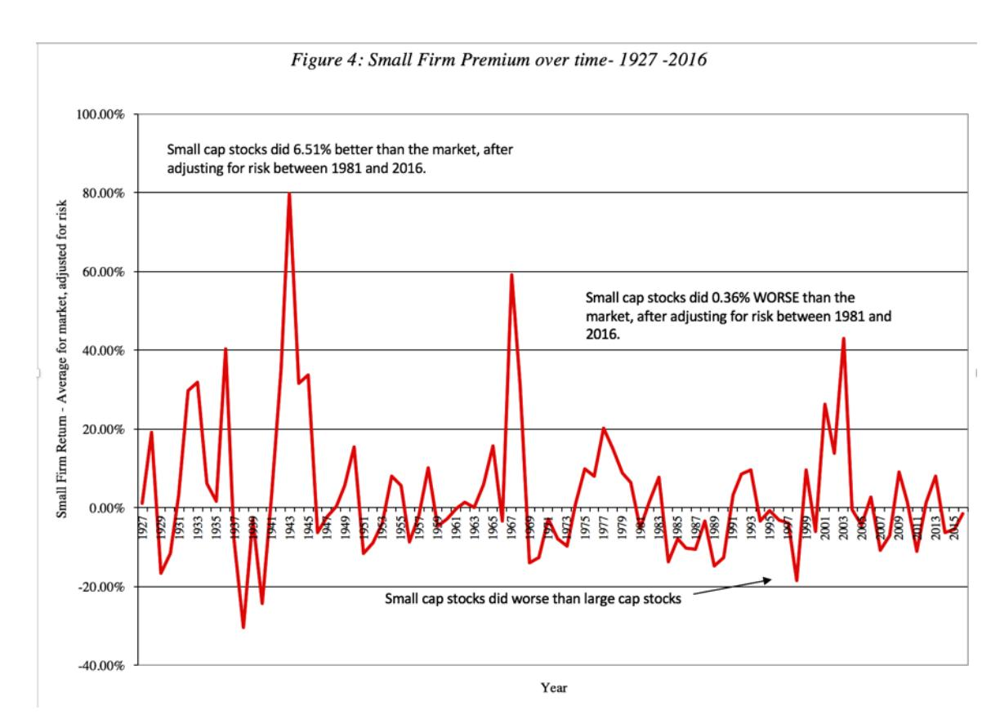

The average premium for stocks in the smallest companies, in terms of market capitalization, between 1926 and 2016 was 3.76%, but the standard error in that estimate is 1.90%. However, the small cap premium from 1981 to 2016 is -0.36%, though it enjoyed a brief resurgence between 2001 and 2005.

- 3. It is a January Premium: Much of the premium is generated in one month of the year: January. As Figure 5 shows, eliminating that month from our calculations would essentially dissipate the entire small stock premium. That would suggest that size itself is not the source of risk, since small firms in January remain small firms in the rest of the year, but that the small firm premium, if it exists, comes from some other risk that is more pronounced or prevalent in January than in the rest of the year.

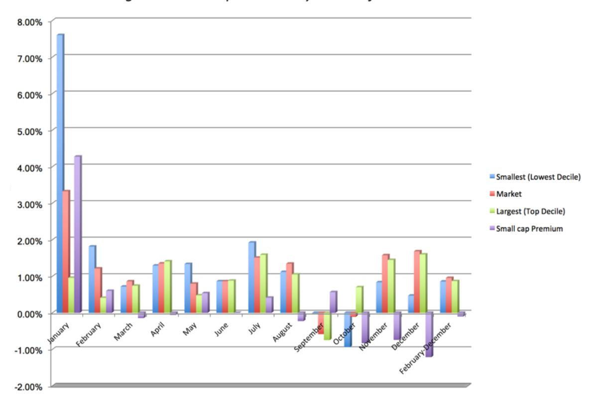

*Source: Raw data from Ken French*

Finally, a series of studies have argued that market capitalization, by itself, is not the reason for excess returns but that it is a proxy for other ignored risks such as illiquidity and poor information.

In summary, while the empirical evidence over a very long period supports the notion that small cap stocks have earned higher returns after adjusting for beta risk than large cap stocks, it is not as conclusive, nor as clean as it was initially thought to be. The argument that there is, in fact, no small cap premium and that we have observed over time is just an artifact of history should be given credence.

#### *The Small Cap Premium*

If we accept the notion that there is a small cap premium, there are two ways in which we can respond to the empirical evidence that small market cap stocks seem to earn higher returns than predicted by the traditional capital asset pricing model. One is to view this as a market inefficiency that can be exploited for profit: this, in effect, would require us to load up our portfolios with small market cap stocks that would then proceed to deliver higher than expected returns over long periods. The other is to take the excess returns as evidence that betas are inadequate measures of risk and view the additional returns are compensation for the missed risk. The fact that the small cap premium has endured for as long as it has suggests that the latter is the more reasonable path to take.

If CAPM betas understate the true risk of small cap stocks, what are the solutions? The first is to try and augment the model to reflect the missing risk, but this would require being explicit about this risk. For instance, there are models that include additional factors for illiquidity and imperfect information that claim to do better than the CAPM in predicting future returns. The second and simpler solution that is adopted by many practitioners is to add a premium to the expected return (from the CAPM) of small cap stocks. To arrive at this premium, analysts look at historical data on the returns on small cap stocks and the market, adjust for beta risk, and attribute the excess return to the small cap effect. As we noted earlier, using the data from 1926-2015, we would estimate a small cap premium of 3.82%.

Duff and Phelps present a richer set of estimates, where the premiums are computed for stocks in 25 different size classes (with size measured on eight different dimensions including market capitalization, book value and net income). Using the Fama/French data, we present excess returns for firms broken down by ten market value classes in Table 7, with the standard error for each estimate.

*Table 7: Excess Returns by Market Value Class: US Stocks from 1927 – 2016 Excess Return = Return on Portfolio – Return on Market*

| Decile   | Average | Standard Error | Maximum | Minimum |
|----------|---------|----------------|---------|---------|
| Smallest | 3.76%   | 1.90%          | 79.77%  | -30.42% |
| 2        | 1.94%   | 1.30%          | 70.44%  | -17.87% |
| 3        | 1.28%   | 0.63%          | 25.00%  | -16.83% |
| 4        | 0.80%   | 0.55%          | 16.66%  | -8.72%  |
| 5        | 0.07%   | 0.51%          | 8.98%   | -15.99% |
| 6        | 0.12%   | 0.49%          | 11.63%  | -13.72% |
| 7        | -0.60%  | 0.55%          | 7.52%   | -22.59% |
| 8        | -1.35%  | 0.77%          | 10.53%  | -30.27% |
| 9        | -2.14%  | 1.03%          | 22.07%  | -40.14% |
| Largest  | -3.88%  | 1.54%          | 31.31%  | -65.79% |

Note that the market capitalization effect shows up at both extremes – the smallest firms earn higher returns than expected whereas the largest firms earn lower returns than expected. The small firm premium is statistically significant only for the lowest and three highest size deciles. In fact, it is the large cap discount that is more pronounced (mathematically and statistically) than the small cap premium.

#### *Perils of the approach*

While the small cap premium may seem like a reasonable way of dealing with the failure of the CAPM to capture the risk in smaller companies, there are significant costs to using the approach.

- a. Standard Error on estimates: One of the dangers we noted with using historical risk premiums is the high standard error in our estimates. This danger is magnified when we look at sub-sets of stocks, based on market capitalization or any other characteristic, and extrapolate past returns. The standard errors on the small cap premiums that are estimated are likely to be significant, as is evidenced in table 7.
- b. Small versus Large Cap: At least in its simplest form, the small cap premium adjustment requires us to divide companies into small market companies and the rest of the market, with stocks falling on one side of the line having much higher required returns (and costs of equity) than stocks falling on the other side.
- c. Understanding Risk: Even in its more refined format, where the required returns are calibrated to market cap, using small cap premiums allows analysts to evade basic questions about what it is that makes smaller cap companies riskier, and whether these factors may vary across companies.
- d. Small cap companies become large cap companies over time: When valuing companies, we attach high growth rates to revenues, earnings and value over time. Consequently, companies that are small market cap companies now grow to become large market cap companies over time. Consistency demands that we adjust the small cap premium as we go further into a forecast period.
- e. Other risk premiums: Using a small cap premium opens the door to other premiums being used to augment expected returns. Thus, we could adjust expected returns upwards for stocks with price momentum and low price to book ratios, reflecting the excess returns that these characteristics seem to deliver, at least on paper. Doing

so will deliver values that are closer to market prices, across assets, but undercuts the rationale for intrinsic valuation, i.e., finding market mistakes.

There is another reason why we are wary about adjusting costs of equity for a small cap effect. If, as is the practice now, we add a small cap premium of between 4% to 5% to the cost of equity of small companies, without attributing this premium to any specific risk factor, we are exposed to the risk of double counting risk. For instance, assume that the small cap premium that we have observed over the last few decades is attributable to the lower liquidity (and higher transactions costs) of trading small cap stocks. Adding that premium on to the discount rate will reduce the estimated values of small cap and private businesses. If we attach an illiquidity discount to this value, we are double counting the effect of illiquidity.

The small cap premium is firmly entrenched in practice, with analysts generally adding on 3% to 5% to the conventional cost of equity for small companies, with the definition of small shifting from analyst to analyst. Even if you believe that small cap companies are more exposed to market risk than large cap ones, this is an extremely sloppy and lazy way of dealing with that risk, since risk ultimately has to come from something fundamental (and size is not a fundamental factor). Thus, if you believe that small cap stocks are more prone to failure or distress, it behooves you to measure that risk directly and incorporate it into the cost of equity. If it is illiquidity that is at the heart of the small cap premium, then you should be measuring liquidity risk and incorporating it into the cost of equity and you certainly should not be double counting the risk by first incorporating a small cap premium into the discount rate and then applying an illiquidity discount to value.

The question of whether there is a small cap premium ultimately is not a theoretical one but a practical one. While those who incorporate a small cap premium justify the practice with the historical data, we will present a more forward-looking approach, where we use market pricing of small capitalization stocks to see if the market builds in a small cap premium, later in this paper.

#### *Country Risk Premiums*

As both companies and investors get used to the reality of a global economy, they have also been forced to confront the consequences of globalization for equity risk premiums and hurdle rates. Should an investor putting his money in Indian stocks demand a higher risk premium for investing in equities that one investing in German stocks? Should a US consumer product company investing in Brazil demand the same hurdle rates for its Brazilian investments as it does for its US investments? In effect, should we demand one global equity risk premium that we use for investments all over the world or should we use higher equity risk premiums in some markets than in others?

#### *The arguments for no country risk premium*

Is there more risk in investing in a Malaysian or Brazilian stock than there is in investing in the United States? The answer, to most, seems to be obviously affirmative, with the solution being that we should use higher equity risk premiums when investing in riskier emerging markets. There are, however, three distinct and different arguments offered against this practice.

#### *1. Country risk is diversifiable*

In the risk and return models that have developed from conventional portfolio theory, and in particular, the capital asset pricing model, the only risk that is relevant for purposes of estimating a cost of equity is the market risk or risk that cannot be diversified away. The key question in relation to country risk then becomes whether the additional risk in an emerging market is diversifiable or non-diversifiable risk. If, in fact, the additional risk of investing in Malaysia or Brazil can be diversified away, then there should be no additional risk premium charged. If it cannot, then it makes sense to think about estimating a country risk premium.

But diversified away by whom? Equity in a publicly traded Brazilian, or Malaysian, firm can be held by hundreds or even thousands of investors, some of whom may hold only domestic stocks in their portfolio, whereas others may have more global exposure. For purposes of analyzing country risk, we look at the marginal investor – the investor most likely to be trading on the equity. If that marginal investor is globally diversified, there is at least the potential for global diversification. If the marginal investor does not have a global portfolio, the likelihood of diversifying away country risk declines substantially. Stulz (1999) made a similar point using different terminology.77 He differentiated between

77 Stulz, R.M., *Globalization, Corporate finance, and the Cost of Capital,* Journal of Applied Corporate Finance, v12. 8-25.

segmented markets, where risk premiums can be different in each market, because investors cannot or will not invest outside their domestic markets, and open markets, where investors can invest across markets. In a segmented market, the marginal investor will be diversified only across investments in that market, whereas in an open market, the marginal investor has the opportunity (even if he or she does not take it) to invest across markets. It is unquestionable that investors today in most markets have more opportunities to diversify globally than they did three decades ago, with international mutual funds and exchange traded funds, and that many more of them take advantage of these opportunities. It is also true still that a significant home bias exists in most investors' portfolios, with most investors over investing in their home markets.

Even if the marginal investor is globally diversified, there is a second test that has to be met for country risk to be diversifiable. All or much of country risk should be country specific. In other words, there should be low correlation across markets. Only then will the risk be diversifiable in a globally diversified portfolio. If, on the other hand, the returns across countries have significant positive correlation, country risk has a market risk component, is not diversifiable and can command a premium. Whether returns across countries are positively correlated is an empirical question. Studies from the 1970s and 1980s suggested that the correlation was low, and this was an impetus for global diversification.78 Partly because of the success of that sales pitch and partly because economies around the world have become increasingly intertwined over the last decade, more recent studies indicate that the correlation across markets has risen. The correlation across equity markets has been studied extensively over the last two decades and while there are differences, the overall conclusions are as follows:

- 1. The correlation across markets has increased over time, as both investors and firms have globalized. Yang, Tapon and Sun (2006) report correlations across eight, mostly developed markets between 1988 and 2002 and note that the correlation in the 1998- 2002 time period was higher than the correlation between 1988 and 1992 in every single market; to illustrate, the correlation between the Hong Kong and US markets increased from 0.48 to 0.65 and the correlation between the UK and the US markets

 78 Levy, H. and M. Sarnat, 1970, *International Diversification of Investment Portfolios*, American Economic Review 60(4), 668-75.

increased from 0.63 to 0.82.79 In the global returns sourcebook, from Credit Suisse, referenced earlier for historical risk premiums for different markets, the authors estimate the correlation between developed and emerging markets between 1980 and 2013, and note that it has increased from 0.57 in 1980 to 0.88 in 2013.

- 2. The correlation across equity markets increases during periods of extreme stress or high volatility. 80 This is borne out by the speed with which troubles in one market, say Russia, can spread to a market with little or no obvious relationship to it, say Brazil. The contagion effect, where troubles in one market spread into others is one reason to be skeptical with arguments that companies that are in multiple emerging markets are protected because of their diversification benefits. In fact, the market crisis in the last quarter of 2008 illustrated how closely bound markets have become, as can be seen in figure 6:

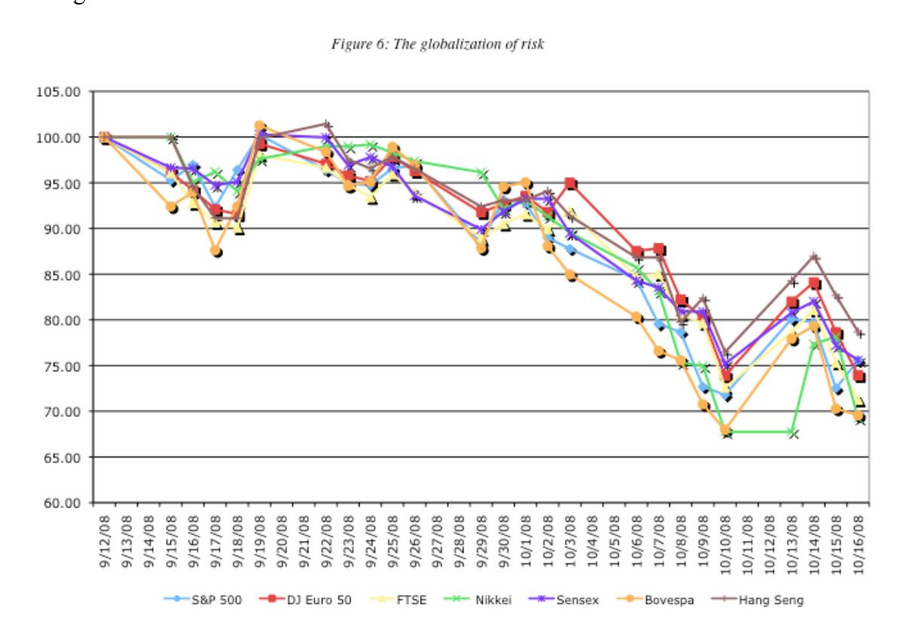

 79 Yang, Li , Tapon, Francis and Sun, Yiguo, 2006, *International correlations across stock markets and industries: trends and patterns 1988-2002*, Applied Financial Economics, v16: 16, 1171-1183

**80** Ball, C. and W. Torous, 2000, *Stochastic correlation across international stock markets*, Journal of Empirical Finance. v7, 373-388.

Between September 12, 2008 and October 16, 2008, markets across the globe moved up and down together, with emerging markets showing slightly more volatility.

- 3. The downside correlation increases more than upside correlation: In a twist on the last point, Longin and Solnik (2001) report that it is not high volatility per se that increases correlation, but downside volatility. Put differently, the correlation between global equity markets is higher in bear markets than in bull markets.81
- 4. Globalization increases exposure to global political uncertainty, while reducing exposure to domestic political uncertainty: In the most direct test of whether we should be attaching different equity risk premiums to different countries due to systematic risk exposure, Brogaard, Dai, Ngo and Zhang (2014) looked at 36 countries from 1991- 2010 and measured the exposure of companies in these countries to global political uncertainty and domestic political uncertainty.82 They find that the costs of capital of companies in integrated markets are more highly influenced by global uncertainty (increasing as uncertainty increases) and those in segmented markets are more highly influenced by domestic uncertainty. 83

#### *2. A Global Capital Asset Pricing Model*

The other argument against adjusting for country risk comes from theorists and practitioners who believe that the traditional capital asset pricing model can be adapted fairly easily to a global market. In their view, all assets, no matter where they are traded, should face the same global equity risk premium, with differences in risk captured by differences in betas. In effect, they are arguing that if Malaysian stocks are riskier than US stocks, they should have higher betas and expected returns.

While the argument is reasonable, it flounders in practice, partly because betas do not seem capable of carry the weight of measuring country risk.

81 Longin, F. and B. Solnik, 2001, *Extreme Correlation of International Equity Markets*, Journal of Finance, v56 , pg 649-675.

82 Brogaard, J., L. Dai, P.T.H. Ngo, B. Zhuang, 2014, *The World Price of Political Uncertainty*, SSRN #2488820.

83 The implied costs of capital for companies in the 36 countries were computed and related to global political uncertainty, measured using the US economic policy uncertainty index, and to domestic political uncertainty, measured using domestic national elections.

- 1. If betas are estimated against local indices, as is usually the case, the average beta within each market (Brazil, Malaysia, US or Germany) has to be one. Thus, it would be mathematically impossible for betas to capture country risk.
- 2. If betas are estimated against a global equity index, such as the Morgan Stanley Capital Index (MSCI), there is a possibility that betas could capture country risk but there is little evidence that they do in practice. Since the global equity indices are market weighted, it is the companies that are in developed markets that have higher betas, whereas the companies in small, very risky emerging markets report low betas. Table 8 reports the average beta estimated for the ten largest market cap companies in Brazil, India, the United States and Japan against the MSCI.84

*Table 8: Betas against MSCI – Large Market Cap Companies*

| Country       | Average Beta (against local index) | Average Beta (against MSCI Global) |
|---------------|------------------------------------|------------------------------------|
| India         | 0.97                               | 0.83                               |
| Brazil        | 0.98                               | 0.81                               |
| United States | 0.96                               | 1.05                               |
| Japan         | 0.94                               | 1.03                               |

The emerging market companies consistently have lower betas, when estimated against global equity indices, than developed market companies. Using these betas with a global equity risk premium will lead to lower costs of equity for emerging market companies than developed market companies. While there are creative fixes that practitioners have used to get around this problem, they seem to be based on little more than the desire to end up with higher expected returns for emerging market companies.85

#### *3. Country risk is better reflected in the cash flows*

The essence of this argument is that country risk and its consequences are better reflected in the cash flows than in the discount rate. Proponents of this point of view argue

84 The betas were estimated using two years of weekly returns from January 2006 to December 2007 against the most widely used local index (Sensex in India, Bovespa in Brazil, S&P 500 in the US and the Nikkei in Japan) and the MSCI Global Equity Index.

85 There are some practitioners who multiply the local market betas for individual companies by a beta for that market against the US. Thus, if the beta for an Indian chemical company is 0.9 and the beta for the Indian market against the US is 1.5, the global beta for the Indian company will be 1.35 (0.9\*1.5). The beta for the Indian market is obtained by regressing returns, in US dollars, for the Indian market against returns on a US index (say, the S&P 500).

that bringing in the likelihood of negative events (political chaos, nationalization and economic meltdowns) into the expected cash flows effectively risk adjusts the cashflows, thus eliminating the need for adjusting the discount rate.

This argument is alluring but it is wrong. The expected cash flows, computed by taking into account the possibility of poor outcomes, is not risk adjusted. In fact, this is exactly how we should be calculating expected cash flows in any discounted cash flow analysis. Risk adjustment requires us to adjust the expected cash flow further for its risk, i.e. compute certainty equivalent cash flows in capital budgeting terms. To illustrate why, consider a simple example where a company is considering making the same type of investment in two countries. For simplicity, let us assume that the investment is expected to deliver \$ 90, with certainty, in country 1 (a mature market); it is expected to generate \$ 100 with 90% probability in country 2 (an emerging market) but there is a 10% chance that disaster will strike (and the cash flow will be \$0). The expected cash flow is \$90 on both investments, but only a risk neutral investor would be indifferent between the two. A risk averse investor would prefer the investment in the mature market over the emerging market investment, and would demand a premium for investing in the emerging market.

In effect, a full risk adjustment to the cash flows will require us to go through the same process that we have to use to adjust discount rates for risk. We will have to estimate a country risk premium, and use that risk premium to compute certainty equivalent cash flows.86

#### *The arguments for a country risk premium*

There are elements in each of the arguments in the previous section that are persuasive but none of them is persuasive enough.

- Investors have become more globally diversified over the last three decades and portions of country risk can therefore be diversified away in their portfolios. However, the significant home bias that remains in investor portfolios exposes investors disproportionately to home country risk, and the increase in correlation

86 In the simple example above, this is how it would work. Assume that we compute a country risk premium of 3% for the emerging market to reflect the risk of disaster. The certainty equivalent cash flow on the investment in that country would be \$90/1.03 = \$87.38.

across markets has made a portion of country risk into non-diversifiable or market risk.

- As stocks are traded in multiple markets and in many currencies, it is becoming more feasible to estimate meaningful global betas, but it also is still true that these betas cannot carry the burden of capturing country risk in addition to all other macro risk exposures.
- Finally, there are certain types of country risk that are better embedded in the cash flows than in the risk premium or discount rates. In particular, risks that are discrete and isolated to individual countries should be incorporated into probabilities and expected cash flows; good examples would be risks associated with nationalization or related to acts of God (hurricanes, earthquakes etc.).

After you have diversified away the portion of country risk that you can, estimated a meaningful global beta and incorporated discrete risks into the expected cash flows, you will still be faced with residual country risk that has only one place to go: the equity risk premium.

There is evidence to support the proposition that you should incorporate additional country risk into equity risk premium estimates in riskier markets:

- 1. Historical equity risk premiums: Donadelli and Prosperi (2011) look at historical risk premiums in 32 different countries (13 developed and 19 emerging markets) and conclude that emerging market companies had both higher average returns and more volatility in these returns between 1988 and 2010 (see table 9).

*Table 9: Historical Equity Risk Premiums (Monthly) by Region*

| Region            | Monthly ERP | Standard deviation |
|-------------------|-------------|--------------------|
| Developed Markets | 0.62%       | 4.91%              |
| Asia              | 0.97%       | 7.56%              |
| Latin America     | 2.07%       | 8.18%              |
| Eastern Europe    | 2.40%       | 15.66%             |
| Africa            | 1.41%       | 6.03%              |

While we remain cautious about using historical risk premiums over short time periods (and 22 years is short in terms of stock market history), the evidence is consistent with the argument that country risk should be incorporated into a larger equity risk premium. 87

- 2. Survey premiums: Earlier in the paper, we referenced a paper by Fernandez et al (2014) that surveyed academics, analysts and companies in 88 countries on equity risk premiums. The reported average premiums vary widely across markets and are higher for riskier emerging markets, as can be seen in table 10.

*Table 10: Survey Estimates of Equity Risk Premium: By Region*

| Region            | Number of countries | Average | Median |
|-------------------|---------------------|---------|--------|
| Africa            | 4                   | 10.28%  | 9.75%  |
| Developed Markets | 21                  | 5.47%   | 5.28%  |
| Eastern Europe    | 11                  | 8.32%   | 8.03%  |
| Emerging Asia     | 12                  | 7.93%   | 7.44%  |
| EU Troubled       | 4                   | 8.95%   | 9.13%  |
| Latin America     | 12                  | 9.50%   | 9.74%  |
| Middle East       | 7                   | 7.03%   | 7.03%  |
| Grand Total       | 71                  | 7.63%   | 7.46%  |

Again, while this does not conclusively prove that country risk commands a premium, it does indicate that those who do valuations in emerging market countries seem to act like it does. Ultimately, the question of whether country risk matters and should affect the equity risk premium is an empirical one, not a theoretical one, and for the moment, at least, the evidence seems to suggest that you should incorporate country risk into your discount rates. This could change as we continue to move towards a global economy, with globally diversified investors and a global equity market, but we are not there yet.

#### *Estimating a Country Risk Premium*

If country risk is not diversifiable, either because the marginal investor is not globally diversified or because the risk is correlated across markets, we are then left with the task of measuring country risk and considering the consequences for equity risk premiums. In this section, we will consider three approaches that can be used to estimate country risk premiums, all of which build off the historical risk premiums estimated in the

87 Donadelli, M. and L. Prosperi, 2011, *The Equity Risk Premium: Empirical Evidence from Emerging Markets*, Working Paper, http://ssrn.com/abstract=1893378.

last section. To approach this estimation question, let us start with the basic proposition that the risk premium in any equity market can be written as:

Equity Risk Premium = Base Premium for Mature Equity Market + Country Risk Premium

The country premium could reflect the extra risk in a specific market. This boils down our estimation to estimating two numbers – an equity risk premium for a mature equity market and the additional risk premium, if any, for country risk. To estimate a mature market equity risk premium, we can look at one of two numbers. The first is the historical risk premium that we estimated for the United States, which yielded 4.62% as the geometric average premium for stocks over treasury bonds from 1928 to 2016. If we do this, we are arguing that the US equity market is a mature market, and that there is sufficient historical data in the United States to make a reasonable estimate of the risk premium. The other is the average historical risk premium across global equity markets, approximately 3.2%, that was estimated by Dimson et al (see earlier reference), as a counter to the survivor bias that they saw in using the US risk premium. Consistency would then require us to use this as the equity risk premium, in every other equity market that we deem mature; the equity risk premium in January 2017 would be 4.62% in Germany and Norway, for instance. For markets that are not mature, however, we need to measure country risk and convert the measure into a country risk premium, which will augment the mature market premium.

#### *Measuring Country Risk*

There are at least three measures of country risk that we can use. The first is the sovereign rating attached to a country by ratings agencies. The second is to subscribe to services that come up with broader measures of country risk that explicitly factor in the economic, political and legal risks in individual countries. The third is go with a marketbased measure such as the volatility in the country's currency or markets.

#### *I. Sovereign Ratings*

One of the simplest and most accessible measures of country risk is the rating assigned to a country's debt by a ratings agency (S&P, Moody's and Fitch, among others, all provide country ratings). These ratings measure default risk (rather than equity risk) but they are affected by many of the factors that drive equity risk – the stability of a country's currency, its budget and trade balances and political uncertainty, among other variables88.

To get a measure of country ratings, consider six countries – Germany, Brazil, China, India, Russia and Greece. In January 2017, the Moody's ratings for the countries are summarized in table 11:

*Table 11: Sovereign Ratings in January 2017 – Moody's*

| Country | Foreign Currency Rating | Local Currency Rating |
|---------|-------------------------|-----------------------|
| Brazil  | Ba2                     | Ba2                   |
| China   | Aa3                     | Aa3                   |
| Germany | Aaa                     | Aaa                   |
| Greece  | Caa3                    | Caa3                  |
| India   | Baa3                    | Baa3                  |
| Russia  | Ba1                     | Ba1                   |

What do these ratings tell us? First, the local currency and foreign currency ratings are identical for all of the countries on the list. There are a few countries (not on this list) where the two ratings diverge, and when they do, the local currency ratings tend to be higher (or at worst equal to) the foreign currency ratings for most countries, because a country should be in a better position to pay off debt in the local currency than in a foreign currency. Second, at least based on Moody's assessments at the start of 2017, Germany is the safest company in this group, followed by China, India, Russia, Brazil and Greece, in that order. Third, ratings do change over time. In fact, Brazil's rating moved from B1 in 2001 to Baa2 in 2015, reflecting both strong economic growth and a more robust political system, but it dropped back to Ba2 at the start of 2017, in the midst of political and economic problems. Appendix 2 contains the current ratings – local currency and foreign currency – for the countries that are tracked by Moody's in January 2017. 89

While ratings provide a convenient measure of country risk, there are costs associated with using them as the only measure. First, ratings agencies often lag markets when it comes to responding to changes in the underlying default risk. The ratings for

88 The process by which country ratings are obtained in explained on the S&P web site at

http://www.ratings.standardpoor.com/criteria/index.htm. 89 In a disquieting reaction to the turmoil of the market crisis in the last quarter of 2008, Moody's promoted the notion that Aaa countries were not all created equal and slotted these countries into three groups – resistant Aaa (the stongest), resilient Aaa (weaker but will probably survive intact) and vulnerable Aaa (likely to face additional default risk.

India, according to Moody's, were unchanged from 2004 to 2007, though the Indian economy grew at double-digit rates over that period. Similarly, Greece's ratings did not plummet until the middle of 2011, though their financial problems were visible well before that time. Second, the ratings agency focus on default risk may obscure other risks that could still affect equity markets. For instance, rising commodity (and especially oil) prices pushed up the ratings for commodity supplying countries (like Russia), even though there was little improvement in the rest of the economy. In the same vein, you could argue that the risk in many oil-rich Middle Eastern countries will not be captured in the default risk measure. Finally, not all countries have ratings; much of sub-Saharan Africa, for instance, is unrated as are a host of markets on the front lines of warfare or tumult.

#### *II. Country Risk Scores*

Rather than focus on just default risk, as rating agencies do, some services have developed numerical country risk scores that take a more comprehensive view of risk. These risk scores are often estimated from the bottom-up by looking at economic fundamentals in each country. This, of course, requires significantly more information and, as a consequence, most of these scores are available only to commercial subscribers.

The Political Risk Services (PRS) group, for instance, considers political, financial and economic risk indicators to come up with a composite measure of risk (ICRG) for each country that ranks from 0 to 100, with 0 being highest risk and 100 being the lowest risk.90 Appendix 3 lists countries with their composite country risk measures from the PRS Group in January 2017. 91 Harvey (2005) examined the efficacy of these scores and found that they were correlated with costs of capital, but only for emerging market companies.

The Economist, the business newsmagazine, also operates a country risk assessment unit that measures risk from 0 to 100, with 0 being the least risk and 100 being

90 The PRS group considers three types of risk – political risk, which accounts for 50% of the index, financial risk, which accounts for 25%, and economic risk, which accounts for the balance. While this table is dated, updated numbers are available for a hefty price. We have used the latest information in the public domain. Some university libraries have access to the updated data. While we have not updated the numbers, out of concerns about publishing proprietary data, you can get the latest PRS numbers by paying \$99 on their website (http://www.prsgroup.com).

91 Harvey, C.R., *Country Risk Components, the Cost of Capital, and Returns in Emerging Markets*,

Working paper, Duke University. Available at http://papers.ssrn.com/sol3/papers.cfm?abstract\_id=620710.

the most risk. In September 2008, Table 12 the following countries were ranked as least and most risky by their measure:

*Table 12: Country Risk Scores – The Economist*

| Economist.com rankings                                                  |                   |            |               |    |  |
|-------------------------------------------------------------------------|-------------------|------------|---------------|----|--|
|                                                            |                   |            |               |    |  |
| <b>Country risk</b>                                                     |                   |            |               |    |  |
| Selected countries and territories, September 2008 (except where noted) |                   |            |               |    |  |
| <b>Least risky</b>                                                      | <b>Most risky</b> |            |               |    |  |
| Rank                                                                    | Score*            | Rank       | Score         |    |  |
| <b>1</b>                                                                | Switzerland †     | <b>120</b> | Zimbabwe      | 86 |  |
| <b>2</b>                                                                | Finland **        | <b>119</b> | Iraq          | 80 |  |
|                                                                         | Norway **         | <b>118</b> | Sudan         | 76 |  |
|                                                                         | Sweden ††         | <b>117</b> | Myanmar       | 75 |  |
| <b>5</b>                                                                | Canada **         | <b>116</b> | Nicaragua     | 69 |  |
|                                                                         | Denmark †         | <b>115</b> | Jamaica       | 68 |  |
|                                                                         | Netherlands §     | <b>114</b> | Kenya         | 66 |  |
| <b>8</b>                                                                | Germany ††        | <b>113</b> | Cuba          | 64 |  |
| <b>9</b>                                                                | Austria **        | <b>112</b> | Cambodia      | 62 |  |
|                                                                         | France ††         | <b>111</b> | Côte d'Ivoire | 61 |  |
| <b>11</b>                                                               | Belgium ††        |            | Ecuador       | 61 |  |
| <b>12</b>                                                               | Singapore         |            | Pakistan      | 61 |  |
| <b>13</b>                                                               | Japan **          |            | Venezuela     | 61 |  |
| <b>14</b>                                                               | Ireland #         | 24         | Vietnam       | 61 |  |
|                                                                         | Britain           | <b>106</b> | Syria         | 60 |  |
|                                                                         | United States †   | 24         |               |    |  |

\*Out of 100, with higher numbers indicating more risk. Scores are based on indicators from three categories: currency risk, sovereign debt risk and banking risk.

In fact, comparing the PRS and Economist measures of country risk provides some insight into the problems with using their risk measures. The first is that the measures may be internally consistent but are not easily comparable across different services. The Economist, for instance, assigns its lowest scores to the safest countries whereas PRS assigns the highest scores to these countries. The second is that, by their very nature, significant components of these measures have to be black boxes to prevent others from replicating them at no cost. Third, the measures are not linear and the services do not claim that they are; a country with a risk score of 60 in the Economist measure is not twice as risky as a country with a risk score of 30.

#### *III. Market-based Measures*

To those analysts who feel that ratings agencies are either slow to respond to changes in country risk or take too narrow a view of risk, there is always the alternative of using market based measures.

- Bond default spread: We can compute a default spread for a country if it has bonds that are denominated in currencies such as the US dollar, Euro or Yen, where there is a riskfree rate to compare it to. In January 2017, for instance, a 10-year US dollar denominated bond issued by the Brazilian government had a yield to maturity of 6.09%, giving it a default spread of 3.64% over the 10-year US treasury bond rate (2.45%), as of the same time.
- Credit Default Swap Spreads: In the last few years, credit default swaps (CDS) markets have developed, allowing us to obtain updated market measures of default risk in different entities. In particular, there are CDS spreads for countries (governments) that yield measures of default risk that are more updated and precise, at least in some cases, than bond default spreads.92 Table 13 summarizes the CDS spreads for all countries where a CDS spread was available, in January 2017:

*Table 13: Credit Default Swap Spreads (in basis points)– January 2017*

| Country    | CDS    |            |        |              |       |
|------------|--------|------------|--------|--------------|-------|
|            | Spread | Country    | CDS    |              |       |
|            |        |            | Spread | Country      | CDS   |
| Abu	Dhabi  | 0.97%  | Hungary    | 1.67%  | Peru         | 1.73% |
| Argentina  | 5.14%  | Iceland    | 1.10%  | Philippines  | 1.61% |
| Australia  | 0.49%  | India      | 1.76%  | Poland       | 1.17% |
| Austria    | 0.52%  | Indonesia  | 2.25%  | Portugal     | 3.42% |
| Bahrain    | 3.17%  | Ireland    | 1.02%  | Qatar        | 1.17% |
| Belgium    | 0.60%  | Israel     | 1.12%  | Romania      | 1.51% |
| Brazil     | 3.59%  | Italy      | 2.22%  | Russia       | 2.46% |
| Bulgaria   | 1.87%  | Japan      | 0.62%  | Saudi	Arabia | 1.45% |
| Chile      | 1.29%  | Kazakhstan | 2.13%  | Slovakia     | 0.85% |
| China      | 1.65%  | Korea      | 0.67%  | Slovenia     | 1.52% |
| Colombia   | 2.42%  | Latvia     | 1.02%  | South	Africa | 2.87% |
| Costa	Rica | 3.40%  | Lebanon    | 5.57%  | Spain        | 1.25% |
| Croatia    | 2.60%  | Lithuania  | 0.94%  | Sweden       | 0.40% |
| Cyprus     | 2.67%  | Malaysia   | 1.94%  | Switzerland  | 0.50% |

92 The spreads are usually stated in US dollar or Euro terms.

| Czech     |       |                 |       |                |        |
|-----------|-------|-----------------|-------|----------------|--------|
| Republic  | 0.74% | Mexico          | 2.20% | Thailand       | 1.28%  |
| Denmark   | 0.41% | Morocco         | 2.11% | Tunisia        | 5.00%  |
| Egypt     | 4.76% | Netherlands New | 0.51% | Turkey         | 3.44%  |
| Estonia   | 0.81% |                 |       |                |        |
|           |       | Zealand         | 0.50% | Ukraine United | 7.64%  |
| Finland   | 0.45% | Nigeria         | 5.76% |                |        |
|           |       |                 |       | Kingdom        | 0.61%  |
| France    | 0.70% | Norway          | 0.34% | United	States  | 0.38%  |
| Germany   | 0.44% | Pakistan        | 4.18% | Venezuela      | 30.82% |
| Hong	Kong | 0.58% | Panama          | 1.94% | Vietnam        | 2.61%  |

Source: Bloomberg; Spreads are for 10-year US \$ CDS.

In January 2017, for instance, the CDS market yielded a spread of 3.59% for the Brazilian Government, slightly lower than the 3.64% that we obtained from the 10-year dollar denominated Brazilian bond. However, the CDS market does have some counterparty risk exposure and there is no country with a zero CDS spread, indicating either that there is no entity with default risk or that the CDS spread is not a pure default spread. To counter that problem, we netted the US CDS spread of 0.38% from each country's CDS to get a modified measure of country default risk.93 Using this approach for Brazil, for instance, yields a netted CDS spread of 3.21% (3.59% minus 0.38%) for the country.

- Market volatility: In portfolio theory, the standard deviation in returns is generally used as the proxy for risk. Extending that measure to emerging markets, there are some analysts who argue that the best measure of country risk is the volatility in local stock prices. Stock prices in emerging markets will be more volatile that stock prices in developed markets, and the volatility measure should be a good indicator of country risk. While the argument makes intuitive sense, the practical problem with using market volatility as a measure of risk is that it is as much a function of the underlying risk as it is a function of liquidity. Markets that are risky and illiquid often have low volatility, since you need trading to move stock prices. Consequently, using volatility measures

93 If we assume that there is default risk in the US, we would subtract the default spread associated with this risk from the 0.67% first, before netting the value against other CDS spreads. Thus, if the default spread for the US is 0.15%, we would subtract out only 0.52% (0.67% - 0.15%) from each country's CDS spread to get to a corrected default spread for that country.

will understate the risk of emerging markets that are illiquid and overstate the risk of liquid markets.

Market-based numbers have the benefit of constant updating and reflect the points of view of investors at any point in time. However, they also are also afflicted with all of the problems that people associate with markets – volatility, mood shifts and at times, irrationality. They tend to move far more than the other two measures – sovereign ratings and country risk scores – sometimes for good reasons and sometimes for no reason at all. *Estimating Country Risk Premium (for Equities)*

How do we link a country risk measure to a country risk premium? In this section, we will look at three approaches. The first uses default spreads, based upon country bonds or ratings, whereas the latter two use equity market volatility as an input in estimating country risk premiums.

#### *1. Default Spreads*

The simplest and most widely used proxy for the country risk premium is the default spread that investors charge for buying bonds issued by the country. This default spread can be estimated in one of three ways.

a. Current Default Spread on Sovereign Bond or CDS market: As we noted in the last section, the default spread comes from either looking at the yields on bonds issued by the country in a currency where there is a default free bond yield to which it can be compared or spreads in the CDS market.94 With the 10-year US dollar denominated Brazilian bond that we cited as an example in the last section, the default spread would have amounted to 3.64% in January 2017: the difference between the interest rate on the Brazilian bond and a treasury bond of the same maturity. The netted CDS market spread on the same day for the default spread was 3.21%. Bekaert, Harvey, Lundblad and Siegel (2014) break down the sovereign bond default spread into four components, including global economic conditions, country-specific economic factors, sovereign bond liquidity and policial risk,

94 You cannot compare interest rates across bonds in different currencies. The interest rate on a peso bond cannot be compared to the interest rate on a dollar denominated bond.

and find that it is the political risk component that best explain money flows into and out of the country equity markets.95

b. Average (Normalized) spread on bond: While we can make the argument that the default spread in the dollar denominated is a reasonable measure of the default risk in Brazil, it is also a volatile measure. In figure 7, we have graphed the yields on the dollar denominated ten-year Brazilian Bond and the U.S. ten-year treasury bond and highlighted the default spread (as the difference between the two yields) from January 2000 to January 2017. In the same figure, we also show the 10-year CDS spreads and those spreads have not only changed over time, but they move with bond default spreads.96

Note that the bond default spread widened dramatically during 2002, mostly as a result of uncertainty in neighboring Argentina and concerns about the Brazilian presidential

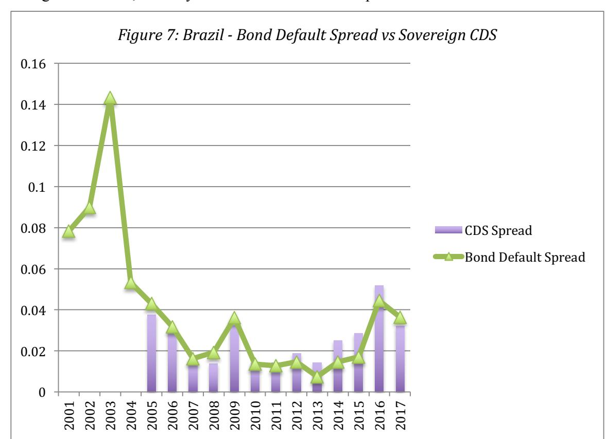

95 Bekaert, G., C.R. Harvey, C.T. Lundblad and S. Siegel, 2014, *Political Risk Spreads*, Journal of International Business Studies, v45, 471-493.

96 Data for the sovereign CDS market is available only from the last part of 2004.

elections in that year. 97 After those elections, the spreads decreased just as quickly and continued on a downward trend through the middle of last year. Between 2004 and 2013, they stabilized, with a downward trend; they spiked during the market crisis in the last quarter of 2008 but then settled back into pre-crisis levels. From 2014 through 2016, the spreads widened in both markets as the country has been hit with a series of political and corporate scandals before declining again in 2017. Given this volatility, there are some who make the arguments we should consider the average spread over a period of time rather than the default spread at the moment. If we accept this argument, the normalized default spread, using the average spreads over the last 5 years of data would be 2.40% (bond default spread) or 3.05% (CDS spread). Using this approach makes sense only if the economic fundamentals of the country have not changed significantly (for the better or worse) during the period but will yield misleading values, if there have been structural shifts in the economy. In 2008, for instance, it would have made sense to use averages over time for a country like Nigeria, where oil price movements created volatility in spreads over time, but not for countries like China and India, which saw their economies expand and mature dramatically over the period or Venezuela, where government capriciousness made operating private businesses a hazardous activity (with a concurrent tripling in default spreads). In fact, the last year has seen a spike in the Brazilian default spread, partly the result of another election and partly because of worries about political corruption and worse in large Brazilian companies.

c. Imputed or Synthetic Spread: The two approaches outlined above for estimating the default spread can be used only if the country being analyzed has bonds denominated in US dollars, Euros or another currency that has a default free rate that is easily accessible. Most emerging market countries, though, do not have government bonds denominated in another currency and some do not have a sovereign rating. For the first group (that have sovereign rating but no foreign currency government bonds), there are two solutions. If we assume that countries with the similar default risk should have the same sovereign rating, we can use the typical default spread for other countries that have the same rating as the

97 The polls throughout 2002 suggested that Lula Da Silva who was perceived by the market to be a leftist would beat the establishment candidate. Concerns about how he would govern roiled markets and any poll that showed him gaining would be followed by an increase in the default spread.

country we are analyzing and dollar denominated or Euro denominated bonds outstanding. Thus, Bulgaria, with a Baa2 rating, would be assigned the same default spread as Colombia, which also had a Baa2 rating in January 2017. For the second group, we are on even more tenuous grounds. Assuming that there is a country risk score from the Economist or PRS for the country, we could look for other countries that are rated and have similar scores and assign the default spreads that these countries face. For instance, we could assume that Brazil and Burkina Faso, which fall within the same score grouping from PRS, have similar country risk; this would lead us to attach Brazil's rating of Ba2 to Burkina Faso (which is not rated) and to use the same default spread (based on this rating) for both countries.

In table 14, we have estimated the typical default spreads for bonds in different sovereign ratings classes in January 2017. One problem that we had in obtaining the numbers for this table is that relatively few emerging markets have dollar or Euro denominated bonds outstanding. Consequently, there were some ratings classes where there was only one country with data and several ratings classes where there were none. To mitigate this problem, we used spreads from the CDS market, referenced in the earlier section. We were able to get default spreads for 65 countries, categorized by rating class, and we averaged the spreads across multiple countries in the same ratings class.98 An alternative approach to estimating default spread is to assume that sovereign ratings are comparable to corporate ratings, i.e., a Ba1 rated country bond and a Ba1 rated corporate bond have equal default risk. In this case, we can use the default spreads on corporate bonds for different ratings classes. Table 14 summarizes the typical default spreads by sovereign rating class in January 2017, and compares it to the default spreads for similar corporate ratings.

*Table 14: Default Spreads by Ratings Class – Sovereign vs. Corporate in January 2017*

| S&P Rating | Moody's Rating | Sovereign	Default	Spread | Corporate	Default	Spread |
|------------|----------------|--------------------------|--------------------------|
| AAA        | Aaa            | 0.00%                    | 0.60%                    |
| AA+        | Aa1            | 0.46%                    | 0.70%                    |
| AA         | Aa2            | 0.57%                    | 0.80%                    |
| AA-        | Aa3            | 0.70%                    | 0.90%                    |

98 There were thirteen Baa2 rated countries, with ten-year CDS spreads, in January 2016. The average spread a these countries is 2.11%.

| A+   | A1   | 0.81%  | 1.00%  |
|------|------|--------|--------|
| A    | A2   | 0.98%  | 1.10%  |
| A-   | A3   | 1.39%  | 1.25%  |
| BBB+ | Baa1 | 1.84%  | 1.40%  |
| BBB  | Baa2 | 2.20%  | 1.60%  |
| BBB- | Baa3 | 2.54%  | 2.00%  |
| BB+  | Ba1  | 2.89%  | 2.50%  |
| BB   | Ba2  | 3.47%  | 3.00%  |
| BB   | Ba3  | 4.16%  | 3.25%  |
| B+   | B1   | 5.20%  | 3.75%  |
| B    | B2   | 6.36%  | 4.50%  |
| B-   | B3   | 7.51%  | 5.50%  |
| CCC+ | Caa1 | 8.66%  | 6.00%  |
| CCC  | Caa2 | 10.40% | 6.50%  |
| CCC- | Caa3 | 11.55% | 7.00%  |
| CC+  | Ca1  | 13.86% | 7.50%  |
| CC   | Ca2  | 15.25% | 8.00%  |
| CC-  | Ca3  | 16.50% | 8.75%  |
| C+   | C1   | 18.00% | 9.50%  |
| C    | C2   | 20.00% | 10.50% |
| C-   | C3   | 25.00% | 12.00% |

*Source: FRED (Federal Reserve, St. Louis) and Bloomberg* 

Note that the corporate bond spreads, at least in January 2017, were slightly larger than the sovereign spreads for the higher ratings classes and were lower at the lowest ratings. Using this approach to estimate default spreads for Brazil, with its rating of Ba2 would result in a spread of 3.47% (3.00%), if we use sovereign spreads (corporate spreads). These spreads are roughly equal to the market-based spreads that we estimated for Brazil in the prior approaches, reflecting that ratings agencies have finally caught up with the markets in assessing default risk in Brazil.

Figure 8 depicts the alternative approaches to estimating default spreads for four countries, Brazil, China, India and Poland, in early 2017:

*Figure 8: Approaches for estimating Sovereign Default Spreads*

With some countries, without US-dollar (or Euro) denominated sovereign bonds or CDS spreads, you don't have a choice since the only estimate of the default spread comes from the sovereign rating. With some countries, such as Brazil, you have multiple estimates of the default spreads: 3.64% from the dollar denominated bond, 3.59% from the CDS spread, 3.21% from the netted CDS spread and 3.47% from the sovereign rating look up table (table 14). When the numbers they yield for Brazil are similar, we get a default spread of 2.89% from the rating-based spread) and much smaller using the market-based approaches. When this occurs, you have to choose between the "updated but noisy" market numbers and the "stable but stagnant" rating-based spread.

Analysts who use default spreads as measures of country risk typically add them on to both the cost of equity and debt of every company traded in that country. Thus, the cost of equity for an Indian company, estimated in U.S. dollars, will be 2.54% higher than the cost of equity of an otherwise similar U.S. company, using the January 2017 measure of the default spread, based upon the rating. In some cases, analysts add the default spread

| or sovereign entity Market Based estimates Sovereign Bond spread CDS Market 1. Find a bond issued by the 1. Find a 10-year CDS for the country (if one exists) Euros. 2. Net out US CDS S&P 2. This is your default AAA spread. AA+ AA Euros). AA- A+ A A- Sovereign BBB+ BBB Bond	Yield Currency BBB- | Moody's Aaa/AAA Aa1/AA+ Aa2/AA Aa3/AA- A1/A+ A2/A A3/A- Baa1/BBB+ Baa2/BBB Baa3/BBB- | Sovereign Default Spread 0.00% 0.46% 0.57% 0.70% 0.81% 0.98% 1.39% 1.84% 2.20% 2.54% |
|--------------------------------------------------------------------------------------------------------------------------------------------------------------------------------------------------------------------------------------------------------------------------------------------------------|--------------------------------------------------------------------------------------|--------------------------------------------------------------------------------------|
| BB+                                                                                                                                                                                                                                                                                                    | Ba1/BB+                                                                              | 2.89%                                                                                |
| BB                                                                                                                                                                                                                                                                                                     | Ba2/BB                                                                               | 3.47%                                                                                |
| BB                                                                                                                                                                                                                                                                                                     | Ba3/BB-                                                                              | 4.16%                                                                                |
| B+                                                                                                                                                                                                                                                                                                     | B1/B+                                                                                | 5.20%                                                                                |
| B                                                                                                                                                                                                                                                                                                      | B2/B                                                                                 | 6.36%                                                                                |
| B-                                                                                                                                                                                                                                                                                                     | B3/B-                                                                                | 7.51%                                                                                |
| CCC+                                                                                                                                                                                                                                                                                                   | Caa1/CCC+                                                                            | 8.66%                                                                                |
| CCC                                                                                                                                                                                                                                                                                                    | Caa2/CCC                                                                             | 10.40%                                                                               |
| CCC-                                                                                                                                                                                                                                                                                                   | Caa3/CCC-                                                                            | 11.55%                                                                               |
| CC+                                                                                                                                                                                                                                                                                                    | Ca1/CC+                                                                              | 13.86%                                                                               |
| CC                                                                                                                                                                                                                                                                                                     | Ca2/CC                                                                               | 15.25%                                                                               |
| CC-                                                                                                                                                                                                                                                                                                    | Ca3/CC-                                                                              | 16.50%                                                                               |
| C+                                                                                                                                                                                                                                                                                                     | C1/C+                                                                                | 18.00%                                                                               |
| C                                                                                                                                                                                                                                                                                                      | C2/C                                                                                 | 20.00%                                                                               |
| C-                                                                                                                                                                                                                                                                                                     | C3/C-                                                                                | 25.00%                                                                               |
|                                                                                                                                                                                                                                                                                                        |                                                                                      | Rating Spread                                                                        |
| Brazil                                                                                                                                                                                                                                                                                                 |                                                                                      | Ba2 3.47%                                                                            |
| China                                                                                                                                                                                                                                                                                                  |                                                                                      | Aa3 0.70%                                                                            |
| Russia                                                                                                                                                                                                                                                                                                 |                                                                                      | Ba1 2.89%                                                                            |
| India                                                                                                                                                                                                                                                                                                  |                                                                                      | Baa3 2.54%                                                                           |
| Brazil 6.09% US	\$ 2.45% 3.64% 3.21%                                                                                                                                                                                                                                                                   |                                                                                      |                                                                                      |
| China NA NA NA NA 1.27%                                                                                                                                                                                                                                                                                |                                                                                      |                                                                                      |
| Russia 4.40% US	\$ 2.45% 1.95% 2.08%                                                                                                                                                                                                                                                                   |                                                                                      |                                                                                      |
| India NA NA NA NA 1.38%                                                                                                                                                                                                                                                                                |                                                                                      |                                                                                      |

to the U.S. risk premium and multiply it by the beta. This increases the cost of equity for high beta companies and lowers them for low beta firms.99

While many analysts use default spreads as proxies for country risk, the evidence for its use is still thin. Abuaf (2011) examines ADRs from ten emerging markets and relates the returns on these ADRs to returns on the S&P 500 (which yields a conventional beta) and to the CDS spreads for the countries of incorporation. He finds that ADR returns as well as multiples (such as PE ratios) are correlated with movement in the CDS spreads over time and argues for the addition of the CDS spread (or some multiple of it) to the costs of equity and capital to incorporate country risk.100

#### *2. Relative Equity Market Standard Deviations*

There are some analysts who believe that the equity risk premiums of markets should reflect the differences in equity risk, as measured by the volatilities of these markets. A conventional measure of equity risk is the standard deviation in stock prices; higher standard deviations are generally associated with more risk. If you scale the standard deviation of one market against another, you obtain a measure of relative risk. For instance, the relative standard deviation for country X (against the US) would be computed as follows:

If we assume a linear relationship between equity risk premiums and equity market standard deviations, and we assume that the risk premium for the US can be computed (using historical data, for instance) the equity risk premium for country X follows:

Assume, for the moment, that you are using an equity risk premium for the United States of 5.69%. The annualized standard deviation in the S&P 500 in the 260 trading daysleading

$$\text{Relative Standard Deviation}_{\text{Country } X} = \frac{\text{Standard Deviation}_{\text{Country } X}}{\text{Standard Deviation}_{\text{US}}}$$

Equity risk premiumCountry X = Risk PremumUS \*Relative Standard DeviationCountry X

99 In a companion paper, I argue for a separate measure of company exposure to country risk called lambda that is scaled around one (just like beta) that is multiplied by the country risk premium to estimate the cost of equity. See Damodaran, A., 2007, Measuring Company Risk Exposure to Country Risk, Working Paper, http://papers.ssrn.com/sol3/papers.cfm?abstract\_id=889388.

100 Abuaf, N., 2011, *Valuing Emerging Market Equities – The Empirical Evidence*, Journal of Applied Finance, v21, 123-138.

into March 2017, using weekly returns, was 10.12%, whereas the standard deviation in the Bovespa (the Brazilian equity index) over the same period was 21.22%. 101 Using these values, the estimate of a total risk premium for Brazil would be as follows.

Equity Risk Premium\_Brazil = 5.69% \* 
$$\frac{21.22\%}{10.12\%} = 11.93\%$$

The country risk premium for Brazil can be isolated as follows:

Country Risk PremiumRSTUVW = 11.93% − 5.69% = 6.24%

Table 15 lists country volatility numbers for some of the Latin American markets and the resulting total and country risk premiums for these markets, based on the assumption that the equity risk premium for the United States is 5.69%. Appendix 4 contains a more complete list of emerging markets, with equity risk premiums and country risk premiums estimated for each.

*Table 15: Equity Market Volatilities and Risk Premiums (Weekly returns: Jan 1, 2014- Jan 1, 2017): Latin American Countries, relative to US*

| Country    | Annualized Stock	Market Volatility | Relative Volatility (to US) | Total Equity Risk Premium | Country risk premium |
|------------|------------------------------------|-----------------------------|---------------------------|----------------------|
| Argentina  | 26.67%                             | 2.64                        | 15.00%                    | 9.31%                |
| Brazil     | 21.22%                             | 2.10                        | 11.93%                    | 6.24%                |
| Chile      | 11.08%                             | 1.09                        | 6.23%                     | 0.54%                |
| Colombia   | 11.62%                             | 1.15                        | 6.53%                     | 0.84%                |
| Costa Rica | 7.28%                              | 0.72                        | 4.09%                     | -1.60%               |
| Mexico     | 13.54%                             | 1.34                        | 7.61%                     | 1.92%                |
| Panama     | 5.03%                              | 0.50                        | 2.83%                     | -2.86%               |
| Peru       | 16.54%                             | 1.63                        | 9.30%                     | 3.61%                |
| US         | 10.12%                             | 1.00                        | 5.69%                     | 0.00%                |
| Venezuela  | 43.37%                             | 4.29                        | 24.38%                    | 18.69%               |

While this approach has intuitive appeal, there are problems with using standard deviations computed in markets with widely different market structures and liquidity. Since equity market volatility is affected by liquidity, with more liquid markets often showing higher volatility, this approach will understate premiums for illiquid markets and overstate the

101 If the dependence on historical volatility is troubling, the options market can be used to get implied volatilities for both the US market (14.16%) and for the Bovespa (24.03%).

premiums for liquid markets. For instance, the standard deviations for Panama and Costa Rica are lower than the standard deviation in the S&P 500, leading to equity risk premiums for those countries that are lower than the US. The second problem is related to currencies since the standard deviations are usually measured in local currency terms; the standard deviation in the U.S. market is a dollar standard deviation, whereas the standard deviation in the Brazilian market is based on nominal Brazilian Real returns. This is a relatively simple problem to fix, though, since the standard deviations can be measured in the same currency – you could estimate the standard deviation in dollar returns for the Brazilian market.

#### *3. Default Spreads + Relative Standard Deviations*

In the first approach to computing equity risk premiums, we assumed that the default spreads (actual or implied) for the country were good measures of the additional risk we face when investing in equity in that country. In the second approach, we argued that the information in equity market volatility can be used to compute the country risk premium. In the third approach, we will meld the first two, and try to use the information in both the country default spread and the equity market volatility.

The country default spreads provide an important first step in measuring country equity risk, but still only measure the premium for default risk. Intuitively, we would expect the country equity risk premium to be larger than the country default risk spread. To address the issue of how much higher, we look at the volatility of the equity market in a country relative to the volatility of the bond market used to estimate the spread. This yields the following estimate for the country equity risk premium.

To illustrate, consider again the case of Brazil. As noted earlier, the default spread for Brazil in January 2017, based upon its sovereign rating, was 3.47%. We computed annualized standard deviations, using two years of weekly returns, in both the equity market and the government bond, in January 2016. The annualized standard deviation in the Brazilian dollar denominated ten-year bond was 10.01%, well below the standard deviation in the Brazilian equity index of 21.22%. The resulting country equity risk premium for Brazil is as follows:

$$\text{Country Risk Premium} = \text{Country Default Spread} * \left( \frac{\sigma_{\text{Equity}}}{\sigma_{\text{Country Bond}}} \right)$$

Brazil Country Risk Premium = 3.47% \* 
$$\frac{21.22\%}{10.01\%}$$
 = 7.35%

Unlike the equity standard deviation approach, this premium is in addition to a mature market equity risk premium. Thus, assuming a 5.69% mature market premium, we would compute a total equity risk premium for Brazil of 13.04%:

Brazil's Total Equity Risk Premium = 5.69% + 7.35% = 13.04%

Note that this country risk premium will increase if the country rating drops or if the relative volatility of the equity market increases.

Why should equity risk premiums have any relationship to country bond spreads? A simple explanation is that an investor who can make 3.47% risk premium on a dollardenominated Brazilian government bond would not settle for an additional risk premium of 3.47% (in dollar terms) on Brazilian equity. Playing devil's advocate, however, a critic could argue that the interest rate on a country bond, from which default spreads are extracted, is not really an expected return since it is based upon the promised cash flows (coupon and principal) on the bond rather than the expected cash flows. In fact, if we wanted to estimate a risk premium for bonds, we would need to estimate the expected return based upon expected cash flows, allowing for the default risk. This would result in a lower default spread and equity risk premium. Both this approach and the last one use the standard deviation in equity of a market to make a judgment about country risk premium, but they measure it relative to different bases. This approach uses the country bond as a base, whereas the previous one uses the standard deviation in the U.S. market. This approach assumes that investors are more likely to choose between Brazilian bonds and Brazilian equity, whereas the previous approach assumes that the choice is across equity markets.

There are three potential measurement problems with using this approach. The first is that the relative standard deviation of equity is a volatile number, both across countries and across time. The second is that computing the relative volatility requires us to estimate volatility in the government bond, which, in turn, presupposes that long-term government bonds not only exist but are also traded.102 The third is that even if an emerging market

102 One indication that the government bond is not heavily traded is an abnormally low standard deviation on the bond yield.

meet the conditions of having a government bond that is traded, the trading is often so light that the standard deviation is too low (and the relative volatility value is too high). To illustrate the volatility in this number, note the range of values in the estimates of relative volatility at the start of 2017:

*Table 16: Relative Equity Market Volatility – Government Bonds and CDS*

|                               | s Equity / s Bond | s Equity / s CDS |
|-------------------------------|-------------------|------------------|
| Number of countries with data | 40                | 46               |
| Average                       | 2.05              | 1.02             |
| Median                        | 2.09              | 0.72             |
| Maximum                       | 3.70              | 4.69             |
| Minimum                       | 0.33              | 0.06             |

Note that there were only 40 markets where volatility estimates on government bonds were available, and even in those markets, the relative volatility measure ranged from a high of 3.70 to a low of 0.33. In many the markets where volatility measures are available, the government bond is so thinly traded to make it an unreliable value. There is some promise in the sovereign CDS market, both because you have more countries where you have traded CDS, but also because it is a more volatile market. In fact, the relative volatility measure there has a median value less than one, but the range in relative equity volatility values is even higher.

The problems associated with computing country-specific government bond or sovereign CDS volatility are increasingly overwhelming its intuitive appeal and it is worth looking at two alternatives. 103 One is to revert back to the first approach of using the default spreads as country risk premiums. The other is to compare the standard deviation of an emerging market equity index and that of an emerging market government bond index and to use this use this ratio as the scaling variable for all emerging market default spreads. While there will be some loss of information at the country level, the use of indices should allow for aggregation across multiple countries and perhaps give a more reliable and stable measure of relative risk in equity markets. To this end, we computed the standard deviations in the S&P BMI Emerging Market Index (for equity) and the Bank of America

103 Thanks are due to the Value Analysis team at Temasek, whose detailed and focused work on the imprecision of government bond volatility finally led to this break.

Merrill Lynch Emerging Market Public Sector Bond Index (for sovereign debt) as of January 1, 2017, and computed a relative equity market volatility of 1.23:

$$\text{Relative Equity Volatility}_{\text{EM}} = \frac{\text{Standard Deviation of S\&P BMI Emerging Markets}}{\text{Standard Deviation of BAML Emerging Market Public Bonds}} = 14.12\%/ 11.48\% = 1.23$$

Applying this multiple to each country's default spread, you can estimate a country risk premium for that country, which when added on to the base premium for a mature market should yield an equity risk premium for that country. In fact, with this multiple applied to Brazil's default spread of 3.47% in January 2017, you would have obtained a country risk premium of 4.27% for Brazil and a total equity risk premium of 9.96% (using 5.69% as the estimate for a mature market premium).

Country Risk Premium for Brazil = 3.47% \*1.23 = 4.27%

Equity Risk Premium for Brazil = 5.69% + 4.27% = 9.96%

*Choosing between the approaches*

It is ironic that as investors and companies go global, our approaches for dealing with country risk remain unpolished. Each of the approaches described in this section come with perils and can yield very different values. Table 17 summarizes the estimates of country risk and total equity risk premiums, using the three approaches, with sub-variants, for Brazil in January 2017:

*Table 17: Country and Total Equity Risk Premium: Brazil in January 2017*

| Approach                                                     | ERP    | CRP   |
|--------------------------------------------------------------|--------|-------|
| Rating-based Default Spread                                  | 9.16%  | 3.47% |
| \$-Bond based Default Spread                                 | 9.33%  | 3.64% |
| CDS-based Default Spread                                     | 8.90%  | 3.21% |
| Relative Equity Market Volatility                            | 11.93% | 6.24% |
| Default Spread, scaled for equity risk with Brazil Govt Bond | 13.04% | 7.35% |
| Default Spread, scaled for equity risk with EM multiple      | 9.96%  | 4.27% |

The default-spread based approaches yield similar equity risk premiums, but the approaches that scale standard deviations (to either equity or the government bond) yield much higher values. With all the approaches, just as companies mature and become less risky over time, countries can mature and become less risky as well and it is reasonable to assume that country risk premiums decrease over time, especially for risky and rapidly evolving markets. One way to adjust country risk premiums over time is to begin with the premium that emerges from the melded approach and to adjust this premium down towards either the country bond default spread or even a regional average. Thus, the equity risk premium will converge to the country bond default spread as we look at longer term expected returns. As an illustration, the country risk premium for Brazil would be 4.27% for the next year but decline over time to 3.47% (country default spread) or perhaps even lower, depending upon your assessment of how Brazil's economy will evolve over time.

#### **Implied Equity Premiums**

The problem with any historical premium approach, even with substantial modifications, is that it is backward looking. Given that our objective is to estimate an updated, forward-looking premium, it seems foolhardy to put your faith in mean reversion and past data. In this section, we will consider three approaches for estimating equity risk premiums that are more forward looking.

### *1. DCF Model Based Premiums*

When investors price assets, they are implicitly telling you what they require as an expected return on that asset. Thus, if an asset has expected cash flows of \$15 a year in perpetuity, and an investor pays \$75 for that asset, he is announcing to the world that his required rate of return on that asset is 20% (15/75). In this section, we expand on this intuition and argue that the current market prices for equity, in conjunction with expected cash flows, should yield an estimate on the equity risk premium.

#### *A Stable Growth DDM Premium*

It is easiest to illustrated implied equity premiums with a dividend discount model (DDM). In the DDM, the value of equity is the present value of expected dividends from the investment. In the special case where dividends are assumed to grow at a constant rate forever, we get the classic stable growth (Gordon) model:

Value of equity = 
$$\frac{\text{Expected Dividends Next Period}}{(\text{Required Return on Equity - Expected Growth Rate})}$$

This is essentially the present value of dividends growing at a constant rate. Three of the four inputs in this model can be obtained or estimated - the current level of the market (value), the expected dividends next period and the expected growth rate in earnings and dividends in the long term. The only "unknown" is then the required return on equity; when we solve for it, we get an implied expected return on stocks. Subtracting out the riskfree rate will yield an implied equity risk premium.

To illustrate, assume that the current level of the S&P 500 Index is 900, the expected dividend yield on the index is 2% and the expected growth rate in earnings and dividends in the long term is 7%. Solving for the required return on equity yields the following:

$$900 = (.02*900) / (r - .07)$$

Solving for r,

r = (18+63)/900 = 9%

If the current riskfree rate is 6%, this will yield a premium of 3%.

In fact, if we accept the stable growth dividend discount model as the base model for valuing equities and assume that the expected growth rate in dividends should equate to the riskfree rate in the long term, the dividend yield on equities becomes a measure of the equity risk premium:

Value of equity = 
$$\frac{\text{Expected Dividends Next Period}}{(\text{Required Return on Equity} - \text{Expected Growth Rate})}$$

Dividends/ Value of Equity = Required Return on Equity – Expected Growth rate Dividend Yield = Required Return on Equity – Riskfree rate = Equity Risk Premium

Rozeff (1984) made this argument104 and empirical support has been claimed for dividend yields as predictors of future returns in many studies since.105 Note that this simple equation will break down if (a) companies do not pay out what they can afford to in dividends, i.e., they hold back cash or (b) if earnings are expected to grow at extraordinary rates for the short term.

104 Rozeff, M. S. 1984. *Dividend yields are equity risk premiums*, Journal of Portfolio Management, v11, 68- 75.

105 Fama, E. F., and K. R. French. 1988. *Dividend yields and expected stock returns*. Journal of Financial Economics, v22, 3-25.

There is another variant of this model that can be used, where we focus on earnings instead of dividends. To make this transition, though, we have to state the expected growth rate as a function of the payout ratio and return on equity (ROE) :106

| Growth rate = (1 – Dividends/ Earnings) (Return on equity) $= (1 - \text{Payout ratio}) (\text{ROE})$ |
|-------------------------------------------------------------------------------------------------------|
|-------------------------------------------------------------------------------------------------------|

Substituting back into the stable growth model,

Value of equity = Expected Earnings Next Period (Payout ratio) (Required Return on Equity - (1-Payout ratio) (ROE))

If we assume that the return on equity (ROE) is equal to the required return on equity (cost of equity), i.e., that the firm does not earn excess returns, this equation simplifies as follows:

Value of equity = 
$$\frac{\text{Expected Earnings Next Period}}{\text{Required Return on Equity}}$$

In this case, the required return on equity can be written as:

| Required return on equity = $\frac{\text{Expected Earnings Next Period}}{\text{Value of Equity}}$ |
|---------------------------------------------------------------------------------------------------|
|---------------------------------------------------------------------------------------------------|

In effect, the inverse of the PE ratio (also referenced as the earnings yield) becomes the required return on equity, if firms are in stable growth and earning no excess returns. Subtracting out the riskfree rate should yield an implied premium:

Implied premium (EP approach) = Earnings Yield on index – Riskfree rate In January 2015, the first of these approaches would have delivered a very low equity risk premium for the US market.

Dividend Yield = 1.87%

The second approach of netting the earnings yield against the risk free rate would have generated a more plausible number107:

Earnings Yield = 5.57%: Implied premium = Earnings yield – 10-year US Treasury Bond rate

106 This equation for sustainable growth is discussed more fully in Damodaran, A., 2002, Investment Valuation, John Wiley and Sons.

107 The earnings yield in January 2015 is estimated by dividing the aggregated earnings for the index by the index level.

= 5.57% - 2.17% = 3.40%

Both approaches, though, draw on the dividend discount model and make strong assumptions about firms being in stable growth and/or long-term excess returns.

#### *A Generalized Model: Implied Equity Risk Premium*

To expand the model to fit more general specifications, we would make the following changes: Instead of looking at the actual dividends paid as the only cash flow to equity, we would consider potential dividends instead of actual dividends. In my earlier work (2002, 2006), the free cash flow to equity (FCFE), i.e, the cash flow left over after taxes, reinvestment needs and debt repayments, was offered as a measure of potential dividends.108 Over the last decade, for instance, firms have paid out only about half their FCFE as dividends. If this poses too much of an estimation challenge, there is a simpler alternative. Firms that hold back cash build up large cash balances that they use over time to fund stock buybacks. Adding stock buybacks to aggregate dividends paid should give us a better measure of total cash flows to equity. The model can also be expanded to allow for a high growth phase, where earnings and dividends can grow at rates that are very different (usually higher, but not always) than stable growth values. With these changes, the value of equity can be written as follows:

Value of Equity = 
$$\sum_{t=1}^{t=N} \frac{E(\text{FCFE}_t)}{(1+k_e)^t} + \frac{E(\text{FCFE}_{N+1})}{(k_e - g_N)(1+k_e)^N}$$

In this equation, there are N years of high growth, E(FCFEt) is the expected free cash flow to equity (potential dividend) in year t, ke is the rate of return expected by equity investors and gN is the stable growth rate (after year N). We can solve for the rate of return equity investors need, given the expected potential dividends and prices today. Subtracting out the riskfree rate should generate a more realistic equity risk premium.

In a variant of this approach, the implied equity risk premium can be computed from excess return or residual earnings models. In these models, the value of equity today

108 Damodaran, A., 2002, *Investment Valuation*, John Wiley and Sons; Damodaran, A., 2006, *Damodaran on Valuation*, John Wiley and Sons.

can be written as the sum of capital invested in assets in place and the present value of future excess returns:109

Value of Equity = Book Equity today + 
$$\sum_{t=1}^{t=\infty} \frac{\text{Net Income}_t - k_e(\text{Book Equity}_{t-1})}{(1 + k_e)^t}$$

If we can make estimates of the book equity and net income in future periods, we can then solve for the cost of equity and use that number to back into an implied equity risk premium. Claus and Thomas (2001) use this approach, in conjunction with analyst forecasts of earnings growth, to estimate implied equity risk premiums of about 3% for the market in 2000.110 Easton (2007) provides a summary of possible limitations of models that attempt to extract costs of equity from accounting data including the unreliability of book value numbers and the use of optimistic estimates of growth from analysts. 111

#### *Implied Equity Risk Premium: S&P 500*

Given its long history and wide following, the S&P 500 is a logical index to use to try out the implied equity risk premium measure. In this section, we will begin by estimating implied equity risk premiums at the start of the years 2008 to 2016, and follow up by looking at the volatility in that estimate over time.

#### *Implied Equity Risk Premiums: Annual Estimates from 2008 to 2016*

On December 31, 2007, the S&P 500 Index closed at 1468.36, and the dividend yield on the index was roughly 1.89%. In addition, the consensus estimate of growth in earnings for companies in the index was approximately 5% for the next 5 years.112 Since this is not a growth rate that can be sustained forever, we employ a two-stage valuation model, where we allow growth to continue at 5% for 5 years, and then lower the growth

109 For more on excess return models, see Damodaran, A, 2006, *Valuation Approaches and Metrics: A Survey of the Theory and Evidence,* Working Paper, www.damodaran.com.

110 Claus, J. and J. Thomas, 2001,'*Equity premia as low as three percent? Evidence from analysts'* 

*earnings forecasts for domestic and international stock markets*, Journal of Finance 56(5), 1629–1666.

111 Easton, P., 2007, *Estimating the cost of equity using market prices and accounting data*, Foundations and Trends in Accounting, v2, 241-364.

112 We used the average of the analyst estimates for individual firms (bottom-up). Alternatively, we could have used the top-down estimate for the S&P 500 earnings.

rate to 4.02% (the riskfree rate) after that.113 Table 18 summarizes the expected dividends for the next 5 years of high growth, and for the first year of stable growth thereafter:

*Table 18: Estimated Dividends on the S&P 500 Index – January 1, 2008*

| Year | Dividends on Index |
|------|--------------------|
| 1    | 29.12              |
| 2    | 30.57              |
| 3    | 32.10              |
| 4    | 33.71              |
| 5    | 35.39              |
| 6    | 36.81              |

a Dividends in the first year = 1.89% of 1468.36 (1.05)

If we assume that these are reasonable estimates of the expected dividends and that the index is correctly priced, the value can be written as follows:

Note that the last term in the equation is the terminal value of the index, based upon the stable growth rate of 4.02%, discounted back to the present. Solving for required return in this equation yields us a value of 6.04%. Subtracting out the ten-year treasury bond rate (the riskfree rate) yields an implied equity premium of 2.02%.

The focus on dividends may be understating the premium, since the companies in the index have bought back substantial amounts of their own stock over the last few years. In 2007, for instance, firms collectively returned more than twice as much in the form of buybacks than they paid out in dividends. Since buybacks are volatile over time, and 2007 may represent a high-water mark for the phenomenon, we recomputed the expected cash flows, in table 19, for the next 6 years using the average total yield (dividends + buybacks) of 4.11%, instead of the actual dividends, and the growth rates estimated earlier (5% for the next 5 years, 4.02% thereafter):

| $1468.36 = \frac{29.12}{(1+r)} + \frac{30.57}{(1+r)^2} + \frac{32.10}{(1+r)^3} + \frac{33.71}{(1+r)^4} + \frac{35.39}{(1+r)^5} + \frac{36.81}{(r-.0402)(1+r)^6}$ |
|------------------------------------------------------------------------------------------------------------------------------------------------------------------|
|------------------------------------------------------------------------------------------------------------------------------------------------------------------|

113 The treasury bond rate is the sum of expected inflation and the expected real rate. If we assume that real growth is equal to the real interest rate, the long term stable growth rate should be equal to the treasury bond rate.

*Table 19: Cashflows on S&P 500 Index*

| Year | Dividends+ Buybacks on Index |
|------|------------------------------|
| 1    | 63.37                        |
| 2    | 66.54                        |
| 3    | 69.86                        |
| 4    | 73.36                        |
| 5    | 77.02                        |

Using these cash flows to compute the expected return on stocks, we derive the following:

Solving for the required return and the implied premium with the higher cash flows:

Required Return on Equity = 8.39%

Implied Equity Risk Premium = Required Return on Equity - Riskfree Rate

= 8.48% - 4.02% = 4.46%

This value (4.46%) would have been our estimate of the equity risk premium on January 1, 2008.

During 2008, the S&P 500 lost just over a third of its value and ended the year at 903.25 and the treasury bond rate plummeted to close at 2.21% on December 31, 2008. Firms also pulled back on stock buybacks and financial service firms in particular cut dividends during the year. The inputs to the equity risk premium computation reflect these changes:

Level of the index = 903.25 (Down from 1468.36)

Treasury bond rate = 2.21% (Down from 4.02%)

Updated dividends and buybacks on the index = 52.58 (Down about 15%)

Expected growth rate = 4% for next 5 years (analyst estimates) and 2.21% thereafter

(set equal to riskfree rate).

The computation is summarized below:

$$1468.36 = \frac{63.37}{(1+r)} + \frac{66.54}{(1+r)^2} + \frac{69.86}{(1+r)^3} + \frac{73.36}{(1+r)^4} + \frac{77.02}{(1+r)^5} + \frac{77.02(1.0402)}{(r-.0402)(1+r)^6}$$

The resulting equation is below:

Solving for the required return and the implied premium with the higher cash flows:

Required Return on Equity = 8.64%

Implied Equity Risk Premium = Required Return on Equity - Riskfree Rate

= 8.64% - 2.21% = 6.43%

The implied premium rose more than 2%, from 4.37% to 6.43%, over the course of the year, indicating that investors perceived more risk in equities at the end of the year, than they did at the start and were demanding a higher premium to compensate.

By January 2010, the fears of a banking crisis had subsided and the S&P 500 had recovered to 1115.10. However, a combination of dividend cuts and a decline in stock buybacks had combined to put the cash flows on the index down to 40.38 in 2009. That was partially offset by increasing optimism about an economic recovery and expected earnings growth for the next 5 years had bounced back to 7.2%.114 The resulting equity risk premium is 4.36%:

January 1, 2009 S&P 500 is at 903.25 Adjusted Dividends & Buybacks for 2008 = 52.58

*In 2008, the actual cash returned to stockholders was 68.72. However, there was a 41% dropoff in buybacks in Q4. We reduced the total buybacks for the year by that* 

*amount.*

Analysts expect earnings to grow 4% a year for the next 5 years. We

will assume that dividends & buybacks will keep pace.. Last year's cashflow (52.58) growing at 4% a year

After year 5, we will assume that earnings on the index will grow at 2.21%, the same rate as the entire economy (= riskfree rate).

54.69 56.87 59.15 61.52 63.98

Expected Return on Stocks (1/1/09) = 8.64% Equity Risk Premium = 8.64% - 2.21% = 6.43%

| $903.25 = \frac{54.69}{(1+r)} + \frac{56.87}{(1+r)^2} + \frac{59.15}{(1+r)^3} + \frac{61.52}{(1+r)^4} + \frac{63.98}{(1+r)^5} + \frac{63.98(1.0221)}{(r-.0221)(1+r)^6}$ |
|-------------------------------------------------------------------------------------------------------------------------------------------------------------------------|
|-------------------------------------------------------------------------------------------------------------------------------------------------------------------------|

114 The expected earnings growth for just 2010 was 21%, primarily driven by earnings bouncing back to precrisis levels, followed by a more normal 4% earnings growth in the following years. The compounded average growth rate is ((1.21) (1.04)4 ) 1/5-1= .072 or 7.2%.

In effect, equity risk premiums have reverted back to what they were before the 2008 crisis.

Updating the numbers to January 2011, the S&P 500 had climbed to 1257.64, but cash flows on the index, in the form of dividends and buybacks, made an even more impressive comeback, increasing to 53.96 from the depressed 2009 levels. The implied equity risk premium computation is summarized below:

The implied equity risk premium climbed to 5.20%, with the higher cash flows more than offsetting the rise in equity prices.

The S&P 500 ended 2011 at 1257.60, almost unchanged from the level at the start of the year. The other inputs into the implied equity risk premium equation changed significantly over the year:

- a. The ten-year treasury bond rate dropped during the course of the year from 3.29% to 1.87%, as the European debt crisis caused a "flight to safety". The US did lose its AAA rating with Standard and Poor's during the course of the year, but we will continue to assume that the T.Bond rate is risk free.
- b. Companies that had cut back dividends and scaled back stock buybacks in 2009, after the crisis, and only tentatively returned to the fray in 2010, returned to buying

January 1, 2010 S&P 500 is at 1115.10 Adjusted Dividends & Buybacks for 2009 = 40.38

*In 2009, the actual cash returned to stockholders was 40.38. That was down about 40% from 2008 levels.* Analysts expect earnings to grow 21% in 2010, resulting in a

compounded annual growth rate of 7.2% over the next 5 years. We

will assume that dividends & buybacks will keep pace.

After year 5, we will assume that earnings on the index will grow at 3.84%, the same rate as the entire economy (= riskfree rate).

43.29 46.40 49.74 53.32 57.16

Expected Return on Stocks (1/1/10) = 8.20% T.Bond rate on 1/1/10 = 3.84 % Equity Risk Premium = 8.20% - 3.84% = 4.36%

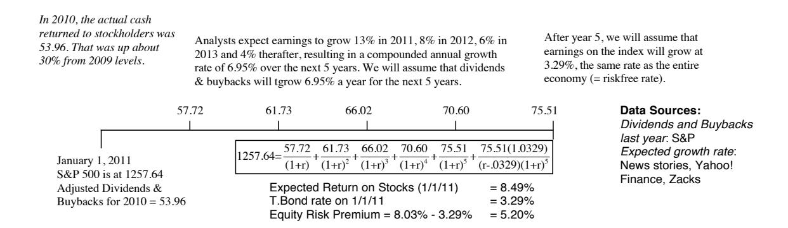

back stocks at almost pre-crisis levels. The total dividends and buybacks for the trailing 12 months leading into January 2012 climbed to 72.23, a significant increase over the previous year.115

- c. Analysts continued to be optimistic about earnings growth, in the face of signs of a pickup in the US economy, forecasting growth rate of 9.6% for 2012 (year 1), 11.9% in 2013, 8.2% in 2014, 4% in 2015 and 2.5% in 2016, leading to a compounded annual growth rate of 7.18% a year.

Incorporating these inputs into the implied equity risk premium computation, we get an expected return on stocks of 9.29% and an implied equity risk premium of 7.32%:

Since the index level did not change over the course of the year, the jump in the equity risk premium from 5.20% on January 1, 2011 to 7.32% on January 1, 2012, was precipitated by two factors. The first was the drop in the ten-year treasury bond rate to a historic low of 1.87% and the second was the surge in the cash returned to stockholders, primarily in buybacks. With the experiences of the last decade fresh in our minds, we considered the possibility that the cash returned during the trailing 12 months may reflect cash that had built up during the prior two years, when firms were in their defensive posture. If that were the case, it is likely that buybacks will decline to a more normalized value in future years. To estimate this value, we looked at the total cash yield on the S&P 500 from 2002 to 2011 and computed an average value of 4.69% over the decade in table 20.

*Table 20: Dividends and Buybacks on S&P 500 Index: 2002-2011*

| Year | Dividend Yield | Buybacks/Index | Yield |
|------|----------------|----------------|-------|
|      |                |                |       |

115 These represented dividends and stock buybacks from October 1, 2010 to September 30, 2011, based upon the update from S&P on December 22, 2011. The data for the last quarter is not made available until late March of the following year.

January 1, 2012 S&P 500 is at 1257.60 Dividends & Buybacks for

2011 = 72.23

*In the trailing 12 months, the cash returned to stockholders* 

*was 72.23.* 

Analysts expect earnings to grow 9.6% in 2012, 11.9% in 2013, 8.2% in 2014, 4.5% in 2015 and 2% therafter, resulting in a compounded annual growth rate of 7.18% over the next 5 years. We will assume that dividends & buybacks will grow 7.18% a year for

the next 5 years.

After year 5, we will assume that earnings on the index will grow at 1.87%, the same rate as the entire economy (= riskfree rate).

82.97 88.93 95.31 102.16

Expected Return on Stocks (1/1/12) = 9.19% T.Bond rate on 1/1/12 = 1.87% Equity Risk Premium = 7.91% - 1.87% = 7.32%

77.41 **Data Sources:**

*Dividends and Buybacks* 

*last year*: S&P *Expected growth rate*: News stories, Yahoo! Finance, Bloomberg

1257.60 = 77.41 (1+ *r*) + 82.97 (1+ *r*)

2 + 88.93 (1+ *r*)

3 + 95.31 (1+ *r*)

4 +102.16 (1+ *r*)

5 + 102.16(1.0187) (*r* −.0187)(1+ *r*)

| 2002                     | 1.81% | 1.58% | 3.39% |
|--------------------------|-------|-------|-------|
| 2003                     | 1.61% | 1.23% | 2.84% |
| 2004                     | 1.57% | 1.78% | 3.35% |
| 2005                     | 1.79% | 3.11% | 4.90% |
| 2006                     | 1.77% | 3.39% | 5.16% |
| 2007                     | 1.92% | 4.58% | 6.49% |
| 2008                     | 3.15% | 4.33% | 7.47% |
| 2009                     | 1.97% | 1.39% | 3.36% |
| 2010                     | 1.80% | 2.61% | 4.42% |
| 2011                     | 2.00% | 3.53% | 5.54% |
| Average: Last 10 years = |       |       | 4.69% |

Assuming that the cash returned would revert to this yield provides us with a lower estimate of the cash flow (4.69% of 1257.60= 59.01) and an equity risk premium of 6.01%:

So, did the equity risk premium for the S&P 500 jump from 5.20% to 7.32%, as suggested by the raw cash yield, or from 5.20% to 6.01%, based upon the normalized yield? We would be more inclined to go with the latter, especially since the index remained unchanged over the year. Note, though, that if the cash returned by firms does not drop back in the next few quarters, we will revisit the assumption of normalization and the resulting lower equity risk premium.

By January 1, 2013, the S&P 500 climbed to 1426.19 and the treasury bond rate had dropped to 1.76%. The dividends and buybacks were almost identical to the prior year and the smoothed out cash returned (using the average yield over the prior 10 years) climbed to 69.46. Incorporating the lower growth expectations leading into 2013, the implied equity risk premium dropped to 5.78% on January 1, 2013:

January 1, 2012 S&P 500 is at 1257.60 Normalized Dividends & Buybacks for 2011 = 59.01

*In the trailing 12 months, the cash returned to stockholders was 72.23. Using the average cash yield of 4.69% for 2002-2011 the cash returned would have been 59.01.*

Analysts expect earnings to grow 9.6% in 2012, 11.9% in 2013, 8.2% in 2014, 4.5% in 2015 and 2.5% therafter, resulting in a compounded annual growth rate of 7.18% over the next 5 years. We will assume that dividends & buybacks will grow 7.18% a year for

the next 5 years.

After year 5, we will assume that earnings on the index will grow at 1.87%, the same rate as the entire economy (= riskfree rate).

67.78 72.65 77.87 83.46

Expected Return on Stocks (1/1/12) = 7.88% T.Bond rate on 1/1/12 = 1.87% Equity Risk Premium = 7.91% - 1.87% = 7.32%

63.24 **Data Sources:**

*Dividends and Buybacks* 

*last year*: S&P *Expected growth rate*: News stories, Yahoo! Finance, Bloomberg

1257.60= 63.24 (1+r) + 67.78 (1+r)

2 + 72.65 (1+r)

3 + 77.87 (1+r)

4 + 83.46 (1+r)

5 + 83.46(1.0287) (r-.0187)(1+r)

Note that the chasm between the trailing 12-month cash flow premium and the smoother cash yield premium that had opened up at the start of 2012 had narrowed. The trailing 12 month cash flow premium was 6%, just 0.22% higher than the 5.78% premium obtained with the smoothed out cash flow.

After a good year for stocks, the S&P 500 was at 1848.36 on January 1, 2014, up 29.6% over the prior year, and cash flows also jumped to 84.16 over the trailing 12 months (ending September 30, 2013), up 16.48% over the prior year. Incorporating an increase in the US ten-year treasury bond rate to 3.04%, the implied equity risk premium at the start of 2014 was 4.96%.

During 2014, stocks continued to rise, albeit at a less frenetic pace, and the US ten-year treasury bond rate dropped back again to 2.17%. Since buybacks and dividends grew at higher rate than prices, the net effect was an increase in the implied equity risk premium to 5.78% at the start of 2015:

January 1, 2013 S&P 500 is at 1426.19 Adjusted Dividends & Buybacks for base year = 69.46

*In 2012, the actual cash returned to stockholders was 72.25. Using the average total yield for the last decade yields 69.46*

Analysts expect earnings to grow 7.67% in 2013, 7.28% in 2014, scaling down to 1.76% in 2017, resulting in a compounded annual growth rate of 5.27% over the next 5 years. We will assume that dividends & buybacks will tgrow 5.27% a year for the next 5 years. After year 5, we will assume that earnings on the index will grow at 1.76%, the same rate as the entire economy (= riskfree rate).

76.97 81.03 85.30 89.80

Expected Return on Stocks (1/1/13) = 7.54% T.Bond rate on 1/1/13 = 1.76% Equity Risk Premium = 7.54% - 1.76% = 5.78%

73.12 **Data Sources:** *Dividends and Buybacks last year*: S&P *Expected growth rate*: S&P, Media reports, Factset, Thomson-Reuters

1426.19 = 73.12 (1+ *r*) + 76.97 (1+ *r*)

2 + 81.03 (1+ *r*)

3 + 85.30 (1+ *r*)

4 + 89.80 (1+ *r*)

5 + 89.80(1.0176) (*r* −.0176)(1+ *r*)

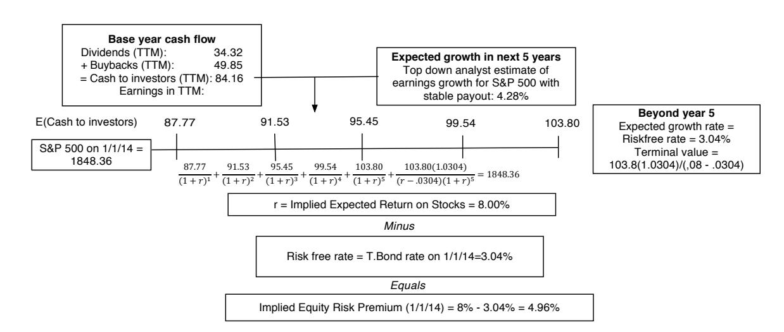

At the start of 2016, we updated the implied equity risk premium after a year in which stocks were flat and the treasury bond rate moved up slightly to 2.27%. The resulting implied premium was 6.12%:

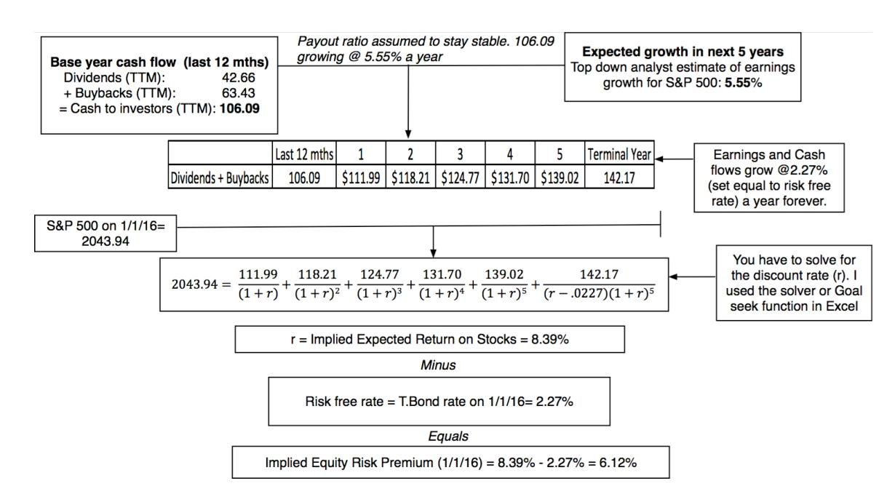

One troubling aspect of cash flows in the twelve months leading into January 1, 2016, was that the companies in the S&P 500 collectively returned 106.09 in cash flows, 101.54% of earnings during the period and inconsistent with the assumption that earnings would continue to grow over time. To correct for this, I recomputed the equity risk premium with the assumption that the cash payout would decrease over time to a sustainable level and came up with an equity risk premium of 5.16%.

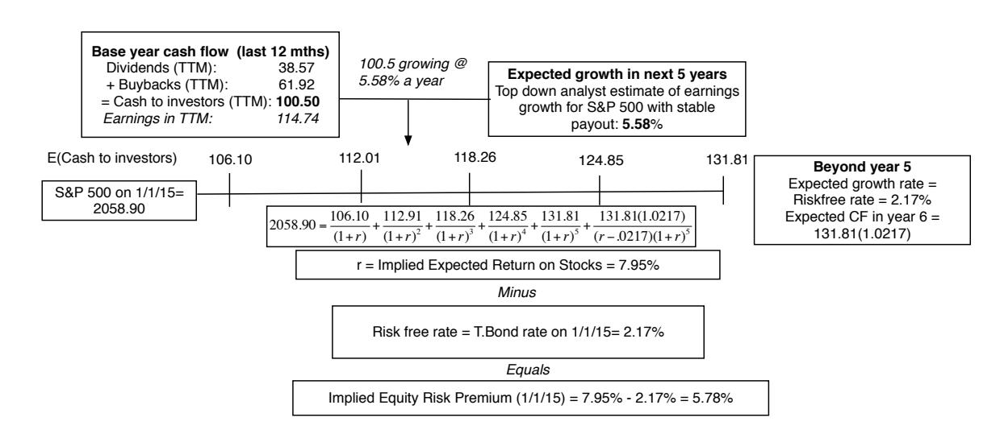

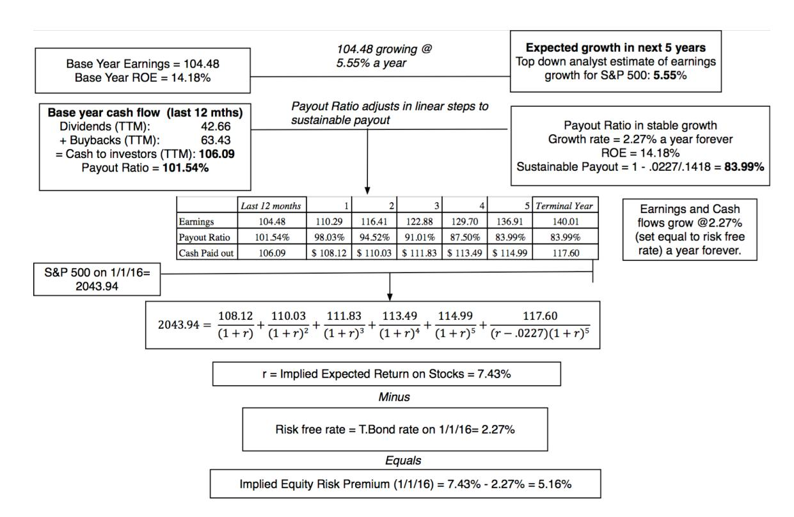

This recomputed premium, though, cannot be compared easily with my estimates of the risk premiums with earlier years (since I did not use the same payout adjustment assumption in earlier years) but it does indicate the reasons why there can be differences in estimated implied premiums across investors.

After stocks posted a strong year in 2016, we re-estimated the equity risk premium at the start of 2017 at 5.69%:

Since the cash flows in 2016 were higher than the earnings, just as in 2015, we followed the 2016 rulebook and computed the equity risk premium, allowing for dividend payout to adjust to sustainable levels by the end of the fifth year:

The adjusted premium is 4.50%, reflecting the expectation of lower cash flows in the future.

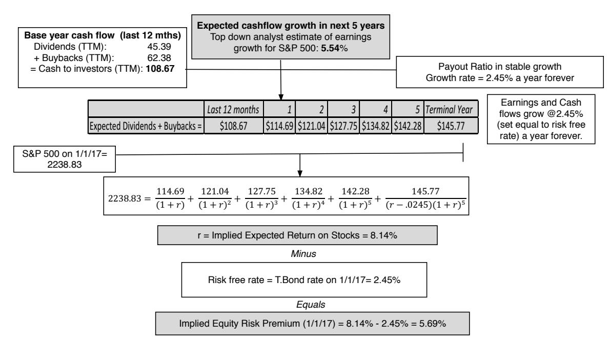

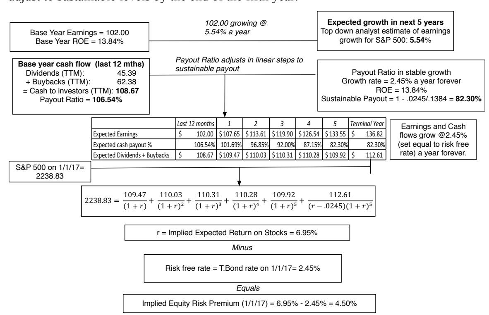

#### *A Term Structure for Equity Risk Premiums*

When we estimate an implied equity risk premium, from the current level of the index and expected future cash flows, we are estimating a compounded average equity risk premium over the long term. Thus, the 5.78% estimate of the equity risk premium at the start of 2015 is the geometric average of the annualized equity risk premiums in future years and is analogous to the yield to maturity on a long term bond.

But is it possible that equity risk premiums have a term structure, just as interest rates do? Absolutely. In a creative attempt to measure the slope of the term structure of equity risk premiums, Binsberger, Brandt and Koijen (2012) use dividend strips, i.e., short term assets that pay dividends for finite time periods (and have no face value), to extract equity risk premiums for the short term as opposed to the long term. Using dividend strips on the S&P 500 to extract expected returns from 1996 to 2009, they find that equity risk premiums are higher for shorter term claims than for longer term claims, by approximately 2.75%. 116 Their findings are contested by Boguth, Carlson, Fisher and Simutin (2011), who note that small market pricing frictions are amplified when valuing synthetic dividend strips and that using more robust return measures results in no significant differences between short term and longer term equity risk premiums.117 Schulz (2015) argues that the finding of a term structure in equity risk premiums may arise from a failure to consider differential tax treatment of dividends, as opposed to capital gains, and that incorporating those tax differences flattens out the equity risk premium term structure.118

While this debate will undoubtedly continue, the relevance to valuation and corporate finance practice is questionable. Even if you could compute period-specific equity risk premiums, the effect on value of using these premiums (instead of the compounded average premium) would be small in most valuations. To illustrate, your valuation of an asset, using an equity risk premium of 7% for the first 3 years and 5.5%

 116 Binsbergen, J. H. van, Michael W. Brandt, and Ralph S. J. Koijen, 2012, *On the timing and pricing of dividends*, American Economic Review, v102, 1596-1618.

117 Boguth, O., M. Carlson, A. Fisher and M. Simutin, 2011, *Dividend Strips and the Term Structure of Equity Risk Premia: A Case Study of Limits to Arbitrage*, Working Paper, http://papers.ssrn.com/sol3/papers.cfm?abstract\_id=1931105. In a response, Binsbergen, Brandt and Koijen argue that their results hold even if traded dividend strips (rather than synthetic strips) are used.

118 Schulz, F., 2015, On the Timing and Pricing of Dividends, SSRN Working paper, http://papers.ssrn.com/sol3/papers.cfm?abstract\_id=2705909

thereafter119, at the start of 2015, would be very similar to the value you would have obtained using 5.78% as your equity risk premium for all time periods. The only scenario where using year-specific premiums would make a material difference would be in the valuation of an asset or investment with primarily short-term cash flows, where using a higher short term premium will yield a lower (and perhaps more realistic) value for the asset.

#### *Time Series Behavior for S&P 500 Implied Premium*

As the inputs to the implied equity risk premium, it is quite clear that the value for the premium will change not just from day to day but from one minute to the next. In particular, movements in the index will affect the equity risk premium, with higher (lower) index values, other things remaining equal, translating into lower (higher) implied equity risk premiums. In Figure 9, we chart the implied premiums in the S&P 500 from 1960 to 2016 (year ends):

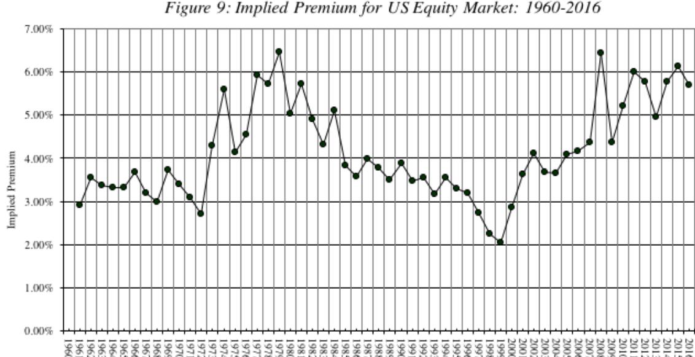

In terms of mechanics, we used potential dividends (including buybacks) as cash flows, and a two-stage discounted cash flow model; the estimates for each year are in appendix 6.120 Looking at these numbers, we would draw the following conclusions:

119 The compounded average premium over time, using a 7% equity risk premium for the first 3 years and 5.88% thereafter, is roughly 6.01%.

120 We used analyst estimates of growth in earnings for the 5-year growth rate after 1980. Between 1960 and 1980, we used the historical growth rate (from the previous 5 years) as the projected growth, since analyst

- The implied equity premium has deviated from the historical premium for the US equity market for most of the last few decades. To provide a contrast, we compare the implied equity risk premiums each year to the historical risk premiums for stocks over treasury bonds, using both geometric and arithmetic averages, each year from 1961 to 2015 in figure 10:

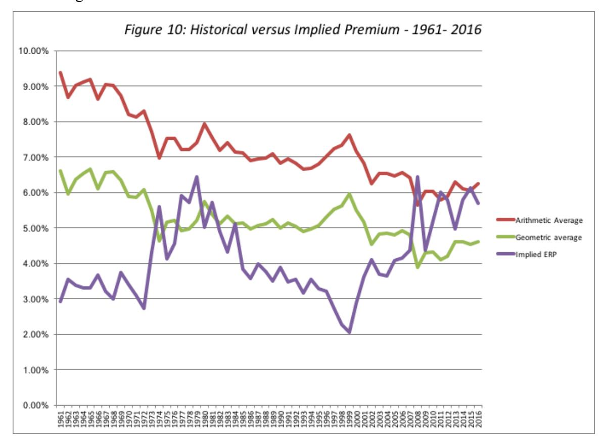

The arithmetic average premium, which is used by many practitioners, has been significantly higher than the implied premium over almost the entire fifty-year period (with 2009 and 2011 being the only exceptions). The geometric premium does provide a more interesting mix of results, with implied premiums exceeding historical premiums in the mid-1970s and again since 2008.

- The implied equity premium did increase during the seventies, as inflation increased. This does have implications for risk premium estimation. Instead of assuming that the risk premium is a constant, and unaffected by the level of inflation and interest rates,

 estimates were difficult to obtain. Prior to the late 1980s, the dividends and potential dividends were very similar, because stock buybacks were uncommon. In the last 20 years, the numbers have diverged.

which is what we do with historical risk premiums, would it be more realistic to increase the risk premium if expected inflation and interest rates go up? We will come back and address this question in the next section.

- While historical risk premiums have generally drifted down for the last few decades, there is a strong tendency towards mean reversion in implied equity premiums. Thus, the premium, which peaked at 6.5% in 1978, moved down towards the average in the 1980s. By the same token, the premium of 2% that we observed at the end of the dotcom boom in the 1990s quickly reverted back to the average, during the market correction from 2000-2003.121 Given this tendency, it is possible that we can end up with a far better estimate of the implied equity premium by looking at not just the current premium, but also at historical trend lines. We can use the average implied equity premium over a longer period, say ten to fifteen years. Note that we do not need as many years of data to make this estimate as we do with historical premiums, because the standard errors tend to be smaller.

Finally, the crisis of 2008 was unprecedented in terms of its impact on equity risk premiums. Implied equity risk premiums rose more during 2008 than in any one of the prior 50 years, with much of the change happening in a fifteen-week time period towards the end of the year. While much of that increase dissipated in 2009, as equity risk premiums returned to pre-crisis levels, equity risk premiums have remained more volatile since 2008. In the next section, we will take a closer look at the 2008 crisis.

#### *Implied Equity Risk Premiums during a Market Crisis and Beyond*

When we use historical risk premiums, we are, in effect, assuming that equity risk premiums do not change much over short periods and revert back over time to historical averages. This assumption was viewed as reasonable for mature equity markets like the United States, but was put under a severe test during the market crisis that unfolded with the fall of Lehman Brothers on September 15, and the subsequent collapse of equity markets, first in the US, and then globally.

 121 Arnott, Robert D., and Ronald Ryan, 2001, *The Death of the Risk Premium: Consequences of the 1990s*, Journal of Portfolio Management, v27, 61-74. They make the same point about reduction in implied equity risk premiums that we do. According to their calculations, though, the implied equity risk premium in the late 1990s was negative.

Since implied equity risk premiums reflect the current level of the index, the 75 trading days between September 15, 2008, and December 31, 2008, offer us an unprecedented opportunity to observe how much the price charged for risk can change over short periods. In figure 11, we depict the S&P 500 on one axis and the implied equity risk premium on the other. To estimate the latter, we used the level of the index and the treasury bond rate at the end of each day and used the total dollar dividends and buybacks over the trailing 12 months to compute the cash flows for the most recent year.122 We also updated the expected growth in earnings for the next 5 years, but that number changed only slowly over the period. For example, the total dollar dividends and buybacks on the index for the trailing 12 months of 52.58 resulted in a dividend yield of 4.20% on September 12 (when the index closed at 1252) but jumped to 4.97% on October 6, when the index closed at 1057.123

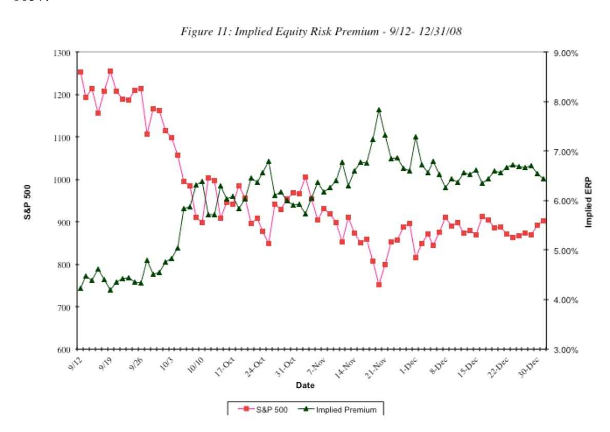

122 This number, unlike the index and treasury bond rate, is not updated on a daily basis. We did try to modify the number as companies in the index announced dividend suspensions or buyback modifications.

123 It is possible, and maybe even likely, that the banking crisis and resulting economic slowdown was leading some companies to reassess policies on buybacks. Alcoa, for instance, announced that it was terminating stock buybacks. However, other companies stepped up buybacks in response to lower stock prices. If the total cash return was dropping, as the market was, the implied equity risk premiums should be lower than the numbers that we have computed.

In a period of a month, the implied equity risk premium rose from 4.20% on September 12 to 6.39% at the close of trading of October 10 as the S&P moved from 1250 down to 903. Even more disconcertingly, there were wide swings in the equity risk premium within a day; in the last trading hour just on October 10, the implied equity risk premium ranged from a high of 6.6% to a low of 6.1%. Over the rest of the year, the equity risk premium gyrated, hitting a high of 8% in late November, before settling into the year-end level of 6.43%.

The volatility captured in figure 12 was not restricted to just the US equity markets. Global equity markets gyrated with and sometimes more than the US, default spreads widened considerably in corporate bond markets, commercial paper and LIBOR rates soared while the 3-month treasury bill rate dropped close to zero and the implied volatility in option markets rose to levels never seen before. Gold surged but other commodities, such as oil and grains, dropped. Not only did we discover how intertwined equity markets are around the globe but also how markets for all risky assets are tied together. We will explicitly consider these linkages as we go through the rest of the paper.

There are two ways in which we can view this volatility. One the one side, proponents of using historical averages (either of actual or implied premiums) will use the day-to-day volatility in market risk premiums to argue for the stability of historical averages. They are implicitly assuming that when the crisis passes, markets will return to the status quo. On the other hand, there will be many who point to the unprecedented jump in implied premiums over a few weeks and note the danger of sticking with a "fixed" premium. They will argue that there are sometimes structural shifts in markets, i.e. big events that change market risk premiums for long periods, and that we should be therefore be modifying the risk premiums that we use in valuation as the market changes around us. In January 2009, in the context of equity risk premiums, the first group would have argued we should ignore history (both in terms of historical returns and implied equity risk premiums) and move to equity risk premiums of 6%+ for mature markets (and higher for emerging markets whereas the second would have made a case for sticking with a historical average, which would have been much lower than 6.43%.

The months since the crisis ended in 2008 have seen ups and downs in the implied premium, with clear evidence that the volatility in the equity risk premium has increased over the last few years. In figure 12, we report on the monthly equity risk premiums for the S&P 500 from January 2009 through March 2017:

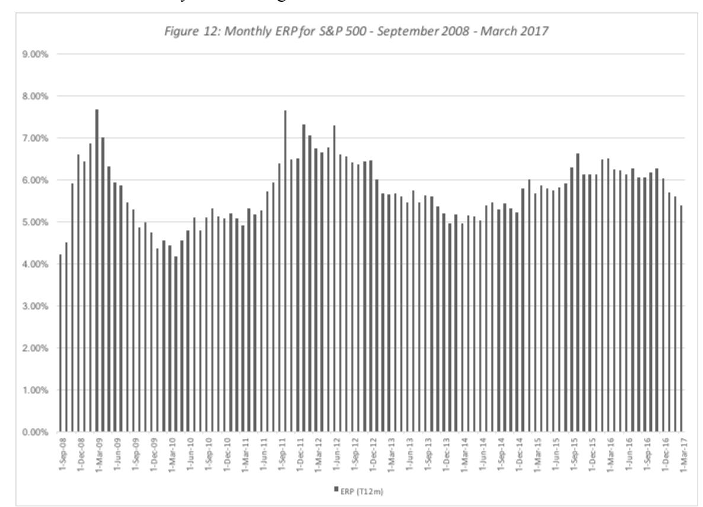

Note that the equity risk premium dropped from its post-crisis highs in 2010 but climbed back in 2011 to 6% or higher, and has been volatile since.

On a personal note, I believe that the very act of valuing companies requires taking a stand on the appropriate equity risk premium to use. For many years prior to September 2008, I used 4% as my mature market equity risk premium when valuing companies, and assumed that mean reversion to this number (the average implied premium over time) would occur quickly and deviations from the number would be small. Though mean reversion is a powerful force, I think that the banking and financial crisis of 2008 has created a new reality, i.e., that equity risk premiums can change quickly and by large amounts even in mature equity markets. Consequently, I have forsaken my practice of staying with a fixed equity risk premium for mature markets, and I now vary it year-toyear, and even on an intra-year basis, if conditions warrant. After the crisis, in the first half of 2009, I used equity risk premiums of 6% for mature markets in my valuations. As risk premiums came down in 2009, I moved back to using a 4.5% equity risk premium for mature markets in 2010. With the increase in implied premiums at the start of 2011, my valuations for the year were based upon an equity risk premium of 5% for mature markets and I increased that number to 6% for 2012. In 2016, I used an equity risk premium of 6.12%, reflecting the implied premium at the start of the year but adjusted the premium on a monthly basis, as investors navigated Brexit and the US presidential election. At the start of 2017, I was using 5.69% as my base premium for a mature market. While some may view this shifting equity risk premium as a sign of weakness, I would frame it differently. When valuing individual companies, I want my valuations to reflect my assessments of the company and not my assessments of the overall equity market. Using equity risk premiums that are very different from the implied premium will introduce a market view into individual company valuations.

#### *Determinants of Implied Premiums*

One of the advantages of estimating implied equity risk premiums, by period, is that we can track year to year changes in that number and relate those changes to shifts in interest rates, the macro environment or even to company characteristics. By doing so, not only can we get a better understanding of what causes equity risk premiums to change over time, but we are also able to come up with better estimates of future premiums.

#### *Implied ERP and Interest rates*

In much of valuation and corporate finance practice, we assume that the equity risk premium that we compute and use is unrelated to the level of interest rates. In particular, the use of historical risk premiums, where the premium is based upon an average premium earned over shifting risk free rates, implicitly assumes that the level of the premium is unchanged as the risk free rate changes. Thus, we use the same equity risk premium of 4.62% (the historical average for 1928-2016) on a risk free rate of 2.45% in 2016, as we would have, if the risk free rate had been 10%.

But is this a reasonable assumption? How much of the variation in the premium over time can be explained by changes in interest rates? Put differently, do equity risk premiums increase as the risk free rate increases or are they unaffected? To answer this question, we looked at the relationship between the implied equity risk premium and the treasury bond rate (risk free rate). As can be seen in figure 13, the implied equity risk premiums were highest in the 1970s, when interest rates and inflation were also high. However, there is contradictory evidence between 2008 and 2016, when high equity risk premiums accompanied low risk free rates.

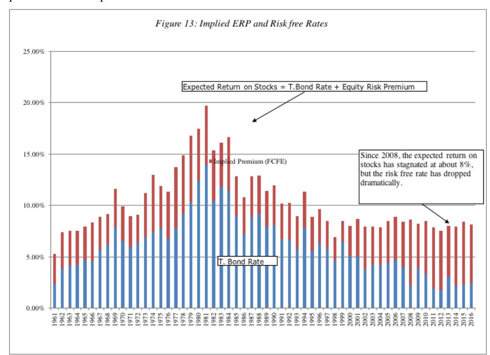

To examine the relationship between equity risk premiums and risk free rates, we ran a regression of the implied equity risk premium against both the level of long-term rates (the treasury bond rate) and the slope of the yield curve (captured as the difference between the 10-year treasury bond rate and the 3-month T.Bill rate), with the t statistics reported in brackets below each coefficient:

| Implied ERP = $3.87\% + 0.0236 (\text{T.Bond Rate}) + 0.0957 (\text{T.Bond} - \text{T.Bill})$ | $R^2 = 1.24\%$ |
|-----------------------------------------------------------------------------------------------|----------------|
| (9.12)                                                                                        | (0.43)         |
| (0.75)                                                                                        |                |

Looking across the time period (1961-2016), neither the level of rates nor the slope of the yield curve seem to have much impact on the implied equity risk premium in that year. Though the coefficients are positive, suggesting that implied risk premiums tend to be higher when the T.Bond rate is higher and the yield curve is upward sloping, the t statistics are not significant. This regression does not provide support for the view that equity risk premiums should not be constant but should be linked to the level of interest rates. In earlier versions of the paper, this regression has yielded a mildly positive relationship between the implied ERP and the T.Bond rate, but the combination of low rates and high equity risk premiums since 2008 seems to have eliminated even that mild connection between the two.

The rising equity risk premiums, in conjunction with low risk free rates, can be viewed paradoxically as both an indicator of how much and how little power central banks have over asset pricing. To the extent that the lower US treasury bond rate is the result of the Fed's quantitative easing policies since the 2008 crisis, they underscore the effect that central banks can have on equity risk premiums. At the same time, the stickiness of the overall expected return on stocks, which has not gone down with the risk free rate, is a testimonial that central banking policy is not pushing up the prices of financial assets. To the extent that this failure to move expected returns is also happening in real businesses, in the form of sticky hurdle rates for investments, the Fed's hope of increasing real investment at businesses with lower interest rates is not coming to fruition.

#### *Implied ERP and Macroeconomic variables*

While we considered the interaction between equity risk premiums and interest rates in the last section, the analysis can be expanded to include other macroeconomic variables including economic growth, inflation rates and exchange rates. Doing so may give us a way of estimating an "intrinsic' equity risk premium, based upon macro economic variables, that is less susceptible to market moods and perceptions.

To explore the relationship, we estimated the correlation, between the implied equity risk premiums that we estimated for the S&P 500 and three macroeconomic variables – real GDP growth for the US, inflation rates (CPI) and exchange rates (trade weighted dollar), using data from 1973 to 2016, in table 21 (t statistics in brackets):

*Table 21: Correlation Matrix: ERP and Macroeconomic variables: 1973-2016*

|          | ERP     | Real GDP | CPI | Weighted Dollar |
|----------|---------|----------|-----|-----------------|
| ERP      | 1.0000  |          |     |                 |
|          |         |          |     |                 |
| Real GDP | -0.3612 | 1.0000   |     |                 |
|          | -2.4801 |          |     |                 |

\*\* Statistically significant

The implied equity risk premium is negatively correlated with GDP growth, increasing as GDP growth increases and is positively correlated with both inflation and the weighted dollar, with a stronger dollar going with higher implied equity risk premiums. 124

Following up on this analysis, we regressed equity risk premiums against the inflation rate, the weighted dollar and GDP growth, using data from 1974 to 2015:

| ERP = 0.04571 - 0.17782 * Real GDP + 0.09373 * CPI - 0.0376 * Weighted Dollar | $R^2=23.50\%$ |
|-------------------------------------------------------------------------------|---------------|
| (12.73) (2.37)                                                                | (1.78) (1.31) |

Based on this regression, every 1% increase in the inflation rate increases the equity risk premium by approximately 0.10%, whereas every 1% increase in the growth rate in real GDP decreases the implied equity risk premium by 0.18%.

From a risk perspective, it is not the level of GDP growth that matters, but uncertainty about that level; you can have low and stable economic growth and high and unstable economic growth. Since 2008, the economies of both developed and emerging markets have become more unstable over time and upended long held beliefs about developed economies. It will be interesting to see if equity risk premiums become more sensitive to real economic growth in this environment.

#### *Implied ERP, Earnings Yields and Dividend Yields*

Earlier in the paper, we noted that the dividend yield and the earnings yield (net of the riskfree rate) can be used as proxies for the equity risk premium, if we make assumptions about future growth (stable growth, with the dividend yield) or expected excess returns (zero, with the earnings yield). In figure 14, we compare the implied equity risk premiums that we computed to the earnings and dividend yields for the S&P 500 from 1961 to 2016:

| CPI             | 0.3115  | -0.1290 | 1.0000  |        |
|-----------------|---------|---------|---------|--------|
|                 | 2.0988  | -0.8327 |         |        |
| Weighted Dollar | -0.1926 | -0.0355 | -0.0847 | 1.0000 |
|                 | -1.2566 | -0.2277 | -0.5445 |        |

124 The correlation was also computed for lagged and leading versions of these variables, with little material change to the relationship.

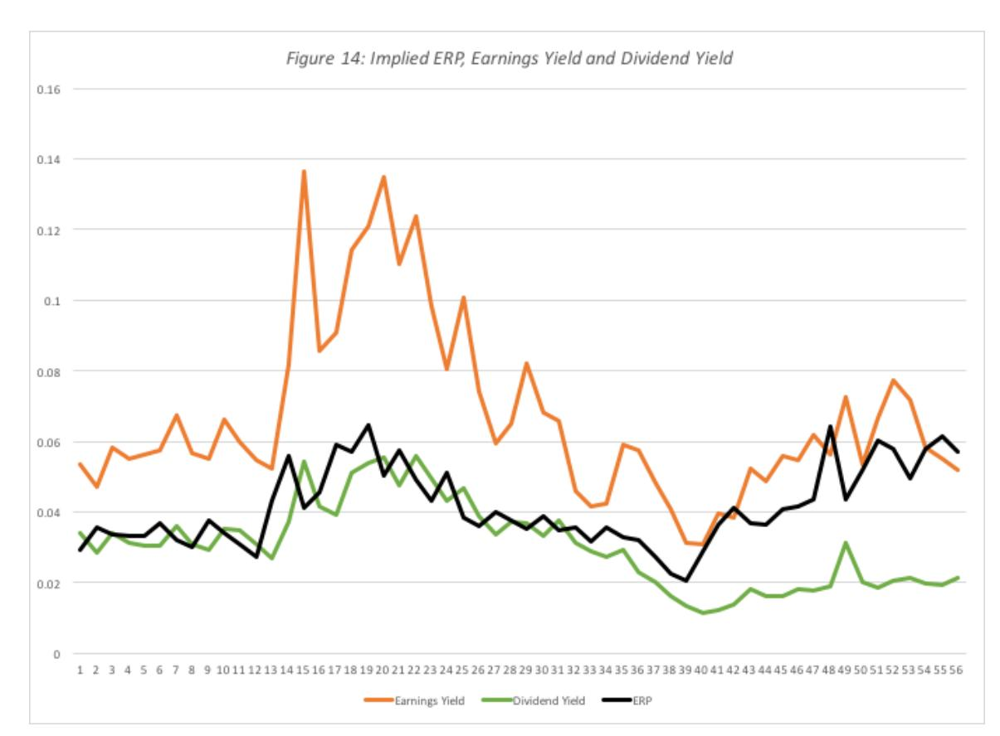

Note that the dividend yield is a very close proxy for the implied equity risk premium until the late 1980s, when the two measures decoupled, a phenomenon that is best explained by the rise of stock buybacks as an alternative way of returning cash to stockholders.

The earnings yield, with the risk free rate netted out, has generally not been a good proxy for the implied equity risk premium and would have yielded negative values for the equity risk premium (since you have to subtract out the risk free rate from it) through much of the 1990s. However, it does move with the implied equity risk premium. The difference between the earnings to price measure and the implied ERP can be attributed to a combination of higher earnings growth and excess returns that investors expect companies to deliver in the future. Analysts and academic researchers who use the earnings to price ratio as a proxy for forward-looking costs of equity may therefore end up with significant measurement error in their analyses.

# *Implied ERP and Technical Indicators*

Earlier in the paper, we noted that any market timing forecast can be recast as a view on the future direction of the equity risk premium. Thus, a view that the market is under (over) priced and likely to go higher (lower is consistent with a belief that equity risk premiums will decline (increase) in the future. Many market timers do rely on technical indicators, such as moving averages and momentum measures, to make their judgment about market direction. To evaluate whether these approaches have a basis, you would need to look at how these measures are correlated with changes in equity risk premiums.

In a test of the efficacy of technical indicators, Neely, Rapach, Tu and Zhou (2011) compare the predictive power of macroeconomic/fundamental indications (including the interest rate, inflation, GDP growth and earnings/dividend yield numbers) with those of technical indicators (moving average, momentum and trading volume) and conclude that the latter better explain movements in stock returns.125 They conclude that a composite prediction, that incorporates both macroeconomic and technical indicators, is superior to using just one set or the other of these variables. Note, however, that their study focused primarily on the predictability of stock returns over the next year and not on longer term equity risk premiums.

#### *Extensions of Implied Equity Risk Premium*

The process of backing out risk premiums from current prices and expected cash flows is a flexible one. It can be expanded into emerging markets to provide estimates of risk premiums that can replace the country risk premiums we developed in the last section. Within an equity market, it can be used to compute implied equity risk premiums for individual sectors or even classes of companies.

#### *Other Equity Markets*

The advantage of the implied premium approach is that it is market-driven and current, and does not require any historical data. Thus, it can be used to estimate implied equity premiums in any market, no matter how short its history, It is, however, bounded by whether the model used for the valuation is the right one and the availability and reliability of the inputs to that model. Earlier in this paper, we estimated country risk premiums for Brazil, using default spreads and equity market volatile. To provide a contrast, we estimated the implied equity risk premium for the Brazilian equity market in September 2009, from the following inputs.

125 Neely, C.J., D.E. Rapach, J. Tu and G. Zhou, 2011, *Forecasting the Equity Risk Premium: The Role of Technical Indicators*, Working Paper, http://ssrn.com/abstract=1787554.

- The index (Bovespa) was trading at 61,172 on September 30, 2009, and the dividend yield on the index over the previous 12 months was approximately 2.2%. While stock buybacks represented negligible cash flows, we did compute the FCFE for companies in the index, and the aggregate FCFE yield across the companies was 4.95%.
- Earnings in companies in the index are expected to grow 6% (in US dollar terms) over the next 5 years, and 3.45% (set equal to the treasury bond rate) thereafter.
- The riskfree rate is the US 10-year treasury bond rate of 3.45%.

The time line of cash flows is shown below:

These inputs yield a required return on equity of 9.17%, which when compared to the treasury bond rate of 3.45% on that day results in an implied equity premium of 5.72%. For simplicity, we have used nominal dollar expected growth rates126 and treasury bond rates, but this analysis could have been done entirely in the local currency.

One of the advantages of using implied equity risk premiums is that that they are more sensitive to changing market conditions. The implied equity risk premium for Brazil in September 2007, when the Bovespa was trading at 73512, was 4.63%, lower than the premium in September 2009, which in turn was much lower than the premium prevailing in September 2015. In figure 15, we trace the changes in the implied equity risk premium in Brazil from September 2000 to September 2017 and compare them to the implied premium in US equities:

| $61,272 = \frac{3210}{(1+r)} + \frac{3,402}{(1+r)^2} + \frac{3,606}{(1+r)^3} + \frac{3,821}{(1+r)^4} + \frac{4,052}{(1+r)^5} + \frac{4,052(1.0345)}{(r-.0345)(1+r)^6}$ |
|------------------------------------------------------------------------------------------------------------------------------------------------------------------------|
|------------------------------------------------------------------------------------------------------------------------------------------------------------------------|

126 The input that is most difficult to estimate for emerging markets is a long-term expected growth rate. For Brazilian stocks, I used the average consensus estimate of growth in earnings for the largest Brazilian companies which have ADRs listed on them. This estimate may be biased, as a consequence.

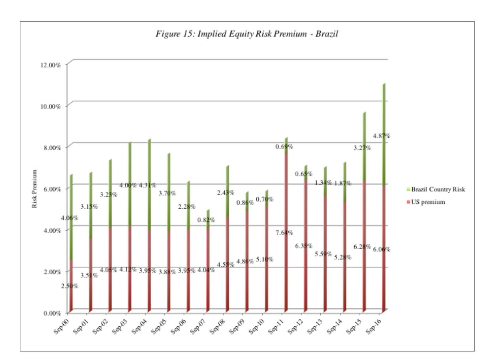

Implied equity risk premiums in Brazil declined steadily from 2003 to 2007, with the September 2007 numbers representing a historic low. They surged in September 2008, as the crisis unfolded, fell back in 2009 and 2010 but increased again in 2011. In fact, the Brazil portion of the implied equity risk premium fell to its lowest level in ten years in September 2010, a phenomenon that remained largely unchanged in 2011 and 2012. Political turmoil and corruptions scandals have combined to push the premium back up again in the last few years.

Computing and comparing implied equity risk premiums across multiple equity markets allows us to pinpoint markets that stand out, either as over priced (because their implied premiums are too low, relative to other markets) or under priced (because their premiums at too high, relative to other markets). In September 2007, for instance, the implied equity risk premiums in India and China were roughly equal to or even lower than the implied premium for the United States, computed at the same time. Even an optimist on future growth these countries would be hard pressed to argue that equity markets in these markets and the United States were of equivalent risk, which would lead us to conclude that these stocks were overvalued relative to US companies.

One final note is worth making. Over the last decade, the implied equity risk premiums in the largest emerging markets – India, China and Brazil- have all declined substantially, relative to developed markets. In table 22, we summarize implied equity risk premiums for developed and emerging markets from 2001 and 2016, making simplistic assumptions about growth and stable growth valuation models:127

*Table 22: Developed versus Emerging Market Equity Risk Premiums*

| Start of year | PBV Developed | PBV Emerging | ROE Developed | ROE Emerging | US T.B. Growth Rate | Growth Rate Developed | Growth Rate Emerging | Cost of Equity (Developed) | Cost of Equity (Emerging) | Differential ERP |
|---------------|---------------|--------------|---------------|--------------|---------------------|-----------------------|----------------------|----------------------------|---------------------------|------------------|
| 2004          | 2.00          | 1.19         | 10.81%        | 11.65%       | 4.25%               | 3.75%                 | 5.25%                | 7.28%                      | 10.62%                    | 3.35%            |
| 2005          | 2.09          | 1.27         | 11.12%        | 11.93%       | 4.22%               | 3.72%                 | 5.22%                | 7.26%                      | 10.50%                    | 3.24%            |
| 2006          | 2.03          | 1.44         | 11.32%        | 12.18%       | 4.39%               | 3.89%                 | 5.39%                | 7.55%                      | 10.11%                    | 2.56%            |
| 2007          | 1.67          | 1.67         | 10.87%        | 12.88%       | 4.70%               | 4.20%                 | 5.70%                | 8.19%                      | 10.00%                    | 1.81%            |
| 2008          | 0.87          | 0.83         | 9.42%         | 11.12%       | 4.02%               | 3.52%                 | 5.02%                | 10.30%                     | 12.37%                    | 2.07%            |
| 2009          | 1.20          | 1.34         | 8.48%         | 11.02%       | 2.21%               | 1.71%                 | 3.21%                | 7.35%                      | 9.04%                     | 1.69%            |
| 2010          | 1.39          | 1.43         | 9.14%         | 11.22%       | 3.84%               | 3.34%                 | 4.84%                | 7.51%                      | 9.30%                     | 1.79%            |
| 2011          | 1.12          | 1.08         | 9.21%         | 10.04%       | 3.29%               | 2.79%                 | 4.29%                | 8.52%                      | 9.61%                     | 1.09%            |
| 2012          | 1.17          | 1.18         | 9.10%         | 9.33%        | 1.88%               | 1.38%                 | 2.88%                | 7.98%                      | 8.35%                     | 0.37%            |
| 2013          | 1.56          | 1.63         | 8.67%         | 10.48%       | 1.76%               | 1.26%                 | 2.76%                | 6.02%                      | 7.50%                     | 1.48%            |
| 2014          | 1.95          | 1.50         | 9.27%         | 9.64%        | 3.04%               | 2.54%                 | 4.04%                | 6.00%                      | 7.77%                     | 1.77%            |
| 2015          | 1.88          | 1.56         | 9.69%         | 9.75%        | 2.17%               | 1.67%                 | 3.17%                | 5.94%                      | 7.39%                     | 1.45%            |
| 2016          | 1.89          | 1.59         | 9.24%         | 10.16%       | 2.27%               | 1.77%                 | 3.27%                | 5.72%                      | 7.60%                     | 1.88%            |

The trend line from 2004 to 2012 is clear as the equity risk premiums, notwithstanding a minor widening in 2008, have converged in developed and emerging markets, suggesting that globalization has put "emerging market risk" into developed markets, while creating "developed markets stability factors" (more predictable government policies, stronger legal and corporate governance systems, lower inflation and stronger currencies) in emerging markets. In the last four years, we did see a correction in emerging markets that pushed the premium back up, albeit to a level that was still lower than it was prior to 2010.

127 We start with the US treasury bond rate as the proxy for global nominal growth (in US dollar terms), and assume that the expected growth rate in developed markets is 0.5% lower than that number and the expected growth rate in emerging markets is 1% higher than that number. The equation used to compute the ERP is a simplistic one, based on the assumptions that the countries are in stable growth and that the return on equity in each country is a predictor of future return on equity:

PBV = (ROE – g)/ (Cost of equity –g)

#### *Sector premiums*

Using current prices and expected future cash flows to back out implied risk premiums is not restricted to market indices. We can employ the approach to estimate the implied equity risk premium for a specific sector at a point in time. In September 2008, for instance, there was a widely held perception that investors were attaching much higher equity risk premiums to commercial bank stocks, in the aftermath of the failures of Fannie Mae, Freddie Mac, Bear Stearns and Lehman. To test this proposition, we took a look at the S&P Commercial Bank index, which was trading at 318.26 on September 12, 2008, with an expected dividend yield of 5.83% for the next 12 months. Assuming that these dividends will grow at 4% a year for the next 5 years and 3.60% (the treasury bond rate) thereafter, well below the nominal growth rate in the overall economy, we arrived at the following equation:

Solving for the expected return yields a value of 9.74%, which when netted out against the riskfree rate at the time (3.60%) yields an implied premium for the sector:

Implied ERP for Banking in September 2008 = 9.74% - 3.60% = 6.14%

How would we use this number? One approach would be to compare it to the average implied premium in this sector over time, with the underlying assumption that the value will revert back to the historical average for the sector. The implied equity risk premium for commercial banking stocks was close to 4% between 2005 and 2007, which would lead to the conclusion that banking stocks were undervalued in September 2008. The other is to assume that the implied equity premium for a sector is reflective of perceptions of future risk in that sector; in September 2008, there can be no denying that financial service companies faced unique risks and the market was reflecting these risks in prices. As a postscript, the implied equity risk premium for financial service firms was 5.80% in January 2012, just below the market-implied premium at the time (6.01%), suggesting that some of the post-crisis fear about banking stocks had receded.

A note of caution has to be added to about sector-implied premiums. Since these risk premiums consolidate both sector risk and market risk, it would be inappropriate to multiply these premiums by conventional betas, which are measures of sector risk. Thus,

| $318.26 = \frac{19.30}{(1+r)} + \frac{20.07}{(1+r)^2} + \frac{20.87}{(1+r)^3} + \frac{21.71}{(1+r)^4} + \frac{22.57}{(1+r)^5} + \frac{22.57(1.036)}{(r-.036)(1+r)^6}$ |
|-----------------------------------------------------------------------------------------------------------------------------------------------------------------------|
|-----------------------------------------------------------------------------------------------------------------------------------------------------------------------|

multiplying the implied equity risk premium for the technology sector (which will yield a high value) by a market beta for a technology company (which will also be high for the same reason) will result in double counting risk.128

#### *Firm Characteristics*

Earlier in this paper, we talked about the small firm premium and how it has been estimated using historical data, resulting in backward looking estimates with substantial standard error. We could use implied premiums to arrive at more forward looking estimates, using the following steps:

Step 1: Compute the implied equity risk premium for the overall market, using a broad index such as the S&P 500. Earlier in this paper, we estimated this, as of January 2017, to be 5.69%, using the cash returned last year as a base, and 4.50%, adjusting the cashflows for lower payout in the future.

Step 2: Compute the implied equity risk premium for an index containing primarily or only small cap firms, such as the S&P 600 Small Cap Index. On January 1, 2017, the index was trading at 837.96, with aggregated dividends and buybacks amounting to 2.93% of the index in the trailing 12 months, and an expected growth rate in earnings of 10.28% for the next 5 years. Allowing for an increase in cash payout, as the growth rate decreases over time, yields the following equation:

$$837.96 = \frac{29.25}{(1+r)} + \frac{34.62}{(1+r)^2} + \frac{40.77}{(1+r)^3} + \frac{47.83}{(1+r)^4} + \frac{55.91}{(1+r)^5} + \frac{55.91 (1.0245)}{(r-.0245)(1+r)^5}$$

Solving for the expected return, we get:

Expected return on small cap stocks = 8.17%

Implied equity risk premium for small cap stocks = 8.17% -2.45% = 5.72%

Step 3: The forward-looking estimate of the small cap premium should be the difference between the implied premium for small cap stocks (in step 2) and the implied premium for the market (in step 1). Since we did use the adjusted buyback for small cap stocks, we will compare the small cap premium to the 4.50% that we estimated for the S&P 500 using the same approach.

Small cap premium = 5.72% - 4.50% = 1.22%

128 You could estimate betas for technology companies against a technology index (rather than the market index) and use these betas with the implied equity risk premium for technology companies.

With the numbers in January 2017, small caps are priced to generate an expected return that is 1.22% higher than the rest of the market, a shift from the close-to-zero premiums that we estimated in 2015 and 2016. Does that mean that the small cap premium is back? Perhaps or perhaps not. In fact, we would argue that the only way to answer that question is to update these equity risk premiums for the S&P 500 and S&P 600 each year and to compute the premium for that year.

This approach to estimating premiums can be extended to other variables. For instance, one of the issues that has challenged analysts in valuation is how to incorporate the illiquidity of an asset into its estimated value. While the conventional approach is to attach an illiquidity discount, an alternative is to adjust the discount rate upwards for illiquid assets. If we compute the implied equity risk premiums for stocks categorized by illiquidity, we may be able to come up with an appropriate adjustment. For instance, you could estimate the implied equity risk premium for the stocks that rank in the lowest decile in terms of illiquidity, defined as turnover ratio. 129 Comparing this value to the implied premium for the S&P 500 of 5.78% should yield an implied illiquidity risk premium. Adding this premium to the cost of equity for relatively illiquid investments will then discount the value of these investments for illiquidity.

#### *2. Default Spread Based Equity Risk Premiums*

While we think of corporate bonds, stocks and real estate as different asset classes, it can be argued that they are all risky assets and that they should therefore be priced consistently. Put another way, there should be a relationship across the risk premiums in these asset classes that reflect their fundamental risk differences. In the corporate bond market, the default spread, i.e, the spread between the interest rate on corporate bonds and the treasury bond rate, is used as the risk premium. In the equity market, as we have seen through this paper, historical and implied equity premiums have tussled for supremacy as the measure of the equity risk premium. In the real estate market, no mention is made of an explicit risk premium, but real estate valuations draw heavily on the "capitalization rate", which is the discount rate applied to a real estate property's earnings to arrive at an

129 The turnover ratio is obtained by dividing \$ trading volume in a stock by its market capitalization at that time.

estimate of value. The use of higher (lower) capitalization rates is the equivalent of demanding a higher (lower) risk premium.

Of these three premiums, the default spread is the less complex and the most widely accessible data item. If equity risk premiums could be stated in terms of the default spread on corporate bonds, the estimation of equity risk premiums would become immeasurably simpler. For instance, assume that the default spread on Baa rated corporate bonds, relative to the ten-year treasury bond, is 2.2% and that equity risk premiums are routinely twice as high as Baa bonds, the equity risk premium would be 4.4%. Is such a rule of thumb even feasible? To answer this question, we looked at implied equity risk premiums and Baarated corporate bond default spreads from 1960 to 2016 in Figure 16.

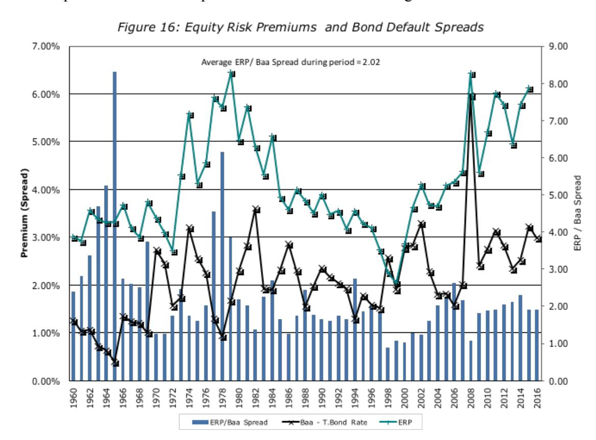

Note that both default spreads and equity risk premiums jumped in 2008, with the former increasing more on a proportionate basis. The ratio of 1.08 (ERP/ Baa Default Spread) at the end of 2008 was close to the lowest value in the entire series, suggesting that either equity risk premiums were too low or default spreads were too high. At the end of 2016, both the equity risk premium and the default spread increased, and the ratio moved back to 1.91, a little lower than the median value of 2.02 for the entire time period. The connection

between equity risk premiums and default spreads was most obvious during 2008, where changes in one often were accompanied by changes in the other. Figure 17 graphs out changes in default spreads and ERP over the tumultuous year:

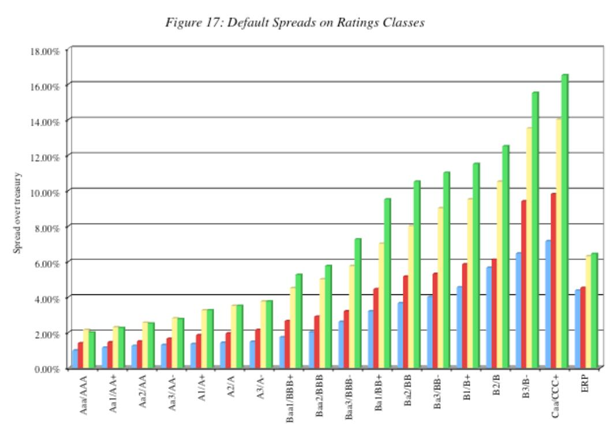

How could we use the historical relationship between equity risk premiums and default spreads to estimate a forward-looking equity risk premium? On January 1, 2017, the default spread on a Baa rated bond was about 3.00%. Applying the median ratio of 2.02, estimated from 1960-2016 numbers, to the Baa default spread of 3.00% results in the following estimate of the ERP:

Default Spread on Baa bonds (over treasury) on 1/1/2017 = 3.00%

Imputed Equity Risk Premium = Default Spread \* Median ratio or ERP/Spread

= 3.00%\* 2.02 = 6.04%

This is higher than the implied equity risk premium of 5.69% that we computed in January 2017. Note that there is significant variation in the ratio (of ERP to default spreads) over time, with the ratio dropping below one at the peak of the dot.com boom (when equity risk premiums dropped to 2%) and rising to as high as 2.63 at the end of 2006; the standard error in the estimate is 0.20. Whenever the ratio has deviated significantly from the average, though, there is reversion back to that median over time.

The capitalization rate in real estate, as noted earlier, is widely used metric in the valuation of real estate properties. For instance, a capitalization rate of 8%, in conjunction with an office building that generates income of \$ 10 million, would result in a property value of \$ 125 million (\$10/.08). The difference between the capitalization ratio and the treasury bond rate can be considered a real estate market risk premium, In Figure 18, we used the capitalization rate in real estate ventures and compared the risk premiums imputed for real estate with both bond default spreads and implied equity risk premiums between 1980 and 2016.

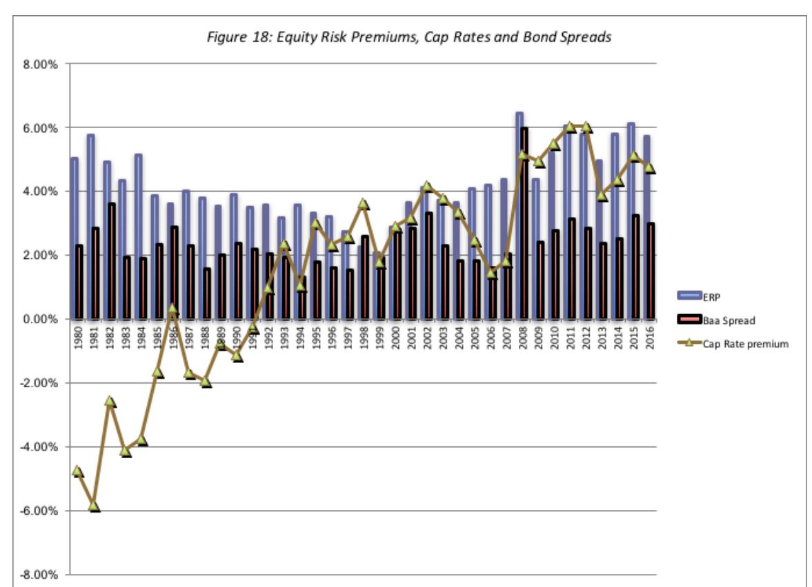

The story in this graph is the convergence of the real estate and financial asset risk premiums. In the early 1980s, the real estate market seems to be operating in a different risk/return universe than financial assets, with the cap rates being less than the treasury bond rate. For instance, the cap rate in 1980 was 8.1%, well below the treasury bond rate of 12.8%, resulting in a negative risk premium for real estate. The risk premiums across the three markets - real estate, equity and bonds - started moving closer to each other in the late 1980s and the trend accelerated in the 1990s. We would attribute at least some of this increased co-movement to the securitization of real estate in this period. In 2008, the three markets moved almost in lock step, as risk premiums in the markets rose and prices fell. The housing bubble of 2004-2008 is manifested in the drop in the real estate equity risk premium during those years, bottoming out at less than 2% at the 2006. The correction in housing prices since has pushed the premium back up. Both equity and bond premiums adjusted quickly to pre-crisis levels in 2009 and 2010, and real estate premiums followed, albeit at a slower pace. Between 2013 and 2016, the risk premiums in the three markets have moved in tandem, all rising over the period.

While the noise in the ratios (of ERP to default spreads and cap rates) is too high for us to develop a reliable rule of thumb, there is enough of a relationship here that we would suggest using this approach as a secondary one to test to see whether the equity risk premiums that we are using in practice make sense, given how risky assets are being priced in other markets. Thus, using an equity risk premium of 2%, when the Baa default spread is approximately at the same level strikes us as imprudent, given history. For macro strategists, there is a more activist way of using these premiums. When risk premiums in markets diverge, there is information in the relative pricing. Thus, the drop in equity risk premiums in the late 1990s, as default spreads stayed stable, would have signaled that the equity markets were overvalued (relative to bonds), just as the drop in default spreads between 2004 and 2007, while equity risk premiums were stagnant, would have suggested the opposite.

#### *3. Option Pricing Model based Equity Risk Premium*

There is one final approach to estimating equity risk premiums that draws on information in the option market. Option prices can be used to back out implied volatility in the equity market. To the extent that the equity risk premium is our way of pricing in the risk of future stock price volatility, there should be a relationship between the two.

The simplest measure of volatility from the options market is the volatility index (VIX), which is a measure of 30—day volatility constructed using the implied volatilities in traded S&P 500 index options. The CFO survey premium from Graham and Harvey that we referenced earlier in the paper found a high degree of correlation between the premiums demanded by CFOs and the VIX value (see figure 19 below):

*Figure 19: Volatility Index (VIX) and Survey Risk Premiums*

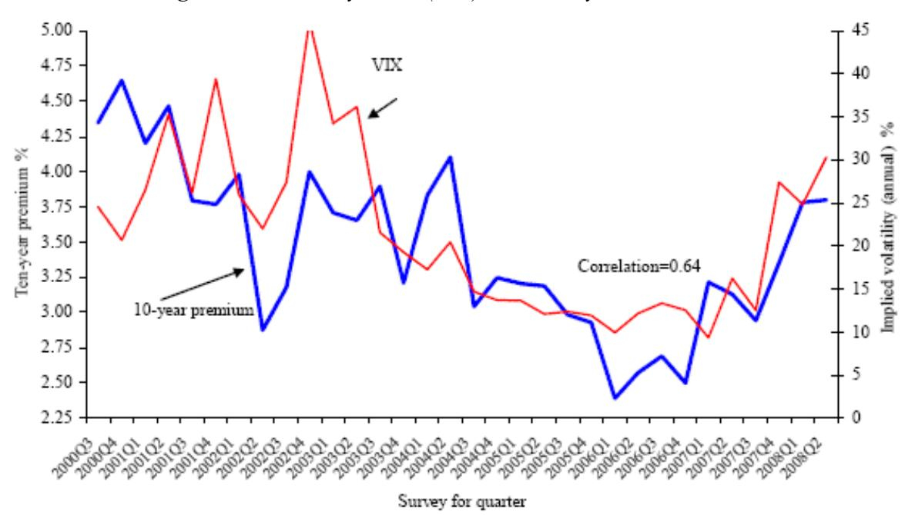

Santa-Clara and Yan (2006) use options on the S&P 500 to estimate the ex-ante risk assessed by investors from 1996 and 2002 and back out an implied equity risk premium on that basis.130 To estimate the ex-ante risk, they allow for both continuous and discontinuous (or jump) risk in stocks, and use the option prices to estimate the probabilities of both types of risk. They then assume that investors share a specific utility function (power utility) and back out a risk premium that would compensate for this risk. Based on their estimates, investors should have demanded an equity risk premium of 11.8% for their perceived risk and that the perceived risk was about 70% higher than the realized risk over this period. Ross (2015) uses the implied volatilities in calls and puts on the S&P 500 to extract not only equity risk premiums but to also estimate the probabilities of catastrophic events embedded in stock prices.131

The link between equity market volatility and the equity risk premium also became clearer during the market meltdown in the last quarter of 2008. Earlier in the paper, we noted the dramatic shifts in the equity risk premiums, especially in the last year, as the financial crisis has unfolded. In Figure 20, we look at the implied equity risk premium

 130 Santa-Clara, P. and S. Yan, 2006, *Crashes, Volatility, and the Equity Premium: Lessons from S&P 500 Options*, Review of Economics and Statistics, v92, pg 435-451.

131 Ross, S.M., 2015, *The Recovery Theorem*, Journal of Finance, v 70, 615-648.

each month from September 2008 to March 2017 and the volatility index (VIX) for the S&P 500:

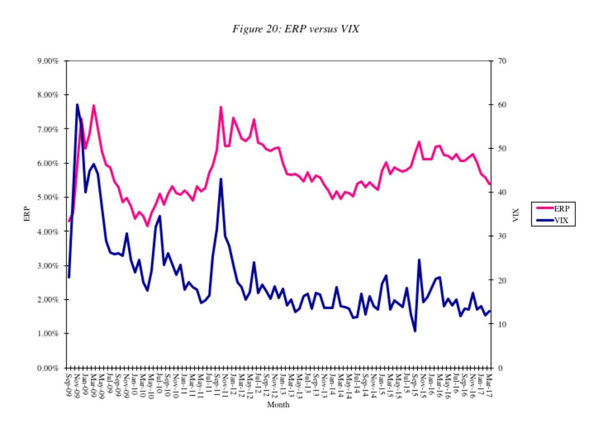

Note that the surge in equity risk premiums between September 2008 and December 2008 coincided with a jump in the volatility index and that both numbers have declined in the years since the crisis. The drop in the VIX between September 2011 and March 2012 was not accompanied by a decrease in the implied equity risk premium, but equity risk premiums drifted down in the year after. While the VIX stayed low for much of 2014, equity risk premiums climbed through the course of the year. In the last few months of 2015, the VIX spiked again on global market crises and the equity risk premium also went up. Both numbers were relatively stable in 2016.

In a paper referenced earlier, Bollerslev, Tauchen and Zhou (2009) take a different tack and argue that it is not the implied volatility per se, but the variance risk, i.e., the difference between the implied variance (in option prices) and the actual variance, that drives expected equity returns.132 Thus, if the realized variance in a period is far higher

132 Bollerslev, T. G. Tauchen and H. Zhou, 2009, *Expected Stock Returns and Variance Risk Premia*, Review of Financial Studies, v22, 4463-4492.

(lower) than the implied variance, you should expect to see higher (lower) equity risk premiums demanded for subsequent periods. While they find evidence to back this proposition, they also note the relationship is strongest for short term returns (next quarter) and are weaker for longer-term returns. Bekaert and Hoerova (2013) decomposed the squared VIX into two components, a conditional variance of the stock market and an equity variance premium, and conclude that while the latter is a significant predictor of stock returns but the former is not.133

# **Choosing an Equity Risk Premium**

We have looked at three different approaches to estimating risk premiums, the survey approach, where the answer seems to depend on who you ask and what you ask them, the historical premium approach, with wildly different results depending on how you slice and dice historical data and the implied premium approach, where the final number is a function of the model you use and the assumptions you make about the future. Ultimately, though, we have to choose a number to use in analysis and that number has consequences. In this section, we consider why the approaches give you different numbers and a pathway to use to devise which number is best for you.

# **Why do the approaches yield different values?**

The different ways of estimating equity risk premium provide cover for analysts by providing justification for almost any number they choose to use in practice. No matter what the premium used by an analyst, whether it be 3% or 12%, there is back-up evidence offered that the premium is appropriate. While this may suffice as a legal defense, it does not pass muster on common sense grounds since not all risk premiums are equally justifiable. To provide a measure of how the numbers vary, the values that we have attached to the US equity risk premium, using different approaches, in January 2013 are summarized in table 23.

*Table 23: Equity Risk Premium (ERP) for the United States – January 2013*

| <i>Approach Used</i> | <i>ERP</i> | <i>Additional information</i> |
|----------------------|------------|-------------------------------|
|                      |            |                               |

133 Bekaert, G. and M. Hoerova, 2013, *The VIX, Variance Premium and Stock Market Volatility*, SSRN Working Paper, http://papers.ssrn.com/sol3/papers.cfm?abstract\_id=2342200.

| Survey: CFOs            | 4.51% | Campbell and Harvey survey of CFOs      |
|-------------------------|-------|-----------------------------------------|
| Survey: Global Fund     |       |                                         |
|                         | 4.60% | Merrill Lynch (January 2014) survey of  |
| Historical - US         | 4.62% | Geometric average Stocks over           |
| Historical – Multiple   |       |                                         |
|                         | 3.20% | Average premium across 20 markets from  |
|                         |       | 1900-2016: Dimson, Marsh and Staunton   |
| Current Implied premium | 5.69% | From S&P 500 – January 1, 2017          |
| Average Implied premium | 4.14% | Average of implied equity risk premium: |
| Default spread based    |       |                                         |
|                         | 6.02% | Baa Default Spread * Median value of    |

The equity risk premiums, using the different approaches, yield a range, with the lowest value being 3.20% and the highest being 6.02%. Note that the range would have been larger if we used other measures of historical risk premiums: different time periods, arithmetic instead of geometric averages.

There are several reasons why the approaches yield different answers much of time and why they converge sometimes.

- 1. When stock prices enter an extended phase of upward (downward) movement, the historical risk premium will climb (drop) to reflect past returns. Implied premiums will tend to move in the opposite direction, since higher (lower) stock prices generally translate into lower (higher) premiums. In 1999, for instance, after the technology induced stock price boom of the 1990s, the implied premium was 2% but the historical risk premium was almost 6%.
- 2. Survey premiums reflect historical data more than expectations. When stocks are going up, investors tend to become more optimistic about future returns and survey

premiums reflect this optimism. In fact, the evidence that human beings overweight recent history (when making judgments) and overreact to information can lead to survey premiums overshooting historical premiums in both good and bad times. In good times, survey premiums are even higher than historical premiums, which, in turn, are higher than implied premiums; in bad times, the reverse occurs.

- 3. When the fundamentals of a market change, either because the economy becomes more volatile or investors get more risk averse, historical risk premiums will not change but implied premiums will. Shocks to the market are likely to cause the two numbers to deviate. After the terrorist attack on the World Trade Center in September 2001, for instance, implied equity risk premiums jumped almost 0.50% but historical premiums were unchanged (at least until the next update).

In summary, we should not be surprised to see large differences in equity risk premiums as we move from one approach to another, and even within an approach, as we change estimation parameters.

### **Which approach is the "best" approach?**

If the approaches yield different numbers for the equity risk premium, and we have to choose one of these numbers, how do we decide which one is the "best" estimate? The answer to this question will depend upon several factors:

- a. Predictive Power: In corporate finance and valuation, what we ultimately care about is the equity risk premium for the future. Consequently, the approach that has the best predictive power, i.e. yields forecasts of the risk premium that are closer to realized premiums, should be given more weight. So, which of the approaches does best on this count?

Campbell and Shiller (1988) suggested that the dividend yield, a simplistic measure of the implied equity risk premium, had significant predictive power for future returns.134 However, Goyal and Welch (2007) examined many of the measures suggested as predictors of the equity risk premium in the literature, including the dividend yield and the earnings to price ratio, and find them all wanting.135 Using data

 134 Campbell, J. Y. and R. J. Shiller. 1988, *The Dividend-Price Ratio And Expectations Of Future Dividends And Discount Factors*, Review of Financial Studies, v1(3), 195-228.

135 Goyal, A. and I. Welch, 2007, *A Comprehensive Look at the Empirical Performance of Equity Premium Prediction,* Review of Financial Studies, v21, 1455-1508.

from 1926 to 2005, they conclude that while the measures do reasonably well in sample, they perform poorly out of sample, suggesting that the relationships in the literature are either spurious or unstable. Campbell and Thompson (2008) disagree, noting that putting simple restrictions on the predictive regressions improve out of sample performance for many predictive variables.136

To answer this question, we looked at the implied equity risk premiums from 1960 to 2016 and considered four predictors of this premium – the historical risk premium through the end of the prior year, the implied equity risk premium at the end of the prior year, the average implied equity risk premium over the previous five years and the premium implied by the Baa default spread. Since the survey data does not go back very far, we could not test the efficacy of the survey premium. Our results are summarized in table 24:

*Table 24: Predictive Power of different estimates- 1960 - 2015*

| Predictor          |                                 | Correlation implied next year | with Correlation premium actual return- years | with Correlation with next 5 actual return – next 10 years137 |
|--------------------|---------------------------------|-------------------------------|-----------------------------------------------|---------------------------------------------------------------|
| Current            | implied                         |                               |                                               |                                                               |
| premium            |                                 | 0.761                         | 0.478                                         | 0.537                                                         |
| years              | Average implied premium: Last 5 | 0.716                         | 0.544                                         | 0.745                                                         |
| Historical Premium |                                 | -0.490                        | -0.448                                        | -0.456                                                        |
| Default            | Spread                          |                               |                                               |                                                               |
| based premium      |                                 | 0.045                         | 0.236                                         | 0.231                                                         |

Over this period, the implied equity risk premium at the end of the prior period was the best predictor of the implied equity risk premium in the next period, whereas historical

136 Campbell, J.Y., and S.B. Thompson, 2008, *Predictive Excess Stock Returns Out of Sample: Can Anything Beat the Historical Average?* Review of Financial Studies, v21, 150-9-1531.

137 I computed the compounded average return on stocks in the following five (ten) years and netted out the compounded return earned on T.Bonds over the following five (ten) years. This was a switch from the simple arithmetic average of returns over the next 10 years that I was using until last year's survey.

risk premiums did worst. If we extend our analysis to make forecasts of the actual return premium earned by stocks over bonds for the next five or ten years, the average implied equity risk premium over the last five years yields the best forecast for the future, though default spread based premiums improve as predictors. Historical risk premiums perform even worse as forecasts of actual risk premiums over the next 5 or 10 years. If predictive power were the only test, historical premiums clearly fail the test.

- b. Beliefs about markets: Implicit in the use of each approach are assumptions about market efficiency or lack thereof. If you believe that markets are efficient in the aggregate, or at least that you cannot forecast the direction of overall market movements, the current implied equity premium is the most logical choice, since it is estimated from the current level of the index. If you believe that markets, in the aggregate, can be significantly overvalued or undervalued, the historical risk premium or the average implied equity risk premium over long periods becomes a better choice. If you have absolutely no faith in markets, survey premiums will be the choice.
- c. Purpose of the analysis: Notwithstanding your beliefs about market efficiency, the task for which you are using equity risk premiums may determine the right risk premium to use. In acquisition valuations and equity research, for instance, you are asked to assess the value of an individual company and not take a view on the level of the overall market. This will require you to use the current implied equity risk premium, since using any other number will bring your market views into the valuation. To see why, assume that the current implied premium is 4% and you decide to use a historical premium of 6% in your company valuation. Odds are that you will find the company to be over valued, but a big reason for your conclusion is that you started off with the assumption that the market itself is over valued by about 25-30%.138 To make yourself market neutral, you will have to stick with the current implied premium. In corporate finance, where the equity risk premium is used to come up with a cost of capital, which in turn determines the long-term investments of the company, it may be more prudent to build in a long-term average (historical or implied) premium.

138 If the current implied premium is 4%, using a 6% premium on the market will reduce the value of the index by about 25-30%.

In conclusion, there is no one approach to estimating equity risk premiums that will work for all analyses. If predictive power is critical or if market neutrality is a pre-requisite, the current implied equity risk premium is the best choice. For those more skeptical about markets, the choices are broader, with the average implied equity risk premium over a long time period having the strongest predictive power. Historical risk premiums are very poor predictors of both short-term movements in implied premiums or long-term returns on stocks.

As a final note, there are papers that report consensus premiums, often estimated by averaging across approaches. I remain skeptical about these estimates, since the approaches vary not only in terms of accuracy and predictive power but also in their philosophy. Averaging a historical risk premium with an implied premium may give an analyst a false sense of security but it really makes no sense since they represent different views of the world and push in different directions.

#### **Five myths about equity risk premiums**

There are widely held misconceptions about equity risk premiums that we would like to dispel in this section.

- 1. Estimation services "know" the risk premium: When Ibbotson and Sinquefield put together the first database of historical returns on stocks, bonds and bills in the 1970s, the data that they used was unique and not easily replicable, even for professional money managers. The niche they created, based on proprietary data, has led some to believe that Ibbotson Associates, and data services like them, have the capacity to read the historical data better than the rest of us, and therefore come up with better estimates. Now that the access to data has been democratized, and we face a much more even playing field, there is no reason to believe that any service has an advantage over any other, when it comes to historical premiums. Analysts should no longer be allowed to hide behind the defense that the equity risk premiums they use come from a reputable service and are thus beyond questioning.
- 2. There is no right risk premium: The flip side of the "services know it best" argument is that the data is so noisy that no one knows what the right risk premium is, and that any risk premium within a wide range is therefore defensible. As we have noted in this paper, it is indeed possible to arrive at outlandishly high or low premiums, but only if

you use estimation approaches that do not hold up to scrutiny. The arithmetic average premium from 2006 to 2015 for stocks over treasury bonds is an equity risk premium estimate, but it is not a good one.

- 3. The equity risk premium does not change much over time: Equity risk premiums reflect both economic fundamentals and investor risk aversion and they do change over time, sometimes over very short intervals, as evidenced by what happened in the last quarter of 2008. Shocks to the system – a collapse of a large company or sovereign entity or a terrorist attack – can cause premiums to shoot up overnight. A failure to recognize this reality will lead to analyses that lag reality.
- 4. Using the same premium is more important than using the right premium: Within many investment banks, corporations and consulting firms, the view seems to be that getting all analysts to use the same number as the risk premium is more important than testing to see whether that number makes sense. Thus, if all equity research analysts use 5% as the equity risk premium, the argument is that they are all being consistent. There are two problems with this argument. The first is that using a premium that is too high or low will lead to systematic errors in valuation. For instance, using a 5% risk premium across the board, when the implied premium is 4%, will lead you to find that most stocks are overvalued. . The second is that the impact of using too high a premium can vary across stocks, with growth stocks being affected more negatively than mature companies. A portfolio manager who followed the recommendations of these analysts would then be over invested in mature companies and under invested in growth companies.
- 5. If you adjust the cash flows for risk, there is no need for a risk premium: While statement is technically correct, adjusting cash flows for risk has to go beyond reflecting the likelihood of negative scenarios in the expected cash flow. The risk adjustment to expected cash flows to make them certainty equivalent cash flows requires us to answer exactly the same questions that we deal with when adjusting discount rates for risk.

#### **Summary**

The risk premium is a fundamental and critical component in portfolio management, corporate finance and valuation. Given its importance, it is surprising that more attention has not been paid in practical terms to estimation issues. In this paper, we began by looking at the determinants of equity risk premiums including macro economic volatility, investor risk aversion and behavioral components. We then looked at the three basic approaches used to estimate equity risk premiums – the survey approach, where investors or managers are asked to provide estimates of the equity risk premium for the future, the historical return approach, where the premium is based upon how well equities have done in the past and the implied approach, where we use future cash flows or observed bond default spreads to estimate the current equity risk premium.

The premiums that we estimate can vary widely across approaches, and we considered two questions towards the end of the paper. The first is why the numbers vary across approaches and the second is how to choose the "right" number to use in analysis. For the latter question, we argued that the choice of a premium will depend upon the forecast period, whether your believe markets are efficient and whether you are required to be market neutral in your analysis.

#### *Appendix 1: Historical Returns on Stocks, Bonds and Bills – United States*

The historical returns on stocks include dividends each year and the historical returns on T.Bonds are computed for a constant-maturity 10-year treasury bond and include both price change and coupon each year.

| Year | S&P 500 | 3-month T.Bill | 10-year T.	Bond | Stocks	- Bills | Stocks	- Bonds | Arithmetic Average:	Stocks minus	T.Bonds | Geometric Average:	Stocks minus T.	Bonds |
|------|---------|----------------|-----------------|----------------|----------------|------------------------------------------|------------------------------------------|
| 1928 | 43.81%  | 3.08%          | 0.84%           | 40.73%         | 42.98%         | 42.98%                                   | 42.98%                                   |
| 1929 | -8.30%  | 3.16%          | 4.20%           | -11.46%        | -12.50%        | 15.24%                                   | 12.33%                                   |
| 1930 | -25.12% | 4.55%          | 4.54%           | -29.67%        | -29.66%        | 0.27%                                    | -3.60%                                   |
| 1931 | -43.84% | 2.31%          | -2.56%          | -46.15%        | -41.28%        | -10.12%                                  | -15.42%                                  |
| 1932 | -8.64%  | 1.07%          | 8.79%           | -9.71%         | -17.43%        | -11.58%                                  | -15.81%                                  |
| 1933 | 49.98%  | 0.96%          | 1.86%           | 49.02%         | 48.13%         | -1.63%                                   | -7.36%                                   |
| 1934 | -1.19%  | 0.32%          | 7.96%           | -1.51%         | -9.15%         | -2.70%                                   | -7.61%                                   |
| 1935 | 46.74%  | 0.18%          | 4.47%           | 46.57%         | 42.27%         | 2.92%                                    | -2.49%                                   |
| 1936 | 31.94%  | 0.17%          | 5.02%           | 31.77%         | 26.93%         | 5.59%                                    | 0.40%                                    |
| 1937 | -35.34% | 0.30%          | 1.38%           | -35.64%        | -36.72%        | 1.36%                                    | -4.22%                                   |
| 1938 | 29.28%  | 0.08%          | 4.21%           | 29.21%         | 25.07%         | 3.51%                                    | -1.87%                                   |
| 1939 | -1.10%  | 0.04%          | 4.41%           | -1.14%         | -5.51%         | 2.76%                                    | -2.17%                                   |
| 1940 | -10.67% | 0.03%          | 5.40%           | -10.70%        | -16.08%        | 1.31%                                    | -3.30%                                   |
| 1941 | -12.77% | 0.08%          | -2.02%          | -12.85%        | -10.75%        | 0.45%                                    | -3.88%                                   |
| 1942 | 19.17%  | 0.34%          | 2.29%           | 18.84%         | 16.88%         | 1.54%                                    | -2.61%                                   |
| 1943 | 25.06%  | 0.38%          | 2.49%           | 24.68%         | 22.57%         | 2.86%                                    | -1.18%                                   |
| 1944 | 19.03%  | 0.38%          | 2.58%           | 18.65%         | 16.45%         | 3.66%                                    | -0.21%                                   |
| 1945 | 35.82%  | 0.38%          | 3.80%           | 35.44%         | 32.02%         | 5.23%                                    | 1.35%                                    |
| 1946 | -8.43%  | 0.38%          | 3.13%           | -8.81%         | -11.56%        | 4.35%                                    | 0.63%                                    |
| 1947 | 5.20%   | 0.57%          | 0.92%           | 4.63%          | 4.28%          | 4.35%                                    | 0.81%                                    |
| 1948 | 5.70%   | 1.02%          | 1.95%           | 4.68%          | 3.75%          | 4.32%                                    | 0.95%                                    |
| 1949 | 18.30%  | 1.10%          | 4.66%           | 17.20%         | 13.64%         | 4.74%                                    | 1.49%                                    |
| 1950 | 30.81%  | 1.17%          | 0.43%           | 29.63%         | 30.38%         | 5.86%                                    | 2.63%                                    |
| 1951 | 23.68%  | 1.48%          | -0.30%          | 22.20%         | 23.97%         | 6.61%                                    | 3.46%                                    |
| 1952 | 18.15%  | 1.67%          | 2.27%           | 16.48%         | 15.88%         | 6.98%                                    | 3.94%                                    |
| 1953 | -1.21%  | 1.89%          | 4.14%           | -3.10%         | -5.35%         | 6.51%                                    | 3.57%                                    |
| 1954 | 52.56%  | 0.96%          | 3.29%           | 51.60%         | 49.27%         | 8.09%                                    | 4.98%                                    |
| 1955 | 32.60%  | 1.66%          | -1.34%          | 30.94%         | 33.93%         | 9.01%                                    | 5.93%                                    |
| 1956 | 7.44%   | 2.56%          | -2.26%          | 4.88%          | 9.70%          | 9.04%                                    | 6.07%                                    |
| 1957 | -10.46% | 3.23%          | 6.80%           | -13.69%        | -17.25%        | 8.16%                                    | 5.23%                                    |
| 1958 | 43.72%  | 1.78%          | -2.10%          | 41.94%         | 45.82%         | 9.38%                                    | 6.39%                                    |

| 1959 | 12.06%  | 3.26%  | -2.65% | 8.80%   | 14.70%  | 9.54% | 6.66% |
|------|---------|--------|--------|---------|---------|-------|-------|
| 1960 | 0.34%   | 3.05%  | 11.64% | -2.71%  | -11.30% | 8.91% | 6.11% |
| 1961 | 26.64%  | 2.27%  | 2.06%  | 24.37%  | 24.58%  | 9.37% | 6.62% |
| 1962 | -8.81%  | 2.78%  | 5.69%  | -11.59% | -14.51% | 8.69% | 5.97% |
| 1963 | 22.61%  | 3.11%  | 1.68%  | 19.50%  | 20.93%  | 9.03% | 6.36% |
| 1964 | 16.42%  | 3.51%  | 3.73%  | 12.91%  | 12.69%  | 9.13% | 6.53% |
| 1965 | 12.40%  | 3.90%  | 0.72%  | 8.50%   | 11.68%  | 9.20% | 6.66% |
| 1966 | -9.97%  | 4.84%  | 2.91%  | -14.81% | -12.88% | 8.63% | 6.11% |
| 1967 | 23.80%  | 4.33%  | -1.58% | 19.47%  | 25.38%  | 9.05% | 6.57% |
| 1968 | 10.81%  | 5.26%  | 3.27%  | 5.55%   | 7.54%   | 9.01% | 6.60% |
| 1969 | -8.24%  | 6.56%  | -5.01% | -14.80% | -3.23%  | 8.72% | 6.33% |
| 1970 | 3.56%   | 6.69%  | 16.75% | -3.12%  | -13.19% | 8.21% | 5.90% |
| 1971 | 14.22%  | 4.54%  | 9.79%  | 9.68%   | 4.43%   | 8.12% | 5.87% |
| 1972 | 18.76%  | 3.95%  | 2.82%  | 14.80%  | 15.94%  | 8.30% | 6.08% |
| 1973 | -14.31% | 6.73%  | 3.66%  | -21.03% | -17.97% | 7.73% | 5.50% |
| 1974 | -25.90% | 7.78%  | 1.99%  | -33.68% | -27.89% | 6.97% | 4.64% |
| 1975 | 37.00%  | 5.99%  | 3.61%  | 31.01%  | 33.39%  | 7.52% | 5.17% |
| 1976 | 23.83%  | 4.97%  | 15.98% | 18.86%  | 7.85%   | 7.53% | 5.22% |
| 1977 | -6.98%  | 5.13%  | 1.29%  | -12.11% | -8.27%  | 7.21% | 4.93% |
| 1978 | 6.51%   | 6.93%  | -0.78% | -0.42%  | 7.29%   | 7.21% | 4.97% |
| 1979 | 18.52%  | 9.94%  | 0.67%  | 8.58%   | 17.85%  | 7.42% | 5.21% |
| 1980 | 31.74%  | 11.22% | -2.99% | 20.52%  | 34.72%  | 7.93% | 5.73% |
| 1981 | -4.70%  | 14.30% | 8.20%  | -19.00% | -12.90% | 7.55% | 5.37% |
| 1982 | 20.42%  | 11.01% | 32.81% | 9.41%   | -12.40% | 7.18% | 5.10% |
| 1983 | 22.34%  | 8.45%  | 3.20%  | 13.89%  | 19.14%  | 7.40% | 5.34% |
| 1984 | 6.15%   | 9.61%  | 13.73% | -3.47%  | -7.59%  | 7.13% | 5.12% |
| 1985 | 31.24%  | 7.49%  | 25.71% | 23.75%  | 5.52%   | 7.11% | 5.13% |
| 1986 | 18.49%  | 6.04%  | 24.28% | 12.46%  | -5.79%  | 6.89% | 4.97% |
| 1987 | 5.81%   | 5.72%  | -4.96% | 0.09%   | 10.77%  | 6.95% | 5.07% |
| 1988 | 16.54%  | 6.45%  | 8.22%  | 10.09%  | 8.31%   | 6.98% | 5.12% |
| 1989 | 31.48%  | 8.11%  | 17.69% | 23.37%  | 13.78%  | 7.08% | 5.24% |
| 1990 | -3.06%  | 7.55%  | 6.24%  | -10.61% | -9.30%  | 6.82% | 5.00% |
| 1991 | 30.23%  | 5.61%  | 15.00% | 24.62%  | 15.23%  | 6.96% | 5.14% |
| 1992 | 7.49%   | 3.41%  | 9.36%  | 4.09%   | -1.87%  | 6.82% | 5.03% |
| 1993 | 9.97%   | 2.98%  | 14.21% | 6.98%   | -4.24%  | 6.65% | 4.90% |
| 1994 | 1.33%   | 3.99%  | -8.04% | -2.66%  | 9.36%   | 6.69% | 4.97% |
| 1995 | 37.20%  | 5.52%  | 23.48% | 31.68%  | 13.71%  | 6.80% | 5.08% |
| 1996 | 22.68%  | 5.02%  | 1.43%  | 17.66%  | 21.25%  | 7.01% | 5.30% |
| 1997 | 33.10%  | 5.05%  | 9.94%  | 28.05%  | 23.16%  | 7.24% | 5.53% |

| 1998 | 28.34%  | 4.73% | 14.92%  | 23.61%  | 13.42%  | 7.32% | 5.63% |
|------|---------|-------|---------|---------|---------|-------|-------|
| 1999 | 20.89%  | 4.51% | -8.25%  | 16.38%  | 29.14%  | 7.63% | 5.96% |
| 2000 | -9.03%  | 5.76% | 16.66%  | -14.79% | -25.69% | 7.17% | 5.51% |
| 2001 | -11.85% | 3.67% | 5.57%   | -15.52% | -17.42% | 6.84% | 5.17% |
| 2002 | -21.97% | 1.66% | 15.12%  | -23.62% | -37.08% | 6.25% | 4.53% |
| 2003 | 28.36%  | 1.03% | 0.38%   | 27.33%  | 27.98%  | 6.54% | 4.82% |
| 2004 | 10.74%  | 1.23% | 4.49%   | 9.52%   | 6.25%   | 6.53% | 4.84% |
| 2005 | 4.83%   | 3.01% | 2.87%   | 1.82%   | 1.97%   | 6.48% | 4.80% |
| 2006 | 15.61%  | 4.68% | 1.96%   | 10.94%  | 13.65%  | 6.57% | 4.91% |
| 2007 | 5.48%   | 4.64% | 10.21%  | 0.84%   | -4.73%  | 6.43% | 4.79% |
| 2008 | -36.55% | 1.59% | 20.10%  | -38.14% | -56.65% | 5.65% | 3.88% |
| 2009 | 25.94%  | 0.14% | -11.12% | 25.80%  | 37.05%  | 6.03% | 4.29% |
| 2010 | 14.82%  | 0.13% | 8.46%   | 14.69%  | 6.36%   | 6.03% | 4.31% |
| 2011 | 2.10%   | 0.03% | 16.04%  | 2.07%   | -13.94% | 5.80% | 4.10% |
| 2012 | 15.89%  | 0.05% | 2.97%   | 15.84%  | 12.92%  | 5.88% | 4.20% |
| 2013 | 32.15%  | 0.07% | -9.10%  | 32.08%  | 41.25%  | 6.29% | 4.62% |
| 2014 | 13.52%  | 0.05% | 10.75%  | 13.47%  | 2.78%   | 6.25% | 4.60% |
| 2015 | 1.36%   | 0.21% | 1.28%   | 1.15%   | 0.08%   | 6.18% | 4.54% |
| 2016 | 11.74%  | 0.51% | 0.69%   | 11.23%  | 11.05%  | 6.24% | 4.62% |

#### *Appendix 2: Sovereign Ratings by Country- January 2016*

These are Moody's sovereign ratings for both foreign currency (FC) and local currency (LC) borrowings, by country.

| Country        | FC   | LC   | Country                    | FC   | LC   |
|----------------|------|------|----------------------------|------|------|
| Abu Dhabi      | Aa2  | Aa2  | Czech Republic             | A1   | A1   |
| Albania        | B1   | B1   | Democratic Republic of the |      |      |
|                |      |      | Congo                      | B3   | B3   |
| Andorra        | NA   | NA   | Denmark                    | Aaa  | Aaa  |
| Angola         | B1   | B1   | Dominican Republic         | B1   | B1   |
| Argentina      | B3   | B3   | Ecuador                    | B3   | B3   |
| Armenia        | B1   | B1   | Egypt                      | B3   | B3   |
| Australia      | Aaa  | Aaa  | El Salvador                | B3   | B3   |
| Austria        | Aa1  | Aa1  | Estonia                    | A1   | A1   |
| Azerbaijan     | Ba1  | Ba1  | Ethiopia                   | B1   | B1   |
| Bahamas        | Baa3 | Baa3 | Fiji                       | B1   | B1   |
| Bahrain        | Ba2  | Ba2  | Finland                    | Aa1  | Aa1  |
| Bangladesh     | Ba3  | Ba3  | France                     | Aa2  | Aa2  |
| Barbados       | Caa1 | Caa1 | Gabon                      | B1   | B1   |
| Belarus        | Caa1 | Caa1 | Georgia                    | Ba3  | Ba3  |
| Belgium        | Aa3  | Aa3  | Germany                    | Aaa  | Aaa  |
| Belize         | Caa2 | Caa2 | Ghana                      | B3   | B3   |
| Bermuda        | A2   | A2   | Greece                     | Caa3 | Caa3 |
| Bolivia        | Ba3  | Ba3  | Guatemala                  | Ba1  | Ba1  |
| Herzegovina    | B3   | B3   | Guernsey (Channel Islands) | NA   | NA   |
| Botswana       | A2   | A2   | Honduras                   | B2   | B2   |
| Brazil         | Ba2  | Ba2  | Hong Kong                  | Aa1  | Aa1  |
| Bulgaria       | Baa2 | Baa2 | Hungary                    | Baa3 | Baa3 |
| Cambodia       | B2   | B2   | Iceland                    | A3   | A3   |
| Cameroon       | B2   | B2   | India                      | Baa3 | Baa3 |
| Canada         | Aaa  | Aaa  | Indonesia                  | Baa3 | Baa3 |
| Cayman Islands | Aa3  | Aa3  | Ireland                    | A3   | A3   |
| Chile          | Aa3  | Aa3  | Isle of Man                | Aa1  | Aa1  |
| China          | Aa3  | Aa3  | Israel                     | A1   | A1   |
| Colombia       | Baa2 | Baa2 | Italy                      | Baa2 | Baa2 |
| Costa Rica     | Ba1  | Ba1  | Jamaica                    | B3   | B3   |
| Cote d'Ivoire  | Ba3  | Ba3  | Japan                      | A1   | A1   |
| Croatia        | Ba2  | Ba2  | Jersey (Channel Islands)   | NA   | NA   |
| Cuba           | Caa2 | Caa2 | Jordan                     | B1   | B1   |
| Cyprus         | B1   | B1   | Kazakhstan                 | Baa3 | Baa3 |

| Country          | FC   | LC   | Country                      | FC   | LC   |
|------------------|------|------|------------------------------|------|------|
| Kenya            | B1   | B1   | Qatar                        | Aa2  | Aa2  |
| Korea            | Aa2  | Aa2  | Republic of the Congo        | B3   | B3   |
| Kuwait           | Aa2  | Aa2  | Romania                      | Baa3 | Baa3 |
| Kyrgyzstan       | B2   | B2   | Russia                       | Ba1  | Ba1  |
| Latvia           | A3   | A3   | Rwanda                       | B2   | B2   |
| Lebanon          | B2   | B2   | Saudi Arabia                 | A1   | A1   |
| Liechtenstein    |      |      | Senegal                      | B1   | B1   |
| Lithuania        | A3   | A3   | Serbia                       | B1   | B1   |
| Luxembourg       | Aaa  | Aaa  | Sharjah                      | A3   | A3   |
| Macao            | Aa3  | Aa3  | Singapore                    | Aaa  | Aaa  |
| Malaysia         | A3   | A3   | Sint. Maarten                | Baa2 | Baa2 |
| Malta            | A3   | A3   | Slovakia                     | A2   | A2   |
| Mauritius        | Baa1 | Baa1 | Slovenia                     | Baa3 | Baa3 |
| Mexico           | A3   | A3   | South Africa                 | Baa2 | Baa2 |
| Moldova          | B3   | B3   | Spain                        | Baa2 | Baa2 |
| Mongolia         | Caa1 | Caa1 | Sri Lanka                    | B1   | B1   |
| Montenegro       | B1   | B1   | St. Vincent & the Grenadines | B3   | B3   |
| Morocco          | Ba1  | Ba1  | Suriname                     | B1   | B1   |
| Mozambique       | Caa3 | Caa3 | Sweden                       | Aaa  | Aaa  |
| Namibia          | Baa3 | Baa3 | Switzerland                  | Aaa  | Aaa  |
| Netherlands      | Aaa  | Aaa  | Taiwan                       | Aa3  | Aa3  |
| New Zealand      | Aaa  | Aaa  | Thailand                     | Baa1 | Baa1 |
| Nicaragua        | B2   | B2   | Trinidad and Tobago          | Baa3 | Baa3 |
| Nigeria          | B1   | B1   | Tunisia                      | Ba3  | Ba3  |
| Norway           | Aaa  | Aaa  | Turkey                       | Ba1  | Ba1  |
| Oman             | Baa1 | Baa1 | Uganda                       | B2   | B2   |
| Pakistan         | B3   | B3   | Ukraine                      | Caa3 | Caa3 |
| Panama           | Baa2 | Baa2 | United Arab Emirates         | Aa2  | Aa2  |
| Papua New Guinea | B2   | B2   | United Kingdom               | Aa1  | Aa1  |
| Paraguay         | Ba1  | Ba1  | United States                | Aaa  | Aaa  |
| Peru             | A3   | A3   | Uruguay                      | Baa2 | Baa2 |
| Philippines      | Baa2 | Baa2 | Venezuela                    | Caa3 | Caa3 |
| Poland           | A2   | A2   | Vietnam                      | B1   | B1   |
| Portugal         | Ba1  | Ba1  | Zambia                       | B3   | B3   |

#### *Appendix 3: Country Risk Scores from the PRS Group – January 2017*

Political Risk Services (PRS) is a risk estimation service that estimates country risk on multiple dimensions. The risk scores reported in this table are composite risk scores for each country, with lower numbers indicating higher risk.

| Country                        | PRS	Score | Country       | PRS	Score |
|--------------------------------|-----------|---------------|-----------|
| Albania                        | 69.3      | Egypt         | 53.8      |
| Algeria                        | 61.3      | El	Salvador   | 67.0      |
| Angola                         | 57.3      | Estonia       | 74.0      |
| Argentina                      | 64.3      | Ethiopia      | 58.3      |
| Armenia                        | 62.5      | Finland       | 82.0      |
| Australia                      | 78.3      | France        | 72.3      |
| Austria                        | 79.8      | Gabon         | 63.0      |
| Azerbaijan                     | 58.8      | Gambia        | 60.5      |
| Bahamas                        | 76.0      | Georgia       | 0.0       |
| Bahrain                        | 65.8      | Germany       | 85.0      |
| Bangladesh                     | 66.5      | Ghana         | 65.0      |
| Belarus                        | 62.5      | Greece        | 66.5      |
| Belgium                        | 76.5      | Guatemala     | 69.5      |
| Bolivia                        | 67.3      | Guinea        | 55.0      |
| Botswana                       | 77.8      | Guinea-Bissau | 65.0      |
| Brazil                         | 64.5      | Guyana        | 68.8      |
| Brunei                         | 73.5      | Haiti         | 59.3      |
| Bulgaria                       | 74.0      | Honduras      | 66.8      |
| Burkina	Faso                   | 64.0      | Hong	Kong     | 80.8      |
| Cameroon                       | 63.5      | Hungary       | 76.3      |
| Canada                         | 82.8      | Iceland       | 80.3      |
| Chile                          | 74.8      | India         | 72.0      |
| China                          | 71.5      | Indonesia     | 67.5      |
| Colombia                       | 67.0      | Iran          | 73.0      |
| Congo	(Democratic	Republic	of) | 53.5      | Iraq          | 56.3      |
| Congo	(Republic	of)            | 61.3      | Ireland       | 82.3      |
| Costa	Rica                     | 75.3      | Israel        | 78.0      |
| Côte	d'Ivoire                  | 63.8      | Italy         | 74.5      |
| Croatia                        | 71.3      | Jamaica       | 72.3      |
| Cuba                           | 68.3      | Japan         | 82.5      |
| Cyprus                         | 74.0      | Jordan        | 63.8      |
| Czech	Republic                 | 80.3      | Kazakhstan    | 65.3      |
| Denmark                        | 81.0      | Kenya         | 63.5      |
| Dominican	Republic             | 74.3      | Korea         | 81.3      |
| Ecuador                        | 60.5      | Korea,	D.P.R. | 56.0      |

| Country          | PRS	Score | Country                  | PRS	Score |
|------------------|-----------|--------------------------|-----------|
| Kuwait           | 72.8      | Romania                  | 72.0      |
| Latvia           | 73.8      | Russia                   | 66.3      |
| Lebanon          | 61.0      | Saudi	Arabia             | 69.3      |
| Liberia          | 52.8      | Senegal                  | 62.8      |
| Libya            | 48.3      | Serbia                   | 67.0      |
| Lithuania        | 74.0      | Sierra	Leone             | 58.8      |
| Luxembourg       | 87.0      | Singapore                | 85.5      |
| Madagascar       | 64.8      | Slovakia                 | 75.0      |
| Malawi           | 58.3      | Slovenia                 | 73.8      |
| Malaysia         | 74.5      | Somalia                  | 41.8      |
| Mali             | 63.3      | South	Africa             | 66.0      |
| Malta            | 80.0      | Spain                    | 74.8      |
| Mexico           | 67.0      | Sri	Lanka                | 64.5      |
| Moldova          | 60.8      | Sudan                    | 47.8      |
| Mongolia         | 67.5      | Suriname                 | 55.0      |
| Morocco          | 69.8      | Sweden                   | 85.8      |
| Mozambique       | 50.0      | Switzerland              | 88.5      |
| Myanmar          | 62.8      | Syria                    | 44.8      |
| Namibia          | 70.8      | Taiwan                   | 83.3      |
| Netherlands      | 82.8      | Tanzania                 | 64.3      |
| New	Zealand      | 82.8      | Thailand                 | 70.0      |
| Nicaragua        | 64.5      | Togo                     | 60.8      |
| Niger            | 56.5      | Trinidad	and	Tobago      | 68.0      |
| Nigeria          | 54.0      | Tunisia                  | 65.0      |
| Norway           | 88.0      | Turkey                   | 62.0      |
| Oman             | 68.8      | Uganda                   | 60.3      |
| Pakistan         | 62.8      | Ukraine                  | 61.5      |
| Panama           | 74.3      | United	Arab	Emirates     | 77.8      |
| Papua	New	Guinea | 64.5      | United	Kingdom           | 78.0      |
| Paraguay         | 69.3      | United	States	of	America | 79.0      |
| Peru             | 72.0      | Uruguay                  | 70.8      |
| Philippines      | 74.3      | Venezuela                | 41.0      |
| Poland           | 77.8      | Vietnam                  | 70.8      |
| Portugal         | 77.3      | Yemen,	Republic          | 51.3      |
| Qatar            | 78.3      | Zambia                   | 65.8      |
|                  |           | Zimbabwe                 | 55.8      |

# *Appendix 4: Equity Market volatility, relative to S&P 500: Total Equity Risk Premiums and Country Risk Premiums (Weekly returns from 1/14 – 1/16)*

The standard deviation in stocks is computed using the primary index for each country, using two years of weekly returns.

| Country        | Annualized	Stock Market	Volatility | Relative Volatility (to US) | Total Equity Risk Premium | Country risk premium |
|----------------|------------------------------------|-----------------------------|---------------------------|----------------------|
| Argentina      | 26.67%                             | 2.64                        | 15.00%                    | 9.31%                |
| Bahrain        | 7.95%                              | 0.79                        | 4.47%                     | -1.22%               |
| Bangladesh     | 8.84%                              | 0.87                        | 4.97%                     | -0.72%               |
| Bosnia         | 13.67%                             | 1.35                        | 7.69%                     | 2.00%                |
| Botswana       | 3.48%                              | 0.34                        | 1.96%                     | -3.73%               |
| Brazil         | 21.22%                             | 2.10                        | 11.93%                    | 6.24%                |
| Bulgaria       | 11.82%                             | 1.17                        | 6.65%                     | 0.96%                |
| Chile          | 11.08%                             | 1.09                        | 6.23%                     | 0.54%                |
| China          | 14.34%                             | 1.42                        | 8.06%                     | 2.37%                |
| Colombia       | 11.62%                             | 1.15                        | 6.53%                     | 0.84%                |
| Costa Rica     | 7.28%                              | 0.72                        | 4.09%                     | -1.60%               |
| Croatia        | 10.41%                             | 1.03                        | 5.85%                     | 0.16%                |
| Cyprus         | 12.39%                             | 1.22                        | 6.97%                     | 1.28%                |
| Czech Republic | 13.89%                             | 1.37                        | 7.81%                     | 2.12%                |
| Egypt          | 22.75%                             | 2.25                        | 12.79%                    | 7.10%                |
| Estonia        | 7.75%                              | 0.77                        | 4.36%                     | -1.33%               |
| Ghana          | 9.20%                              | 0.91                        | 5.17%                     | -0.52%               |
| Greece         | 26.83%                             | 2.65                        | 15.09%                    | 9.40%                |
| Hungary        | 15.54%                             | 1.54                        | 8.74%                     | 3.05%                |
| Iceland        | 14.87%                             | 1.47                        | 8.36%                     | 2.67%                |
| India          | 12.66%                             | 1.25                        | 7.12%                     | 1.43%                |
| Indonesia      | 12.56%                             | 1.24                        | 7.06%                     | 1.37%                |
| Ireland        | 20.13%                             | 1.99                        | 11.32%                    | 5.63%                |
| Israel         | 12.17%                             | 1.20                        | 6.84%                     | 1.15%                |
| Italy          | 24.15%                             | 2.39                        | 13.58%                    | 7.89%                |
| Jamaica        | 13.58%                             | 1.34                        | 7.64%                     | 1.95%                |
| Jordan         | 5.35%                              | 0.53                        | 3.01%                     | -2.68%               |
| Kazakhastan    | 14.69%                             | 1.45                        | 8.26%                     | 2.57%                |
| Kenya          | 11.10%                             | 1.10                        | 6.24%                     | 0.55%                |
| Korea          | 10.71%                             | 1.06                        | 6.02%                     | 0.33%                |
| Kuwait         | 9.15%                              | 0.90                        | 5.14%                     | -0.55%               |

| Laos         | 25.63% | 2.53 | 14.41% | 8.72%  |
|--------------|--------|------|--------|--------|
| Latvia       | 13.91% | 1.37 | 7.82%  | 2.13%  |
| Lebanon      | 7.29%  | 0.72 | 4.10%  |        |
| Lithuania    | 6.89%  | 0.68 | 3.87%  |        |
| Macedonia    | 8.93%  | 0.88 | 5.02%  |        |
| Malaysia     | 7.36%  | 0.73 | 4.14%  |        |
| Malta        | 6.19%  | 0.61 | 3.48%  |        |
| Mauritius    | 4.50%  | 0.44 | 2.53%  |        |
| Mexico       | 13.54% | 1.34 | 7.61%  | 1.92%  |
| Mongolia     | 16.06% | 1.59 | 9.03%  | 3.34%  |
| Montenegro   | 15.55% | 1.54 | 8.74%  | 3.05%  |
| Morocco      | 11.76% | 1.16 | 6.61%  | 0.92%  |
| Namibia      | 22.47% | 2.22 | 12.63% | 6.94%  |
| Nigeria      | 15.03% | 1.49 | 8.45%  | 2.76%  |
| Oman         | 7.20%  | 0.71 | 4.05%  |        |
| Pakistan     | 11.02% | 1.09 | 6.20%  | 0.51%  |
| Palestine    | 6.63%  | 0.66 | 3.73%  |        |
| Panama       | 5.03%  | 0.50 | 2.83%  |        |
| Peru         | 16.54% | 1.63 | 9.30%  | 3.61%  |
| Philippines  | 16.22% | 1.60 | 9.12%  | 3.43%  |
| Poland       | 14.80% | 1.46 | 8.32%  | 2.63%  |
| Portugal     | 15.56% | 1.54 | 8.75%  | 3.06%  |
| Qatar        | 13.27% | 1.31 | 7.46%  | 1.77%  |
| Romania      | 10.72% | 1.06 | 6.03%  | 0.34%  |
| Russia       | 13.93% | 1.38 | 7.83%  | 2.14%  |
| Saudi Arabia | 16.63% | 1.64 | 9.35%  | 3.66%  |
| Serbia       | 9.62%  | 0.95 | 5.41%  |        |
| Singapore    | 11.16% | 1.10 | 6.27%  | 0.58%  |
| Slovakia     | 16.03% | 1.58 | 9.01%  | 3.32%  |
| Slovenia     | 10.33% | 1.02 | 5.81%  | 0.12%  |
| South Africa | 15.82% | 1.56 | 8.89%  | 3.20%  |
| Spain        | 22.21% | 2.19 | 12.49% | 6.80%  |
| Sri Lanka    | 6.97%  | 0.69 | 3.92%  |        |
| Taiwan       | 11.88% | 1.17 | 6.68%  | 0.99%  |
| Tanzania     | 29.35% | 2.90 | 16.50% | 10.81% |
| Thailand     | 12.67% | 1.25 | 7.12%  | 1.43%  |
| Tunisia      | 5.18%  | 0.51 | 2.91%  |        |
| Turkey       | 20.45% | 2.02 | 11.50% | 5.81%  |
| UAE          | 14.72% | 1.45 | 8.28%  | 2.59%  |

| Ukraine   | 24.62% | 2.43 | 13.84% | 8.15%  |
|-----------|--------|------|--------|--------|
| US        | 10.12% | 1.00 | 5.69%  | 0.00%  |
| Venezuela | 43.37% | 4.29 | 24.38% | 18.69% |
| Vietnam   | 12.16% | 1.20 | 6.84%  | 1.15%  |

# *Appendix 5: Equity Market Volatility versus Bond Market/CDS volatility- January 2017*

Standard deviation in equity index (sEquity) and government bond price (sBond) was computed, using the last 260 trading days, where available. To compute the sCDS, we first computed the standard deviation of the CDS in basis points over the the last 260 trading days and then divided by the level of the CDS to get a coefficient of variation.

| Country        | Std deviation in Equities (weekly) | sBond  | sEquity/ sBond | s (CDS) | CDS   | CVCDS  | sEquity/ sCDS |
|----------------|------------------------------------|--------|----------------|---------|-------|--------|---------------|
| Argentina      | 26.67%                             | 10.63% | 2.51           | 0.31%   | 4.67% | 6.64%  | 4.02          |
| Bahrain        | 7.95%                              | NA     | NA             | 0.40%   | 2.60% | 15.38% | 0.52          |
| Bangladesh     | 8.84%                              | NA     | NA             | NA      | NA    | NA     | NA            |
| Bosnia         | 13.67%                             | NA     | NA             | NA      | NA    | NA     | NA            |
| Botswana       | 3.48%                              | NA     | NA             | NA      | NA    | NA     | NA            |
| Brazil         | 21.22%                             | 10.01% | 2.12           | 0.30%   | 3.15% | 9.52%  | 2.23          |
| Bulgaria       | 11.82%                             | 8.74%  | 1.35           | 0.30%   | 1.57% | 19.11% | 0.62          |
| Chile          | 11.08%                             | 4.01%  | 2.76           | 0.43%   | 1.22% | 35.25% | 0.31          |
| China          | 14.34%                             | NA     | NA             | 0.28%   | 1.30% | 21.54% | 0.67          |
| Colombia       | 11.62%                             | 6.37%  | 1.82           | 0.29%   | 2.31% | 12.55% | 0.93          |
| Costa Rica     | 7.28%                              | 3.21%  | 2.27           | 0.28%   | 2.73% | 10.26% | 0.71          |
| Croatia        | 10.41%                             | 5.86%  | 1.78           | 0.31%   | 2.48% | 12.50% | 0.83          |
| Cyprus         | 12.39%                             | 6.97%  | 1.78           | 0.42%   | 2.43% | 17.28% | 0.72          |
| Czech Republic | 13.89%                             | 4.93%  | 2.82           | 0.37%   | 0.65% | 56.92% | 0.24          |
| Egypt          | 22.75%                             | NA     | NA             | 0.37%   | 3.83% | 9.66%  | 2.35          |
| Estonia        | 7.75%                              | NA     | NA             | 0.24%   | 0.77% | 31.17% | 0.25          |
| Ghana          | 9.20%                              | NA     | NA             | NA      | NA    | NA     | NA            |
| Greece         | 26.83%                             | 45.54% | 0.59           | 1.39%   | 7.48% | 18.58% | 1.44          |
| Hungary        | 15.54%                             | 7.18%  | 2.16           | 0.26%   | 1.64% | 15.85% | 0.98          |
| Iceland        | 14.87%                             | 4.02%  | 3.70           | 0.20%   | 1.10% | 18.18% | 0.82          |
| India          | 12.66%                             | 6.38%  | 1.98           | 0.30%   | 1.51% | 19.87% | 0.64          |
| Indonesia      | 12.56%                             | 8.87%  | 1.42           | 0.32%   | 1.97% | 16.24% | 0.77          |
| Ireland        | 20.13%                             | 6.02%  | 3.34           | 0.25%   | 0.92% | 27.17% | 0.74          |
| Israel         | 12.17%                             | 4.32%  | 2.82           | 0.38%   | 1.07% | 35.51% | 0.34          |
| Italy          | 24.15%                             | 7.66%  | 3.15           | 0.37%   | 2.56% | 14.45% | 1.67          |
| Jamaica        | 13.58%                             | NA     | NA             | NA      | NA    | NA     | NA            |
| Jordan         | 5.35%                              | NA     | NA             | NA      | NA    | NA     | NA            |
| Kazakhastan    | 14.69%                             | NA     | NA             | 0.32%   | 2.13% | 15.02% | 0.98          |
| Kenya          | 11.10%                             | NA     | NA             | NA      | NA    | NA     | NA            |
| Korea          | 10.71%                             | 4.49%  | 2.39           | 0.39%   | 0.72% | 54.17% | 0.20          |
| Kuwait         | 9.15%                              | NA     | NA             | 0.11%   | 0.63% | 17.46% | 0.52          |

| Laos         | 25.63% | NA     | NA   | NA    | NA    | NA     | NA   |
|--------------|--------|--------|------|-------|-------|--------|------|
| Latvia       | 13.91% | 8.58%  | 1.62 | 0.34% | 1.00% | 34.00% | 0.41 |
| Lebanon      | 7.29%  | 3.15%  | 2.31 | 0.35% | 4.60% | 7.61%  | 0.96 |
| Lithuania    | 6.89%  | NA     | NA   | 0.31% | 0.97% | 31.96% | 0.22 |
| Macedonia    | 8.93%  | NA     | NA   | NA    | NA    | NA     | NA   |
| Malaysia     | 7.36%  | 5.78%  | 1.27 | 0.33% | 1.58% | 20.89% | 0.35 |
| Malta        | 6.19%  | NA     | NA   | NA    | NA    | NA     | NA   |
| Mauritius    | 4.50%  | NA     | NA   | NA    | NA    | NA     | NA   |
| Mexico       | 13.54% | 7.81%  | 1.73 | 0.34% | 2.03% | 16.75% | 0.81 |
| Mongolia     | 16.06% | NA     | NA   | NA    | NA    | NA     | NA   |
| Montenegro   | 15.55% | NA     | NA   | NA    | NA    | NA     | NA   |
| Morocco      | 11.76% | NA     | NA   | 0.30% | 1.67% | 17.96% | 0.65 |
| Namibia      | 22.47% | NA     | NA   | NA    | NA    | NA     | NA   |
| Nigeria      | 15.03% | NA     | NA   | 0.57% | 4.14% | 13.77% | 1.09 |
| Oman         | 7.20%  | NA     | NA   | NA    | NA    | NA     | NA   |
| Pakistan     | 11.02% | 9.52%  | 1.16 | 0.19% | 3.97% | 4.79%  | 2.30 |
| Palestine    | 6.63%  | NA     | NA   | NA    | NA    | NA     | NA   |
| Panama       | 5.03%  | NA     | NA   | 0.37% | 1.89% | 19.58% | 0.26 |
| Peru         | 16.54% | 12.00% | 1.38 | 0.39% | 1.75% | 22.29% | 0.74 |
| Philippines  | 16.22% | 7.09%  | 2.29 | 0.31% | 1.33% | 23.31% | 0.70 |
| Poland       | 14.80% | 7.16%  | 2.07 | 0.27% | 1.13% | 23.89% | 0.62 |
| Portugal     | 15.56% | 7.23%  | 2.15 | 0.30% | 3.25% | 9.23%  | 1.69 |
| Qatar        | 13.27% | NA     | NA   | 0.33% | 1.06% | 31.13% | 0.43 |
| Romania      | 10.72% | 6.45%  | 1.66 | 0.29% | 1.43% | 20.28% | 0.53 |
| Russia       | 13.93% | 5.69%  | 2.45 | 0.37% | 2.65% | 13.96% | 1.00 |
| Saudi Arabia | 16.63% | 17.55% | 0.95 | 0.33% | 1.50% | 22.00% | 0.76 |
| Serbia       | 9.62%  | NA     | NA   | NA    | NA    | NA     | NA   |
| Singapore    | 11.16% | NA     | NA   | NA    | NA    | NA     | NA   |
| Slovakia     | 16.03% | 6.54%  | 2.45 | 0.21% | 0.84% | 25.00% | 0.64 |
| Slovenia     | 10.33% | 5.23%  | 1.98 | 0.33% | 1.33% | 24.81% | 0.42 |
| South Africa | 15.82% | 14.74% | 1.07 | 0.34% | 2.98% | 11.41% | 1.39 |
| Spain        | 22.21% | 6.87%  | 3.23 | 0.39% | 1.25% | 31.20% | 0.71 |
| Sri Lanka    | 6.97%  | NA     | NA   | NA    | NA    | NA     | NA   |
| Taiwan       | 11.88% | 35.48% | 0.33 | NA    | NA    | NA     | NA   |
| Tanzania     | 29.35% | 15.55% | 1.89 | NA    | NA    | NA     | NA   |
| Thailand     | 12.67% | 5.49%  | 2.31 | 0.34% | 0.98% | 34.69% | 0.37 |
| Tunisia      | 5.18%  | NA     | NA   | 0.11% | 4.52% | 2.43%  | 2.13 |
| Turkey       | 20.45% | 7.21%  | 2.84 | 0.33% | 3.22% | 10.25% | 2.00 |
| UAE          | 14.72% | NA     | NA   | 0.37% | 0.80% | 46.25% | 0.32 |

| Ukraine   | 24.62% | 9.98%  | 2.47 | 0.37% | 7.05%  | 5.25%   | 4.69 |
|-----------|--------|--------|------|-------|--------|---------|------|
| US        | 10.12% | NA     | NA   | 0.62% | 0.37%  | 167.57% | 0.06 |
| Venezuela | 43.37% | 26.65% | 1.63 | 3.73% | 28.19% | 13.23%  | 3.28 |
| Vietnam   | 12.16% | NA     | NA   | 0.27% | 2.34%  | 11.54%  | 1.05 |

|  |  |  |  |  |  |
|---------------|---------------|---------------|---------------|---------------|---------------|
| Average       |  | 2.05          |  |  | 1.02          |
| Median        |  | 2.09          |  |  | 0.72          |

#### *Appendix 6: Year-end Implied Equity Risk Premiums: 1961-2015*

These estimates of equity risk premium for the S&P 500 are forward looking and are computed based on the index level at the end of each year and the expected cash flows on the index for the future. The cash flows are computed as dividends plus stock buybacks in each year.

| Year | S&P 500 | Earnings | a Dividends | a T.Bond Rate | Estimated Growth | Implied Premium |
|------|---------|----------|-------------|---------------|------------------|-----------------|
| 1961 | 71.55   | 3.37     | 2.04        | 2.35%         | 2.41%            | 2.92%           |
| 1962 | 63.1    | 3.67     | 2.15        | 3.85%         | 4.05%            | 3.56%           |
| 1963 | 75.02   | 4.13     | 2.35        | 4.14%         | 4.96%            | 3.38%           |
| 1964 | 84.75   | 4.76     | 2.58        | 4.21%         | 5.13%            | 3.31%           |
| 1965 | 92.43   | 5.30     | 2.83        | 4.65%         | 5.46%            | 3.32%           |
| 1966 | 80.33   | 5.41     | 2.88        | 4.64%         | 4.19%            | 3.68%           |
| 1967 | 96.47   | 5.46     | 2.98        | 5.70%         | 5.25%            | 3.20%           |
| 1968 | 103.86  | 5.72     | 3.04        | 6.16%         | 5.32%            | 3.00%           |
| 1969 | 92.06   | 6.10     | 3.24        | 7.88%         | 7.55%            | 3.74%           |
| 1970 | 92.15   | 5.51     | 3.19        | 6.50%         | 4.78%            | 3.41%           |
| 1971 | 102.09  | 5.57     | 3.16        | 5.89%         | 4.57%            | 3.09%           |
| 1972 | 118.05  | 6.17     | 3.19        | 6.41%         | 5.21%            | 2.72%           |
| 1973 | 97.55   | 7.96     | 3.61        | 6.90%         | 8.30%            | 4.30%           |
| 1974 | 68.56   | 9.35     | 3.72        | 7.40%         | 6.42%            | 5.59%           |
| 1975 | 90.19   | 7.71     | 3.73        | 7.76%         | 5.99%            | 4.13%           |
| 1976 | 107.46  | 9.75     | 4.22        | 6.81%         | 8.19%            | 4.55%           |
| 1977 | 95.1    | 10.87    | 4.86        | 7.78%         | 9.52%            | 5.92%           |
| 1978 | 96.11   | 11.64    | 5.18        | 9.15%         | 8.48%            | 5.72%           |
| 1979 | 107.94  | 14.55    | 5.97        | 10.33%        | 11.70%           | 6.45%           |
| 1980 | 135.76  | 14.99    | 6.44        | 12.43%        | 11.01%           | 5.03%           |
| 1981 | 122.55  | 15.18    | 6.83        | 13.98%        | 11.42%           | 5.73%           |
| 1982 | 140.64  | 13.82    | 6.93        | 10.47%        | 7.96%            | 4.90%           |
| 1983 | 164.93  | 13.29    | 7.12        | 11.80%        | 9.09%            | 4.31%           |
| 1984 | 167.24  | 16.84    | 7.83        | 11.51%        | 11.02%           | 5.11%           |
| 1985 | 211.28  | 15.68    | 8.20        | 8.99%         | 6.75%            | 3.84%           |
| 1986 | 242.17  | 14.43    | 8.19        | 7.22%         | 6.96%            | 3.58%           |
| 1987 | 247.08  | 16.04    | 9.17        | 8.86%         | 8.58%            | 3.99%           |
| 1988 | 277.72  | 24.12    | 10.22       | 9.14%         | 7.67%            | 3.77%           |
| 1989 | 353.4   | 24.32    | 11.73       | 7.93%         | 7.46%            | 3.51%           |
| 1990 | 330.22  | 22.65    | 12.35       | 8.07%         | 7.19%            | 3.89%           |
| 1991 | 417.09  | 19.30    | 12.97       | 6.70%         | 7.81%            | 3.48%           |
| 1992 | 435.71  | 20.87    | 12.64       | 6.68%         | 9.83%            | 3.55%           |
| 1993 | 466.45  | 26.90    | 12.69       | 5.79%         | 8.00%            | 3.17%           |
| 1994 | 459.27  | 31.75    | 13.36       | 7.82%         | 7.17%            | 3.55%           |

| 1995 | 615.93  | 37.70  | 14.17  | 5.57% | 6.50%  | 3.29% |
|------|---------|--------|--------|-------|--------|-------|
| 1996 | 740.74  | 40.63  | 14.89  | 6.41% | 7.92%  | 3.20% |
| 1997 | 970.43  | 44.09  | 15.52  | 5.74% | 8.00%  | 2.73% |
| 1998 | 1229.23 | 44.27  | 16.20  | 4.65% | 7.20%  | 2.26% |
| 1999 | 1469.25 | 51.68  | 16.71  | 6.44% | 12.50% | 2.05% |
| 2000 | 1320.28 | 56.13  | 16.27  | 5.11% | 12.00% | 2.87% |
| 2001 | 1148.09 | 38.85  | 15.74  | 5.05% | 10.30% | 3.62% |
| 2002 | 879.82  | 46.04  | 16.08  | 3.81% | 8.00%  | 4.10% |
| 2003 | 1111.91 | 54.69  | 17.88  | 4.25% | 11.00% | 3.69% |
| 2004 | 1211.92 | 67.68  | 19.407 | 4.22% | 8.50%  | 3.65% |
| 2005 | 1248.29 | 76.45  | 22.38  | 4.39% | 8.00%  | 4.08% |
| 2006 | 1418.3  | 87.72  | 25.05  | 4.70% | 12.50% | 4.16% |
| 2007 | 1468.36 | 82.54  | 27.73  | 4.02% | 5.00%  | 4.37% |
| 2008 | 903.25  | 65.39  | 28.05  | 2.21% | 4.00%  | 6.43% |
| 2009 | 1115.10 | 59.65  | 22.31  | 3.84% | 7.20%  | 4.36% |
| 2010 | 1257.64 | 83.66  | 23.12  | 3.29% | 6.95%  | 5.20% |
| 2011 | 1257.60 | 97.05  | 26.02  | 1.87% | 7.18%  | 6.01% |
| 2012 | 1426.19 | 102.47 | 30.44  | 1.76% | 5.27%  | 5.78% |
| 2013 | 1848.36 | 107.45 | 36.28  | 3.04% | 4.28%  | 4.96% |
| 2014 | 2058.90 | 114.74 | 38.57  | 2.17% | 5.58%  | 5.78% |
| 2015 | 2043.90 | 106.32 | 43.16  | 2.27% | 5.51%  | 6.12% |
| 2016 | 2238.83 | 108.86 | 45.03  | 2.45% | 5.54%  | 5.69% |

a The earnings and dividend numbers for the S&P 500 represent the estimates that would have been available at the start of each of the years and thus may not match up to the actual numbers for the year. For instance, in January 2011, the estimated earnings for the S&P 500 index included actual earnings for three quarters of 2011 and the estimated earnings for the last quarter of 2011. The actual earnings for the last quarter would not have been available until March of 2011.