# **Country Risk: Determinants, Measures and Implications – The 2017 Edition**

*Updated: July 9, 2017*

*Aswath Damodaran*

*Stern School of Business*

*adamodar@stern.nyu.edu*

# **Country Risk: Determinants, Measures and Implications – The 2017 Edition**

#### Abstract

As companies and investors globalize, we are increasingly faced with estimation questions about the risk associated with this globalization. When investors invest in China Mobile, Infosys or Vale, they may be rewarded with higher returns but they are also exposed to additional risk. When Siemens and Apple push for growth in Asia and Latin America, they clearly are exposed to the political and economic turmoil that often characterize these markets. In practical terms, how, if at all, should we adjust for this additional risk? We will begin the paper with an overview of overall country risk, its sources and measures. We will continue with a discussion of sovereign default risk and examine sovereign ratings and credit default swaps (CDS) as measures of that risk. We will extend that discussion to look at country risk from the perspective of equity investors, by looking at equity risk premiums for different countries and consequences for valuation. In the final section, we will argue that a company's exposure to country risk should not be determined by where it is incorporated and traded. By that measure, neither Coca Cola nor Nestle are exposed to country risk. Exposure to country risk should come from a company's operations, making country risk a critical component of the valuation of almost every large multinational corporation. We will also look at how to move across currencies in valuation and capital budgeting, and how to avoid mismatching errors.

### **Table of Contents**

| Country Risk                                                                                                                   | 5  |
|--------------------------------------------------------------------------------------------------------------------------------|----|
| Why we care!.................................................................................................................. | 5  |
| Sources of country risk                                                                                                        | 6  |
| Life Cycle.................................................................................................................... | 7  |
| Political Risk...............................................................................................................  | 7  |
| Legal Risk                                                                                                                     | 11 |
| Economic Structure...................................................................................................          | 12 |
| Measuring country risk                                                                                                         | 13 |
| Risk Services.............................................................................................................     | 14 |
| Limitations................................................................................................................    | 15 |
| Sovereign Default Risk                                                                                                         | 16 |
| A history of sovereign defaults.....................................................................................           | 16 |
| Foreign Currency Defaults........................................................................................              | 16 |
| Local Currency Defaults...........................................................................................             | 21 |
| Consequences of Default                                                                                                        | 24 |
| Measuring Sovereign Default Risk...............................................................................                | 26 |
| Factors determining sovereign default risk...............................................................                      | 26 |
| Sovereign Ratings.....................................................................................................         | 30 |
| Market Interest Rates................................................................................................          | 39 |
| Credit Default Swaps................................................................................................           | 42 |
| Country Equity Risk.......................................................................................................     | 47 |
| Should there be a country equity risk premium?                                                                                 | 48 |
| Measures of country equity risk....................................................................................            | 55 |
| Historical Risk Premiums.........................................................................................              | 56 |
| Mature Market Plus...................................................................................................          | 60 |
| Market-based Equity Risk Premiums                                                                                              | 72 |
| The Bottom Line                                                                                                                | 77 |
| Valuing Country Risk in Companies............................................................................                  | 77 |
| Measuring Company Exposure to Country Risk                                                                                     | 77 |
| I. Country of Incorporation ERP..............................................................................                  | 78 |

| II. Operation-weighted ERP.....................................................................................            | 79 |
|----------------------------------------------------------------------------------------------------------------------------|----|
| III. Lambdas.............................................................................................................. | 81 |
| Currency Choices.......................................................................................................... | 85 |
| Currency Consistency                                                                                                       | 85 |
| Currency Risk                                                                                                              | 92 |
| Conclusion                                                                                                                 | 92 |

Globalization has been the dominant theme for investors and businesses over the last two decades. As we shift from the comfort of local markets to foreign ones, we face questions about whether investments in different countries are exposed to different amounts of risk, whether this risk is diversifiable in global portfolios and whether we should be demanding higher returns in some countries, for the same investments, than in others. In this paper, we propose to answer all three questions.

In the first part, we begin by taking a big picture view of country risk, its sources and its consequences for investors, companies and governments. We then move on to assess the history of government defaults over time as well as sovereign ratings and credit default swaps (CDS) as measures of sovereign default risk. In the third part, we extend the analysis to look at investing in equities in different countries by looking at whether equity risk premiums should vary across countries, and if they do, how best to estimate these premiums. In the final part, we look at the implications of differences in equity risk premiums across countries for the valuation of companies.

# **Country Risk**

Are you exposed to more risk when you invest in some countries than others? The answer is obviously affirmative but analyzing this risk requires a closer look at why risk varies across countries. In this section, we begin by looking at why we care about risk differences across countries and break down country risk into constituent (though inter related) parts. We also look at services that try to measure country risk and whether these country risk measures can be used by investors and businesses.

#### **Why we care!**

The reasons we pay attention to country risk are pragmatic. In an environment where growth often is global and the economic fates of countries are linked together, we are all exposed to variations in country risk in small and big ways.

Let's start with investors in financial markets. Heeding the advice of experts, investors in many developed markets have expanded their portfolios to include nondomestic companies. They have been aided in the process by an explosion of investment options ranging from listings of foreign companies on their markets (ADRs in the US markets, GDRs in European markets) to mutual funds that specialize in emerging or foreign markets (both active and passive) and exchange-traded funds (ETFs). While this diversification has provided some protection against some risks, it has also exposed investors to political and economic risks that they are unfamiliar with, including nationalization and government overthrows. Even those investors who have chosen to stay invested in domestic companies have been exposed to emerging market risk indirectly because of investments made by these companies.

Building on the last point, the need to understand, analyze and incorporate country risk has also become a priority at corporations, as they have globalized and become more dependent upon growth in foreign markets for their success. Thus, a chemical company based in the United States now has to decide whether the hurdle rate (or cost of capital) that it uses for a new investment should be different for a new plant that it is considering building in Brazil, as opposed to the United States, and if so, how best to estimate these country-specific hurdle rates.

Finally, governments are not bystanders in this process, since their actions often have a direct effect on country risk, with increased country risk often translating into less foreign investment in the country, leading to lower economic growth and potentially political turmoil, which feeds back into more country risk.

#### **Sources of country risk**

If we accept the common sense proposition that your exposure to risk can vary across countries, the next step is looking at the sources that cause this variation. Some of the variation can be attributed to where a country is in the economic growth life cycle, with countries in early growth being more exposed to risk than mature companies. Some of it can be explained by differences in political risk, a category that includes everything from whether the country is a democracy or dictatorship to how smoothly political power is transferred in the country. Some variation can be traced to the legal system in a country, in terms of both structure (the protection of property rights) and efficiency (the speed with which legal disputes are resolved). Finally, country risk can also come from an economy's disproportionate dependence on a particular product or service. Thus, countries that derive the bulk of their economic output from one commodity (such as oil) or one service (insurance) can be devastated when the price of that commodity or the demand for that service plummets.

# *Life Cycle*

In company valuation, where a company is in its life cycle can affect its exposure to risk. Young, growth companies are more exposed to risk partly because they have limited resources to overcome setbacks and partly because they are far more dependent on the macro environment staying stable to succeed. The same can be said about countries in the life cycle, with countries that are in early growth, with few established business and small markets, being more exposed to risk than larger, more mature countries.

We see this phenomenon in both economic and market reactions to shocks. A global recession generally takes a far greater toll of small, emerging markets than it does in mature markets, with biggest swings in economic growth and employment. Thus, a typical recession in mature markets like the United States or Germany may translate into only a 1-2% drop in the gross domestic products of these countries and a good economic year will often result in growth of 3-4% in the overall economy. In an emerging market, a recession or recovery can easily translate into double-digit growth, in positive or negative terms. In markets, a shock to global markets will travel across the world, but emerging market equities will often show much greater reactions, both positive and negative to the same news. For instance, the banking crisis of 2008, which caused equity markets in the United States and Western Europe to drop by about 25%-30%, resulted in drops of 50% or greater in many emerging markets.

The link between life cycle and economic risk is worth emphasizing because it illustrates the limitations on the powers that countries have over their exposure to risk. A country that is still in the early stages of economic growth will generally have more risk exposure than a mature country, even it is well governed and has a solid legal system.

#### *Political Risk*

While a country's risk exposure is a function of where it is in the growth cycle, that risk exposure can be affected by the political system in place in that country, with some systems clearly augmenting risk far more than others.

- a. Continuous versus Discontinuous Risk: Let's start with the first and perhaps trickiest question on whether democratic countries are less or more risky than their authoritarian counterparts. Investors and companies that value government stability (and fixed policies) sometimes pick the latter, because a strong government can essentially lock in policies for the long term and push through changes that a democracy may never be able to do or do only in steps. The cautionary note that should be added is that while the chaos of democracy does create more continuous risk (policies that change as governments shift), dictatorships create more discontinuous risk. While change may happen infrequently in an authoritarian system, it is also likely to be wrenching and difficult to protect against. It is also worth noting that the nature of authoritarian systems is such that the more stable policies that they offer can be accompanied by other costs (political corruption and ineffective legal systems) that overwhelm the benefits of policy stability.

The trade-off between the stability (artificial though it might be) of dictatorships and the volatility of democracy makes it difficult to draw a strong conclusion about which system is more conducive to higher economic growth. Przeworski and Limongi (1993) provide a summary of the studies through 1993 on the link between economic growth and democracy and report mixed results.1 Of the 19 studies that they quote, seven find that dictatorships grow faster, seven conclude that democracies grow at a higher rate and five find no difference. In an interesting twist, Glaeser, La Porta, Lopez-de-Silane and Shleifer (2004) argue that it is not political institutions that create growth but that economic growth that allows countries to become more democratic.2

- b. Corruption and Side Costs: Investors and businesses have to make decisions based upon rules or laws, which are then enforced by a bureaucracy. If those who enforce the rules are capricious, inefficient or corrupt in their judgments, there is a cost imposed on all who operate under the system. Transparency International

1 Przeworski, A. and F. Limongi, 1993, Political Regimes and Economic Growth, The Journal of Economic Perspectives, v7, 51-69.

2 Glaeser, E.L., R. La Porta, F. Lopez-de-Silane, A. Shleifer, 2004, Do Institutions cause Growth?, NBER Working Paper # 10568.

tracks perceptions of corruption across the globe, using surveys of experts living and working in different countries, and ranks countries from most to least corrupt. Based on the scores from these surveys,3 Transparency International also provides a listing of the ten least and most corrupt countries in the world in table 1 (with higher scores indicating less corruption) for 2016. The entire table is reproduced in Appendix 1.

*Table 1: Most and Least Corrupt Countries – 2016*

| Least Corrupt |       | Most corrupt  |       |
|---------------|-------|---------------|-------|
| Country       | Score | Country       | Score |
| New Zealand   | 90    | Somalia       | 10    |
| Denmark       | 90    | South Sudan   | 11    |
| Finland       | 89    | Korea (North) | 12    |
| Sweden        | 88    | Syria         | 13    |
| Switzerland   | 86    | Libya         | 14    |
| Norway        | 85    | Yemen         | 14    |
| Singapore     | 84    | Sudan         | 14    |
| Netherlands   | 83    | Afghanistan   | 15    |
| Canada        | 82    | Guinea-Bissau | 16    |
| Germany       | 81    | Venezuela     | 17    |

*Source: Transparency International*

In business terms, it can be argued that corruption is an implicit tax on income (that does not show up in conventional income statements as such) that reduces the profitability and returns on investments for businesses in that country directly and for investors in these businesses indirectly. Since the tax is not specifically stated, it is also likely to be more uncertain than an explicit tax, especially if there are legal sanctions that can be faced as a consequence, and thus add to total risk.

- c. Physical violence: Countries that are in the midst of physical conflicts, either internal or external, will expose investors/businesses to the risks of these conflicts. Those costs are not only economic (taking the form of higher costs for buying insurance or protecting business interests) but are also physical (with employees and managers of businesses facing harm). Figure 1 provides a measure of violence around the world in the form of a Global Peace Index map generated

3 See Transperancy.org for specifics on how they come up with corruption scores and update them.

and updated every year by the Institute for Economics and Peace. The entire list is provided in Appendix 2.4

*Figure 1: Global Peace Index in 2017*

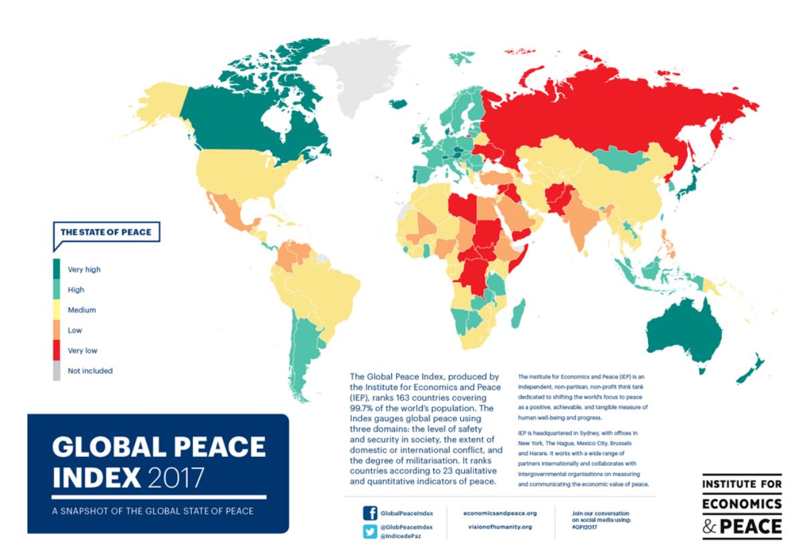

#### *Source: Institute for Peace and Economics*

- d. Nationalization/Expropriation risk: If you invest in a business and it does well, the payoff comes in the form of higher profits (if you are a business) or higher value (if you are an investor). If your profits can be expropriated by the business (with arbitrary and specific taxes imposed just upon you) or your business can be nationalized (with you receiving well below the fair value as compensation), you will be less likely to invest and more likely to perceive risk in the investment. Some businesses seem to be more exposed to nationalization risk than others, with natural resource companies at the top of the target list. An Ernst and Young assessment of risks facing mining companies in 2012, lists nationalization at the

4 See http://www.visionofhumanity.org..

very top of the list of risk in 2012, a stark contrast with the list in 2008, where nationalization was ranked eighth of the top ten risks.5

# *Legal Risk*

Investors and businesses are dependent upon legal systems that respect their property rights and enforce those rights in a timely manner. To the extent that a legal system fails on one or both counts, the consequences are negative not only for those who are immediately affected by the failing but for potential investors who have to build in this behavior into their expectations. Thus, if a country allows insiders in companies to issue additional shares to themselves at well below the market price without paying heed to the remaining shareholders, potential investors in these companies will pay less (or even nothing) for shares. Similarly, companies considering starting new ventures in that country may determine that they are exposed to the risk of expropriation and either demand extremely high returns or not invest at all.

It is worth emphasizing, though, that legal risk is a function not only of whether it pays heed to property and contract rights, but also how efficiently the system operates. If enforcing a contract or property rights takes years or even decades, it is essentially the equivalent of a system that does not protect these rights in the first place, since neither investors nor businesses can wait in legal limbo for that long. A group of nongovernment organizations has created an international property rights index, measuring the protection provided for property rights in different countries.6 The summary results, by region, are provided in table 2, with the ranking from best protection (highest scores) to worst in 2016:

*Table 2: Property Right Protection by Region – 2016*

|                                 | Overall property rights | Legal Property rights | Physical Property rights | Intellectual Property rights |
|---------------------------------|-------------------------|-----------------------|--------------------------|------------------------------|
| European Union                  | 6.64                    | 6.75                  | 6.29                     | 6.88                         |
| Rest Of Europe                  | 5.11                    | 5.07                  | 5.82                     | 4.45                         |
| Africa                          | 4.63                    | 4.02                  | 5.30                     | 4.58                         |
| North America Central America & | 6.85                    | 6.44                  | 6.63                     | 7.48                         |
| Caribe                          | 4.75                    | 4.18                  | 5.28                     | 4.78                         |

---

5 Business Risks facing mining and metals, 2012-2013, Ernst & Young, [www.ey.com](http://www.ey.com).

5 Business Risks facing mining and metals, 2012-2013, Ernst & Young, www.ey.com. 6 See the International Property Rights Index, http://www.internationalpropertyrightsindex.org/ranking

| South America | 4.70 | 4.11 | 5.43 | 4.57 |
|---------------|------|------|------|------|
| Asia          | 5.52 | 5.12 | 6.30 | 5.14 |
| Oceania       | 8.10 | 8.67 | 7.56 | 8.06 |

*Source: International Property Rights Index*

Based on these measures, property right protections are strongest in North America and weakest in Latin America and Africa. In an interesting illustration of differences within geographic regions, within Latin America, Chile ranks 21st in the world in property protection rights but Venezuela fall towards the bottom of the rankings. The entire list of countries with IPRI scores in 2016 is provided in Appendix 3.

# *Economic Structure*

Some countries are dependent upon a specific commodity, product or service for their economic success. That dependence can create additional risk for investors and businesses, since a drop in the commodity's price or demand for the product/service can create severe economic pain that spreads well beyond the companies immediately affected. Thus, if a country derives 50% of its economic output from iron ore, a drop in the price of iron ore will cause pain not only for mining companies but also for retailers, restaurants and consumer product companies in the country.

In a comprehensive study of commodity dependent countries, the United National Conference on Trade and Development (UNCTAD) measures the degree of dependence upon commodities across emerging markets and figure 2 reports the statistics. 7 Note the disproportional dependence on commodity exports that countries in Africa and Latin America have, making their economies and markets very sensitive to changes in commodity prices.

7 The State of Commodity Dependence 2014, United Nations Conference on Trade and Development (UNCTAD), http://unctad.org/en/PublicationsLibrary/suc2014d7\_en.pdf

*Figure 2: Commodity Dependence of Countries*

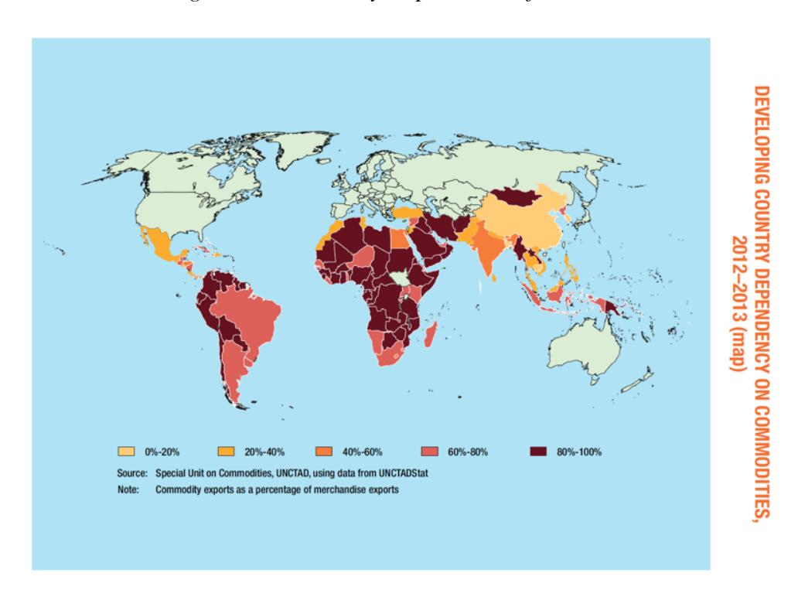

Why don't countries that derive a disproportionate amount of their economy from a single source diversify their economies? That is easier said than done, for two reasons. First, while it is feasible for larger countries like Brazil, India and China to try to broaden their economic bases, it is much more difficult for small countries like Peru or Angola to do the same. Like small companies, these small countries have to find a niche where there can specialize, and by definition, niches will lead to over dependence upon one or a few sources. Second, and this is especially the case with natural resource dependent countries, the wealth that can be created by exploiting the natural resource will usually be far greater than using the resources elsewhere in the economy. Put differently, if a country with ample oil reserves decides to diversify its economic base by directing its resources into manufacturing or service businesses, it may have to give up a significant portion of near term growth for a long-term objective of having a more diverse economy.

#### **Measuring country risk**

As the discussion in the last section should make clear, country risk can come from many different sources. While we have provided risk measures on each dimension, it would be useful to have composite measures of risk that incorporate all types of country risk. These composite measures should incorporate all of the dimensions of risk and allow for easy comparisons across countries

## *Risk Services*

There are several services that attempt to measure country risk, though not always from the same perspective or for the same audience. For instance, Political Risk Services (PRS) provides numerical measures of country risk for more than a hundred countries.8 The service is commercial and the scores are made available only to paying members, but PRS uses twenty two variables to measure risk in countries on three dimensions: political, financial and economic. It provides country risk scores on each dimension separately, as well as a composite score for the country. The scores range from zero to one hundred, with high scores (80-100) indicating low risk and low scores indicating high risk. In the July 2017 update, the 10 countries that emerged as safest and riskiest are listed in table 3:

*Table 3: Highest and Lowest Risk Countries: PRS Scores (July 2017)*

| Riskiest             |       | Safest      |      |
|----------------------|-------|-------------|------|
|                      | Score | Country     |      |
| Venezuela            | 46.8  | Switzerland | 88.8 |
| Sudan                | 47.5  | Norway      | 88.0 |
| Congo, Dem. Republic | 48.8  | Luxembourg  | 87.0 |
| Syria                | 50.3  | Singapore   | 85.8 |
| Somalia              | 51.5  | Sweden      | 85.5 |
| Yemen, Republic      | 52.0  | Germany     | 84.5 |
| Mozambique           | 53.8  | Hong Kong   | 83.5 |
| Niger                | 54.2  | Japan       | 83.5 |
| Egypt                | 54.3  | New Zealand | 83.5 |
| Libya                | 55.0  | Netherlands | 83.3 |

*Source: Political Risk Services (PRS)*

In addition to providing current assessments, PRS provides forecasts of country risk scores for the countries that it follows. Appendix 4 provides a grouped summary of how countries score on the PRS risk score in July 2017.

8 See http://www.prsgroup.com/ICRG\_Methodology.aspx#RiskForecasts for a discussion of the factors that PRS considers in assessing country risk scores.

There are other services that attempt to do what PRS does, with difference in both how the scores are developed and what they measure. Euromoney has country risk scores, based on surveys of 400 economists that range from zero to one hundred.9 It updates these scores, by country and region, at regular intervals. The Economist developed its own variant on country risk scores that are developed internally, based upon currency risk, sovereign debt risk and banking risk. The World Bank provides a collected resource base that draws together risk measures from different services into one database of governance indicators.10 There are six indicators provided for 215 countries, measuring corruption, government effectiveness, political stability, regulatory quality, rule of law and voice/accountability, with a scaling around zero, with negative numbers indicating more risk and positive numbers less risk.

# *Limitations*

The services that measure country risk with scores provide some valuable information about risk variations across countries, but it is unclear how useful these measures are for investors and businesses interested in investing in emerging markets for many reasons:

- Measurement models/methods: Many of the entities that develop the methodology and convert them into scores are not business entities and consider risks that may have little relevance for businesses. In fact, the scores in some of these services are more directed at policy makers and macroeconomists than businesses.
- No standardization: The scores are not standardized and each service uses it own protocol. Thus, higher scores go with lower risk with PRS and Euromoney risk measures but with higher risk in the Economist risk measure. The World Bank's measures of risk are scaled around zero, with more negative numbers indicating higher risk.
- More rankings than scores: Even if you stay with the numbers from one service, the country risk scores are more useful for ranking the countries than for measuring relative risk. Thus, a country with a risk score of 80, in the PRS

9 https://www.euromoneycountryrisk.com

10 http://data.worldbank.org/data-catalog/worldwide-governance-indicators

scoring mechanism, is safer than a country with a risk score of 40, but it would be dangerous to read the scores to imply that it is twice as safe.

In summary, as data gets richer and easier to access, there will be more services trying to measure country risk and even more divergences in approaches and measurement mechanisms.

# **Sovereign Default Risk**

The most direct measure of country risk is the default risk when lending to the government of that country. This risk, termed sovereign default risk, has a long history of measurement attempts, stretching back to the nineteenth century. In this section, we begin by looking at the history of sovereign defaults, both in foreign currency and local currency terms, and follow up by looking at measures of sovereign default risk, ranging from sovereign ratings to market-based measures.

## **A history of sovereign defaults**

In this section, we will examine the history of sovereign default, by first looking at governments that default on foreign currency debt (which is understandable) and then looking at governments that default on local currency debt (which is more difficult to explain).

#### *Foreign Currency Defaults*

Through time, many governments have been dependent on debt borrowed from other countries (or banks in those countries), usually denominated in a foreign currency. A large proportion of sovereign defaults have occurred with this type of sovereign borrowing, as the borrowing country finds its short of the foreign currency to meet its obligations, without the recourse of being able to print money in that currency. Starting with the most recent history from 2000-2016, sovereign defaults have mostly been on foreign currency debt, starting with a relatively small default by Ukraine in January 2000, followed by the largest sovereign default of the last decade with Argentina in November 2001. Table 4 lists the sovereign defaults, with details of each:

*Table 4: Sovereign Defaults: 2000-2015*

| Default    |                    |                                                                                      |
|------------|--------------------|--------------------------------------------------------------------------------------|
| Date       | Country            | \$ Value of Details Defaulted Debt Defaulted on DM and US dollar                     |
| January    | Ukraine            | \$1,064 m longer term, lower coupon bonds to lenders. Missed payment on Brady bonds. |
| September  | Peru               | \$4,870 m                                                                            |
| November   | Argentina          | \$82,268 m                                                                           |
| January    | Moldova            | \$145 m                                                                              |
| May 2003   | Uruguay            | \$5,744 m currency crisis and default.                                               |
| July 2003  | Nicaragua          | \$320 m rate debt with lower interest rate debt.                                     |
| April 2005 | Dominican Republic | \$1,622 m bonds with longer maturity.                                                |
| December   | Belize             | \$242 m new bonds with step-up coupons                                               |
| December   | Ecuador            | \$510 m million on the bonds.                                                        |
| February   | Jamaica            | \$7.9 billion                                                                        |
|            |                    | loss of between 11% and 17% of principal. Defaulted on Eurobonds.                    |
| January    | Ivory Coast        | \$2.3 billion                                                                        |
| July 2014  | Argentina          | \$13 billion holders also got paid.                                                  |
| September  | Ukraine            | \$500 million borrowing in December.                                                 |

Going back further in time, sovereign defaults have occurred have occurred frequently over the last two centuries, though the defaults have been bunched up in eight periods. A survey article on sovereign default, Hatchondo, Martinez and Sapriza (2007) summarizes defaults over time for most countries in Europe and Latin America and their findings are captured in table 5:11

*Table 5: Defaults over time: 1820-2003*

|                | 1824- 34 | 1867- 82 | 1890- 1900 Europe | 1911- 1921 | 1931- 40 | 1976- 89 | 1998- 2003 |
|----------------|----------|----------|-------------------|------------|----------|----------|------------|
| Austria        |          | 1868     |                   | 1914       | 1932     |          |            |
| Bulgaria       |          |          |                   | 1915       | 1932     |          |            |
| Germany        |          |          |                   |            | 1932     |          |            |
| Greece         | 1824     |          | 1893              |            |          |          |            |
| Hungary        |          |          |                   |            | 1931     |          |            |
| Italy          |          |          |                   |            | 1940     |          |            |
| Moldova        |          |          |                   |            |          |          | 2002       |
| Poland         |          |          |                   |            | 1936     | 1981     |            |
| Portugal       | 1834     |          | 1892              |            |          |          |            |
| Romania        |          |          |                   | 1915       | 1933     | 1981     |            |
| Russia Serbia |          |          |                   | 1917       |          |          | 1998       |
| Yugoslavia     |          |          | 1895              |            | 1933     | 1983     |            |
| Spain          | 1831     | 1867     |                   |            |          |          |            |
| Turkey         |          | 1976     |                   | 1915       | 1940     | 1978     |            |
| Ukraine        |          |          |                   |            |          |          | 1998       |
| Argentina      | 1830     |          | 1890              | 1915       | 1930     | 1982     | 2001       |
| Bolivia        |          | 1874     |                   |            | 1931     | 1980     |            |
| Brazil         | 1826     |          | 1898              | 1914       | 1931     | 1983     |            |
| Chile          | 1826     | 1880     |                   |            | 1931     | 1983     |            |
| Columbia       | 1826     | 1879     | 1900              |            | 1932     |          |            |
| Costa Rica     | 1827     | 1874     | 1895              |            | 1937     | 1983     |            |
| Cuba           |          |          |                   |            | 1933     | 1982     |            |
| Dominica       |          |          |                   |            |          |          | 2003       |

11 J.C. Hatchondo, L. Martinez, and H. Sapriza, 2007, *The Economics of Sovereign Default*, Economic Quarterly, v93, pg 163-187.

| Dominican   |      |      |      |           |      |      |      |
|-------------|------|------|------|-----------|------|------|------|
| Republic    |      | 1869 | 1899 |           | 1931 | 1982 |      |
| Ecuador     | 1832 | 1868 |      | 1911, '14 | 1931 | 1982 | 1999 |
| El Salvador | 1827 |      |      | 1921      | 1931 |      |      |
| Guatemala   | 1828 | 1876 | 1894 | 1933      |      |      |      |
| Honduras    | 1827 | 1873 |      | 1914      |      | 1981 |      |
| Mexico      | 1827 | 1867 |      | 1914      |      | 1982 |      |
| Nicaragua   | 1828 |      | 1894 | 1911      | 1932 | 1980 |      |
| Panama      |      |      |      |           | 1932 | 1982 |      |
| Paraguay    | 1827 | 1874 | 1892 | 1920      | 1932 | 1986 |      |
| Peru        | 1826 | 1876 |      |           | 1931 | 1983 |      |
| Uruguay     |      | 1876 | 1892 |           |      | 1983 | 2003 |
| Venezuela   | 1832 | 1878 | 1892 |           |      | 1982 |      |

While table 5 does not list defaults in Asia and Africa, there have been defaults in those regions over the last 50 years as well.

In a study of sovereign defaults between 1975 and 2004, Standard and Poor's notes the following facts about the phenomenon:12

1. Countries have been more likely to default on bank debt owed than on sovereign

bonds issued. Figure 3 summarizes default rates on each:

*Figure 3: Percent of Sovereign Debt in Default*

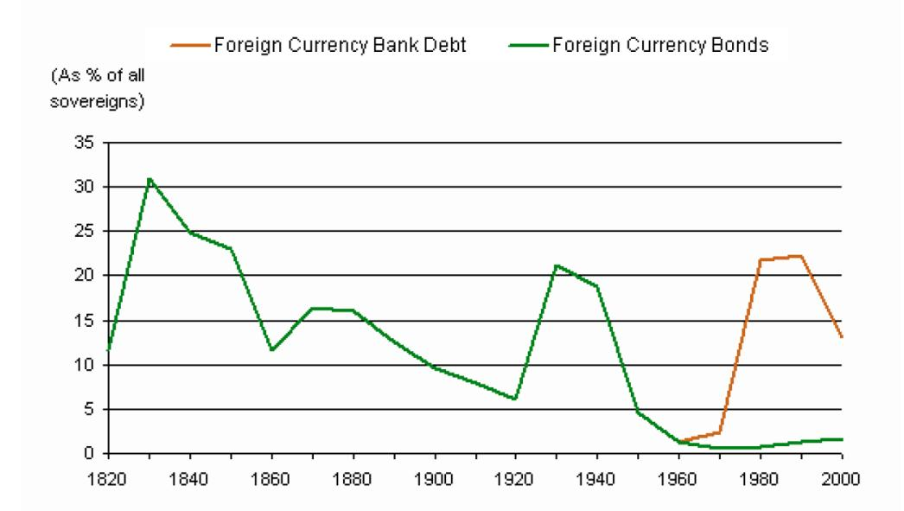

12 S&P Ratings Report, "Sovereign Defaults set to fall again in 2005, September 28, 2004.

Note that while bank loans were the only recourse available to governments that wanted to borrow prior to the 1960s, sovereign bond markets have expanded access in the last few decades. Defaults since then have been more likely on foreign currency debt than on foreign currency bonds.

- 2. In dollar value terms, Latin American countries have accounted for much of sovereign defaulted debt in the last 50 years. Figure 4 summarizes the statistics:

*Figure 4: Sovereign Default by Region*

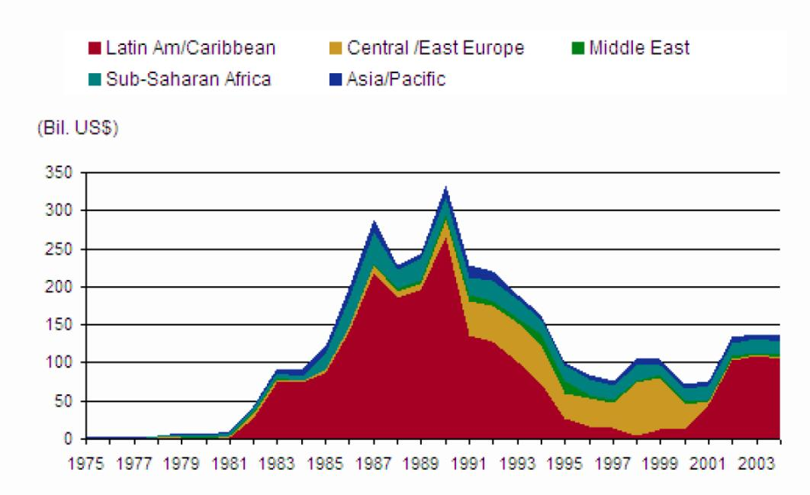

In fact, the 1990s represent the only decade in the last 5 decades, where Latin American countries did not account for 60% or more of defaulted sovereign debt.

Since Latin America has been at the epicenter of sovereign default for most of the last two centuries, we may be able to learn more about why default occurs by looking at its history, especially in the nineteenth century, when the region was a prime destination for British, French and Spanish capital. Lacking significant domestic savings and possessing the allure of natural resources, the newly independent countries of Latin American countries borrowed heavily, usually in foreign currency or gold and for very long maturities (exceeding 20 years). Brazil and Argentina also issued domestic debt, with gold clauses, where the lender could choose to be paid in gold. The primary trigger for default was military conflicts between countries or coups within, with weak institutional structures exacerbating the problems. Of the 77 government defaults between 1820 and 1914, 58 were in Latin America and as figure 5 indicates, these countries collectively spent 38% of the period between 1820 and 1940 in default.

*Figure 5: Latin America - The Sovereign Default Epicenter*

## Latin America: Periods in Default, 1825–1940

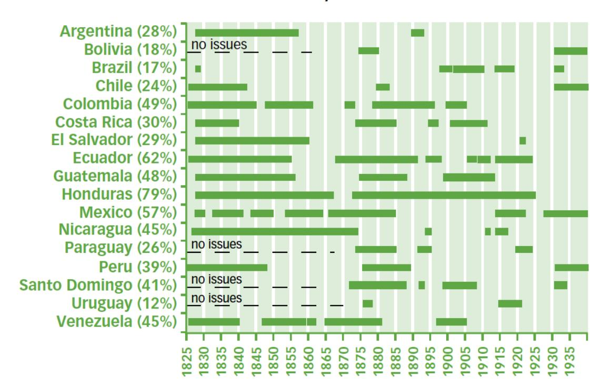

*Sources:* Taylor (2003); default data from Tomz (2001); issue dates from Marichal (1989).

The percentage of years that each country spent in default during the entire period is in parentheses next to the country; for instance, Honduras spent 79% of the 115 years in this study, in default.

# *Local Currency Defaults*

While defaulting on foreign currency debt draws more headlines, some of the countries listed in tables 2 and 3 also defaulted contemporaneously on domestic currency debt.13 A survey of defaults by S&P since 1975 notes that 23 issuers have defaulted on

13 In 1992, Kuwait defaulted on its local currency debt, while meeting its foreign currency obligations.

local currency debt, including Argentina (2002-2004), Madagascar (2002), Dominica (2003-2004), Mongolia (1997-2000), Ukraine (1998-2000), and Russia (1998-1999). Russia's default on \$39 billion worth of ruble debt stands out as the largest local currency default, since Brazil defaulted on \$62 billions of local currency debt in 1990. Figure 6 summarizes the percentage of countries that defaulted in local currency debt between 1975 and 2004 and compares it to sovereign defaults in foreign currency.14

*Figure 6: Defaults on Foreign and Local Currency Debt*

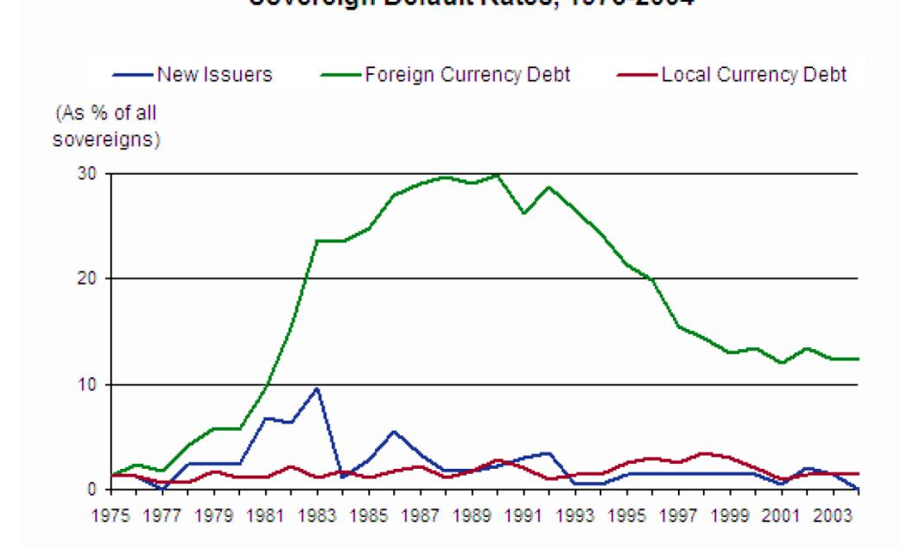

Moody's broke down sovereign defaults in local currency and foreign currency debt and uncovered an interesting feature: countries are increasingly defaulting on both local and foreign currency debt at the same time, as evidenced in figure 7.

14 S&P Ratings Report, "Sovereign Defaults set to fall again in 2005, September 28, 2004.

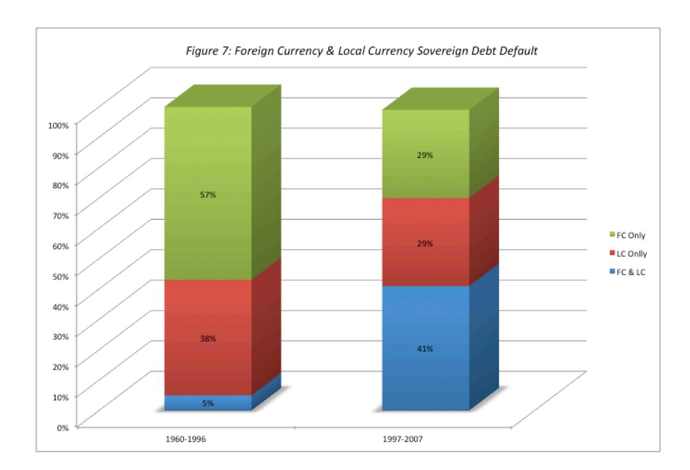

While it is easy to see how countries can default on foreign currency debt, it is more difficult to explain why they default on local currency debt. As some have argued, countries should be able to print more of the local currency to meet their obligations and thus should never default. There are three reasons why local currency default occurs and will continue to do so.

The first two reasons for default in the local currency can be traced to a loss of power in printing currency.

- a. Gold Standard: In the decades prior to 1971, when some countries followed the gold standard, currency had to be backed up with gold reserves. As a consequence, the extent of these reserves put a limit on how much currency could be printed.
- b. Shared Currency: The crisis in Greece has brought home one of the costs of a shared currency. When the Euro was adopted as the common currency for the Euro zone, the countries involved accepted a trade-off. In return for a common market and the convenience of a common currency, they gave up the power to control how much of the currency they could print. Thus, in July 2015, the Greek government could not print more Euros to pay off outstanding debt.

- 3. The Trade-off: In the next section, we will argue that default has negative consequences: reputation loss, economic recessions and political instability. The alternative of printing more currency to pay debt obligations also has costs. It debases and devalues the currency and causes inflation to increase exponentially, which in turn can cause the real economy to shrink. Investors abandon financial assets (and markets) and move to real assets (real estate, gold) and firms shift from real investments to financial speculation. Countries therefore have to trade-off between which action – default or currency debasement – has lower long-term costs and pick one; many choose default as the less costly option.

An intriguing explanation for why some countries choose to default in local currency debt whereas other prefer to print money (and debase their currencies) is based on whether companies in the country have foreign currency debt funding local currency assets. If they do, the cost of printing more local currency, pushing up inflation and devaluing the local currency, can be catastrophic for corporations, as the local currency devaluation lays waste to their assets while liabilities remain relatively unchanged.

#### *Consequences of Default*

What happens when a government defaults? In the eighteenth century, government defaults were followed often by shows of military force. When Turkey defaulted in the 1880s, the British and the French governments intervened and appointed commissioners to oversee the Ottoman Empire to ensure discipline. When Egypt defaulted around the same point in time, the British used military force to take over the government. A default by Venezuela in the early part of the 20th century led to a European blockade of that country and a reaction from President Theodore Roosevelt and the United States government, who viewed the blockade as a threat to the US power in the hemisphere.

In the twentieth century, the consequences of sovereign default have been both economic and political. Besides the obvious implication that lenders to that government lose some or a great deal of what is owed to them, there are other consequences as well:

- a. Reputation loss: A government that defaults is tagged with the "deadbeat" label for years after the event, making it more difficult for it to raise financing in future rounds.

- b. Capital Market turmoil: Defaulting on sovereign debt has repercussions for all capital markets. Investors withdraw from equity and bond markets, making it more difficult for private enterprises in the defaulting country to raise funds for projects.
- c. Real Output: The uncertainty created by sovereign default also has ripple effects on real investment and consumption. In general, sovereign defaults are followed by economic recessions, as consumers hold back on spending and firms are reluctant to commit resources to long-term investments.
- d. Political Instability: Default can also strike a blow to the national psyche, which in turn can put the leadership class at risk. The wave of defaults that swept through Europe in the 1930s, with Germany, Austria, Hungary and Italy all falling victims, allowed for the rise of the Nazis and set the stage for the Second World War. In Latin America, defaults and coups have gone hand in hand for much of the last two centuries.

In short, sovereign default has serious and painful effects on the defaulting entity that may last for long periods.

It is also worth emphasizing is that default has seldom involved total repudiation of the debt. Most defaults are followed by negotiations for either a debt exchange or restructuring, where the defaulting government is given more time, lower principal and/or lower interest payments. Credit agencies usually define the duration of a default episode as lasting from when the default occurs to when the debt is restructured. Defaulting governments can mitigate the reputation loss and return to markets sooner, if they can minimize losses to lenders.

Researchers who have examined the aftermath of default have come to the following conclusions about the short and long term effects of defaulting on debt:

- a. Default has a negative impact on the economy, with real GDP dropping between 0.5% and 2%, but the bulk of the decline is in the first year after the default and seems to be short lived.
- b. Default does affect a country's long term sovereign rating and borrowing costs. One study of credit ratings in 1995 found that the ratings for countries that had defaulted at least once since 1970 were one to two notches lower than otherwise similar countries that had not defaulted. In the same vein, defaulting countries have

borrowing costs that are about 0.5 to 1% higher than countries that have not defaulted. Here again, though, the effects of default dissipate over time.

- c. Sovereign default can cause trade retaliation. One study indicates a drop of 8% in bilateral trade after default, with the effects lasting for up to 15 years, and another one that uses industry level data finds that export oriented industries are particularly hurt by sovereign default.
- d. Sovereign default can make banking systems more fragile. A study of 149 countries between 1975 and 2000 indicates that the probability of a banking crisis is 14% in countries that have defaulted, an eleven percentage-point increase over non-defaulting countries.
- e. Sovereign default also increases the likelihood of political change. While none of the studies focus on defaults per se, there are several that have examined the after effects of sharp devaluations, which often accompany default. A study of devaluations between 1971 and 2003 finds a 45% increase in the probability of change in the top leader (prime minister or president) in the country and a 64% increase in the probability of change in the finance executive (minister of finance or head of central bank).

In summary, default is costly and countries do not (and should not) take the possibility of default lightly. Default is particularly expensive when it leads to banking crises and currency devaluations; the former have a longstanding impact on the capacity of firms to fund their investments whereas the latter create political and institutional instability that lasts for long periods.

# **Measuring Sovereign Default Risk**

If governments can default, we need measures of sovereign default risk not only to set interest rates on sovereign bonds and loans but to price all other assets. In this section, we will first look at why governments default and then at how ratings agencies, markets and services measure this default risk.

# *Factors determining sovereign default risk*

Governments default for the same reason that individuals and firms default. In good times, they borrow far more than they can afford, given their assets and earning power, and then find themselves unable to meet their debt obligations during downturns. To determine a country's default risk, we would look at the following variables:

1. Degree of indebtedness: The most logical place to start assessing default risk is by looking at how much a sovereign entity owes not only to foreign banks/ investors but also to its own citizens. Since larger countries can borrow more money, in absolute terms, the debt owed is usually scaled to the GDP of the country. Table 6 lists the 20 countries that owe the most, relative to GDP, in 2015.

*Table 6: Debt as % of Gross Domestic Product in 2015*

| Country             | Government Debt as % of GDP |
|---------------------|-----------------------------|
| Japan               | 249.34%                     |
| Lebanon             | 142.57%                     |
| Italy               | 133.03%                     |
| Portugal            | 127.94%                     |
| Eritrea             | 125.56%                     |
| Jamaica             | 123.09%                     |
| Bhutan              | 122.01%                     |
| Cabo Verde          | 121.67%                     |
| United States       | 107.49%                     |
| Belgium             | 106.76%                     |
| Barbados            | 105.75%                     |
| Cyprus              | 99.25%                      |
| Spain               | 99.04%                      |
| Singapore           | 98.24%                      |
| France              | 98.21%                      |
| The Gambia          | 96.89%                      |
| Antigua and Barbuda | 95.57%                      |
| Ukraine             | 92.80%                      |
| Iraq                | 92.46%                      |
| Belize              | 92.43%                      |

*Source: IMF*

The list suggests that this statistic (government debt as percent of GDP) is an incomplete measure of default risk. The list includes some countries with high default risk (Zimbabwe, Ukraine, Jamaica) but is also includes some countries that were viewed as among the most credit worthy by ratings agencies and markets (US, Japan, France and Singapore). As a final note, it is worth looking at how this statistic (debt as a percent of GDP) has changed in the United States over its last few decades. Figure 8 shows public debt as a percent of GDP for the US from 1966 to 2016:15

#### *Source: FRED, Federal Reserve Bank of St. Louis*

At just over 100% of GDP, federal debt in the United States is approaching levels not seen since the Second World War, with much of the surge coming after 2008. If there is a link between debt levels and default risk, it is not surprising that questions about default risk in the US government have risen to the surface.

2. Pensions/Social Service Commitments: In addition to traditional debt obligations, governments also make commitments to their citizens to pay pensions and cover health care. Since these obligations also compete for the limited revenues that the government has, countries that have larger commitments on these counts should have higher default risk than countries that do not.16

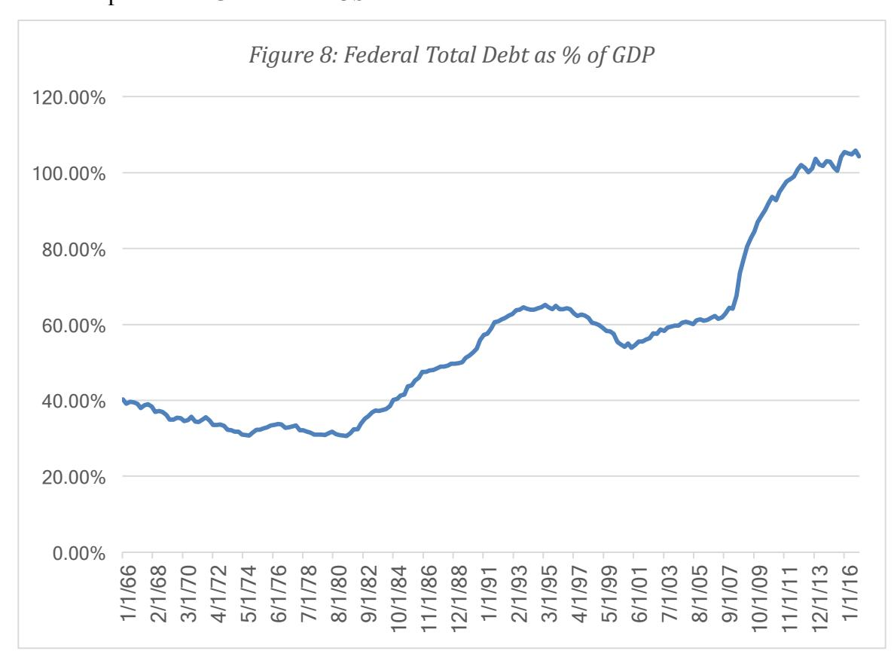

15 The statistic varies depending upon the data source you use, with some reporting higher numbers and others lower. This data was obtained from usgovernmentspending.com.

16 Since pension and health care costs increase as people age, countries with aging populations (and fewer working age people) face more default risk.

3. Revenues/Inflows to government: Government revenues usually come from tax receipts, which in turn are a function of both the tax code and the tax base. Holding all else constant, access to a larger tax base should increase potential tax revenues, which, in turn, can be used to meet debt obligations.

4. Stability of revenues: The essence of debt is that it gives rise to fixed obligations that have to be covered in both good and bad times. Countries with more stable revenue streams should therefore face less default risk, other things remaining equal, than countries with volatile revenues. But what is it that drives revenue stability? Since revenues come from taxing income and consumption in the nation's economy, countries with more diversified economies should have more stable tax revenues than countries that are dependent on one or a few sectors for their prosperity. To illustrate, Peru, with its reliance on copper and silver production and Jamaica, an economy dependent upon tourism, face more default risk than Brazil or India, which are larger, more diversified economies. The other factor that determines revenue stability is type of tax system used by the country. Generally, income tax based systems generate more volatile revenues than sales tax (or value added tax systems).

5. Political risk: Ultimately, the decision to default is as much a political decision as it is an economic decision. Given that sovereign default often exposes the political leadership to pressure, it is entirely possible that autocracies (where there is less worry about political backlash) are more likely to default than democracies. Since the alternative to default is printing more money, the independence and power of the central bank will also affect assessments of default risk.

6. Implicit backing from other entities: When Greece, Portugal and Spain entered the European Union, investors, analysts and ratings agencies reduced their assessments of default risk in these countries. Implicitly, they were assuming that the stronger European Union countries – Germany, France and the Scandinavian countries – would step in to protect the weaker countries from defaulting. The danger, of course, is that the backing is implicit and not explicit, and lenders may very well find themselves disappointed by lack of backing, and no legal recourse.

In summary, a full assessment of default risk in a sovereign entity requires the assessor to go beyond the numbers and understand how the country's economy works, the strength of its tax system and the trustworthiness of its governing institutions.

#### *Sovereign Ratings*

Since few of us have the resources or the time to dedicate to understanding small and unfamiliar countries, it is no surprise that third parties have stepped into the breach, with their assessments of sovereign default risk. Of these third party assessors, bond ratings agencies came in with the biggest advantages:

- (1) They have been assessing default risk in corporations for a hundred years or more and presumably can transfer some of their skills to assessing sovereign risk.
- (2) Bond investors who are familiar with the ratings measures, from investing in corporate bonds, find it easy to extend their use to assessing sovereign bonds. Thus, a AAA rated country is viewed as close to riskless whereas a C rated country is very risky.

In spite of these advantages, there are critiques that have been leveled at ratings agencies by both the sovereigns they rate and the investors that use these ratings. In this section, we will begin by looking at how ratings agencies come up with sovereign ratings (and change them) and then evaluate how well sovereign ratings measure default risk.

#### *The evolution of sovereign ratings*

Moody's, Standard and Poor's and Fitch's have been rating corporate bond offerings since the early part of the twentieth century. Moody's has been rating corporate bonds since 1919 and starting rating government bonds in the 1920s, when that market was an active one. By 1929, Moody's provided ratings for almost fifty central governments. With the great depression and the Second World War, investments in government bonds abated and with it, the interest in government bond ratings. In the 1970s, the business picked up again slowly. As recently as the early 1980s, only about fifteen, more mature governments had ratings, with most of them commanding the highest level (Aaa). The decade from 1985 to 1994 added 35 companies to the sovereign rating list, with many of them having speculative or lower ratings. Table 7 summarizes the growth of sovereign ratings from 1975 to 1994:

*Table 7: Sovereign Ratings – 1975-1994*

| Year     | Number of newly rated sovereigns | Median rating |
|----------|----------------------------------|---------------|
| Pre-1975 | 3                                | AAA/Aaa       |

| 1975-1979 | 9  | AAA/Aaa   |
|-----------|----|-----------|
| 1980-1984 | 3  | AAA/Aaa   |
| 1985-1989 | 19 | A/A2      |
| 1990-1994 | 15 | BBB-/Baa3 |

Since 1994, the number of countries with sovereign ratings has surged, just as the market for sovereign bonds has expanded. In 2016, Moody's, S&P and Fitch had ratings available for more than a hundred countries apiece.

In addition to more countries being rated, the ratings themselves have become richer. Moody's and S&P now provide two ratings for each country – a local currency rating (for domestic currency debt/ bonds) and a foreign currency rating (for government borrowings in a foreign currency). As an illustration, table 8 summarizes the local and foreign currency ratings, from Moody's, for Latin American countries in July 2017.

*Table 8: Local and Foreign Currency Ratings – Latin America in July 2017*

|             | Foreign Currency |     | Local Currency |     |
|-------------|------------------|-----|----------------|-----|
| Argentina   | B3               | POS | B3             | POS |
| Belize      | B3               | STA | B3             | STA |
| Bolivia     | Ba3              | NEG | Ba3            | NEG |
| Brazil      | Ba2              | NEG | Ba2            | NEG |
| Chile       | Aa3              | STA | Aa3            | STA |
| Colombia    | Baa2             | STA | Baa2           | STA |
| Costa Rica  | Ba2              | NEG | Ba2            | NEG |
| Ecuador     | B3               | STA |                |     |
| El Salvador | Caa1             | STA |                |     |
| Guatemala   | Ba1              | STA | Ba1            | STA |
| Honduras    | B2               | POS | B2             | POS |
| Mexico      | A3               | NEG | A3             | NEG |
| Nicaragua   | B2               | STA | B2             | STA |
| Panama      | Baa2             | STA |                |     |
| Paraguay    | Ba1              | STA | Ba1            | STA |
| Peru        | A3               | STA | A3             | STA |
| Uruguay     | Baa2             | NEG | Baa2           | NEG |
| Venezuela   | Caa3             | NEG | Caa3           | NEG |

*Source: Moody's*

For Ecuador, El Salvador and Panama, there is only a foreign currency rating, and the outlook on each country provides Moody's views on potential ratings changes, with negative (NEG) reflecting at least the possibility of a ratings downgrade and positive (POS) indicating the possibility of a ratings upgrade. For the most part, local currency ratings are at least as high or higher than the foreign currency rating, for the obvious reason that governments have more power to print more of their own currency. There are, however, exceptions where the local currency rating is lower than the foreign currency rating. In March 2010, for instance, India was assigned a local currency rating of Ba2 and a foreign currency rating of Baa3. The full list of sovereign ratings in July 2017, by country, from Moody's and Standard & Poor's, is provided in Appendix 5.

Do the ratings agencies agree on sovereign risk? For the most part, there is consensus in the ratings, but there can be significant differences on individual countries. These differences can come from very different assessments of political and economic risk in these countries by the ratings teams at the different agencies as well as home bias, with some arguing that ratings agencies that are US-bases (S&P, Moody's and Fitch) tend to over rate the US.17

Do sovereign ratings change over time? While one of the critiques of these ratings is that they were sticky, the rate of change has increased over the last few years. The best measure of sovereign ratings changes is a ratings transition matrix, which captures the changes that occur across ratings classes. Using S&P ratings to illustrate our point, table 9 summarizes the likelihood of ratings transitions for sovereigns from 2005 to 2015:

*Table 9: Ratings Transitions: S&P Sovereign Ratings from 2005 to 2015*

| Credit Rating | # Ratings | AAA    |        | AA-    |        | AA-    |        | AA-    |        | BBB+   | BBB    | BBB-   | BB-    | BB+    | BB     | BB-    | B+     | B      | B-     | CCC+, CCC | Default or withdrawn |
|---------------|-----------|--------|--------|--------|--------|--------|--------|--------|--------|--------|--------|--------|--------|--------|--------|--------|--------|--------|--------|-----------|----------------------|
|               |           | AA     | AA+    | AA     | AA-    | AA+    | A      | A-     |        |        |        |        |        |        |        |        |        |        |        |           |                      |
| AAA           | 20        | 60.00% | 20.00% | 5.00%  |        | 5.00%  |        | 5.00%  |        |        |        |        |        |        |        |        |        |        | 5.00%  |           |                      |
| AA+           | 2         |        |        | 50.00% |        |        |        | 50.00% |        |        |        |        |        |        |        |        |        |        |        |           |                      |
| AA            | 4         |        |        | 25.00% |        | 25.00% |        | 25.00% |        |        |        | 25.00% |        |        |        |        |        |        |        |           |                      |
| AA-           | 5         | 20.00% |        | 20.00% |        | 20.00% |        |        |        |        |        | 20.00% | 20.00% |        |        |        |        |        |        |           |                      |
| A+            | 9         |        |        | 22.22% | 11.11% | 22.22% | 22.22% | 11.11% | 11.11% |        |        |        |        |        |        |        |        |        |        |           |                      |
| A             | 11        |        |        | 9.09%  | 9.09%  | 9.09%  | 9.09%  | 18.18% | 9.09%  |        |        | 9.09%  |        |        |        |        |        |        | 27.27% |           |                      |
| A-            | 7         |        |        |        | 14.29% |        | 14.29% | 14.29% | 14.29% |        |        | 14.29% | 14.29% |        |        |        |        |        |        |           |                      |
| BBB+          | 3         |        |        |        |        |        |        |        |        |        |        | 33.33% | 33.33% |        |        |        |        |        |        |           |                      |
| BBB           | 5         |        |        |        |        |        |        |        |        | 20.00% | 20.00% |        |        | 20.00% |        |        |        |        |        |           |                      |
| BBB-          | 3         |        |        |        |        |        |        |        |        |        |        | 33.33% |        |        | 33.33% |        |        |        |        |           |                      |
| BB+           | 5         |        |        |        |        |        |        | 20.00% |        | 20.00% | 20.00% |        | 20.00% |        |        |        |        |        |        |           |                      |
| BB            | 9         |        |        |        |        |        |        |        |        | 11.11% | 22.22% | 22.22% |        | 11.11% | 11.11% |        |        | 22.22% |        |           |                      |
| BB-           | 3         |        |        |        |        |        |        |        |        |        |        |        |        |        | 33.33% | 66.67% |        |        |        |           |                      |
| B+            | 6         |        |        |        |        |        |        |        |        |        |        |        |        |        | 16.67% | 33.33% | 16.67% | 16.67% | 16.67% |           |                      |
| B             | 9         |        |        |        |        |        |        |        |        | 11.11% |        | 22.22% |        | 22.22% |        | 11.11% |        |        | 33.33% |           |                      |
| B-            | 5         |        |        |        |        |        |        |        |        |        |        |        |        | 40.00% |        |        |        | 20.00% | 20.00% | 20.00%    |                      |
| CCC+, CCC     | 3         |        |        |        |        |        |        |        |        |        |        |        |        |        |        | 33.33% | 33.33% |        | 33.33% |           |                      |
| Total         | 109       |        |        |        |        |        |        |        |        |        |        |        |        |        |        |        |        |        |        |           |                      |

*Source: Standard & Poor's*

17 Fuchs, A. and K. Gehring, 2015, The Home Bias in Sovereign Ratings, SSRN Working Paper, http://papers.ssrn.com/sol3/papers.cfm?abstract\_id=2625090.

Table 9 provides evidence on how sovereign ratings changed between 2005 and 2015. Over this decade, a AAA rated sovereign had a 60% chance of remaining AAA rated ten years later; a BBB rated sovereign has an 20% chance of being upgraded, a 20% chance of remaining unchanged and a 60% chance of being downgraded. The events during the time period, and the banking crisis of 2008 in particular, skew the probabilities towards downgrades.

As the number of rated countries around the globe increases, we are opening a window to how ratings agencies assess risk at the broader regional level. One of the criticisms that rated countries have mounted against the ratings agencies is that they have regional biases, leading them to under rate entire regions of the world (Latin America and Africa). The defense that ratings agencies would offer is that past default history is a good predictor of future default and that Latin America has a great deal of bad history to overcome.

*What goes into a sovereign rating?*

The ratings agencies started with a template that they developed and fine-tuned with corporations and have modified it to estimate sovereign ratings. While each agency has its own system for estimating sovereign ratings, the processes share a great deal in common.

è Ratings Measure: A sovereign rating is focused on the credit worthiness of the sovereign to private creditors (bondholders and private banks) and not to official creditors (which may include the World Bank, the IMF and other entities). Ratings agencies also vary on whether their rating captures only the probability of default or also incorporates the expected severity, if it does occur. S&P's ratings are designed to capture the probability that default will occur and not necessarily the severity of the default, whereas Moody's focus on both the probability of default and severity (captured in the expected recovery rate). Default at all of the agencies is defined as either a failure to pay interest or principal on a debt instrument on the due date (outright default) or a rescheduling, exchange or other restructuring of the debt (restructuring default). è Determinants of ratings: In a publication that explains its process for sovereign ratings, Standard and Poor's lists out the variables that it considers when rating a country. These variables encompass both political, economic and institutional variables and are summarized in table 10:

#### *Table 10: Factors considered while assigning sovereign ratings*

While Moody's and Fitch have their own set of variables that they use to estimate sovereign ratings, they parallel S&P in their focus on economic, political and institutional detail.

è Rating process: The analyst with primary responsibility for the sovereign rating prepares a ratings recommendation with a draft report, which is then assessed by a ratings committee composed of 5-10 analysts, who debate each analytical category and vote on a score. Following closing arguments, the ratings are decided by a vote of the committee. è Local versus Foreign Currency Ratings: As we noted earlier, the ratings agencies usually assign two ratings for each sovereign – a local currency rating and a foreign currency rating. There are two approaches used by ratings agencies to differentiate between these ratings. In the first, called the notch-up approach, the foreign currency rating is viewed as the primary measure of sovereign credit risk and the local currency rating is notched up, based upon domestic debt market factors. In the notch down approach, it is the local currency rating that is the anchor, with the foreign currency rating notched down, reflecting foreign exchange constraints. The differential between foreign and local currency ratings is primarily a function of monetary policy independence. Countries that maintain floating rate exchange regimes and fund borrowing from deep domestic markets will have the largest differences between local and foreign currency ratings, whereas countries that have given up monetary policy independence, either through dollarization or joining a monetary union, will see local currency ratings converge on foreign currency ratings. è Ratings Review and Updates: Sovereign ratings are reviewed and updated by the ratings agencies and these reviews can be both at regular periods and also triggered by news items. Thus, news of a political coup or an economic disaster can lead to a ratings review not just for the country in question but for surrounding countries (that may face a contagion effect).

# *Do sovereign ratings measure default risk?*

The sales pitch from ratings agencies for sovereign ratings is that they are effective measures of default risk in bonds (or loans) issued by that sovereign. But do they work as advertised? Each of the ratings agencies goes to great pains to argue that notwithstanding errors on some countries, there is a high correlation between sovereign ratings and sovereign defaults. In table 11, we summarize S&P's estimates of cumulative default rates for bonds in each ratings class from 1975 to 2012:

*Table 11: S&P Sovereign Foreign Currency Ratings and Default Probabilities- 1975 to 2012*

| Rating            | 1      | 5     | 10    | 15    |
|-------------------|--------|-------|-------|-------|
| AAA               | 0.0%   | 0.0%  | 0.0%  | 0.0%  |
| AA+               | 0.0%   | 0.0%  | 0.0%  | 0.0%  |
| AA                | 0.0%   | 0.0%  | 0.0%  | 0.0%  |
| AA-               | 0.0%   | 0.0%  | 0.0%  | 0.0%  |
| A+                | 0.0%   | 0.0%  | 3.7%  | 3.7%  |
| A                 | 0.0%   | 1.8%  | 6.9%  | 8.6%  |
| A-                | 0.0%   | 1.0%  | 1.0%  | 6.2%  |
| BBB+              | 0.0%   | 0.6%  | 0.6%  | 0.6%  |
| BBB               | 0.0%   | 3.4%  | 3.4%  | 7.4%  |
| BBB-              | 0.0%   | 5.0%  | 7.9%  | 12.6% |
| BB+               | 0.1%   | 1.3%  | 6.9%  | 6.9%  |
| BB                | 0.0%   | 3.6%  | 5.0%  | 13.6% |
| BB-               | 1.7%   | 9.8%  | 19.9% | 21.0% |
| B+                | 0.6%   | 8.0%  | 25.3% | 39.8% |
| B                 | 2.4%   | 19.4% | 35.1% | 35.8% |
| B-                | 7.4%   | 19.7% | 25.9% | NA    |
| CCC+              | 19.6%  | 50.7% | 91.0% | NA    |
| CCC               | 39.6%  | 66.0% | NA    | NA    |
| CCC-              | 77.8%  | NA    | NA    | NA    |
| CC                | 100.0% | NA    | NA    | NA    |
| Investment	grade  | 0.0%   | 0.9%  | 1.7%  | 2.5%  |
| Speculative	grade | 2.7%   | 11.3% | 20.6% | 24.8% |
| All	rated         | 0.9%   | 4.2%  | 7.3%  | 8.6%  |

*Source: Standard and Poor's*

Fitch and Moody's also report default rates by ratings classes and in summary, all of the ratings agencies seem to have, on average, delivered the goods. Sovereign bonds with investment grade ratings have defaulted far less frequently than sovereign bonds with speculative ratings.

Notwithstanding this overall track record of success, ratings agencies have been criticized for failing investors on the following counts:

- 1. Ratings are upward biased: Ratings agencies have been accused of being far too optimistic in their assessments of both corporate and sovereign ratings. While the conflict of interest of having issuers pay for the rating is offered as the rationale for the upward bias in corporate ratings, that argument does not hold up when it comes to sovereign ratings, since the issuing government does not pay ratings agencies.
- 2. There is herd behavior: When one ratings agency lowers or raises a sovereign rating, other ratings agencies seem to follow suit. This herd behavior reduces the value of having three separate ratings agencies, since their assessments of sovereign risk are no longer independent.
- 3. Too little, too late: To price sovereign bonds (or set interest rates on sovereign loans), investors (banks) need assessments of default risk that are updated and timely. It has long been argued that ratings agencies take too long to change ratings, and that these changes happen too late to protect investors from a crisis.
- 4. Vicious Cycle: Once a market is in crisis, there is the perception that ratings agencies sometimes over react and lower ratings too much, thus creating a feedback effect that makes the crisis worse.
- 5. Ratings failures: At the other end of the spectrum, it can be argued that when a ratings agency changes the rating for a sovereign multiple times in a short time period, it is admitting to failure in its initial rating assessment. In a paper on the topic, Bhatia (2004) looks at sovereigns where S&P and Moody changed ratings multiple times during the course of a year between 1997 and 2002. His findings are reproduced in table 12:

*Table 12: Ratings Failures*

| Failure         | Failed rating (& date) 2/ | Corrected rating (& date) 2/ | Notes adjusted 2/ | Key factor                |
|-----------------|------------------------------|---------------------------------|----------------------|---------------------------|
| <b>Sept</b>     |                              |                                 |                      |                           |
| 1997: Thailand  | A (Sept. 3, 1997)            | BB- (Jan. 8, 1998)              | 4↓ (0.97)            | Evaporation of reserves   |
| 1997: Indonesia | BB- (Oct. 10, 1997)          | B- (Mar. 11, 1998)              | 7↓ (1.40)            | Collapse of asset quality |
| 1997: Korea     | AA- (Oct. 24, 1997)          | B+ (Dec. 22, 1997)              | 10↓ (5.26)           | Evaporation of reserves   |
| 1997: Malaysia  | A+ (Dec. 23, 1997)           | BB- (Sept. 15, 1998)            | 5↓ (0.57)            | Collapse of asset quality |
| 1998: Korea     | B+ (Feb. 18, 1998)           | BB- (Jan. 25, 1999)             | 4↑ (0.36)            | Reserves replenishment    |
| 1998: Romania   | BB- (May 20, 1998)           | B- (Oct. 19, 1998)              | 3↓ (0.61)            | Evaporation of reserves   |
| 1998: Russia    | BB- (June 9, 1998)           | B- (Aug. 13, 1998)              | 3↓ (1.43)            | Evaporation of reserves   |
| 2000: Argentina | BB- (Nov. 14, 2000)          | B- (July 12, 2001)              | 4↓ (0.50)            | Fiscal slippage           |
| 2002: Uruguay   | BBB- (Feb. 14, 2002)         | B (July 26, 2002)               | 5↓ (0.94)            | Evaporation of reserves   |
| <b>Moody's</b>  |                              |                                 |                      |                           |
| 1997: Thailand  | A2 (Apr. 8, 1997)            | Bal (Dec. 21, 1997)             | 5↓ (0.68)            | Evaporation of reserves   |
| 1997: Korea     | A1 (Nov. 27, 1997)           | Bal (Dec. 21, 1997)             | 6↓ (7.83)            | Evaporation of reserves   |
| 1997: Indonesia | Baa3 (Dec. 21, 1997)         | B3 (Mar. 20, 1998)              | 6↓ (2.05)            | Collapse of asset quality |
| 1997: Malaysia  | A1 (Dec. 21, 1997)           | Baa2 (Sept. 14, 1998)           | 4↓ (0.46)            | Collapse of asset quality |
| 1998: Russia    | Ba2 (Mar. 11, 1998)          | B3 (Aug. 21, 1998)              | 4↓ (0.75)            | Evaporation of reserves   |
| 1998: Moldova   | Ba2 (July 14, 1998)          | B2 (July 14, 1998)              | 3↓ (90.00)           | Evaporation of reserves   |
| 1998: Romania   | Ba3 (Sept. 14, 1998)         | B3 (Nov. 6, 1998)               | 3↓ (1.76)            | Evaporation of reserves   |
| 2002: Uruguay   | Baa3 (May 3, 2002)           | B3 (July 31, 2002)              | 6↓ (2.07)            | Evaporation of reserves   |

Why do ratings agencies sometimes fail? Bhatia provides some possible answers:

- a. Information problems: The data that the agencies use to rate sovereigns generally come from the governments. Not only are there wide variations in the quantity and quality of information across governments, but there is also the potential for governments holding back bad news and revealing only good news. This, in turn, may explain the upward bias in sovereign ratings.
- b. Limited resources: To the extent that the sovereign rating business generates only limited revenues for the agencies and it is required to at least break even in terms of costs, the agencies cannot afford to hire too many analysts. These analysts are then spread thin globally, being asked to assess the ratings of dozens of lowprofile countries. In 2003, it was estimated that each analyst at the agencies was called up to rate between four and five sovereign governments. It has been argued by some that it is this overload that leads analysts to use common information (rather than do their own research) and to herd behavior.
- c. Revenue Bias: Since ratings agencies offer sovereign ratings gratis to most users, the revenues from ratings either have to come from the issuers or from other business that stems from the sovereign ratings business. When it comes from the issuing sovereigns or sub-sovereigns, it can be argued that agencies will hold back on assigning harsh ratings. In particular, ratings agencies generate significant revenues from rating sub-sovereign issuers. Thus, a sovereign ratings downgrade will be followed by a series of sub-sovereign ratings downgrades. Indirectly, therefore, these sub-sovereign entities will fight a sovereign downgrade, again explaining the upward bias in ratings.

- d. Other Incentive problems: While it is possible that some of the analysts who work for S&P and Moody's may seek work with the governments that they rate, it is uncommon and thus should not pose a problem with conflict of interest. However, the ratings agencies have created other businesses, including market indices, ratings evaluation services and risk management services, which may be lucrative enough to influence sovereign ratings.

# *Market Interest Rates*

The growth of the sovereign ratings business reflected the growth in sovereign bonds in the 1980s and 1990s. As more countries have shifted from bank loans to bonds, the market prices commanded by these bonds (and the resulting interest rates) have yielded an alternate measure of sovereign default risk, continuously updated in real time. In this section, we will examine the information in sovereign bond markets that can be used to estimate sovereign default risk.

# *The Sovereign Default Spread*

When a government issues bonds, denominated in a foreign currency, the interest rate on the bond can be compared to a rate on a riskless investment in that currency to get a market measure of the default spread for that country. To illustrate, the Brazilian government had a 10-year dollar denominated bond outstanding in July 2017, with a market interest rate of 4.90%. At the same time, the 10-year US treasury bond rate was 2.36%. If we assume that the US treasury is default free, the difference between the two rates can be attributed (2.54%) can be viewed as the market's assessment of the default spread for Brazil. Table 13 summarizes interest rates and default spreads for emerging market countries in July 2017, using dollar denominated bonds issued by these countries, as well as the sovereign foreign currency ratings (from Moody's) at the time.

*Table 13: Default Spreads on Dollar Denominated Bonds- Emerging Markets*

| Country   | Moody's Rating | \$ 10-year Bond Rate | US T.Bond Rate | Default Spread |
|-----------|----------------|----------------------|----------------|----------------|
| Argentina | B3             | 6.43%                | 2.36%          | 4.07%          |
| Brazil    | Ba2            | 4.90%                | 2.36%          | 2.54%          |
| Chile     | Aa3            | 3.05%                | 2.36%          | 0.69%          |
| Colombia  | Baa2           | 3.88%                | 2.36%          | 1.52%          |

| Indonesia   | Baa3 | 3.76%  | 2.36% | 1.40%  |
|-------------|------|--------|-------|--------|
| Mexico      | A3   | 3.75%  | 2.36% | 1.39%  |
| Peru        | A3   | 3.10%  | 2.36% | 0.74%  |
| Philippines | Baa2 | 4.63%  | 2.36% | 2.27%  |
| Russia      | Ba1  | 4.27%  | 2.36% | 1.91%  |
| Turkey      | Ba1  | 5.30%  | 2.36% | 2.94%  |
| Venezuela   | Caa3 | 25.27% | 2.36% | 22.91% |

While there is a positive correlation between sovereign ratings and market default spreads, there are advantages to using these bond-market based default spreads. The first is that the market differentiation for risk is more granular than the ratings agencies; thus, Peru and Mexico have the same Moody's rating (A3) but the market sees more default risk in Mexico than in Peru. The contrast is even greater with Russia and Turkey, both rated Ba1 by Moody's, but the latter has a default spread much larger than the former. The second is that the market-based spreads are more dynamic than ratings, with changes occurring in real time. In figure 9, we graph the shifts in the default spreads for Brazil and Venezuela between 2006 and the end of 2009:

*Figure 9: Default Spreads for \$ Denominated Bonds: Brazil vs Venezuela*

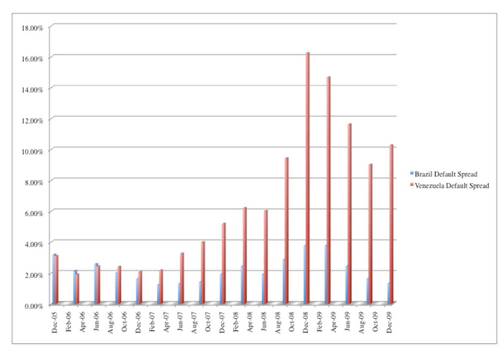

In December 2005, the default spreads for Brazil and Venezuela were similar; the Brazilian default spread was 3.18% and the Venezuelan default spread was 3.09%. Between 2006 and 2009, the spreads diverged, with Brazilian default spreads dropping to 1.32% by December 2009 and Venezuelan default spreads widening to 10.26%.

To use market-based default spreads as a measure of country default risk, there has to be a default free security in the currency in which the bonds are issued. Local currency bonds issued by governments cannot be compared to each other, since the differences in rates can be due to differences in expected inflation. Even with dollardenominated bonds, it is only the assumption that the US Treasury bond rate is default free that allows us to back out default spreads from the interest rates.

## *The spread as a predictor of default*

Are market default spreads better predictors of default risk than ratings? One advantage that market spreads have over ratings is that they can adjust quickly to information. As a consequence, they provide earlier signals of imminent danger (and default) than ratings agencies do. However, market-based default measures carry their own costs. They tend to be far more volatile than ratings and can be affected by variables that have nothing to do with default. Liquidity and investor demand can sometimes cause shifts in spreads that have little or nothing to do with default risk.

Studies of the efficacy of default spreads as measures of country default risk reveal some consensus. First, default spreads are for the most part correlated with both sovereign ratings and ultimate default risk. In other words, sovereign bonds with low ratings tend trade at much higher interest rates and also are more likely to default. Second, the sovereign bond market leads ratings agencies, with default spreads usually climbing ahead of a rating downgrade and dropping before an upgrade. Third, notwithstanding the lead-lag relationship, a change in sovereign ratings is still an informational event that creates a price impact at the time that it occurs. In summary, it would be a mistake to conclude that sovereign ratings are useless, since sovereign bond markets seems to draw on ratings (and changes in these ratings) when pricing bonds, just as ratings agencies draw on market data to make changes in ratings.

# *Credit Default Swaps*

The last decade has seen the evolution of the Credit Default Swap (CDS) market, where investors try to put a price on the default risk in an entity and trade at that price. In conjunction with CDS contracts on companies, we have seen the development of a market for sovereign CDS contracts. The prices of these contracts represent market assessments of default risk in countries, updated constantly.

# *How does a CDS work?*

The CDS market allows investors to buy protection against default in a security. The buyer of a CDS on a specific bond makes payments of the "spread" each period to the seller of the CDS; the payment is specified as a percentage (spread) of the notional or face value of the bond being insured. In return, the seller agrees to make the buyer whole if the issuer of the bond (reference entity) fails to pay, restructures or goes bankrupt (credit event), by doing one of the following:

- a. Physical settlement: The buyer of the CDS can deliver the "defaulted" bond to the seller and get par value for the bond.

- b. Cash settlement: The seller of the CDS can pay the buyer the difference between par value of the defaulted bond and the market price, which will reflect the expected recovery from the issuer.

In effect, the buyer of the CDS is protected from losses arising from credit events over the life of the CDS.

Assume, for instance, that you own 5-year Colombian government bonds, with a par value of \$ 10 million, and that you are worried about default over the life of the bond. Assume also that the price of a 5-year CDS on the Colombian government is 250 basis points (2.5%). If you buy the CDS, you will be obligated to pay \$250,000 each year for the next 5 years and the seller of the CDS would receive this payment. If the Colombian government fails to fulfill its obligations on the bond or restructures the bond any time over the next 5 years, the seller of the CDS can fulfill his obligations by either buying the bonds from you for \$ 10 million or by paying you the difference between \$ 10 million and the market price of the bond after the credit event happens.

There are two points worth emphasizing about a CDS that may undercut the protection against default that it is designed to offer. The first is that the protection against failure is triggered by a credit event; if there is no credit event, and the market price of the bond collapses, you as the buyer will not be compensated. The second is that the guarantee is only as good as the credit standing of the seller of the CDS. If the seller defaults, the insurance guarantee will fail. On the other side of the transaction, the buyer may default on the spread payments that he has contractually agreed to make.

# *Market Background*

J.P. Morgan is credited with creating the first CDS, when it extended a \$4.8 billion credit line to Exxon and then sold the credit risk in the transaction to investors. Over the last decade and a half, the CDS market has surged in size. By the end of 2007, the notional value of the securities on which CDS had been sold amounted to more than \$ 60 trillion, though the market crisis caused a pullback to about \$39 trillion by December 2008.

You can categorize the CDS market based upon the reference entity, i.e., the issuer of the bond underlying the CDS. While our focus is on sovereign CDS, they represent a small proportion of the overall market. Corporate CDS represent the bulk of the market, followed by bank CDS and then sovereign CDS. While the notional value of the securities underlying the CDS market is huge, the market itself is a fair narrow one, insofar that a few investors account for the bulk of the trading in the market. While the market was initially dominated by banks buying protection against default risk, the market has attracted investors, portfolio managers and speculators, but the number of players in the market remains small, especially given the size of the market. The narrowness of the market does make it vulnerable, since the failure of one or more of the big players can throw the market into tumult and cause spreads to shift dramatically. The failure of Lehman Brothers in 2008, during the banking crisis, threw the CDS market into turmoil for several weeks.

# *CDS and default risk*

If we assume away counter party risk and liquidity, the prices that investors set for credit default swaps should provide us with updated measures of default risk in the reference entity. In contrast to ratings, that get updated infrequently, CDS prices should reflect adjust to reflect current information on default risk.

To illustrate this point, let us consider the evolution of sovereign risk in Greece during 2009 and 2010. In figure 10, we graph out the CDS spreads for Greece on a month-by-month basis from 2006 to 2010 and ratings actions taken by one agency (Fitch) during that period:

*Figure 10: Greece CDS Prices and Ratings*

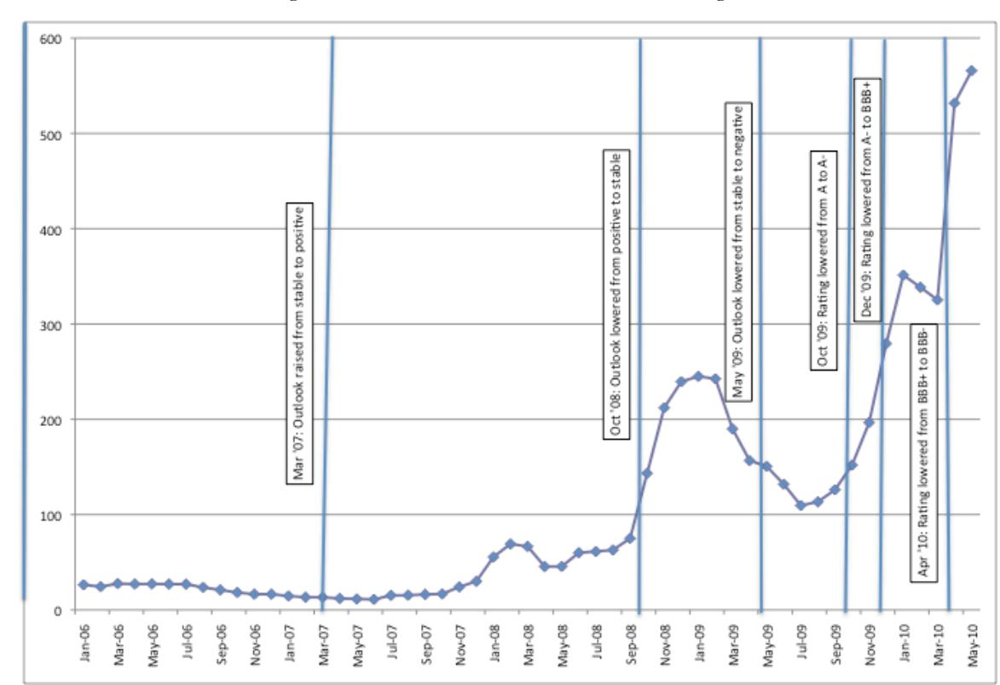

While ratings stayed stagnant for the bulk of the period, before moving late in 2009 and 2010, when Greece was downgraded, the CDS spread and default spreads for Greece changed each month. The changes in both market-based measures reflect market reassessments of default risk in Greece, using updated information.

While it is easy to show that CDS spreads are more timely and dynamic than sovereign ratings and that they reflect fundamental changes in the issuing entities, the fundamental question remains: Are changes in CDS spreads better predictors of future default risk than sovereign ratings or default spreads? The findings are significant. First, changes in CDS spreads lead changes in the sovereign bond yields and in sovereign ratings.18 Second, it is not clear that the CDS market is quicker or better at assessing default risks than the government bond market, from which we can extract default spreads. Third, there seems to be clustering in the CDS market, where CDS prices across

 18 Ismailescu, I., 2007, The Reaction of Emerging Markets Credit Default Swap Spreads to Sovereign Credit Rating Changes and Country Fundamentals, Working Paper, Pace University. This study finds that CDS prices provide more advance warning of ratings downgrades.

groups of companies move together in the same direction. A study suggests six clusters of emerging market countries, captured in table 14:

*Table 14: Clusters of Emerging Markets: CDS Market*

|                      | Cluster 1 | Cluster 2 | Cluster 3 | Cluster 4 | Cluster 5   | Cluster 6 |
|----------------------|-----------|-----------|-----------|-----------|-------------|-----------|
| Countries in Cluster | Brazil    | Chile     | Croatia   | Colombia  | Pakistan    | Israel    |
|                      | Bulgaria  | China     | Hungary   | Panama    | Philippines | Qatar     |
|                      | Mexico    | Japan     | Malaysia  | Peru      | Ukraine     |           |
|                      | Poland    | Korea     | Romania   |           |             |           |
|                      | Russia    | Thailand  | S. Africa |           |             |           |
|                      | Slovak    | Venezuela |           |           |             |           |
|                      | Turkey    |           |           |           |             |           |
|                      |           |           |           |           |             |           |
| Ave. Corr. Internal  | 0.516     | 0.596     | 0.402     | 0.588     | 0.517       | 0.466     |
| Ave. Corr. External  | 0.210     | 0.220     | 0.278     | 0.245     | 0.218       | 0.102     |
| Ave. CDS Spread      | 287.30    | 114.83    | 96.10     | 243.63    | 262.37      | 30.12     |

The correlation within the cluster and outside the cluster, are provided towards the bottom. Thus, the correlation between countries in cluster 1 is 0.516, whereas the correlation between countries in cluster 1 and the rest of the market is only 0.210.

There are inherent limitations with using CDS prices as predictors of country default risk. The first is that the exposure to counterparty and liquidity risk, endemic to the CDS market, can cause changes in CDS prices that have little to do with default risk. Thus, a significant portion of the surge in CDS prices in the last quarter of 2008 can be traced to the failure of Lehman and the subsequent surge in concerns about counterparty risk. The second and related problem is that the narrowness of the CDS market can make individual CDS susceptible to illiquidity problems, with a concurrent effect on prices. Notwithstanding these limitations, it is undeniable that changes in CDS prices supply important information about shifts in default risk in entities. In summary, the evidence, at least as of now, is that changes in CDS prices provide information, albeit noisy, of changes in default risk. However, there is little to indicate that it is superior to market default spreads (obtained from government bonds) in assessing this risk.

## *Sovereign Risk in the CDS Market*

Notwithstanding both the limitations of the market and the criticism that has been directed at it, the CDS market continues to grow. In July 2017, there were 68 countries with sovereign CDS trading on them. Figure 11 captures the differences in CDS spreads across the globe (for the countries for which it is available) in July 2017:

*Figure 11: CDS Spreads Global Heat Map– July 2017*

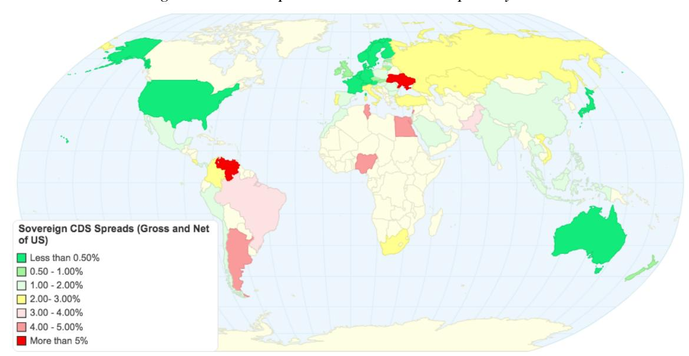

Not surprisingly, much of Africa remains uncovered, there are large swaths in Latin America with high default risk, Asia has seen a fairly significant drop off in risk largely because of the rise of China and Southern Europe is becoming increasingly exposed to default risk. Appendix 6 has the complete listings of 10-year CDS spreads as of July 1, 2017, listing both the raw spread and one computed by netting out the spread for the US on that day.

To provide a contrast between the default spreads in the CDS market and the government bond market, consider Brazil in July 2017. In table 13, we estimated a default spread of 2.54% for Brazil on July 1, 2017, based on the difference in market interest rates on a 10-year Brazilian \$ denominated bond and a US Treasury bond. In the sovereign CDS market, Brazil's CDS traded at 3.46% om the same day, yielding a higher estimate of the spread than the US\$ bond market. However, netting out the CDS spread (.34%) for the United States yielded a net CDS spread of 3.12% for Brazil, a closer value to the bond market default spread.

# **Country Equity Risk**

While sovereign default risk is widely measured and studied, it is a relevant measure of risk for those investing in sovereign debt or bonds of a country. But what if you are an investor or a business that is considering investing in equity in the same country? In this section, we begin by looking at whether we should be adjusting the risk premiums for equity in different countries for variations in country risk and follow up by examining measures of country equity risk.

# **Should there be a country equity risk premium?**

Is there more risk in investing in a Malaysian or Brazilian stock than there is in investing in the United States? The answer, to most, seems to be obviously affirmative, with the solution being that we should use higher equity risk premiums when investing in riskier emerging markets. There are, however, three distinct and different arguments offered against this practice.

# *1. Country risk is diversifiable*

In the risk and return models that have developed from conventional portfolio theory, and in particular, the capital asset pricing model, the only risk that is relevant for purposes of estimating a cost of equity is the market risk or risk that cannot be diversified away. The key question in relation to country risk then becomes whether the additional risk in an emerging market is diversifiable or non-diversifiable risk. If, in fact, the additional risk of investing in Malaysia or Brazil can be diversified away, then there should be no additional risk premium charged. If it cannot, then it makes sense to think about estimating a country risk premium.

But diversified away by whom? Equity in a publicly traded Brazilian, or Malaysian, firm can be held by hundreds or even thousands of investors, some of whom may hold only domestic stocks in their portfolio, whereas others may have more global exposure. For purposes of analyzing country risk, we look at the marginal investor – the investor most likely to be trading on the equity. If that marginal investor is globally diversified, there is at least the potential for global diversification. If the marginal investor does not have a global portfolio, the likelihood of diversifying away country risk declines substantially. Stulz (1999) made a similar point using different terminology.19 He differentiated between segmented markets, where risk premiums can be different in each market, because investors cannot or will not invest outside their domestic markets, and open markets, where investors can invest across markets. In a segmented market, the

19 Stulz, R.M., *Globalization, Corporate finance, and the Cost of Capital,* Journal of Applied Corporate Finance, v12. 8-25.

marginal investor will be diversified only across investments in that market, whereas in an open market, the marginal investor has the opportunity (even if he or she does not take it) to invest across markets. It is unquestionable that investors today in most markets have more opportunities to diversify globally than they did three decades ago, with international mutual funds and exchange traded funds, and that many more of them take advantage of these opportunities. It is also true still that a significant home bias exists in most investors' portfolios, with most investors over investing in their home markets.

Even if the marginal investor is globally diversified, there is a second test that has to be met for country risk to be diversifiable. All or much of country risk should be country specific. In other words, there should be low correlation across markets. Only then will the risk be diversifiable in a globally diversified portfolio. If, on the other hand, the returns across countries have significant positive correlation, country risk has a market risk component, is not diversifiable and can command a premium. Whether returns across countries are positively correlated is an empirical question. Studies from the 1970s and 1980s suggested that the correlation was low, and this was an impetus for global diversification.20 Partly because of the success of that sales pitch and partly because economies around the world have become increasingly intertwined over the last decade, more recent studies indicate that the correlation across markets has risen. The correlation across equity markets has been studied extensively over the last two decades and while there are differences, the overall conclusions are as follows:

- 1. The correlation across markets has increased over time, as both investors and firms have globalized. Yang, Tapon and Sun (2006) report correlations across eight, mostly developed markets between 1988 and 2002 and note that the correlation in the 1998- 2002 time period was higher than the correlation between 1988 and 1992 in every single market; to illustrate, the correlation between the Hong Kong and US markets increased from 0.48 to 0.65 and the correlation between the UK and the US markets increased from 0.63 to 0.82.21 In the global returns sourcebook, from Credit Suisse,

 20 Levy, H. and M. Sarnat, 1970, *International Diversification of Investment Portfolios*, American Economic Review 60(4), 668-75.

21 Yang, Li , Tapon, Francis and Sun, Yiguo, 2006, *International correlations across stock markets and industries: trends and patterns 1988-2002*, Applied Financial Economics, v16: 16, 1171-1183

referenced earlier for historical risk premiums for different markets, the authors estimate the correlation between developed and emerging markets between 1980 and 2013, and note that it has increased from 0.57 in 1980 to 0.88 in 2013.

- 2. The correlation across equity markets increases during periods of extreme stress or high volatility. 22 This is borne out by the speed with which troubles in one market, say Russia, can spread to a market with little or no obvious relationship to it, say Brazil. The contagion effect, where troubles in one market spread into others is one reason to be skeptical with arguments that companies that are in multiple emerging markets are protected because of their diversification benefits. In fact, the market crisis in the last quarter of 2008 illustrated how closely bound markets have become, as can be seen in figure 12:

*Figure 12: Global Market Movements – September 12- October 16, 2008*

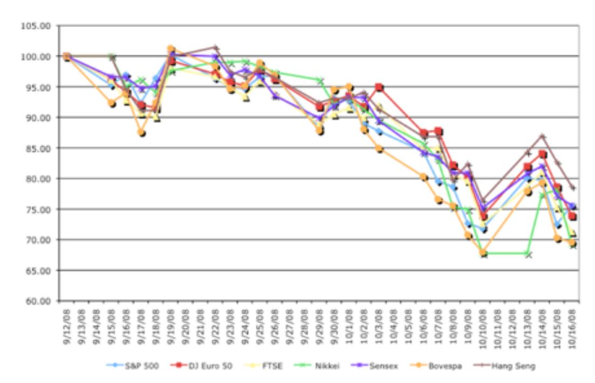

Between September 12, 2008 and October 16, 2008, markets across the globe moved up and down together, with emerging markets showing slightly more volatility.

- 3. The downside correlation increases more than upside correlation: In a twist on the last point, Longin and Solnik (2001) report that it is not high volatility per se that

**22** Ball, C. and W. Torous, 2000, *Stochastic correlation across international stock markets*, Journal of Empirical Finance. v7, 373-388.

increases correlation, but downside volatility. Put differently, the correlation between global equity markets is higher in bear markets than in bull markets.23

- 4. Globalization increases exposure to global political uncertainty, while reducing exposure to domestic political uncertainty: In the most direct test of whether we should be attaching different equity risk premiums to different countries due to systematic risk exposure, Brogaard, Dai, Ngo and Zhang (2014) looked at 36 countries from 1991-2010 and measured the exposure of companies in these countries to global political uncertainty and domestic political uncertainty.24 They find that the costs of capital of companies in integrated markets are more highly influenced by global uncertainty (increasing as uncertainty increases) and those in segmented markets are more highly influenced by domestic uncertainty.25

### *2. A Global Capital Asset Pricing Model*

The other argument against adjusting for country risk comes from theorists and practitioners who believe that the traditional capital asset pricing model can be adapted fairly easily to a global market. In their view, all assets, no matter where they are traded, should face the same global equity risk premium, with differences in risk captured by differences in betas. In effect, they are arguing that if Malaysian stocks are riskier than US stocks, they should have higher betas and expected returns.

While the argument is reasonable, it flounders in practice, partly because betas do not seem capable of carry the weight of measuring country risk.

- 1. If betas are estimated against local indices, as is usually the case, the average beta within each market (Brazil, Malaysia, US or Germany) has to be one. Thus, it would be mathematically impossible for betas to capture country risk.
- 2. If betas are estimated against a global equity index, such as the Morgan Stanley Capital Index (MSCI), there is a possibility that betas could capture country risk but there is little evidence that they do in practice. Since the global equity indices are

23 Longin, F. and B. Solnik, 2001, *Extreme Correlation of International Equity Markets*, Journal of Finance, v56 , pg 649-675.

24 Brogaard, J., L. Dai, P.T.H. Ngo, B. Zhuang, 2014, *The World Price of Political Uncertainty*, SSRN #2488820.

25 The implied costs of capital for companies in the 36 countries were computed and related to global political uncertainty, measured using the US economic policy uncertainty index, and to domestic political uncertainty, measured using domestic national elections.

market weighted, it is the companies that are in developed markets that have higher betas, whereas the companies in small, very risky emerging markets report low betas. Table 15 reports the average beta estimated for the ten largest market cap companies in Brazil, India, the United States and Japan against the MSCI.26

*Table 15: Betas against MSCI – Large Market Cap Companies*

| Country       | Average Beta (against local index) | Average Beta (against MSCI Global) |
|---------------|------------------------------------|------------------------------------|
| India         | 0.97                               | 0.83                               |
| Brazil        | 0.98                               | 0.81                               |
| United States | 0.96                               | 1.05                               |
| Japan         | 0.94                               | 1.03                               |

The emerging market companies consistently have lower betas, when estimated against global equity indices, than developed market companies. Using these betas with a global equity risk premium will lead to lower costs of equity for emerging market companies than developed market companies. While there are creative fixes that practitioners have used to get around this problem, they seem to be based on little more than the desire to end up with higher expected returns for emerging market companies.27

## *3. Country risk is better reflected in the cash flows*

The essence of this argument is that country risk and its consequences are better reflected in the cash flows than in the discount rate. Proponents of this point of view argue that bringing in the likelihood of negative events (political chaos, nationalization and economic meltdowns) into the expected cash flows effectively risk adjusts the cash flows, thus eliminating the need for adjusting the discount rate.

This argument is alluring but it is wrong. The expected cash flows, computed by taking into account the possibility of poor outcomes, is not risk adjusted. In fact, this is exactly how we should be calculating expected cash flows in any discounted cash flow

26 The betas were estimated using two years of weekly returns from January 2006 to December 2007 against the most widely used local index (Sensex in India, Bovespa in Brazil, S&P 500 in the US and the Nikkei in Japan) and the MSCI Global Equity Index.

27 There are some practitioners who multiply the local market betas for individual companies by a beta for that market against the US. Thus, if the beta for an Indian chemical company is 0.9 and the beta for the Indian market against the US is 1.5, the global beta for the Indian company will be 1.35 (0.9\*1.5). The beta for the Indian market is obtained by regressing returns, in US dollars, for the Indian market against returns on a US index (say, the S&P 500).

analysis. Risk adjustment requires us to adjust the expected cash flow further for its risk, i.e. compute certainty equivalent cash flows in capital budgeting terms. To illustrate why, consider a simple example where a company is considering making the same type of investment in two countries. For simplicity, let us assume that the investment is expected to deliver \$ 90, with certainty, in country 1 (a mature market); it is expected to generate \$ 100 with 90% probability in country 2 (an emerging market) but there is a 10% chance that disaster will strike (and the cash flow will be \$0). The expected cash flow is \$90 on both investments, but only a risk neutral investor would be indifferent between the two. A risk averse investor would prefer the investment in the mature market over the emerging market investment, and would demand a premium for investing in the emerging market.

In effect, a full risk adjustment to the cash flows will require us to go through the same process that we have to use to adjust discount rates for risk. We will have to estimate a country risk premium, and use that risk premium to compute certainty equivalent cash flows.28

## *The arguments for a country risk premium*

There are elements in each of the arguments in the previous section that are persuasive but none of them is persuasive enough.

- Investors have become more globally diversified over the last three decades and portions of country risk can therefore be diversified away in their portfolios. However, the significant home bias that remains in investor portfolios exposes investors disproportionately to home country risk, and the increase in correlation across markets has made a portion of country risk into non-diversifiable or market risk.
- As stocks are traded in multiple markets and in many currencies, it is becoming more feasible to estimate meaningful global betas, but it also is still true that these betas cannot carry the burden of capturing country risk in addition to all other macro risk exposures.

28 In the simple example above, this is how it would work. Assume that we compute a country risk premium of 3% for the emerging market to reflect the risk of disaster. The certainty equivalent cash flow on the investment in that country would be \$90/1.03 = \$87.38.

- Finally, there are certain types of country risk that are better embedded in the cash flows than in the risk premium or discount rates. In particular, risks that are discrete and isolated to individual countries should be incorporated into probabilities and expected cash flows; good examples would be risks associated with nationalization or related to acts of God (hurricanes, earthquakes etc.).

After you have diversified away the portion of country risk that you can, estimated a meaningful global beta and incorporated discrete risks into the expected cash flows, you will still be faced with residual country risk that has only one place to go: the equity risk premium.

There is evidence to support the proposition that you should incorporate additional country risk into equity risk premium estimates in riskier markets:

- 1. Historical equity risk premiums: Donadelli and Prosperi (2011) look at historical risk premiums in 32 different countries (13 developed and 19 emerging markets) and conclude that emerging market companies had both higher average returns and more volatility in these returns between 1988 and 2010 (see table 16).

*Table 16: Historical Equity Risk Premiums (Monthly) by Region*

| Region            | Monthly ERP | Standard deviation |
|-------------------|-------------|--------------------|
| Developed Markets | 0.62%       | 4.91%              |
| Asia              | 0.97%       | 7.56%              |
| Latin America     | 2.07%       | 8.18%              |
| Eastern Europe    | 2.40%       | 15.66%             |
| Africa            | 1.41%       | 6.03%              |

While we remain cautious about using historical risk premiums over short time periods (and 22 years is short in terms of stock market history), the evidence is consistent with the argument that country risk should be incorporated into a larger equity risk premium.29

29 Donadelli, M. and L. Prosperi, 2011, *The Equity Risk Premium: Empirical Evidence from Emerging Markets*, Working Paper, http://ssrn.com/abstract=1893378.

- 2. Survey premiums: Fernandez, Linares and Acin (2016) surveyed academics, analysts and companies in 88 countries on equity risk premiums.30 The reported average premiums vary widely across markets and are higher for riskier emerging markets, as can be seen in table 17.

*Table 17: Survey Estimates of Equity Risk Premium: By Region*

| Region            | Number of countries | Average | Median |
|-------------------|---------------------|---------|--------|
| Africa            | 4                   | 10.28%  | 9.75%  |
| Developed Markets | 21                  | 5.47%   | 5.28%  |
| Eastern Europe    | 11                  | 8.32%   | 8.03%  |
| Emerging Asia     | 12                  | 7.93%   | 7.44%  |
| EU Troubled       | 4                   | 8.95%   | 9.13%  |
| Latin America     | 12                  | 9.50%   | 9.74%  |
| Middle East       | 7                   | 7.03%   | 7.03%  |
| Grand Total       | 71                  | 7.63%   | 7.46%  |

Again, while this does not conclusively prove that country risk commands a premium, it does indicate that those who do valuations in emerging market countries seem to act like it does. Ultimately, the question of whether country risk matters and should affect the equity risk premium is an empirical one, not a theoretical one, and for the moment, at least, the evidence seems to suggest that you should incorporate country risk into your discount rates. This could change as we continue to move towards a global economy, with globally diversified investors and a global equity market, but we are not there yet.

#### **Measures of country equity risk**

If country risk is not diversifiable, either because the marginal investor is not globally diversified or because the risk is correlated across markets, you are left with the task of measuring country risk and estimating country risk premiums. How do you estimate country-specific equity risk premiums? In this section, we will look at three choices. The first is to use historical data in each market to estimate an equity risk premium for that market, an approach that we will argue is fraught with statistical and

30 Fernandez, P., A.O. Pizarro and I.F. Acin, 2016, Market Risk Premium used in 71 countries in 2016, A Survey with 6932 Answers, https://papers.ssrn.com/sol3/papers.cfm?abstract\_id=2776636

structural problems in most emerging markets. The second is to start with an equity risk premium for a mature market (such as the United States) and build up to or estimate additional risk premiums for riskier countries. The third is to use the market pricing of equities within each market to back out estimates of an implied equity risk premium for the market.

#### *Historical Risk Premiums*

Most practitioners, when estimating risk premiums in the United States, look at the past. Consequently, we look at what we would have earned as investors by investing in equities as opposed to investing in riskless investments. Data services in the United States have stock return data and risk free rates going back to 1926,31 and there are other less widely used databases that go further back in time to 1871 or even to 1792.32 In table 18a, we summarize the historical equity risk premiums for the United States, against both treasury bills and bonds, for the 1928-2016 time period:

*Table 18a: Historical Equity Risk Premiums (ERP) –US Equities versus Treasuries*

|           | Stocks – Bills | Arithmetic Average Stocks –Bonds | Stocks - Bills | Geometric Average Stocks - Bonds |
|-----------|----------------|----------------------------------|----------------|----------------------------------|
| 1928-2016 | 7.96%          | 6.24%                            | 6.11%          | 4.62%                            |
| 1967-2016 | 6.57%          | 4.37%                            | 5.25%          | 3.42%                            |
| 2007-2016 | 7.90%          | 3.62%                            | 6.15%          | 2.30%                            |

Note the wide divergence in equity risk premiums, depending upon whether you measure them against T.Bills or T.Bonds, the time period used and the averaging approach (with geometric averages representing compounded return). The rationale presented by those who use shorter periods is that the risk aversion of the average investor is likely to change over time, and that using a shorter and more recent time period provides a more updated estimate. This has to be offset against a cost associated with using shorter time periods, which is the greater noise in the risk premium estimate. In fact, given the annual standard

31 Ibbotson Stocks, Bonds, Bills and Inflation Yearbook (SBBI), 2011 Edition, Morningstar.

32 Siegel, in his book, Stocks for the Long Run, estimates the equity risk premium from 1802-1870 to be 2.2% and from 1871 to 1925 to be 2.9%. (Siegel, Jeremy J., Stocks for the Long Run, Second Edition, McGraw Hill, 1998). Goetzmann and Ibbotson estimate the premium from 1792 to 1925 to be 3.76% on an arithmetic average basis and 2.83% on a geometric average basis. Goetzmann. W.N. and R. G. Ibbotson, 2005, History and the Equity Risk Premium, Working Paper, Yale University. Available at http://papers.ssrn.com/sol3/papers.cfm?abstract\_id=702341.

deviation in US stock returns33 between 1926 and 2016 of approximately 20%, the standard error associated with the US equity risk premium estimate can be estimated in table 18b follows for different estimation periods:34

*Table 18b: Standard Errors in Historical Risk Premiums*

| Estimation Period | Standard Error of Risk Premium Estimate |              |
|-------------------|-----------------------------------------|--------------|
| 5 years           | 20%/                                    | √ 5 = 8.94%  |
| 10 years          | 20%/                                    | √ 10 = 6.32% |
| 25 years          | 20% /                                   | √ 25 = 4.00% |
| 50 years          | 20% /                                   | √ 50 = 2.83% |
| 80 years          | 20% /                                   | √ 80 = 2.23% |

Even using all of the entire data (about 90 years) yields a substantial standard error of 2.2%. Note that that the standard errors from ten-year and twenty-year estimates are likely to be almost as large or larger than the actual risk premium estimated. This cost of using shorter time periods seems, in our view, to overwhelm any advantages associated with getting a more updated premium.

With emerging markets, we will almost never have access to as much historical data as we do in the United States. If we combine this with the high volatility in stock returns in these markets, the conclusion is that historical risk premiums can be computed for these markets but they will be useless because of the large standard errors in the estimates. Table 19 summarizes historical arithmetic average equity risk premiums for major non-US markets below for 1976 to 2001, and reports the standard error in each estimate:35

*Table 19: Risk Premiums for non-US Markets: 1976- 2001*

| Country | Weekly average | Weekly standard deviation | Equity Risk Premium | Standard error |
|---------|----------------|---------------------------|---------------------|----------------|
| Canada  | 0.14%          | 5.73%                     | 1.69%               | 3.89%          |
| France  | 0.40%          | 6.59%                     | 4.91%               | 4.48%          |
| Germany | 0.28%          | 6.01%                     | 3.41%               | 4.08%          |

33 For the historical data on stock returns, bond returns and bill returns check under "updated data" in

http://www.damodaran.com. 34 The standard deviation in annual stock returns between 1928 and 2011 is 20.11%; the standard deviation in the risk premium (stock return – bond return) is a little higher at 21.62%. These estimates of the standard error are probably understated, because they are based upon the assumption that annual returns are uncorrelated over time. There is substantial empirical evidence that returns are correlated over time, which would make this standard error estimate much larger. The raw data on returns is provided in Appendix 1.

35 Salomons, R. and H. Grootveld, 2003, *The equity risk premium: Emerging vs Developed Markets,* Emerging Markets Review, v4, 121-144.

| Italy  | 0.32% | 7.64%  | 3.91%  | 5.19%  |
|--------|-------|--------|--------|--------|
| Japan  | 0.32% | 6.69%  | 3.91%  | 4.54%  |
| UK     | 0.36% | 5.78%  | 4.41%  | 3.93%  |
| India  | 0.34% | 8.11%  | 4.16%  | 5.51%  |
| Korea  | 0.51% | 11.24% | 6.29%  | 7.64%  |
| Chile  | 1.19% | 10.23% | 15.25% | 6.95%  |
| Mexico | 0.99% | 12.19% | 12.55% | 8.28%  |
| Brazil | 0.73% | 15.73% | 9.12%  | 10.69% |

Before we attempt to come up with rationale for why the equity risk premiums vary across countries, it is worth noting the magnitude of the standard errors on the estimates, largely because the estimation period includes only 25 years. Based on these standard errors, we cannot even reject the hypothesis that the equity risk premium in each of these countries is zero, let alone attach a value to that premium.

In the most comprehensive attempt of risk premiums for global markets, Dimson, Marsh and Staunton (2002, 2008) estimated equity returns for 17 markets and obtained both local and a global equity risk premium.36 In their most recent update in 2016, they provide the risk premiums from 1900 to 2016 for 20 markets, with standard errors on each estimate (reported in table 20):37

*Table 20: Historical Risk Premiums across Equity Markets – 1900 – 2016 (in %)*

| Country   | Geometric Mean | Arithmetic Mean | Standard Error | Standard Deviation | Geometric Mean | Arithmetic Mean | Standard Error | Standard Deviation |
|-----------|----------------|-----------------|----------------|--------------------|----------------|-----------------|----------------|--------------------|
| Australia | 6.0%           | 7.4%            | 1.5%           | 16.4%              | 5.0%           | 6.6%            | 1.7%           | 18.1%              |
| Austria   | 5.6%           | 10.4%           | 3.5%           | 37.1%              | 2.7%           | 21.4%           | 14.2%          | 152.2%             |
| Belgium   | 3.0%           | 5.4%            | 2.2%           | 23.6%              | 2.2%           | 4.3%            | 1.9%           | 20.9%              |
| Canada    | 4.2%           | 5.6%            | 1.6%           | 16.9%              | 3.4%           | 5.0%            | 1.7%           | 18.2%              |
| Denmark   | 3.3%           | 5.2%            | 1.9%           | 20.6%              | 2.1%           | 3.7%            | 1.7%           | 18.0%              |
| Finland   | 5.9%           | 9.4%            | 2.7%           | 29.6%              | 5.2%           | 8.7%            | 2.8%           | 29.9%              |
| France    | 6.2%           | 8.7%            | 2.2%           | 24.0%              | 3.0%           | 5.3%            | 2.1%           | 22.6%              |
| Germany   | 6.1%           | 9.9%            | 2.9%           | 31.2%              | 5.0%           | 8.4%            | 2.6%           | 28.3%              |
| Ireland   | 3.6%           | 5.9%            | 2.0%           | 21.3%              | 2.7%           | 4.7%            | 1.8%           | 19.8%              |

36 Dimson, E.,, P Marsh and M Staunton, 2002, *Triumph of the Optimists: 101 Years of Global Investment Returns,* Princeton University Press, NJ; Dimson, E.,, P Marsh and M Staunton, 2008, The Worldwide Equity Risk Premium: a smaller puzzle, Chapter 11 in the Handbook of the Equity Risk Premium, edited by R. Mehra, Elsevier.

37 *Credit Suisse Global Investment Returns Sourcebook,* 2017, Credit Suisse/ London Business School. Summary data is accessible at the Credit Suisse website.

| Italy           | 5.7% | 9.5% | 2.9% | 31.3% | 3.1% | 6.4% | 2.7% | 29.2% |
|-----------------|------|------|------|-------|------|------|------|-------|
| Japan           | 6.2% | 9.3% | 2.6% | 27.5% | 5.1% | 9.1% | 3.0% | 32.4% |
| Netherlands New | 4.5% | 6.6% | 2.1% | 22.3% | 3.2% | 5.5% | 2.0% | 22.1% |
| Zealand         | 4.4% | 6.0% | 1.7% | 18.0% | 4.0% | 5.5% | 1.6% | 17.7% |
| Norway          | 3.2% | 5.9% | 2.4% | 25.9% | 2.4% | 5.3% | 2.5% | 27.5% |
| Portugal South  | 4.6% | 9.2% | 3.1% | 33.6% | 2.7% | 7.5% | 3.1% | 33.0% |
| Africa          | 6.2% | 8.2% | 2.0% | 21.6% | 5.3% | 7.0% | 1.8% | 19.5% |
| Spain           | 3.3% | 5.4% | 2.0% | 21.5% | 1.7% | 3.7% | 1.9% | 20.5% |
| Sweden          | 4.0% | 6.0% | 1.9% | 20.3% | 3.1% | 5.3% | 2.0% | 21.3% |
| Switzerland     | 3.6% | 5.3% | 1.7% | 18.6% | 2.0% | 3.5% | 1.6% | 17.4% |
| U.K.            | 4.4% | 6.1% | 1.8% | 19.5% | 3.6% | 4.9% | 1.6% | 17.1% |
| U.S.            | 5.5% | 7.4% | 1.8% | 19.6% | 4.3% | 6.4% | 1.9% | 20.8% |
| Europe World-ex | 3.3% | 5.1% | 1.7% | 19.1% | 3.1% | 4.4% | 1.5% | 16.0% |
| U.S.            | 3.5% | 5.1% | 1.7% | 18.4% | 2.8% | 3.8% | 1.3% | 14.5% |
| World           | 4.2% | 5.6% | 1.6% | 16.9% | 3.2% | 4.4% | 1.4% | 15.5% |

*Source: Credit Suisse Global Investment Returns Sourcebook, 2017*

In making comparisons of the numbers in table 20 to prior years, note that this database was modified in two ways: the world estimates are now weighted by market capitalization and the issue of survivorship bias has been dealt with frontally by incorporating the return histories of three markets (Austria, China and Russia) where equity investors would have lost their entire investment during the century. Note that the risk premiums, averaged across the markets, are lower than risk premiums in the United States. For instance, the geometric average risk premium for stocks over long-term government bonds, across the non-US markets, is 2.8%, lower than the 4.3% for the US markets. The results are similar for the arithmetic average premium, with the average premium of 3.8% across non-US markets being lower than the 6.4% for the United States. In effect, the difference in returns captures the survivorship bias, implying that using historical risk premiums based only on US data will results in numbers that are too high for the future. Note that the "noise" problem persists, even with averaging across 20 markets and over 115 years. The standard error in the global equity risk premium estimate is 1.4%, suggesting that the range for the historical premium remains a large one.

### *Mature Market Plus*

In this section, we will consider three approaches that can be used to estimate country risk premiums, all of which build off the historical risk premiums estimated in the last section. To approach this estimation question, let us start with the basic proposition that the risk premium in any equity market can be written as:

Equity Risk Premium = Base Premium for Mature Equity Market + Country Risk Premium

The country premium could reflect the extra risk in a specific market. This boils down our estimation to estimating two numbers – an equity risk premium for a mature equity market and the additional risk premium, if any, for country risk.

## *Mature Market Premium*

To estimate a mature market equity risk premium, we can look at one of two numbers. The first is the historical risk premium for the United States, which we estimated to be 4.62% in January 2017, the geometric average premium for stocks over treasury bonds from 1928 to 2016. 38 If we do this, we are arguing that the US equity market is a mature market, and that there is sufficient historical data in the United States to make a reasonable estimate of the risk premium. The other is the average historical risk premium across 20 equity markets, approximately 3.20%, that was estimated by Dimson et al (see earlier reference), as a counter to the survivor bias that they saw in using the US risk premium. Consistency would then require us to use this as the equity risk premium, in every other equity market that we deem mature; the equity risk premium in July 2017 would be 3.20% in Germany, France and the UK, for instance. For markets that are not mature, however, we need to measure country risk and convert the measure into a country risk premium, which will augment the mature market premium.

# *Estimating Country Risk Premium for Equities*

How do we link a country risk measure to a country risk premium? In this section, we will look at three approaches. The first uses default spreads, based upon country bonds or ratings, whereas the latter two use equity market volatility as an input in estimating country risk premiums.

38 See the historical data tables under updated data at Damodaran.com.

#### *1. Default Spreads*

The simplest and most widely used proxy for the country risk premium is the default spread that investors charge for buying bonds issued by the country. This default spread can be estimated in one of three ways.

a. Current Default Spread on Sovereign Bond or CDS market: As we noted in the last section, the default spread comes from either looking at the yields on bonds issued by the country in a currency where there is a default free bond yield to which it can be compared or spreads in the CDS market.39 With the 10-year US dollar denominated Brazilian bond that we cited as an example in the last section, the default spread would have amounted to 2.54% in July 2016: the difference between the interest rate on the Brazilian bond and a treasury bond of the same maturity. The netted (against the US) CDS market spread on the same day for the default spread was 3.12%. Bekaert, Harvey, Lundblad and Siegel (2014) break down the sovereign bond default spread into four components, including global economic conditions, country-specific economic factors, sovereign bond liquidity and political risk, and find that it is the political risk component that best explain money flows into and out of the country equity markets.40

b. Average (Normalized) spread on bond: While we can make the argument that the default spread in the dollar denominated is a reasonable measure of the default risk in Brazil, it is also a volatile measure. In figure 13, we have graphed the yields on the dollar denominated ten-year Brazilian Bond and the U.S. ten-year treasury bond and highlighted the default spread (as the difference between the two yields) from January 2000 to July 2017. In the same figure, we also show the 10-year CDS spreads from 2005 to 2017, 41 the spreads have also changed over time but move with the bond default spreads.

39 You cannot compare interest rates across bonds in different currencies. The interest rate on a peso bond cannot be compared to the interest rate on a dollar denominated bond.

40 Bekaert, G., C.R. Harvey, C.T. Lundblad and S. Siegel, 2014, *Political Risk Spreads*, Journal of International Business Studies, v45, 471-493.

41 Data for the sovereign CDS market is available only from the last part of 2004.

Note that the bond default spread widened dramatically during 2002, mostly as a result of uncertainty in neighboring Argentina and concerns about the Brazilian presidential elections.42 After the elections, the spreads decreased just as quickly and continued on a downward trend through the middle of last year. Since 2004, they have stabilized, with a downward trend; they spiked during the market crisis in the last quarter of 2008 but have settled back into pre-crisis levels. Given this volatility, a reasonable argument can be made that we should consider the average spread over a period of time rather than the default spread at the moment. If we accept this argument, the normalized default spread, using the average spreads between 2008 and 2017 would be 2.20% (bond default spread) or 2.52% (CDS spread). Using this approach makes sense only if the economic fundamentals of the country have not changed significantly (for the better or worse) during the period but will yield misleading values, if there have been structural shifts in the economy. In 2008, for instance, it would have made sense to use averages over time

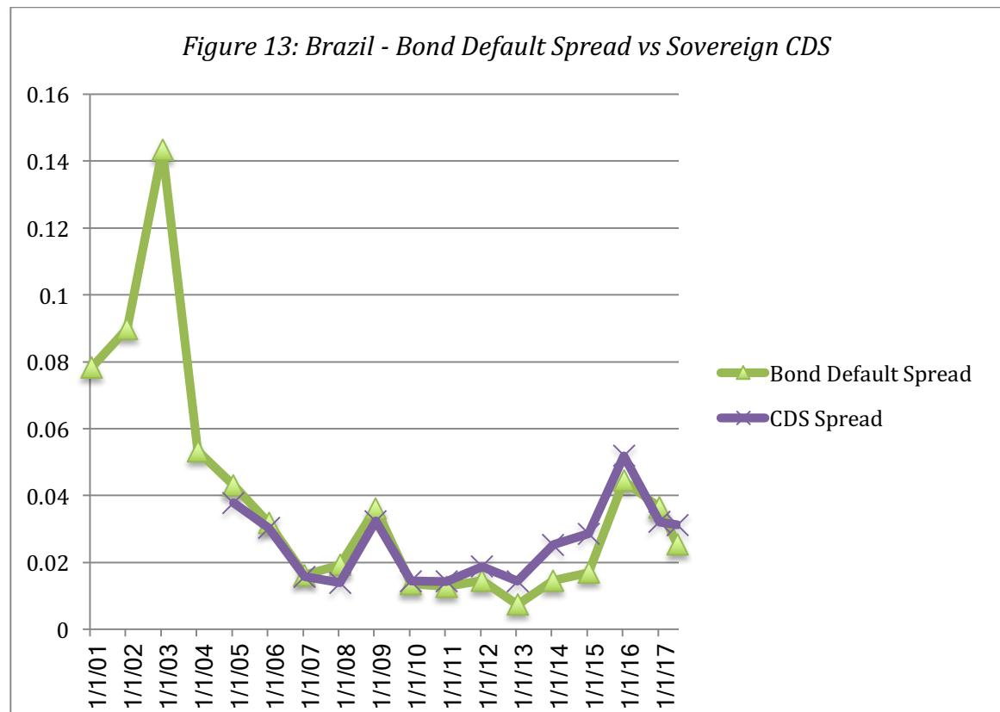

42 The polls throughout 2002 suggested that Lula Da Silva who was perceived by the market to be a leftist would beat the establishment candidate. Concerns about how he would govern roiled markets and any poll that showed him gaining would be followed by an increase in the default spread.

for a country like Nigeria, where oil price movements created volatility in spreads over time, but not for countries like China and India, which saw their economies expand and mature dramatically over the period or Venezuela, where government capriciousness made operating private businesses a hazardous activity (with a concurrent tripling in default spreads). In fact, the last year has seen a spike in the Brazilian default spread, partly the result of another election and partly because of worries about political corruption in large Brazilian companies.

c. Imputed or Synthetic Spread: The two approaches outlined above for estimating the default spread can be used only if the country being analyzed has bonds denominated in US dollars, Euros or another currency that has a default free rate that is easily accessible. Most emerging market countries, though, do not have government bonds denominated in another currency and some do not have a sovereign rating. For the first group (that have sovereign rating but no foreign currency government bonds), there are two solutions. If we assume that countries with the similar default risk should have the same sovereign rating, we can use the typical default spread for other countries that have the same rating as the country we are analyzing and dollar denominated or Euro denominated bonds outstanding. Thus, Zambia, with a B3 rating, would be assigned the same default spread as Argentina, which also has B3 rating, and dollar denominated bonds and CDS prices from which we can extract default spreads. For the second group, we are on even more tenuous grounds. Assuming that there is a country risk score from the Economist or PRS for the country, we could look for other countries that are rated and have similar scores and assign the default spreads that these countries face. For instance, we could assume that Ethiopia and Malawi, which fall within the same score grouping from PRS, have similar country risk; this would lead us to attach Ethiopia's rating of B1 to Malawi (which is not rated) and to use the same default spread (based on this rating) for both countries.

In table 21, we have estimated the typical default spreads for bonds in different sovereign ratings classes in July 2017. One problem that we had in obtaining the numbers for this table is that relatively few emerging markets have dollar or Euro denominated bonds outstanding. Consequently, there were some ratings classes where there was only one country with data and several ratings classes where there were none. To mitigate this problem, we used spreads from the CDS market, referenced in the earlier section. We were able to get default spreads for 68 countries, categorized by rating class, and we averaged the spreads across multiple countries in the same ratings class. An alternative approach to estimating default spread is to assume that sovereign ratings are comparable to corporate ratings, i.e., a Ba1 rated country bond and a Ba1 rated corporate bond have equal default risk. In this case, we can use the default spreads on corporate bonds for different ratings classes. The table compares the spreads in July 2017 in the corporate and sovereign bond markets.

*Table 21: Default Spreads by Ratings Class – Sovereign vs. Corporate in July 2016*

| Rating     | Sovereign Bonds | Corporate Bonds |
|------------|-----------------|-----------------|
| Aaa/AAA    | 0.00%           | 0.75%           |
| Aa1/AA+    | 0.42%           | 0.90%           |
| Aa2/AA     | 0.52%           | 1.00%           |
| Aa3/AA-    | 0.64%           | 1.05%           |
| A1/A+      | 0.74%           | 1.10%           |
| A2/A       | 0.89%           | 1.25%           |
| A3/A-      | 1.26%           | 1.75%           |
| Baa1/BBB+  | 1.68%           | 2.00%           |
| Baa2/BBB   | 2.01%           | 2.25%           |
| Baa3/BBB-  | 2.32%           | 2.75%           |
| Ba1/BB+    | 2.63%           | 3.25%           |
| Ba2/BB     | 3.17%           | 4.25%           |
| Ba3/BB-    | 3.79%           | 4.50%           |
| B1/B+      | 4.74%           | 5.50%           |
| B2/B       | 5.80%           | 6.00%           |
| B3/B-      | 6.85%           | 7.50%           |
| Caa1/ CCC+ | 7.90%           | 8.25%           |
| Caa2/CCC   | 9.49%           | 9.00%           |
| Caa3/ CCC- | 10.53%          | 10.00%          |
| Ca/CC      | 12.64%          | 12.00%          |

sovereign spreads for the higher ratings classes, converge for the intermediate ratings and widen again at the lowest ratings. Using this approach to estimate default spreads for Brazil, with its rating of Ba2 would result in a spread of 3.17% (4.25%), if we use sovereign spreads (corporate spreads).

Figure 14 depicts the alternative approaches to estimating default spreads for four countries, Brazil, China, India and Russia, in July 2017:

*Figure 14: Approaches for estimating Sovereign Default Spreads*

With some countries, without US-dollar (or Euro) denominated sovereign bonds or CDS spreads, you don't have a choice since the only estimate of the default spread comes from the sovereign rating. With other countries, such as Brazil, you have multiple estimates of the default spreads: 2.54% from the dollar denominated bond, 3.46% from the CDS spread, 3.12% from the netted CDS spread and 3.17% from the sovereign rating look up table (table 21). You could choose one of these approaches and stay consistent over time or average across them.

Analysts who use default spreads as measures of country risk typically add them on to both the cost of equity and debt of every company traded in that country. Thus, the cost of equity for an Indian company, estimated in U.S. dollars, will be 2.32% higher than

| Estimating a default spread for a country or sovereign entity Market Based estimates Sovereign Bond spread CDS Market 1. Find a bond issued by the rating in the lookup table below: 1. Find a 10-year CDS for country, denominated in US\$ or the country (if one exists) Rating Euros. 2. Net out US CDS Aaa/AAA 2. Compute the default spread by 2. This is your default Aa1/AA+ comparing to US treasury bond spread. Aa2/AA (if US \$) or German Euro bond (if Aa3/AA- Euros). A1/A+ A2/A Country Sovereign	Bond	Yield Currency Risk	free	Rate Default	Spread CDS	Spread A3/A- | Rating/Risk score based estimates Step 1: Find a sovereign rating (local currency) for the country (on Moody's or S&P) Step 2: Look up the default spread for that Sovereign Bonds 0.00% 0.42% 0.52% 0.64% 0.74% 0.89% 1.26% |
|-------------------------------------------------------------------------------------------------------------------------------------------------------------------------------------------------------------------------------------------------------------------------------------------------------------------------------------------------------------------------------------------------------------------------------------------------------------------------------------------------------------------------------------------------------------------------------------|------------------------------------------------------------------------------------------------------------------------------------------------------------------------------------------------------------------------------|
| Baa1/BBB+                                                                                                                                                                                                                                                                                                                                                                                                                                                                                                                                                                           | 1.68%                                                                                                                                                                                                                        |
| Baa2/BBB                                                                                                                                                                                                                                                                                                                                                                                                                                                                                                                                                                            | 2.01%                                                                                                                                                                                                                        |
| Baa3/BBB-                                                                                                                                                                                                                                                                                                                                                                                                                                                                                                                                                                           | 2.32%                                                                                                                                                                                                                        |
| Ba1/BB+                                                                                                                                                                                                                                                                                                                                                                                                                                                                                                                                                                             | 2.63%                                                                                                                                                                                                                        |
| Ba2/BB                                                                                                                                                                                                                                                                                                                                                                                                                                                                                                                                                                              | 3.17%                                                                                                                                                                                                                        |
| Ba3/BB-                                                                                                                                                                                                                                                                                                                                                                                                                                                                                                                                                                             | 3.79%                                                                                                                                                                                                                        |
| B1/B+                                                                                                                                                                                                                                                                                                                                                                                                                                                                                                                                                                               | 4.74%                                                                                                                                                                                                                        |
| B2/B                                                                                                                                                                                                                                                                                                                                                                                                                                                                                                                                                                                | 5.80%                                                                                                                                                                                                                        |
| B3/B-                                                                                                                                                                                                                                                                                                                                                                                                                                                                                                                                                                               | 6.85%                                                                                                                                                                                                                        |
| Caa1/ CCC+                                                                                                                                                                                                                                                                                                                                                                                                                                                                                                                                                                          | 7.90%                                                                                                                                                                                                                        |
| Caa2/CCC                                                                                                                                                                                                                                                                                                                                                                                                                                                                                                                                                                            | 9.49%                                                                                                                                                                                                                        |
| Caa3/ CCC-                                                                                                                                                                                                                                                                                                                                                                                                                                                                                                                                                                          | 10.53%                                                                                                                                                                                                                       |
| Ca/CC                                                                                                                                                                                                                                                                                                                                                                                                                                                                                                                                                                               | 12.64%                                                                                                                                                                                                                       |
| Country Rating                                                                                                                                                                                                                                                                                                                                                                                                                                                                                                                                                                      | Default	Spread	(Lookup)                                                                                                                                                                                                      |
| Brazil Ba2                                                                                                                                                                                                                                                                                                                                                                                                                                                                                                                                                                          | 3.17%                                                                                                                                                                                                                        |
| Russia Ba1                                                                                                                                                                                                                                                                                                                                                                                                                                                                                                                                                                          | 2.63%                                                                                                                                                                                                                        |
| India Baa3                                                                                                                                                                                                                                                                                                                                                                                                                                                                                                                                                                          | 2.32%                                                                                                                                                                                                                        |
| China A1                                                                                                                                                                                                                                                                                                                                                                                                                                                                                                                                                                            | 0.74%                                                                                                                                                                                                                        |
| Brazil 4.90% US\$ 2.36% 2.54% 3.46%                                                                                                                                                                                                                                                                                                                                                                                                                                                                                                                                                 |                                                                                                                                                                                                                              |
| Russia 4.27% US\$ 2.36% 2.54% 2.52%                                                                                                                                                                                                                                                                                                                                                                                                                                                                                                                                                 |                                                                                                                                                                                                                              |
| India NA NA NA NA 2.42%                                                                                                                                                                                                                                                                                                                                                                                                                                                                                                                                                             |                                                                                                                                                                                                                              |
| China NA NA NA NA 1.15%                                                                                                                                                                                                                                                                                                                                                                                                                                                                                                                                                             |                                                                                                                                                                                                                              |

the cost of equity of an otherwise similar U.S. company, using the July 2017 measure of the default spread, based upon the rating. In some cases, analysts add the default spread to the U.S. risk premium and multiply it by the beta. This increases the cost of equity for high beta companies and lowers them for low beta firms.43

While many analysts use default spreads as proxies for country risk, the evidence for its use is still thin. Abuaf (2011) examines ADRs from ten emerging markets and relates the returns on these ADRs to returns on the S&P 500 (which yields a conventional beta) and to the CDS spreads for the countries of incorporation. He finds that ADR returns as well as multiples (such as PE ratios) are correlated with movement in the CDS spreads over time and argues for the addition of the CDS spread (or some multiple of it) to the costs of equity and capital to incorporate country risk.44

# *2. Relative Equity Market Standard Deviations*

There are some analysts who believe that the equity risk premiums of markets should reflect the differences in equity risk, as measured by the volatilities of these markets. A conventional measure of equity risk is the standard deviation in stock prices; higher standard deviations are generally associated with more risk. If you scale the standard deviation of one market against another, you obtain a measure of relative risk. For instance, the relative standard deviation for country X (against the US) would be computed as follows:

If we assume a linear relationship between equity risk premiums and equity market standard deviations, and we assume that the risk premium for the US can be computed (using historical data, for instance) the equity risk premium for country X follows:

$$\text{Relative Standard Deviation}_{\text{Country } X} = \frac{\text{Standard Deviation}_{\text{Country } X}}{\text{Standard Deviation}_{\text{US}}}$$

Equity risk premiumCountry X = Risk PremumUS \*Relative Standard DeviationCountry X

43 In a companion paper, I argue for a separate measure of company exposure to country risk called lambda that is scaled around one (just like beta) that is multiplied by the country risk premium to estimate the cost of equity. See Damodaran, A., 2007, Measuring Company Risk Exposure to Country Risk, Working Paper, http://papers.ssrn.com/sol3/papers.cfm?abstract\_id=889388.

44 Abuaf, N., 2011, *Valuing Emerging Market Equities – The Empirical Evidence*, Journal of Applied Finance, v21, 123-138.

Assume, for the moment, that you are using an equity risk premium for the United States of 5.13%.45 The annualized standard deviation in the S&P 500 in two years from July 1, 2016 to June 30, 2017, using weekly returns, was 8.38%, whereas the standard deviation in the Bovespa (the Brazilian equity index) over the same period was 22.12%. 46 Using these values, the estimate of a total risk premium for Brazil would be as follows.

Equity Risk Premium\_Brazil = 5.13% \* 
$$\frac{22.12\%}{8.38\%} = 13.54\%$$

The country risk premium for Brazil can be isolated as follows:

Country Risk Premium/01234 = 13.54% − 5.13% = 8.41%

Table 22 lists country volatility numbers for some of the Latin American markets and the resulting total and country risk premiums for these markets, based on the assumption that the equity risk premium for the United States is 5.13%.

*Table 22: Equity Market Volatilities and Risk Premiums (Weekly returns: July 1, 2016- June 30, 2017): Latin American Countries*

| Country   | Standard deviation in Equities (weekly) | Relative Volatility (to US) | Total Equity Risk Premium | Country risk premium |
|-----------|-----------------------------------------|-----------------------------|---------------------------|----------------------|
| Argentina | 22.88%                                  | 2.73                        | 14.01%                    | 10.60%               |
| Brazil    | 22.12%                                  | 2.64                        | 13.54%                    | 6.25%                |
| Chile     | 9.64%                                   | 1.15                        | 5.90%                     | -0.39%               |
| Colombia  | 9.85%                                   | 1.18                        | 6.03%                     | 1.77%                |
| Mexico    | 12.75%                                  | 1.52                        | 7.81%                     | 0.24%                |
| Panama    | 4.62%                                   | 0.55                        | 2.83%                     | -3.99%               |
| Peru      | 11.40%                                  | 1.36                        | 6.98%                     | 1.05%                |
| US        | 8.38%                                   | 1.00                        | 5.13%                     | 0.00%                |
| Venezuela | 48.83%                                  | 5.83                        | 29.89%                    | 20.06%               |

While this approach has intuitive appeal, there are problems with using standard deviations computed in markets with widely different market structures and liquidity. Since equity market volatility is affected by liquidity, with more liquid markets often

45 This is an implied equity risk premium for the S&P 500 that is computed at the start of each month on my website (Damodaran.com). The premium used (5.13%) is as of July 1, 2017.

46 If the dependence on historical volatility is troubling, the options market can be used to get implied volatilities for both the US market and for the Bovespa.

showing higher volatility, this approach will understate premiums for illiquid markets and overstate the premiums for liquid markets. For instance, the standard deviation for Panama is lower than the standard deviation in the S&P 500, leading to equity risk premiums that is lower than the premium for the US. The second problem is related to currencies since the standard deviations are usually measured in local currency terms; the standard deviation in the U.S. market is a dollar standard deviation, whereas the standard deviation in the Brazilian market is based on nominal Brazilian Real returns. This is a relatively simple problem to fix, though, since the standard deviations can be measured in the same currency – you could estimate the standard deviation in dollar returns for the Brazilian market.

# *3. Default Spreads + Relative Standard Deviations*

In the first approach to computing equity risk premiums, we assumed that the default spreads (actual or implied) for the country were good measures of the additional risk we face when investing in equity in that country. In the second approach, we argued that the information in equity market volatility can be used to compute the country risk premium. In the third approach, we will meld the first two, and try to use the information in both the country default spread and the equity market volatility.

The country default spreads provide an important first step in measuring country equity risk, but still only measure the premium for default risk. Intuitively, we would expect the country equity risk premium to be larger than the country default risk spread. To address the issue of how much higher, we look at the volatility of the equity market in a country relative to the volatility of the bond market used to estimate the spread. This yields the following estimate for the country equity risk premium.

To illustrate, consider again the case of Brazil. As noted earlier, the default spread for Brazil in July 2017, based upon its sovereign rating, was 3.17%. We computed annualized standard deviations, using two years of weekly returns, in both the equity market and the government bond, in July 2017. The annualized standard deviation in the Brazilian dollar denominated ten-year bond was 13.48%, well below the standard

$$\text{Country Risk Premium} = \text{Country Default Spread} * \left( \frac{\sigma_{\text{Equity}}}{\sigma_{\text{Country Bond}}} \right)$$

deviation in the Brazilian equity index of 22.12%. The resulting country equity risk premium for Brazil is as follows:

Brazil Country Risk Premium = 3.17% \* 
$$\frac{22.12\%}{13.48\%} = 5.20\%$$

Unlike the equity standard deviation approach, this premium is in addition to a mature market equity risk premium. Thus, assuming a 5.13% mature market premium, we would compute a total equity risk premium for Brazil of 10.33%:

Brazil's Total Equity Risk Premium = 5.13% + 5.20% = 10.33%

Note that this country risk premium will increase if the country rating drops or if the relative volatility of the equity market increases.

Why should equity risk premiums have any relationship to country bond spreads? A simple explanation is that an investor who can make 3.17% risk premium on a dollardenominated Brazilian government bond would not settle for an additional risk premium of 3.17% (in dollar terms) on Brazilian equity. Playing devil's advocate, however, a critic could argue that the interest rate on a country bond, from which default spreads are extracted, is not really an expected return since it is based upon the promised cash flows (coupon and principal) on the bond rather than the expected cash flows. In fact, if we wanted to estimate a risk premium for bonds, we would need to estimate the expected return based upon expected cash flows, allowing for the default risk. This would result in a lower default spread and equity risk premium. Both this approach and the last one use the standard deviation in equity of a market to make a judgment about country risk premium, but they measure it relative to different bases. This approach uses the country bond as a base, whereas the previous one uses the standard deviation in the U.S. market. This approach assumes that investors are more likely to choose between Brazilian bonds and Brazilian equity, whereas the previous approach assumes that the choice is across equity markets.

There are three potential measurement problems with using this approach. The first is that the relative standard deviation of equity is a volatile number, both across countries and across time. The second is that computing the relative volatility requires us to estimate volatility in the government bond, which, in turn, presupposes that long-term government bonds not only exist but are also traded.47 The third is that even if an emerging market meet the conditions of having a government bond that is traded, the trading is often so light that the standard deviation is too low (and the relative volatility value is too high). To illustrate the volatility in this number, note the range of values in the estimates of relative volatility at the start of 2017, in table 23:

*Table 23: Relative Equity Market Volatility – Government Bonds and CDS*

|                               | s Equity / s Bond | s Equity / s CDS |
|-------------------------------|-------------------|------------------|
| Number of countries with data | 40                | 46               |
| Average                       | 2.05              | 1.02             |
| Median                        | 2.09              | 0.72             |
| Maximum                       | 3.70              | 4.69             |
| Minimum                       | 0.33              | 0.06             |

Note that there were only 40 markets, where volatility estimates on government bonds were available, and even in those markets, the relative volatility measure ranged from a high of 3.70 to a low of 0.33. There is some promise in the sovereign CDS market, both because you have more countries where you have traded CDS, but also because it is a more volatile market. In fact, the relative volatility measure there has a median value less than one, but the range in relative equity volatility values is even higher.

The problems associated with computing country-specific government bond or sovereign CDS volatility are increasingly overwhelming its intuitive appeal and it is worth looking at two alternatives. 48 One is to revert back to the first approach of using the default spreads as country risk premiums. The other is to compare the standard deviation of an emerging market equity index and that of an emerging market government bond index and to use this use this ratio as the scaling variable for all emerging market default spreads. While there will be some loss of information at the country level, the use of indices should allow for aggregation across multiple countries and perhaps give a more

47 One indication that the government bond is not heavily traded is an abnormally low standard deviation on the bond yield.

48 Thanks are due to the Value Analysis team at Temasek, whose detailed and focused work on the imprecision of government bond volatility finally led to this break.

reliable and stable measure of relative risk in equity markets. To this end, we computed the standard deviations, with five years of daily data, in the S&P BMI Emerging Market Index (for equity) and the Bank of America Merrill Lynch Emerging Market Public Sector Bond Index (for sovereign debt) as of July 1, 2017, and computed a relative equity market volatility of 1.15:

$$\text{Relative Equity Volatility}_{\text{EM}} = \frac{\text{Standard Deviation of S\&P BMI Emerging Markets}}{\text{Standard Deviation of BAML Emerging Market Public Bonds}} \\ = 13.50\% / 11.77\% = 1.15$$

Applying this multiple to each country's default spread, you can estimate a country risk premium for that country, which when added on to the base premium for a mature market should yield an equity risk premium for that country. In fact, with this multiple applied to Brazil's default spread of 3.17% in July 2017, you would have obtained a country risk premium of 3.64% for Brazil and a total equity risk premium of 8.77% (using 5.13% as the estimate for a mature market premium).

Country Risk Premium for Brazil = 3.17% \*1.15 = 3.64%

Equity Risk Premium for Brazil = 5.13% + 3.64% = 8.77%

# *Choosing between the approaches*

It is ironic that as investors and companies go global, our approaches for dealing with country risk remain unpolished. Each of the approaches described in this section come with perils and can yield very different values. Table 24 summarizes the estimates of country risk and total equity risk premiums, using the three approaches, with subvariants, for Brazil in July 2017:

*Table 24: Country and Total Equity Risk Premium: Brazil in July 2017*

| Approach                                                     | ERP    | CRP   |
|--------------------------------------------------------------|--------|-------|
| Rating-based Default Spread                                  | 8.30%  | 3.17% |
| \$-Bond based Default Spread                                 | 7.67%  | 2.54% |
| CDS-based Default Spread                                     | 8.25%  | 3.12% |
| Relative Equity Market Volatility                            | 13.54% | 8.41% |
| Default Spread, scaled for equity risk with Brazil Govt Bond | 10.33% | 5.20% |
| Default Spread, scaled for equity risk with EM multiple      | 8.77%  | 3.64% |

The relative equity volatility approach yields the highest premium while the pure default spread approaches generate the lowest values. For the moment, we will be using the last estimate of 8.77%, with the default spread scaled to an emerging market multiple of 1.15. With all the approaches, just as companies mature and become less risky over time, countries can mature and become less risky as well and it is reasonable to assume that country risk premiums decrease over time, especially for risky and rapidly evolving markets. One way to adjust country risk premiums over time is to begin with the premium that emerges from the melded approach and to adjust this premium down towards either the country bond default spread or even a regional average. Thus, the equity risk premium will converge to the country bond default spread as we look at longer term expected returns. As an illustration, the country risk premium for Brazil would be 5.20% for the next year but decline over time to 3.17% (country default spread) or perhaps even lower, depending upon your assessment of how Brazil's economy will evolve over time.

Appendix 7 provides a listing of the equity risk premiums globally, built upon the premise that the implied equity risk premium of 5.13% for the S&P 500 on July 1, 2017, is a good measure of the premium of a mature market and that the additional country risk premium is best estimated using the melded approach, where the default spread for each country (based on its rating) is multiplied by a scaling factor (of 1.15) to adjust for the higher risk of equities. For the bulk of the countries, which have either an S&P or Moody's rating, we use the rating to estimate a default spread (from the look up table in Table 21). For the countries where we do not have a sovereign rating but have a PRS score, we use the country default spreads and risk premiums of other countries with similar PRS scores as an estimate of risk premiums.

# *Market-based Equity Risk Premiums*

The perils of starting with a mature market premium and augmenting it with a country risk premium is that it is built on two estimates, one reflecting history (the mature market premium) and the other based on judgment (default spreads and volatilities). It is entirely possible that equity investors in individual markets build in expected equity risk premiums that are very different from your estimates. In this section, we look at ways in which we can use stock prices to back into equity risk premiums for markets.

## *Implied Equity Risk Premium*

There is an alternative to estimating risk premiums that does not require historical data or corrections for country risk, but does assume that the market, overall, is correctly priced. Consider, for instance, a very simple valuation model for stocks:

Value = 
$$\frac{\text{Expected Dividends Next Period}}{(\text{Required Return on Equity} - \text{Expected Growth Rate})}$$

This is essentially the present value of dividends growing at a constant rate. Three of the four inputs in this model can be obtained externally - the current level of the market (value), the expected dividends next period and the expected growth rate in earnings and dividends in the long term. The only "unknown" is then the required return on equity; when we solve for it, we get an implied expected return on stocks. Subtracting out the riskfree rate will yield an implied equity risk premium. We can extend the model to allow for dividends to grow at high rates at least for short periods. The model has two limitations: (a) it assumes that companies pay out their residual cash flows in dividends, when the reality is that many companies either use other forms of returning cash (stock buybacks, in the US) or hold on to the cash and (b) its presumption that companies collectively are in stable growth. Both assumptions, though, can be relaxed, with alternate measures of cash flow (dividends plus buybacks or free cash flow to equity) replacing dividends and two-stage models, where you can assume higher growth for an initial period before stable growth sets in. In a companion paper on equity risk premiums, I use this approach to compute the implied equity risk premium for the S&P 500 every year from 1960 to 2016.

# *Emerging Markets*

The advantage of the implied premium approach is that it is market-driven and current, and does not require any historical data. Thus, it can be used to estimate implied equity premiums in any market, no matter how short its history, It is, however, bounded by whether the model used for the valuation is the right one and the availability and reliability of the inputs to that model. Earlier in this paper, we estimated country risk premiums for Brazil, using default spreads and equity market volatile. To provide a contrast, we estimated the implied equity risk premium for the Brazilian equity market in September 2009, from the following inputs.

- The index (Bovespa) was trading at 61,172 on September 30, 2009, and the dividend yield on the index over the previous 12 months was approximately 2.2%. While stock buybacks represented negligible cash flows, we did compute the FCFE for companies in the index, and the aggregate FCFE yield across the companies was 4.95%.
- Earnings in companies in the index are expected to grow 6% (in US dollar terms) over the next 5 years, and 3.45% (set equal to the treasury bond rate) thereafter.
- The riskfree rate is the US 10-year treasury bond rate of 3.45%.

The time line of cash flows is shown below:

These inputs yield a required return on equity of 9.17%, which when compared to the treasury bond rate of 3.45% on that day results in an implied equity premium of 5.72%. For simplicity, we have used nominal dollar expected growth rates49 and treasury bond rates, but this analysis could have been done entirely in the local currency.

One of the advantages of using implied equity risk premiums is that that they are more sensitive to changing market conditions. The implied equity risk premium for Brazil in September 2007, when the Bovespa was trading at 73512, was 4.63%, lower than the premium in September 2009, which in turn was much lower than the premium prevailing in September 2014. In figure 15, we trace the changes in the implied equity risk premium in Brazil from September 2000 to September 2016 and compare them to the implied premium in US equities:

| $61,272 = \frac{3210}{(1+r)} + \frac{3,402}{(1+r)^2} + \frac{3,606}{(1+r)^3} + \frac{3,821}{(1+r)^4} + \frac{4,052}{(1+r)^5} + \frac{4,052(1.0345)}{(r-.0345)(1+r)^6}$ |
|------------------------------------------------------------------------------------------------------------------------------------------------------------------------|
|------------------------------------------------------------------------------------------------------------------------------------------------------------------------|

49 The input that is most difficult to estimate for emerging markets is a long-term expected growth rate. For Brazilian stocks, I used the average consensus estimate of growth in earnings for the largest Brazilian companies which have ADRs listed on them. This estimate may be biased, as a consequence.

Implied equity risk premiums in Brazil declined steadily from 2003 to 2007, with the September 2007 numbers representing a historic low. They surged in September 2008, as the crisis unfolded, fell back in 2009 and 2010 but increased again in 2011. In fact, the Brazil portion of the implied equity risk premium fell to its lowest level in ten years in September 2010, a phenomenon that remained largely unchanged in 2011 and 2012. Political turmoil and corruptions scandals have combined to push the premium back up again in the last year or two.

Computing and comparing implied equity risk premiums across multiple equity markets allows us to pinpoint markets that stand out, either as overpriced (because their implied premiums are too low, relative to other markets) or underpriced (because their premiums at too high, relative to other markets). In September 2007, for instance, the implied equity risk premiums in India and China were roughly equal to or even lower than the implied premium for the United States, computed at the same time. Even an optimist on future growth these countries would be hard pressed to argue that equity

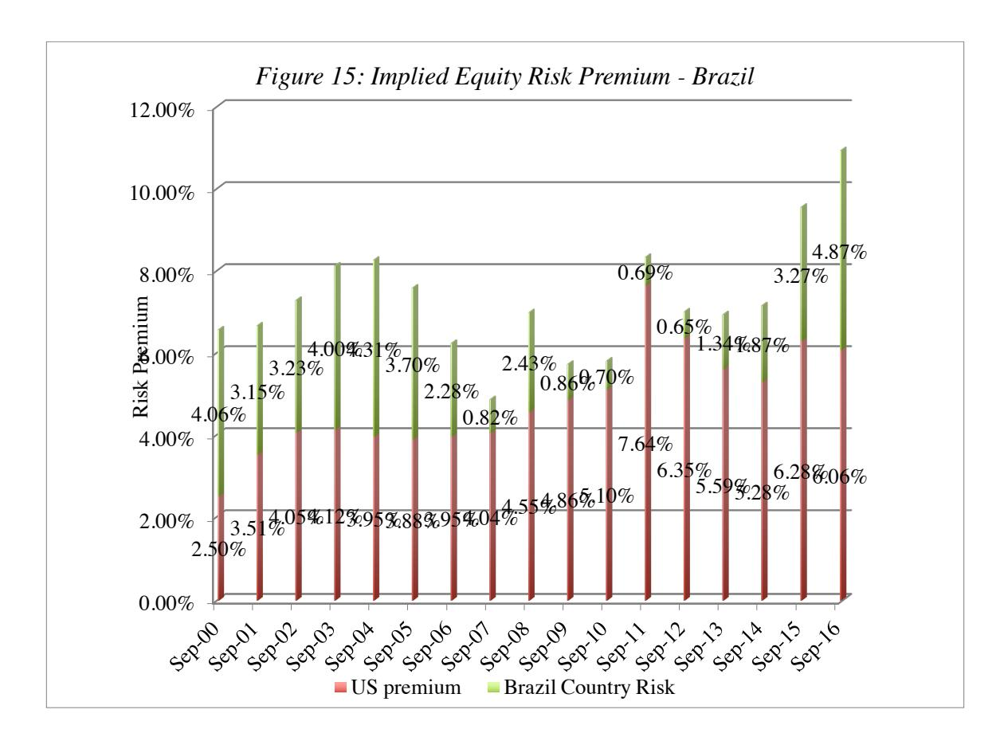

markets in these markets and the United States were of equivalent risk, which would lead us to conclude that these stocks were overvalued relative to US companies.

One final note is worth making. Over the last decade, the implied equity risk premiums in the largest emerging markets – India, China and Brazil- have all declined substantially, relative to developed markets. In table 25, we summarize implied equity risk premiums for developed and emerging markets from 2001 and 2016, making simplistic assumptions about growth and stable growth valuation models:50

*Table 25: Developed versus Emerging Market Equity Risk Premiums*

| Start of year | PBV Developed | PBV Emerging | ROE Developed | ROE Emerging  | US T.B.ond rate | Growth Rate Developed | Growth Rate Emerging | Cost of Equity (Developed) | Cost of Equity (Emerging) | Differential ERP |
|---------------|---------------|--------------|---------------|---------------|-----------------|-----------------------|----------------------|----------------------------|---------------------------|------------------|
| 2004          | 2.00          | 1.19         | 10.81%        | 11.65%        | 4.25%           | 3.75%                 | 5.25%                | 7.28%                      | 10.62%                    | 3.35%            |
| 2005          | 2.09          | 1.27         | 11.12%        | 11.93%        | 4.22%           | 3.72%                 | 5.22%                | 7.26%                      | 10.50%                    | 3.24%            |
| 2006          | 2.03          | 1.44         | 11.32%        | 12.18%        | 4.39%           | 3.89%                 | 5.39%                | 7.55%                      | 10.11%                    | 2.56%            |
| 2007          | 1.67          | 1.67         | 10.87%        | 12.88%        | 4.70%           | 4.20%                 | 5.70%                | 8.19%                      | 10.00%                    | 1.81%            |
| 2008          | 0.87          | 0.83         | 9.42%         | 11.12%        | 4.02%           | 3.52%                 | 5.02%                | 10.30%                     | 12.37%                    | 2.07%            |
| 2009          | 1.20          | 1.34         | 8.48%         | 11.02%        | 2.21%           | 1.71%                 | 3.21%                | 7.35%                      | 9.04%                     | 1.69%            |
| 2010          | 1.39          | 1.43         | 9.14%         | 11.22%        | 3.84%           | 3.34%                 | 4.84%                | 7.51%                      | 9.30%                     | 1.79%            |
| 2011          | 1.12          | 1.08         | 9.21%         | 10.04%        | 3.29%           | 2.79%                 | 4.29%                | 8.52%                      | 9.61%                     | 1.09%            |
| 2012          | 1.17          | 1.18         | 9.10%         | 9.33%         | 1.88%           | 1.38%                 | 2.88%                | 7.98%                      | 8.35%                     | 0.37%            |
| 2013          | 1.56          | 1.63         | 8.67%         | 10.48%        | 1.76%           | 1.26%                 | 2.76%                | 6.02%                      | 7.50%                     | 1.48%            |
| 2014          | 1.95          | 1.50         | 9.27%         | 9.64%         | 3.04%           | 2.54%                 | 4.04%                | 6.00%                      | 7.77%                     | 1.77%            |
| 2015          | 1.88          | 1.56         | 9.69%         | 9.75%         | 2.17%           | 1.67%                 | 3.17%                | 5.94%                      | 7.39%                     | 1.45%            |
| <b>2016</b>   | <b>1.89</b>   | <b>1.59</b>  | <b>9.24%</b>  | <b>10.16%</b> | <b>2.27%</b>    | <b>1.77%</b>          | <b>3.27%</b>         | <b>5.72%</b>               | <b>7.60%</b>              | <b>1.88%</b>     |

The trend line from 2004 to 2012 is clear as the equity risk premiums, notwithstanding a minor widening in 2008, converged in developed and emerging markets, suggesting that globalization had put "emerging market risk" into developed markets, while creating "developed markets stability factors" (more predictable government policies, stronger legal and corporate governance systems, lower inflation and stronger currencies) in emerging markets. In the last few years, we did see a correction in emerging markets that pushed the premium back up, albeit to a level that was still lower than it was prior to 2010.

50 We start with the US treasury bond rate as the proxy for global nominal growth (in US dollar terms), and assume that the expected growth rate in developed markets is 0.5% lower than that number and the expected growth rate in emerging markets is 1% higher than that number. The equation used to compute the ERP is a simplistic one, based on the assumptions that the countries are in stable growth and that the return on equity in each country is a predictor of future return on equity:

#### *The Bottom Line*

Both market and survey data indicate there is strong evidence that equity risk premiums vary across countries. The debate about how best to measure those equity risk premiums, though, continues, since all of the approaches that are available to estimate them come with flaws. The default spread approach, either in its simple form (where the default spread is used as a proxy for the additional equity risk premium in a country) or in its modified version (where the default spread is scaled up to reflect the higher risk of stocks, relative to bonds) is more widely used, largely because default spread data is easier to get and is available for most countries. As stock price data becomes richer, it is possible that market-based approaches will begin to dominate.

# **Valuing Country Risk in Companies**

If we accept the proposition that country risk in not diversifiable and commands a premium, the next question that we have to address relates to the exposure of individual companies to that risk. Should all companies in a country with substantial country risk be equally exposed to country risk? While intuition suggests that they should not, we will begin by looking at standard approaches that assume that they are. We will follow up by looking at ways in which we can bring in differences across companies in country risk exposure into equity risk premiums and cost of equity estimates. In this section, we will look at how to incorporate exposure to country risk, when doing valuation and corporate finance. Finally, we will look at how to deal with currency choices in the analysis.

#### **Measuring Company Exposure to Country Risk**

The question of how best to deal with country risk comes up not only in the context of valuing companies that may be exposed to it, but also within companies, when assessing hurdle rates for projects in different countries. There are three broad approaches to dealing with country risk. The first and simplest is to base the country risk assessment on where the company is incorporated. Thus, all Brazilian companies are assumed to be exposed to only Brazilian country risk and US companies to US country risk. The second and more sensible (in my view) approach is to base the country risk exposure on where a company operates rather than where it is incorporated. The third approach requires us to estimate a relative measure of company exposure to country risk, akin to a beta, that we will term lambda.

# *I. Country of Incorporation ERP*

The easiest assumption to make when dealing with country risk, and the one that is most often made, is that all companies that are incorporated in a country are equally exposed to country risk in that country. The cost of equity for a firm in a market with country risk can then be written as:

Cost of equity = Riskfree Rate + Beta (Mature Market Premium) + Country Risk Premium

Thus, for Brazil, where we have estimated a country risk premium of 3.64% from the melded approach, each company in the market will have an additional country risk premium of 3.64% added to its cost of equity. For instance, the costs of equity for Embraer, an aerospace company listed in Brazil, with a beta51 of 1.07 and Embratel, a Brazilian telecommunications company, with a beta of 0.80, in US dollar terms would be as follows (assuming a US treasury bond rate of 2.36% as the risk free rate and an equity risk premium of 5.13% for mature markets):

Cost of Equity for Embraer = 2.36% + 1.07 (5.13%) + 3.64% = 11.49%

Cost of Equity for Embratel = 2.36% + 0.80 (5.13%) + 3.64% = 10.10%

In some cases, analysts modify this approach to scale the country risk premium by beta. If you use this modification, the estimated costs of equity for Embraer and Embratel would be as follows:

Cost of Equity for Embraer = 2.36% + 1.07 (5.13%+ 3.64%) = 11.74%

Cost of Equity for Embratel = 2.36% + 0.80 (5.13%+ 3.64%)= 9.38%

With both approaches, we are treating all Brazilian companies as exposed to only Brazilian country risk, even though their operations may extend into other markets (mature and emerging).

51 We used a bottom-up beta for Embraer, based upon an unleverd beta of 0.95 (estimated using aerospace companies listed globally) and Embraer's debt to equity ratio of 19.01%. For more on the rationale for bottom-up betas read the companion paper on estimating risk parameters.

#### *II. Operation-weighted ERP*

For those investors who are uncomfortable with the notion that all companies in a market are equally exposed to country risk or that a company is exposed only to its local market's risk, the alternative is to compute a country risk premium for each company that reflects its operating exposure. Thus, if a company derives half of its value from Brazil and half from Argentina, the country risk premium will be an average of the country risk premiums for the two countries. Since value is difficult to estimate, by country, the weighting has to be based on more observable variables such as revenues or operating income. In table 26, we estimate the equity risk premium and country risk premium exposure for Ambev, a Brazil-based company with revenues across the Americas, in 2011 (with a mature market premium of 6%):

*Table 26: ERP and CRP for Ambev in 2011*

| Country   | Revenues | Revenue Weight | ERP    | CRP    | Weighted ERP | Weighted CRP |
|-----------|----------|----------------|--------|--------|--------------|--------------|
| Argentina | \$19.00  | 9.31%          | 15.00% | 9.00%  | 1.40%        | 0.84%        |
| Bolivia   | \$4.00   | 1.96%          | 10.88% | 4.88%  | 0.21%        | 0.10%        |
| Brazil    | \$130.00 | 63.73%         | 8.63%  | 2.63%  | 5.50%        | 1.67%        |
| Canada    | \$23.00  | 11.27%         | 6.00%  | 0.00%  | 0.68%        | 0.00%        |
| Chile     | \$7.00   | 3.43%          | 7.05%  | 1.05%  | 0.24%        | 0.04%        |
| Ecuador   | \$6.00   | 2.94%          | 18.75% | 12.75% | 0.55%        | 0.38%        |
| Paraguay  | \$3.00   | 1.47%          | 12.00% | 6.00%  | 0.18%        | 0.09%        |
| Peru      | \$12.00  | 5.88%          | 9.00%  | 3.00%  | 0.53%        | 0.18%        |
| Total     | \$204.00 | 100.00%        |        |        | 9.28%        | 3.28%        |

Note that while Ambev is incorporated in Brazil, it does get substantial revenues from not only from other Latin American countries but also from Canada. Once the weighted premium has been computed, it can either be added to the standard single-factor model as a constant or scaled, based upon beta. Thus, the estimated cost of equity for Ambev, at the end of 2011, using the two approaches would have been as follows (using a beta of 0.80 for Ambev , a US dollar risk free rate of 3.25% and a 6% equity risk premium for mature markets):

The constant approach: 3.25% + 0.80 (6.00%) + 3.28% = 11.33%

The scaled approach: 
$$3.25\% + 0.80 (6.00\% + 3.28\%) = 10.67\%$$

Note that the approaches yield similar values when the beta is close to one, but can diverge when the beta is much lower or higher than one. When we use the latter approach we are assuming that a company's exposure to country risk is proportional to its exposure to all other market risk, which is measured by the beta.

With this approach, you can see that the exposure to country risk or emerging market risk is not restricted to emerging market companies. Many companies that are headquartered in developed markets (US, Western Europe, Japan) derive some or a large portion of their revenues from emerging or riskier markets and will therefore have higher composite equity risk premiums. For instance, we estimate the composite equity risk premium for Coca Cola in 2012 in table 27:

*Table 27: Coca Cola – Equity and Country Risk Premium in 2012*

| Region                          | Revenues | Equity Risk Premium | Country Risk Premium |
|---------------------------------|----------|---------------------|----------------------|
| Western Europe Eastern Europe & | 19%      | 6.67%               | 0.67%                |
| Russia                          | 5%       | 8.60%               | 2.60%                |
| Asia                            | 15%      | 7.63%               | 1.63%                |
| Latin America                   | 15%      | 9.42%               | 3.42%                |
| Australia & NZ                  | 4%       | 6.00%               | 0.00%                |
| Africa                          | 4%       | 9.82%               | 3.82%                |
| North America                   | 38%      | 6.00%               | 0.00%                |
| Coca Cola (Company)             | 100%     | 7.17%               | 1.17%                |

As with Ambev, we would use the weighted equity risk premium for the company to compute its overall cost of equity. For valuing regional revenues (or divisions), we would draw on the divisional equity risk premium; thus, the equity risk premium used to value Coca Cola's Latin American business would be 9.42%. Note that rather than break the revenues down by country, we have broken them down by region and attached an equity risk premium to each region, computed as a GDP-weighted average of the equity risk premiums of the countries in that region. We did so for two reasons. First, given that Coca Cola derives its revenues from almost every country in the world, it is more tractable to compute the equity risk premiums by region. Second, Coca Cola does not break down its revenues (at least for public consumption) by country, but does so by region.

The focus on revenues can sometimes lead to misleading assessments of country risk exposure for some companies and it is worth exploring alternative weighting mechanisms for these companies. For mining and oil companies, for instance, the true risk lies in where their reserves lie rather than in where they sell the commodities that they produce. If you can get a geographic breakdown of reserves, you can use it to derive a weighted average equity risk premium, as shown for Royal Dutch Shell in March 2016, in table 28:

*Table 28: Reserves-weighted ERP – Royal Dutch Shell in March 2016*

| Region     | Production (in kboed) | % of Total | ERP    |
|------------|-----------------------|------------|--------|
| UK         | 105                   | 18.23%     | 6.36%  |
| Kazakhstan | 85                    | 14.76%     | 8.69%  |
| Brazil     | 78                    | 13.54%     | 9.15%  |
| Trinidad   | 65                    | 11.28%     | 8.69%  |
| Egypt      | 62                    | 10.76%     | 15.80% |
| Bolivia    | 48                    | 8.33%      | 11.31% |
| USA        | 39                    | 6.77%      | 5.75%  |
| Thailand   | 39                    | 6.77%      | 8.22%  |
| Australia  | 34                    | 5.90%      | 5.75%  |
| Tunisia    | 2                     | 0.35%      | 11.31% |
| India      | 18                    | 3.13%      | 9.15%  |
| Norway     | 1                     | 0.17%      | 5.75%  |
| Shell      | 576                   | 100.00%    | 8.93%  |

Shell's reserves are in many of the riskiest parts of the world, pushing up its equity risk premium as a company.

As you can see, there is no one hard and fast rule that you can use for weighting equity risk premiums. For some companies, especially if they are service or consumer product companies, it is revenue location that works best. For others, where the risk emanates from where goods are produced, production location works better. For some, you can even use a composite of both revenues and production, depending on how much risk each one exposes you to, to determine weights.

# *III. Lambdas*

The most general approach, is to allow for each company to have an exposure to country risk that is different from its exposure to all other market risk. For lack of a better term, let us term the measure of a company's exposure to country risk to be lambda (l). Like a beta, a lambda will be scaled around one, with a lambda of one indicating a company with average exposure to country risk and a lambda above or below one indicating above or below average exposure to country risk. The cost of equity for a firm in an emerging market can then be written as:

Expected Return = Rf + Beta (Mature Market Equity Risk Premium) + l (County Risk Premium)

Note that this approach essentially converts the expected return model to a two-factor model, with the second factor being country risk, with l measuring exposure to country risk.

#### *Determinants of Lambda*

Most investors would accept the general proposition that different companies in a market should have different exposures to country risk. But what are the determinants of this exposure? We would expect at least three factors (and perhaps more) to play a role.

A. Revenue Source: The first and most obvious determinant is how much of the revenues a firm derives from the country in question. A company that derives 30% of its revenues from Brazil should be less exposed to Brazilian country risk than a company that derives 70% of its revenues from Brazil. Note, though, that this then opens up the possibility that a company can be exposed to the risk in many countries. Thus, the company that derives only 30% of its revenues from Brazil may derive its remaining revenues from Argentina and Venezuela, exposing it to country risk in those countries.

B. Production Facilities: A company can be exposed to country risk, even if it derives no revenues from that country, if its production facilities are in that country. After all, political and economic turmoil in the country can throw off production schedules and affect the company's profits. Companies that can move their production facilities elsewhere can spread their risk across several countries, but the problem is exaggerated for those companies that cannot move their production facilities. Consider the case of mining companies. An African gold mining company may export all of its production but it will face substantial country risk exposure because its mines are not moveable.

3. Risk Management Products: Companies that would otherwise be exposed to substantial country risk may be able to reduce this exposure by buying insurance against specific (unpleasant) contingencies and by using derivatives. A company that uses risk management products should have a lower exposure to country risk – a lower lambda – than an otherwise similar company that does not use these products.

Ideally, we would like companies to be forthcoming about all three of these factors in their financial statements.

#### *Measuring Lambda*

The simplest measure of lambda is based entirely on revenues. In the last section, we argued that a company that derives a smaller proportion of its revenues from a market should be less exposed to country risk. Given the constraint that the average lambda across all stocks has to be one (someone has to bear the country risk), we cannot use the percentage of revenues that a company gets from a market as lambda. We can, however, scale this measure by dividing it by the percent of revenues that the average company in the market gets from the country to derive a lambda.

$$\text{Lambda}_j = \frac{\% \text{ of Revenue in country}_{\text{Company}}}{\% \text{ of Revenue in country}_{\text{Average company in market}}}$$

Consider again the two Brazilian companies that we looked earlier: Embraer and Embratel. In 2016, Embraer generated only 6% of its revenues in Brazil, whereas the average company in the Brazilian market obtained 75% of its revenues in Brazil.52 Using the measure suggested above, the lambda for Embraer would be:

LambdaEmbraer = 6%/ 75% = 0.08

In contrast, Embratel generated 100% of its revenues from Brazil, giving it a lambda of

LambdaEmbraer = 100%/ 75% = 1.333

Following up, Embratel is far more exposed to country risk than Embraer and will have a much higher cost of equity.

 52 To use this approach, we need to estimate both the percent of revenues for the firm in question and for the average firm in the market. While the former may be simple to obtain, estimating the latter can be a time consuming exercise. One simple solution is to use data that is publicly available on how much of a country's gross domestic product comes from exports. According to the World Bank data in this table, Brazil got 23.2% of its GDP from exports in 2008. If we assume that this is an approximation of export revenues for the average firm, the average firm can be assumed to generate 76.8% of its revenues domestically. Using this value would yield slightly higher betas for both Embraer and Embratel.

The second measure draws on the stock prices of a company and how they move in relation to movements in country risk. Sovereign bonds issued by countries offer a simple and updated measure of country risk; as investor assessments of country risk become more optimistic, sovereign bonds go up in price, just as they go down when investors become more pessimistic. A regression of the returns on a stock against the returns on a country bond should therefore yield a measure of lambda in the slope coefficient. Applying this approach to the Embraer and Embratel, we regressed monthly stock returns on the two stocks against monthly returns on the ten-year dollar denominated Brazilian government bond and arrived at the following results:

ReturnEmbraer = 0.0195 + 0.2681 ReturnBrazil \$ Bond ReturnEmbratel = -0.0308 + 2.0030 ReturnBrazil \$ Bond

Based upon these regressions, Embraer has a lambda of 0.27 and Embratel has a lambda of 2.00. The resulting dollar costs of equity for the two firms, using a US dollar risk free rate of 2.36%, a mature market equity risk premium of 5.13% and a country equity risk premium of 3.64% for Brazil are:

Cost of Equity for Embraer = 2.36% + 1.07 (5.13%) + 0.27 (3.64%) = 8.83%

Cost of Equity for Embratel = 2.36% + 0.80 (5.13%) + 2.00 (3.64%) = 13.74%

What are the limitations of this approach? The lambdas estimated from these regressions are likely to have large standard errors; the standard error in the lambda estimate of Embratel is 0.35. It also requires that the country have bonds that are liquid and widely traded, preferably in a more stable currency (dollar or euro).

In general, as the number of countries a company derives its revenues from increases, the lambda approach gets less and less practical, since you have to estimate lambdas for each market.53 Thus, we would not even attempt to use this approach for Ambev or Coca Cola. It is designed more for a company that is exposed to risk in only one or two emerging markets (with the balance of its revenues coming from developed markets) and even in those markets, the estimation stars have to align for lambda estimates to be meaningful.

 53 Damodaran, A,, 2003, *Estimating Company Exposure to Country Risk*, Journal of Applied Finance, v pg 64-78.

#### **Currency Choices**

When analyzing companies that operate in foreign markets, the questions of how best to deal with different currencies and the potential risk exposure that comes from unexpected currency movements (up or down) have to be answered. In this section, we will first look at how to shift from one currency to another consistently and how this consistency leads to currency invariance, where the value of a company or project will not be a function of the currency chosen to analyze it. We will follow it up by looking at exchange rate changes over time and whether these changes translate into higher risk that has to be accounted for in valuation and capital budgeting.

#### *Currency Consistency*

One of the fundamental tenets in valuation is that the cash flows and discount rates in any discounted cash flow (DCF) analysis (valuation or capital budgeting) have to be denominated in the same currency; US dollar cash flows have to be discounted at a US dollar discount rate and Indian rupee cash flows have to be discounted at an Indian rupee discount rate. Keeping this principle in mind allows us to develop estimation mechanisms for dealing with different currencies.

#### *The Importance of Inflation*

Stripped down to basics, the only reason that the currency in which you choose to do your analysis matters is that different currencies have different expected inflation rates embedded in them. Those differences in expected inflation affect both our estimates of expected cash flows and discount rates.

When working with a high inflation currency, we should therefore expect to see higher discount rates and higher cash flows and with a lower inflation currency, both discount rates and cash flows will be lower. In fact, we could choose to remove inflation entirely out of the process by using real cash flows and a real discount rate.

The diagram illustrates the connection between the Value of asset and the Currency Choice process. A box labeled 'Inflation in your expected cashflows' is connected to the Value of asset by an arrow. Another box labeled 'Currency Choice' is connected to the Value of asset by an arrow. A box labeled 'Inflation in your discount rate' is connected to the Value of asset by an arrow.
The Value of asset is defined as 
$$\frac{E(CF_1)}{(1+r)} + \frac{E(CF_2)}{(1+r)^2} + \frac{E(CF_3)}{(1+r)^3} + \dots + \frac{E(CF_n)}{(1+r)^n}$$
.

#### *Effects on Discount Rates*

If discount rates, when working with higher inflation currency, should be higher than discount rates for the same company, when working with a lower inflation currency, how do you put this principle into practice? You have two choices. One is to use risk free rates that reflect these expected inflation differences and build off that rate; higher inflation currencies will have higher risk free rates and higher discount rates. The other is to compute a discount rate in a base currency (say US dollars) and then adjust that dollar discount rate for differential inflation to make it a discount rate in an alternate currency.

# *1. Risk Free Rates*

The risk free rate in a currency should, at least in theory, incorporate both the expected inflation in that currency and an expected real return for investors. Thus, the risk free rate in a high inflation currency should also be high, and estimating and using that risk free rate as the base should bring in the higher inflation into the discount rate. That is easier said than done, for two reasons. First, estimating a risk free rate requires that we able to observe market prices and interest rates on traded bonds issued by governments. That is, after all, the rationale that we use for using the US Treasury bond rate as the risk free rate in US dollars. Second, even if a government bond rate is observable, that government has to be viewed as default free for the rate to be a risk free rate. Thus, if we assume that Aaa sovereign ratings from Moody's signify default free governments, the risk free rates in the respective currencies on January 1, 2017, is in table 29:

*Table 29: Risk free rates in Currencies with Aaa Rated Government Issuers – January 1, 2017*

| Currency        | Government	Bond	Rate	12/31/16 |
|-----------------|-------------------------------|
| Swiss	Franc     | -0.19%                        |
| Euro            | 0.29%                         |
| Danish	Krone    | 0.42%                         |
| Swedish	Krona   | 0.62%                         |
| Norwegian	Krone | 1.61%                         |
| Canadian	\$     | 1.70%                         |
| Singapore	\$    | 2.45%                         |
| US	\$           | 2.45%                         |
| Australian	\$   | 2.76%                         |

Note that the Swiss Franc risk free rate is negative, leading analysts who have to use that currency in valuations to adopt extreme measures, including replacing the currency risk free rate with a normalized value (an average rate from prior periods or even a made-up number). While negative risk free rates are unusual, they are indicative of troubling economic fundamentals (deflation and/or negative real growth economies, with substantial risks). Thus, we believe that you should still build your costs of equity and capital off the current risk free rates (negative or very low) but you should also adjust your risk premiums (equity and debt) and nominal growth estimates to reflect the current market environment. For the Euro risk free rate, we have used the rate on the German 10 year Euro bond, since Germany is Aaa rated.

But what do we do with governments that have default risk? In a companion paper on risk free rates54, I develop a simple process of estimating the default spread for the government, using either the sovereign rating or the CDS market, and then subtracting that default spread from the government bond rate to get to a risk free rate. Table 30 summarizes the default-spread adjusted risk free rates in currencies, on January1, 2017, where the issuing governments are rated below Aaa (in local currency terms) by Moody's and the default spreads are estimated based on table 21.

*Table 30: Risk free Rates in Currencies with non-Aaa Rated Government Issuers*

| Currency       | Govt	Bond	Rate 12/31/16 | Default	Spread	based	on rating | Risk	Free Rate |
|----------------|-------------------------|--------------------------------|----------------|
| Brazilian	Reai | 11.37%                  | 3.47%                          | 7.90%          |
| British	Pound  | 1.35%                   | 0.46%                          | 0.89%          |
| Bulgarian	Lev  | 2.04%                   | 2.20%                          | -0.16%         |
| Chilean	Peso   | 4.12%                   | 0.70%                          | 3.42%          |
| Chinese	Yuan   | 3.25%                   | 0.70%                          | 2.55%          |
| Colombian	Peso | 6.76%                   | 2.20%                          | 4.56%          |
| Croatian	Kuna  | 3.13%                   | 3.47%                          | -0.34%         |
| Czech	Koruna   | 0.49%                   | 0.81%                          | -0.32%         |
| HK	\$          | 1.69%                   | 0.46%                          | 1.23%          |

54 Damodaran, A., 2010, Into the Abyss! What if nothing is risk free?, SSRN Working Paper, http://papers.ssrn.com/sol3/papers.cfm?abstract\_id=1648164

| Hungarian	Forint            | 3.41%  | 2.54%  | 0.87%  |
|-----------------------------|--------|--------|--------|
| Iceland	Krona               | 5.06%  | 1.39%  | 3.67%  |
| Indian	Rupee Indonesian     | 6.40%  | 2.54%  | 3.86%  |
| Rupiah                      | 7.60%  | 2.54%  | 5.06%  |
| Israeli	Shekel              | 2.06%  | 0.81%  | 1.25%  |
| Japanese	Yen                | 0.06%  | 0.81%  | -0.75% |
| Kenyan	Shilling             | 14.02% | 5.20%  | 8.82%  |
| Korean	Won Malyasian        | 2.08%  | 0.57%  | 1.51%  |
| Ringgit                     | 4.24%  | 1.39%  | 2.85%  |
| Mexican	Peso                | 7.63%  | 1.39%  | 6.24%  |
| Nigerian	Naira              | 15.97% | 5.20%  | 10.77% |
| Pakistani	Rupee             | 8.03%  | 7.51%  | 0.52%  |
| Peruvian	Sol                | 6.43%  | 1.39%  | 5.04%  |
| Phillipine	Peso             | 4.75%  | 2.20%  | 2.55%  |
| Polish	Zloty                | 3.67%  | 0.98%  | 2.69%  |
| Romanian	Leu                | 3.44%  | 2.54%  | 0.90%  |
| Russian	Ruble South	African | 8.38%  | 2.89%  | 5.49%  |
| Rand                        | 8.80%  | 2.20%  | 6.60%  |
| Taiwanese	\$                | 1.17%  | 0.70%  | 0.47%  |
| Thai	Baht                   | 2.70%  | 1.84%  | 0.86%  |
| Turkish	Lira Venezuelan     | 11.00% | 2.89%  | 8.11%  |
| Bolivar Vietnamese          | 20.43% | 11.55% | 8.88%  |
| Dong                        | 6.10%  | 5.20%  | 0.90%  |

Thus, if you were estimating the costs of equity for a Brazilian company, you would replace the risk free rate in US dollars with a risk free rate in \$R to get the \$R cost of equity.

There are two dangers with this approach. The first is that the government bond rates, which are the starting point for these risk free estimates, may not reflect market expectations in many countries, where the government bond markets are not deep and sometimes manipulated. The second is that almost all of the risk premiums that we have talked about in this paper come from dollar-based markets and may need to be adjusted when working with higher inflation currencies. Take, for instance, our estimate of an equity risk premium of 8.77% for Brazil in July 2017. While that may be the right premium to use in US dollar cost of equity computation (with a US dollar risk free rate of close to 2.36%) for a company that is investing in Brazil, it may need to be increased, when working with nominal \$R, where the risk free rate is 7.90%.

# *2. Differential Inflation*

The second approach to dealing with different currencies is to go back to inflation fundamentals. If the differences between currencies lies in the fact that there are different expectations of inflation embedded in them, you should be able to use that differential inflation to adjust discount rates in one currency to another. Thus, if the cost of capital is computed in US dollars and you intend to convert it into a nominal \$R cost of capital, you could do so with the following equation:

Cost of Capital in \$R = 1 + Cost of Capital in US\$ ∗ (ghijklmnlo pqrstnuvq wtnl uq \$w) (ghijklmnlo pqrstnuvq wtnl uq yz \$) -1 There are two advantages to this approach. First, to use it, you only need an expected inflation rate in a currency, not a government bond rate, and that should be easier to obtain, especially if you use past inflation as a proxy. The second advantage is that it automatically scales up risk premiums for higher inflation, as evidenced in the comparison in table 31, where we estimate the cost of equity for an average-risk (beta =1) Brazilian company, using both the \$R risk free rate approach and the differential inflation approach. Note that the differential inflation approach results in a higher cost of equity, as the equity risk premium is also scaled up for higher inflation.

*Table 31: Cost of Equity Comparison*

|       | Risk free rates | Risk free Rate Approach ERP | Cost of Equity 2.36%+ 8.77% | Expected Inflation | Differential Inflation Cost of Equity |
|-------|-----------------|-----------------------------|-----------------------------|--------------------|---------------------------------------|
| US \$ | 2.36%           | 8.77%                       |                             |                    |                                       |
|       |                 |                             | =11.13%                     | 1.00%              | 11.13%                                |
| \$R   | 7.90%           | 8.77%                       |                             |                    |                                       |
|       |                 |                             | =16.67%                     | 7.00%              |                                       |

The weakest link in the approach is measuring expected inflation in secondary currencies. Past inflation rates are often not only noisy, but are also manipulated by governments to make inflation look tamer than it is. The good news, though, is that even if the expected inflation rates are misestimated, the effect on value will be minimal if the same "wrong" number is used in both generating cash flows and in estimating discount rates.

# *Effects on Expected Exchange Rates*

If consistency requires that the cash flows be estimated in the same currency as the discount rate, it is a given that you will have to convert cash flows from one currency to another. Thus, if you decide to value a Brazilian company in US dollars, you will have to take expected cash flows in \$R and convert them into US dollars using \$R/US\$ exchange rates. While there are some analysts who use today's exchange rate to make this conversion for all future years, we will argue that this is a recipe for mismatches and large valuation errors. In fact, we will argue that if your intent is to preserve consistency, you have to use the same differential inflation that you used to get discount rates to estimate expected exchange rate.

# *1. Current Exchange Rates- The Inconsistency Problem*

Some analysts use the argument that the only way to avoid exchange rate speculation in valuation is to use the current exchange rate to convert all future cash flows from one currency to another. While that argument sounds alluring, it is wrong, and especially so when the expected inflation rates are different across the currencies. In fact, using the current exchange rate to convert future cash flows from a currency with higher inflation (say pesos or \$R) into a currency with lower inflation (say Euros or US dollars) will result in an over valuation. Reversing that process and converting lower inflation currencies into higher inflation currencies at today's exchange rate will under value an asset.

The reason is simple. If you use today's exchange rate to convert future cash flows from a base currency to a converted currency, you are in effect leaving the expected inflation rate in the cash flow at the base currency's level, while switching the expected inflation rate in the discount rate to the converted currency's level. Thus, using today's exchange rate to convert \$R to US \$ and discounting those cash flows back at a US \$ discount rate, if the inflation rate is 7% in Brazil and 1.0% in the US, will result in the former being incorporated into the cash flows and the latter into the discount rate.

#### *2. Forward Market Exchange Rates*

Using exchange rates from the forward and futures markets is less perilous than using a current exchange rate, since the forward market presumably builds in the currency depreciation that can be expected in the higher inflation currency. Here again, though, there may be a consistency problem. If the discount rate is estimated using a current risk free rate in the currency and this rate implies an inflation rate that is different from the one in the forward currency markets, you can still end up mismatching expected inflation in the cash flows and the discount rate.

#### *3. Purchasing Power Parity Exchange Rates*

Since the key sin to avoid in valuation is mismatching inflation in the cash flows and the discount rate, there is a strong argument to be made that the safest way to estimate expected future exchange rates is to use the same differential inflation rate used to estimate the discount rate.

Expected Exchange Rate 
$$c_{1,c2} = \text{Spot Exchange Rate}_{c1,c2} \frac{(1+\text{Expected Inflation Rate}_{C1})}{(1+\text{Expected Inflation Rate}_{C2})}$$

(ghV{|N\_JNL UKQ41J3PK }1JN~Ä) In the \$R example, using the same 7% inflation in \$R and 1% inflation rate in US\$ on the current exchange rate of \$3.25R/US \$ (on July 1, 2017), this would yield the expected exchange rates for the next five years in table 32.

*Table 32: Expected \$R/US \$ Exchange Rates*

| Year Current 1 | Expected Exchange Rate (\$R/US\$) R\$ 3.25 R\$ 3.25*(1.07/1.01) = R\$ 3.44 |
|----------------|----------------------------------------------------------------------------|
| 2              | R\$ 3.25*(1.07/1.01) 2 =R\$ 3.65                                           |
| 3              | R\$ 3.25*(1.07/1.01) 3 =R\$ 3.86                                           |
| 4              | R\$ 3.25*(1.07/1.01) 4 =R\$ 4.09                                           |
| 5              | R\$ 3.25*(1.07/1.01) 5 =R\$ 4.34                                           |

If these expected exchange rates are used to compute \$R cash flows in future years, the effect of switching to \$R from US \$ on value should cancel out, since the discount rate effect will be exactly offset by the cash flow effect. In fact, using any other set of expected exchange rates, no matter how highly regarded the source, will bring currency views (optimistic or pessimistic) into your valuation.

#### *Currency Risk*

When working with cash flows in a foreign currency, it is understandable that analysts worry about currency risk, though their measurement of and prescriptions for that risk are often misplaced. First, it is not the fact that exchange rates change over time that creates risk, it is that they change in unexpected ways. Thus, if the Brazilian Reai depreciates over the next five years in line with the expectations in table 28, there is no risk, but if it depreciates less or more, that is risk. Second, even allowing for the fact that there is currency risk in investments in foreign markets, it is not clear that analysts should be adjusting value for that risk, especially if exchange rate risk is diversifiable to investors in the companies making these investments. If this is the case, you are best served forecasting expected cash flows (using expected exchange rates) and not adjusting discount rates for additional currency risk.

It is true that currency and country risk tend to be correlated and that countries with high country risk also tend to have the most volatile currencies. If so, the discount rates will be higher for investments in these countries but that augmentation is attributable to the country risk, not currency risk.

# **Conclusion**

As companies expand operations into emerging markets and investors search for investment opportunities in Asia and Latin America, they are also increasingly exposed to additional risk in these countries. While it is true that globally diversified investors can eliminate some country risk by diversifying across equities in many countries, the increasing correlation across markets suggests that country risk cannot be entirely diversified away. To estimate the country risk premium, we consider three measures: the default spread on a government bond issued by that country, a premium obtained by scaling up the equity risk premium in the United States by the volatility of the country equity market relative to the US equity market and a melded premium where the default spread on the country bond is adjusted for the higher volatility of the equity market. We also estimated an implied equity premium from stock prices and expected cash flows.

*Appendix 1: Corruption Score in 2016 (Low scores indicate more corruption)*

|                          | Country | Corruption Index   | Country | Corruption Index | Country | Corruption Index             |    |
|--------------------------|---------|--------------------|---------|------------------|---------|------------------------------|----|
| Afghanistan              | 15      | Dominican Republic | 31      | Lebanon          | 28      | Saint Vincent                | 60 |
| Albania                  | 39      | Ecuador            | 31      | Lesotho          | 39      | Sao Tome and Principe        | 46 |
| Algeria                  | 34      | Egypt              | 34      | Liberia          | 37      | Saudi Arabia                 | 46 |
| Angola                   | 18      | El Salvador        | 36      | Libya            | 14      | Senegal                      | 45 |
| Argentina                | 36      | Eritrea            | 18      | Lithuania        | 59      | Serbia                       | 42 |
| Armenia                  | 33      | Estonia            | 70      | Luxembourg       | 81      | Sierra Leone                 | 30 |
| Australia                | 79      | Ethiopia           | 34      | Madagascar       | 26      | Singapore                    | 84 |
| Austria                  | 75      | Finland            | 89      | Malawi           | 31      | Slovakia                     | 51 |
| Azerbaijan               | 30      | France             | 69      | Malaysia         | 49      | Slovenia                     | 61 |
| Bahamas                  | 66      | Gabon              | 35      | Maldives         | 36      | Solomon Islands              | 42 |
| Bahrain                  | 43      | Gambia             | 26      | Mali             | 32      | Somalia                      | 10 |
| Bangladesh               | 26      | Georgia            | 57      | Malta            | 55      | South Africa                 | 45 |
| Barbados                 | 61      | Germany            | 81      | Mauritania       | 27      | South Sudan                  | 11 |
| Belarus                  | 40      | Ghana              | 43      | Mauritius        | 54      | Spain                        | 58 |
| Belgium                  | 77      | Greece             | 44      | Mexico           | 30      | Sri Lanka                    | 36 |
| Benin                    | 36      | Grenada            | 56      | Moldova          | 30      | Sudan                        | 14 |
| Bhutan                   | 65      | Guatemala          | 28      | Mongolia         | 38      | Suriname                     | 45 |
| Bolivia                  | 33      | Guinea             | 27      | Montenegro       | 45      | Sweden                       | 88 |
| Bosnia and Herzegovina   | 39      | Guinea-Bissau      | 16      | Morocco          | 37      | Switzerland                  | 86 |
| Botswana                 | 60      | Guyana             | 34      | Mozambique       | 27      | Syria                        | 13 |
| Brazil                   | 40      | Haiti              | 20      | Myanmar          | 28      | Taiwan                       | 61 |
| Brunei                   | 58      | Honduras           | 30      | Namibia          | 52      | Tajikistan                   | 25 |
| Bulgaria                 | 41      | Hong Kong          | 77      | Nepal            | 29      | Tanzania                     | 32 |
| Burkina Faso             | 42      | Hungary            | 48      | Netherlands      | 83      | Thailand                     | 35 |
| Burundi                  | 20      | Iceland            | 78      | New Zealand      | 90      | DR Congo                     | 21 |
| Cambodia                 | 21      | India              | 40      | Nicaragua        | 26      | Macedonia                    | 37 |
| Cameroon                 | 26      | Indonesia          | 37      | Niger            | 35      | The United States of America | 74 |
| Canada                   | 82      | Iran               | 29      | Nigeria          | 28      | Timor-Leste                  | 35 |
| Cape Verde               | 59      | Iraq               | 17      | Norway           | 85      | Togo                         | 32 |
| Central African Republic | 20      | Ireland            | 73      | Oman             | 45      | Trinidad and Tobago          | 35 |
| Chad                     | 20      | Israel             | 64      | Pakistan         | 32      | Tunisia                      | 41 |
| Chile                    | 66      | Italy              | 47      | P                |         |                              |    |

*Appendix 2: Global Peace Index Scores in 2016 (Low scores indicate more peaceful)*

| Country      | Score | Country       | Score | Country     | Score | Country             | Score |
|--------------|-------|---------------|-------|-------------|-------|---------------------|-------|
| Afghanistan  | 3.538 |               |       |             |       |                     |       |
|              |       | Guinea        | 1.94  | Malawi      | 1.817 | Somalia             | 3.414 |
| Albania      | 1.867 | Eritrea       | 2.46  | Malaysia    | 1.648 | South	Africa        | 2.316 |
| Algeria      | 2.213 | Estonia       | 1.732 | Mali        | 2.489 | South	Korea         | 1.858 |
| Angola       | 2.14  | Ethiopia      | 2.284 | Mauritania  | 2.295 | South	Sudan         | 3.593 |
| Argentina    | 1.957 | Finland       | 1.429 | Mauritius   | 1.559 | Spain               | 1.604 |
| Armenia      | 2.218 | France        | 1.829 | Mexico      | 2.557 | Sri	Lanka           | 2.133 |
| Australia    | 1.465 | Gabon         | 2.033 | Moldova     | 1.953 | Sudan               | 3.269 |
| Austria      | 1.278 | Georgia       | 2.057 | Mongolia    | 1.838 | Swaziland           | 2.074 |
| Azerbaijan   | 2.45  | Germany       | 1.486 | Montenegro  | 1.884 | Sweden              | 1.461 |
| Bahrain      | 2.398 | Ghana         | 1.809 | Morocco     | 2.086 | Switzerland         | 1.37  |
| Bangladesh   | 2.045 | Greece        | 2.044 | Mozambique  | 1.963 | Syria               | 3.806 |
| Belarus      | 2.202 | Guatemala     | 2.27  | Myanmar     | 2.256 | Taiwan              | 1.787 |
| Belgium      | 1.528 | Guinea        | 2.148 | Namibia     | 1.873 | Tajikistan          | 2.293 |
| Benin        | 1.998 | Guinea-Bissau | 2.264 | Nepal       | 2.026 | Tanzania            | 1.899 |
| Bhutan       | 1.445 | Guyana        | 2.105 | Netherlands | 1.541 | Thailand            | 2.312 |
| Bolivia      | 2.038 | Haiti         | 2.066 | New	Zealand | 1.287 | The	Gambia          | 2.091 |
| Bosnia       | 1.915 | Honduras      | 2.237 | Nicaragua   | 1.975 | Timor-Leste         | 1.879 |
| Botswana     | 1.639 | Hungary       | 1.534 | Niger       | 2.239 | Togo                | 1.954 |
| Brazil       | 2.176 | Iceland       | 1.192 | Nigeria     | 2.877 | Trinidad	and	Tobago | 2.056 |
| Bulgaria     | 1.646 | India         | 2.566 | North	Korea | 2.944 | Tunisia             | 1.949 |
| Burkina	Faso | 2.063 | Indonesia     | 1.799 | Norway      | 1.5   | Turkey              | 2.71  |
| Burundi      | 2.5   | Iran          | 2.411 | Oman        | 2.016 | Turkmenistan        | 2.202 |
| Cambodia     | 2.161 | Iraq          | 3.57  | Pakistan    | 3.145 | Uganda              | 2.148 |

| Cameroon           | 2.356 | Ireland         | 1.433 | Palestine        | 2.832 | Ukraine              | 3.287 |
|--------------------|-------|-----------------|-------|------------------|-------|----------------------|-------|
| Canada             | 1.388 | Israel          | 2.656 | Panama           | 1.837 | United	Arab	Emirates | 1.931 |
| Republic           | 3.354 | Italy           | 1.774 | Papua	New	Guinea | 2.143 | United	Kingdom       | 1.83  |
| Chad               | 2.464 | Jamaica         | 2.091 | Paraguay         | 2.037 |                      |       |
|                    |       |                 |       |                  |       | America              | 2.154 |
| Chile              | 1.635 | Japan           | 1.395 | Peru             | 2.057 | Uruguay              | 1.726 |
| China              | 2.288 | Jordan          | 2.127 | Philippines      | 2.511 | Uzbekistan           | 2.216 |
| Colombia           | 2.764 | Kazakhstan      | 2.019 | Poland           | 1.557 | Venezuela            | 2.651 |
| Congo	(DR)         | 3.112 | Kenya           | 2.379 | Portugal         | 1.356 | Vietnam              | 1.906 |
| Costa	Rica         | 1.699 | Kosovo          | 2.022 | Qatar            | 1.716 | Yemen                | 3.399 |
| Cote	d'	Ivoire     | 2.279 | Kuwait          | 1.842 |                  |       |                      |       |
|                    |       |                 |       | Congo            | 2.249 | Zambia               | 1.783 |
| Croatia            | 1.633 | Kyrgyz	Republic | 2.297 | Romania          | 1.649 | Zimbabwe             | 2.322 |
| Cuba               | 2.057 | Laos            | 1.852 | Russia           | 3.079 |                      |       |
| Cyprus             | 1.994 | Latvia          | 1.68  | Rwanda           | 2.323 |                      |       |
| Czech	Republic     | 1.36  | Lebanon         | 2.752 | Saudi	Arabia     | 2.338 |                      |       |
| Denmark            | 1.246 | Lesotho         | 1.941 | Senegal          | 1.978 |                      |       |
| Djibouti           | 2.292 | Liberia         | 1.998 | Serbia           | 1.834 |                      |       |
| Dominican	Republic | 2.143 | Libya           | 3.2   | Sierra	Leone     | 1.805 |                      |       |
| Ecuador            | 2.02  | Lithuania       | 1.735 | Singapore        | 1.535 |                      |       |
| Egypt              | 2.574 | Macedonia	(FYR) | 2.092 | Slovakia         | 1.603 |                      |       |
| El	Salvador        | 2.237 | Madagascar      | 1.763 | Slovenia         | 1.408 |                      |       |

*Appendix 3: International Property Rights Index (IPRI) in 2016 (Low scores indicate less protection)*

|  | <i>Country</i>         | <i>Score</i> | <i>Country</i> | <i>Score</i> | <i>Country</i> | <i>Score</i> | <i>Country</i>       | <i>Score</i> |
|--|------------------------|--------------|----------------|--------------|----------------|--------------|----------------------|--------------|
|  | ALBANIA                | 4.00         | EL SALVADOR    | 4.80         | LIBERIA        | 4.80         | ROMANIA              | 5.40         |
|  | ALGERIA                | 4.10         | ETONIA         | 6.80         | LITHUANIA      | 6.00         | RUSSIA               | 4.60         |
|  | ARGENTINA              | 4.10         | ETHIOPIA       | 4.20         | LUXEMBOURG     | 8.30         | RWANDA               | 6.20         |
|  | ARMENIA                | 4.20         | FINLAND        | 8.40         | MACEDONIA      | 5.00         | SAUDI ARABIA         | 6.10         |
|  | AUSTRALIA              | 7.90         | FRANCE         | 7.30         | MADAGASCAR     | 3.80         | SENEGAL              | 4.80         |
|  | AUSTRIA                | 7.60         | GABON          | 4.70         | MALAWI         | 4.60         | SERBIA               | 4.00         |
|  | AZERBAIJAN             | 4.10         | GEORGIA        | 4.60         | MALAYSIA       | 6.80         | SIERRA LEONE         | 4.20         |
|  | BAHREIN                | 6.00         | GERMANY        | 7.70         | MALI           | 4.60         | SINGAPORE            | 8.10         |
|  | BANGLADESH             | 2.80         | GHANA          | 5.50         | MALTA          | 6.70         | SLOVAKIA             | 6.00         |
|  | BELGIUM                | 7.50         | GREECE         | 5.40         | MAURITANIA     | 3.70         | SLOVENIA             | 5.50         |
|  | BENIN                  | 4.50         | GUATEMALA      | 4.60         | MAURITIUS      | 6.10         | SOUTH AFRICA         | 6.60         |
|  | BOLIVIA                | 4.10         | GUYANA         | 4.30         | MEXICO         | 4.80         | SPAIN                | 5.80         |
|  | BOSNIA AND HERZEGOVINA | 4.10         | HAITI          | 2.80         | MOLDOVA        | 3.70         | SRI LANKA            | 5.00         |
|  | BOTSWANA               | 5.90         | HONDURAS       | 4.70         | MONTENEGRO     | 4.50         | SWAZILAND            | 4.80         |
|  | BRAZIL                 | 5.10         | HONG KONG      | 7.80         | MOROCCO        | 5.30         | SWEDEN               | 8.10         |
|  | BULGARIA               | 5.00         | HUNGARY        | 5.70         | MOZAMBIQUE     | 4.30         | SWITZERLAND          | 8.20         |
|  | BURUNDI                | 3.40         | ICELAND        | 7.20         | MYANMAR        | 2.80         | TAIWAN               | 6.90         |
|  | CAMEROON               | 4.00         | INDIA          | 5.20         | NEPAL          | 4.50         | TANZANIA             | 4.60         |
|  | CANADA                 | 8.00         | INDONESIA      | 5.00         | NETHERLANDS    | 8.00         | THAILAND             | 5.00         |
|  | CHAD                   | 3.70         | IRAN           | 4.20         | NEW ZEALAND    | 8.30         | TRINIDAD AND TOBAGO  | 5.20         |
|  | CHILE                  | 6.70         | IRELAND        | 7.60         | NICARAGUA      | 4.00         | TUNISIA              | 4.80         |
|  | CHINA                  | 5.40         | ISRAEL         | 6.40         | NIGERIA        | 3.60         | TURKEY               | 5.20         |
|  | COLOMBIA               | 4.90         | ITALY          | 5.70         | NORWAY         | 8.30         | UGANDA               | 4.60         |
|  | COSTA RICA             | 5.80         | JAMAICA        | 5.60         | OMAN           | 6.00         | UKRAINE              | 3.90         |
|  | COTE D'IVOIRE          | 4.70         | JAPAN          | 8.10         | PAKISTAN       | 3.70         | UNITED ARAB EMIRATES | 7.30         |
|  | CROATIA                | 4.90         | JORDAN         | 5.90         | PANAMA         | 5.40         | UNITED KINGDOM       | 7.80         |
|  | CYPRUS                 | 6.10         | KAZAKHSTAN     | 4.80         | PARAGUAY       | 4.10         | UNITED STATES        | 7.70         |
|  | CZECH REPUBLIC         |              |                |              |                |              |                      |              |

*Appendix 4: PRS Scores in July 2017 for Country Risk in Groups (Higher numbers represent less risk)*

| <i>PRS Score</i> | <i>Country</i>       | <i>PRS Score</i> | <i>Country</i>       | <i>PRS Score</i> | <i>Country</i> | <i>PRS Score</i> | <i>Country</i>       | <i>PRS Score</i> | <i>Country</i> |
|------------------|----------------------|------------------|----------------------|------------------|----------------|------------------|----------------------|------------------|----------------|
| <50              | Venezuela            | 62-64            | Algeria              | 66-68            | Colombia       | 72-74            | China, Peoples' Rep. | 80-82            | Austria        |
|                  | Sudan                |                  | Haiti                |                  | Mexico         |                  | Cyprus               |                  | Iceland        |
|                  | Congo, Dem. Republic |                  | Togo                 |                  | South Africa   |                  | Dominican Republic   |                  | Canada         |
| 50-55            | Syria                | Pakistan         | Bolivia              | 72-74            | Iran           | 80-82            | Finland              |                  |                |
|                  | Somalia              | Senegal          | Honduras             |                  | Uruguay        |                  | Denmark              |                  |                |
|                  | Yemen, Republic      | Cote d'Ivoire    | Brazil               |                  | Latvia         |                  | Korea, Republic      |                  |                |
|                  | Mozambique           | Guinea-Bissau    | Greece               |                  | Lithuania      |                  | Ireland              |                  |                |
|                  | Niger                | Armenia          | Kazakhstan           |                  | Slovenia       |                  | Netherlands          |                  |                |
|                  | Egypt                | Tunisia          | Serbia               |                  | Bulgaria       |                  | Taiwan               |                  |                |
|                  | Libya                | Nicaragua        | 68-70                |                  | Albania        |                  | Costa Rica           | Hong Kong        |                |
|                  | Iraq                 | Tanzania         |                      |                  | Cuba           |                  | Chile                | Japan            |                |
| Korea, D.P.R.    | Burkina Faso         | El Salvador      |                      | Kuwait           | New Zealand    |                  |                      |                  |                |
| 55-60            | Zimbabwe             | Cameroon         | Trinidad & Tobago    | 74-76            | Malaysia       | >84              | Germany              |                  |                |
|                  | Guinea               | Sri Lanka        | Vietnam              |                  | Panama         |                  | Sweden               |                  |                |
|                  | Liberia              | Ecuador          | Indonesia            |                  | France         |                  | Singapore            |                  |                |
|                  | Congo, Republic      | Azerbaijan       | Guyana               |                  | Slovakia       |                  | Luxembourg           |                  |                |
|                  | Lebanon              | Jordan           | Russia               |                  | Brunei         |                  | Norway               |                  |                |
|                  | Angola               | Gabon            | Guatemala            |                  | Italy          |                  | Switzerland          |                  |                |
|                  | Ethiopia             | Madagascar       | Estonia              |                  | Spain          |                  |                      |                  |                |
|                  | Malawi               | Moldova          | Paraguay             |                  | Bahamas        |                  |                      |                  |                |
| 60-62            | Sierra Leone         | 64-66            | Zambia               | Argentina        | Belgium        |                  |                      |                  |                |
|                  | Gambia               |                  | Papua New Guinea     | India            | Botswana       |                  |                      |                  |                |
|                  | Nigeria              |                  | Bangladesh           | Morocco          | United States  |                  |                      |                  |                |
|                  | Mali                 |                  | Ghana                | Oman             | Poland         |                  |                      |                  |                |
|                  | Uganda               |                  | Mongolia             | Romania          | United Kingdom |                  |                      |                  |                |
| 60-62            | Myanmar              | Bahrain          | 70-72                | Namibia          | Hungary        |                  |                      |                  |                |
|                  | Kenya                | Suriname         |                      | Peru             | Australia      |                  |                      |                  |                |
|                  | Belarus              |                  |                      | Thailand         | Israel         |                  |                      |                  |                |
|                  | Turkey               |                  |                      | Croatia          | Czech Republic |                  |                      |                  |                |
|                  | Ukraine              |                  |                      | Philippines      | Portugal       |                  |                      |                  |                |
|                  |                      | Jamaica          | United Arab Emirates |                  |                |                  |                      |                  |                |
|                  |                      | Qatar            | Malta                |                  |                |                  |                      |                  |                |
|                  |                      |                  | Saudi Arabia         |                  |                |                  |                      |                  |                |

*Appendix 5: Sovereign Local Currency Ratings for Countries in July 2017 (Moody's & S&P)*

| Country                   | S&P Rating | Moody's rating | Country            | S&P Rating | Moody's rating | Country       | S&P Rating | Moody's rating | Country                     | S&P Rating | Moody's rating | Country | S&P Rating | Moody's rating | Country | S&P Rating | Moody's rating | Country | S&P Rating | Moody's rating | Country |  |  |
|---------------------------|------------|----------------|--------------------|------------|----------------|---------------|------------|----------------|-----------------------------|------------|----------------|---------|------------|----------------|---------|------------|----------------|---------|------------|----------------|---------|--|--|
| Abu Dhabi                 | AA         | Aa2            | Croatia            | BB         | Ba2            | Mazakhstan    | BBB-       | Baa3           | Qatar                       |            |                |         |            |                |         | AA         |                | Aa3     |            |                |         |  |  |
| Albania                   | B+         | B1             | Cuba               | NA         | Caa2           | Kenya         | B+         | B1             | Ras Al Khaimah (Emirate of) | A          |                |         |            |                |         | A2         |                |         |            |                |         |  |  |
| Andorra (Principality of) | BBB-       | Baa3           | Curacao            | A-         | A3             | Korea         | AA         | Aa2            | Romania                     | BBB-       |                |         |            |                |         | BBB-       |                |         |            |                |         |  |  |
| Angola                    | B          | B1             | Cyprus             | BB+        | B1             | Kuwait        | AA         |                | Russia                      | BBB-       |                |         |            |                |         | BBB-       |                |         |            |                |         |  |  |
| Argentina                 | B3         | B3             | Czech Republic     | AA         | A1             | Kyrgyzstan    | NA         |                | Rwanda                      | B          |                |         |            |                |         | B          |                |         |            |                |         |  |  |
| Armenia                   | NA         | B1             | Denmark            | AAA        | Aaa            | Latvia        | A-         |                | Saudi Arabia                | A-         |                |         |            |                |         | A-         |                |         |            |                |         |  |  |
| Aruba                     | BBB+       | Baa1           | Dominican Republic | BB-        | B1             | Lebanon       | B-         |                | B2                          |            |                |         |            |                |         | B+         |                |         |            |                |         |  |  |
| Australia                 | AAA        | Aaa            | Ecuador            | B          | B3             | Liechtenstein | AAA        |                | Aaa                         |            |                |         |            |                |         | BB-        |                |         |            |                |         |  |  |
| Austria                   | AA+        | Aa1            | Egypt              | B-         | B3             | Lithuania     | A-         |                | A3                          |            |                |         |            |                |         | BBB+       |                |         |            |                |         |  |  |
| Azerbaijan                | BB+        | Ba1            | El Salvador        | SD         | Caa1           | Luxembourg    | AAA        |                | Singapore                   |            |                |         |            |                |         | AAA        |                |         |            |                |         |  |  |
| Bahamas                   | BB+        | Baa3           | Estonia            | AA-        | A1             | Macao         | NA         |                | Aa3                         |            |                |         |            |                |         | A+         |                |         |            |                |         |  |  |
| Bahrain                   | BB-        | Ba2            | Ethiopia           | B          | B1             | Macedonia     | BB-        |                | Ba3                         |            |                |         |            |                |         | A          |                |         |            |                |         |  |  |
| Bangladesh                | BB-        | Ba3            | Fiji               | B+         | B1             | Malaysia      | A          |                | A3                          |            |                |         |            |                |         | BBB-       |                |         |            |                |         |  |  |
| Barbados                  | CCC+       | Caa3           | Finland            | AA+        | Aa1            | Malta         | A-         |                | A3                          |            |                |         |            |                |         | BBB+       |                |         |            |                |         |  |  |
| Belarus                   | B-         | Caa1           | France             | AA         | Aa2            | Mauritius     | NA         |                | Baa1                        |            |                |         |            |                |         | B+         |                |         |            |                |         |  |  |
| Belgium                   | AA         | Aa3            | G                  |            |                |               |            |                |                             |            |                |         |            |                |         |            |                |         |            |                |         |  |  |

#### *Appendix 6: CDS Spreads by Country on July 1, 2016*

| Country        | CDS	Spread (7/1/17) | CDS	Spread adj	for	US | Country     | CDS	Spread (7/1/17) | CDS	Spread adj	for	US | Country        | CDS	Spread (7/1/17) | CDS	Spread adj	for	US |
|----------------|---------------------|-----------------------|-------------|---------------------|-----------------------|----------------|---------------------|-----------------------|
| Abu	Dhabi      | 0.98%               | 0.64%                 | Hungary     | 1.59%               | 1.25%                 | Peru           | 1.60%               | 1.26%                 |
| Argentina      | 4.25%               | 3.91%                 | Iceland     | 1.19%               | 0.85%                 | Philippines    | 1.26%               | 0.92%                 |
| Australia      | 0.46%               | 0.12%                 | India       | 1.42%               | 1.08%                 | Poland         | 1.06%               | 0.72%                 |
| Austria        | 0.47%               | 0.13%                 | Indonesia   | 1.85%               | 1.51%                 | Portugal       | 2.63%               | 2.29%                 |
| Bahrain        | 3.35%               | 3.01%                 | Ireland     | 0.72%               | 0.38%                 | Qatar          | 1.63%               | 1.29%                 |
| Belgium        | 0.46%               | 0.12%                 | Israel      | 1.08%               | 0.74%                 | Romania        | 1.53%               | 1.19%                 |
| Brazil         | 3.46%               | 3.12%                 | Italy       | 2.02%               | 1.68%                 | Russia         | 2.52%               | 2.18%                 |
| Bulgaria       | 1.63%               | 1.29%                 | Japan       | 0.47%               | 0.13%                 | Saudi	Arabia   | 1.70%               | 1.36%                 |
| Chile          | 1.15%               | 0.81%                 | Kazakhstan  | 2.22%               | 1.88%                 | Slovakia       | 0.81%               | 0.47%                 |
| China          | 1.15%               | 0.81%                 | Korea       | 0.73%               | 0.39%                 | Slovenia       | 1.26%               | 0.92%                 |
| Colombia       | 2.30%               | 1.96%                 | Latvia      | 1.01%               | 0.67%                 | South	Africa   | 2.88%               | 2.54%                 |
| Costa	Rica     | 2.59%               | 2.25%                 | Lebanon     | 4.86%               | 4.52%                 | Spain          | 1.10%               | 0.76%                 |
| Croatia        | 2.17%               | 1.83%                 | Lithuania   | 0.96%               | 0.62%                 | Sweden         | 0.35%               | 0.01%                 |
| Cyprus         | 2.60%               | 2.26%                 | Malaysia    | 1.35%               | 1.01%                 | Switzerland    | 0.48%               | 0.14%                 |
| Czech	Republic | 0.72%               | 0.38%                 | Mexico      | 1.92%               | 1.58%                 | Thailand       | 1.04%               | 0.70%                 |
| Denmark        | 0.41%               | 0.07%                 | Morocco     | 1.97%               | 1.63%                 | Tunisia        | 4.75%               | 4.41%                 |
| Egypt          | 4.50%               | 4.16%                 | Netherlands | 0.44%               | 0.10%                 | Turkey         | 2.89%               | 2.55%                 |
| Estonia        | 0.78%               | 0.44%                 | New	Zealand | 0.56%               | 0.22%                 | Ukraine        | 6.10%               | 5.76%                 |
| Finland        | 0.42%               | 0.08%                 | Nigeria     | 4.57%               | 4.23%                 | United	Kingdom | 0.52%               | 0.18%                 |
| France         | 0.49%               | 0.15%                 | Norway      | 0.34%               | 0.00%                 | United	States  | 0.34%               | 0.00%                 |
| Germany        | 0.37%               | 0.03%                 | Pakistan    | 3.31%               | 2.97%                 | Venezuela      | 30.11%              | 29.77%                |
| Hong	Kong      | 0.57%               | 0.23%                 | Panama      | 1.67%               | 1.33%                 | Vietnam        | 2.23%               | 1.89%                 |

#### *Appendix 7: Equity Risk Premium (ERP) by Country: Melded Default Spread*

| <i>Country</i>            | <i>ERP</i> | <i>CRP</i> | <i>Country</i>       | <i>ERP</i> | <i>CRP</i> | <i>Country</i> | <i>ERP</i> | <i>CRP</i> | <i>CRP</i>                   |
|---------------------------|------------|------------|----------------------|------------|------------|----------------|------------|------------|------------------------------|
| Abu Dhabi                 | 5.73%      | 0.00%      | Edmark               | 5.13%      | 0.00%      | Latvia         | 6.58%      | 1.45%      | Saudi Arabia                 |
| Albania                   | 10.57%     | 0.00%      | Dominican Republic   | 10.57%     | 5.44%      | Lebanon        | 11.78%     | 6.65%      | Senegal                      |
| Algeria                   | 13.72%     | 0.00%      | Ecuador              | 13.99%     | 7.86%      | Liberia        | 17.24%     | 10.93%     | Serbia                       |
| Andorra (Principality of) | 7.79%      | 0.66%      | Egypt                | 12.99%     | 7.86%      | Libya          | 20.00%     | 13.75%     | Sharjah                      |
| Angola                    | 10.57%     | 0.00%      | El Salvador          | 14.19%     | 9.06%      | Liechtenstein  | 5.13%      | 0.00%      | Sierra Leone                 |
| Argentina                 | 12.99%     | 0.66%      | Estonia              | 5.98%      | 0.85%      | Lithuania      | 6.58%      | 1.45%      | Singapore                    |
| Armenia                   | 10.57%     | 5.44%      | Ethiopia             | 10.57%     | 5.44%      | Luxembourg     | 5.13%      | 0.00%      | Slovakia                     |
| Aruba                     | 7.06%      | 0.00%      | Fiji                 | 10.57%     | 5.44%      | Macao          | 5.86%      | 0.73%      | Slovenia                     |
| Australia                 | 5.13%      | 0.00%      | Finland              | 5.61%      | 0.48%      | Macedonia      | 9.48%      | 4.35%      | Somalia                      |
| Austria                   | 5.61%      | 0.00%      | France               | 5.73%      | 0.60%      | Madagascar     | 12.48%     | 2.60%      | South Africa                 |
| Azerbaijan                | 8.15%      | 0.02%      | Gabon                | 10.57%     | 5.44%      | Malawi         | 17.24%     | 10.99%     | Spain                        |
| Bahamas                   | 7.79%      | 0.66%      | Gambia               | 13.72%     | 7.47%      | Malaysia       | 6.58%      | 1.45%      | Sri Lanka                    |
| Bahrain                   | 8.76%      | 0.00%      | Georgia              | 9.48%      | 4.35%      | Mali           | 13.90%     | 7.65%      | St. Maarten                  |
| Bangladesh                | 9.48%      | 0.00%      | Germany              | 5.13%      | 0.00%      | Malta          | 6.58%      | 1.45%      | St. Vincent & the Grenadines |
| Barbados                  | 17.21%     | #####      | Ghana                | 12.99%     | 7.86%      | Mauritius      | 7.06%      | 1.93%      | Sudan                        |
| Belarus                   | 14.19%     | 0.00%      | Greece               | 16.01%     | 10.88%     | Mexico         | 6.58%      | 1.45%      | Suriname                     |
| Belgium                   | 5.86%      | 0.00%      | Guatemala            | 8.15%      | 3.02%      | Moldova        | 12.99%     | 7.86%      | Sweden                       |
| Belize                    | 12.99%     | 0.00%      | Guernsey (States of) | 5.86%      | 0.73%      | Montgolia      | 14.19%     | 9.06%      | Switzerland                  |
| Bermuda                   | 6.16%      | 1.03%      | Guinea               | 20.00%     | 13.75%     | Montenegro     | 10.57%     | 5.44%      | Syria                        |
| Bolivia                   | 9.48%      | 0.00%      | Guinea-Bissau        | 12.48%     | 6.23%      | Montserrat     | 7.79%      | 2.66%      | Taiwan                       |
| Bosnia and Herzegovina    | 12.99%     | 0.66%      | Guyana               | 12.48%     | 6.23%      | Morocco        | 8.15%      | 3.02%      | Tanzania                     |
| Botswana                  | 6.16%      | 1.03%      | Haiti                | 16.61%     | 10.88%     | Mozambique     | 17.21%     | 12.0       |                              |