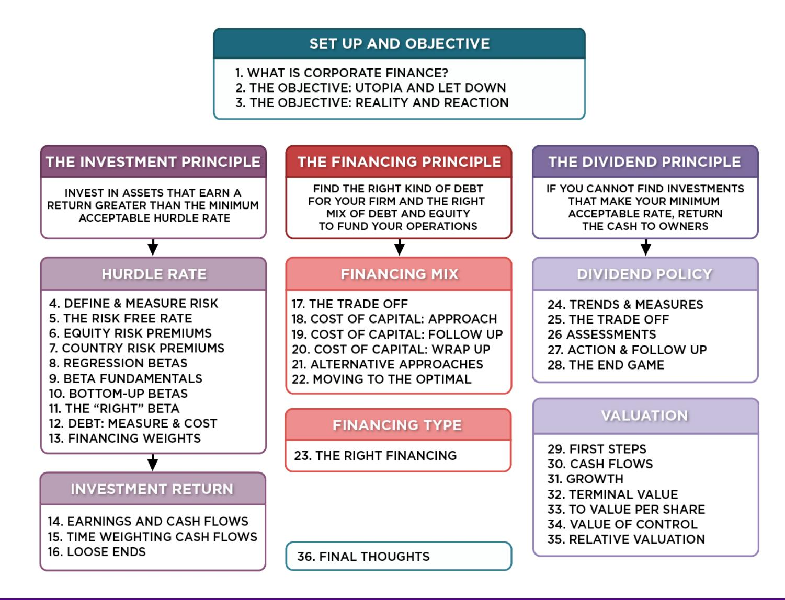
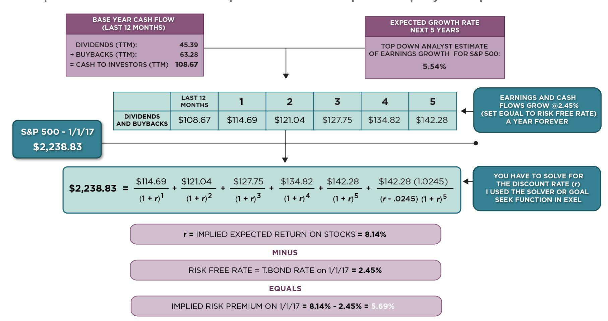
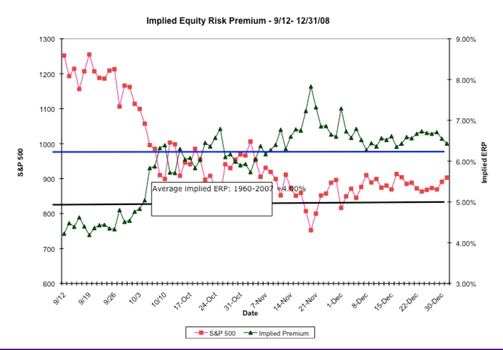
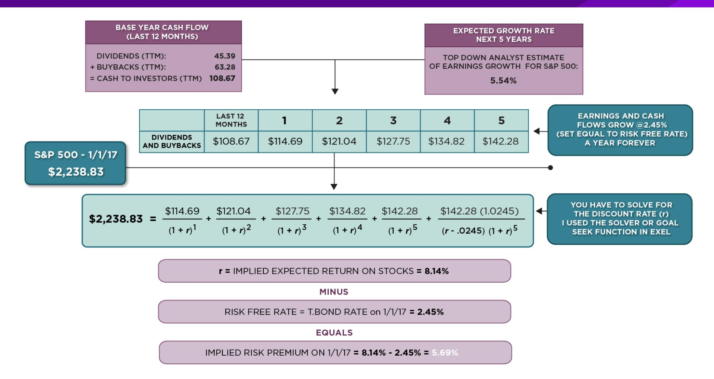
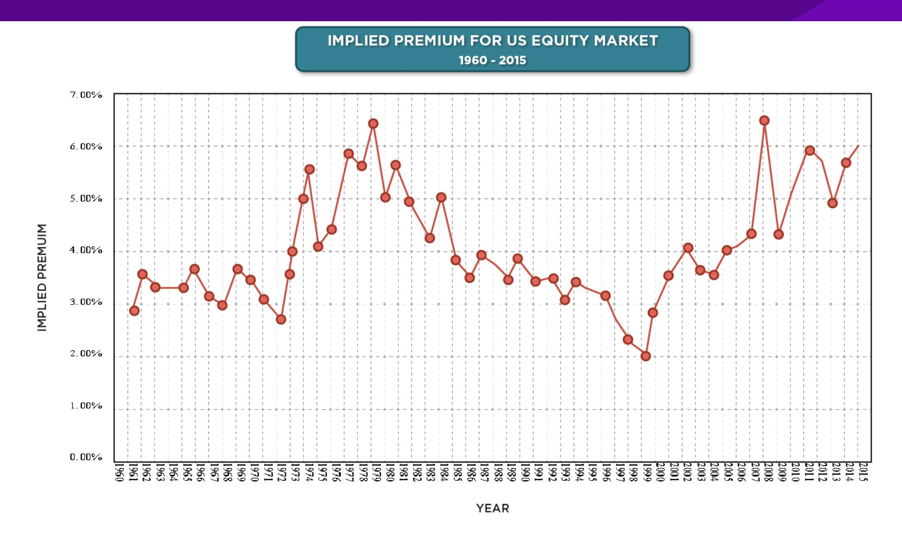
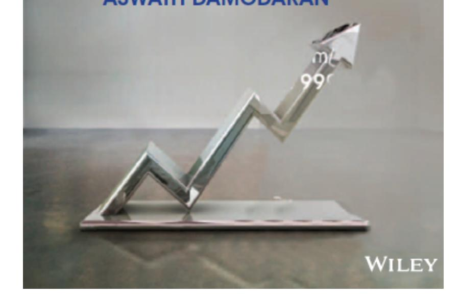

# **SESSION 7: COUNTRY RISK PREMIUMS**

Where there is opportunity, there is risk!

# **SESSION 7: COUNTRY RISK PREMIUMS**

#### **IMPLIED ERP IN NOVEMBER 2013: WATCH WHAT I PAY, NOT WHAT I SAY..**

- If you can observe what investors are willing to pay for stocks, you can back out an expected return from that price and an implied equity risk premium.

# **THE BOTTOM LINE ON EQUITY RISK PREMIUMS IN NOVEMBER 2013**

- Mature Markets: In November 2013, the number that we chose to use as the equity risk premium for all mature markets was 5.5%. This was set equal to the implied premium at that point in time and it was much higher than the historical risk premium of 4.20% prevailing then (1928-2012 period).

- For emerging markets, we will use the melded default spread approach (where default spreads are scaled up to reflect additional equity risk) to come up with the additional risk premium that we will add to the mature market premium. Thus, markets in countries with lower sovereign ratings will have higher risk premiums that 5.5%.

Emerging Market ERP = 5.5% + Country Default Spread\* (
$$\frac{\sigma_{\text{Equity}}}{\sigma_{\text{Country Bond}}}$$
)

|           | Stocks - T. Bills | Arithmetic Average Stocks - T. Bonds | Stocks - T. Bills | Geometric Average Stocks - T. Bonds |
|-----------|-------------------|--------------------------------------|-------------------|-------------------------------------|
| 1928-2012 | 7.65%             | 5.88%                                | 5.74%             | 4.20%                               |
|           | 2.20%             | 2.33%                                |                   |                                     |
| 1962-2012 | 5.93%             | 3.91%                                | 4.60%             | 2.93%                               |
|           | 2.38%             | 2.66%                                |                   |                                     |
| 2002-2012 | 7.06%             | 3.08%                                | 5.38%             | 1.71%                               |
|           | 5.82%             | 8.11%                                |                   |                                     |

# **A COMPOSITE WAY OF ESTIMATING ERP FOR COUNTRIES**

- Step 1: Estimate an equity risk premium for a mature market. If your preference is for a forward looking, updated number, you can estimate an implied equity risk premium for the US (assuming that you buy into the contention that it is a mature market) o My estimate: In January 2014, my estimate for the implied premium in the US was 5%. That will also be my estimate for a mature market ERP.
- Step 2: Come up with a generic and measurable definition of a mature market. o My estimate: Any AAA rated country is mature.
- Step 3: Estimate the additional risk premium that you will charge for markets that are not mature. You have two choices: o The default spread for the country, estimated based either on sovereign ratings or the CDS market. o A scaled up default spread, where you adjust the default spread upwards for the additional risk in equity markets.

#### **ERP : NOV 2013**

| Country      | TRP    | CRP    |
|--------------|--------|--------|
| Angola       | 10.90% | 5.40%  |
| Benin        | 13.75% | 8.25%  |
| Botswana     | 7.15%  | 1.65%  |
| Burkina	Faso | 13.75% | 8.25%  |
| Cameroon     | 13.75% | 8.25%  |
| Cape	Verde   | 12.25% | 6.75%  |
| Egypt        | 17.50% | 12.00% |
| Gabon        | 10.90% | 5.40%  |
| Ghana        | 12.25% | 6.75%  |
| Kenya        | 12.25% | 6.75%  |
| Morocco      | 9.63%  | 4.13%  |
| Mozambique   | 12.25% | 6.75%  |
| Namibia      | 8.88%  | 3.38%  |
| Nigeria      | 10.90% | 5.40%  |
| Rwanda       | 13.75% | 8.25%  |
| Senegal      | 12.25% | 6.75%  |
| South	Africa | 8.05%  | 2.55%  |
| Tunisia      | 10.23% | 4.73%  |
| Uganda       | 12.25% | 6.75%  |
| Zambia       | 12.25% | 6.75%  |
| Africa       | 11.22% | 5.82%  |

| Argentina     | 15.63% | 10.13% |
|---------------|--------|--------|
| Belize        | 19.75% | 14.25% |
| Bolivia       | 10.90% | 5.40%  |
| Brazil        | 8.50%  | 3.00%  |
| Chile         | 6.70%  | 1.20%  |
| Colombia      | 8.88%  | 3.38%  |
| Costa	Rica    | 8.88%  | 3.38%  |
| Ecuador       | 17.50% | 12.00% |
| El	Salvador   | 10.90% | 5.40%  |
| Guatemala     | 9.63%  | 4.13%  |
| Honduras      | 13.75% | 8.25%  |
| Mexico        | 8.05%  | 2.55%  |
| Nicaragua     | 15.63% | 10.13% |
| Panama        | 8.50%  | 3.00%  |
| Paraguay      | 10.90% | 5.40%  |
| Peru          | 8.50%  | 3.00%  |
| Suriname      | 10.90% | 5.40%  |
| Uruguay       | 8.88%  | 3.38%  |
| Venezuela     | 12.25% | 6.75%  |
| Latin	America | 9.44%  | 3.94%  |

| Canada                   | 5.50% | 0.00% |
|--------------------------|-------|-------|
| United	States	of	America | 5.50% | 0.00% |
| North	America            | 5.50% | 0.00% |

| Andorra        | 7.45%  | 1.95%  |
|----------------|--------|--------|
| Austria        | 5.50%  | 0.00%  |
| Belgium        | 6.70%  | 1.20%  |
| Cyprus         | 22.00% | 16.50% |
| Denmark        | 5.50%  | 0.00%  |
| Finland        | 5.50%  | 0.00%  |
| France         | 5.95%  | 0.45%  |
| Germany        | 5.50%  | 0.00%  |
| Greece         | 15.63% | 10.13% |
| Iceland        | 8.88%  | 3.38%  |
| Ireland        | 9.63%  | 4.13%  |
| Italy          | 8.50%  | 3.00%  |
| Liechtenstein  | 5.50%  | 0.00%  |
| Luxembourg     | 5.50%  | 0.00%  |
| Malta          | 7.45%  | 1.95%  |
| Netherlands    | 5.50%  | 0.00%  |
| Norway         | 5.50%  | 0.00%  |
| Portugal       | 10.90% | 5.40%  |
| Spain          | 8.88%  | 3.38%  |
| Sweden         | 5.50%  | 0.00%  |
| Switzerland    | 5.50%  | 0.00%  |
| Turkey         | 8.88%  | 3.38%  |
| United	Kingdom | 5.95%  | 0.45%  |
| Western	Europe | 6.72%  | 1.22%  |

| Albania            | 12.25% | 6.75%  |
|--------------------|--------|--------|
| Armenia            | 10.23% | 4.73%  |
| Azerbaijan         | 8.88%  | 3.38%  |
| Belarus            | 15.63% | 10.13% |
| Bosnia             | 15.63% | 10.13% |
| Bulgaria           | 8.50%  | 3.00%  |
| Croatia            | 9.63%  | 4.13%  |
| Czech	Republic     | 6.93%  | 1.43%  |
| Estonia            | 6.93%  | 1.43%  |
| Georgia            | 10.90% | 5.40%  |
| Hungary            | 9.63%  | 4.13%  |
| Kazakhstan         | 8.50%  | 3.00%  |
| Latvia             | 8.50%  | 3.00%  |
| Lithuania          | 8.05%  | 2.55%  |
| Macedonia          | 10.90% | 5.40%  |
| Moldova            | 15.63% | 10.13% |
| Montenegro         | 10.90% | 5.40%  |
| Poland             | 7.15%  | 1.65%  |
| Romania            | 8.88%  | 3.38%  |
| Russia             | 8.05%  | 2.55%  |
| Serbia             | 10.90% | 5.40%  |
| Slovakia           | 7.15%  | 1.65%  |
| Slovenia           | 9.63%  | 4.13%  |
| Ukraine            | 15.63% | 10.13% |
| E.	Europe	&	Russia | 8.60%  | 3.10%  |

| Bangladesh  | 10.90% | 5.40%  |
|-------------|--------|--------|
| Cambodia    | 13.75% | 8.25%  |
| China       | 6.94%  | 1.44%  |
| Fiji        | 12.25% | 6.75%  |
| Hong	Kong   | 5.95%  | 0.45%  |
| India       | 9.10%  | 3.60%  |
| Indonesia   | 8.88%  | 3.38%  |
| Japan       | 6.70%  | 1.20%  |
| Korea       | 6.70%  | 1.20%  |
| Macao       | 6.70%  | 1.20%  |
| Malaysia    | 7.45%  | 1.95%  |
| Mauritius   | 8.05%  | 2.55%  |
| Mongolia    | 12.25% | 6.75%  |
| Pakistan    | 17.50% | 12.00% |
| Papua	NG    | 12.25% | 6.75%  |
| Philippines | 9.63%  | 4.13%  |
| Singapore   | 5.50%  | 0.00%  |
| Sri	Lanka   | 12.25% | 6.75%  |
| Taiwan      | 6.70%  | 1.20%  |
| Thailand    | 8.05%  | 2.55%  |
| Vietnam     | 13.75% | 8.25%  |
| Asia        | 7.27%  | 1.77%  |

| Australia      | 5.50%  | 0.00% |
|----------------|--------|-------|
| Cook	Islands   | 12.25% | 6.75% |
| New	Zealand    | 5.50%  | 0.00% |
| Australia	&	NZ | 5.00%  | 0.00% |

*Black #: Total ERP*

*Red #: Country risk premium*

*AVG: GDP weighted average*

| Bahrain              | 8.05%  | 2.55% |
|----------------------|--------|-------|
| Israel               | 6.93%  | 1.43% |
| Jordan               | 12.25% | 6.75% |
| Kuwait               | 6.40%  | 0.90% |
| Lebanon              | 12.25% | 6.75% |
| Oman                 | 6.93%  | 1.43% |
| Qatar                | 6.40%  | 0.90% |
| Saudi	Arabia         | 6.70%  | 1.20% |
| United	Arab	Emirates | 6.40%  | 0.90% |
| Middle	East          | 6.88%  | 1.38% |

# **ESTIMATING ERP FOR DISNEY: NOVEMBER 2013**

- Incorporation: The conventional practice on equity risk premiums is to estimate an ERP based upon where a company is incorporated. Thus, the cost of equity for Disney would be computed based on the US equity risk premium, because it is a US company, and the Brazilian ERP would be used for Vale, because it is a Brazilian company.
- Operations: The more sensible practice on equity risk premium is to estimate an ERP based upon where a company operates. For Disney in 2013:

| REGION                  | REVENUES      | TOTAL ERP    |
|-------------------------|---------------|--------------|
| <b>USA &amp; CANADA</b> | <b>82.01%</b> | <b>5.50%</b> |
| <b>EUROPE</b>           | <b>11.64%</b> | <b>6.72%</b> |
| <b>ASIA/PACIFIC</b>     | <b>6.02%</b>  | <b>7.27%</b> |
| <b>LATIN AMERICA</b>    | <b>0.33%</b>  | <b>9.44%</b> |
| <b>DISNEY</b>           | <b>100%</b>   | <b>5.76%</b> |

## **ERP FOR COMPANIES: NOVEMBER 2013**

In November 2013, the mature market premium used was 5.5%

| COMPANY              | REGION                | WEIGHT       | ERP          |
|----------------------|-----------------------|--------------|--------------|
| <b>BOOKSCAPE</b>     | <b>U.S.</b>           | <b>100%</b>  | <b>5.50%</b> |
| <b>VALE</b>          | U.S. & CANADA         | 4.90%        | 5.50%        |
|                      | BRAZIL                | 16.90%       | 8.50%        |
|                      | REST OF LATIN AMERICA | 1.70%        | 10.09%       |
|                      | CHINA                 | 37.00%       | 6.94%        |
|                      | JAPAN                 | 10.30%       | 6.70%        |
|                      | REST OF ASIA          | 8.50%        | 8.61%        |
|                      | EUROPE                | 17.20%       | 6.72%        |
|                      | REST OF WORLD         | 3.50%        | 10.06%       |
| <b>COMPANY</b>       | <b>100%</b>           | <b>7.38%</b> |              |
| <b>TATA</b>          | INDIA                 | 23.90%       | 9.10%        |
|                      | CHINA                 | 23.60%       | 6.94%        |
|                      | U.K.                  | 11.90%       | 5.95%        |
|                      | U.S.                  | 10.00%       | 5.50%        |
|                      | EUROPE                | 11.70%       | 6.85%        |
|                      | REST OF WORLD         | 18.90%       | 6.98%        |
|                      | <b>COMPANY</b>        | <b>100%</b>  | <b>7.19%</b> |
| <b>BAIDU</b>         | <b>CHINA</b>          | <b>100%</b>  | <b>6.94%</b> |
| <b>Deutsche Bank</b> | GERMANY               | 35.93%       | 5.50%        |
|                      | U.S. & CANADA         | 24.72%       | 5.50%        |
|                      | REST OF EUROPE        | 28.67%       | 7.02%        |
|                      | ASIA                  | 10.68%       | 7.27%        |
|                      | SOUTH AMERICA         | 0.00%        | 9.44%        |
|                      | <b>COMPANY</b>        | <b>100%</b>  | <b>6.12%</b> |

#### **THE ANATOMY OF A CRISIS: IMPLIED ERP FROM SEPTEMBER 12, 2008 TO JANUARY 1, 2009**

## **AN UPDATED EQUITY RISK PREMIUM: JANUARY 2017**

### **IMPLIED PREMIUMS IN THE US: 1960-2016**

#### **ERP : JAN 2017**

*Black #: Total ERP*

*Red #: Country risk premium*

| Albania                | 12.09%       | <b>6.40%</b>        |
|------------------------|--------------|---------------------|
| Armenia                | 12.09%       | <b>6.40%</b>        |
| Azerbaijan             | 9.24%        | <b>3.55%</b>        |
| Belarus                | 16.34%       | <b>10.65%</b>       |
| Bosnia and Hercegovina | 14.93%       | <b>9.24%</b>        |
| Bulgaria               | 8.40%        | <b>2.71%</b>        |
| Croatia                | 9.96%        | <b>4.27%</b>        |
| Czech Republic         | 6.69%        | <b>1.00%</b>        |
| Estonia                | 6.69%        | <b>1.00%</b>        |
| Georgia                | 10.81%       | <b>5.12%</b>        |
| Hungary                | 8.81%        | <b>3.12%</b>        |
| Kazakhstan             | 8.81%        | <b>3.12%</b>        |
| Kyrgyzstan             | 13.51%       | <b>7.82%</b>        |
| Latvia                 | 7.40%        | <b>1.71%</b>        |
| Lithuania              | 7.40%        | <b>1.71%</b>        |
| Macedonia              | 10.81%       | <b>5.12%</b>        |
| Moldova                | 14.93%       | <b>9.24%</b>        |
| Montenegro             | 12.09%       | <b>6.40%</b>        |
| Poland                 | 6.90%        | <b>1.21%</b>        |
| Romania                | 8.81%        | <b>3.12%</b>        |
| Russia                 | 9.24%        | <b>3.55%</b>        |
| Serbia                 | 12.09%       | <b>6.40%</b>        |
| Slovakia               | 6.90%        | <b>1.21%</b>        |
| Slovenia               | 8.81%        | <b>3.12%</b>        |
| Ukraine                | 19.89%       | <b>14.20%</b>       |
| <b>E.Europe</b>        | <b>9.09%</b> | <b><b>3.40%</b></b> |

| Andorra     | 8.81%  | 3.12%  | Jersey          | 6.26%        | 0.57%        |
|-------------|--------|--------|-----------------|--------------|--------------|
| Austria     | 6.26%  | 0.57%  | Liechtenstein   | 5.69%        | 0.00%        |
| Belgium     | 6.55%  | 0.86%  | Luxembourg      | 5.69%        | 0.00%        |
| Cyprus      | 12.09% | 0.40%  | Malta           | 7.40%        | 1.71%        |
| Denmark     | 5.69%  | 0.00%  | Netherlands     | 5.69%        | 0.00%        |
| Finland     | 6.26%  | 0.57%  | Norway          | 5.69%        | 0.00%        |
| France      | 6.39%  | 0.70%  | Portugal        | 9.24%        | 3.55%        |
| Germany     | 5.69%  | 0.00%  | Spain           | 8.40%        | 2.71%        |
| Greece      | 19.89% | 14.20% | Sweden          | 5.69%        | 0.00%        |
| Guernsey    | 6.26%  | 0.57%  | Switzerland     | 5.69%        | 0.00%        |
| Iceland     | 7.40%  | 1.71%  | Turkey          | 9.24%        | 3.55%        |
| Ireland     | 7.40%  | 1.71%  | UK              | 6.26%        | 0.57%        |
| Isle of Man | 6.26%  | 0.57%  | <b>W.Europe</b> | <b>6.81%</b> | <b>1.17%</b> |
| Italy       | 8.40%  | 2.71%  |                 |              |              |

|   | Bangladesh       | 10.81%       | 5.12%        |
|----------------|------------------|--------------|--------------|
|   | Cambodia         | 13.51%       | 7.82%        |
|   | China            | 6.55%        | 0.86%        |
|   | Fiji             | 12.09%       | 6.40%        |
|   | Hong Kong        | 6.26%        | 0.57%        |
|   | India            | 8.81%        | 3.12%        |
|   | Indonesia        | 8.81%        | 3.12%        |
|   | Japan            | 6.69%        | 1.00%        |
|   | Korea            | 6.39%        | 0.70%        |
|   | Macao            | 6.55%        | 0.86%        |
|   | Malaysia         | 7.40%        | 1.71%        |
|   | Mauritius        | 7.95%        | 2.26%        |
|   | Mongolia         | 16.34%       | 10.65%       |
|   | Pakistan         | 14.93%       | 9.24%        |
|   | Papua New Guinea | 13.51%       | 7.82%        |
|   | Philippines      | 8.40%        | 2.71%        |
|   | Singapore        | 5.69%        | 0.00%        |
|   | Sri Lanka        | 12.09%       | 6.40%        |
|   | Taiwan           | 6.55%        | 0.86%        |
|   | Thailand         | 7.95%        | 2.26%        |
|   | Vietnam          | 12.09%       | 6.40%        |
|   | Asia             | <b>7.12%</b> | <b>1.43%</b> |

| Argentina            | 14.93%        | 9.24%        |
|----------------------|---------------|--------------|
| Belize               | 18.48%        | 12.79%       |
| Bolivia              | 10.81%        | 5.12%        |
| Brazil               | 9.96%         | 4.27%        |
| Chile                | 6.55%         | 0.86%        |
| Colombia             | 8.40%         | 2.71%        |
| Costa Rica           | 9.24%         | 3.55%        |
| Ecuador              | 14.93%        | 9.24%        |
| El Salvador          | 14.93%        | 9.24%        |
| Guatemala            | 9.24%         | 3.55%        |
| Honduras             | 13.51%        | 7.82%        |
| Mexico               | 7.40%         | 1.71%        |
| Nicaragua            | 13.51%        | 7.82%        |
| Panama               | 8.40%         | 2.71%        |
| Paraguay             | 9.24%         | 3.55%        |
| Peru                 | 7.40%         | 1.71%        |
| Suriname             | 12.09%        | 6.40%        |
| Uruguay              | 8.40%         | 2.71%        |
| Venezuela            | 19.89%        | 14.20%       |
| <b>Latin America</b> | <b>10.11%</b> | <b>4.42%</b> |

*AVG: GDP weighted average*

| Country       | ERP    | CRP           | Country         | ERP    | CRP           |
|---------------|--------|---------------|-----------------|--------|---------------|
| Algeria       | 13.72% | <b>7.47%</b>  | Malawi          | 17.24% | <b>10.99</b>  |
| Brunei        | 9.75%  | <b>3.50%</b>  | Mali            | 13.90% | <b>7.65%</b>  |
| Gambia        | 13.72% | <b>7.47%</b>  | Myanmar         | 13.72% | <b>7.47%</b>  |
| Guinea        | 20.00% | <b>13.75%</b> | Niger           | 17.24% | <b>10.99%</b> |
| Guinea-Bissau | 12.48% | <b>6.23%</b>  | Sierra Leone    | 16.61% | <b>10.36%</b> |
| Guyana        | 12.48% | <b>6.23%</b>  | Somalia         | 20.00% | <b>13.75%</b> |
| Haiti         | 16.61% | <b>10.36%</b> | Sudan           | 20.00% | <b>13.75%</b> |
| Iran          | 11.22% | <b>4.97%</b>  | Syria           | 20.00% | <b>13.75%</b> |
| Korea, D.P.R. | 17.24% | <b>10.99%</b> | Tanzania        | 13.90% | <b>7.65%</b>  |
| Liberia       | 17.24% | <b>10.99%</b> | Togo            | 13.72% | <b>7.47%</b>  |
| Libya         | 20.00% | <b>13.75%</b> | Yemen, Republic | 17.24% | <b>10.99%</b> |
| Madagascar    | 12.48% | <b>6.23%</b>  | Zimbabwe        | 17.24% | <b>10.99%</b> |

|   | Bahrain              | 9.96%        | 4.72%        |
|----------------|----------------------|--------------|--------------|
|   | Iraq                 | 14.94%       | 9.25%        |
|   | Israel               | 6.69%        | 1.00%        |
|   | Jordan               | 12.69%       | 4.07%        |
|   | Kuwait               | 6.40%        | 7.71%        |
|   | Lebanon              | 13.51%       | 7.82%        |
|   | Oman                 | 7.96%        | 2.27%        |
|   | Qatar                | 6.40%        | 0.71%        |
|   | Ras Al Khaimah       | 6.90%        | 1.18%        |
|   | Saudi Arabia         | 6.69%        | 1.00%        |
|   | Sharjah              | 7.40%        | 1.71%        |
|   | United Arab Emirates | 6.40%        | 0.71%        |
|   | Middle East          | <b>7.50%</b> | <b>1.18%</b> |

| Caribbean | 13.81% | <b>8.12%</b> |
|-----------|--------|--------------|
|-----------|--------|--------------|

|   | Canada        | 5.69% | 0.00% |
|----------------|---------------|-------|-------|
|   | USA           | 5.69% | 0.00% |
|   | North America | 5.69% | 0.00% |

| <b>Australia</b>          | <b>5.59%</b> | <b>0.00%</b> |
|---------------------------|--------------|--------------|
| Cook Islands              | 12.09%       | <b>6.40%</b> |
| New Zealand               | 5.69%        | <b>0.00%</b> |
| <b>Australia &amp; NZ</b> | <b>5.70%</b> | <b>0.01%</b> |

# 6 **APPLICATION TEST: ESTIMATING A MARKET RISK PREMIUM**

- For your company, get the geographical breakdown of revenues in the most recent year. Based upon this revenue breakdown and the most recent country risk premiums, estimate the equity risk premium that you would use for your company.
- This computation was based entirely on revenues. With your company, what concerns would you have about your estimate being too high or too low?

## Applied Corporate Finance

**Task** Estimate the ERP for your company (based on exposure)

Optional: Read Chapter 4