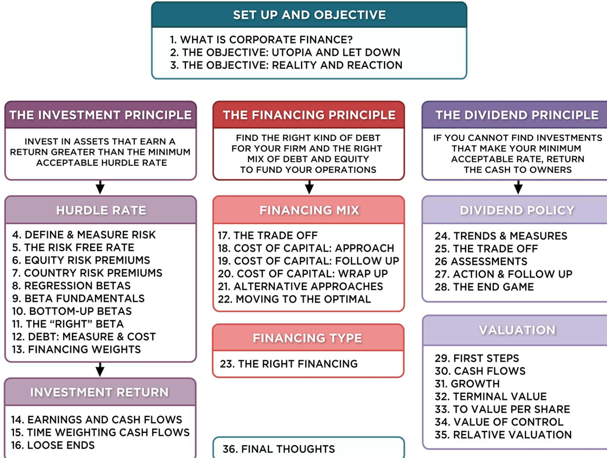
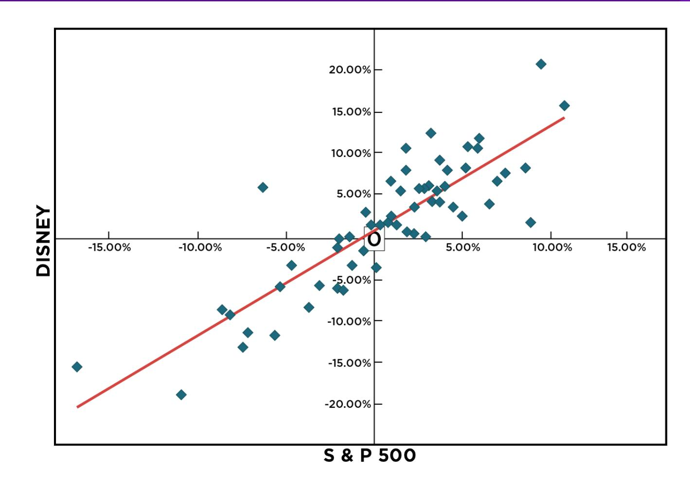
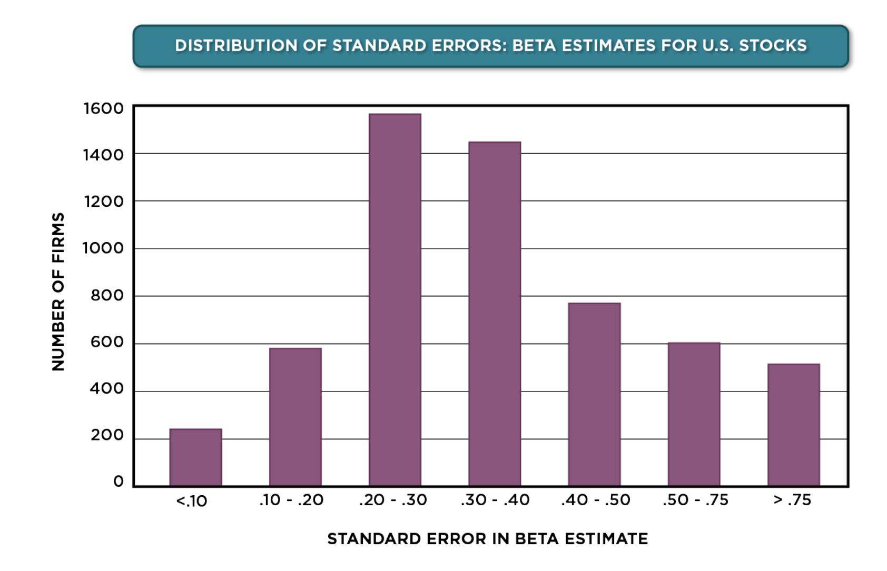
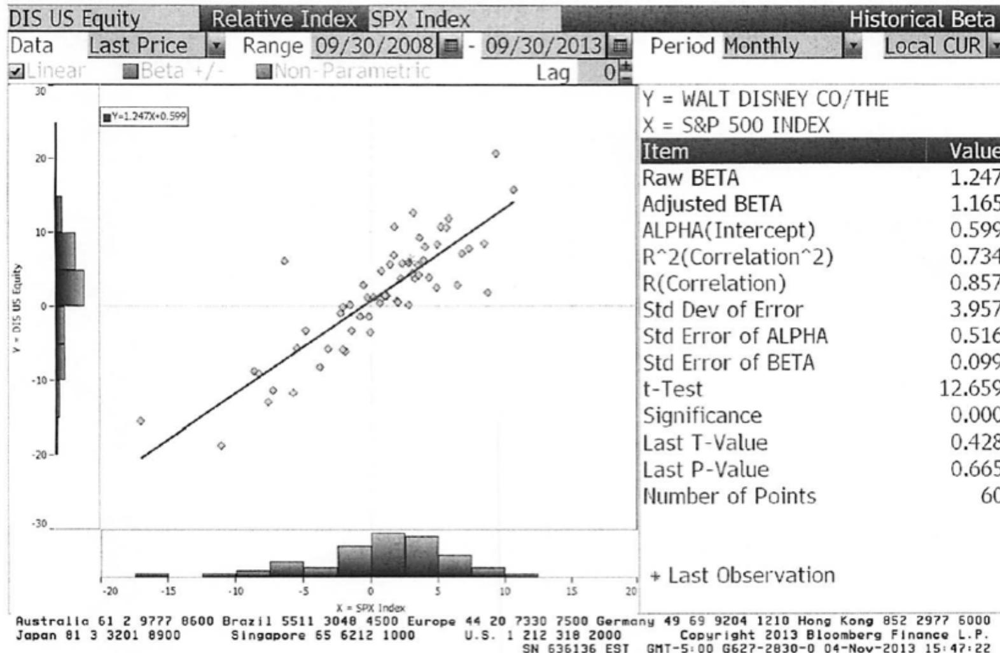

# **SESSION 08: REGRESSION BETAS**

Stocks are risky! Really!

# SESSION 08: REGRESSION BETAS

# **ESTIMATING BETA**

- The standard procedure for estimating betas is to regress stock returns (Rj) against market returns (Rm): Rj = a + b Rm where a is the intercept and b is the slope of the regression.
- The slope of the regression corresponds to the beta of the stock, and measures the riskiness of the stock.
- The R squared (R2) of the regression provides an estimate of the proportion of the risk (variance) of a firm that can be attributed to market risk. The balance (1 - R2) can be attributed to firm specific risk.

### **ESTIMATING PERFORMANCE**

- The intercept of the regression provides a simple measure of performance during the period of the regression, relative to the capital asset pricing model.

- If
- The difference between the intercept and Rf (1-b) is Jensen's alpha. If it is positive, your stock did perform better than expected during the period of the regression.

# **SETTING UP FOR THE ESTIMATION**

- Decide on an estimation period o Services use periods ranging from 2 to 5 years for the regression o Longer estimation period provides more data, but firms change. o Shorter periods can be affected more easily by significant firm-specific event that occurred during the period.
- Decide on a return interval daily, weekly, monthy o Shorter intervals yield more observations, but suffer from more noise. o Noise is created by stocks not trading and biases all betas towards one.
- Estimate returns (including dividends) on stock o Return = (PriceEnd - PriceBeginning + DividendsPeriod)/ PriceBeginning o Included dividends only in ex-dividend month
- Choose a market index, and estimate returns (inclusive of dividends) on the index for each interval for the period.

# **CHOOSING THE PARAMETERS: DISNEY**

- Period used: 5 years
- Return Interval = Monthly
- Market Index: S&P 500 Index.
- For instance, to calculate returns on Disney in December 2009, o Price for Disney at end of November 2009 = \$ 30.22 o Price for Disney at end of December 2009 = \$ 32.25 o Dividends during month = \$0.35 (It was an ex-dividend month) o Return =(\$32.25 - \$30.22 + \$ 0.35)/\$30.22= 7.88%
- To estimate returns on the index in the same month o Index level at end of November 2009 = 1095.63 o Index level at end of December 2009 = 1115.10 o Dividends on index in December 2009 = 1.683 o Return =(1115.1 – 1095.63+1.683)/ 1095.63 = 1.78%

### **DISNEY'S HISTORICAL BETA**

### **ANALYZING DISNEY'S PERFORMANCE**

- Intercept = 0.712% o This is an intercept based on monthly returns. Thus, it has to be compared to a monthly riskfree rate. o Between 2008 and 2013 § Average Annualized T.Bill rate = 0.50% § Monthly Riskfree Rate = 0.5%/12 = 0.042% § Riskfree Rate (1-Beta) = 0.042% (1-1.252) = -.0105%
- The Comparison is then between o Intercept versusRiskfree Rate (1 - Beta) o 0.712% versus0.0105% o Jensen's Alpha = 0.7122% - (-0.0105)% = 0.723%
- Disney did 0.723% better than expected, per month, between October 2008 and September 2013 o Annualized, Disney's annual excess return = (1.00723)12 -1= 9.02%
- This positive Jensen's alpha is a sign of good management at the firm. o True o False

# **ESTIMATING DISNEY'S BETA**

- Slope of the Regression of 1.25 is the beta
- Regression parameters are always estimated with error. The error is captured in the standard error of the beta estimate, which in the case of Disney is 0.10.
- Assume that I asked you what Disney's true beta is, after this regression. o What is your best point estimate? o What range would you give me, with 67% confidence? o What range would you give me, with 95% confidence?

#### **THE DIRTY SECRET OF "STANDARD ERROR"**

# **BREAKING DOWN DISNEY'S RISK**

- R Squared = 73%
- This implies that o 73% of the risk at Disney comes from market sources o 27%, therefore, comes from firm-specific sources
- The firm-specific risk is diversifiable and will not be rewarded.
- The R-squared for companies, globally, has increased significantly since 2008. Why might this be happening?
- What are the implications for investors?

# BETA ESTIMATION: USING A SERVICE (BLOOMBERG)

# **ESTIMATED EXPECTED RETURNS FOR DISNEY IN NOVEMBER 2013**

- Inputs to the expected return calculation o Disney's Beta = 1.25 o Riskfree Rate = 2.75% (U.S. ten-year T-Bond rate in November 2013) o Risk Premium = 5.76% (Based on Disney's operating exposure) Expected Return = Riskfree Rate + Beta (Risk Premium) = 2.75% + 1.25 (5.76%) = 9.95%

Expected Return = Riskfree Rate + Beta (Risk Premium)
$$= 2.75\% + 1.25 (5.76\%)$$

$$= 9.95\%$$

# **USE TO A POTENTIAL INVESTOR IN DISNEY**

- As a potential investor in Disney, what does this expected return of 9.95% tell you? o This is the return that I can expect to make in the long term on Disney, if the stock is correctly priced and the CAPM is the right model for risk, o This is the return that I need to make on Disney in the long term to break even on my investment in the stock o Both
- Assume now that you are an active investor and that your research suggests that an investment in Disney will yield 12.5% a year for the next 5 years. Based upon the expected return of 9.95%, you would o Buy the stock o Sell the stock

# **HOW MANAGERS USE THIS EXPECTED RETURN**

- Managers at Disney o need to make at least 9.95% as a return for their equity investors to break even. o this is the hurdle rate for projects, when the investment is analyzed from an equity standpoint
- In other words, Disney's cost of equity is 9.95%.
- What is the cost of not delivering this cost of equity?

# 6 **APPLICATION TEST: ANALYZING THE RISK REGRESSION**

- If you can get a beta regression page (or output) for your company against a market index, answer the following questions: o How well or badly did your stock do, relative to the market, during the period of the regression? o Intercept - (Riskfree Rate/n) (1- Beta) = Jensen's Alpha where n is the number of return periods in a year (12 if monthly; 52 if weekly) o What proportion of the risk in your stock is attributable to the market? What proportion is firm-specific? o What is the historical estimate of beta for your stock? What is the range on this estimate with 67% probability? With 95% probability? o Based upon this beta, what is your estimate of the required return on this stock? Riskless Rate + Beta \* Risk Premium

## Applied Corporate Finance

Optional: Read Chapter 4

**Task** Break down the beta regression for your company