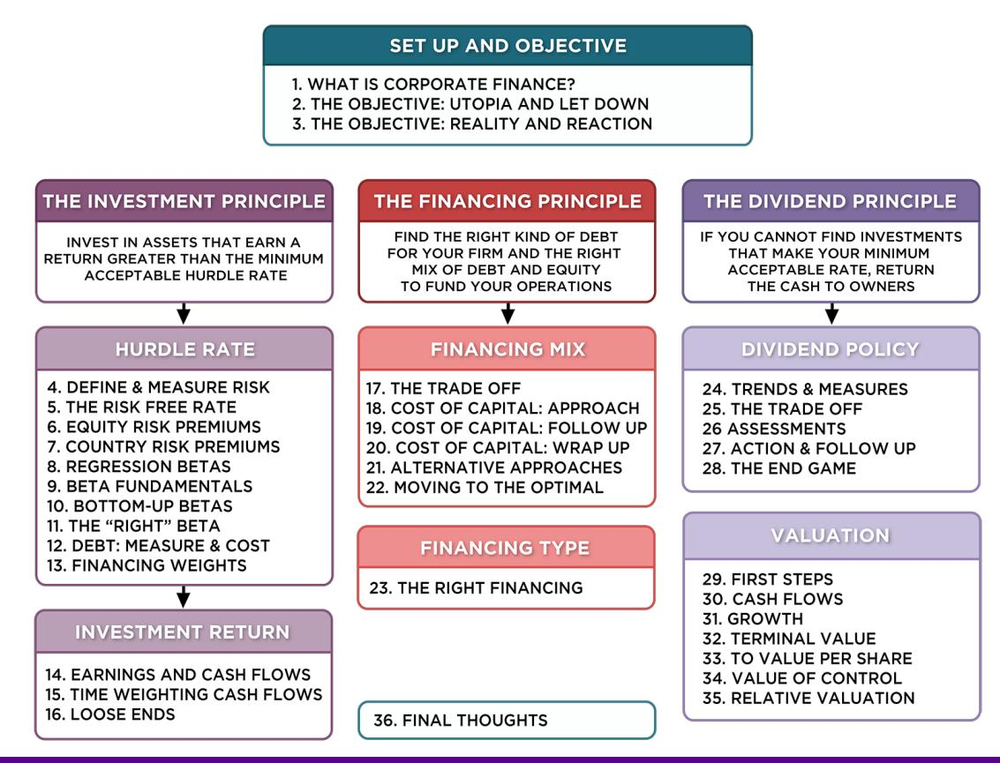
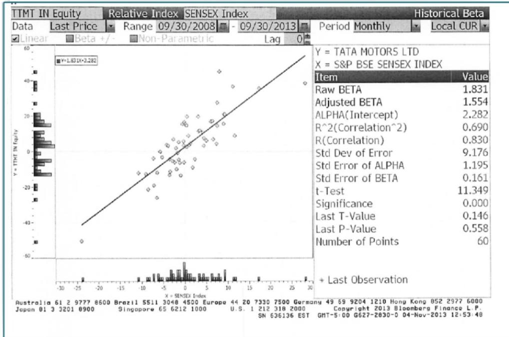
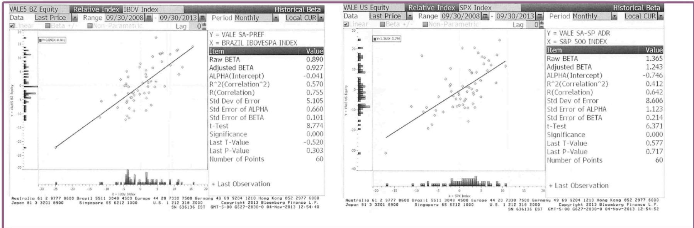
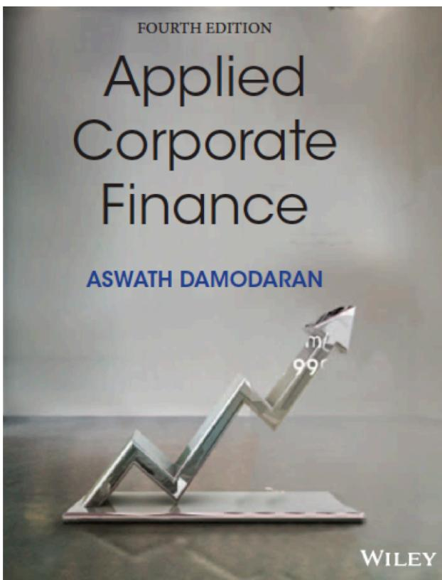

# **SESSION 9: BETA FUNDAMENTALS**

Your business choices determine your risk profile!

#### **SESSION 9: BETA FUNDAMENTALS**

# REGRESSION DIAGNOSTICS FOR TATA MOTORS

**BETA = 1.83  
67% RANGE  
1.67-1.99**

**69% MARKET RISK  
31% FIRM SPECIFIC**

**JENSEN'S  $\alpha$  = 2.28% - 4%/12 (1 - 1.83) = 2.56%**

**ANNUALIZED = (1 - 0.0256) 12 - 1 = 35.42%**

**AVERAGE MONTHLY RISKFREE RATE (2008 - 13) = 4%**

**EXPECTED RETURN (IN RUPEES)  
= RISKFREE RATE + BETA\*RISK PREMIUM**

**= 6.57% + 1.83 (7.19%) = 19.73%**

# BETA ESTIMATION AND INDEX CHOICE: VALE

## REGRESSION DIAGNOSTICS FOR VALE

#### **DEUTSCHE BANK AND BAIDU: INDEX EFFECTS ON RISK PARAMETERS**

- For Deutsche Bank, a widely held European stock, we tried both the DAX (German index) and the FTSE European index.

|                       | <i>DAX</i> | <i>FTSE Euro 100</i> |
|-----------------------|------------|----------------------|
| Intercept             | -0.90%     | -0.15%               |
| Beta                  | 1.58       | 1.98                 |
| Std Error of beta     | 0.21       | 0.29                 |
| <i>R</i> 2 | 51%        | 29%                  |

- For Baidu, a NASDAQ listed stock, we ran regressions against both the S&P 500 and the NASDAQ.

|                      | S&P 500 | NASDAQ |
|----------------------|---------|--------|
| Intercept            | 2.84%   | 2.15%  |
| Beta                 | 1.63    | 1.65   |
| Std Error of beta    | 0.28    | 0.23   |
| <i>R2</i> | 37%     | 47%    |

# BETA: EXPLORING FUNDAMENTALS

### **DETERMINANT 1: PRODUCT TYPE**

- Industry Effects: The beta value for a firm depends upon the sensitivity of the demand for its products and services and of its costs to macroeconomic factors that affect the overall market. o Cyclical companies have higher betas than non-cyclical firms o Firms which sell more discretionary products will have higher betas than firms that sell less discretionary products

### **DETERMINANT 2: OPERATING LEVERAGE EFFECTS**

- Operating leverage refers to the proportion of the total costs of the firm that are fixed.
- Other things remaining equal, higher operating leverage results in greater earnings variability which in turn results in higher betas.

## **MEASURES OF OPERATING LEVERAGE**

- Fixed Costs Measure = Fixed Costs / Variable Costs o This measures the relationship between fixed and variable costs. The higher the proportion, the higher the operating leverage.
- EBIT Variability Measure = % Change in EBIT / % Change in Revenues o This measures how quickly the earnings before interest and taxes changes as revenue changes. The higher this number, the greater the operating leverage.

#### **DISNEY'S OPERATING LEVERAGE: 1987 - 2013**

| Year                  | Net Sales | % Change in Sales | EBIT    | % Change in EBIT |
|-----------------------|-----------|-------------------|---------|------------------|
| 1987                  | \$2,877   |                   | \$756   |                  |
| 1988                  | \$3,438   | 19.50%            | \$848   | 12.17%           |
| 1989                  | \$4,594   | 33.62%            | \$1,177 | 38.80%           |
| 1990                  | \$5,844   | 27.21%            | \$1,368 | 16.23%           |
| 1991                  | \$6,182   | 5.78%             | \$1,124 | -17.84%          |
| 1992                  | \$7,504   | 21.38%            | \$1,287 | 14.50%           |
| 1993                  | \$8,529   | 13.66%            | \$1,560 | 21.21%           |
| 1994                  | \$10,055  | 17.89%            | \$1,804 | 15.64%           |
| 1995                  | \$12,112  | 20.46%            | \$2,262 | 25.39%           |
| 1996                  | \$18,739  | 54.71%            | \$3,024 | 33.69%           |
| 1997                  | \$22,473  | 19.93%            | \$3,945 | 30.46%           |
| 1998                  | \$22,976  | 2.24%             | \$3,843 | -2.59%           |
| 1999                  | \$23,435  | 2.00%             | \$3,580 | -6.84%           |
| 2000                  | \$25,418  | 8.46%             | \$2,525 | -29.47%          |
| 2001                  | \$25,172  | -0.97%            | \$2,832 | 12.16%           |
| 2002                  | \$25,329  | 0.62%             | \$2,384 | -15.82%          |
| 2003                  | \$27,061  | 6.84%             | \$2,713 | 13.80%           |
| 2004                  | \$30,752  | 13.64%            | \$4,048 | 49.21%           |
| 2005                  | \$31,944  | 3.88%             | \$4,107 | 1.46%            |
| 2006                  | \$33,747  | 5.64%             | \$5,355 | 30.39%           |
| 2007                  | \$35,510  | 5.22%             | \$6,829 | 27.53%           |
| 2008                  | \$37,843  | 6.57%             | \$7,404 | 8.42%            |
| 2009                  | \$36,149  | -4.48%            | \$5,697 | -23.06%          |
| 2010                  | \$38,063  | 5.29%             | \$6,726 | 18.06%           |
| 2011                  | \$40,893  | 7.44%             | \$7,781 | 15.69%           |
| 2012                  | \$42,278  | 3.39%             | \$8,863 | 13.91%           |
| 2013                  | \$45,041  | 6.54%             | \$9,450 | 6.62%            |
| <b>Average: 87-13</b> |           | <b>11.79%</b>     |         | <b>11.91%</b>    |
| <b>Average: 96-13</b> |           | <b>8.16%</b>      |         | <b>10.20%</b>    |

Average across entertainment companies = 1.35

Given Disney's operating leverage measures (1.01 or 1.25), would you expect Disney to have a higher or a lower beta than other entertainment companies?

- a) Higher
- b) Lower
- c) No Effect

### **DETERMINANT 3: FINANCIAL LEVERAGE**

- As firms borrow, they create fixed costs (interest payments) that make their earnings to equity investors more volatile.
- This increased earnings volatility which increases the equity beta.
- The beta of equity alone can be written as a function of the unlevered beta and the debt-equity ratio.
- bL = bu (1+ ((1-t)D/E))

Where:

o bL = Levered or Equity Beta D/E = Market value Debt to equity ratio

o bu = Unlevered or Asset Beta t = Marginal tax rate

• Earlier, we estimated the beta for Disney from a regression. Was that beta a levered or

unlevered beta?

a. Levered

b. Unlevered

## **EFFECTS OF LEVERAGE ON BETAS: DISNEY**

- The regression beta for Disney is 1.25. This beta is a levered beta (because it is based on stock prices, which reflect leverage) and the leverage implicit in the beta estimate is the average market debt equity ratio during the period of the regression (2008 to 2013)
- The average debt equity ratio during this period was 19.44%.
- The unlevered beta for Disney can then be estimated (using a marginal tax rate of 36.1%) o = Current Beta / (1 + (1 – tax rate) (Average Debt/Equity)) o = 1.25 / (1 + (1 – 0.361)(0.1944)) = 1.1119

## **DISNEY: BETA AND FINANCIAL LEVERAGE**

| <i>Debt to Capital</i> | <i>Debt/Equity Ratio</i> | <i>Beta</i> | <i>Effect of Leverage</i> |
|------------------------|--------------------------|-------------|---------------------------|
| 0.00%                  | 0.00%                    | 1.11        | 0.00                      |
| 10.00%                 | 11.11%                   | 1.1908      | 0.08                      |
| 20.00%                 | 25.00%                   | 1.29        | 0.18                      |
| 30.00%                 | 42.86%                   | 1.42        | 0.30                      |
| 40.00%                 | 66.67%                   | 1.59        | 0.47                      |
| 50.00%                 | 100.00%                  | 1.82        | 0.71                      |
| 60.00%                 | 150.00%                  | 2.18        | 1.07                      |
| 70.00%                 | 233.33%                  | 2.77        | 1.66                      |
| 80.00%                 | 400.00%                  | 3.95        | 2.84                      |
| 90.00%                 | 900.00%                  | 7.51        | 6.39                      |

## Applied Corporate Finance

Optional: Read Chapter 4

**Task** Evaluate the business risk, operating leverage and financial leverage for your company