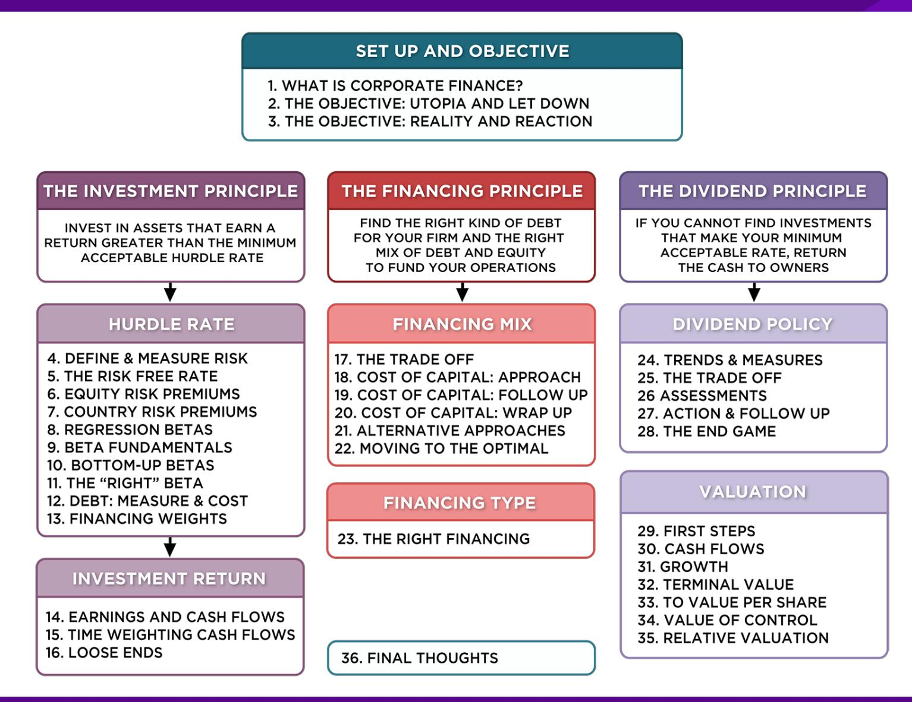
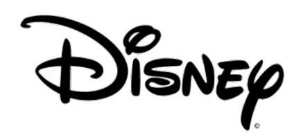
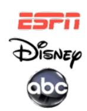
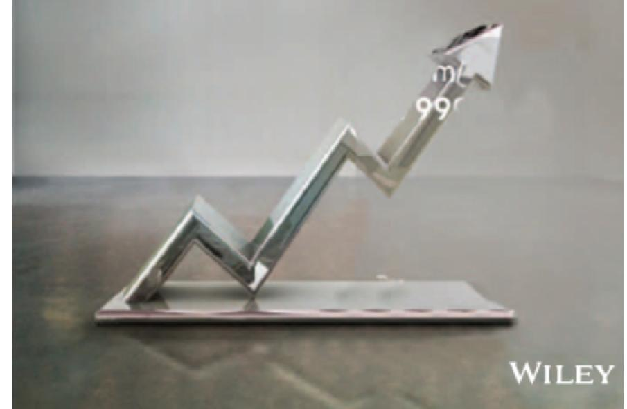

# **SESSION 10: BOTTOM-UP BETAS**

If you cannot find comparable companies, it is because you have not looked hard enough.

## **SESSION 10: BOTTOM-UP BETAS**

## **BETAS ARE WEIGHTED AVERAGES**

- The beta of a portfolio is always the market-value weighted average of the betas of the individual investments in that portfolio.
- Thus, o the beta of a mutual fund is the weighted average of the betas of the stocks and other investment in that portfolio o the beta of a firm after a merger is the market-value weighted average of the betas of the companies involved in the merger.

## **BOTTOM-UP VERSUS TOP-DOWN BETA**

- The top-down beta for a firm comes from a regression
- The bottom up beta can be estimated by doing the following: o Find out the businesses that a firm operates in o Find the unlevered betas of other firms in these businesses o Take a weighted (by sales or operating income) average of these unlevered betas o Lever up using the firm's debt/equity ratio
- The bottom up beta is a better estimate than the top down beta for the following reasons o The standard error of the beta estimate will be much lower o The betas can reflect the current (and even expected future) mix of businesses that the firm is in rather than the historical mix

### **DISNEY'S BUSINESSES: THE FINANCIAL BREAKDOWN (FROM 2013 ANNUAL REPORT)**

| <i>Business</i>      | <i>Revenues</i> | <i>Operating Income</i> | <i>D&amp;A</i> | <i>EBITDA</i> | <i>S, G &amp; A Costs</i> | <i>Cap Ex</i> | <i>Identifiable Assets</i> |
|----------------------|-----------------|-------------------------|----------------|---------------|---------------------------|---------------|----------------------------|
| Media Networks       | \$20,356        | \$6,818                 | \$251          | \$7,069       | \$2,768                   | \$263         | \$28,627                   |
| Parks & Resorts      | \$14,087        | \$2,220                 | \$1,370        | \$3,590       | \$1,960                   | \$2,110       | \$22,056                   |
| Studio Entertainment | \$5,979         | \$661                   | \$161          | \$822         | \$2,145                   | \$78          | \$14,750                   |
| Consumer Products    | \$3,555         | \$1,112                 | \$146          | \$1,258       | \$731                     | \$45          | \$7,506                    |
| Interactive          | \$1,064         | -\$87                   | \$44           | -\$43         | \$449                     | \$13          | \$2,311                    |

## **UNLEVERED BETAS FOR BUSINESSES**

| Business Comparable Firms Sample Size US firms in Media broadcasting | Median Beta | Median D/E | Media Tax Rate | Company Unlevered Beta | Media Cash/Firm Value | Business Unlevered Beta |
|----------------------------------------------------------------------|-------------|------------|----------------|------------------------|-----------------------|-------------------------|
| 26                                                                   | 1.43        | 71.09%     | 40.00%         | 1.0024                 | 2.80%                 | 1.0313                  |
| 20                                                                   | 0.87        | 46.76%     | 35.67%         | 0.6677                 | 4.95%                 | 0.7024                  |
| firms 10                                                             | 1.24        | 27.06%     | 40.00%         | 1.0668                 | 2.96%                 | 1.0993                  |
| 44                                                                   | 0.74        | 29.53%     | 25.00%         | 0.6034                 | 10.64%                | 0.6752                  |
| 33                                                                   | 1.03        | 3.26%      | 34.55%         | 1.0085                 | 17.25%                | 1.2187                  |

Unlevered Beta (1 – Cash/Firm Value)

#### **A CLOSER LOOK AT THE PROCESS: STUDIO ENTERTAINMENT BETAS**

| Company Name                              | Levered Beta | Market Cap  | Total Debt  | Firm Value   | Cash       | Cash/Firm Value | Enterprise Value | Marginal Tax Rate | Gross D/E Ratio | Unlevered Beta | Pure Play Beta | EV/Sales |
|-------------------------------------------|--------------|-------------|-------------|--------------|------------|-----------------|------------------|-------------------|-----------------|----------------|----------------|----------|
| SFX Entertainment Mass Hysteria           | 1.12         | 728.80      | \$98.89     | \$837.69     | \$143.60   | 17.14%          | \$694.09         | 40.00%            | 13.39%          | 1.04           | 1.25           | 11.20    |
| Entertainment                             | 1.19         | 0.24        | \$1.13      | \$1.37       | \$0.00     | 0.00%           | \$1.37           | 40.00%            | 477.94%         | .031           | 0.31           | 12.45    |
| Medient Studios                           | .093         | 3.21        | \$3.18      | \$6.39       | \$0.05     | 0.81%           | \$6.34           | 40.00%            | 99.07%          | 0.58           | 0.59           | 1.21     |
| POW! Entertainment                        | .094         | 3.97        | \$0.34      | \$4.31       | \$0.43     | 9.85%           | \$3.89           | 40.00%            | 8.65%           | 0.89           | 0.99           | 1.92     |
| MGM Holdings                              | 1.29         | 3631.70     | \$142.16    | \$3,773.86   | \$140.70   | 3.73%           | \$3,633.16       | 40.00%            | 3.91%           | 1.26           | 1.31           | 1.92     |
| Lions Gate Entertainment                  | 1.20         | 4719.60     | \$1,283.20  | \$6,002.80   | \$67.20    | 1.12%           | \$5,935.60       | 40.00%            | 27.19%          | 1.03           | 1.04           | 2.28     |
| DreamWorks Animation                      | 1.32         | 2730.00     | \$348.30    | \$3,078.30   | \$156.40   | 5.08%           | \$2,921.90       | 40.00%            | 12.76%          | 1.23           | 1.29           | 3.81     |
| Twenty-First Century Fox Independent Film | 1.28         | 77743.50    | \$20,943.00 | \$98,686.50  | \$6,681.00 | 6.77%           | \$92,005.50      | 40.00%            | 26.94%          | 1.10           | 1.18           | 3.20     |
| Development                               | 1.61         | 1.32        | \$0.96      | \$2.28       | \$0.05     | 2.20%           | \$2.23           | 40.00%            | 72.35%          | 1.12           | 1.15           | 3.37     |
| Odyssey Pictures Corp                     | 2.60         | 0.30        | \$1.64      | \$1.94       | \$0.00     | 0.10%           | \$1.94           | 40.00%            | 551.12%         | 0.60           | 0.60           | 2.90     |
| Average                                   | 1.35         |             |             |              |            | 4.68%           |                  | 40.00%            | 129.33%         | 0.92           | 0.97           | 4.43     |
| Aggregate                                 | 1.35         | \$89,572.64 | \$22,822.82 | \$112,395.45 | \$7,189.43 | 6.40%           | \$105,206.02     | 40.00%            | 25.48%          | 1.17           | 1.25           | 3.09     |
| Median                                    | 1.24         |             |             |              |            | 2.96%           |                  | 40.00%            | 27.06%          | 1.03           | 1.10           | 3.05     |

## **BACKING INTO A PURE PLAY BETA: STUDIO ENTERTAINMENT**

#### **The Median Movie Company**

| Movie Business | 97.04 Beta (movies) = 1.0093  | Debt   | 21.30 | Beta (debt) = 0      |
|----------------|-------------------------------|--------|-------|----------------------|
| Cash Business  | 2.96 Beta (cash) = 0.0000     | Equity | 78.70 | Beta (equity) = 1.24 |
| Movie Company  | 100.0 Beta (company) = 1.0668 |        |       |                      |

- 1. Start with the median regression beta (equity beta) of 1.24
- 2. Unlever the beta, using the media gross D/E ratio of 27.06%

Gross D/E Ratio = 21.30/78/70 = 27.06%

- 3. Take out the cash effect, using the median cash/value of 2.96%

(0.0296) (0) + (1 + 0.0296) (Beta of movie business) = 1.0668

Beta of movie business = 1.0668/(1-0.0296) = 1.0993

**Alternatively, you could have used the net debt to equity ratio**

Net D/E ratio = (21.30 – 2.96)/78.70 = 23.30%

Unlevered beta for movies = 1.24/ [1+ (1 – 0.4)(0.233)] = 1.0879

## **DISNEY'S UNLEVERED BETA: OPERATIONS & ENTIRE COMPANY**

| Business             | Revenues | EV/Sales | Value of  |         |        |              |            |
|----------------------|----------|----------|-----------|---------|--------|--------------|------------|
|                      |          |          |           |         | Beta   | Value        | Proportion |
| Media Networks       | \$20,356 | 3.27     | \$66,580  | 49.27%  | 1.0313 | \$66,579.81  | 49.27%     |
| Parks & Resorts      | \$14,087 | 3.24     | \$45,683  | 33.81%  | 0.7024 | \$45,682.80  | 33.81%     |
| Studio Entertainment | \$5,979  | 3.05     | \$18,234  | 13.49%  | 1.0993 | \$18,234.27  | 13.49%     |
| Consumer Products    | \$3,555  | 0.83     | \$2,952   | 2.18%   | 0.6752 | \$2,951.50   | 2.18%      |
| Interactive          | \$1,064  | 1.58     | \$1,684   | 1.25%   | 1.2187 | \$1,683.72   | 1.25%      |
| Disney Operations    | \$45,041 |          | \$135,132 | 100.00% | 0.9239 | \$135.132.11 |            |

Disney has \$3.93 billion in cash, invested in close to riskless assets (with a beta of zero). You can compute an unlevered beta for Disney as a company (inclusive of cash):

$$\begin{aligned} \beta_{\text{Disney}} &= \beta_{\text{Operating Assets}} \frac{\text{Value}_{\text{Operating Assets}}}{(\text{Value}_{\text{Operating Assets}} + \text{Value}_{\text{Cash}})} + \beta_{\text{Cash}} \frac{\text{Value}_{\text{Cash}}}{(\text{Value}_{\text{Operating Assets}} + \text{Value}_{\text{Cash}})} \\ &= 0.9239 \left( \frac{135,132}{(135,132 + 3,931)} \right) + 0.00 \left( \frac{3,931}{(135,132 + 3,931)} \right) = 0.8978 \end{aligned}$$

## **THE LEVERED BETA: DISNEY AND ITS DIVISIONS**

- To estimate the debt ratios for division, we allocate Disney's total debt (\$15,961 million) to its divisions based on identifiable assets.

| Business             | Identifiable Assets (2013) | Proportion of Debt | Value of Business | Allocated Debt | Estimated Equity | D/E Ratio |
|----------------------|----------------------------|--------------------|-------------------|----------------|------------------|-----------|
| Media Networks       | \$28,627                   | 38.04%             | \$66,580          | \$6,072        | \$60,508         | 10.03%    |
| Parks & Resorts      | \$22,056                   | 29.31%             | \$45,683          | \$4,678        | \$41,005         | 11.41%    |
| Studio Entertainment | \$14,750                   | 19.60%             | \$18,234          | \$3,129        | \$3,129          | 20.71%    |
| Consumer Products    | \$7,506                    | 9.97%              | \$2,952           | \$1,592        | \$1,359          | 117.11%   |
| Interactive          | \$2,311                    | 3.07%              | \$1,684           | \$490          | \$1,194          | 41.07%    |
| Disney               | \$75,250                   | 100.00%            |                   | \$15,961       | \$121,878        | 13.10%    |

| Business             | Unlevered Beta | Value of Business | D/E Ratio | Levered Beta | Cost of Equity |
|----------------------|----------------|-------------------|-----------|--------------|----------------|
| Media Networks       | 1.0313         | \$66,580          | 10.03%    | 1.0975       | 9.07%          |
| Parks & Resorts      | 0.7024         | \$45,683          | 11.41%    | 0.7537       | 7.09%          |
| Studio Entertainment | 1.0993         | \$18,234          | 20.71%    | 1.2448       | 9.92%          |
| Consumer Products    | 0.6752         | \$2,952           | 117.11%   | 1.1805       | 9.55%          |
| Interactive          | 1.2187         | \$1,684           | 41.07%    | 1.5385       | 11.61%         |
| Disney               | 0.9239         | \$135,132         | 13.10%    | 1.0012       | 8.52%          |

- We use the allocated debt to compute D/E ratios and levered betas.

## **DISCUSSION ISSUE**

- Assume now that you are the CFO of Disney. The head of the movie business has come to you with a new big budget movie that he would like you to fund. He claims that his analysis of the movie indicates that it will generate a return on equity of 9.5%. Would you fund it?
  - a. Yes. It is higher than the cost of equity for Disney as a company
  - b. No. It is lower than the cost of equity for the movie business.
- What are the broader implications of your choice?

## Applied Corporate Finance

Optional: Read Chapter 4

**Task** Estimate a bottom-up beta for your company