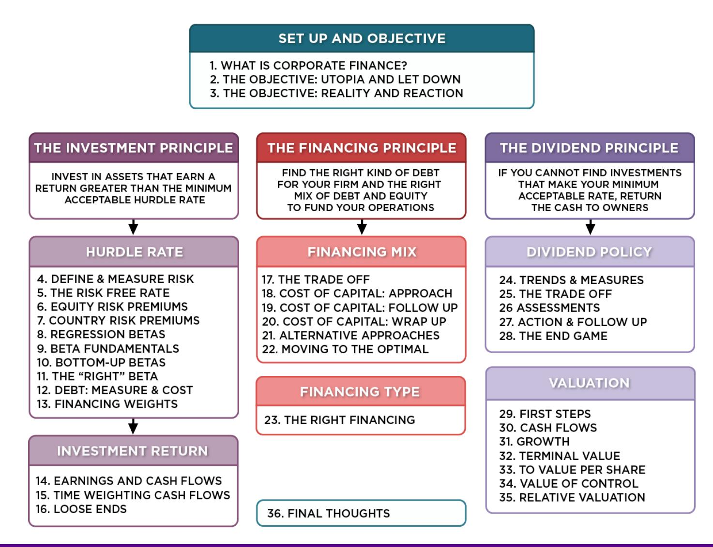
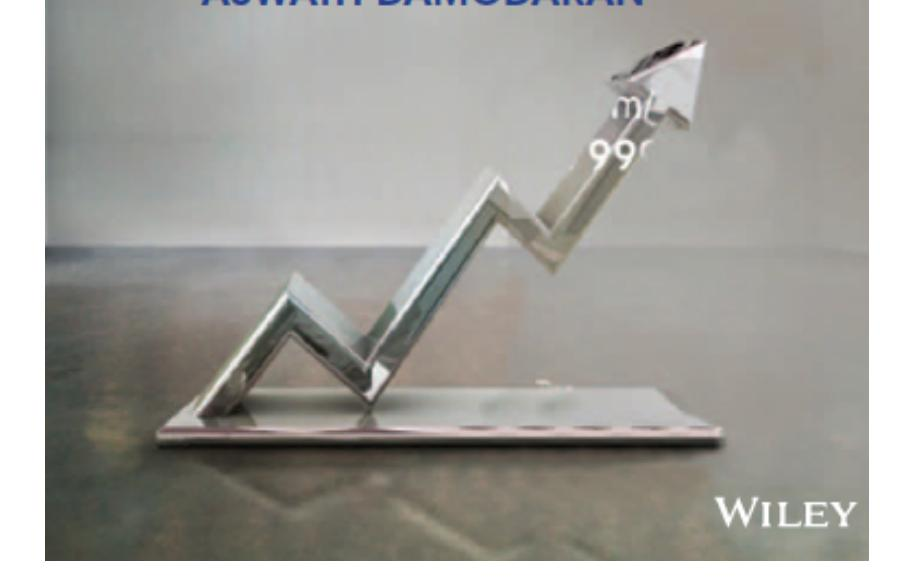

# **SESSION 11: THE "RIGHT" BETA**

The law of large numbers is your best friend.

#### **SESSION 11: THE "RIGHT" BETA**

#### **ESTIMATING BOTTOM UP BETAS & COSTS OF EQUITY: VALE**

## ESTIMATING BOTTOM UP BETAS & COSTS OF EQUITY VALE

|       | BUSINESS        | SAMPLE                                         | SAMPLE SIZE | UNLEVERED BETA OF BUSINESS | REVENUES | PEER GROUP EV/SALES | VALUE OF BUSINESS | PROPORTION OF VALE |
|-------|-----------------|------------------------------------------------|-------------|----------------------------|----------|---------------------|-------------------|--------------------|
| ICONS | METALS & MINING | GLOBAL FIRMS & MINING MARKET CAP > \$1 BILLION | 48          | 0.86                       | \$9,013  | 1.97                | \$17,739          | 16.65%             |
| ICON  | IRON ORE        | GLOBAL FIRMS IN IRON ORE                       | 78          | 0.83                       | \$32,717 | 2.48                | \$81,188          | 76.20%             |
| ICON  | FERTILIZERS     | GLOBAL SPECIALITY CHEMICAL FIRMS               | 693         | 0.99                       | \$3,777  | 1.52                | \$5,741           | 5.39%              |
| ICON  | LOGISTICS       | GLOBAL TRANSPORTATION FIRMS                    | 223         | 0.75                       | \$1,644  | 1.14                | \$1,874           | 1.76%              |
| ICON  | VALE OPERATIONS |                                                |             | 0.8440                     | \$47,151 |                     | \$106,543         | 100%               |

|                    |   BUSINESS          |   UNLEVERED BETA   |   D/E RATIO   |   LEVERED BETA   |   RISK FREE RATE   |   ERP     |   COST OF EQUITY   |
|---------------------------------|-----------------------------------------------|----------------------------------------------|-----------------------------------------|--------------------------------------------|----------------------------------------------|-------------------------------------|----------------------------------------------|
|   X   |   METALS & MINING   |   0.86             |   54.99%      |   1.1657         |   2.75%            |   7.38%   |   11.35%           |
|   X   |   IRON ORE          |   0.83             |   54.99%      |   1.1358         |   2.75%            |   7.38%   |   11.13%           |
|   X   |   FERTILIZERS       |   0.99             |   54.99%      |   1.3493         |   2.75%            |   7.38%   |   12.70%           |
|   X   |   LOGISTICS         |   0.75             |   54.99%      |   1.0222         |   2.75%            |   7.38%   |   10.29%           |
|   X   |   VALE OPERATIONS   |   0.84             |   54.99%      |   1.1503         |   2.75%            |   7.38%   |   11.23%           |

# **VALE: COST OF EQUITY CALCULATION – IN NOMINAL \$R**

- To convert a discount rate in one currency to another, all you need are expected inflation rates in the two currencies.

| (1 + \$ COST OF EQUITY) | $\frac{(1 + \text{INFLATION RATE}_{\text{BRAZIL}})}{(1 + \text{INFLATION RATE}_{\text{US}})} - 1$ |
|-------------------------|---------------------------------------------------------------------------------------------------|
|-------------------------|---------------------------------------------------------------------------------------------------|

| (1 + \$ COST OF EQUITY) | $\frac{(1 + \text{INFLATION RATE}_{\text{BRAZIL}})}{(1 + \text{INFLATION RATE}_{\text{US}})} - 1$ |
|-------------------------|---------------------------------------------------------------------------------------------------|
|-------------------------|---------------------------------------------------------------------------------------------------|

- From US \$ to R\$: If we use 2% as the inflation rate in US dollars and 9% as the inflation ratio in Brazil, we can convert Vale's US dollar cost of equity of 11.23% to a \$R cost of equity:

$$\text{COST OF EQUITY}_{\text{NOMINAL R$}} = (1 + \$\text{COST OF EQUITY}) \frac{(1 + \text{INFLATION RATE}_{\text{BRAZIL}})}{(1 + \text{INFLATION RATE}_{\text{US}})} - 1$$

$$\text{COST OF EQUITY}_{\text{NOMINAL R$}} = (1 + \$\text{COST OF EQUITY}) \frac{(1 + \text{INFLATION RATE}_{\text{BRAZIL}})}{(1 + \text{INFLATION RATE}_{\text{US}})} - 1$$
= (1.123) 
$$\frac{(1.09)}{(1.02)} - 1 = 18.87\%$$

- Alternatively, you can compute a cost of equity, starting with the \$R riskfree rate of 10.18%.

Cost of Equity in \$R = = 10.18% + 1.15 (7.38%) = 18.67%

# **BOTTOM UP BETAS & COSTS OF EQUITY: TATA MOTORS & BAIDU**

- Tata Motors: We estimated an unlevered beta of 0.8601 across 76 publicly traded automotive companies (globally) and estimated a levered beta based on Tata Motor's D/E ratio of 41.41% and a marginal tax rate of 32.45% for India:

Levered Beta for Tata Motors = 0.8601 (1 + (1-.3245) (.4141)) = 1.1007

Cost of equity (Rs) = 6.57% + 1.1007 (7.19%) = 14.49%

- Baidu: To estimate its beta, we looked at 42 global companies that derive all or most of their revenues from online advertising and estimated an unlevered beta of 1.30 for the business. Incorporating Baidu's current market debt to equity ratio of 5.23% and the marginal tax rate for China of 25%, we estimate Baidu's current levered beta to be 1.3560.

Levered Beta for Baidu = 1.30 (1 + (1-.25) (.0523)) = 1.356

Cost of Equity for Baidu (Renmimbi) = 3.50% + 1.356 (6.94%) = 12.91%

# **BOTTOM UP BETAS AND COSTS OF EQUITY: DEUTSCHE BANK**

- We break Deutsche Bank down into two businesses commercial and investment banking.
- We do not unlever or relever betas, because estimating debt and equity for banks is an exercise in futility.

| BUSINESS           | SAMPLE                     | SAMPLE SIZE | MEDIAN LEVERED BETA | DUETSCHE NET REVENUES 2012 | PROPORTION |
|--------------------|----------------------------|-------------|---------------------|----------------------------|------------|
| BANKING            | EUROPEAN DIVERSIFIED BANKS | 84          | 1.0665              | 19,019 MIL €               | 54.86%     |
| INVESTMENT BANKING | GLOBAL INVESTMENT BANKS    | 58          | 1.2550              | 15,648 MIL €               | 45.14%     |
| DEUTSCHE BANK      |                            |             | 1.1516              | 34,667 MIL €               |            |

|  | BUSINESS           | BETA   | COST OF EQUITY                 |
|--|--------------------|--------|--------------------------------|
|  | BANKING            | 1.0665 | 1.75% + 1.0665 (6.12) = 8.28%  |
|  | INVESTMENT BANKING | 1.2550 | 1.75% + 1.2550 (6.12) = 9.44%  |
|  | DEUTSCHE BANK      | 1.1516 | 1.75% + 1.1516 (6.12%) = 8.80% |

# **ESTIMATING BETAS FOR NON-TRADED ASSETS**

- The conventional approaches of estimating betas from regressions do not work for assets that are not traded. There are no stock prices or historical returns that can be used to compute regression betas.
- There are two ways in which betas can be estimated for nontraded assets o Using comparable firms o Using accounting earnings

# **USING COMPARABLE FIRMS TO ESTIMATE BETA FOR BOOKSCAPE**

| <i>Company Name</i>     | <i>Industry</i> | <i>Market Capitalization</i> | <i>Levered Beta</i> | <i>Marginal tax rate</i> | <i>Gross D/E ratio</i> | <i>Cash/Firm Value</i> | <i>R2</i> |
|-------------------------|-----------------|------------------------------|---------------------|--------------------------|------------------------|------------------------|----------------------|
| Red Giant Entertainment | Publishing      | \$2.13                       | 0.69                | 40.00%                   | 0.00%                  | 0.05%                  | 0.1300               |
| CTM Media Holdings      | Publishing      | \$25.20                      | 1.04                | 40.00%                   | 17.83%                 | 33.68%                 | 0.1800               |
| Books-A-Million         | Book Stores     | \$38.60                      | 1.42                | 40.00%                   | 556.55%                | 4.14%                  | 0.1900               |
| Dex Media               | Publishing      | \$90.50                      | 4.92                | 40.00%                   | 3190.39%               | 7.86%                  | 0.2200               |
| Martha Stewart Living   | Publishing      | \$187.70                     | 1.11                | 40.00%                   | 19.89%                 | 15.86%                 | 0.3500               |
| Barnes & Noble          | Book Stores     | \$939.30                     | 0.11                | 40.00%                   | 164.54%                | 3.22%                  | 0.2600               |
| Scholastic Corporation  | Publishing      | \$953.80                     | 1.08                | 40.00%                   | 21.41%                 | 1.36%                  | 0.2750               |
| John Wiley              | Publishing      | \$2,931.40                   | 0.81                | 40.00%                   | 29.58%                 | 5.00%                  | 0.3150               |
| Washington Post         | Publishing      | \$4,833.20                   | 0.68                | 40.00%                   | 21.04%                 | 16.04%                 | 0.2680               |
| News Corporation        | Publishing      | \$10,280.40                  | 0.49                | 40.00%                   | 8.73%                  | 24.05%                 | 0.2300               |
| Thomson Reuters         | Publishing      | \$31,653.80                  | 0.62                | 40.00%                   | 26.38%                 | 1.68%                  | 0.2680               |
| <b>Average</b>          |                 |                              | <b>1.1796</b>       | <b>40.00%</b>            | <b>368.76%</b>         | <b>10.27%</b>          | <b>0.2442</b>        |
| <b>Median</b>           |                 |                              | <b>0.8130</b>       | <b>40.00%</b>            | <b>21.41%</b>          | <b>5.00%</b>           | <b>0.2600</b>        |

Unlevered beta for book company = 0.8130/ (1+ (1-.4) (.2141)) = 0.7205 Unlevered beta for book business = 0.7205/(1-.05) = 0.7584

# **ESTIMATING BOOKSCAPE LEVERED BETA AND COST OF EQUITY**

- Because the debt/equity ratios used in computing levered betas are market debt equity ratios, and the only debt equity ratio we can compute for Bookscape is a book value debt equity ratio, we have assumed that Bookscape is close to the book industry median market debt to equity ratio of 21.41 percent.
- Using a marginal tax rate of 40 percent for Bookscape, we get a levered beta of 0.8558. Levered beta for Bookscape = 0.7584[1 + (1 – 0.40) (0.2141)] = 0.8558
- Using a riskfree rate of 2.75% (US treasury bond rate) and an equity risk premium of 5.5%: Cost of Equity = 2.75%+ 0.8558 (5.5%) = 7.46%

# **IS BETA AN ADEQUATE MEASURE OF RISK FOR A PRIVATE FIRM?**

- Beta measures the risk added on to a diversified portfolio. The owners of most private firms are not diversified. Therefore, using beta to arrive at a cost of equity for a private firm will
  - a. Under estimate the cost of equity for the private firm
  - b. Over estimate the cost of equity for the private firm
  - c. Could under or over estimate the cost of equity for the private firm

# **TOTAL RISK VERSUS MARKET RISK**

- Adjust the beta to reflect total risk rather than market risk. This adjustment is a relatively simple one, since the R squared of the regression measures the proportion of the risk that is market risk. o Total Beta = Market Beta / Correlation of the sector with the market
- In the Bookscape example, where the market beta is 0.8558 and the average R-squared of the comparable publicly traded firms is 26.00%; the correlation with the market is 50.99%.

$$\frac{\text{MARKET BETA}}{\sqrt{\text{R SQUARED}}} = \frac{0.8558}{.5099} = 1.6783\%$$

o Total Cost of Equity = 2.75 + 1.6783 (5.5%) = 11.98%

# 6 **APPLICATION TEST: ESTIMATING A BOTTOM-UP BETA**

- Based upon the business or businesses that your firm is in right now, and its current financial leverage, estimate the bottom-up unlevered beta for your firm.
- Data Source: You can get a listing of unlevered betas by industry on my web site by going to updated data.

## Applied Corporate Finance

**Task** Estimate the beta your company would have, if it were a private business.

**Optional: Read Chapter 4**

