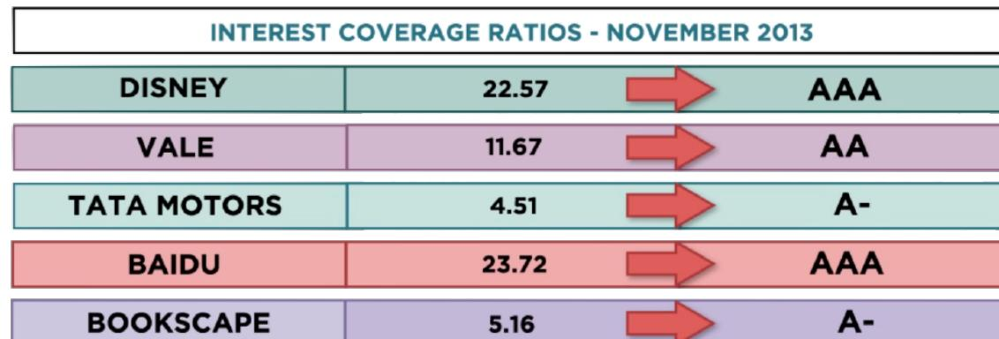
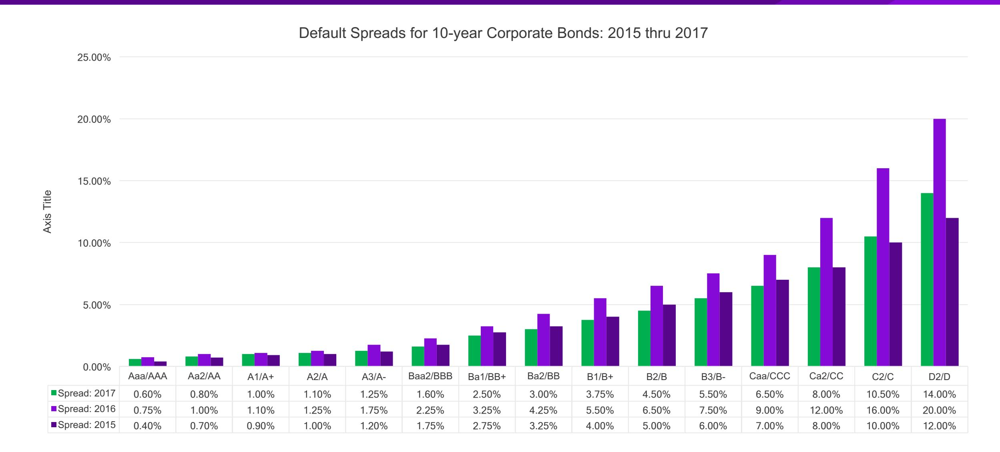

# **SESSION 12: DEBT: MEASURE AND COST**

Debt, the double-edged sword!

# SESSION 12: DEBT: MEASURE AND COST

# **FROM COST OF EQUITY TO COST OF CAPITAL**

- The cost of capital is a composite cost to the firm of raising financing to fund its projects.
- In addition to equity, firms can raise capital from debt.

# **WHAT IS DEBT?**

- General Rule: Debt generally has the following characteristics: o Commitment to make fixed payments in the future o Fixed payments are tax deductible o Failure to make the payments can lead to either default or loss of control of the firm to the party to whom payments are due
- As a consequence, debt should include o Any interest-bearing liability, whether short term or long term o Any lease obligation, whether operating or capital

# **ESTIMATING THE COST OF DEBT**

- If the firm has bonds outstanding, and the bonds are traded, the yield to maturity on a long-term, straight (no special features) bond can be used as the interest rate.
- If the firm is rated, use the rating and a typical default dpread on bonds with that rating to estimate the cost of debt.
- If the firm is not rated, o and it has recently borrowed long term from a bank, use the interest rate on the borrowing, or o estimate synthetic rating for the company, and use the synthetic rating to arrive at a default spread and a cost of debt.
- The cost of debt has to be estimated in the same currency as the cost of equity and the cash flows in the valuation.

#### **THE EASY ROUTE: OUTSOURCING THE MEASUREMENT OF DEFAULT RISK**

- For those firms that have bond ratings from global rating agencies, I used those ratings:

- If you want to estimate Vale's cost of debt in \$R terms, we can again use the differential inflation approach we used for the cost of equity:

$$\text{COST OF DEBT}_{\text{Rs}} = (1 + \text{COST OF DEBT}_{\text{Us}})^{(1 + \text{EXPECTED INFLATION}_{\text{Rs}})} - 1$$
$$\text{COST OF DEBT}_{\text{Rs}} = (1 + \text{COST OF DEBT}_{\text{Us}})^{(1 + \text{EXPECTED INFLATION}_{\text{Rs}})} - 1$$

= 
$$(1.0405) \frac{(1.09)}{(1.02)} - 1 = 11.19\%$$

=  $(1.0405) \frac{(1.09)}{(1.02)} - 1 = 11.19\%$ 

| Company       | S&P Rating | Risk-Free Rate | Default Spread | Cost of Debt |
|---------------|------------|----------------|----------------|--------------|
| Disney        | A          | 2.75% (US \$)  | 1.00%          | 3.75%        |
| Deutsche Bank | A          | 1.75% (€)      | 1.00%          | 2.75%        |
| Vale          | A-         | 2.75% (US \$)  | 1.30%          | 4.05%        |

# **A MORE GENERAL ROUTE: ESTIMATING SYNTHETIC RATINGS**

- The rating for a firm can be estimated using the financial characteristics of the firm. In its simplest form, we can use just the interest coverage ratio:

## INTEREST COVERAGE RATIO = EBIT / INTEREST EXPENSES

- For the four non-financial service companies, we obtain the following:

| COMPANY            | OPERATING INCOME  | INTEREST EXPENSES | INTEREST COVERAGE RATIO |
|--------------------|-------------------|-------------------|-------------------------|
| <b>DISNEY</b>      | <b>\$10,023</b>   | <b>\$444</b>      | <b>22.57</b>            |
| <b>VALE</b>        | <b>\$15,667</b>   | <b>\$1,342</b>    | <b>11.67</b>            |
| <b>TATA MOTORS</b> | <b>Rs 166,605</b> | <b>Rs 36,972</b>  | <b>4.51</b>             |
| <b>BAIDU</b>       | <b>Cy 11,193</b>  | <b>Cy 472</b>     | <b>23.72</b>            |
| <b>BOOKSCAPE</b>   | <b>\$2,536</b>    | <b>\$492</b>      | <b>5.16</b>             |

# INTEREST COVERAGE RATIOS, RATINGS AND DEFAULT SPREADS – NOVEMBER 2013

| <i>Large cap (&gt;\$ billion)</i> | <i>Small cap or risky (&lt;\$5 billion)</i> | <i>Rating is (S&amp;P/ Moody's)</i> | <i>Spread (11/13)</i> |
|-----------------------------------|---------------------------------------------|-------------------------------------|-----------------------|
| >8.50                             | >12.5                                       | Aaa/AAA                             | 0.40%                 |
| 6.5-8.5                           | 9.5-12.5                                    | Aa2/AA                              | 0.70%                 |
| 5.5-6.5                           | 7.5-9.5                                     | A1/A+                               | 0.85%                 |
| 4.25-5.5                          | 6-7.5                                       | A2/A                                | 1.00%                 |
| 3-4.25                            | 4.5-6                                       | A3/A-                               | 1.30%                 |
| 2.5-3                             | 4-4.5                                       | Baa2/BBB                            | 2.00%                 |
| 2.25-2.5                          | 3.5-4                                       | Ba1/BB+                             | 3.00%                 |
| 2-2.25                            | 3-3.5                                       | Ba2/BB                              | 4.00%                 |
| 1.75-2.25                         | 2.5-3                                       | B1/B+                               | 5.50%                 |
| 1.5-1.75                          | 2-2.5                                       | B2/B                                | 6.50%                 |
| 1.25-1.5                          | 1.5-2                                       | B3/B-                               | 7.25%                 |
| 0.8-1.25                          | 1.25-1.5                                    | Caa/CCC                             | 8.75%                 |
| 0.65-0.8                          | 0.8-1.25                                    | Ca2/CC                              | 9.50%                 |
| 0.2-0.65                          | 0.5-0.8                                     | C2/C                                | 10.50%                |
| <0.2                              | <0.5                                        | D2/D                                | 12.00%                |

- Disney's synthetic rating is AAA whereas its actual rating is A. The difference can be attributed to any of the following: o Synthetic ratings reflect only the interest coverage ratio whereas actual ratings incorporate all of the other ratios and qualitative factors o Synthetic ratings do not allow for sector-wide biases in ratings o Synthetic rating was based on 2013 operating income whereas actual rating reflects normalized earnings
- Vale's synthetic rating is AA, but the actual rating for doallar debt is A-. The biggest factor behind the difference is the presence of country risk, since Vale is probably being rated lower for being a Brazil-based corporation.
- Deutsche Bank had an A rating. We will not try to estimate a synthetic rating for the bank. Defining interest expenses on debt for a bank is difficult . . .

# **SYNTHETIC VERSUS ACTUAL RATINGS: RATED FIRMS**

# **ESTIMATING COST OF DEBT**

- For Bookscape, we will use the synthetic rating (A-) to estimate the cost of debt: o Default Spread based upon A- rating = 1.30% o Pre-tax cost of debt = Riskfree Rate + Default Spread = 2.75% + 1.30 % = 4.05% o After-tax cost of debt + Pre-tax cost of debt (1 – tax rate) = 4.05% (1-0.40) = 2.43%
- For the three publicly traded firms that are rated in our sample, we will use the actual bond ratings to estimate the cost of debt.

- For Tata Motors, we have a rating of AA- from CRISIL, an Indian bond-rating firm, that measures only company risk. Using that rating:

COST OF DEBTTMT = RISK-FREE RATERS + DEFAULT SPREADINDIA + DEFAULT SPREADTM

| Company       | S&P Rating | Risk-Free Rate | Default Spread | Cost of Debt | Tax Rate | After-Tax Cost of Debt |
|---------------|------------|----------------|----------------|--------------|----------|------------------------|
| Disney        | A          | 2.75% (US \$)  | 1.00%          | 3.75%        | 36.1%    | 2.40%                  |
| Deutsche Bank | A          | 1.75% (€)      | 1.00%          | 2.75%        | 29.48%   | 1.94%                  |
| Vale          | A-         | 2.75% (US \$)  | 1.30%          | 4.05%        | 34%      | 2.67%                  |

# **UPDATED DEFAULT SPREADS – JANUARY 2017**

# 6 **APPLICATION TEST: ESTIMATING A COST OF DEBT**

- Based upon your firm's current earnings before interest and taxes, its interest and taxed, its interest expenses, estimate o An interest coverage ration for your firm o A synthetic rating for your firm (use the tables from prior pages) o A pre-tax cost of debt for your firm o An after-tax cost of debt for your firm

## Applied Corporate Finance

Optional: Read Chapter 4

**Task** Estimate the cost of debt for your company