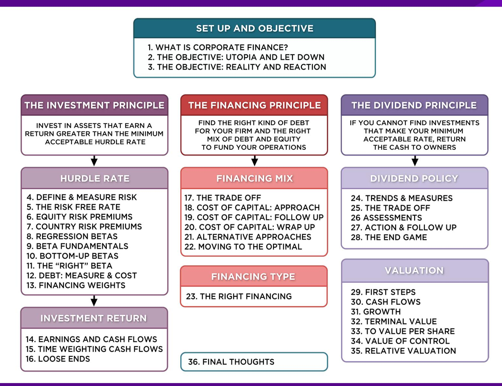
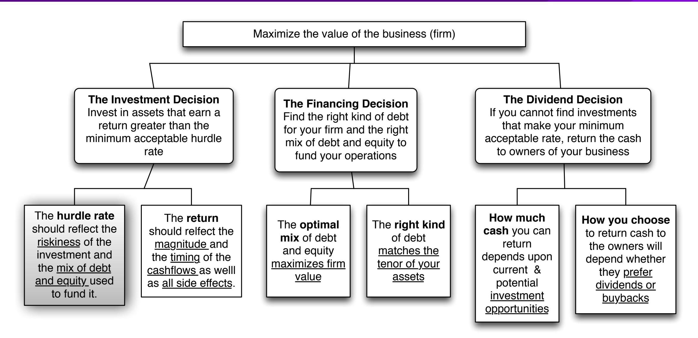
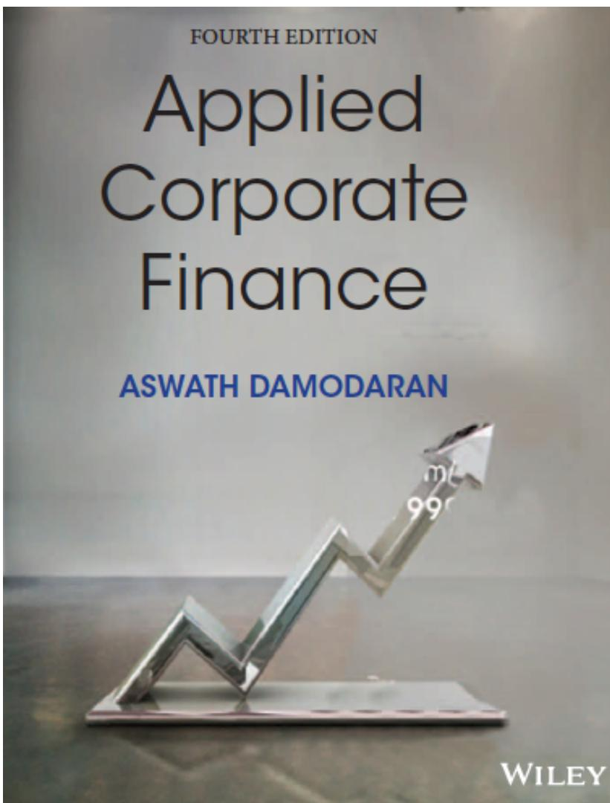

# **SESSION 13: FINANCING WEIGHTS**

The minimum acceptable hurdle rate, at last..

# **SESSION 13: FINANCING WEIGHTS**

## **WEIGHTS FOR COST OF CAPITAL CALCULATION**

- The weights used in the cost of capital computation should be market values.
- There are three specious arguments used against market value o Book value is more reliable than market value because it is not as volatile: While it is true that book value does not change as much as market value, this is more a reflection of weakness than strength o Using book value rather than market value is a more conservative approach to estimating debt ratios: For most companies, using book values will yield a lower cost of capital than using market value weights. o Since accounting returns are computed based upon book value, consistency requires the use of book value in computing cost of capital: While it may seem consistent to use book values for both accounting return and cost of capital calculations, it does not make economic sense.
- In practical terms, estimating the market value of equity should be easy for a publicly traded firm, but some or all of the debt at most companies is not traded. As a consequence, most practitioners use the book value of debt as a proxy for the market value of debt.

#### **DISNEY: FROM BOOK VALUE TO MARKET VALUE FOR INTEREST BEARING DEBT…**

- In Disney's 2013 financial statements, the debt due over time was footnoted.

- Disney's total debt due, in book value terms, on the balance sheet is \$14,288 million and the total interest expense for the year was \$349 million. Using 3.75% as the pre-tax cost of debt:
- Estimated MV of Disney Debt =

$$349 \times \left[ \frac{1 - \frac{1}{(1.0375)^{7.92}}}{0.375} \right] + \frac{14,288}{(1.0375)^{7.92}} = \$13,028 \text{ MILLION}$$

| Time due | Amount due | Weight | Weight *Maturity |
|----------|------------|--------|------------------|
| 0.5      | \$1,452    | 11.96% | 0.06             |
| 2        | \$1,300    | 10.71% | 0.21             |
| 3        | \$1,500    | 12.36% | 0.37             |
| 4        | \$2,650    | 21.83% | 0.87             |
| 6        | \$500      | 4.12%  | 0.25             |
| 8        | \$1,362    | 11.22% | 0.9              |
| 9        | \$1,400    | 11.53% | 1.04             |
| 19       | \$500      | 4.12%  | 0.78             |
| 26       | \$25       | 0.21%  | 0.05             |
| 28       | \$950      | 7.83%  | 2.19             |
| 29       | \$500      | 4.12%  | 1.19             |
|          | \$12,139   |        | 7.92             |

# **OPERATING LEASES AT DISNEY**

- The "debt value" of operating leases is the present value of the lease payments, at a rate that reflects their risk, usually the pre-tax cost of debt.
- The pre-tax cost of debt at Disney is 3.75%.

| YEAR                 | COMMITMENT | PRESENT VALUE @3.75% |
|----------------------|------------|----------------------|
| 1                    | \$507.00   | \$488.67             |
| 2                    | \$422.00   | \$392.05             |
| 3                    | \$342.00   | \$306.24             |
| 4                    | \$272.00   | \$234.76             |
| 5                    | \$217.00   | \$180.52             |
| 6 - 10               | \$356.00   | \$1330.69            |
| DEBT VALUE OF LEASES |            | \$2932.93            |

- Debt outstanding at Disney = \$13,028 + \$ 2,933= \$15,961 million

Disney reported \$1,784 million in commitments after year 5. Given that their average commitment over the first 5 years, we assumed 5 years @ \$356.8 million each.

# 6 **APPLICATION TEST: ESTIMATING MARKET VALUE**

- Estimate the o Market value of equity at your firm and Book Value of equity o Market value of debt and book value of debt (If you cannot find the average maturity of your debt, use 3 years): Remember to capitalize the value of operating leases and add them on to both the book value and the market value of debt.
- Estimate the o Weights for equity and debt based upon market value o Weights for equity and debt based upon book value

# **CURRENT COST OF CAPITAL: DISNEY**

- Equity o Cost of Equity = Riskfree rate + Beta \* Risk Premium = 2.75% + 1.0013 (5.76%) = 8.52% o Market Value of Equity = \$121,878 million o Equity/(Debt+Equity ) = 88.42%
- Debt

**AFTER-TAX COST OF DEBT = (RISKFREE RATE + DEFAULT SPREAD) (1 - t)**

- o Market Value of Debt = \$13,028+ \$2933 = \$ 15,961 million o Debt/(Debt +Equity) = 11.58%
- Cost of Capital = 8.52%(.8842)+ 2.40%(.1158) = 7.81%

121,878/ (121,878+15,961)

### **DIVISIONAL COSTS OF CAPITAL: DISNEY AND VALE**

|  | BUSINESS             | COST OF EQUITY | COST OF DEBT | MARGINAL TAX RATE | AFTER-TAX COST OF DEBT | DEBT RATIO    | COST OF CAPITAL |
|--|----------------------|----------------|--------------|-------------------|------------------------|---------------|-----------------|
|  | MEDIA NETWORKS       | 9.07%          | 3.75%        | 36.10%            | 2.40%                  | 9.12%         | 8.46%           |
|  | PARKS & RESORTS      | 7.09%          | 3.75%        | 36.10%            | 2.40%                  | 10.24%        | 6.61%           |
|  | STUDIO ENTERTAINMENT | 9.92%          | 3.75%        | 36.10%            | 2.40%                  | 17.16%        | 8.63%           |
|  | CONSUMER PRODUCTS    | 9.55%          | 3.75%        | 36.10%            | 2.40%                  | 53.94%        | 5.59%           |
|  | INTERACTIVE          | 11.65%         | 3.75%        | 36.10%            | 2.40%                  | 29.11%        | 8.96%           |
|  | DISNEY OPERATIONS    | <b>8.52%</b>   | <b>3.75%</b> | <b>36.10%</b>     | <b>2.40%</b>           | <b>11.58%</b> | <b>7.81%</b>    |

|  | BUSINESS        | COST OF EQUITY | AFTER-TAX COST OF DEBT | DEBT RATIO | COST OF CAPITAL IN US\$ | COST OF CAPITAL IN R\$ |
|--|-----------------|----------------|------------------------|------------|-------------------------|------------------------|
|  | METALS & MINING | 11.35%         | 2.67%                  | 35.48%     | 8.27%                   | 15.70%                 |
|  | IRON ORE        | 11.13%         | 2.67%                  | 35.48%     | 8.13%                   | 15.55%                 |
|  | FERTILIZERS     | 12.70%         | 2.67%                  | 35.48%     | 9.14%                   | 16.63%                 |
|  | LOGISTICS       | 10.29%         | 2.67%                  | 35.48%     | 7.59%                   | 14.97%                 |
|  | VALE OPERATIONS | 11.23%         | 2.67%                  | 35.48%     | 8.20%                   | 15.62%                 |

# **COSTS OF CAPITAL: TATA MOTORS, BAIDU AND BOOKSCAPE**

- To estimate the costs of capital for Tata Motors in Indian rupees: o Cost of capital= 14.49% (1-.2928) + 6.50% (.2928) = 12.15%
- For Baidu, we follow the same path to estimate a cost of equity in Chinese RMB: o Cost of capital = 12.91% (1-.0523) + 3.45% (.0523) = 12.42%
- For Bookscape, the cost of capital is different depending on whether you look at market or total beta:

|             | Cost of equity | Pre-tax Cost of debt | After-tax cost of debt | D/(D+E) | Cost of capital |
|-------------|----------------|----------------------|------------------------|---------|-----------------|
| Market Beta | 7.46%          | 4.05%                | 2.43%                  | 17.63%  | 6.57%           |
| Total Beta  | 11.98%         | 4.05%                | 2.43%                  | 17.63%  | 10.30%          |

# 6 **APPLICATION TEST: ESTIMATING COST OF CAPITAL**

- Using the bottom-up unlevered beta that you computed for your firm, and the values of debt and equity you have estimated for your firm, estimate a bottom-up levered beta and cost of equity for your firm.
- Based upon the costs of equity and debt that you have estimated, and the weights for each, estimate the cost of capital for your firm.
- How different would your cost of capital have been, if you used book value weights?

# **CHOOSING A HURDLE RATE**

- Either the cost of equity or the cost of capital can be used as a hurdle rate, depending upon whether the returns measured are to equity investors or to all claimholders on the firm (capital)
- If returns are measured to equity investors, the appropriate hurdle rate is the cost of equity.
- If returns are measured to capital (or the firm), the appropriate hurdle rate is the cost of capital.

### **BACK TO FIRST PRINCIPLES**

## Applied Corporate Finance

Optional: Read Chapter 4

**Task** Estimate a cost of capital for your company (and its businesses)