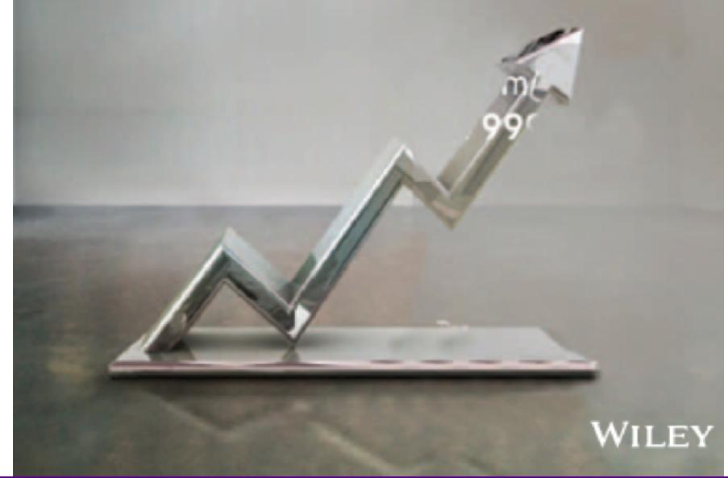

# **SESSION 14: EARNINGS AND CASH FLOWS**

Show me the money

# SESSION 14: EARNINGS AND CASH FLOWS

## SET UP AND OBJECTIVE

1. 1. WHAT IS CORPORATE FINANCE?
2. 2. THE OBJECTIVE: UTOPIA AND LET DOWN
3. 3. THE OBJECTIVE: REALITY AND REACTION

### THE INVESTMENT PRINCIPLE

INVEST IN ASSETS THAT EARN A RETURN GREATER THAN THE MINIMUM ACCEPTABLE HURDLE RATE

### HURDLE RATE

1. 4. DEFINE & MEASURE RISK
2. 5. THE RISK FREE RATE
3. 6. EQUITY RISK PREMIUMS
4. 7. COUNTRY RISK PREMIUMS
5. 8. REGRESSION BETAS
6. 9. BETA FUNDAMENTALS
7. 10. BOTTOM-UP BETAS
8. 11. THE "RIGHT" BETA
9. 12. DEBT: MEASURE & COST
10. 13. FINANCING WEIGHTS

### INVESTMENT RETURN

1. 14. EARNINGS AND CASH FLOWS
2. 15. TIME WEIGHTING CASH FLOWS
3. 16. LOOSE ENDS

### THE FINANCING PRINCIPLE

FIND THE RIGHT KIND OF DEBT FOR YOUR FIRM AND THE RIGHT MIX OF DEBT AND EQUITY TO FUND YOUR OPERATIONS

### FINANCING MIX

1. 17. THE TRADE OFF
2. 18. COST OF CAPITAL: APPROACH
3. 19. COST OF CAPITAL: FOLLOW UP
4. 20. COST OF CAPITAL: WRAP UP
5. 21. ALTERNATIVE APPROACHES
6. 22. MOVING TO THE OPTIMAL

### FINANCING TYPE

1. 23. THE RIGHT FINANCING

1. 36. FINAL THOUGHTS

### THE DIVIDEND PRINCIPLE

IF YOU CANNOT FIND INVESTMENTS THAT MAKE YOUR MINIMUM ACCEPTABLE RATE, RETURN THE CASH TO OWNERS

### DIVIDEND POLICY

1. 24. TRENDS & MEASURES
2. 25. THE TRADE OFF
3. 26. ASSESSMENTS
4. 27. ACTION & FOLLOW UP
5. 28. THE END GAME

### VALUATION

1. 29. FIRST STEPS
2. 30. CASH FLOWS
3. 31. GROWTH
4. 32. TERMINAL VALUE
5. 33. TO VALUE PER SHARE
6. 34. VALUE OF CONTROL
7. 35. RELATIVE VALUATION

#### **FIRST PRINCIPLES**

### **MEASURES OF RETURN: EARNING VERSUS CASH FLOWS**

- Principles governing Accounting Earning Management o **Accrual Accounting**: Show revenues when products and services are sold or provided, not when they are paid for. Show expenses associated with these revenues rather than cash expenses. o **Operating versus Capital Expenditure**: Only expenses associated with creating revenues in the current period should be treated as operating expenses. Expenses that create benefits over several periods are written off over multiple periods (as depreciation of amortization).
- To get from account earnings to cash flows: o you have to add back non-cash expenses (like depreciation) o you have to subtract out cash outflows which are not expensed (such as capital expenditures) o you have to make accrual revenues and expenses into cash revenues and expenses (by considering changes in the working capital).

# **MEASURING RETURNS RIGHT: THE BASIC PRINCIPLES**

- Use cash flows rather than earnings. You cannot spend earnings.
- Use "incremental" cash flows relating to the investment decision, that is, cash flows that occur as a consequence of the decision, rather than total cash flows.
- Use "time-weighted" returns, that is, value cash flows that occur earlier more than cash flows that occur later.

**The Return Mantra: "Time-weighted, Incremental Cash Flow Return"**

#### **EARNINGS VERSUS CASH FLOWS: A DISNEY THEME PARK**

- The theme parks to be build near Rio, modeled on Euro Disney in Paris and Disney World in Orlando.
- The complex will include a "Magic Kingdom" to be constructed, beginning immediately, and becoming operational at the beginning of the second year, and a second theme park modeled on Epcot Center at Orlando to be constructed in the second and third year, and becoming operational at the beginning of the fourth year.
- The earning and cash flows are estimated in nominal U. S. Dollars.

### **KEY ASSUMPTIONS ON START UP AND CONSTRUCTION**

- Disney has already spent \$0.5 billion researching the proposal and getting the necessary licenses for the park; none of this investment can be recovered if the park is not built. This expenditure has been capitalized and will be depreciated straight line over ten years to a salvage value of zero.
- Disney will face substantial construction costs, if it chooses to build the theme parks. o The cost of constructing Magic Kingdom will be \$3 billion, with \$2 billion to be spent right now, and \$1 billion to be spent one year from now. o The cost of constructing Epcot II will be \$1.5 billion, with \$1 billion to be spent at the end of the second year and \$0.5 billion at the end of the third year. o These investments will be depreciated based upon a depreciation schedule in the tax code, where depreciation will be different each year.

#### **STEP 1: ESTIMATE ACCOUNTING EARNING ON PROJECT**

|                                     | 0 1   | 2       | 3       | 4       | 5       | 6       | 7       | 8       | 9       | 10      |
|-------------------------------------|-------|---------|---------|---------|---------|---------|---------|---------|---------|---------|
| Magic Kingdom - Revenues            | \$0   | \$1,000 | \$1,400 | \$1,700 | \$2,000 | \$2,200 | \$2,420 | \$2,662 | \$2,928 | \$2,987 |
| Epcot Rio - Revenues                | \$0   | \$0     | \$0     | \$300   | \$500   | \$550   | \$605   | \$666   | \$732   | \$747   |
| Resort & Properties - Revenues      | \$0   | \$250   | \$350   | \$500   | \$625   | \$688   | \$756   | \$832   | \$915   | \$933   |
| Total Revenues                      |       | \$1,250 | \$1,750 | \$2,500 | \$3,125 | \$3,438 | \$3,781 | \$4,159 | \$4,575 | \$4,667 |
| Magic Kingdom – Direct Expenses     | \$0   | \$600   | \$840   | \$1,020 | \$1,200 | \$1,320 | \$1,452 | \$1,597 | \$1,757 | \$1,792 |
| Epcot Rio – Direct Expenses         | \$0   | \$0     | \$0     | \$180   | \$300   | \$330   | \$363   | \$399   | \$439   | \$448   |
| Resort & Property – Direct Expenses | \$0   | \$188   | \$263   | \$375   | \$469   | \$516   | \$567   | \$624   | \$686   | \$700   |
| Total Direct Expenses               |       | \$788   | \$1,103 | \$1,575 | \$1,969 | \$2,166 | \$2,382 | \$2,620 | \$2,882 | \$2,940 |
| Depreciation & Amortization         | \$50  | \$425   | \$469   | \$444   | \$372   | \$367   | \$364   | \$364   | \$366   | \$368   |
| Allocated G&A Costs                 | \$0   | \$188   | \$263   | \$375   | \$469   | \$516   | \$567   | \$624   | \$686   | \$700   |
| Operating Income                    | -\$50 | -\$150  | -\$84   | \$106   | \$315   | \$389   | \$467   | \$551   | \$641   | \$658   |
| Taxes                               | -\$18 | -\$54   | -\$30   | \$38    | \$114   | \$141   | \$169   | \$199   | \$231   | \$238   |
| Operating Income after Taxes        | -\$32 | -\$96   | -\$54   | \$68    | \$202   | \$249   | \$299   | \$352   | \$410   | \$421   |

Direct expenses: 60% of revenues for theme parks, 75% of revenues for resort properties

Allocated G&A: Company G&A allocated to project, based on projected revenues. Two thirds of expense is fixed, rest is variable.

Taxes: Based on marginal tax rate of 36.1%

### **AND THE ACCOUNTING VIEW OF RETURN**

- (a) Based upon book capital at the start of each year
- (b) Based upon average book capital over the year

| Year    | After-tax Operating Income | BV of pre-project investment | BV of fixed assets | BV of Working capital | BV of Capital | Average BV of Capital | ROC(a) | ROC(b) |
|---------|----------------------------|------------------------------|--------------------|-----------------------|---------------|-----------------------|--------|--------|
| 0       |                            | 500                          | 2000               | 0                     | \$2,500       |                       |        |        |
| 1       | -\$32                      | \$450                        | \$3,000            | \$0                   | \$3,450       | \$2,975               | -1.07% | -1.28% |
| 2       | -\$96                      | \$400                        | \$3,813            | \$63                  | \$4,275       | \$3,863               | -2.48% | -2.78% |
| 3       | -\$54                      | \$350                        | \$4,145            | \$88                  | \$4,582       | \$4,429               | -1.22% | -1.26% |
| 4       | \$68                       | \$300                        | \$4,027            | \$125                 | \$4,452       | \$4,517               | 1.50%  | 1.48%  |
| 5       | \$202                      | \$250                        | \$3,962            | \$156                 | \$4,368       | \$4,410               | 4.57%  | 4.53%  |
| 6       | \$249                      | \$200                        | \$3,931            | \$172                 | \$4,302       | \$4,335               | 5.74%  | 5.69%  |
| 7       | \$299                      | \$150                        | \$3,931            | \$189                 | \$4,270       | \$4,286               | 6.97%  | 6.94%  |
| 8       | \$352                      | \$100                        | \$3,946            | \$208                 | \$4,254       | \$4,262               | 8.26%  | 8.24%  |
| 9       | \$410                      | \$50                         | \$3,978            | \$229                 | \$4,257       | \$4,255               | 9.62%  | 9.63%  |
| 10      | \$421                      | \$0                          | \$4,010            | \$233                 | \$4,243       | \$4,250               | 9.90%  | 9.89%  |
| Average |                            |                              |                    |                       |               |                       | 4.18%  | 4.11%  |

### **WHAT SHOULD THIS RETURN BE COMPARED TO?**

- The computed return on capital on this investment is about 4%. TO make a judgment on whether this is a sufficient return, we need to compare this return to a "hurdle rate". Which of the following is the right hurdle rate? Why or why not?
  - a. The riskfree rate of 2.75% (T-bond rate)
  - b. The cost of equity for Disney as a company (8.52%)
  - c. The cost of equity for Disney theme parks (7.09%)
  - d. The cost of capital for Disney as a company (7.81%)
  - e. The cost of capital for Disney theme parks (6.61%)
  - f. None of the above

# **SHOULD THERE BE A RISK PREMIUM FOR FOREIGN PROJECTS?**

- The exchange rate risk should be diversifiable risk (and hence should not command a premium) if o the company has projects in a large number of countries, or o the investors in the company are globally diversified. o For Disney, this risk should not affect the cost of capital used. Consequently, we would not adjust the cost of capital for Disney's investments in other mature markets (Germany, U.K., France).
- The same diversification argument can also be applied against some political risk, which would mean that it too should not affect the discount rate. However, there are aspects of political risk, especially in emerging markets, that will be difficult to diversify and may affect the cash flows ,by reducing the expected life or cash flows on the project.
- For Disney, this is the risk that we are incorporating into the cost of capital when it invests in Brazil (or any other emerging market).

#### **ESTIMATING A HURDLE RATE FOR RIO DISNEY**

- We did estimate a cost of capital of 6.61% for the Disney theme park business, using a bottom-up levered beta of 0.7537 for the business.
- This cost of equity market may not adequately reflect the additional risk associated with the theme park being in an emerging market.
- The only concern we would have with using this cost of equity for this project is that it may not adequately reflect the addition risk associated with the theme park being in an emerging market (Brazil). We first computed the Brazil country risk premium ( by multiplying the default spread for Brazil by the relative equity market volatility) and then re-estimated the cost of equity: o Country risk premium for Brazil = 5.5% + 3% = 8.5% o Cost of Equity in US\$ = 2.75% + 0.7537 (8.5%) = 9.16%
- Using this estimate of the cost of equity, Disney's theme park debt ratio of 10.24% and its after-tax cost of debt of 2.40% (see chapter 4), we can estimate the cost of capital for the project: o Cost of Capital in US\$ = 9.16% (0.8976) + 2.40% (0.1024) = 8.46%

# **WOULD LEAD US TO CONCLUDE THAT . . .**

- Do not invest in this park. The return on capital of 4.18% is lower than the cost of capital for theme parks of 8.46%. This would suggest that the project should not be taken.
- Given that we have computed the average over an arbitrary period of 10 years, while the theme park itself would have a life greater than 10 years, would you feel comfortable with this conclusion? o Yes o No

#### **A TANGENT: FROM NEW TO EXISTING INVESTMENTS – ROC FOR THE ENTIRE FIRM**

|                                                                                                                                                             | ASSETS                        |
|-------------------------------------------------------------------------------------------------------------------------------------------------------------|-------------------------------|
| 
EXISTING INVESTMENTS  <b>GENERATE CASH FLOWS TODAY            INCLUDING LONG (FIXED) &amp;            SHORT (WORKING CAPITAL) ASSETS</b>
 | 
<b>ASSETS IN PLACE</b>
 |
| 
EXPECTED VALUE THAT WILL  <b>BE CREATED BY FUTURE            INVESTMENTS</b>
                                                                 | 
<b>GROWTH ASSETS</b>
   |

|                                   | 
 LIABILITIES
 |                                                                                                                                    |
|-----------------------------------|-----------------------------------------------|------------------------------------------------------------------------------------------------------------------------------------|
| 

 | 

             | 

                                                                                                  |
| <b>DEBT</b>                       |                                  | <b>FIXED CLAIM ON CASH FLOWS</b> 
<b>LITTLE ROLE IN MANAGEMENT</b>
 
<b>FIXED MATURITY</b>
 
<b>TAX DEDUCTIBLE</b>
 |
| <b>EQUITY</b>                     |                                  | <b>RESIDUAL CLAIM ON CASH FLOWS</b> 
<b>SIGNIFICANT ROLE IN MANAGEMENT</b>
 
<b>PERPETUAL LIVES</b>
                     |

| Company     | EBIT (1-t) | BV of Debt | BV of    |          |           |        |        |            |
|-------------|------------|------------|----------|----------|-----------|--------|--------|------------|
|             |            |            | Equity   | Cash     | BV of     |        |        |            |
|             |            |            |          |          | Capital   |        |        | ROC – Cost |
| Disney      | \$6,920    | \$16,328   | \$41,958 | \$3,387  | \$54,899  | 12.61% | 7.81%  | 4.80%      |
| Vale        | \$12,432   | \$49,246   | \$75,974 | \$5,818  | \$119,402 | 10.41% | 8.20%  | 2.22%      |
| Baidu       | ¥9,111     | ¥13,561    | ¥27,215  | ¥10,456  | ¥30,320   | 30.05% | 12.42% | 17.63%     |
| Tata Motors | ₹120,905   | ₹471,489   | ₹330,056 | ₹225,562 | ₹575,983  | 20.99% | 11.44% | 9.55%      |
| Bookscape   | \$1,775    | \$12,136   | \$8,250  | \$1,250  | \$19,136  | 9.28%  | 10.30% | -1.02%     |

How "good" are the existing investments of the firm?

#### **OLD WINE IN A NEW BOTTLE . . . ANOTHER WAY OF PRESENTING THE SAME RESULTS . . .**

- The key to value is earning excess returns. Over time, there have been attempts to restate this obvious fact in new and different ways. For instance, Economic Value Added (EVA) developed a wide following in the 1990s:

EVA = (ROC – Cost of Capital) (Book Value of Capital Invested)

| Company       | ROC – Cost of Capital | BV of Capital | EVA      |
|---------------|-----------------------|---------------|----------|
| Disney        | 4.80%                 | \$54,899      | \$2,632  |
| Vale          | 2.22%                 | \$119,402     | \$2,645  |
| Baidu         | 17.63%                | \$30,320      | \$5,347  |
| Deutsche Bank | NMF                   | NMF           | NMF      |
| Tata Motors   | 9.55%                 | \$575,983     | \$55,033 |
| Bookscape     | -1.02%                | \$19,136      | -\$195   |

## 6 **APPLICATION TEST: ASSESSING INVESTMENT QUALITY**

- For the most recent period for which you have data, compute the after-tax return on capital earned by your firm, where after-tax return on capital is computed to be: After-tax ROC = EBIT (1 – tax rate) / (BV of debt + BV of Equity – Cash)previous year
- For the most recent period for which you have data, compute the return spread earned by your firm: Return Spread = After-tax ROC – Cost of Capital
- For the most recent period, compute the EVA earned by your firm: EVA = Return Spread \* ((BV of Debt + BV of Equity – Cash)previous year

## Applied Corporate Finance

Optional: Read Chapter 5,6

**Task** Estimate the return differential (ROIC-WACC) earned by your company

