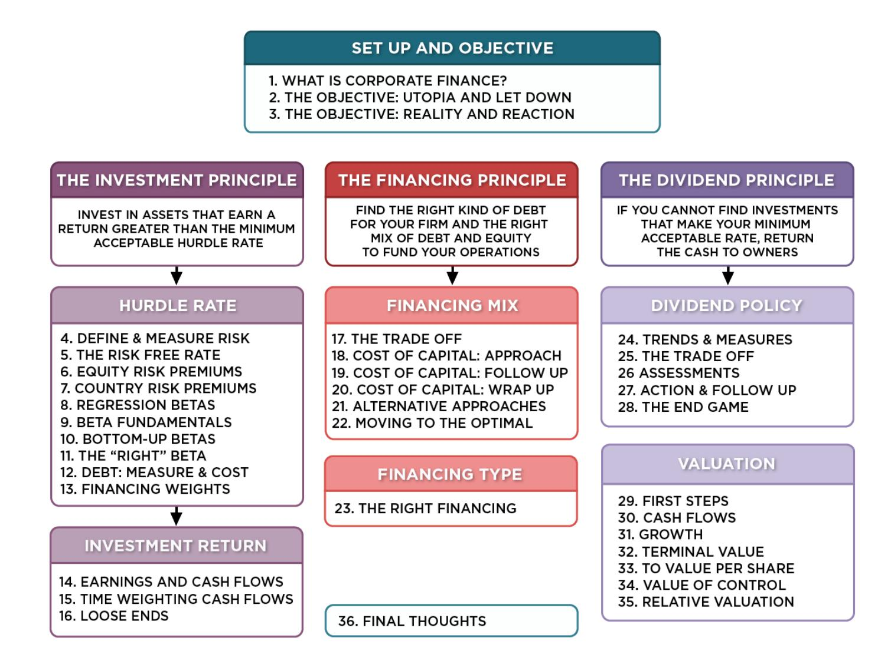
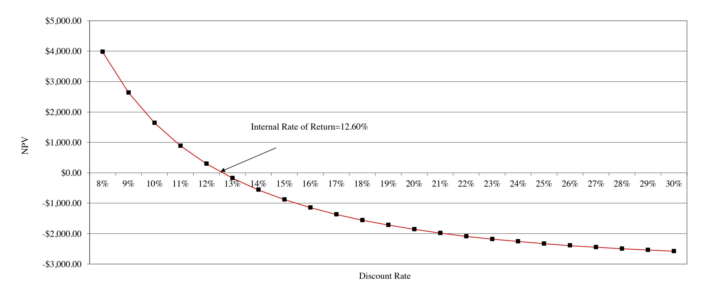
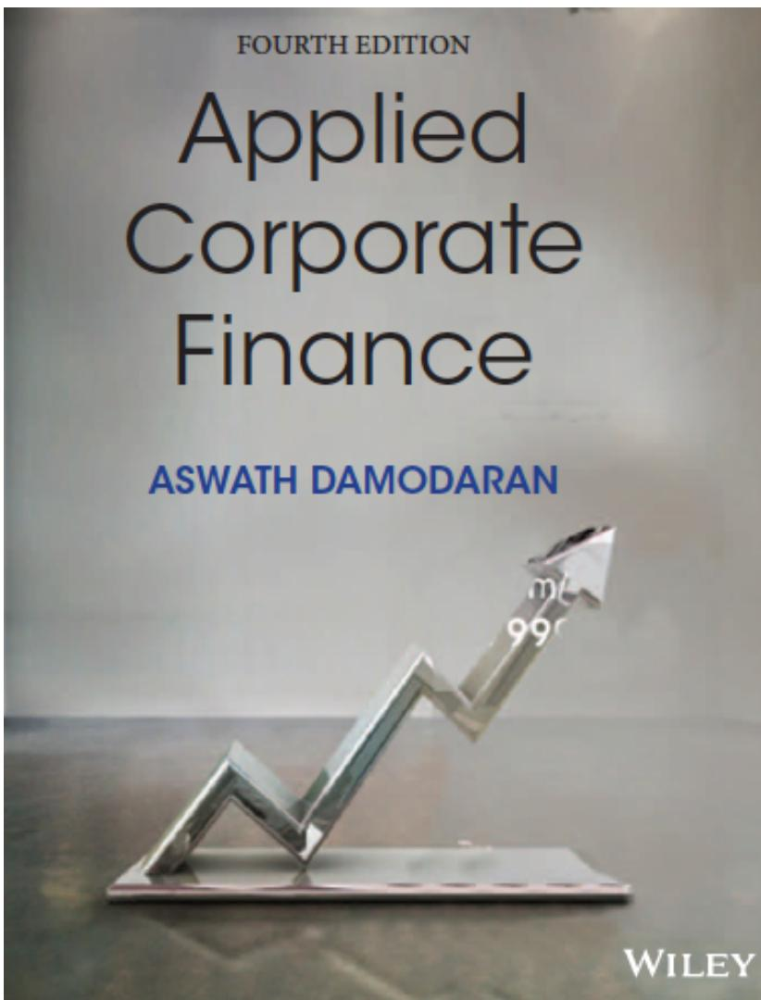

# **SESSION 15: TIME WEIGHTING CASH FLOWS**

Time is money.

# **SESSION 15: TIME WEIGHTING CASH FLOWS**

#### **REVISITING ACCOUNTING EARNINGS ON RIO DISNEY**

Direct expenses: 60% of revenues for theme parks, 75% of revenues for resort properties Allocated G&A: Company G&A allocated to project, based on projected revenues. Two thirds of expense is fixed, rest is variable. Taxes: Based on marginal tax rate of 36.1%

|                                     | 0 1   | 2       | 3       | 4       | 5       | 6       | 7       | 8       | 9       | 10      |
|-------------------------------------|-------|---------|---------|---------|---------|---------|---------|---------|---------|---------|
| Magic Kingdom - Revenues            | \$0   | \$1,000 | \$1,400 | \$1,700 | \$2,000 | \$2,200 | \$2,420 | \$2,662 | \$2,928 | \$2,987 |
| Epcot Rio - Revenues                | \$0   | \$0     | \$0     | \$300   | \$500   | \$550   | \$605   | \$666   | \$732   | \$747   |
| Resort & Properties - Revenues      | \$0   | \$250   | \$350   | \$500   | \$625   | \$688   | \$756   | \$832   | \$915   | \$933   |
| Total Revenues                      |       | \$1,250 | \$1,750 | \$2,500 | \$3,125 | \$3,438 | \$3,781 | \$4,159 | \$4,575 | \$4,667 |
| Magic Kingdom – Direct Expenses     | \$0   | \$600   | \$840   | \$1,020 | \$1,200 | \$1,320 | \$1,452 | \$1,597 | \$1,757 | \$1,792 |
| Epcot Rio – Direct Expenses         | \$0   | \$0     | \$0     | \$180   | \$300   | \$330   | \$363   | \$399   | \$439   | \$448   |
| Resort & Property – Direct Expenses | \$0   | \$188   | \$263   | \$375   | \$469   | \$516   | \$567   | \$624   | \$686   | \$700   |
| Total Direct Expenses               |       | \$788   | \$1,103 | \$1,575 | \$1,969 | \$2,166 | \$2,382 | \$2,620 | \$2,882 | \$2,940 |
| Depreciation & Amortization         | \$50  | \$425   | \$469   | \$444   | \$372   | \$367   | \$364   | \$364   | \$366   | \$368   |
| Allocated G&A Costs                 | \$0   | \$188   | \$263   | \$375   | \$469   | \$516   | \$567   | \$624   | \$686   | \$700   |
| Operating Income                    | -\$50 | -\$150  | -\$84   | \$106   | \$315   | \$389   | \$467   | \$551   | \$641   | \$658   |
| Taxes                               | -\$18 | -\$54   | -\$30   | \$38    | \$114   | \$141   | \$169   | \$199   | \$231   | \$238   |
| Operating Income after Taxes        | -\$32 | -\$96   | -\$54   | \$68    | \$202   | \$249   | \$299   | \$352   | \$410   | \$421   |

# **THE CASH FLOW VIEW OF THIS PROJECT..**

|                                 | 0 1               | 2       | 3       | 4                                         | 5     | 6     | 7     | 8     | 9     | 10    |
|---------------------------------|-------------------|---------|---------|-------------------------------------------|-------|-------|-------|-------|-------|-------|
| After-tax Operating Income      | -\$32             | -\$96   | -\$54   | \$68                                      | \$202 | \$249 | \$299 | \$352 | \$410 | \$421 |
| + Depreciation & Amortization   | \$0 \$50          | \$425   | \$469   | \$444                                     | \$372 | \$367 | \$364 | \$364 | \$366 | \$368 |
| Capital Expenditures            | \$2,500 \$1,000   | \$1,188 | \$752   | \$276                                     | \$258 | \$285 | \$314 | \$330 | \$347 | \$350 |
| Change in non-cash Work Capital | \$0               | \$63    | \$25    | \$38                                      | \$31  | \$16  | \$17  | \$19  | \$21  | \$5   |
| Cashflow to firm                | (\$2,500) (\$982) | (\$921) | (\$361) | \$198 \$285 \$314 \$332 \$367 \$407 \$434 |       |       |       |       |       |       |

- I. added back all non-cash charges such as depreciation.

- II. subtracted out the capital expenditures
- III. subtracted out the change in non-cash working capital

|                                | 1    | 2     | 3     | 4     | 5     | 6     | 7     | 8     | 9     | 10    |
|--------------------------------|------|-------|-------|-------|-------|-------|-------|-------|-------|-------|
| Depreciation                   | \$50 | \$425 | \$469 | \$444 | \$372 | \$367 | \$364 | \$364 | \$366 | \$368 |
| Tax Benefits from Depreciation | \$18 | \$153 | \$169 | \$160 | \$134 | \$132 | \$132 | \$132 | \$132 | \$133 |

## **THE INCREMENTAL CASH FLOWS ON THE PROJECT**

|                                           | 0                | 1                | 2              | 3              | 4     | 5     | 6     | 7     | 8     | 9     | 10    |
|-------------------------------------------|------------------|------------------|----------------|----------------|-------|-------|-------|-------|-------|-------|-------|
| After-tax Operating Income                |                  | -\$32            | -\$96          | -\$54          | \$68  | \$202 | \$249 | \$299 | \$352 | \$410 | \$421 |
| + Depreciation & Amortization             | \$0              | \$50             | \$425          | \$469          | \$444 | \$372 | \$367 | \$364 | \$364 | \$366 | \$368 |
| - Capital Expenditures                    | \$2,500          | \$1,000          | \$1,188        | \$752          | \$276 | \$258 | \$285 | \$314 | \$330 | \$347 | \$350 |
| - Change in non-cash Working Capital      |                  | \$0              | \$63           | \$25           | \$38  | \$31  | \$16  | \$17  | \$19  | \$21  | \$5   |
| Cashflow to firm                          | <b>(\$2,500)</b> | <b>(\$982)</b>   | <b>(\$921)</b> | <b>(\$361)</b> | \$198 | \$285 | \$314 | \$332 | \$367 | \$407 | \$434 |
| + Pre-project investment (sunk)           | \$500            |                  |                |                |       |       |       |       |       |       |       |
| - Pre-project Depreciation * tax rate     |                  | \$18             | \$18           | \$18           | \$18  | \$18  | \$18  | \$18  | \$18  | \$18  | \$18  |
| + Non-incremental Allocated Expense (1-t) |                  | \$0              | \$80           | \$112          | \$160 | \$200 | \$220 | \$242 | \$266 | \$292 | \$298 |
| Incremental Cash flow to the firm         | <b>(\$2,000)</b> | <b>(\$1,000)</b> | <b>(\$860)</b> | <b>(\$267)</b> | \$340 | \$467 | \$516 | \$555 | \$615 | \$681 | \$715 |

\$ 500 million has already been spent & \$ 50 million in depreciation will exist anyway

2/3rd of allocated G&A is fixed. Add back this amount (1-t) Tax rate = 36.1%

## **TO TIME-WEIGHTED CASH FLOWS**

- Incremental cash flows in the earlier years are worth more than incremental cash flows in later years.
- In fact, cash flows across time cannot be added up. They have to be brought to the same point in time before aggregation.
- This process of moving cash flows through time is o discounting, when future cash flows are brought to the present o compounding, when present cash flows are taken to the future

# **PRESENT VALUE MECHANICS**

| Cash Flow Type Discounting Formula   | Compounding Formula |
|--------------------------------------|---------------------|
| Simple CF CFn / (1+r)n               | CF0 (1+r)n          |
| Perpetuity A/r                       |                     |
| Growing Perpetuity Expected Cashflow | next year/(r-g)     |
| 1 - 1                                |                     |
| (1+r)                                | n                   |
| 1 -                                  | (1+g) n             |
|                                      | (1+r) n             |
| r                                    | g                   |
|                                      | ' €                 |
|                                      | A (1+r) n - 1       |

#### **DISCOUNTED CASH FLOW MEASURES OF RETURN**

- Net Present Value (NPV): The net present value is the sum of the present values of all cash flows from the project (including initial investment). o NPV = Sum of the present values of all cash flows on the project, including the initial investment, with the cash flows being discounted at the appropriate hurdle rate (cost of capital, if cash flow is cash flow to the firm, and cost of equity, if cash flow is to equity investors) o Decision Rule: Accept if NPV > 0
- Internal Rate of Return (IRR): The internal rate of return is the discount rate that sets the net present value equal to zero. It is the percentage rate of return, based upon incremental time-weighted cash flows. o Decision Rule: Accept if IRR > hurdle rate

## **CLOSURE ON CASH FLOWS**

- In a project with a finite and short life, you would need to compute a salvage value, which is the expected proceeds from selling all of the investment in the project at the end of the project life. It is usually set equal to book value of fixed assets and working capital
- In a project with an infinite or very long life, we compute cash flows for a reasonable period, and then compute a terminal value for this project, which is the present value of all cash flows that occur after the estimation period ends..
- Assuming the project lasts forever, and that cash flows after year 10 grow 2% (the inflation rate) forever, the present value at the end of year 10 of cash flows after that can be written as: o Terminal Value in year 10= CF in year 11/(Cost of Capital - Growth Rate) o =715 (1.02) /(.0846-.02) = \$ 11,275 million

## **WHICH YIELDS A NPV OF..**

| Year | Annual Cashflo | Terminal Value | Present Value |
|------|----------------|----------------|---------------|
|      | 0              | -\$2,000       | -\$2,000      |
|      | 1              | -\$1,000       | -\$922        |
|      | 2              | -\$859         | -\$730        |
|      | 3              | -\$267         | -\$210        |
|      | 4              | \$340          | \$246         |
|      | 5              | \$466          | \$311         |
|      | 6              | \$516          | \$317         |
|      | 7              | \$555          | \$314         |
|      | 8              | \$615          | \$321         |
|      | 9              | \$681          | \$328         |
|      | 10             | \$715          | \$5,321       |
|      |                |                | \$3,296       |

Discounted at Rio Disney cost of capital of 8.46%

# **WHICH MAKES THE ARGUMENT THAT..**

- The project should be accepted. The positive net present value suggests that the project will add value to the firm, and earn a return in excess of the cost of capital.
- By taking the project, Disney will increase its value as a firm by \$3,296 million.

## **THE IRR OF THIS PROJECT**

### **THE IRR SUGGESTS..**

- The project is a good one. Using time-weighted, incremental cash flows, this project provides a return of 12.60%. This is greater than the cost of capital of 8.46%.
- The IRR and the NPV will yield similar results most of the time, though there are differences between the two approaches that may cause project rankings to vary depending upon the approach used. They can yield different results, especially why comparing across projects because o A project can have only one NPV, whereas it can have more than one IRR. o The NPV is a dollar surplus value, whereas the IRR is a percentage measure of return. The NPV is therefore likely to be larger for "large scale" projects, while the IRR is higher for "small-scale" projects. o The NPV assumes that intermediate cash flows get reinvested at the "hurdle rate", which is based upon what you can make on investments of comparable risk, while the IRR assumes that intermediate cash flows get reinvested at the "IRR".

## Applied Corporate Finance

Optional: Read Chapter 5

**Task** Describe a typical investment for your company