# PROBABILISTIC APPROACHES: SCENARIO ANALYSIS, DECISION TREES AND SIMULATIONS

In the last chapter, we examined ways in which we can adjust the value of a risky asset for its risk. Notwithstanding their popularity, all of the approaches share a common theme. The riskiness of an asset is encapsulated in one number – a higher discount rate, lower cash flows or a discount to the value – and the computation almost always requires us to make assumptions (often unrealistic) about the nature of risk.

In this chapter, we consider a different and potentially more informative way of assessing and presenting the risk in an investment. Rather than compute an expected value for an asset that that tries to reflect the different possible outcomes, we could provide information on what the value of the asset will be under each outcome or at least a subset of outcomes. We will begin this section by looking at the simplest version which is an analysis of an asset's value under three scenarios – a best case, most likely case and worse case – and then extend the discussion to look at scenario analysis more generally. We will move on to examine the use of decision trees, a more complete approach to dealing with discrete risk. We will close the chapter by evaluating Monte Carlo simulations, the most complete approach of assessing risk across the spectrum.

#### **Scenario Analysis**

The expected cash flows that we use to value risky assets can be estimated in one or two ways. They can represent a probability-weighted average of cash flows under all possible scenarios or they can be the cash flows under the most likely scenario. While the former is the more precise measure, it is seldom used simply because it requires far more information to compile. In both cases, there are other scenarios where the cash flows will be different from expectations; higher than expected in some and lower than expected in others. In scenario analysis, we estimate expected cash flows and asset value under various scenarios, with the intent of getting a better sense of the effect of risk on value. In this section, we first consider an extreme version of scenario analysis where we consider the value in the best and the worst case scenarios, and then a more generalized version of scenario analysis.

#### *Best Case/ Worse Case*

With risky assets, the actual cash flows can be very different from expectations. At the minimum, we can estimate the cash flows if everything works to perfection – a best case scenario – and if nothing does – a worst case scenario. In practice, there are two ways in which this analysis can be structured. In the first, each input into asset value is set to its best (or worst) possible outcome and the cash flows estimated with those values. Thus, when valuing a firm, you may set the revenue growth rate and operating margin at the highest possible level while setting the discount rate at its lowest level, and compute the value as the best-case scenario. The problem with this approach is that it may not be feasible; after all, to get the high revenue growth, the firm may have to lower prices and accept lower margins. In the second, the best possible scenario is defined in terms of what is feasible while allowing for the relationship between the inputs. Thus, instead of assuming that revenue growth and margins will both be maximized, we will choose that combination of growth and margin that is feasible and yields the best outcome. While this approach is more realistic, it does require more work to put into practice.

How useful is a best case/worse case analysis? There are two ways in which the results from this analysis can be utilized by decision makers. First, the difference between the best-case and worst-case value can be used as a measure of risk on an asset; the range in value (scaled to size) should be higher for riskier investments. Second, firms that are concerned about the potential spill over effects on their operations of an investment going bad may be able to gauge the effects by looking at the worst case outcome. Thus, a firm that has significant debt obligations may use the worst-case outcome to make a judgment as to whether an investment has the potential to push them into default.

In general, though, best case/worse case analyses are not very informative. After all, there should be no surprise in knowing that an asset will be worth a lot in the best case and not very much in the worst case. Thus, an equity research analyst who uses this approach to value a stock, priced at \$ 50, may arrive at values of \$ 80 for the best case and \$ 10 for the worst case; with a range that large, it will be difficult to make a judgment on a whether the stock is a good investment or not at its current price of \$50.

#### *Multiple scenario analysis*

Scenario analysis does not have to be restricted to the best and worst cases. In its most general form, the value of a risky asset can be computed under a number of different scenarios, varying the assumptions about both macro economic and assetspecific variables.

#### *Steps in scenario analysis*

While the concept of sensitivity analysis is a simple one, it has four critical components:

- The first is the determination of which factors the scenarios will be built around. These factors can range from the state of the economy for an automobile firm considering a new plant, to the response of competitors for a consumer product firm introducing a new product, to the behavior of regulatory authorities for a phone company, considering a new phone service. In general, analysts should focus on the two or three most critical factors that will determine the value of the asset and build scenarios around these factors.
- The second component is determining the number of scenarios to analyze for each factor. While more scenarios may be more realistic than fewer, it becomes more difficult to collect information and differentiate between the scenarios in terms of asset cash flows. Thus, estimating cash flows under each scenario will be easier if the firm lays out five scenarios, for instance, than if it lays out 15 scenarios. The question of how many scenarios to consider will depend then upon how different the scenarios are, and how well the analyst can forecast cash flows under each scenario.
- The third component is the estimation of asset cash flows under each scenario. It is to ease the estimation at this step that we focus on only two or three critical factors and build relatively few scenarios for each factor.
- The final component is the assignment of probabilities to each scenario. For some scenarios, involving macro-economic factors such as exchange rates, interest rates and overall economic growth, we can draw on the expertise of services that forecast these variables. For other scenarios, involving either the sector or competitors, we have to draw on our knowledge about the industry. Note, though, that this makes

sense only if the scenarios cover the full spectrum of possibilities. If the scenarios represent only a sub-set of the possible outcomes on an investment, the probabilities will not add up to one.

The output from a scenario analysis can be presented as values under each scenario and as an expected value across scenarios (if the probabilities can be estimated in the fourth step).

This quantitative view of scenario analysis may be challenged by strategists, who have traditionally viewed scenario analysis as a qualitative exercise, whose primary benefit is to broaden the thinking of decision makers. As one strategist put it, scenario analysis is about devising "plausible future narratives" rather than probable outcomes; in other words, there are benefits to considering scenarios that have a very low probability of occurring. 1 The benefits of the exercise is that it forces decision makers to consider views of what may unfold than differ from the "official view".

### *Examples of Scenario Analysis*

To illustrate scenario analysis, consider a simple example. The Boeing 747 is the largest capacity airplane2 that Boeing manufactures for the commercial aerospace market and was introduced in 1974. Assume that Boeing is considering the introduction of a new large capacity airplane, capable of carrying 650 passengers, called the *Super Jumbo*, to replace the Boeing 747. Arguably, as the largest and longest-serving firm in the commercial aircraft market, Boeing knows the market better than any other firm in the world. Surveys and market testing of its primary customers, the airline companies, are unlikely to be useful tools in this case, for the following reasons.

- (a) Even if the demand exists now, it will be several years before Boeing will actually be able to produce and deliver the aircraft; the demand can change by then.
- (b) Technologically, it is not feasible to produce a few Super Jumbo Jets for test marketing, since the cost of retooling plant and equipment will be huge.

1 Randall, D. and C. Ertel, 2005, Moving beyond the official future, Financial Times Special Reports/ Mastering Risk, September 15, 2005.

2 The Boeing 747 has the capacity to carry 416 passengers.

(c) There are relatively few customers (the airlines) in the market, and Boeing is in constant contact with them. Thus, Boeing should already have a reasonable idea of what their current preferences are, in terms of the types of commercial aircraft.

At the same time, there is considerable uncertainty as to whether airlines will be interested in a Super Jumbo Jet. The demand for this jet will be greatest on long-haul3, international flights, since smaller airplanes are much more profitable for short-haul, domestic flights. In addition, the demand is unlikely to support two large capacity airplanes, produced by different companies. Thus, Boeing's expected revenues will depend upon two fundamental factors:

- The growth in the long-haul, international market, relative to the domestic market. Arguably, a strong Asian economy will play a significant role in fueling this growth, since a large proportion4 of it will have to come from an increase in flights from Europe and North America to Asia.
- The likelihood that Airbus, Boeing's primary competitor, will come out with a larger version of its largest capacity airplane, the A-300, over the period of the analysis.

We will consider three scenarios for the first factor –

- A high growth scenario, where real growth in the Asian economies exceeds 7% a year,
- An average growth scenario, where real growth in Asia falls between 4 and 7% a year,
- A low growth scenario, where real growth in Asia falls below 4% a year.

For the Airbus response, we will also consider three scenarios –

- Airbus produces an airplane that has the same capacity as the Super Jumbo Jet, capable of carrying 650+ passengers,
- Airbus produces an improved version of its existing A-300 jet that is capable of carrying 300+ passengers

3 Since these planes cost a great deal more to operate, they tend to be most economical for flights over long distances.

4 Flights from Europe to North America are clearly the largest segment of the market currently. It is also the segment least likely to grow because both markets are mature markets.

- Airbus decides to concentrate on producing smaller airplanes and abandons the large-capacity airplane market.

In table 6.1, we estimate the number of Super Jumbo jets that Boeing expects to sell under each of these scenarios:

*Table 6.1: Planes sold under Scenarios*

|                    | Airbus Large Jet | Airbus A-300 | Airbus abandons large capacity airplane |
|--------------------|------------------|--------------|-----------------------------------------|
| High Growth in     |                  |              |                                         |
| Asia               | 120              | 150          | 200                                     |
| Average Growth in  |                  |              |                                         |
| Asia               | 100              | 135          | 160                                     |
| Low Growth in Asia | 75               | 110          | 120                                     |

These estimates are based upon both Boeing's knowledge of this market and responses from potential customers (willingness to place large advance orders). The cash flows can be estimated under each of the nine scenarios, and the value of the project can be computed under each scenario.

While many scenario analyses do not take this last step, we next estimate the probabilities of each of these scenarios occurring and report them in table 6.2.

*Table 6.2: Probabilities of Scenarios*

|                     | Airbus Jet | Large Airbus 300 | A Airbus abandons capacity airplane | large Sum |
|---------------------|------------|------------------|--------------------------------------|-----------|
| High Growth in Asia | 0.125      | 0.125            | 0.00                                 | 0.25      |
| Average Growth in   |            |                  |                                      |           |
| Asia                | 0.15       | 0.25             | 0.10                                 | 0.50      |
| Low Growth in Asia  | 0.05       | 0.10             | 0.10                                 | 0.25      |
| Sum                 | 0.325      | 0.475            | 0.20                                 | 1.00      |

These probabilities represent joint probabilities; the probability of Airbus going ahead with a large jet that will directly compete with the Boeing Super Jumbo in a high-growth Asian economy is 12.5%. Note also that the probabilities sum to 1, that summing up the probabilities, by column, yields the overall probabilities of different actions by Airbus, and that summing up the probabilities by row yields probabilities of different growth scenarios in Asia. Multiplying the probabilities by the value of the project under each scenario should yield an expected value for the project.

#### *Use in Decision Making*

How useful is scenario analysis in value assessment and decision making? The answer, as with all tools, depends upon how it is used. The most useful information from a scenario analysis is the range of values across different scenarios, which provides a snap shot of the riskiness of the asset; riskier assets will have values that vary more across scenarios and safer assets will have manifest more value stability. In addition, scenario analysis can be useful in determining the inputs into an analysis that have the most effect on value. In the Boeing super Jumbo jet example, the inputs that have the biggest effect on the project's value are the health and growth prospects of the Asian economy and whether Airbus decides to build a competing aircraft. Given the sensitivity of the decision to these variables, Boeing may devote more resources to estimating them better. With Asian growth, in particular, it may pay to have a more thorough analysis and forecast of Asian growth prospects before Boeing commits to this large investment.

There is one final advantage to doing scenario analysis. Assuming Boeing decides that investing in the Super Jumbo makes economic sense, it can take proactive steps to minimize the damage that the worst case scenarios create to value. To reduce the potential downside from Asian growth, Boeing may try to diversify its revenue base and try to sell more aircraft in Latin America and Eastern Europe. It could even try to alter the probability of Airbus developing a competitive aircraft by using a more aggressive "low price" strategy, where it gives up some margin in return for a lower likelihood of competition in the future.

If nothing else, the process of thinking through scenarios is a useful exercise in examining how the competition will react under different macro-economic environments and what can be done to minimize the effect of downside risk and maximize the effect of potential upside on the value of a risky asset. In an article in the Financial Times, the authors illustrate how scenario analysis can be used by firms considering investing large

amounts in China to gauge potential risks. 5 They consider four scenarios, built around how China will evolve over time –

- (a) Global Economic Partner: In this scenario (which they label the official future since so many firms seem to subscribe to it now), China grows both as an exporter of goods and as a domestic market for consumer goods, while strengthening legal protections for ownership rights.
- (b) Global Economic Predator: China remains a low-cost producer, with a tightly controlled labor force and an intentionally under valued currency. The domestic market for consumer goods is constrained and the protection of ownership right does not advance significantly.
- (c) Slow Growing Global Participant: China continues to grow, but at a much slower pace, as the challenges of entering a global market place prove to be more difficult than anticipated. However, the government stays in control of the environment and there is little overt trouble.
- (d) Frustrated and Unstable Outsider: China's growth stalls, and political and economic troubles grow, potentially spilling over into the rest of Asia. The government becomes destabilized and strife spreads.

Forward-looking firms, they argue, may go into China expecting the first scenario (global economic partner) but they need to be prepared, if the other scenarios unfold.

#### *Issues*

Multiple scenario analysis provides more information than a best case/ worst case analysis by providing asset values under each of the specified scenarios. It does, however, have its own set of problems:

1. Garbage in, garbage out: It goes without saying that the key to doing scenario analysis well is the setting up of the scenarios and the estimation of cash flows under each one. Not only do the outlined scenarios have to be realistic but they also have to try to cover the spectrum of possibilities. Once the scenarios have been laid out, the cash flows have

5 Clemons, E.K., S. Barnett and J. Lanier, 2005, Fortune favors the forward-thinking, Financial Times Special Reports / Mastering Risk, September 22, 2005.

to be estimated under each one; this trade off has to be considered when determining how many scenarios will be run.

2. Continuous Risk: Scenario analysis is best suited for dealing with risk that takes the form of discrete outcomes. In the Boeing example, whether Airbus develops a Super Jumbo or not is a discrete risk and the modeling of the scenario is straightforward. When the outcomes can take on any of a very large number of potential values or the risk is continuous, it becomes more difficult to set up scenarios. In the Boeing example, we have categorized the "growth in Asia" variable into three groups – high, average and low – but the reality is that the cut-off points that we used of 4% and 7% are subjective; thus a growth rate of 7.1% will put us in the high growth scenario but a growth rate of 6.9% will yield an average growth scenario.

3. Double counting of risk: As with the best case/ worst case analysis, there is the danger that decision makers will double count risk when they do scenario analysis. Thus, an analyst, looking at the Boeing Super Jumbo jet analysis, may decide to reject the investment, even though the value of the investment (estimated using the risk adjusted discount rate) exceeds the cost at the expected production of 125 planes, because there is a significant probability (30%) that the sales will fall below the break even of 115 planes. Since the expected value is already risk adjusted, this would represent a double counting of potentially the same risk or risk that should not be a factor in the decision in the first place (because it is diversifiable).

# **Decision Trees**

In some projects and assets, risk is not only discrete but is sequential. In other words, for the asset to have value, it has to pass through a series of tests, with failure at any point potentially translating into a complete loss of value. This is the case, for instance, with a pharmaceutical drug that is just being tested on human beings. The threestage FDA approval process lays out the hurdles that have to be passed for this drug to be commercially sold, and failure at any of the three stages dooms the drug's chances. Decision trees allow us to not only consider the risk in stages but also to devise the right response to outcomes at each stage.

#### *Steps in Decision Tree Analysis*

The first step in understanding decision trees is to distinguish between root nodes, decision nodes, event nodes and end nodes.

- The root node represents the start of the decision tree, where a decision maker can be faced with a decision choice or an uncertain outcome. The objective of the exercise is to evaluate what a risky investment is worth at this node.
- Event nodes represent the possible outcomes on a risky gamble; whether a drug passes the first stage of the FDA approval process or not is a good example. We have to figure out the possible outcomes and the probabilities of the outcomes occurring, based upon the information we have available today.
- Decision nodes represent choices that can be made by the decision maker –to expand from a test market to a national market, after a test market's outcome is known.
- End nodes usually represent the final outcomes of earlier risky outcomes and decisions made in response.

Consider a very simple example. You are offered a choice where you can take a certain amount of \$ 20 or partake in a gamble, where you can win \$ 50 with probability 50% and \$10 with probability 50%. The decision tree for this offered gamble is shown in figure 6.1:

*Figure 6.1: Simple Decision Tree*

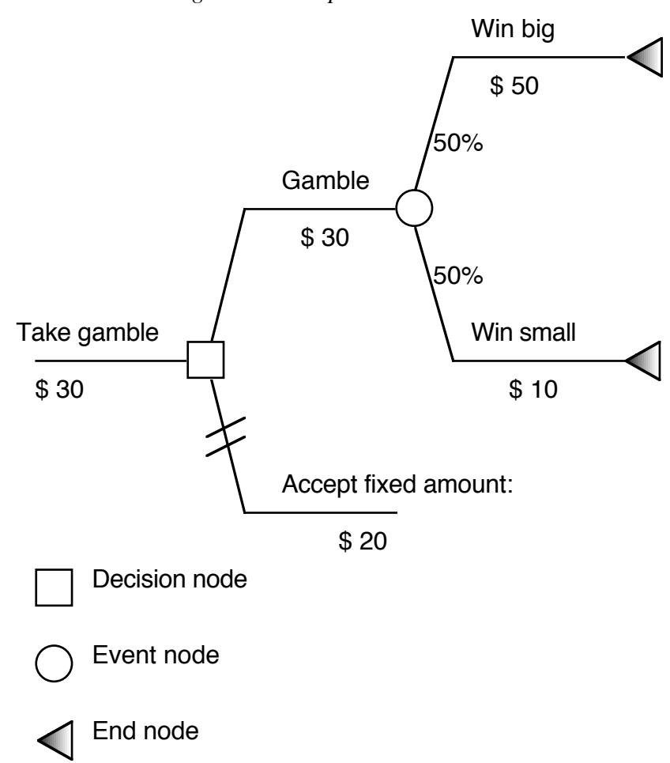

Note the key elements in the decision tree. First, only the event nodes represent uncertain outcomes and have probabilities attached to them. Second, the decision node represents a choice. On a pure expected value basis, the gamble is better (with an expected value of \$ 30) than the guaranteed amount of \$20; the double slash on the latter branch indicates that it would not be selected. While this example may be simplistic, the elements of building a decision tree are in it.

In general, developing a decision tree requires us to go through the following steps, though the details and the sequencing can vary from case to case:

Step 1: Divide analysis into risk phases: The key to developing a decision tree is outlining the phases of risk that you will be exposed to in the future. In some cases, such as the FDA approval process, this will be easy to do since there are only two outcomes – the drug gets approved to move on to the next phase or it does not. In other cases, it will be more difficult. For instance, a test market of a new consumer product can yield hundreds of potential outcomes; here, you will have to create discrete categories for what would qualify as success in the test market.

Step 2: In each phase, estimate the probabilities of the outcomes: Once the phases of the analysis have been put down and the outcomes at each phase are defined, the probabilities of the outcomes have to be computed. In addition to the obvious requirement that the probabilities across outcomes have to sum up to one, the analyst will also have to consider whether the probabilities of outcomes in one phase can be affected by outcomes in earlier phases. For example, how does the probability of a successful national product introduction change when the test market outcome is only average?

Step 3: Define decision points: Embedded in the decision tree will be decision points where you will get to determine, based upon observing the outcomes at earlier stages, and expectations of what will occur in the future, what your best course of action will be. With the test market example, for instance, you will get to determine, at the end of the test market, whether you want to conduct a second test market, abandon the product or move directly to a national product introduction.

Step 4: Compute cash flows/value at end nodes: The next step in the decision tree process is estimating what the final cash flow and value outcomes will be at each end node. In some cases, such as abandonment of a test market product, this will be easy to do and will represent the money spent on the test marketing of the product. In other cases, such as a national launch of the same product, this will be more difficult to do since you will have to estimate expected cash flows over the life of the product and discount these cash flows to arrive at value.

Step 5: Folding back the tree: The last step in a decision tree analysis is termed "folding back' the tree, where the expected values are computed, working backwards through the tree. If the node is a chance node, the expected value is computed as the probability weighted average of all of the possible outcomes. If it is a decision node, the expected value is computed for each branch, and the highest value is chosen (as the optimal decision). The process culminates in an expected value for the asset or investment today. 6

6 There is a significant body of literature examining the assumptions that have to hold for this folding back process to yield consistent values. In particular, if a decision tree is used to portray concurrent risks, the

There are two key pieces of output that emerge from a decision tree. The first is the expected value today of going through the entire decision tree. This expected value will incorporate the potential upside and downside from risk and the actions that you will take along the way in response to this risk. In effect, this is analogous to the risk adjusted value that we talked about in the last chapter. The second is the range of values at the end nodes, which should encapsulate the potential risk in the investment.

#### *An Example of a Decision Tree*

To illustrate the steps involved in developing a decision tree, let us consider the analysis of a pharmaceutical drug for treating Type 1 diabetes that has gone through preclinical testing and is about to enter phase 1 of the FDA approval process.7 Assume that you are provided with the additional information on each of the three phases:

1. Phase 1 is expected to cost \$ 50 million and will involve 100 volunteers to determine safety and dosage; it is expected to last 1 year. There is a 70% chance that the drug will successfully complete the first phase.

2. In phase 2, the drug will be tested on 250 volunteers for effectiveness in treating diabetes over a two-year period. This phase will cost \$ 100 million and the drug will have to show a statistically significant impact on the disease to move on to the next phase. There is only a 30% chance that the drug will prove successful in treating type 1 diabetes but there is a 10% chance that it will be successful in treating both type 1 and type 2 diabetes and a 10% chance that it will succeed only in treating type 2 diabetes.

3. In phase 3, the testing will expand to 4,000 volunteers to determine the long-term consequences of taking the drug. If the drug is tested on only type 1 or type 2 diabetes patients, this phase will last 4 years and cost \$ 250 million; there is an 80% chance of success. If it is tested on both types, the phase will last 4 years and cost \$ 300 million; there is a 75% chance of success.

risks should be independent of each other. See Sarin, R. and P.Wakker, 1994, Folding Back in Decision Tree Analysis, Management Science, v40, pg 625-628.

7 In type 1 diabetes, the pancreas do not produce insulin. The patients are often young children and the disease is unrelated to diet and activity; they have to receive insulin to survive. In type 2 diabetes, the pancreas produce insufficient insulin. The disease manifests itself in older people and can be sometimes controlled by changing lifestyle and diet.

If the drug passes through all 3 phases, the costs of developing the drug and the annual cash flows are provided below:

|      | Disease    | treatment  | Cost of Development | Annual             | Cash Flow |       |
|------|------------|------------|---------------------|--------------------|-----------|-------|
| Type | 1 diabetes | only       | \$ 500 million      | \$ 300 million for | 15        | years |
| Type | 2 diabetes | only       | \$ 500 million      | \$ 125 million for | 15        | years |
| Type | 1 and      | 2 diabetes | \$ 600 million      | \$ 400 million for | 15        | years |

Assume that the cost of capital for the firm is 10%.

We now have the information to draw the decision tree for this drug. We will first draw the tree in figure 6.2, specifying the phases, the cash flows at each phase and the probabilities:

*Figure 6.2: Decision Tree for Drug Development*

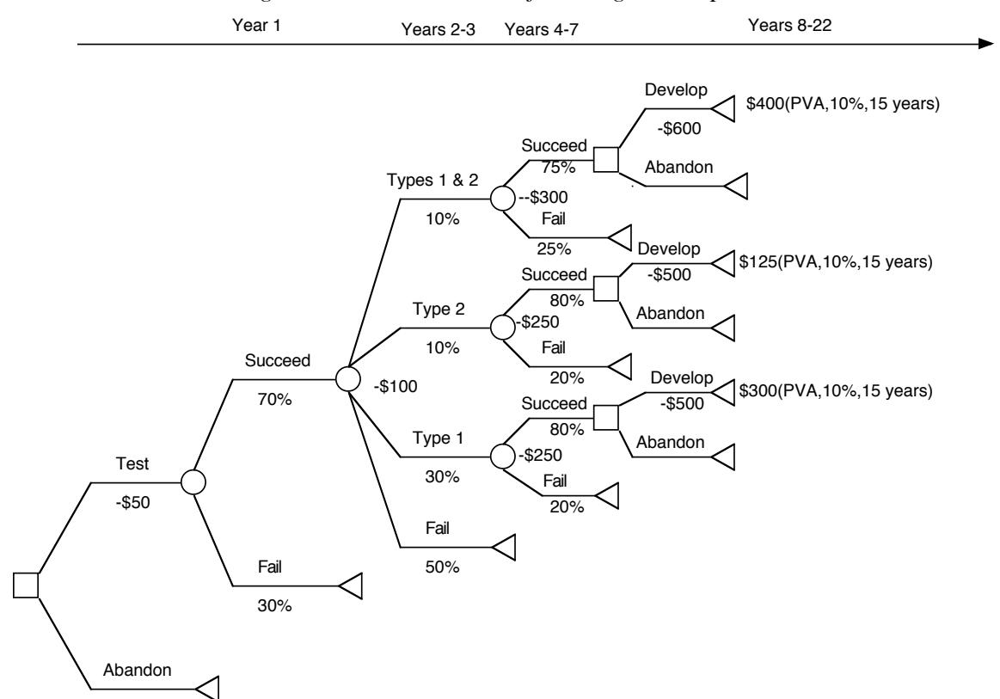

The decision tree shows the probabilities of success at each phase and the additional cash flow or marginal cash flow associated with each step. Since it takes time to go through the phases, there is a time value effect that has to be built into the expected cash flows for each path. We introduce the time value effect and compute the cumulative present value

(today) of cash flows from each path, using the 10% cost of capital as the discount rate, in figure 6.3:

*Figure 6.3: Present Value of Cash Flows at End Nodes: Drug Development Tree*

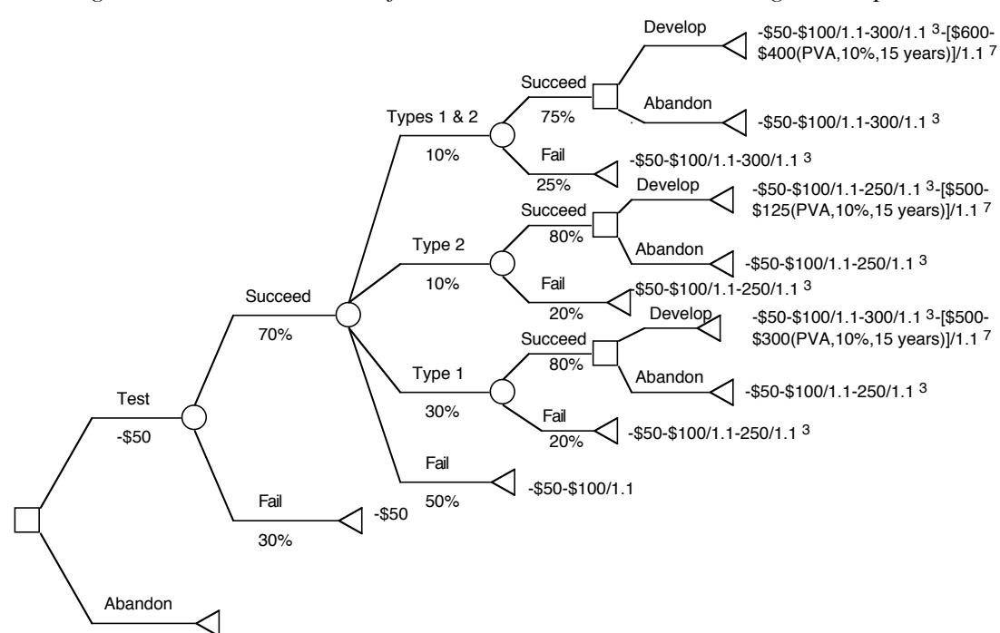

Note that the present value of the cash flows from development after the third phase get discounted back an additional seven years (to reflect the time it takes to get through three phases). In the last step in the process, we compute the expected values by working backwards through the tree and estimating the optimal action in each decision phase in figure 6.4:

*Figure 6.4: Drug Decision Tree Folded Back*

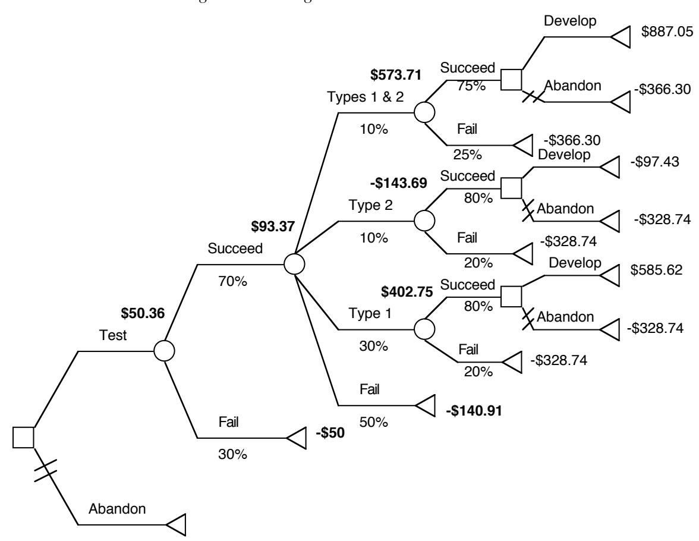

The expected value of the drug today, given the uncertainty over its success, is \$50.36 million. This value reflects all of the possibilities that can unfold over time and shows the choices at each decision branch that are sub-optimal and thus should be rejected. For example, once the drug passes phase 3, developing the drug beats abandoning it in all three cases – as a treatment for type 1, type 2 or both types. The decision tree also provides a range of outcomes, with the worst case outcome being failure in phase 3 of the drug as a treatment for both phase 1 and 2 diabetes (-\$366.30 million in today's dollars) to the best case outcome of approval and development of the drug as treatment for both types of diabetes (\$887.05 million in today's dollars).

There may one element in the last set of branches that may seem puzzling. Note that the present value of developing the drug as a treatment for just type 2 diabetes is negative (-\$97.43 million). Why would the company still develop the drug? Because the alternative of abandoning the drug at the late stage in the process has an even more negative net present value (-\$328.74 million). Another way to see this is to look at the marginal effect of developing the drug just for type 2 diabetes. Once the firm has expended the resources to take the firm through all three phases of testing, the testing cost becomes a sunk cost and is not a factor in the decision.8 The marginal cash flows from developing the drug after phase 3 yield a positive net present value of \$451 million (in year 7 cash flows):

Present value of developing drug to treat Type 2 diabetes in year 7 = -500 + 125(PV of annuity, 10%, 15 years) = \$451 million

At each stage in the decision tree, you make your judgments based upon the marginal cash flows at that juncture. Rolling back the decision tree allows you to see what the value of the drug is at each phase in the process.

### *Use in Decision Making*

There are several benefits that accrue from using decision trees and it is surprising that they are not used more often in analysis.

- 1. Dynamic response to Risk: By linking actions and choices to outcomes of uncertain events, decision trees encourage firms to consider how they should act under different circumstances. As a consequence, firms will be prepared for whatever outcome may arise rather than be surprised. In the example in the last section, for instance, the firm will be ready with a plan of action, no matter what the outcome of phase 3 happens to be.
- 2. Value of Information: Decision trees provide a useful perspective on the value of information in decision making. While it is not as obvious in the drug development example, it can be seen clearly when a firm considers whether to test market a product before commercially developing it. By test marketing a product, you acquire more information on the chances of eventual success. You can measure the expected value of this improved information in a decision tree and compare it to the test marketing cost.

8 It would be more accurate to consider only the costs of the first two phases as sunk, since by the end of phase 2, the firm knows that the drug is effective only against type 2 diabetes. Even if we consider only the costs of the first 2 phases as sunk, it still makes sense on an expected value basis to continue to phase 3.

- 3. Risk Management: Since decision trees provide a picture of how cash flows unfold over time, they are useful in deciding what risks should be protected against and the benefits of doing so. Consider a decision tree on the value of an asset, where the worst-case scenario unfolds if the dollar is weak against the Euro. Since we can hedge against this risk, the cost of hedging the risk can be compared to the loss in cash flows in the worst-case scenario.

In summary, decision trees provide a flexible and powerful approach for dealing with risk that occurs in phases, with decisions in each phase depending upon outcomes in the previous one. In addition to providing us with measures of risk exposure, they also force us to think through how we will react to both adverse and positive outcomes that may occur at each phase.

#### *Issues*

There are some types of risk that decision trees are capable of handling and others that they are not. In particular, decision trees are best suited for risk that is sequential; the FDA process where approval occurs in phases is a good example. Risks that affect an asset concurrently cannot be easily modeled in a decision tree.9 Looking back at the Boeing Super Jumbo jet example in the scenario analysis, for instance, the key risks that Boeing faces relate to Airbus developing its own version of a super-sized jet and growth in Asia. If we had wanted to use a decision tree to model this investment, we would have had to make the assumption that one of these risks leads the other. For instance, we could assume that Airbus will base its decision on whether to develop a large plane on growth in Asia; if growth is high, they are more likely to do it. If, however, this assumption in unreasonable and the Airbus decision will be made while Boeing faces growth risk in Asia, a decision tree may not be feasible.

As with scenario analysis, decision trees generally look at risk in terms of discrete outcomes. Again, this is not a problem with the FDA approval process where there are only two outcomes – success or failure. There is a much wider range of outcomes with most other risks and we have to create discrete categories for the outcomes to stay within

he decision tree framework. For instance, when looking at a market test, we may conclude that selling more than 100,000 units in a test market qualifies as a success, between 60,000 ad 100,000 units as an average outcome and below 60,000 as a failure.

Assuming risk is sequential and can be categorized into discrete boxes, we are faced with estimation questions to which there may be no easy answers. In particular, we have to estimate the cash flow under each outcome and the associated probability. With the drug development example, we had to estimate the cost and the probability of success of each phase. The advantage that we have when it comes to these estimates is that we can draw on empirical data on how frequently drugs that enter each phase make it to the next one and historical costs associated with drug testing. To the extent that there may be wide differences across different phase 1 drugs in terms of success – some may be longer shots than others – there can still be errors that creep into decision trees.

The expected value of a decision tree is heavily dependent upon the assumption that we will stay disciplined at the decision points in the tree. In other words, if the optimal decision is to abandon if a test market fails and the expected value is computed, based on this assumption, the integrity of the process and the expected value will quickly fall apart, if managers decide to overlook the market testing failure and go with a full launch of the product anyway.

# *Risk Adjusted Value and Decision Trees*

Are decision trees an alternative or an addendum to discounted cash flow valuation? The question is an interesting one because there are some analysts who believe that decision trees, by factoring in the possibility of good and bad outcomes, are already risk adjusted. In fact, they go on to make the claim that the right discount rate to use estimating present value in decision trees is the riskfree rate; using a risk adjusted discount rate, they argue, would be double counting the risk. Barring a few exceptional circumstances, they are incorrect in their reasoning.

a. Expected values are not risk adjusted: Consider decision trees, where we estimate expected cash flows by looking at the possible outcomes and their probabilities of

9 If we choose to model such risks in a decision tree, they have to be independent of each other. In other

occurrence. The probability-weighted expected value that we obtain is not risk adjusted. The only rationale that can be offered for using a risk free rate is that the risk embedded in the uncertain outcomes is asset-specific and will be diversified away, in which case the risk adjusted discount rate would be the riskfree rate. In the FDA drug development example, for instance, this may be offered as the rationale for why we would use the risk free rate to discount cash flows for the first seven years, when the only the risk we face is drug approval risk. After year 7, though, the risk is likely to contain a market element and the risk-adjusted rate will be higher than the risk free rate.

b. Double Counting of Risk: We do have to be careful about making sure that we don't double count for risk in decision trees by using risk-adjusted discount rates that are set high to reflect the possibility of failure at the earlier phases. One common example of this phenomenon is in venture capital valuation. A conventional approach that venture capitalists have used to value young start-up companies is to estimate an exit value, based on projected earnings and a multiple of that earnings in the future, and to then discount the exit value at a target rate. Using this approach, for instance, the value today for a firm that is losing money currently but is expected to make profits of \$ 10 million in 5 years (when the earnings multiple at which it will be taken public is estimated to be 40) can be computed as follows (if the target rate is 35%):

Value of the firm in 5 years = Earnings in year 5 \* PE = 10 \* 40 = \$ 400 million Value of firm today = \$ 400/ 1.355 = \$89.20 million

Note, however, that the target rate is set at a high level (35%) because of the probability that this young firm will not make it to a public offering. In fact, we could frame this as a simple decision tree in figure 6.5:

*Figure 6.5: Decision Tree for start-up firm*

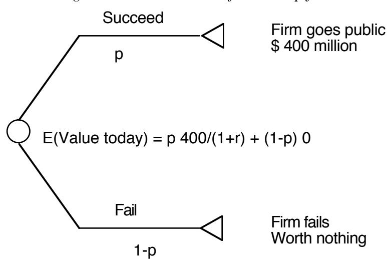

Assume that r is the correct discount rate, based upon the non-diversifiable risk that the venture capitalist faces on this venture. Going back to the numeric example, assume that this discount rate would have been 15% for this venture. We can solve for the implied probability of failure, embedded in the venture capitalist's estimate of value of \$89.20 million:

Estimated Value = \$89.20 = 
$$\frac{$400}{1.15^5(p)}$$

! Solving for p, we estimate the probability of success at 44.85%. With this estimate of probability in the decision tree, we would have arrived at the same value as the venture capitalist, assuming that we use the right discount rate. Using the target rate of 35% as the discount rate in a decision tree would lead to a drastically lower value, because risk would have been counted twice. Using the same reasoning, we can see why using a high discount rate in assessing the value of a bio-technology drug in a decision tree will under value the drug, especially if the discount rate already reflects the probability that the drug will not make it to commercial production. If the risk of the approval process is specific to that drug. and thus diversifiable, this would suggest that discount rates should be reasonable in decision tree analysis, even for drugs with very high likelihoods of not making it through the approval process.

c. The Right Discount Rate: If the right discount rate to use in a decision tree should reflect the non-diversifiable risk looking forward, it is not only possible but likely that discount rates we use will be different at different points in the tree. For instance, extraordinary success at the test market stage may yield more predictable cash flows than an average test market outcome; this would lead us to use a lower discount rate to value the former and a higher discount rate to value the latter. In the drug development example, it is possible that the expected cash flows, if the drug works for both types of diabetes, will be more stable than if is a treatment for only one type. It would follow that a discount rate of 8% may be the right one for the first set of cash flows, whereas a 12% discount rate may be more appropriate for the second.

Reviewing the discussion, decision trees are not alternatives to risk adjusted valuation. Instead, they can be viewed as a different way of adjusting for discrete risk that may be difficult to bring into expected cash flows or into risk adjusted discount rates.

### **Simulations**

If scenario analysis and decision trees are techniques that help us to assess the effects of discrete risk, simulations provide a way of examining the consequences of continuous risk. To the extent that most risks that we face in the real world can generate hundreds of possible outcomes, a simulation will give us a fuller picture of the risk in an asset or investment.

## *Steps in simulation*

Unlike scenario analysis, where we look at the values under discrete scenarios, simulations allow for more flexibility in how we deal with uncertainty. In its classic form, distributions of values are estimated for each parameter in the analysis (growth, market share, operating margin, beta etc.). In each simulation, we draw one outcome from each distribution to generate a unique set of cashflows and value. Across a large number of simulations, we can derive a distribution for the value of investment or an asset that will reflect the underlying uncertainty we face in estimating the inputs to the valuation. The steps associated with running a simulation are as follows:

1. Determine "probabilistic" variables: In any analysis, there are potentially dozens of inputs, some of which are predictable and some of which are not. Unlike scenario analysis and decision trees, where the number of variables that are changed and the potential outcomes have to be few in number, there is no constraint on how many variables can be allowed to vary in a simulation. At least in theory, we can define probability distributions for each and every input in a valuation. The reality, though, is that this will be time consuming and may not provide much of a payoff, especially for inputs that have only marginal impact on value. Consequently, it makes sense to focus attention on a few variables that have a significant impact on value.

2. Define probability distributions for these variables: This is a key and the most difficult step in the analysis. Generically, there are three ways in which we can go about defining probability distributions:

a. *Historical data*: For variables that have a long history and reliable data over that history, it is possible to use the historical data to develop distributions. Assume, for instance, that you are trying to develop a distribution of expected changes in the long-term Treasury bond rate (to use as an input in investment analysis). You could use the histogram in figure 6.6, based upon the annual changes in Treasury bond rates every year from 1928 to 2005, as the distribution for future changes.

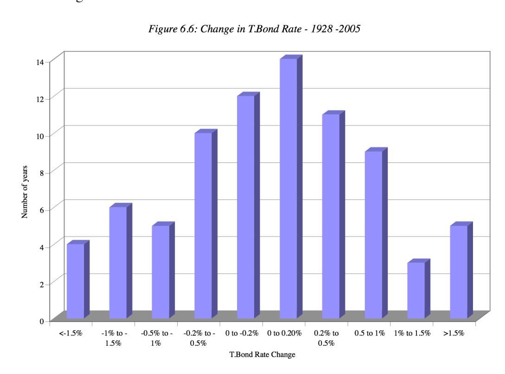

Implicit in this approach is the assumption that there have been no structural shifts in the market that will render the historical data unreliable.

b. *Cross sectional data*: In some cases, you may be able to substitute data on differences in a specific variable across existing investments that are similar to the investment being analyzed. Consider two examples. Assume that you are valuing a software firm and are concerned about the uncertainty in operating margins. Figure 6.7 provides a distribution of pre-tax operating margins across software companies in 2006:

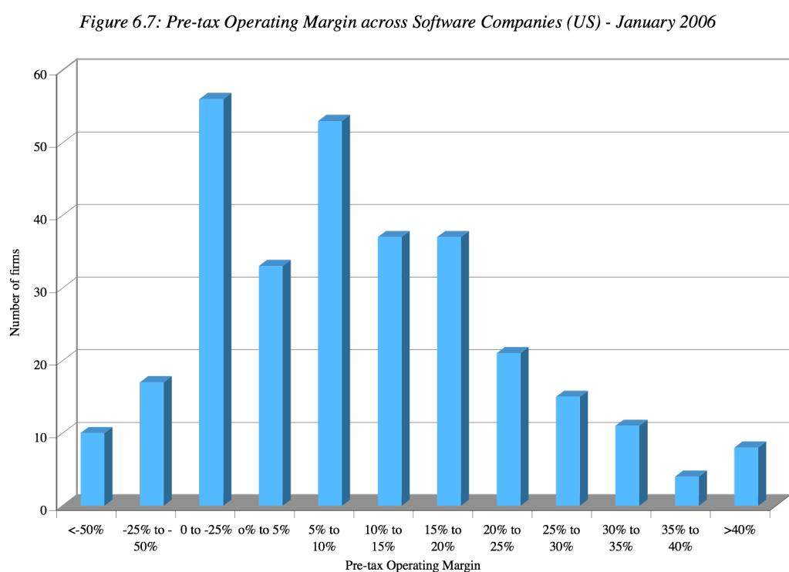

If we use this distribution, we are in effect assuming that the cross sectional variation in the margin is a good indicator of the uncertainty we face in estimating it for the software firm in question. In a second example, assume that you work for Target, the retailer, and that you are trying to estimate the sales per square foot for a new store investment. Target could use the distribution on this variable across existing stores as the basis for its simulation of sales at the new store. c. *Statistical Distribution and parameters*: For most variables that you are trying to forecast, the historical and cross sectional data will be insufficient or unreliable. In these cases, you have to pick a statistical distribution that best captures the variability in the input and estimate the parameters for that distribution. Thus, you may conclude that operating margins will be distributed uniformly, with a minimum of 4% and a maximum of 8% and that revenue growth is normally distributed with an expected value of 8% and a standard deviation of 6%. Many simulation packages available for personal computers now provide a rich array of distributions to choose from, but picking the right distribution and the parameters for the distribution remains difficult for two reasons. The first is that few inputs that we see in practice meet the stringent requirements that statistical distributions demand; revenue growth, for instance, cannot be normally distributed because the lowest value it can take on is -100%. Consequently, we have to settle for statistical distributions that are close enough to the real distribution that the resulting errors will not wreak havoc on our conclusion. The second is that the parameters still need to be estimated, once the distribution is picked. For this, we can draw on historical or cross sectional data; for the revenue growth input, we can look at revenue growth in prior years or revenue growth rate differences across peer group companies. The caveats about structural shifts that make historical data unreliable and peer group companies not being comparable continue to apply.

The probability distributions for discrete for some inputs and continuous for others, be based upon historical data for some and statistical distributions for others. Appendix 1 provides an overview of the statistical distributions that are most commonly used in simulations and their characteristics.

3. Check for correlation across variables: While it is tempting to jump to running simulations right after the distributions have been specified, it is important that we check for correlations across variables. Assume, for instance, that you are developing probability distributions for both interest rates and inflation. While both inputs may be critical in determining value, they are likely to be correlated with each other; high inflation is usually accompanied by high interest rates. When there is strong correlation, positive or negative, across inputs, you have two choices. One is to pick only one of the two inputs to vary; it makes sense to focus on the input that has the bigger impact on

value. The other is to build the correlation explicitly into the simulation; this does require more sophisticated simulation packages and adds more detail to the estimation process. As with the distribution, the correlations can be estimated by looking at the past.

4. Run the simulation: For the first simulation, you draw one outcome from each distribution and compute the value based upon those outcomes. This process can be repeated as many times as desired, though the marginal contribution of each simulation drops off as the number of simulations increases. The number of simulations you run will be determined by the following:

a. Number of probabilistic inputs: The larger the number of inputs that have probability distributions attached to them, the greater will be the required number of simulations.

b. Characteristics of probability distributions: The greater the diversity of distributions in an analysis, the larger will be the number of required simulations. Thus, the number of required simulations will be smaller in a simulation where all of the inputs have normal distributions than in one where some have normal distributions, some are based upon historical data distributions and some are discrete.

c. Range of outcomes: The greater the potential range of outcomes on each input, the greater will be the number of simulations.

Most simulation packages allow users to run thousands of simulations, with little or no cost attached to increasing that number. Given that reality, it is better to err on the side of too many simulations rather than too few.

There have generally been two impediments to good simulations. The first is informational: estimating distributions of values for each input into a valuation is difficult to do. In other words, it is far easier to estimate an expected growth rate of 8% in revenues for the next 5 years than it is to specify the distribution of expected growth rates – the type of distribution, parameters of that distribution – for revenues. The second is computational; until the advent of personal computers, simulations tended to be too time and resource intensive for the typical analysis. Both these constraints have eased in recent years and simulations have become more feasible.

#### *An Example of a Simulation*

Running a simulation is simplest for firms that consider the same kind of projects repeatedly. These firms can use their experience from similar projects that are already in operation to estimate expected values for new projects. The Home Depot, for instance, analyzes dozens of new home improvement stores every year. It also has hundreds of stores in operation10, at different stages in their life cycles; some of these stores have been in operation for more than 10 years and others have been around only for a couple of years. Thus, when forecasting revenues for a new store, the Home Depot can draw on this rich database to make its estimates more precise. The firm has a reasonable idea of how long it takes a new store to become established and how store revenues change as the store ages and new stores open close by.

There are other cases where experience can prove useful for estimating revenues and expenses on a new investment. An oil company, in assessing whether to put up an oil rig, comes into the decision with a clear sense of what the costs are of putting up a rig, and how long it will take for the rig to be productive. Similarly, a pharmaceutical firm, when introducing a new drug, can bring to its analysis its experience with other drugs in the past, how quickly such drugs are accepted and prescribed by doctors, and how responsive revenues are to pricing policy. We are not suggesting that the experience these firms have had in analyzing similar projects in the past removes uncertainty about the project from the analysis. The Home Depot is still exposed to considerable risk on each new store that it analyzes today, but the experience does make the estimation process easier and the estimation error smaller than it would be for a firm that is assessing a unique project.

Assume that the Home Depot is analyzing a new home improvement store that will follow its traditional format11. There are several estimates the Home Depot needs to make when analyzing a new store. Perhaps the most important is the likely revenues at the store. Given that the Home Depot's store sizes are similar across locations, the firm

10 At the end of 2005, the Home Depot had 743 Home Depot stores in operation, 707 of which were in the United States.

11 A typical Home Depot store has store space of about 100,000 square feet and carries a wide range of home improvement products, from hardware to flooring.

can get an idea of the expected revenues by looking at revenues at their existing stores. Figure 6.8 summarizes the distribution12 of annual revenues at existing stores in 2005:

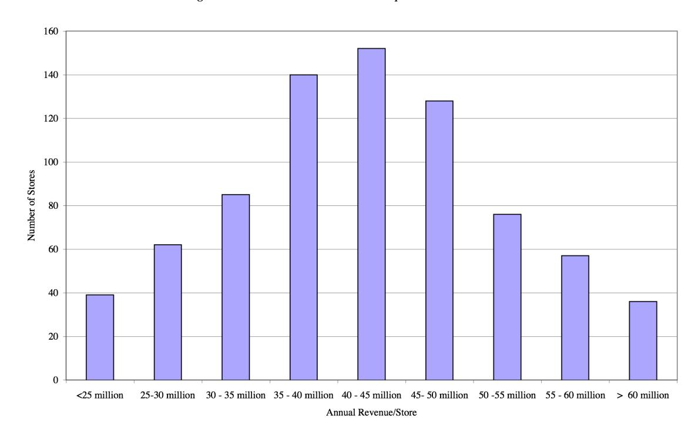

This distribution not only yields an expected revenue per store of about \$ 44 million, but also provides a measure of the uncertainty associated with the estimate, in the form of a standard deviation in revenues per store.

The second key input is the operating margin that the Home Depot expects to generate at this store. While the margins are fairly similar across all of its existing stores, there are significant differences in margins across different building supply retailers, reflecting their competitive strengths or weaknesses. Figure 6.9 summarizes differences in pre-tax operating margins across building supply retailers:

12 This distribution is a hypothetical one, since the Home Depot does not provide this information to outsiders. It does have the information internally.

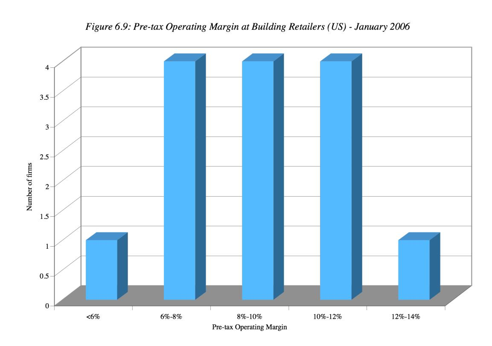

Note that this distribution, unlike the revenue distribution, does not have a noticeable peak. In fact, with one outlier in either direction, it is distributed evenly between 6% and 12%.

Finally, the store's future revenues will be tied to an estimate of expected growth, which we will assume will be strongly influenced by overall economic growth in the United States. To get a measure of this growth, we looked at the distribution of real GDP growth from 1925 to 2005 in figure 6.10:

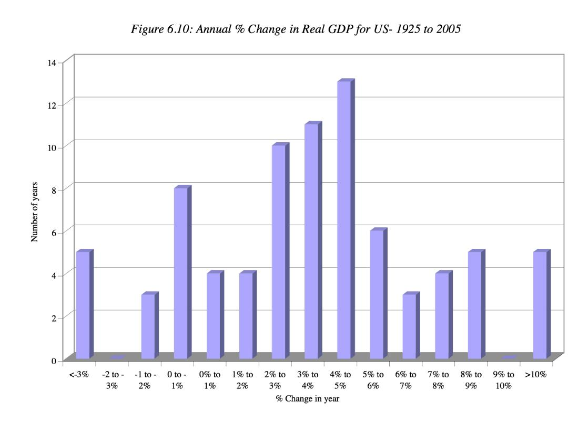

To run a simulation of the Home Depot's store's cash flows and value, we will make the following assumptions:

- Base revenues: We will base our estimate of the base year's revenues on figure 6.8. For computational ease, we will assume that revenues will be normally distributed with an expected value of \$ 44 million and a standard deviation of \$ 10 million.
- Pre-tax operating margin: Based upon figure 6.9, he pre-tax operating margin is assumed to be uniformly distributed with a minimum value of 6% and a maximum value of 12%, with an expected value of 9%. Non-operating expenses are anticipated to be \$ 1.5 million a year.
- Revenue growth: We used a slightly modified version of the actual distribution of historical real GDP changes as the distribution of future changes in real GDP.13 The average real GDP growth over the period was 3%, but there is substantial variation with the worst year delivering a drop in real GDP of more than 8% and the best an increase of more than 8%. The expected annual growth rate in revenues is the sum of

the expected inflation rate and the growth rate in real GDP. We will assume that the expected inflation rate is 2%.

- The store is expected to generate cash flows for 10 years and there is no expected salvage value from the store closure.
- The cost of capital for the Home Depot is 10% and the tax rate is 40%.

We can compute the value of this store to the Home Depot, based entirely upon the expected values of each variable:

Expected Base-year Revenue = \$ 44 million

Expected Base-year After-tax Cash flow = (Revenue \* Pretax Margin – Nonoperating expenses) (1- tax rate ) = (44\*.09 – 1.5) (1- .4) = \$1.476 million

Expected growth rate = GDP growth rate + Expected inflation = 3% + 2% = 5%

Value14 of store = = CF (1+ g) (1- (1+ *g*) n (1+ *r*) n ) (*r* " *g*) = 1.476 (1.05) (1- 1.0510 1.1010 ) (.10".05) = \$11.53 million

The risk adjusted value for this store is \$11.53 million.

We then did a simulation with 10,000 runs, based upon the probability distributions for each of the inputs. 15 The resulting values are graphed in figure 6.11:

13 In the modified version, we smoothed out the distribution to fill in the missing intervals and moved the peak of the distribution slightly to the left (to 3-4% from 4-5%) reflecting the larger size of the economy today.

14 The equation presented here is the equation for the present value of a growing annuity.

15 We used Crystal Ball as the computational program. Crystal Ball is a simulation program produced by Decisioneering Inc.)

*Figure 6.11: Distribution of Estimated Values for HD Store from Simulation*

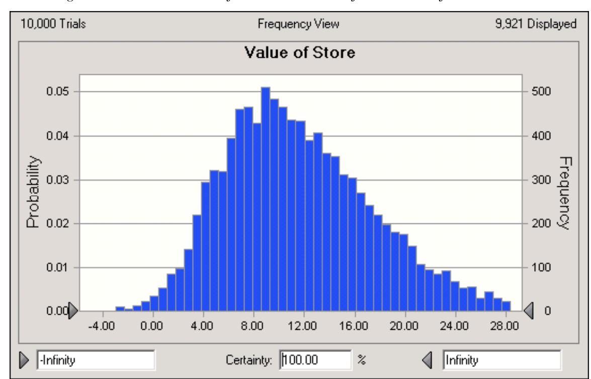

The key statistics on the values obtained across the 10,000 runs are summarized below:

- The average value across the simulations was \$11.67 million, a trifle higher the risk adjusted value of \$11.53 million; the median value was \$ 10.90 million.
- There was substantial variation in values, with the lowest value across all runs of \$5.05 million and the highest value of \$39.42 million; the standard deviation in values was \$5.96 million.

#### *Use in decision making*

A well-done simulation provides us with more than just an expected value for an asset or investment.

- a. Better input estimation: In an ideal simulation, analysts will examine both the historical and cross sectional data on each input variable before making a judgment on what distribution to use and the parameters of the distribution. In the process, they may be able to avoid the sloppiness that is associated with the use of "single best" estimates; many discounted cash flow valuations are based upon

expected growth rates that are obtained from services such Zack's or IBES, which report analysts' consensus estimates.

- b. It yields a distribution for expected value rather than a point estimate: Consider the valuation example that we completed in the last section. In addition to reporting an expected value of \$11.67 million for the store, we also estimated a standard deviation of \$5.96 million in that value and a breakdown of the values, by percentile. The distribution reinforces the obvious but important point that valuation models yield estimates of value for risky assets that are imprecise and explains why different analysts valuing the same asset may arrive at different estimates of value.

Note that there are two claims about simulations that we are unwilling to make. The first is that simulations yield better estimates of expected value than conventional risk adjusted value models. In fact, the expected values from simulations should be fairly close to the expected value that we would obtain using the expected values for each of the inputs (rather than the entire distribution). The second is that simulations, by providing estimates of the expected value and the distribution in that value, lead to better decisions. This may not always be the case since the benefits that decision-makers get by getting a fuller picture of the uncertainty in value in a risky asset may be more than offset by misuse of that risk measure. As we will argue later in this chapter, it is all too common for risk to be double counted in simulations and for decisions to be based upon the wrong type of risk.

# *Simulations with Constraints*

To use simulations as a tool in risk analysis, we have to introduce a constraint, which, if violated, creates very large costs for the firm and perhaps even causes its demise. We can then evaluate the effectiveness of risk hedging tools by examining the likelihood that the constraint will be violated with each one and weighing that off against the cost of the tool. In this section, we will consider some common constraints that are introduced into simulations.

#### *Book Value Constraints*

The book value of equity is an accounting construct and, by itself, means little. Firms like Microsoft and Google trade at market values that are several times their book values. At the other extreme, there are firms that trade at half their book value or less. In fact, there are several hundred firms in the United States, some with significant market values that have negative book values for equity. There are two types of restrictions on book value of equity that may call for risk hedging.

- a. Regulatory Capital Restrictions: Financial service firms such as banks and insurance companies are required to maintain book equity as a fraction of loans or other assets at or above a floor ratio specified by the authorities. Firms that violate these capital constraints can be taken over by the regulatory authorities with the equity investors losing everything if that occurs. Not surprisingly, financial service firms not only keep a close eye on their book value of equity (and the related ratios) but are also conscious of the possibility that the risk in their investments or positions can manifest itself as a drop in book equity. In fact, value at risk or VAR, which we will examine in the next chapter, represents the efforts by financial service firms to understand the potential risks in their investments and to be ready for the possibility of a catastrophic outcome, though the probability of it occurring might be very small. By simulating the values of their investments under a variety of scenarios, they can identify not only the possibility of falling below the regulatory ratios but also look for ways of hedging against this event occurring. The payoff to risk hedging then manifests itself as a decline in or even an elimination of the probability that the firm will violate a regulatory constraint.
- b. Negative Book Value for Equity: As noted, there are hundreds of firms in the United States with negative book values of equity that survive its occurrence and have high market values for equity. There are some countries where a negative book value of equity can create substantial costs for the firm and its investors. For instance, companies with negative book values of equity in parts of Europe are required to raise fresh equity capital to bring their book values above zero. In some countries in Asia, companies that have negative book values of equity are

barred from paying dividends. Even in the United States, lenders to firms can have loan covenants that allow them to gain at least partial control of a firm if its book value of equity turns negative. As with regulatory capital restrictions, we can use simulations to assess the probability of a negative book value for equity and to protect against it.

# *Earnings and Cash flow Constraints*

Earnings and cash flow constraints can be either internally or externally imposed. In some firms managers of firms may decide that the consequences of reporting a loss or not meeting analysis estimates of earnings are so dire, including perhaps the loss of their jobs, that they are willing to expend the resources on risk hedging products to prevent this from happening. The payoff from hedging risk then has nothing to do with firm value maximization and much to do with managerial compensation and incentives. In other firms, the constraints on earnings and cashflows can be externally imposed. For instance, loan covenants can be related to earnings outcomes. Not only can the interest rate on the loan be tied to whether a company makes money or not, but the control of the firm can itself shift to lenders in some cases if the firm loses money. In either case, we can use simulations to both assess the likelihood that these constraints will be violated and to examine the effect of risk hedging products on this likelihood.

# *Market Value Constraints*

In discounted cash flow valuation, the value of the firm is computed as a going concern, by discounting expected cashflows at a risk-adjusted discount rate. Deducting debt from this estimate yields equity value. The possibility and potential costs of not being able to meet debt payments is considered only peripherally in the discount rate. In reality, the costs of not meeting contractual obligations can be substantial. In fact, these costs are generally categorized as indirect bankruptcy costs and could include the loss of customers, tighter supplier credit and higher employee turnover. The perception that a firm is in trouble can lead to further trouble. By allowing us to compare the value of a business to its outstanding claims in all possible scenarios (rather than just the most likely one), simulations allow us to not only quantify the likelihood of distress but also build in

the cost of indirect bankruptcy costs into valuation. In effect, we can explicitly model the effect of distress on expected cash flows and discount rates.

#### *Issues*

The use of simulations in investment analysis was first suggested in an article by David Hertz in the Harvard Business Review.16 He argued that using probability distributions for input variables, rather than single best estimates, would yield more informative output. In the example that he provided in the paper, he used simulations to compare the distributions of returns of two investments; the investment with the higher expected return also had a higher chance of losing money (which was viewed as an indicator of its riskiness). In the aftermath, there were several analysts who jumped on the simulation bandwagon, with mixed results. In recent years, there has been a resurgence in interest in simulations as a tool for risk assessment, especially in the context of using and valuing derivatives. There are several key issues, though, that we have to deal with in the context of using simulations in risk assessment:

a. Garbage in, garbage out: For simulations to have value, the distributions chosen for the inputs should be based upon analysis and data, rather than guesswork. It is worth noting that simulations yield great-looking output, even when the inputs are random. Unsuspecting decision makers may therefore be getting meaningless pictures of the risk in an investment. It is also worth noting that simulations require more than a passing knowledge of statistical distributions and their characteristics; analysts who cannot assess the difference between normal and lognormal distributions should not be doing simulations.

b. Real data may not fit distributions: The problem with the real world is that the data seldom fits the stringent requirements of statistical distributions. Using probability distributions that bear little resemblance to the true distribution underlying an input variable will yield misleading results.

c. Non-stationary distributions: Even when the data fits a statistical distribution or where historical data distributions are available, shifts in the market structure can lead to shifts

16 Hertz, D., 1964, Risk Analysis in Capital Investment, Harvard Business Review.

in the distributions as well. In some cases, this can change the form of the distribution and in other cases, it can change the parameters of the distribution. Thus, the mean and variance estimated from historical data for an input that is normally distributed may change for the next period. What we would really like to use in simulations, but seldom can assess, are forward looking probability distributions.

d. Changing correlation across inputs: Earlier in this chapter, we noted that correlation across input variables can be modeled into simulations. However, this works only if the correlations remain stable and predictable. To the extent that correlations between input variables change over time, it becomes far more difficult to model them.

# *Risk Adjusted Value and Simulations*

In our discussion of decision trees, we referred to the common misconception that decision trees are risk adjusted because they consider the likelihood of adverse events. The same misconception is prevalent in simulations, where the argument is that the cash flows from simulations are somehow risk adjusted because of the use of probability distributions and that the riskfree rate should be used in discounting these cash flows. With one exception, this argument does not make sense. Looking across simulations, the cash flows that we obtain are expected cash flows and are not risk adjusted. Consequently, we should be discounting these cash flows at a risk-adjusted rate.

The exception occurs when you use the standard deviation in values from a simulation as a measure of investment or asset risk and make decisions based upon that measure. In this case, using a risk-adjusted discount rate will result in a double counting of risk. Consider a simple example. Assume that you are trying to choose between two assets, both of which you have valued using simulations and risk adjusted discount rates. Table 6.3 summarizes your findings:

*Table 6.3: Results of Simulation*

|       |                             | Simulation Expected Value | Simulation Std deviation |
|-------|-----------------------------|---------------------------|--------------------------|
| Asset | Risk-adjusted Discount Rate |                           |                          |
| A     | 12%                         | \$ 100                    | 15%                      |
| B     | 15%                         | \$ 100                    | 21%                      |

Note that you view asset B to be riskier and have used a higher discount rate to compute value. If you now proceed to reject asset B, because the standard deviation is higher across the simulated values, you would be penalizing it twice. You can redo the simulations using the riskfree rate as the discount rate for both assets, but a note of caution needs to be introduced. If we then base our choice between these assets on the standard deviation in simulated values, we are assuming that all risk matters in investment choice, rather than only the risk that cannot be diversified away. Put another way, we may end up rejecting an asset because it has a high standard deviation in simulated values, even though adding that asset to a portfolio may result in little additional risk (because much of its risk can be diversified away).

This is not to suggest that simulations are not useful to us in understanding risk. Looking at the variance of the simulated values around the expected value provides a visual reminder that we are estimating value in an uncertain environment. It is also conceivable that we can use it as a decision tool in portfolio management in choosing between two stocks that are equally undervalued but have different value distributions. The stock with the less volatile value distribution may be considered a better investment than another stock with a more volatile value distribution.

# **An Overall Assessment of Probabilistic Risk Assessment Approaches**

Now that we have looked at scenario analysis, decision trees and simulations, we can consider not only when each one is appropriate but also how these approaches complement or replace risk adjusted value approaches.

## *Comparing the approaches*

Assuming that we decide to use a probabilistic approach to assess risk and could choose between scenario analysis, decision trees and simulations, which one should we pick? The answer will depend upon how you plan to use the output and what types of risk you are facing:

1. Selective versus Full Risk Analysis: In the best-case/worst-case scenario analysis, we look at only three scenarios (the best case, the most likely case and the worst case) and ignore all other scenarios. Even when we consider multiple scenarios, we will not have a

complete assessment of all possible outcomes from risky investments or assets. With decision trees and simulations, we attempt to consider all possible outcomes. In decision trees, we try to accomplish this by converting continuous risk into a manageable set of possible outcomes. With simulations, we use probability distributions to capture all possible outcomes. Put in terms of probability, the sum of the probabilities of the scenarios we examine in scenario analysis can be less than one, whereas the sum of the probabilities of outcomes in decision trees and simulations has to equal one. As a consequence, we can compute expected values across outcomes in the latter, using the probabilities as weights, and these expected values are comparable to the single estimate risk adjusted values that we talked about in the last chapter.

2. Type of Risk: As noted above, scenario analysis and decision trees are generally built around discrete outcomes in risky events whereas simulations are better suited for continuous risks. Focusing on just scenario analysis and decision trees, the latter are better suited for sequential risks, since risk is considered in phases, whereas the former is easier to use when risks occur concurrently.

3. Correlation across risks: If the various risks that an investment is exposed to are correlated, simulations allow for explicitly modeling these correlations (assuming that you can estimate and forecast them). In scenario analysis, we can deal with correlations subjectively by creating scenarios that allow for them; the high (low) interest rate scenario will also include slower (higher) economic growth. Correlated risks are difficult to model in decision trees.

Table 6.4 summarizes the relationship between risk type and the probabilistic approach used:

*Table 6.4: Risk Type and Probabilistic Approaches*

| Discrete/Continuous | Correlated/Independent | Sequential/Concurrent | Risk        |
|---------------------|------------------------|-----------------------|-------------|
| Discrete            | Independent            | Sequential            | Decision    |
| Discrete            | Correlated             | Concurrent            | Scenario    |
| Continuous          | Either                 | Either                | Simulations |

Finally, the quality of the information will be a factor in your choice of approach. Since simulations are heavily dependent upon being able to assess probability distributions and parameters, they work best in cases where there is substantial historical and cross sectional data available that can be used to make these assessments. With decision trees, you need estimates of the probabilities of the outcomes at each chance node, making them best suited for risks that can be assessed either using past data or population characteristics. Thus, it should come as no surprise that when confronted with new and unpredictable risks, analysts continue to fall back on scenario analysis, notwithstanding its slapdash and subjective ways of dealing with risk.

# *Complement or Replacement for Risk Adjusted Value*

As we noted in our discussion of both decision trees and simulations, these approaches can be used as either complements to or substitutes for risk-adjusted value. Scenario analysis, on the other hand, will always be a complement to risk adjusted value, since it does not look at the full spectrum of possible outcomes.

When any of these approaches are used as complements to risk adjusted value, the caveats that we offered earlier in the chapter continue to apply and bear repeating. All of these approaches use expected rather than risk adjusted cash flows and the discount rate that is used should be a risk-adjusted discount rate; the riskfree rate cannot be used to discount expected cash flows. In all three approaches, though, we still preserve the flexibility to change the risk adjusted discount rate for different outcomes. Since all of these approaches will also provide a range for estimated value and a measure of variability (in terms of value at the end nodes in a decision tree or as a standard deviation in value in a simulation), it is important that we do not double count for risk. In other words, it is patently unfair to risky investments to discount their cash flows back at a riskadjusted rate (in simulations and decision trees) and to then reject them because the variability in value is high.

Both simulations and decision trees can be used as alternatives to risk adjusted valuation, but there are constraints on the process. The first is that the cash flows will be discounted back at a riskfree rate to arrive at value. The second is that we now use the measure of variability in values that we obtain in both these approaches as a measure of risk in the investment. Comparing two assets with the same expected value (obtained with riskless rates as discount rates) from a simulation, we will pick the one with the lower variability in simulated values as the better investment. If we do this, we are assuming that all of the risks that we have built into the simulation are relevant for the investment decision. In effect, we are ignoring the line drawn between risks that could have been diversified away in a portfolio and asset-specific risk on which much of modern finance is built. For an investor considering investing all of his or her wealth in one asset, this should be reasonable. For a portfolio manager comparing two risky stocks that he or she is considering adding to a diversified portfolio or for a publicly traded company evaluating two projects, it can yield misleading results; the rejected stock or project with the higher variance in simulated values may be uncorrelated with the other investments in the portfolio and thus have little marginal risk.

#### *In practice*

The use of probabilistic approaches has become more common with the surge in data availability and computing power. It is not uncommon now to see a capital budgeting analysis, with a twenty to thirty additional scenarios, or a Monte Carlo simulation attached to an equity valuation. In fact, the ease with which simulations can be implemented has allowed its use in a variety of new markets.

- Deregulated electricity markets: As electricity markets have been deregulated around the world, companies involved in the business of buying and selling electricity have begun using simulation models to quantify the swings in demand and supply of power, and the resulting price volatility. The results have been used to determine how much should be spent on building new power plants and how best to use the excess capacity in these plants.
- Commodity companies: Companies in commodity businesses oil and precious metals, for instance – have used probabilistic approaches to examine how much they should bid for new sources for these commodities, rather than relying on a single best estimate of the future price. Analysts valuing these companies have also taken to modeling the value of these companies as a function of the price of the underlying commodity.

- Technology companies: Shifts in technology can be devastating for businesses that end up on the wrong side of the shift. Simulations and scenario analyses have been used to model the effects on revenues and earnings of the entry and diffusion of new technologies.

As we will see in the next chapter, simulations are a key components of Value at Risk and other risk management tools used, especially in firms that have to deal with risk in financial assets.

#### **Conclusion**

Estimating the risk adjusted value for a risky asset or investment may seem like an exercise in futility. After all, the value is a function of the assumptions that we make about how the risk will unfold in the future. With probabilistic approaches to risk assessment, we estimate not only an expected value but also get a sense of the range of possible outcomes for value, across good and bad scenarios.

- In the most extreme form of scenario analysis, you look at the value in the best case and worst case scenarios and contrast them with the expected value. In its more general form, you estimate the value under a small number of likely scenarios, ranging from optimistic to pessimistic.
- Decision trees are designed for sequential and discrete risks, where the risk in an investment is considered into phases and the risk in each phase is captured in the possible outcomes and the probabilities that they will occur. A decision tree provides a complete assessment of risk and can be used to determine the optimal courses of action at each phase and an expected value for an asset today.
- Simulations provide the most complete assessments of risk since they are based upon probability distributions for each input (rather than a single expected value or just discrete outcomes). The output from a simulation takes the form of an expected value across simulations and a distribution for the simulated values.

With all three approaches, the keys are to avoid double counting risk (by using a riskadjusted discount rate and considering the variability in estimated value as a risk measure) or making decisions based upon the wrong types of risk.

## **Appendix 6.1: Statistical Distributions**

Every statistics book provides a listing of statistical distributions, with their properties, but browsing through these choices can be frustrating to anyone without a statistical background, for two reasons. First, the choices seem endless, with dozens of distributions competing for your attention, with little or no intuitive basis for differentiating between them. Second, the descriptions tend to be abstract and emphasize statistical properties such as the moments, characteristic functions and cumulative distributions. In this appendix, we will focus on the aspects of distributions that are most useful when analyzing raw data and trying to fit the right distribution to that data.

# *Fitting the Distribution*

When confronted with data that needs to be characterized by a distribution, it is best to start with the raw data and answer four basic questions about the data that can help in the characterization. The first relates to whether the data can take on only discrete values or whether the data is continuous; whether a new pharmaceutical drug gets FDA approval or not is a discrete value but the revenues from the drug represent a continuous variable. The second looks at the symmetry of the data and if there is asymmetry, which direction it lies in; in other words, are positive and negative outliers equally likely or is one more likely than the other. The third question is whether there are upper or lower limits on the data;; there are some data items like revenues that cannot be lower than zero whereas there are others like operating margins that cannot exceed a value (100%). The final and related question relates to the likelihood of observing extreme values in the distribution; in some data, the extreme values occur very infrequently whereas in others, they occur more often.

# *Is the data discrete or continuous?*

The first and most obvious categorization of data should be on whether the data is restricted to taking on only discrete values or if it is continuous. Consider the inputs into a typical project analysis at a firm. Most estimates that go into the analysis come from distributions that are continuous; market size, market share and profit margins, for instance, are all continuous variables. There are some important risk factors, though, that

can take on only discrete forms, including regulatory actions and the threat of a terrorist attack; in the first case, the regulatory authority may dispense one of two or more decisions which are specified up front and in the latter, you are subjected to a terrorist attack or you are not.

With discrete data, the entire distribution can either be developed from scratch or the data can be fitted to a pre-specified discrete distribution. With the former, there are two steps to building the distribution. The first is identifying the possible outcomes and the second is to estimate probabilities to each outcome. As we noted in the text, we can draw on historical data or experience as well as specific knowledge about the investment being analyzed to arrive at the final distribution. This process is relatively simple to accomplish when there are a few outcomes with a well-established basis for estimating probabilities but becomes more tedious as the number of outcomes increases. If it is difficult or impossible to build up a customized distribution, it may still be possible fit the data to one of the following discrete distributions:

- a. Binomial distribution: The binomial distribution measures the probabilities of the number of successes over a given number of trials with a specified probability of success in each try. In the simplest scenario of a coin toss (with a fair coin), where the probability of getting a head with each toss is 0.50 and there are a hundred trials, the binomial distribution will measure the likelihood of getting anywhere from no heads in a hundred tosses (very unlikely) to 50 heads (the most likely) to 100 heads (also very unlikely). The binomial distribution in this case will be symmetric, reflecting the even odds; as the probabilities shift from even odds, the distribution will get more skewed. Figure 6A.1 presents binomial distributions for three scenarios – two with 50% probability of success and one with a 70% probability of success and different trial sizes.

*Figure 6A.1: Binomial Distribution*

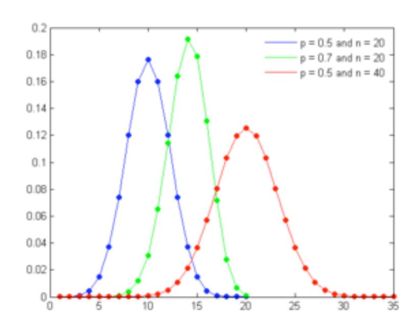

As the probability of success is varied (from 50%) the distribution will also shift its shape, becoming positively skewed for probabilities less than 50% and negatively skewed for probabilities greater than 50%. 17

- b. Poisson distribution: The Poisson distribution measures the likelihood of a number of events occurring within a given time interval, where the key parameter that is required is the average number of events in the given interval (λ). The resulting distribution looks similar to the binomial, with the skewness being positive but decreasing with λ. Figure 6A.2 presents three Poisson distributions, with λ ranging from 1 to 10.

17 As the number of trials increases and the probability of success is close to 0.5, the binomial distribution converges on the normal distribution.

*Figure 6A.2: Poisson Distribution*

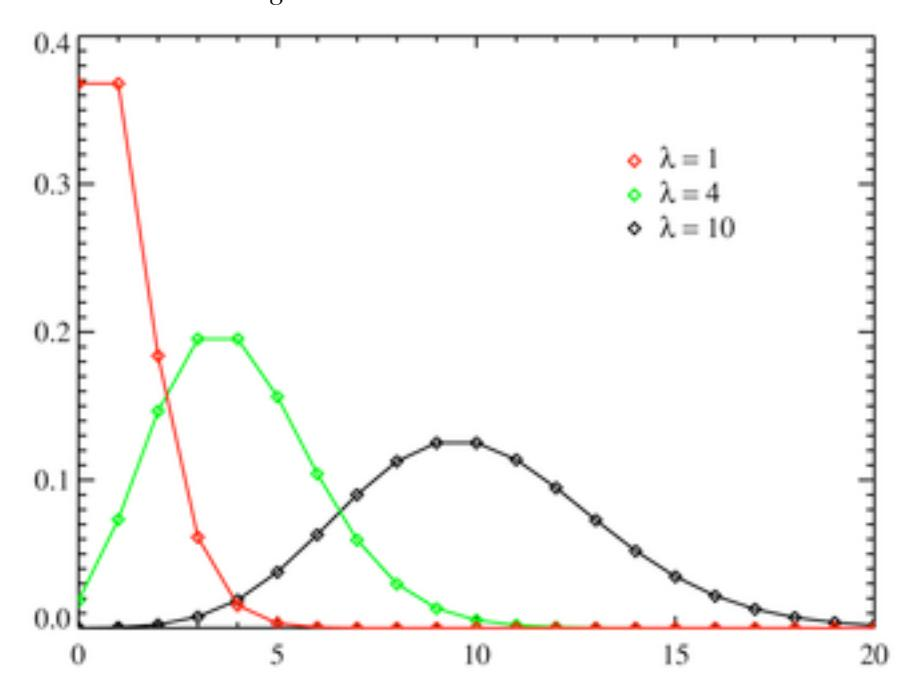

- c. Negative Binomial distribution: Returning again to the coin toss example, assume that you hold the number of successes fixed at a given number and estimate the number of tries you will have before you reach the specified number of successes. The resulting distribution is called the negative binomial and it very closely resembles the Poisson. In fact, the negative binomial distribution converges on the Poisson distribution, but will be more skewed to the right (positive values) than the Poisson distribution with similar parameters.
- d. Geometric distribution: Consider again the coin toss example used to illustrate the binomial. Rather than focus on the number of successes in n trials, assume that you were measuring the likelihood of when the first success will occur. For instance, with a fair coin toss, there is a 50% chance that the first success will occur at the first try, a 25% chance that it will occur on the second try and a 12.5% chance that it will occur on the third try. The resulting distribution is positively skewed and looks as follows for three different probability scenarios (in figure 6A.3):

*Figure 6A.3: Geometric Distribution*

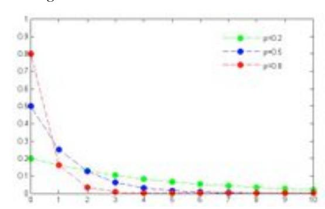

Note that the distribution is steepest with high probabilities of success and flattens out as the probability decreases. However, the distribution is always positively skewed.

- e. Hypergeometric distribution: The hypergeometric distribution measures the probability of a specified number of successes in n trials, without replacement, from a finite population. Since the sampling is without replacement, the probabilities can change as a function of previous draws. Consider, for instance, the possibility of getting four face cards in hand of ten, over repeated draws from a pack. Since there are 16 face cards and the total pack contains 52 cards, the probability of getting four face cards in a hand of ten can be estimated. Figure 6A.4 provides a graph of the hypergeometric distribution:

*Figure 6A.4: Hypergeometric Distribution*

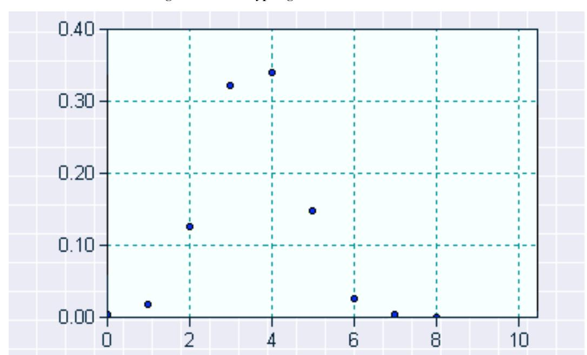

Note that the hypergeometric distribution converges on binomial distribution as the as the population size increases.

- f. Discrete uniform distribution: This is the simplest of discrete distributions and applies when all of the outcomes have an equal probability of occurring. Figure 6A.5 presents a uniform discrete distribution with five possible outcomes, each occurring 20% of the time:

*Figure 6A.5: Discrete Uniform Distribution*

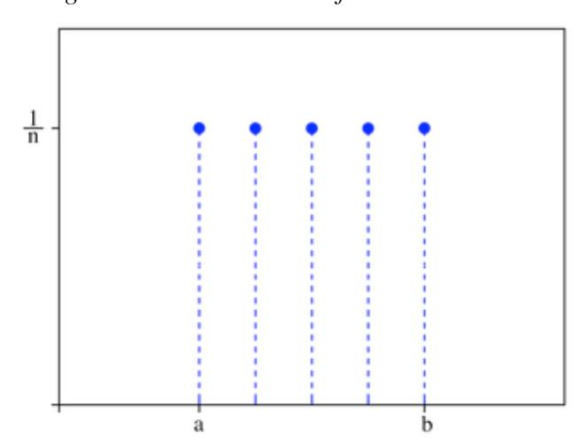

The discrete uniform distribution is best reserved for circumstances where there are multiple possible outcomes, but no information that would allow us to expect that one outcome is more likely than the others.

With continuous data, we cannot specify all possible outcomes, since they are too numerous to list, but we have two choices. The first is to convert the continuous data into a discrete form and then go through the same process that we went through for discrete distributions of estimating probabilities. For instance, we could take a variable such as market share and break it down into discrete blocks – market share between 3% and 3.5%, between 3.5% and 4% and so on – and consider the likelihood that we will fall into each block. The second is to find a continuous distribution that best fits the data and to specify the parameters of the distribution. The rest of the appendix will focus on how to make these choices.

#### *How symmetric is the data?*

There are some datasets that exhibit symmetry, i.e., the upside is mirrored by the downside. The symmetric distribution that most practitioners have familiarity with is the normal distribution, sown in Figure 6A.6, for a range of parameters:

*Figure 6A.6: Normal Distribution*

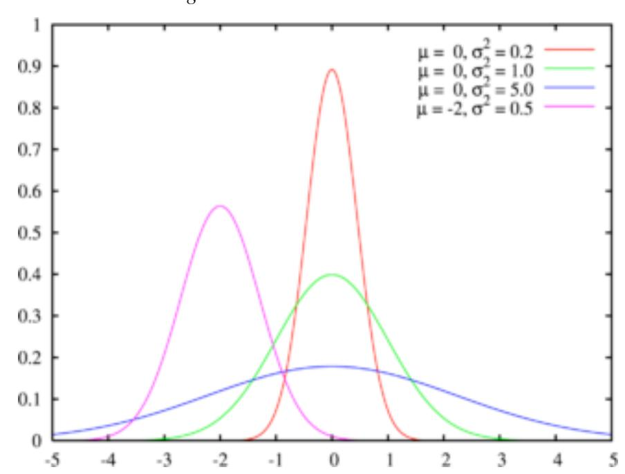

The normal distribution has several features that make it popular. First, it can be fully characterized by just two parameters – the mean and the standard deviation – and thus reduces estimation pain. Second, the probability of any value occurring can be obtained simply by knowing how many standard deviations separate the value from the mean; the probability that a value will fall 2 standard deviations from the mean is roughly 95%. The normal distribution is best suited for data that, at the minimum, meets the following conditions:

- a. There is a strong tendency for the data to take on a central value.
- b. Positive and negative deviations from this central value are equally likely
- c. The frequency of the deviations falls off rapidly as we move further away from the central value.

The last two conditions show up when we compute the parameters of the normal distribution: the symmetry of deviations leads to zero skewness and the low probabilities of large deviations from the central value reveal themselves in no kurtosis.

There is a cost we pay, though, when we use a normal distribution to characterize data that is non-normal since the probability estimates that we obtain will be misleading and can do more harm than good. One obvious problem is when the data is asymmetric but another potential problem is when the probabilities of large deviations from the

central value do not drop off as precipitously as required by the normal distribution. In statistical language, the actual distribution of the data has fatter tails than the normal. While all of symmetric distributions in the family are like the normal in terms of the upside mirroring the downside, they vary in terms of shape, with some distributions having fatter tails than the normal and the others more accentuated peaks. These distributions are characterized as leptokurtic and you can consider two examples. One is the logistic distribution, which has longer tails and a higher kurtosis (1.2, as compared to 0 for the normal distribution) and the other are Cauchy distributions, which also exhibit symmetry and higher kurtosis and are characterized by a scale variable that determines how fat the tails are. Figure 6A.7 present a series of Cauchy distributions that exhibit the bias towards fatter tails or more outliers than the normal distribution.

*Figure 6A.7: Cauchy Distribution*

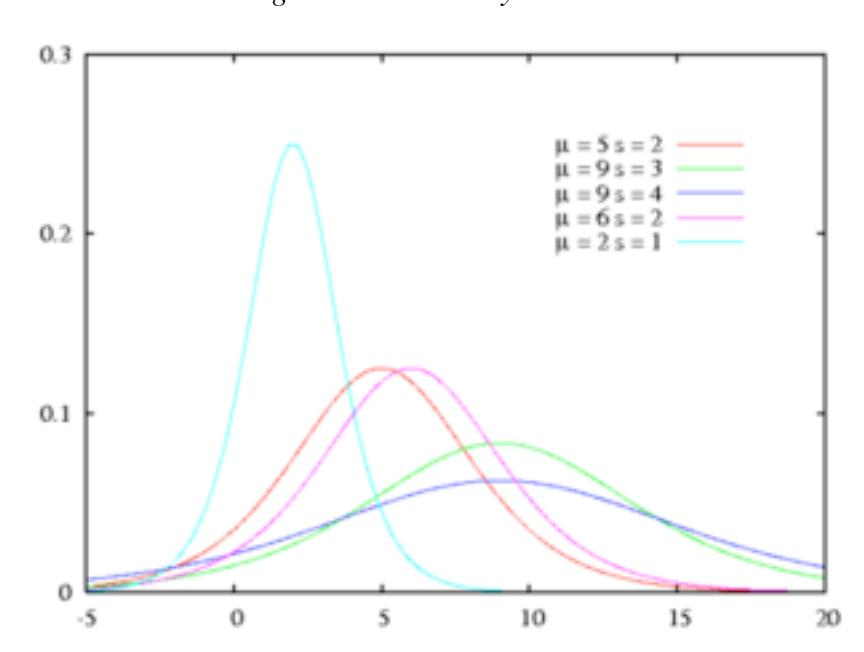

Either the logistic or the Cauchy distributions can be used if the data is symmetric but with extreme values that occur more frequently than you would expect with a normal distribution.

As the probabilities of extreme values increases relative to the central value, the distribution will flatten out. At its limit, assuming that the data stays symmetric and we put limits on the extreme values on both sides, we end up with the uniform distribution, shown in figure 6A.8:

*Figure 6A.8: Uniform Distribution*

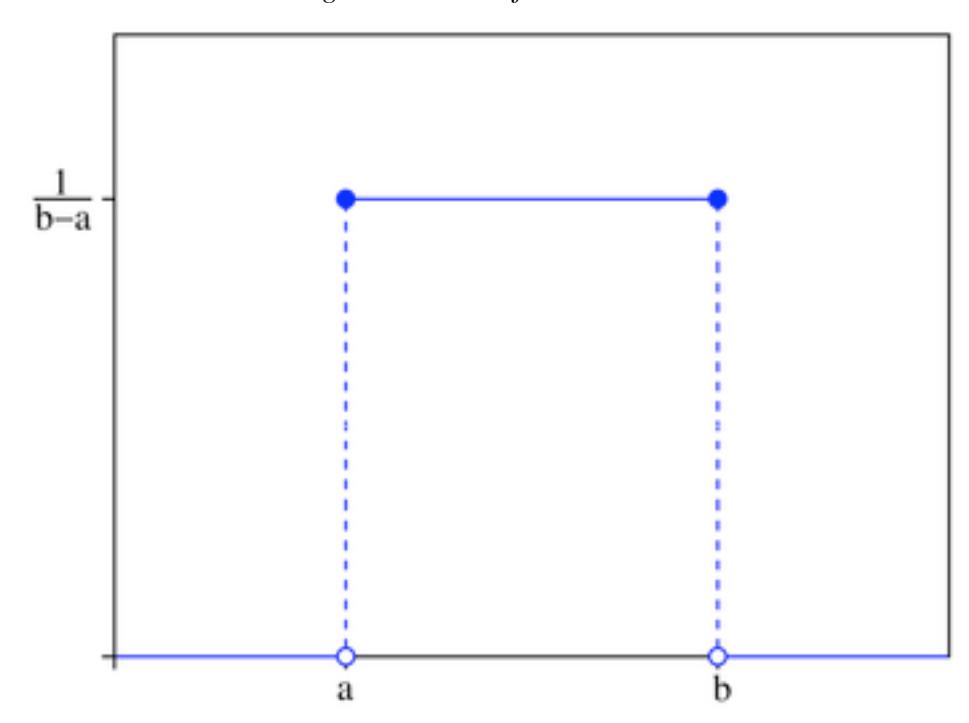

When is it appropriate to assume a uniform distribution for a variable? One possible scenario is when you have a measure of the highest and lowest values that a data item can take but no real information about where within this range the value may fall. In other words, any value within that range is just as likely as any other value.

Most data does not exhibit symmetry and instead skews towards either very large positive or very large negative values. If the data is positively skewed, one common choice is the lognormal distribution, which is typically characterized by three parameters: a shape (σ or sigma), a scale (µ or median) and a shift parameter ( ! " ). When m=0 and " =1, you have the standard lognormal distribution and when ! " =0, the distribution requires only scale and sigma parameters. As the sigma rises, the peak of the distribution shifts to the left and the skewness in the distribution increases. Figure 6A.9 graphs lognormal distributions for a range of parameters:

*Figure 6A.9: Lognormal distribution*

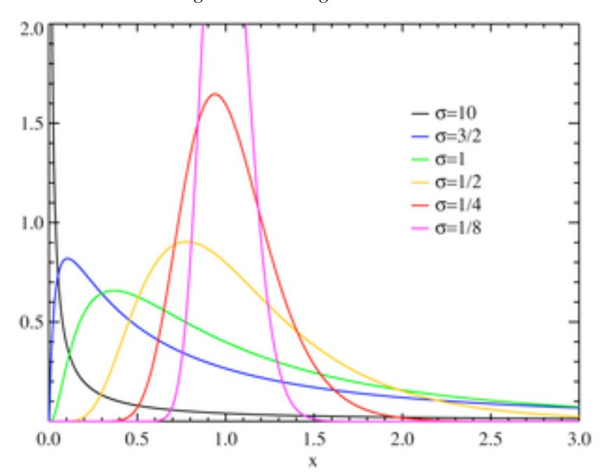

The Gamma and Weibull distributions are two distributions that are closely related to the lognormal distribution; like the lognormal distribution, changing the parameter levels (shape, shift and scale) can cause the distributions to change shape and become more or less skewed. In all of these functions, increasing the shape parameter will push the distribution towards the left. In fact, at high values of sigma, the left tail disappears entirely and the outliers are all positive. In this form, these distributions all resemble the exponential, characterized by a location (m) and scale parameter (b), as is clear from

figure 6A.10.

*Figure 6A.10: Weibull Distribution*

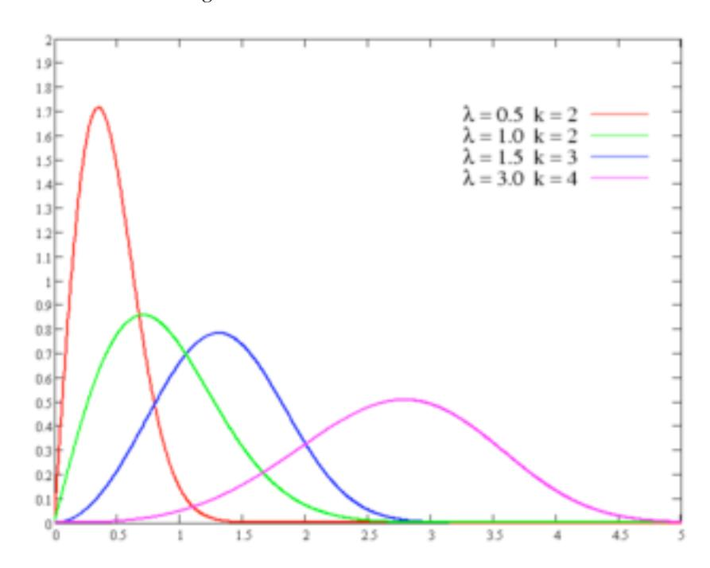

The question of which of these distributions will best fit the data will depend in large part on how severe the asymmetry in the data is. For moderate positive skewness, where there are both positive and negative outliers, but the former and larger and more common, the standard lognormal distribution will usually suffice. As the skewness becomes more severe, you may need to shift to a three-parameter lognormal distribution or a Weibull distribution, and modify the shape parameter till it fits the data. At the extreme, if there are no negative outliers and the only positive outliers in the data, you should consider the exponential function, shown in Figure 6a.11:

*Figure 6A.11: Exponential Distribution*

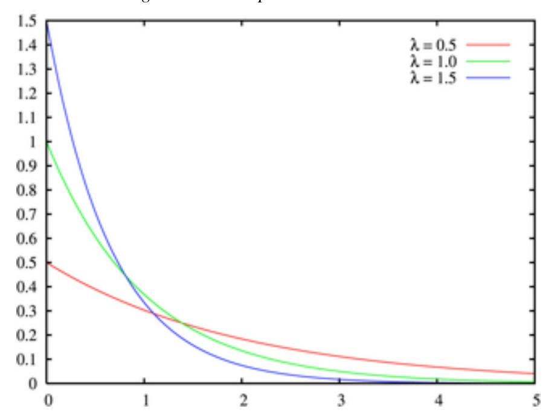

If the data exhibits negative slewness, the choices of distributions are more limited. One possibility is the Beta distribution, which has two shape parameters (p and q) and upper and lower bounds on the data (a and b). Altering these parameters can yield distributions that exhibit either positive or negative skewness, as shown in figure 6A.12:

*Figure 6A.12: Beta Distribution*

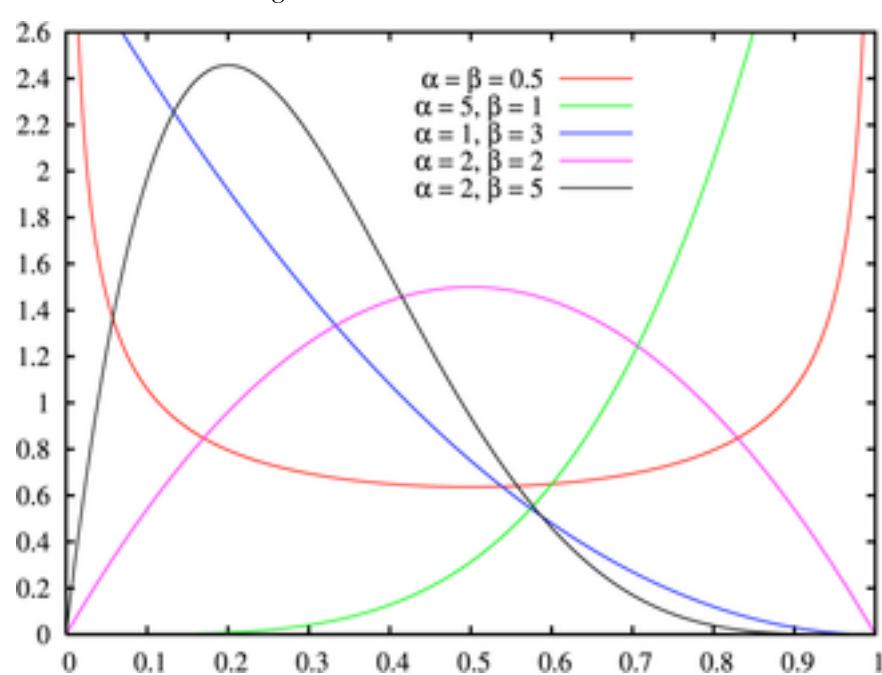

Another is an extreme value distribution, which can also be altered to generate both positive and negative skewness, depending upon whether the extreme outcomes are the maximum (positive) or minimum (negative) values (see Figure 6A.13)

*Figure 6A.13: Extreme Value Distributions*

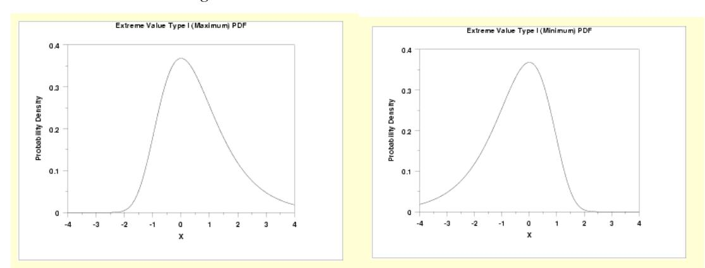

*Are there upper or lower limits on data values?*

There are often natural limits on the values that data can take on. As we noted earlier, the revenues and the market value of a firm cannot be negative and the profit margin cannot exceed 100%. Using a distribution that does not constrain the values to these limits can create problems. For instance, using a normal distribution to describe profit margins can sometimes result in profit margins that exceed 100%, since the distribution has no limits on either the downside or the upside.

When data is constrained, the questions that needs to be answered are whether the constraints apply on one side of the distribution or both, and if so, what the limits on values are. Once these questions have been answered, there are two choices. One is to find a continuous distribution that conforms to these constraints. For instance, the lognormal distribution can be used to model data, such as revenues and stock prices that are constrained to be never less than zero. For data that have both upper and lower limits, you could use the uniform distribution, if the probabilities of the outcomes are even across outcomes or a triangular distribution (if the data is clustered around a central value). Figure 6A.14 presents a triangular distribution:

*Figure 6A.14: Triangular Distribution*

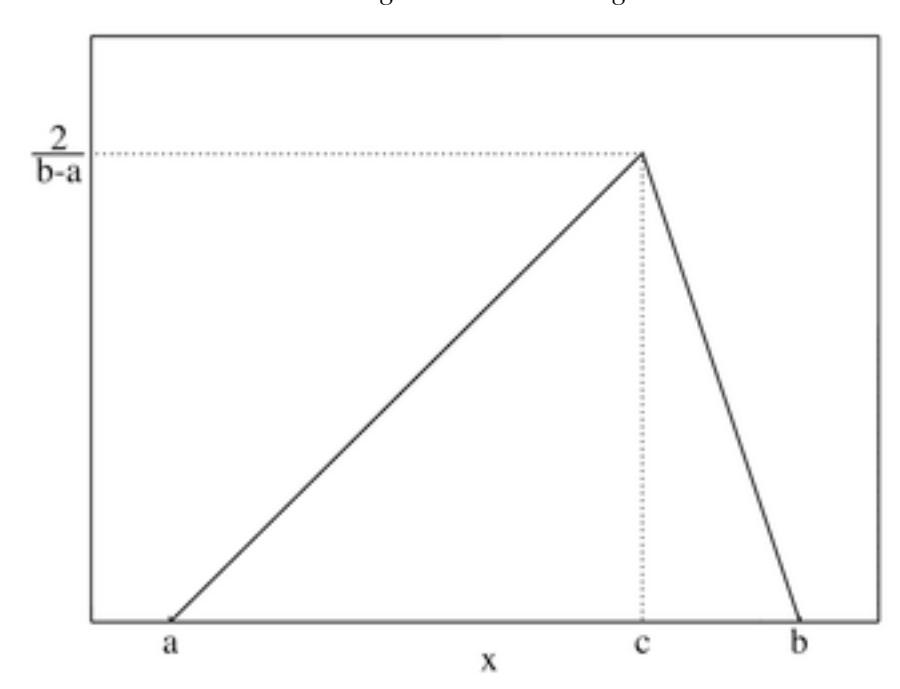

An alternative approach is to use a continuous distribution that normally allows data to take on any value and to put upper and lower limits on the values that the data can assume. Note that the cost of putting these constrains is small in distributions like the normal where the probabilities of extreme values is very small, but increases as the distribution exhibits fatter tails.

# *How likely are you to see extreme values of data, relative to the middle values?*

As we noted in the earlier section, a key consideration in what distribution to use to describe the data is the likelihood of extreme values for the data, relative to the middle value. In the case of the normal distribution, this likelihood is small and it increases as you move to the logistic and Cauchy distributions. While it may often be more realistic to use the latter to describe real world data, the benefits of a better distribution fit have to be weighed off against the ease with which parameters can be estimated from the normal distribution. Consequently, it may make sense to stay with the normal distribution for symmetric data, unless the likelihood of extreme values increases above a threshold.

The same considerations apply for skewed distributions, though the concern will generally be more acute for the skewed side of the distribution. In other words, with positively skewed distribution, the question of which distribution to use will depend upon

how much more likely large positive values are than large negative values, with the fit ranging from the lognormal to the exponential.

In summary, the question of which distribution best fits data cannot be answered without looking at whether the data is discrete or continuous, symmetric or asymmetric and where the outliers lie. Figure 6A.15 summarizes the choices in a chart.

### *Tests for Fit*

The simplest test for distributional fit is visual with a comparison of the histogram of the actual data to the fitted distribution. Consider figure 6A.16, where we report the distribution of current price earnings ratios for US stocks in early 2007, with a normal distribution superimposed on it.

*Figure 6A.16: Current PE Ratios for US Stocks – January 2007*

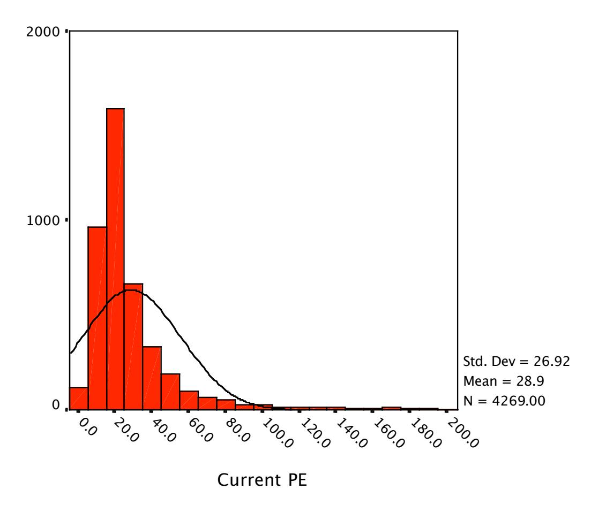

The distributions are so clearly divergent that the normal distribution assumption does not hold up.

A slightly more sophisticated test is to compute the moments of the actual data distribution – the mean, the standard deviation, skewness and kurtosis – and to examine them for fit to the chosen distribution. With the price-earnings data above, for instance, the moments of the distribution and key statistics are summarized in table 6A.1:

*Table 6A.1: Current PE Ratio for US stocks – Key Statistics*

|                    | <i>Current PE</i> | <i>Normal Distribution</i> |
|--------------------|-------------------|----------------------------|
| Mean               | 28.947            |                            |
| Median             | 20.952            | Median = Mean              |
| Standard deviation | 26.924            |                            |
| Skewness           | 3.106             | 0                          |
| Kurtosis           | 11.936            | 0                          |

Since the normal distribution has no skewness and zero kurtosis, we can easily reject the hypothesis that price earnings ratios are normally distributed.

The typical tests for goodness of fit compare the actual distribution function of the data with the cumulative distribution function of the distribution that is being used to characterize the data, to either accept the hypothesis that the chosen distribution fits the data or to reject it. Not surprisingly, given its constant use, there are more tests for normality than for any other distribution. The Kolmogorov-Smirnov test is one of the oldest tests of fit for distributions18, dating back to 1967. Improved versions of the tests include the Shapiro-Wilk and Anderson-Darling tests. Applying these tests to the current PE ratio yields the unsurprising result that the hypothesis that current PE ratios are drawn from a normal distribution is roundly rejected:

*Tests of Normality*

| Tests of Normality |                                 |      |      |              |      |      |
|--------------------|---------------------------------|------|------|--------------|------|------|
|                    | Kolmogorov-Smirnov a |      |      | Shapiro-Wilk |      |      |
|                    | Statistic                       | df   | Sig. | Statistic    | df   | Sig. |
| Current PE         | .204                            | 4269 | .000 | .671         | 4269 | .000 |

There are graphical tests of normality, where probability plots can be used to assess the hypothesis that the data is drawn from a normal distribution. Figure 6A.17 illustrates this, using current PE ratios as the data set.

18 The Kolgomorov-Smirnov test can be used to see if the data fits a normal, lognormal, Weibull, exponential or logistic distribution.

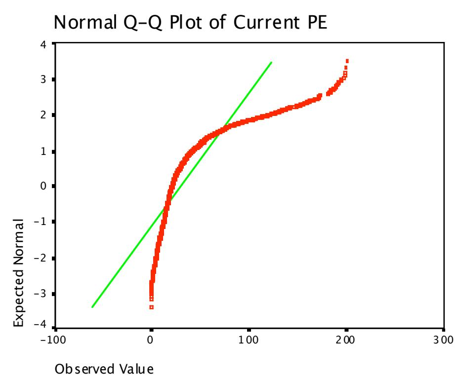

Given that the normal distribution is one of easiest to work with, it is useful to begin by testing data for non-normality to see if you can get away with using the normal distribution. If not, you can extend your search to other and more complex distributions.

# **Conclusion**

Raw data is almost never as well behaved as we would like it to be. Consequently, fitting a statistical distribution to data is part art and part science, requiring compromises along the way. The key to good data analysis is maintaining a balance between getting a good distributional fit and preserving ease of estimation, keeping in mind that the ultimate objective is that the analysis should lead to better decision. In particular, you may decide to settle for a distribution that less completely fits the data over one that more completely fits it, simply because estimating the parameters may be easier to do with the former. This may explain the overwhelming dependence on the normal distribution in practice, notwithstanding the fact that most data do not meet the criteria needed for the distribution to fit.

**Figure 6A.15: Distributional Choices**

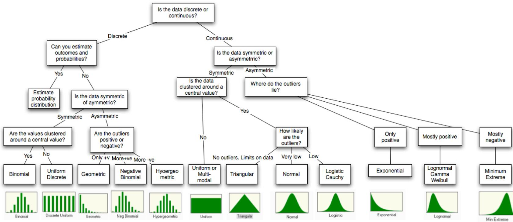