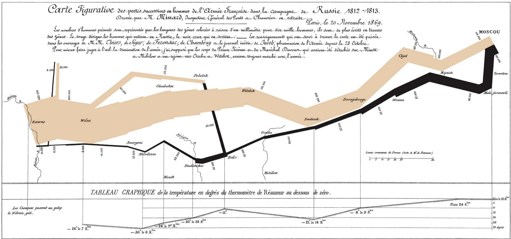
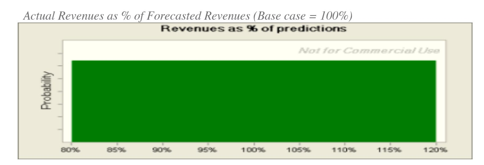
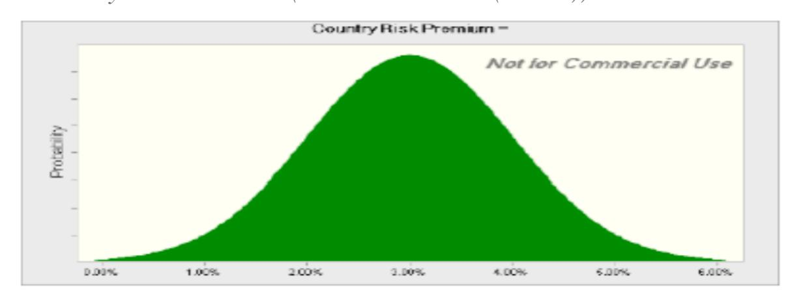
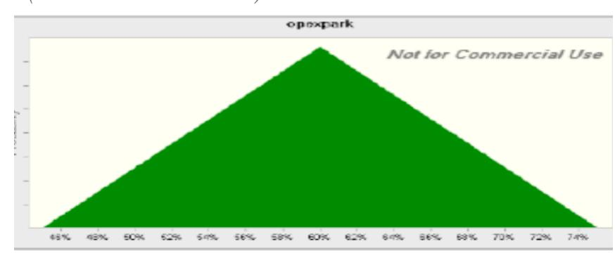
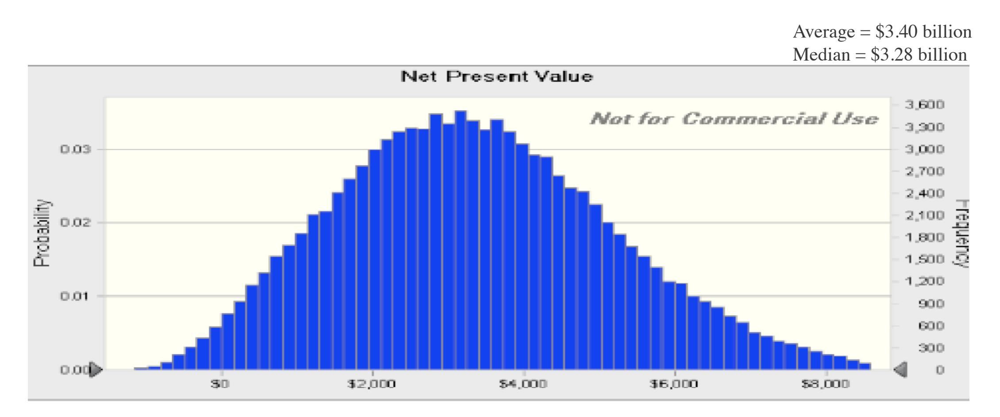
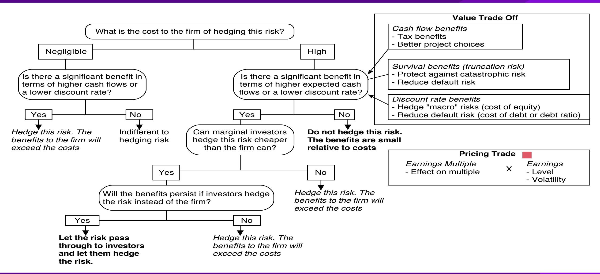
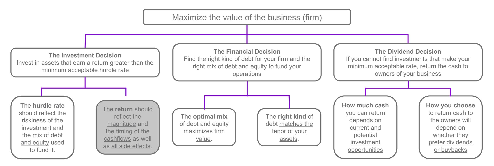

# **SESSION 16: LOOSE ENDS**

No garnishing allowed in investment analysis.

# SESSION 16: LOOSE ENDS

## SET UP AND OBJECTIVE

1. 1. WHAT IS CORPORATE FINANCE?
2. 2. THE OBJECTIVE: UTOPIA AND LET DOWN
3. 3. THE OBJECTIVE: REALITY AND REACTION

### THE INVESTMENT PRINCIPLE

INVEST IN ASSETS THAT EARN A RETURN GREATER THAN THE MINIMUM ACCEPTABLE HURDLE RATE

#### HURDLE RATE

1. 4. DEFINE & MEASURE RISK
2. 5. THE RISK FREE RATE
3. 6. EQUITY RISK PREMIUMS
4. 7. COUNTRY RISK PREMIUMS
5. 8. REGRESSION BETAS
6. 9. BETA FUNDAMENTALS
7. 10. BOTTOM-UP BETAS
8. 11. THE "RIGHT" BETA
9. 12. DEBT: MEASURE & COST
10. 13. FINANCING WEIGHTS

#### INVESTMENT RETURN

1. 14. EARNINGS AND CASH FLOWS
2. 15. TIME WEIGHTING CASH FLOWS
3. 16. LOOSE ENDS

### THE FINANCING PRINCIPLE

FIND THE RIGHT KIND OF DEBT FOR YOUR FIRM AND THE RIGHT MIX OF DEBT AND EQUITY TO FUND YOUR OPERATIONS

#### FINANCING MIX

1. 17. THE TRADE OFF
2. 18. COST OF CAPITAL: APPROACH
3. 19. COST OF CAPITAL: FOLLOW UP
4. 20. COST OF CAPITAL: WRAP UP
5. 21. ALTERNATIVE APPROACHES
6. 22. MOVING TO THE OPTIMAL

#### FINANCING TYPE

1. 23. THE RIGHT FINANCING

1. 36. FINAL THOUGHTS

### THE DIVIDEND PRINCIPLE

IF YOU CANNOT FIND INVESTMENTS THAT MAKE YOUR MINIMUM ACCEPTABLE RATE, RETURN THE CASH TO OWNERS

#### DIVIDEND POLICY

1. 24. TRENDS & MEASURES
2. 25. THE TRADE OFF
3. 26. ASSESSMENTS
4. 27. ACTION & FOLLOW UP
5. 28. THE END GAME

#### VALUATION

1. 29. FIRST STEPS
2. 30. CASH FLOWS
3. 31. GROWTH
4. 32. TERMINAL VALUE
5. 33. TO VALUE PER SHARE
6. 34. VALUE OF CONTROL
7. 35. RELATIVE VALUATION

# **RIO DISNEY: THE US DOLLAR ASSESSMENT**

| Year | Annual Cashflo | Terminal Value | Present Value |
|------|----------------|----------------|---------------|
|      | 0              | -\$2,000       | -\$2,000      |
|      | 1              | -\$1,000       | -\$922        |
|      | 2              | -\$859         | -\$730        |
|      | 3              | -\$267         | -\$210        |
|      | 4              | \$340          | \$246         |
|      | 5              | \$466          | \$311         |
|      | 6              | \$516          | \$317         |
|      | 7              | \$555          | \$314         |
|      | 8              | \$615          | \$321         |
|      | 9              | \$681          | \$328         |
|      | 10             | \$715          | \$5,321       |
|      |                |                | \$3,296       |

Discounted at Rio Disney cost of capital of 8.46%

# **DOES THE CURRENCY MATTER?**

- The analysis was done in dollars. Would the conclusions have been any different if we had done the analysis in Brazilian Reais?
  - a. Yes
  - b. No

# **DISNEY THEME PARK: \$R NPV**

Discount at \$R cost of capital = (1.0846) (1.09/1.02) – 1 = 15.91%

|  | Year | Cashflow (\$) | \$R/\$   | Cashflow (Bt) | Present Value |
|--|------|---------------|----------|---------------|---------------|
|  | 0    | -R\$ 2,000    | R\$ 2.35 | -R\$ 4,700    | -R\$ 4,700    |
|  | 1    | -R\$ 1,000    | R\$ 2.51 | -R\$ 2,511    | -R\$ 2,167    |
|  | 2    | -R\$ 859      | R\$ 2.68 | -R\$ 2,305    | -R\$ 1,716    |
|  | 3    | -R\$ 267      | R\$ 2.87 | -R\$ 767      | -R\$ 492      |
|  | 4    | R\$ 340       | R\$ 3.06 | R\$ 1,043     | R\$ 578       |
|  | 5    | R\$ 466       | R\$ 3.27 | R\$ 1,527     | R\$ 730       |
|  | 6    | R\$ 516       | R\$ 3.50 | R\$ 1,807     | R\$ 745       |
|  | 7    | R\$ 555       | R\$ 3.74 | R\$ 2,076     | R\$ 739       |
|  | 8    | R\$ 615       | R\$ 4.00 | R\$ 2,458     | R\$ 754       |
|  | 9    | R\$ 681       | R\$ 4.27 | R\$ 2,910     | R\$ 771       |
|  | 10   | R\$ 11,990    | R\$ 4.56 | R\$ 54,720    | R\$ 12,504    |
|  |      |               |          |               | R\$ 7,745     |

Expected Exchange Ratet = Exchange Rate today \* (1.09/1.02)t

NPV = R\$ 7,745/2.35= \$ 3,296 Million

NPV is equal to NPV in dollar terms

# **UNCERTAINTY IN PROJECT ANALYSIS: WHAT CAN WE DO?**

- Based on our expected cash flows and the estimated cost of capital, the proposed theme park looks like a very good investment for Disney. Which of the following may affect your assessment of value?
  - a. Revenues may be over-estimated (crowds may be smaller and spend less)
  - b. Actual costs may be higher than estimated costs
  - c. Tax rates may go up
  - d. Risk premiums and default spreads may increase
  - e. All of the above
- How would you respond to this uncertainty?
  - a. Will wait for the uncertainty to be resolved
  - b. Will not take the investment
  - c. Ignore it
  - d. Other

## **ONE SIMPLISTIC SOLUTION: SEE HOW QUICKLY YOU CAN GET YOUR MONEY BACK . . .**

- If your biggest fear is losing the billions that you invested in the project, one simple measure that you can compute is the number of years it will take you to get your money back.

| Year | Cash Flow | Cumulated CF | PV of Cash Flow | Cumulated DCF |
|------|-----------|--------------|-----------------|---------------|
| 0    | -\$2,000  | -\$2,000     | -\$2,000        | -\$2,000      |
| 1    | -\$1,000  | -\$3,000     | -\$922          | -\$2,922      |
| 2    | -\$859    | -\$3,859     | -\$730          | -\$3,652      |
| 3    | -\$267    | -\$4,126     | -\$210          | -\$3,862      |
| 4    | \$340     | -\$3,786     | \$246           | -\$3,616      |
| 5    | \$466     | -\$3,320     | \$311           | -\$3,305      |
| 6    | \$516     | -\$2,803     | \$317           | -\$2,988      |
| 7    | \$555     | -\$2,248     | \$314           | -\$2,674      |
| 8    | \$615     | -\$1,633     | \$321           | -\$2,353      |
| 9    | \$681     | -\$952       | \$328           | -\$2,025      |
| 10   | \$715     | -\$237       | \$317           | -\$1,708      |
| 11   | \$729     | \$491        | \$298           | -\$1,409      |
| 12   | \$743     | \$1,235      | \$280           | -\$1,129      |
| 13   | \$758     | \$1,993      | \$264           | -\$865        |
| 14   | \$773     | \$2,766      | \$248           | -\$617        |
| 15   | \$789     | \$3,555      | \$233           | -\$384        |
| 16   | \$805     | \$4,360      | \$219           | -\$165        |
| 17   | \$821     | \$5,181      | \$206           | \$41          |

Payback = 10.3 years

> Discounted Payback = 16.8 years

## **A SLIGHTLY MORE SOPHISTICATED APPROACH: SENSITIVITY ANALYSIS & WHAT-IF QUESTIONS . . .**

- The NPV, IRR and accounting returns for an investment will change as we change the values that we use for different variables.
- One way of analyzing uncertainty is to check to see how sensitive the decision measure (NPV, IRR, . . .) is to changes in key assumptions. While this has become easier and easier to do over time, there are caveats that we would offer. o Caveat 1: When analyzing the effects of changing a variable, we often hold all else constant. In the real world, variables move together. o Caveat 2: The objective in the sensitivity analysis is that we make better decisions, not churn out more tables and numbers.
  - **Corollary 1**: Less is more. Not everything is worth varying.
  - **Corollary 2**: A picture is worth a thousand numbers (and tables).

# **AND HERE IS A REALLY GOOD PICTURE . . .**

### **THE FINAL STEP UP: INCORPORATE PROBABILISTIC ESTIMATES RATHER THAN EXPECTED VALUES**

*Operating Expenses at Parks as % of Revenues (Base Case = 60%)*

#### *Country Risk Premium (Base Case = 3% (Brazil))*

# **THE RESULTING SIMULATION . . .**

NPV ranges from -\$1 billion to +\$8.5 billion. NPV is negative 12% of the time.

# **A SIDE BAR: SHOULD YOU HEDGE RISKS?**

- Disney can reduce the risk in this project by hedging against exchange rate risk. Should it?
  - a. Yes
  - b. No
  - c. Maybe

# **A FINAL THOUGHT: SIDE COSTS AND BENEFITS**

- Most projects considered by any business create side costs and benefits for that business. o The side costs include the costs created by the use of resources that the business already owns (opportunity costs) and lost revenues for other projects that the firm may have. o The benefits that may not be captures in the traditional capital budgeting analysis include project synergies (where cash flow benefits may accrue to other projects) and options embedded in projects (including the options to delay, expand or abandon a project).
- The returns on a projects should incorporate these costs and benefits.

# **FIRST PRINCIPLES**

## Applied Corporate Finance

Optional: Read Chapter 6

#### **Task**

Draw up a risk profile for your company and make a judgment on which risks, if any, you would hedge.

