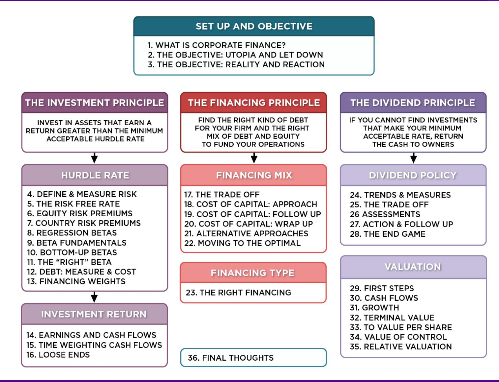
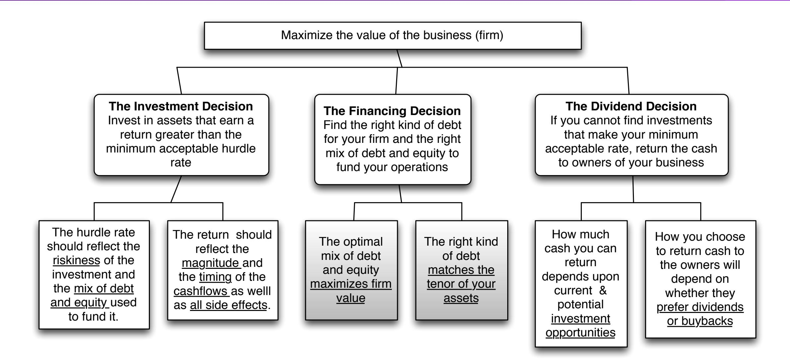
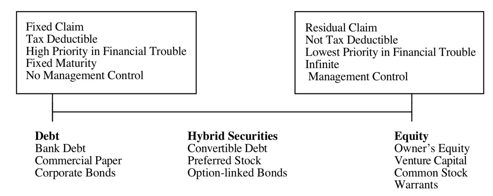
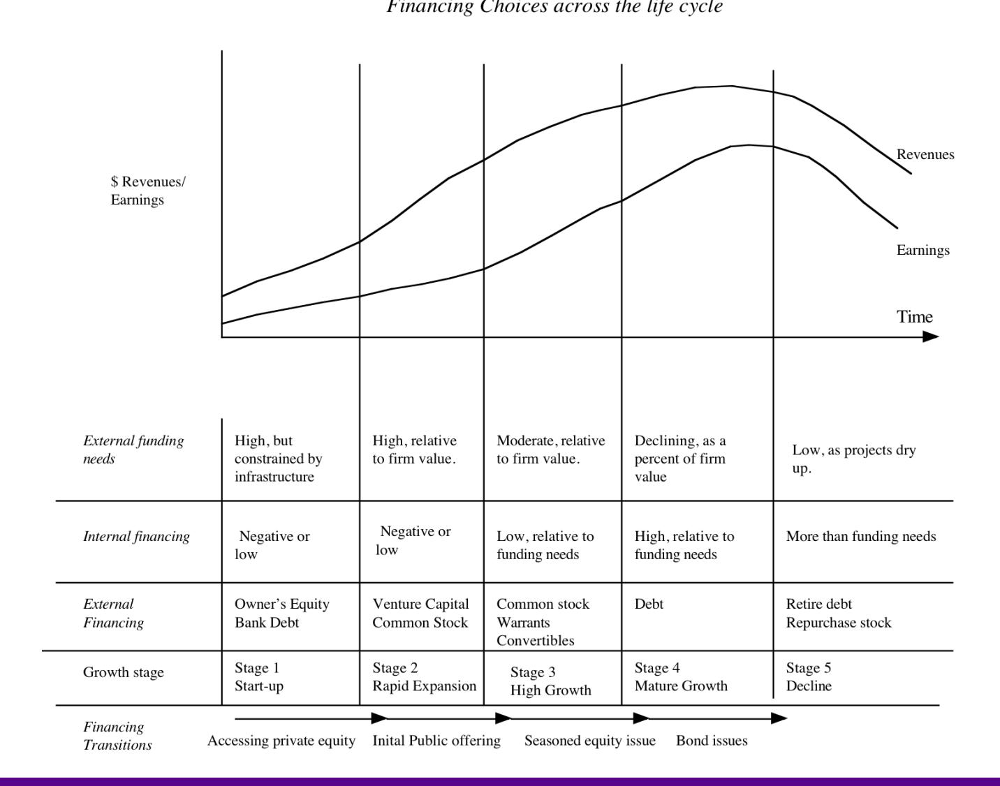
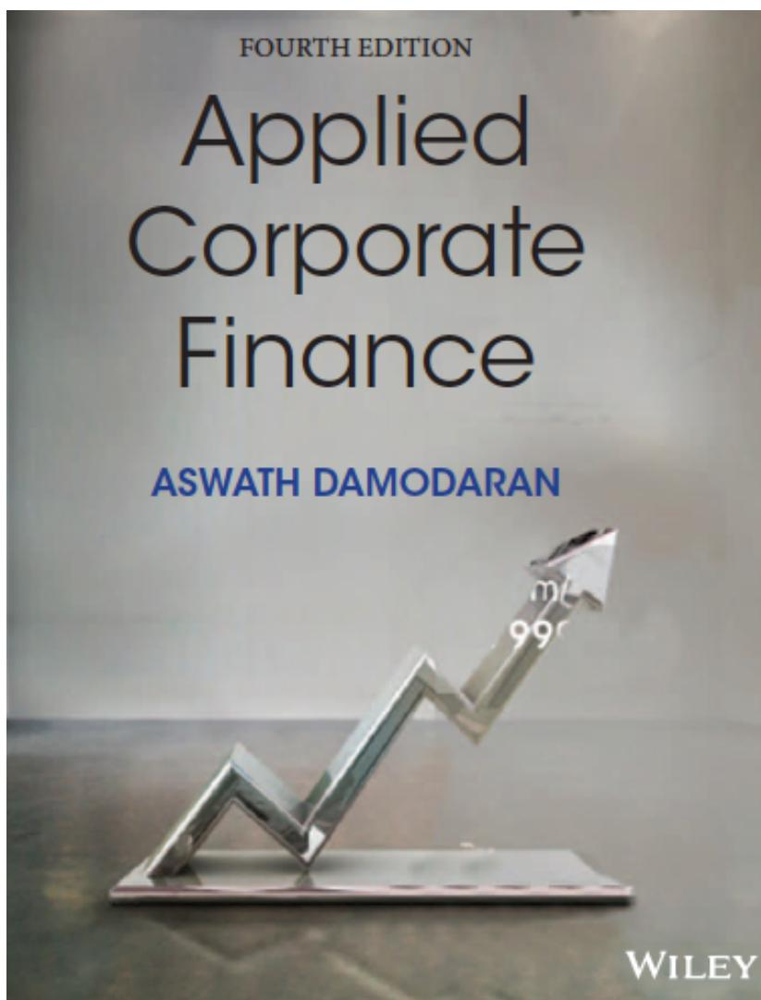

# **SESSION 17: THE TRADE OFF**

Neither a borrower nor a lender be! Good or bad advice?

#### **SESSION 17: THE TRADE OFF**

#### **FIRST PRINCIPLES**

## **DEBT OR EQUITY: THE CONTINUUM**

- The simplest measure of how much debt and equity a firm is using currently is to look at the proportion of debt in the total financing. This ratio is called the debt to capital ratio:
- Debt to Capital Ratio = Debt / (Debt + Equity)
- In general, this ratio should be computed using market values for both debt and equity, and include all debt.

#### **ASSESSING THE EXISTING FINANCING CHOICES: DISNEY, VALE, TATA MOTORS & BAIDU**

|                                 | <i>Disney</i> | <i>Vale</i> | <i>Tata Motors</i> | <i>Baidu</i> |
|---------------------------------|---------------|-------------|--------------------|--------------|
| BV of Interest bearing Debt     | \$14,288      | \$48,469    | 535,914₹           | ¥17,844      |
| MV of Interest bearing Debt     | \$13,028      | \$41,143    | 477,268₹           | ¥15,403      |
| Lease Debt                      | \$2,933       | \$1,248     | 0.00₹              | ¥3,051       |
| Type of Debt                    |               |             |                    |              |
| Bank Debt                       | 7.93%         | 59.97%      | 62.26%             | 100.00%      |
| Bonds/Notes                     | 92.07%        | 40.03%      | 37.74%             | 0.00%        |
| Debt Maturity                   |               |             |                    |              |
| <1 year                         | 13.04%        | 6.08%       | 0.78%              | 1.98%        |
| 1- 5 years                      | 48.93%        | 23.12%      | 30.24%             | 68.62%       |
| 5-10 years                      | 20.31%        | 29.44%      | 57.90%             | 29.41%       |
| 10-20 years                     | 4.49%         | 3.00%       | 10.18%             | 0.00%        |
| > 20 years                      | 13.24%        | 38.37%      | 0.90%              | 0.00%        |
| Currency for debt               |               |             |                    |              |
| Debt in domestic currency       | 94.51%        | 34.52%      | 70.56%             | 17.90%       |
| Debt in foreign currency        | 5.49%         | 65.48%      | 29.44%             | 82.10%       |
| Fixed versus Floating rate debt |               |             |                    |              |
| Fixed rate debt                 | 94.33%        | 100.00%     | 100.00%            | 94.63%       |
| Floating rate debt              | 5.67%         | 0.00%       | 0.00%              | 5.37%        |

### **DEBT: SUMMARIZING THE TRADE OFF**

| <i>Advantages of Debt</i>                                                                                                                                                                                                                                                                                            | <i>Disadvantages of debt</i>                                                                                                                                                                                                                                                                                                                                                                                                                                                                                                                                                                                    |
|----------------------------------------------------------------------------------------------------------------------------------------------------------------------------------------------------------------------------------------------------------------------------------------------------------------------|-----------------------------------------------------------------------------------------------------------------------------------------------------------------------------------------------------------------------------------------------------------------------------------------------------------------------------------------------------------------------------------------------------------------------------------------------------------------------------------------------------------------------------------------------------------------------------------------------------------------|
| 
<b>1. Tax Benefit:</b> Interest expenses on debt are tax deductible but cash flows to equity are generally not.  <i>Implication: The higher the marginal tax rate, the greater the benefits of debt.</i>
                                                                                                  | 
<b>1. Expected Bankruptcy Cost:</b> The expected cost of going bankrupt is a product of the probability of going bankrupt and the cost of going bankrupt. The latter includes both direct and indirect costs. The probability of going bankrupt will be higher in businesses with more volatile earnings and the cost of bankruptcy will also vary across businesses.  <i>Implication:</i>  <i>1. Firms with more stable earnings should borrow more, for any given level of earnings.</i>  <i>2. Firms with lower bankruptcy costs should borrow more, for any given level of earnings.</i>
 |
| 
<b>2. Added Discipline:</b> Borrowing money may force managers to think about the consequences of the investment decisions a little more carefully and reduce bad investments.  <i>Implication: As the separation between managers and stockholders increases, the benefits to using debt will go up.</i>
 | 
<b>2. Agency Costs:</b> Actions that benefit equity investors may hurt lenders. The greater the potential for this conflict of interest, the greater the cost borne by the borrower (as higher interest rates or more covenants).  <i>Implication: Firms where lenders can monitor/ control how their money is being used should be able to borrow more than firms where this is difficult to do.</i>
                                                                                                                                                                                                |
|                                                                                                                                                                                                                                                                                                                      | 
<b>3. Loss of flexibility:</b> Using up available debt capacity today will mean that you cannot draw on it in the future. This loss of flexibility can be disastrous if funds are needed and access to capital is shut off.  <i>Implication:</i>  <i>1. Firms that can forecast future funding needs better should be able to borrow more.</i>  <i>2. Firms with better access to capital markets should be more willing to borrow more today.</i>
                                                                                                                                           |

# **COSTS AND BENEFITS OF DEBT**

- Benefits of Debt o *Tax Benefits*: The tax code is tilted in favor of debt, with interest payments being tax deductible in most parts of the world, while cash flows to equity are not. o *Adds discipline to management*: When managers are sloppy in their project choices, borrowing money may make them less so.
- Costs of Debt o *Bankruptcy Costs*: Borrowing money will increase your expected probability and cost of bankruptcy. o *Agency Costs*: What's good for stockholders is not always what's good for lenders and that creates friction and costs. o *Loss of Future Flexibility*: Using up debt capacity today will mean that you will not be able to draw on it in the future.

### **TAX BENEFITS OF DEBT**

- When you borrow money, you are allowed to deduct interest expenses from your income to arrive at taxable income. This reduces your taxes. When you use equity, you are not allowed to deduct payments to equity (such as dividends) to arrive at taxable income.
- The dollar tax benefit from the interest payment in any year is a function of your tax rate and the interest payment: o Tax benefit each year = Tax Rate \* Interest Payment o The caveat is that you need to have the income to cover interest payments to get this tax benefit.
- *Proposition 1: Other things being equal, the higher the marginal tax rate of a business, the more debt it will have in its capital structure.*

## **DEBT ADDS DISCIPLINE TO MANAGEMENT**

- If you are managers of a firm with no debt, and you generate high income and cash flows each year, you tend to become complacent and invest in poor projects.
- Forcing such a firm to borrow money can be an antidote to the complacency. The managers now have to ensure that the investments they make will earn at least enough return to cover the interest expenses. The cost of not doing so is bankruptcy and the loss of such a job.

#### **BANKRUPTCY COST**

- The expected bankruptcy cost is a function of two variables- o the probability of bankruptcy, which will depend upon how uncertain you are about future cash flows o the cost of going bankrupt § direct costs: Legal and other Deadweight Costs § indirect costs: Costs arising because people perceive you to be in financial trouble
- *Proposition 2: Firms with more volatile earnings and cash flows will have higher probabilities of bankruptcy at any given level of debt and for any given level of earnings.*
- *Proposition 3: Other things being equal, the greater the indirect bankruptcy cost, the less debt the firm can afford to use for any given level of debt.*

# **AGENCY COST**

- When you lend money to a business, you are allowing the stockholders to use that money in the course of running that business. Stockholders interests are different from your interests, because o You (as lender) are interested in getting your money back o Stockholders are interested in maximizing their wealth
- In some cases, the clash of interests can lead to stockholders o Investing in riskier projects than you would want them to o Paying themselves large dividends when you would rather have them keep the cash in the business.
- *Proposition 4: Other things being equal, the greater the agency problems associated with lending to a firm, the less debt the firm can afford to use.*

# **LOSS OF FUTURE FINANCING FLEXIBILITY**

- When a firm borrows up to its capacity, it loses the flexibility of financing future projects with debt.
- Thus, if the firm is faced with an unexpected investment opportunity or a business shortfall, it will not be able to draw on debt capacity, if it has alread used it up.
- *Proposition 5: Other things remaining equal, the more uncertain a firm is about its future financing requirements and projects, the less debt the firm will use for financing current projects.*

#### 6**APPLICATION TEST: WOULD YOU EXPECT YOUR FIRM TO GAIN OR LOSE FROM USING DEBT?**

- Consider, for your firm, o The potential tax benefits of borrowing o The benefits of using debt as a disciplinary mechanism o The potential for expected bankruptcy costs o The potential for agency costs o The need for financial flexibility
- Would you expect your firm to have a high debt ratio or a low debt ratio?
- Does the firm's current debt ratio meet your expectations?

## **A HYPOTHETICAL SCENARIO**

Assume that you live in a world where

- (a) There are no taxes
- (b) Managers have stockholder interests at heart and do what's best for stockholders.
- (c) No firm ever goes bankrupt
- (d) Equity investors are honest with lenders; there is no subterfuge or attempt to find loopholes in loan agreements.
- (e) Firms know their future financing needs with certainty

| Benefits	of	debt | Costs	of	debt            |
|------------------|--------------------------|
| Tax	benefits     | Expected	Bankruptcy	Cost |
| Added	Discipline | Agency	Costs             |

## **THE MILLER-MODIGLIANI THEOREM**

- In an environment, where there are no taxes, default risk or agency costs, capital structure is irrelevant.
- In this world, o Leverage is irrelevant. A firm's value will be determined by its project cash flows. o The cost of capital of the firm will not change with leverage. As a firm increases its leverage, the cost of equity will increase just enough to offset any gains to the leverage

## Applied Corporate Finance

**Task** Evaluate the trade off on debt & equity for your company.

Optional: Read Chapter 7