### **The Cost of Capital: The Swiss Army Knife of Finance**

Aswath Damodaran

April 2016

### Abstract

There is no number in finance that is used in more places or in more contexts than the cost of capital. In corporate finance, it is the hurdle rate on investments, an optimizing tool for capital structure and a divining rod for dividends. In valuation, it plays the role of discount rate in discounted cash flow valuation and as a control variable, when pricing assets. Notwithstanding its wide use, or perhaps because of it, the cost of capital is also widely misunderstood, misestimated and misused. In this paper, I look at what the cost of capital is trying to measure and how best to avoid the pitfalls that I see in practice.

What is the cost of capital? If you asked a dozen investors, managers or analysts this question, you are likely to get a dozen different answers. Some will describe it as the cost of raising funding for a business, from debt and equity. Others will argue that it is the hurdle rate used by businesses to determine whether to invest in new projects. A few may use it as a metric that drives whether to return cash, and if yes, how much to return to investors in dividends and stock buybacks. Many will point to it as the discount rate that is used when valuing an entire business and some may characterize it as an optimizing tool for the deciding on the right mix of debt and equity for a company. They are all right and that is the reason the cost of capital is the Swiss Army knife of Finance, much used and oftentimes misused.

## The Mechanics

The cost of capital, in its most basic form, is a weighted average of the costs of raising funding for an investment or a business, with that funding taking the form of either debt or equity. The cost of equity will reflect the risk that equity investors see in the investment and the cost of debt will reflect the default risk that lenders perceive from that same investment. The weights on each component will reflect how much of each source will be used in financing the investment. Figure 1 captures the key ingredients.

*Figure 1: Cost of Capital Ingredients*

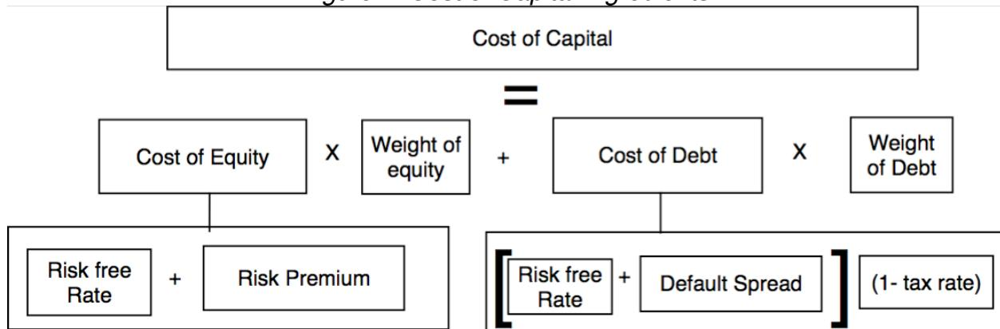

This relatively simple construct has estimation questions embedded in it, including how equity investors perceive risk and convert that risk into a required return and what lenders consider in making their judgments on the default spread. There are also questions about what tax rate, the effective or the marginal, to use in the assessment to best capture the tilt in the tax code towards debt.

If you make it through the mechanics of computing cost of capital, you will see it described as an opportunity cost, a discount rate and a hurdle rate for investments and it is all of the above depending upon where it is being used and by whom, as delineated in figure 2:

*Figure 2: The Cost of Capital as Swiss Army Knife*

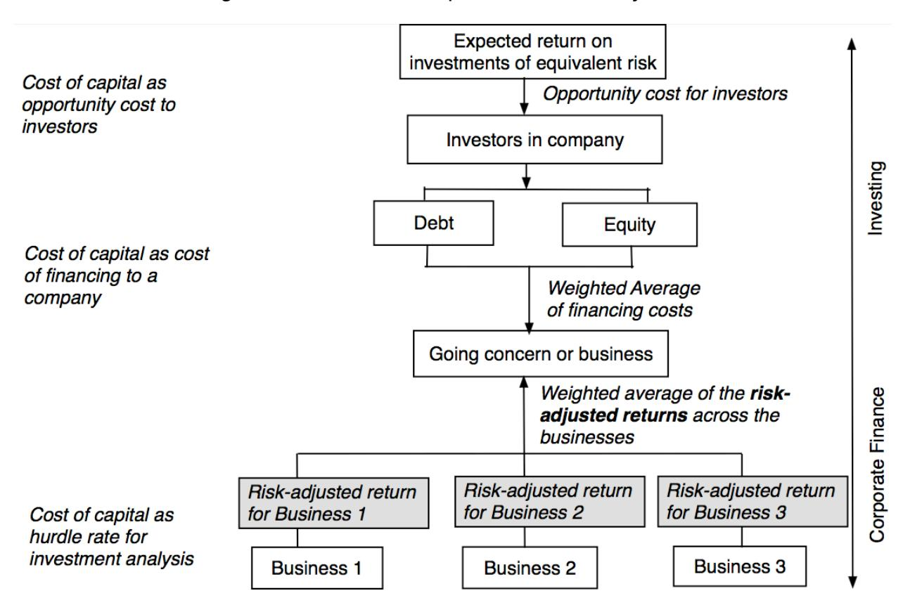

For investors in companies, the cost of capital is an opportunity cost in the sense that it is the rate of return that they would expect to make in other investments of equivalent risk. For the companies themselves, it becomes a cost of financing, since they have to deliver returns that beat or at least match the cost of capital to keep investors happy. Finally, within the company, especially if it is in multiple businesses, the cost of capital can take the form of a hurdle rate on investments, though it can be different for different businesses, if they have different risk profiles.

# Role in Corporate Finance

All businesses have to decide whether and where to invest scarce resources (the investment decision), what mix of debt and equity to use in funding these businesses (the financing decision) and how much cash (if any) to return to the owners of the business (the dividend decisions). If corporate finance is the discipline that looks at these decisions, the cost of capital is an essential tool in each one. 

### Investment Analysis

It is undeniable that great businesses get built from making good investment judgments and that good businesses can be destroyed by bad ones. But what separates a good investment from a bad one? In the corporate finance world, it is the cost of capital that is the benchmark that has to be beaten for an investment to be categorized as a good investment, though there is still some disagreement about how best to measure the return on an investment. There are some 

who prefer to stick with accounting numbers and estimate a return on invested capital, computed as the ratio of operating income to invested capital, and comparing that return to the cost of capital. There are others who put their faith in cash flows and estimate a net present value for an investment, where the cost of capital is used to discount future cash flows to the present. There are still others who compute an internal rate of return on the cash flows and compare those to the cost of capital.

Figure 3: The Cost of Capital as Hurdle Rate

| <b>Accounting Test</b> Return on invested capital (ROIC) > Cost of Capital | <b>Time Weighted CF Test</b> NPV of the Project > 0                                                                                                                                                         | <b>Time Weighted % Return</b> IRR > Cost of Capital                                                                                                     |
|----------------------------------------------------------------------------------|----------------------------------------------------------------------------------------------------------------------------------------------------------------------------------------------------------------|------------------------------------------------------------------------------------------------------------------------------------------------------------|
| <b>The cost of capital for an investment</b>                                     |                                                                                                                                                                                                                |                                                                                                                                                            |
| <i>The Hurdle Rate</i>                                                           | Should reflect the risk of the investment, not the entity taking the investment. Should use a debt ratio that is reflective of the investment's cash flows.                                                 |                                                                                                                                                            |
|                                                                                  | <i>No risk subsidies</i> If you use the cost of capital of the company as your hurdle rate for all investments, risky investments (and businesses) will be subsidized by safe investments.(and businesses). | <i>No debt subsidies</i> If you fund an investment disproportionately with debt, you are using the company's debt capacity to subsidize the investment. |

Note the two cautionary notes at the bottom of the table, capturing common mistakes in investment analysis. The first is when a company insists on using its cost of capital on all investments, even if these investments are in different businesses and have different risk profiles. That will lead to safe businesses subsidizing risky businesses within the company and over time, the company itself will get riskier. The other is when a specific project is funded disproportionately with debt, and the cost of capital is computed using that debt ratio. In this case, projects that are funded with less debt will subsidize the ones that are funded with more.

### Capital Structure

The second component in corporate finance is finding a financing mix that optimizes business value. Of course, you could take the Miller-Modigliani theorem to heart and argue that debt is of little consequence to value, but that view is indefensible in a world with taxes and default risk. Put differently, if you accept the argument that some firms can borrow too much and others too little, it follows that there is an optimal mix of debt and equity for a business and the only question is how you determine that optimal. Here, the cost of capital can operate as an optimizing tool, where the mix of debt and equity that minimizes cost of capital is the one that the business should aspire to have, since, in effect, it maximizes the value of the business.

To use the cost of capital as an optimizing tool, though, you have to be able to incorporate the effects of borrowing more into both your cost of equity and your cost of debt, since both are likely to increase as the debt ratio goes up, the former because equity investors will be exposed

to more volatile equity earnings, after interest payments, and the latter because default risk will increase with the debt. Figure 4 includes these effects:

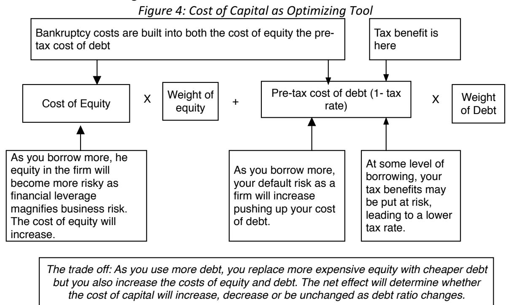

While the conventional cost of capital approach is built around the assumption that the operating income of a company is unaffected by its debt policy, a simple extension would allow the operating income to change (dropping as a company's default risk increases) and the optimal debt ratio then would be the one that maximizes firm value (rather than minimize cost of capital).

## Dividend Policy

The final piece of the corporate finance puzzle is dividend policy, with the cost of capital again playing a key role. Specifically, if all the investments that a business has available to it generate returns that are less that their respective costs of capital, the cash should be returned to investors (as dividends or in the form of stock buybacks). While this proposition seems unremarkable, it is astonishing how many companies seem to violate it across the globe. At the start of 2016, for instance, I assessed the returns on capital and costs of capital of more than 40,000 publicly traded companies globally and came to the conclusion that more than half of them generated returns on their investments that, at least in the aggregate, were lower than the costs of capital of these companies. In figure 5, I summarize those results:

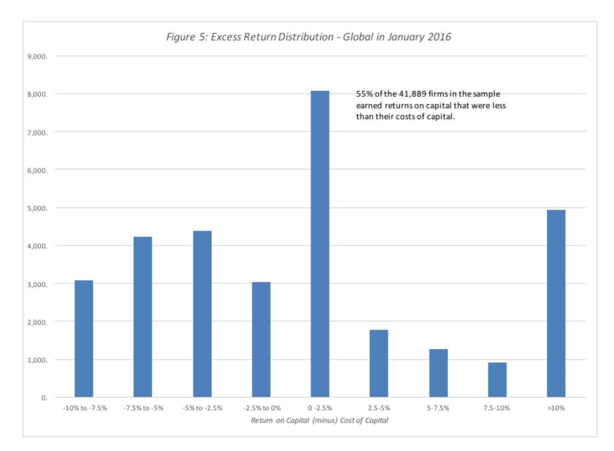

It is true that this is just one year's results, but my analyses each year for the previous three years yield numbers that are very similar. Put simply, growth, across the globe, is more likely to destroy value than to add it, in a company and we should be more cautious about pushing companies to go for more growth.

# Role in Valuation

If the cost of capital is a key player in almost every aspect of corporate finance, it should come as no surprise that it is just as critical an input into valuation as well. In particular, when valuing a business, the cost of capital is the discount rate that you use to discount back the cash flows to the firm (i.e., cash flows before debt cash flows) to arrive at value today. Figure 6 illustrates the mechanics:

Figure 6: Cost of Capital in Valuation

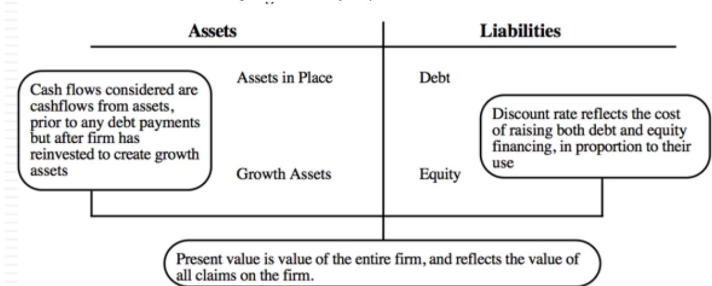

It should come as no surprise that the cost of capital that finds its place in valuation is the same cost of capital that played the role of hurdle rate, capital structure optimizer and dividend determinant. The only difference is that it is now the investors who are using the cost of capital to value the entire business.

In this context, it is worth asking the question as to who these investors are. After all, a publicly traded company has many, many investors and each may have a different perception of the riskiness of the company (and its cost of capital). The rule that we follow, but not just here but wherever we use the cost of capital, is that the risk in a business is seen through the eyes of the marginal investor in the stock, i.e., an investor who sets prices at the margin. That effectively requires this investor to own substantial numbers of shares and trade those shares.

There are some who would argue that forcing the discount rate to bear the burden of carrying the burden of risk is not only asking too much of it, but is too constricting. They argue that it is much more expansive to bring risk into the cash flows (perhaps risk adjusting the cash flows for certain types of risk) and perhaps even after you have completed your valuation, as post-value discounts to value. In fact, when valuing a private business, they go further, arguing that the discount rate itself should be higher for these businesses because owners are not diversified. I don't disagree with this contention, but it is important that you decide which component of your valuation is best suited to carry a given risk, and make sure that you don't double count a risk (in the cash flows and the discount rate or in your discount rate and in a post-valuation discount). In figure 7, I provide a breakdown of risks in a business and where each type of risk should be incorporated, in my view, in valuation.

*Figure 7: A Risk Adjustment Template*

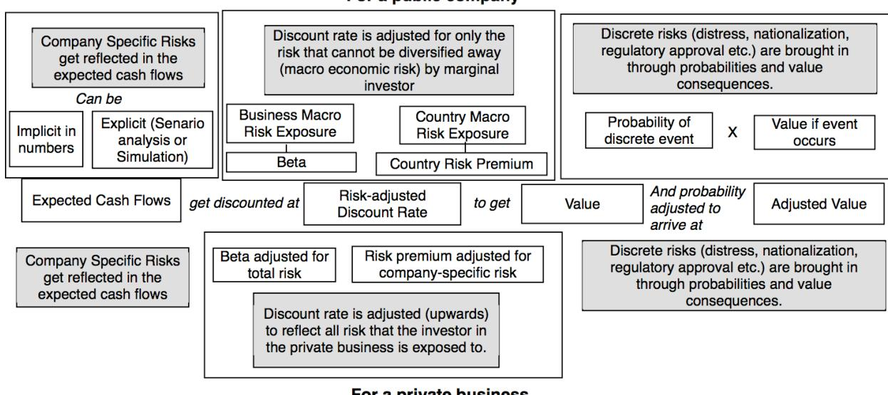

In summary, with a public company, the discount rate is a vehicle for reflecting macro economic or market risksthat cannot be diversified away, company specific risk get adjusted forin expected cash flows (with the result that there is no discount in value for these risks) and discrete risks such as distress and nationalization are best adjusted for using probabilities, after the valuation. With a private business, a discount rate will have to be higher to incorporate company-specific risks, since the owner of the private business will tend not to be diversified and there may also have to be a post-valuation adjustment for the illiquidity associated with investing in the business.

In closing, the cost of capital in a valuation is not a return that you would like to make on the company that you are valuing and it is not a receptacle for your hopes and fears, where you respond to discomfort with uncertainty by increasing your discount rate. It should not be, though it often is, a mechanism for reverse engineering a pre-determined value.

# Cost of Equity: Key Inputs

To get to the costs of equity, debt and capital, you have to encounter and estimate key inputs along the way. In particular, you cannot estimate any of these numbers without a risk free rate as a base and risk premiums (in the forms of equity risk premiums and default spreads). In this section, we will look at each of these inputs.

## Risk free Rate

The risk free rate is the starting point for both your cost of equity and cost of debt. If you define it, as I do, as the rate of return you would expect to make on an investment with guaranteed returns, an investment can be risk free only if the entity making the guarantee is default free and if you are not exposed to reinvestment risk. Specifically, a six-month treasury bill is not risk free, if your time horizon is five years and a government bond is not risk free, if the government is itself perceived as having default risk.

One simple rule that will save you both time and aggravation in estimating risk free rates is to stick with a long-term rate, with either ten-year or thirty-year bonds representing acceptable choices. You should do this even if the company in question chooses to borrow short term, since it is foolhardy to lower a company's cost of debt (and capital) for playing the term structure. To the CFO who argues that this is not fair, since he or she can borrow money cheaper short term, the response should be that the cost of capital is not a device for rewarding companies for playing term structure games.

To estimate a risk free rate in currencies where there is at least one entity that is viewed as default free issuing long term bonds, you could use the interest rate on these bonds as your risk free rate. It is this rationale that allows us to use the US treasury bond rate as the risk free in US dollars and that rate on the ten-year German Euro bond as the risk free rate in Euros. How do we know that the US and German governments are default free? We do not have any guarantees, but it is not based upon the standard defense that governments can print more currency to stave off default, since the German government no longer has that option with the Euro. Instead, I will fall back on the defense, weak thought it might be, that these governments are viewed as default free (Aaa or AAA) by the bond ratings agencies.1

If you are working in a currency, where there are no default free entities with bonds in that currency, you have to become more creative in estimating risk free. One approach is to start with a government bond rate in the currency, but to then net out the default spread for the government involved, to arrive a risk free rate. These default spreads can be obtained in one of three ways: by finding government bonds issued in US dollars or Euros by that government and netting out either the US T.Bond rate (for US dollars) or the German Euro bond rate (for Euros), by using sovereign CDS spreads or by using the local currency sovereign ratings to estimate spreads.2 Figure 8 summarizes risk free rates in global currencies in January 2016:

---

1 With the US government, even this argument is weakened by the fact that at least one ratings agency (S&P) has assigned a rating below AAA to the government.

2 See my website ([Damodaran.com](http://Damodaran.com)) for a lookup table that relates default spreads for sovereign ratings.

Figure 8: Risk free Rates - January 2016

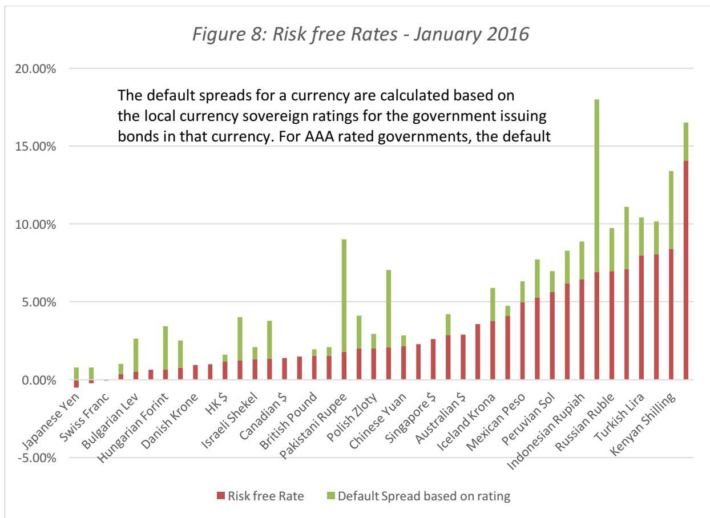

There are two things in note in this graph.

1. 1. Low risk free rates: Note that there are three currencies where the risk free is less than zero, a mind-bending challenge for those of us who have been taught that the interest rate is compensation for lenders giving up current consumption and several other currencies where risk free rates are very low, relative to historical norms.3 There are some who argue that you should normalize risk free rates, using perhaps an average across time. That is a dangerous practice, since the risk free rate operates as an opportunity cost, and if risk free rates are too low, you are stuck investing at those rates, no matter how low you think they are.
2. 2. The risk free rates are higher in some currencies (like the Brazilian Reai and the Russian Ruble) than in others (the US dollar, the Euro. At first sight, these differences in risk free rates may lead you to believe that valuing a company in a low risk free rate currency will give you a higher value, because it will give you a lower cost of capital, but you would be wrong. The differences in risk free rates, given that they are cleansed on default risk, can be attributed almost entirely to differences in expected inflation across currencies, with higher inflation currencies having higher rates. Since you should match the currency in which you do your cash flows to the currency in which you estimate your discount rate,

3 Damodaran, Aswath, 2010, Into the Abyss: What if nothing is risk free?  
[http://papers.ssrn.com/sol3/papers.cfm?abstract\\_id=1648164](http://papers.ssrn.com/sol3/papers.cfm?abstract_id=1648164)

choosing a low inflation currency, while lowering your discount rate, will also lower the expected nominal growth rate in your cash flows, yielding offsetting effects. The bottom line: it does not matter what currency you choose to value a company in, as long as you stay consistent in your inflation assumptions. In fact, you could make your valuation currency-free by estimating a real risk free rate (such as the TIPs rate) and real cash flows and your value should match up to a US dollar or a nominal Brazilian Reai valuation.

The risk free rate in a valuation therefore has less to do with where a company is incorporated, or what currency it reports its financials in, and more to do with the currency choice you make, when you decide to do your analysis.

## The Price of Risk: ERP and Default Spreads

The price of risk is set by markets and it enters your cost of capital in two places. When estimating the cost of equity, it manifests as an equity risk premium, and in the cost of debt computation, it is a default spread. Both are set by markets, reflect investor risk aversion and change over time and the approaches that we use to estimate them have to reflect this reality.

### *Equity Risk Premium*

The equity risk premium is the premium that investors demand to invest in equities, as a class, relative to what they expect to earn on a risk free investment. That premium, while not explicit, is implicitly built into stock prices, with higher expected premiums, other things remaining equal, translating into lower stock prices. Broadly speaking, there are two ways of estimating equity risk premiums, with the first being a historical premium estimated by looking at the difference between past returns on stocks and the risk free investment and the second being a forward looking estimate, where you back out from stock prices what investors are building in as an expected return on stocks in the future.

The historical premium approach, which remains the more widely used approach, is built on the presumption of mean reversion, i.e., that markets revert back to historical norms, and at least initially, was based almost entirely on stock market history in the United States. To illustrate, table 1 summarizes historical risk premiums for US stocks, relative to both short term governments (T.Bills) and long-term governments (T.Bonds):

*Table 1: Historical Equity Risk Premium – US from 1928-2015*

|           | Arithmetic	Average Stocks	- | T.	Bills Stocks	- | Geometric	Average T.	Bonds Stocks	- | T.	Bills Stocks	- T.	Bonds |
|-----------|-----------------------------|-------------------|-------------------------------------|----------------------------|
| 1928-2015 | 7.92%                       | 6.18%             | 6.05%                               | 4.54%                      |
| Std	Error | (2.15%)                     | (2.29%)           |                                     |                            |
| 1966-2015 | 6.05%                       | 3.89%             | 4.69%                               | 2.90%                      |
| Std	Error | (2.42%)                     | (2.74%)           |                                     |                            |
| 2006-2015 | 7.87%                       | 3.88%             | 6.11%                               | 2.53%                      |
| Std	Error | (6.06%)                     | (8.66%)           |                                     |                            |

This table lays bare all of the weaknesses of historical equity risk premiums. Not only are they backward looking, by construct, and subject to manipulation, with very different values for the premium based upon what period of history you look at, whether you use T.Bills or T.Bonds as your risk free rate and how you compute averages. Not surprisingly, analysts use this to 

advantage and pick equity risk premiums that reflect their valuation biases, pushing towards the higher numbers (the simple average arithmetic premium over T.Bills), if their bias is towards lower values, and the lower numbers to justify higher values. The historical risk premium is also a static number that changes little during a crisis, and when it does, often in the wrong direction.

In the implied premium approach, you start with the current level of stock prices, estimate expected cash flows to equity investors (from dividends and buybacks) in the future and solve for an internal rate of return. That IRR will be the expected return on stocks and netting out the risk free rate will yield an implied equity risk premium. In figure 9, I illustrate this process for the S&P 500 at the start of January 2016:

Figure 9: Implied ERP for S&P 500 – January 2016

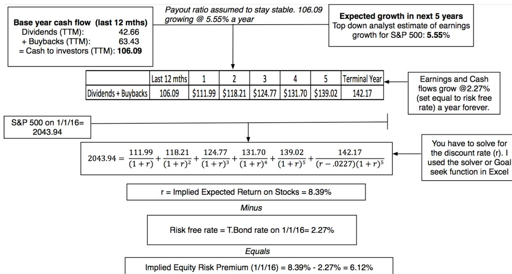

My estimate of the premium in January 2016 was 6.12%, a number that is not just forward looking but much more precise (the standard errors are in the expected cash flow values) than a historical risk premium. This premium has error attached to it as well, since your cash flows and growth rates are estimates, but not only is the magnitude of the error much smaller than with historical premiums, but the resulting number is much more sensitive to the market that you are investing in, rising as fear in the market increases and falling as investors become more secure.

As investors and companies globalize, the challenge is in estimating equity risk premiums in other, often riskier markets and there are three responses you can have. The first is to assume, as many analysts and companies did in the 1980s, that country risk is diversifiable and thus not deserving of any additional premiums; this will lead you to use the US equity risk premium as a global equity risk premium. The second is to assume that the sovereign default spread, that you used in earlier to get the risk free rate from the default-ridden government bond rate, is a good measure of the additional equity risk in these markets and to add it on to the US ERP. In the third approach, you use a slightly modified version of the second one and adjust the default spread for

the additional risk of equity (relative to the sovereign bond). In January 2016, I used the ratio of the standard deviation in the S&P emerging market equity index to the standard deviation in the S&P emerging market public bond index to arrive at a value of 1.39, which I then used as my scalar for the default spread. The approach is described in Figure 10 below:

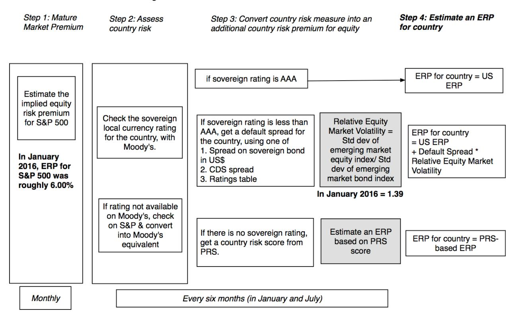

Using this approach to estimate equity risk premiums by country, I obtain the global picture of equity risk in Figure 11:

*Figure 11: Equity Risk Premiums around the Globe – January 2015*

As a final piece of the puzzle, now consider how you would compute the equity risk premium for a company. Rather than leave it, as many analysts are prone to, at the ERP of the country in which the company is incorporated, I would estimate it, based on where the company generates its revenues. Thus, with Coca Cola, a US-based multinational, and Vale, a Brazil-based global mining company, the equity risk premium computations would be as follows:

*Figure 12: ERP for Companies – Vale & Coca Cola*

Consequently, the equity risk premium used in valuing a company has less to do with where it is incorporated or traded and more to do with where it does business.

### *Default Spread*

Investors in the bond market assess default risk, when they price bonds, and charge a default spread over the risk free rate. That default spread will obviously vary across companies and across time. In figure 13, I summarize default spreads by bond ratings (S&P and Moody's) classes in January 2016 and compare them to the spreads in January 2015:

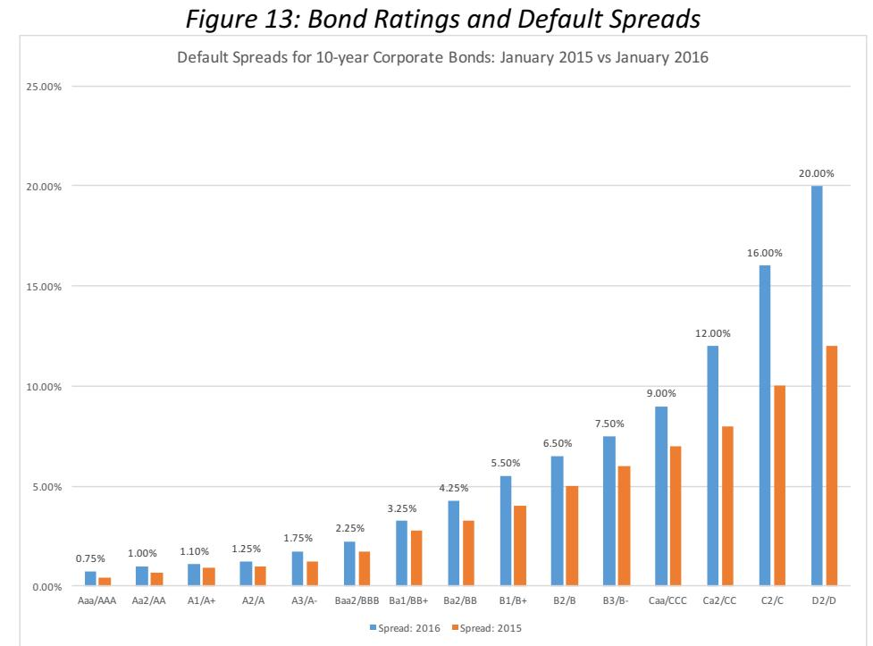

Notice how much larger the default spreads are in early 2016, relative to 2015. That should serve as a cautionary note to companies that use costs of capital that stay frozen over time.

To get the default spread for a company, you can use one of three paths. The first is to find a bond issued by the company and look up the yield to maturity on the bond, a dangerous path, since even risky companies can carve out safe assets as backing for bonds. The second is to find a bond rating for the company and look up the default spread from figure 10 (or an updated version of that figure): a BBB rated company would be given a default spread of 2.25%. If your company has neither traded bonds nor a rating, you have to estimate a "synthetic" rating, based upon the holdings of the company, and estimate a spread for that rating. The cost of debt for a company then is obtained by adding this default spread to the long term risk free rate (in the currency of your choice). This cost of debt is then attached to all of the debt of the company, including its short term debt, on the assumption that the rolled over cost of the short term debt will converge on the long term cost.

### *ERP, Default Spreads and Interest Rates.*

If the equity risk premium is the price of risk in the equity market and the default spread is the price of risk in the bond market, it should not be surprising that much of the time they 

move together. In a crisis, for instance, the equity risk premiums and default spreads on bonds rising, with default spreads rising more for lower-rated bonds. Figure 11 captures the movements in the implied ERP and the default spread on a Baa rated bond from 1969 to 2015.

Figure 14: Equity Risk Premiums and Bond Default Spreads

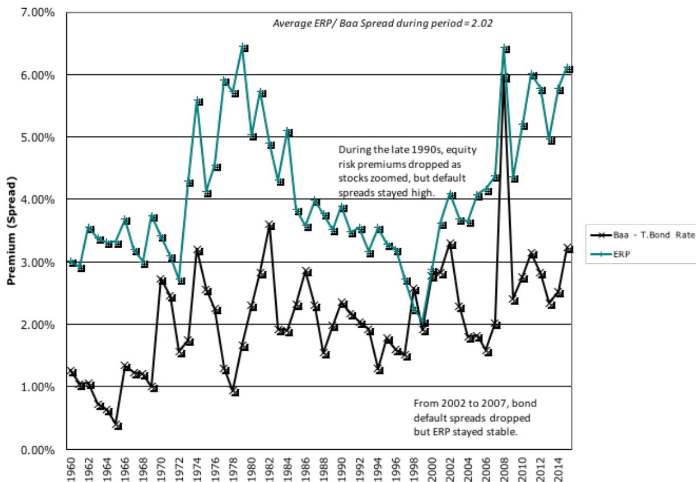

Over the entire time period, the equity risk premium was roughly twice the Baa bond default spread, a simple rule of thumb that you can use to assess whether a currently prevailing premium is too high or low. There have been periods of divergence between the stock and the bond market, as was the case in the late 1990s, when equity risk premiums dropped as bond default spreads stayed high, and again between 2002 and 2007, when default spreads dropped and equity risk premiums stayed unchanged. Both preceded significant market corrections, with the first one ending with the stock market's dot com bust in 2001 and the second one playing out in 2008 as a financial crisis that spread across all markets but was precipitated by a bond market collapse.

Does the price of risk move up and down with interest rates? The conventional wisdom, until the 2008 crisis, was yes, largely the result of the 1970s, when both risk free rates and ERP climbed. Since 2008, that relationship seems to have broken down as the same financial crisis

has caused risk free rates to drop in much of the developed world, with an assist from central banks, has caused equity risk premiums to rise.4

### Relative Risk Measures: Beta or Betas

You could assume, as some people do, that all companies (and investments) are equally risky and, if you do, this part of the assessment becomes unnecessary. If, however, you start off with the presumption that not all investments are equally risky, you then face the task of measuring this relative risk. This, in a nutshell, is what every risk and return model in valuation tries to do, but it is also the source of not only disagreement but also rancor among analysts.

### Portfolio Theory Based Models

Harry Markowitz's insight that an investor's perception of the riskiness of an investment is determined by what it adds to the overall risk of his or her portfolio is the building block for all portfolio theory models. These models then proceed to take two additional steps:

1. 1. Measure risk as standard deviation or variance in actual returns, around an expected return: If a riskless investment is one where you know your expected returns with certainty, the greater the deviation of actual returns around an expected return, the riskier that investment becomes.
2. 2. Only that portion of this return that cannot be diversified away will be rewarded: The risk in an investment can come from both firm-specific factors (specific to the products or services that it provides, the competition it faces and competence or lack thereof of its management) and macroeconomic factors (interest rates, the economy and inflation). As investors diversify, the first risk will dissipate, as it gets averaged out across investments but the second will remain.

The differences between the competing models then boils down to how they measure this non-diversifiable risk. Table 2 summarizes the assumptions that underlie the capital asset pricing model (CAPM), the arbitrage pricing model (APM) and multi-factor model and the resulting measures of risk:

*Table 2: Portfolio Theory Based Models*

| Model    | Assumptions                                                                                                                         | Risk Measure                                                                                                                                                                                                                                                                  |
|----------|-------------------------------------------------------------------------------------------------------------------------------------|-------------------------------------------------------------------------------------------------------------------------------------------------------------------------------------------------------------------------------------------------------------------------------|
| The CAPM | <ol style="list-style-type: none;"> <li>1. There are no transactions costs.</li> <li>2. There is no private information.</li> </ol> | The marginal investors will be fully diversified and hold a portfolio of every traded asset in the market. The risk of an individual asset will be captured by the risk added to this market portfolio, and <u>measured with a single beta</u> , measured against the market. |
| The APM  | The market prices of stocks are the best indicators of market and                                                                   | Historical stock returns can be analyzed to identify the number of                                                                                                                                                                                                            |

4 Damodaran, Aswath, 2016, Equity Risk Premiums (ERP): Determinants, Estimation and Implications – The 2016 Edition. [http://papers.ssrn.com/sol3/papers.cfm?abstract\\_id=2742186](http://papers.ssrn.com/sol3/papers.cfm?abstract_id=2742186). This is the ninth annual update of my review and assessment of equity risk premiums, how to estimate them and a comparison of the approaches.

|                       | firm-specific risks, with market risks affecting all or many stocks and firm-specific risks not.                                                                                                                     | market risk factors and the exposure of each stock to that market risk. Since this is a statistical model, the factors will be unnamed. The risk in a stock will be captured with <u>betas</u> , measured against these unnamed factors. |
|-----------------------|----------------------------------------------------------------------------------------------------------------------------------------------------------------------------------------------------------------------|------------------------------------------------------------------------------------------------------------------------------------------------------------------------------------------------------------------------------------------|
| The Multifactor Model | Market risk factors have to be macroeconomic, to affect many stocks at the same time. Looking at how a stock behaves, relative to different macroeconomic variables, should yield clues to its market risk exposure. | The risk in a stock will be captured with <u>betas</u> , measured against specified macroeconomic factors.                                                                                                                               |

Notice that these models agree on more than they disagree about. They all focus on non-diversifiable risk and they all use past stock prices to measure that risk exposure, whether it is with one beta (the CAPM) or multiple betas (the APM or Multifactor Models).

There is no aspect of the cost of capital computation that is more contested and controversial than the measurement of relative risk, with more ink being spilt, more time spent in debates and more damage done to valuations along the way. In responses that are akin throwing the baby out with the bathwater, I see companies ignore their computed costs of capital and analysts refuse to do discounted cash flow valuation, because they don't like beta. If you dislike beta or betas, it important that you be clear about why, since it will determine what you use instead, and there are possible three reasons for your dislike. The first is that you don't buy into the assumption that assets are priced, at the margin, by diversified investors, and consequently into the conclusion that only non-diversifiable risk should be incorporated into your discount rate. The second is that the risk measures in these models are computed using historical market prices or returns, a practice that you feel is at odds with intrinsic valuation, where the presumption is that markets make mistakes. The third disagreement may be statistical, where you believe that one pass of history (the use of a two or five year regression of returns on a stock against the market to measure the beta, in the CAPM) may not capture the true risk of that stock or will do so with a great deal of noise.

### *The Diversified Marginal Investor*

If you do not mind the use of past prices, but disagree with the assumption that the marginal investor is diversified, there are alternative approaches that you could consider:

1. 1. The Standard Deviation or Total Variance: At the heart of the modern portfolio theory is the mean-variance framework, with variance/standard deviation becoming the primary or often the only measure of risk in an investment. If you make the additional assumption that the marginal investor is diversified, you arrive at beta or betas, risk measures that capture only the portion of the risk that is not diversifiable. In statistical terms, you can write the beta in the capital asset pricing model as follows:

$$Beta = \frac{\text{Standard deviation of Stock} * \text{Correlation of Stock with market}}{\text{Standard deviation of the market}}$$

It is the correlation measure that captures the market portion of total risk and it is that measure that is dependent on the assumption that the marginal investor is diversified. If you assume that investors price assets based upon their total risk, not just market risk, the risk measure (which I have termed a total beta) for a stock or asset can be restated as a measure of total risk:

$$\text{Relative Standard Deviation} = \frac{\text{Standard deviation of Stock}}{\text{Average Standard deviation across Stocks}}$$

The relative standard deviation, like the beta, will average to one across all stocks, with more volatile stocks have higher relative standard deviation values than less volatile ones. Note also that the average standard deviation across stocks in a market will be higher than the standard deviation of the market, since the latter will reflect the benefits of diversification. Replacing the average standard deviation across stocks with the standard deviation of the market in the equation above will yield a total beta, a measure that I have used to estimate costs of equity for undiversified investors in a market where prices are set by diversified investors.5

$$\text{Total Beta} = \frac{\text{Standard deviation of Stock}}{\text{Standard deviation of the market}}$$

While both the relative standard deviation and total beta are based upon the same logic, they are different in their assumptions about global risk. The relative standard deviation measure is the better choice, if you believe that investors collectively price stocks on their total risk exposure and not based upon the risk added to their portfolios. The total beta measure is better suited for a market, where most assets are priced by diversified investors but there exist pockets or asset classes, where investors cannot or will not diversify (such as private businesses or small, closely held companies).

1. 2. The CAPM Plus Models: If your concerns about the CAPM or Multi-factor models is that they are incomplete, i.e., that they miss risk factors that are priced in by the market but not captured in the estimated betas, there are two fixes. The first is use market returns on individual assets to back out proxies (or stand ins) for these missing risk factors, which is what Fama and French have done in their studies over the last two decades and to add these proxies to traditional risk models.6 Thus, when you see the expected return from the traditional CAPM augmented with a small stock premium, you are seeing these augmented models in play. As the data that we have available to parse gets richer, it is not surprising that other proxies, such as price momentum and pricing ratios, are also finding their way into these models. The second approach, used by private appraisers, is to add an extra premium for what they term company-specific risk, especially when valuing private businesses. The origins of the these country risk premiums are more intuitive than theoretical or empirical.

### *The Market Price Based Measure*

For many intrinsic value investors, it is the use of market prices to measure the risk that is most troublesome component of the risk measurement process. After all, the basis for intrinsic

5 Damodaran, Aswath, 2012, Investment Valuation, 3rd Edition, John Wiley & Sons.

6 Fama, E.F. And K.R. French, 1992, The Cross Section of Expected Stock Returns, Journal of Finance, Vol 47, 427-465.

valuation is that markets make mistakes and that you can find those mistakes with your intrinsic value approaches and using these same markets to measure risk seems inconsistent. That is a fair critique and here are the alternatives to consider:

1. 1. Earnings-based risk measures: If you believe that it is reasonable to assume that marginal investors are diversified, but want to steer away from price-based measures of non-diversifiable risk, you can compute betas based upon accounting numbers (revenues, earnings). In effect, instead of regressing stock returns on a stock against returns on a market index, you regress changes in accounting earnings from period to period, at your company, against changes in accounting earnings for the entire market. If you don't believe in the diversified marginal investor assumption, you could compute variability in accounting earnings over time for a company and compute a relative risk measure by scaling it to the average accounting earnings variability across all stocks:

$$\text{Relative Earnings Variability} = \frac{\text{Std Deviation in Company's Earnings}}{\text{Average Earnings Std deviation across market}}$$

The peril with using earnings based approaches is that it is well established that not only do accountants smooth out earnings but that there is enough discretion in the accounting rules to allow them to do it more at some firms than at others, making any cross company comparisons tenuous.

1. 2. Accounting Ratio measures: A second option is to use an accounting ratio as your measure of riskiness and to scale risk around that ratio. For instance, assume that you believe that differences in risk across companies come from differences in debt burdens at these companies. You could compute a measure of the debt burden (debt as a percent of capital, debt as a multiple of EBITDA) and use that measure to come up with relative risk measures for stocks. If this is your choice, it may be worth testing your hypothesis that the ratio that you picked truly measures risk, looking at the correlation between whatever risk outcome you think is best and the ratio in question.
2. 3. Management and Sector: For some investors, risk comes from the business that you are in and/or the management team that runs the company. Thus, technology companies are considered to be riskier than food processing companies and companies with good managers, with long standing, are viewed as safer than companies with less credible management teams. The advantage of this approach is that it is simple but the disadvantage is that sectors evolve over time, sometimes going from risky to safe (as is the case with older technology companies) and at other times from safe to risky (banks and telecommunications companies).

If you decide to abandon stock prices and move to one of these alternate measures, recognize that they all come with costs.

### *The Statistical Noise Problem*

It is possible that you do not have an issue with the diversified marginal investor assumption or with the use of prices, but knowing how much volatility there is in stock prices and how idiosyncratic events can affect pricing for extended periods, you do not much faith in the risk measures that come from looking at one stock over a time period. Here, the solution is to draw on the law of large numbers.

1. 1. Sector Risk Measures: If you have no issues with the central assumptions of risk and return models but have concerns about using a beta (or betas) from a single regression or

statistical analysis, there is a simple solution. Using an average beta (or betas) across stocks in a sector will yield a more precise value, because it will average out the noise or error inherent in individual company risk estimates. In fact, you can make this process more complete by breaking a multi-business company into its business groupings and taking a weighted average of the betas of these businesses to arrive at a business beta for the company, which you can then adjust for the debt ratio of the company.

1. 2. Implied Costs of Equity/Capital: If your problems with risk measurement lie in both the statistical problems with estimating risk parameters and with the models themselves, there is a way of estimating costs of equity and capital that is agnostic about the choice of models, but it can lead to circular reasoning, at least in the context of valuation. You can start with the stock prices of individual companies, generate estimates of expected cash flows for each company as a going concern and then solve for the cost of equity and capital for the company. Consider a simple example. Assume that Con Ed's shares are priced at \$60/share and that you expect the stock to pay a dividend per share of \$4 next year, growing 2% a year forever. Using a stable growth dividend discount model, the cost of equity for this company can be written as:

$$\text{Value per share} = \$60 = \$4/(r-.02), \text{ where } r = \text{Implied cost of equity}$$

$$\text{Cost of equity} = \$4/60 + .02 = 8.67\%$$

This version of the cost of equity, computed as the dividend yield plus expected growth, is offered by some as an alternative to traditional risk and return models, and often used inappropriately (to estimate the cost of equity for high growth companies that don't always pay out what they can afford to in dividends). To get a cost of capital for a firm, you would have to substitute enterprise value for equity value and cash flows after taxes and reinvestment, but before debt payments (free cash flow to the firm) and you can solve for the cost of capital. If you are using these costs of equity and capital in valuation, the problem is obvious. Since the costs of equity and capital are backed out from current market values, plugging them back into the models will yield the unsurprising conclusion that the market is pricing these stocks correctly. There is one escape hatch. Holt Associates, a consulting firm that popularized the use of cash flow return on investment (CFROI), computed these implicit costs of capital for companies and then averaged them, by sector, to use when valuing individual companies in that sector. Thus, if the average implied cost of capital across all oil companies is 7%, that will be used as the cost of capital when valuing Exxon Mobil or Conoco.

## Cost of Equity: Garnishes

The essence of the cost of capital is that, once computed, it yields a hurdle rate to use in making investment judgments and a discount rate to use in valuation. In practice, though, it is common to see the cost of capital augmented by the addition of premiums, some based on history, some on gut feeling and some driven by bias.

### The Small Cap Premium

The small cap premium is perhaps the most widely used add-on to the cost of equity in practice. Firms do it when estimating hurdle rates for smaller divisions or when acquiring small companies. Analysts add it to their cost of equity estimates, when valuing small companies. In

fact, services that estimate risk premiums, such as Duff and Phelps, provide tables that contain small cap premium estimates by company size. As with much else in valuation, though, the fact that every one does it does not make it right.

The origins of the small cap premium are in academia, with the first studies in the 1970s indicating that the traditional CAPM under estimated the expected returns on the stocks in the small market capitalization classes in the market. In fact, if you use the data going back to 1927, the small cap premium still shows up when you graph returns by market capitalization class, as I have in figure 15:

Figure 15: Small Firm Premium over time- 1927 -2015

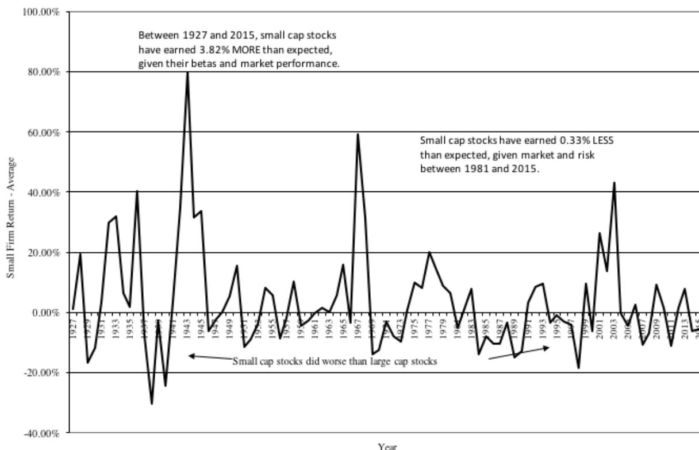

Small cap stocks have annually earned 3.82% more than expected (on a risk-adjusted, market-adjusted basis), but that finding comes with an expiration clause. Since 1981, the small cap premium has been missing in existence, with small cap stocks earning 0.33% less than expected (on a risk-adjusted, market-adjusted basis). There are other troubling aspects with the small cap premium, even over the longer periods, that are glossed over, including the fact that almost all of the premium is earned in January and that it has never been as strong in markets outside the US, as it has been in the US.

Analysts who add a small cap premium on to their costs of equity and justify it based on the historical data will have to find other reasons for their augmentation of costs of equities or private companies. It is possible that size could stand in for some other missing risk (such as lack of information, survival risk or even illiquidity), but if so, should we not be measuring that risk directly?

## Illiquidity

Investors, for the most part, value being able to get into and out of investments with ease and asset prices probably reflect this desire for liquidity. That said, illiquidity is perhaps the least understood and the most mangled aspect of valuation and corporate finance. Since this is a paper about the cost of capital, I will not venture into the dark area of illiquidity discounts, where 20% or more of the value of a business disappears at the very end of the valuation. However, there are some analysts who argue that it is the cost of capital that should bear the burden of conveying concerns about illiquidity, with less liquid investments carrying higher costs of capital.

The earliest theoretical discussions of how best to incorporate illiquidity into asset pricing models occurred in the 1970s. Mayers (1972, 1973, 1976) extended the capital asset pricing model to consider non-traded assets as well as human capital.7 The resulting models did not make explicit adjustments for illiquidity, though. In a more recent attempt to incorporate illiquidity into expected return models, Acharya and Pedersen (2005) examine how assets are priced with liquidity risk and make a critical point.8 It is not just how illiquid an asset is that matters but when it is illiquid. In particular, an asset that is illiquid when the market itself is illiquid (which usually coincides with down markets and economic recessions) should be viewed much more negatively (with a resulting higher expected return) than an asset that is illiquid when the market is liquid. Thus the liquidity beta of an asset will reflect the covariance of the asset's liquidity with market liquidity. Acharya and Pedersen estimate that illiquid stocks have annualized risk premiums about 1.1% higher than liquid stocks, and that 80% of this premium can be explained by the covariance between a stock's illiquidity and overall market illiquidity. Pastor and Stambaugh (2003) also concluded that it is not a stock's liquidity per se that matters but its relationship to overall market liquidity. Over the 34-year period that they examined stock returns, they concluded that stocks whose returns are more sensitive to market liquidity have annual returns that are 7.5% higher than stocks whose returns have low sensitivity to market liquidity, after adjusting for the standard size, value and momentum factors.9

The difficulties associated with modeling liquidity and arriving at usable models have lead many researchers to consider more practical ways of incorporating illiquidity into expected returns. Amihud and Mendelson (1989) examined whether adding bid-ask spreads to betas helped better explain differences in returns across stocks in the U.S.10 In their sample of NYSE stocks from 1961-1980, they concluded that every 1% increase in the bid-ask spread (as a percent of the stock price) increased the annual expected return by 0.24-0.26%. Other studies have used trading volume, turnover ratios (dollar trading volume/ market value of equity) and illiquidity

---

7 Mayers, D., 1972, Nonmarketable assets and capital market equilibrium under uncertainty, in M.C. Jensen, *Studies in the Theory of Capital Markets* (Praeger, New York, NY); Mayers, D., 1973, Nonmarketable assets and the determination of capital asset prices in the absence of a riskless asset, *Journal of Business*, v46, 258-267; Mayers, D., 1976, Nonmarketable assets, market segmentation and the level of asset prices, *Journal of Financial and Quantitative Analysis*, v11, 1-12.

8 Acharya, V. and L.H. Pedersen, 2005, Asset Pricing with Liquidity Risk, *Journal of Financial Economics*, v77, 375-410.

9 Pastor, L. and R. Stambaugh, 2003, Liquidity Risk and Stock Market Returns, *Journal of Political Economy*, v111, 642-685.

10 Amihud, Y. and . Mendelson, 1989, the Effects of Beta, Bid-Ask Spread, Residual Risk and Size on Stock Returns, *Journal of Finance*, v 44, 479-486.

ratios as proxies for illiquidity with consistent results.11 Datar, Nair and Radcliffe (1998) use the turnover ratio as a proxy for liquidity. After controlling for size and the market to book ratio, they conclude that liquidity plays a significant role in explaining differences in returns, with more illiquid stocks (in the 90th percentile of the turnover ratio) having annual returns that are about 3.25% higher than liquid stocks (in the 10th percentile of the turnover ratio). In addition, they conclude that every 1% increase in the turnover ratio reduces annual returns by approximately 0.54%.12

The problems with all of these approaches is that the cost of illiquidity (and the premium you attach to your cost of capital) will vary across time, increasing during periods of crises and dropping in more stable periods, and more troublingly, vary across investors, since investors who are patient and have little need for cash will price it less than impatient investors with uncertain time horizons. For the moment, therefore, much of the work that has been done on incorporating illiquidity into costs of equity and capital can be viewed more as work in progress than finished product.

### Debt: Its cost and weight

Much of the attention in estimating cost of capital is spent on the cost of equity and that should come as no surprise, since it is an implicit cost and has more moving pieces to it. I have referenced the cost of debt in earlier part of the paper and argued for the use of a long term cost of debt but in this section, I would like to tie up a few more loose ends relating to both debt and the mix of debt and equity to use in computing cost of capital.

#### The Cost of Debt – Current and Consistent

There are two simple rules that are worth reemphasizing when it comes the cost of debt. The first is to keep it current, reflecting the company's current default risk standing rather than the one it had when it actually borrowed the money. Thus, if your company was Aaa rated, when it borrowed its money, but has now slide to Baa rating, you will need to use the higher default spread associated with the latter in estimating its cost of debt. The other aspect of aspect of being current is to update the cost of debt for the risk free rate today, rather than the rate at the time of the borrowing. Taken together, these principles imply that the book interest rate, obtained by dividing the interest expenses paid by a company by its book value of debt is close to useless as an estimate of the cost of debt. That may strike you as unfair, especially if the debt that is already on the books is at a rate lower than the current market interest rate that you estimate for the company, but note that while the company benefits from this low-interest debt, it is not the cost of debt that should carry the burden of reflecting this benefit. Instead, if you use the market value of debt in computing your cost of capital, as I will argue you should in the next sub-section, the market value of this "low interest" debt will be lower than the book value, giving the company the capacity to borrow more money if it chooses to.

The other rule for the cost of debt is to stay currency consistent. Thus, no matter how many different currencies a multinational like Nestle may borrow money in, when making corporate

---

11 Brennan, M. J., T. Chordia, and A. Subrahmanyam, 1998. Alternative factor specifications, security characteristics and the cross-section of expected stock returns, *Journal of Financial Economics*, 49, 345–373.

12 Datar, V.T., N. Y. Naik and R. Radcliffe, 1998, "Liquidity and stock returns: An alternative test," *Journal of Financial Markets* 1, 203-219.

finance or valuation judgments, you have to decide on your currency of analysis and estimate the cost of debt in that currency. Consequently, if you are looking at a Nestle project, with cash flows denominated in Indian rupees, you will need to estimate a current long term cost of debt for Nestle in Indian rupees, even if it has no rupee debt outstanding. That may seem like a difficult task, until you remember that currency differences are caused by differences in expected inflation. Adding the differential inflation between the Indian rupee and the US dollar to a Nestle US \$ cost of debt will yield a rupee cost of debt.

### The Tax Benefit of Debt

There are three simple guides to arriving at the tax benefit of debt. The first is to remember that interest expenses save you taxes as the margin, i.e., it is the last dollars of income that you protect from taxation, leading to the decision to use the marginal tax rate (which comes from the tax codes and not the company financials). The second is to note that companies that have income in multiple countries get to decide which of these countries they will borrow in, and that decision is driven by the tax benefits that accrue in each country. Thus, a multinational with operations in the US, Europe and Asia will generally borrow most of what it needs in the US, because the marginal tax rate in the US is higher than the marginal tax rates in European or Asian countries. The third and oft-forgotten rule is that a company needs to be making money, for the tax benefit from debt to manifest. Hence, if you are assessing the cost of capital for a company that is expected to generate operating losses in the near term, there will be no tax benefits from debt during that period. What about the fact that you will be able to generate tax benefits, when you become profitable in the future? That's true, but why not wait until that is the case and change your tax rate then to reflect the savings in future periods.

### Debt Weights

The final input that you need to arrive at a cost of capital are weights on debt and equity. Those weights can have a significant influence on how high or low the cost of capital will be, but here again, there are two issues that often challenge analysts.

### *Market versus Book Value*

There are two choices when it comes to weighting debt and equity. One is to use the accounting balance sheet values for debt and equity (book values) to estimate the cost of capital and the other is the market values for each of these items. On this one, there can be no straddling the fence. Book value weights are not only irrelevant when it comes to cost of capital but come with problems that can be insurmountable. For instance, about 10% of all US companies at the end of 2015 had negative book values of equity, either because of sustained losses over time or accounting special charges, and unless you are willing to weight debt more than 100% and give equity a negative weight, the cost of capital becomes impossible to estimate.

There are some who are troubled by a seeming inconsistency in intrinsic valuation, where you use market values of equity and debt to arrive at weights in the cost of capital, which is then used as a discount rate to arrive at intrinsic values for equity and debt that may be very different from the market values. I reconcile this inconsistency simply with publicly traded companies, by noting that the cost of capital is my cost of acquiring the company in the market place today, where I will have to pay the existing market prices, and that the intrinsic value that I arrive at is my judgment on what these shares are worth. With private businesses and with initial public

offerings, this argument may not carry the day, and with those companies, there is a solution, though it will require some computational gymnastics. You can compute your cost of capital, with your estimated values of equity and debt, albeit with circularity, but using an iterative function, will lead to a convergence where the values match up.13

There is one final practical concern. While the market value of equity is usually easily computed for a publicly traded company, the market value of debt is a much tougher number to find, because a significant portion of debt takes the form of bank loans. If that is the case, you have two choices. One is to take the easy way out and assume that the book value of debt is equal to market value, not a bad assumption if the debt is recent or if the cost of debt for the company has not changed much since the debt issuance. The other is to estimate a market value of debt, using the expected interest payments, face value and maturity of the debt.

### *Hybrids*

Hybrid securities present a problem for analysts, because they share some features with debt and some with equity and are not easily plugged into either. A classic example is convertible debt, where the coupon-bearing bond portion is debt and the conversion option is equity. The solution here is to value each piece separately and put it in with its kind, thus dividing up the bond portion with debt and the conversion option with equity. A more difficult security is preferred stock, at least in the form that it is issued in the United States14, with dividends that are fixed at the time of the issue (making it more like debt) but without the tax benefits or the legal strength to force default (making it like equity). If you are valuing a company with substantial preferred stock, it is best to keep it as a third component in the cost of capital and attach the preferred dividend yield (obtained by dividing the fixed dividend by the current price of preferred stock) to it as a cost.

### *Dynamic Weighting*

The weights that you attach to debt and equity, when financing a company, will tend to reflect its current standing and policy. If it is a young company, losing money or making very little in profits, it will often choose not to borrow money or borrow very little, making the debt ratio you use in your cost of capital a low number. However, if in your forecasts, you are making the company a more profitable and mature business, you should be consistent and allow the debt ratio to rise over time to what you think the company can sustain in its mature phase. These changing weights on debt and equity will also mean that the costs of equity, debt and capital will change over time.

The same issues can sometimes show up in individual project analysis in capital budgeting, where the debt used on a project may be paid down over its life time. To the extent that a company has a portfolio of projects at different stages in their lives, it may not make sense to adjust costs of capital for changing debt ratios, in this case, but to use an average debt ratio over the project life instead as the debt ratio in the cost of capital.

---

13 I use the iteration function in Excel to allow for these iterations.

14 There are parts of the world, especially Latin America, where preferred stock is common stock without voting rights and first claim on dividends, but with variable dividends. Those can be treated as equity in the cost of capital calculation.

## Lessons

To close this paper, I would like to draw some general lessons, learned less from any theory that I have been exposed and more from the practice of valuation, about the cost of capital.

Lesson 1: The Cost of Capital is important, but it is not (and should not be) the key ingredient in your valuation

The next time you have a DCF valuation to do, take note of where you spend your time. I will wager that you spend far more time estimating the cost of capital (and discount rates) than on your expected cash flows, often letting historical trend lines drive revenues, operating income and reinvestment. If so, I think that you have misallocated your time, since big mistakes in valuation come almost always from getting cash flows wrong, not discount rates. There are two reasons why this excessive focus on discount rates is misplaced. First, looking across all publicly traded companies, the spread in costs of capital is surprisingly small, as evidenced in Figure 16, where I graph out the distribution of costs of capital across US companies:

Figure 16: Cost of Capital for US Companies - January 2016

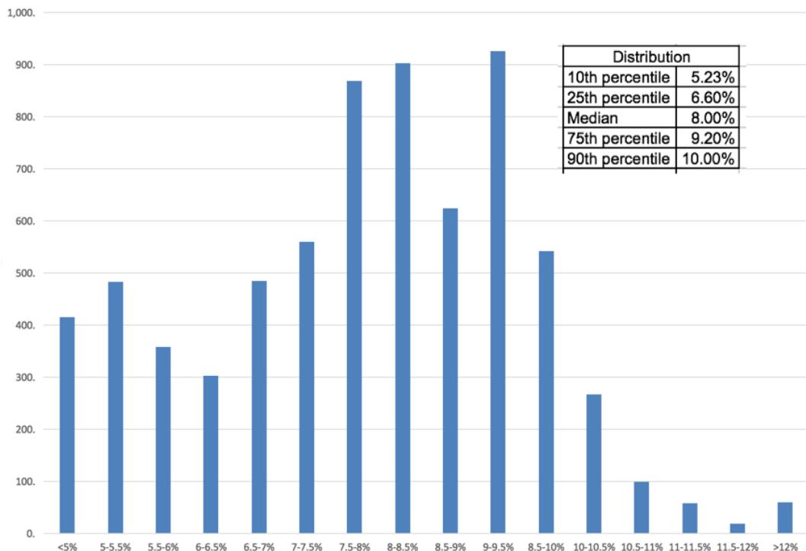

Of the almost 8000 companies my sample, about 80% of the companies (between the 10th and 90th percentile) had costs of capital between 5.23% and 10.00%. If you had to do a valuation in a hurry and used the median cost of capital of 8.00% in your valuation, do you think that you will be very far from fair value? Second, the cost of capital for a company will change as the company changes over time. Thus, a young, money-losing start up may have a cost of capital of 11%, at the 95th percentile, when you start your valuation in year 1, but if you are projecting that this company will grow and become profitable over time, your cost of capital will decline towards 8%, the median for the market.

### Lesson 2: The cost of capital is not a receptacle for all your fears and hopes.

Analysts seem to regard discount rates as receptacles where they can dump their fears about the future. Thus, if you are valuing a biotechnology company with products that are in the FDA pipeline, you feel the urge to increase your discount rate to reflect your fear of failure, just as venture capitalists pump up target rates of return for providing angel financing to young companies, because so many of these companies will not make it. At the risk of repeating myself, the cost of capital is designed for going concerns and is much more suited for reflecting continuous (and macro economics) risks. The risk of an adverse FDA ruling at the biotechnology company or failure (at the start-up) are real risks but they are not the types of risks that should be your cost of capital. Instead, you should consider probabilistic approaches (decision trees, simulations) to capture these risks.

### Lesson 3: Just because a practice is wide spread does not mean that it is justified.

As I noted with the small cap premium, there are lots of practices in estimating cost of capital that have deep roots and are widely practiced. That said, many of these practices, while justified when they were initiated, no longer make sense. In some cases, the data that we have available today allow us to estimate them better and in others, the data that supported their use in the first place no longer exist. That said, changing these practices will not be easy.

### Lesson 4: Watch out for agenda (or bias) driven costs of capital

The biggest enemy of good valuations are the preconceptions and biases that we bring into them. Those biases are sometimes the result of behavioral quirks but more often they reflect why you are estimating the cost of capital in the first place. If you are estimating the cost of capital to use to value a business for tax purposes, for the tax payer, you will find ways to increase your cost of capital (by adding small cap, liquidity and company specific risk premiums to your base expected return) and lower value. If, in contrast, you are valuing the same business for the tax authorities, your choices will be driven by the need to lower the cost of capital and increase value.

## Conclusion

The cost of capital is ubiquitous in finance, showing up in almost every dimension of corporate finance, driving investing decisions, determining financing choices and affecting dividend policy and in intrinsic valuation, as the discount rate to adjust cash flows for risk and time value. That said, it is often mangled and misused in practice and this paper is my attempt to make sense of it. I understand that there can be differences of opinion on how best to estimate its components but it still has to be estimated consistently and viewed as a dynamic number that can change as macro environments and companies change.