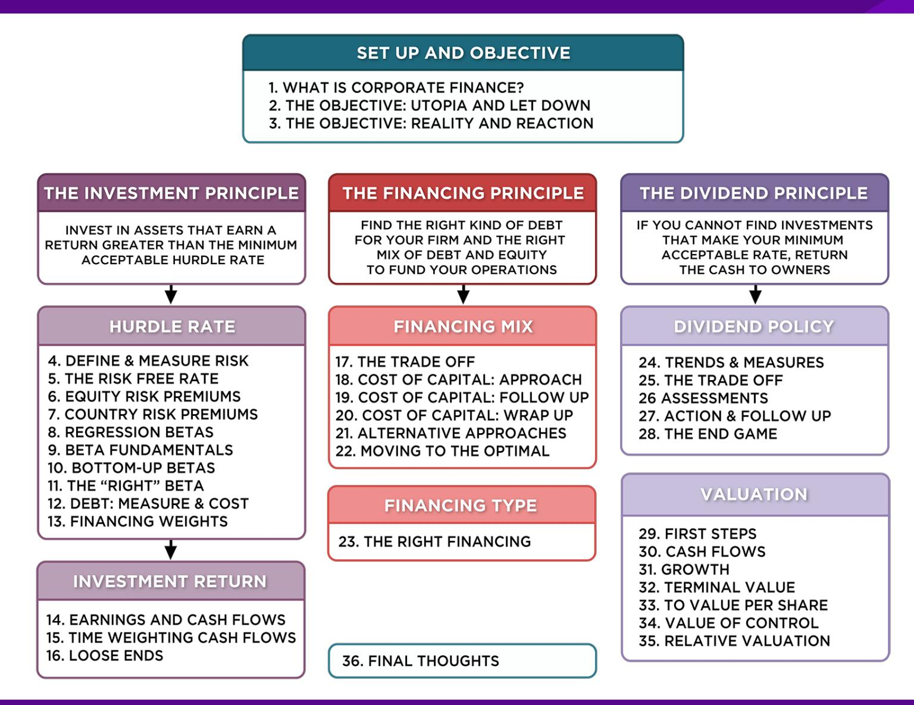
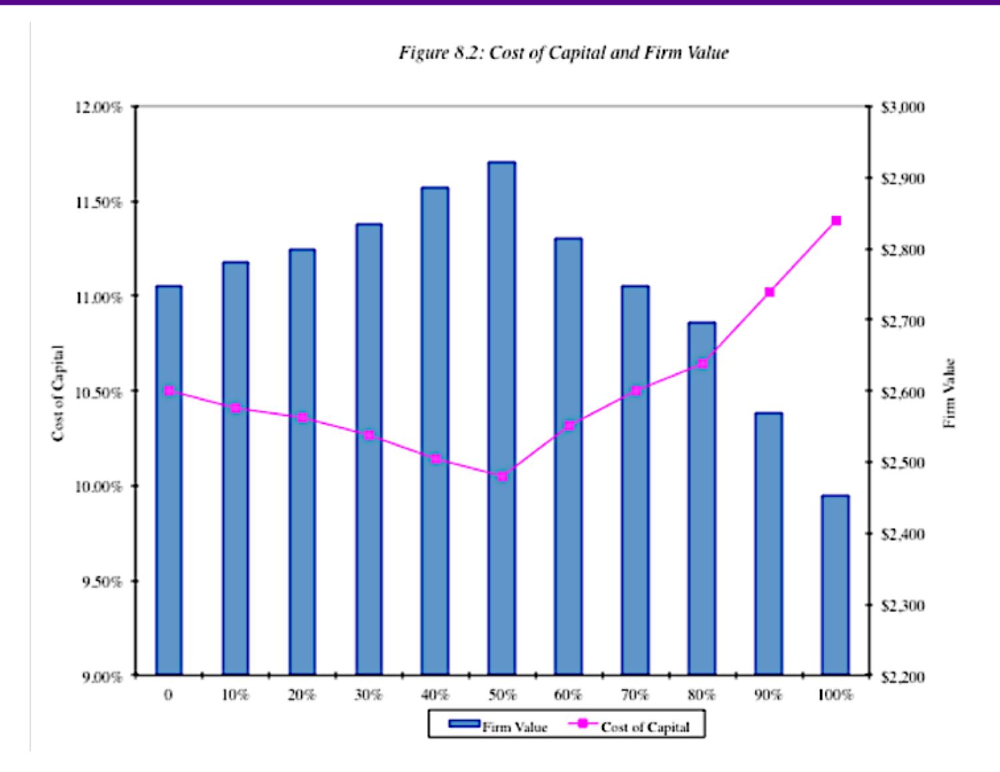
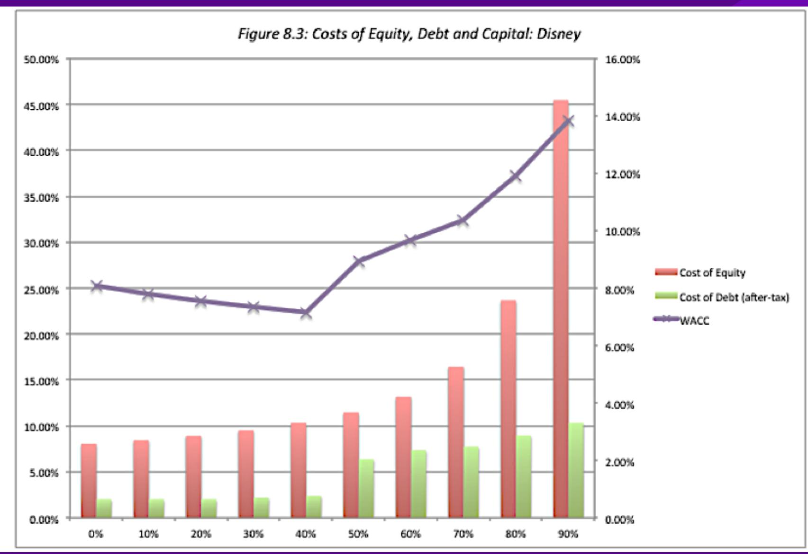
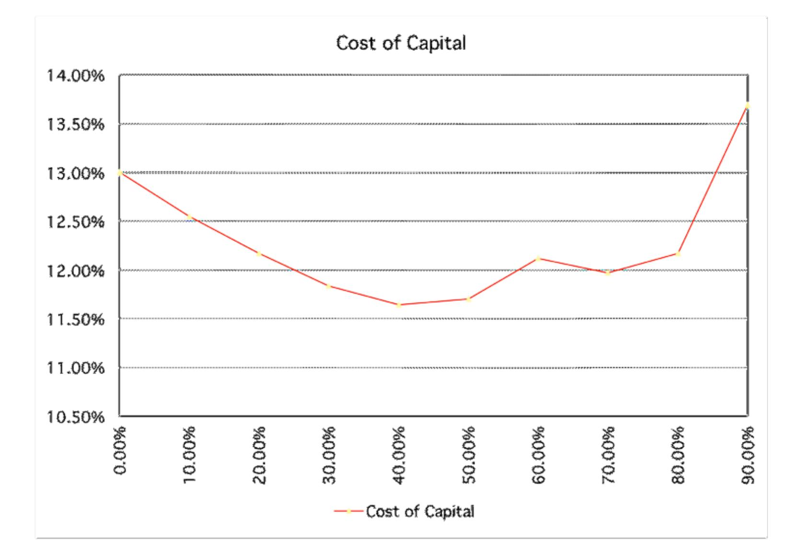
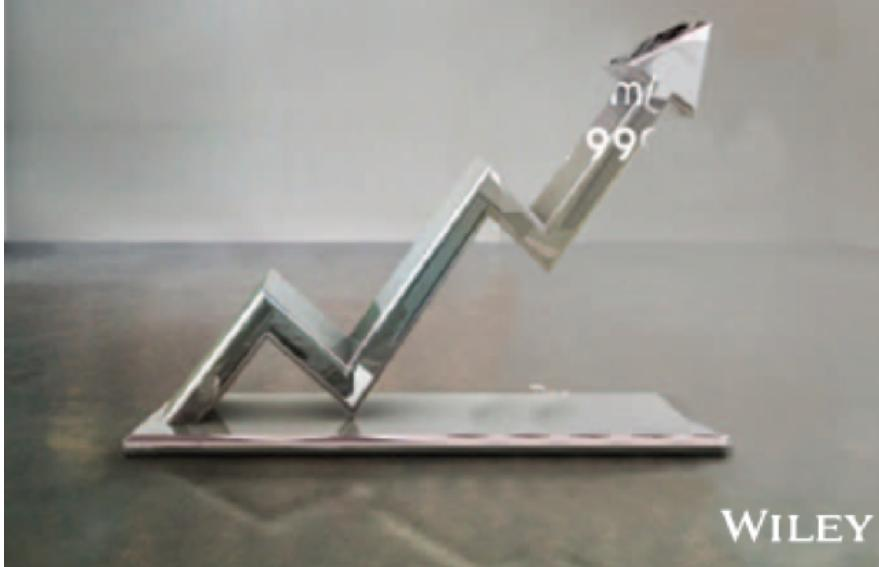

# **SESSION 18: THE COST OF CAPITAL APPROACH**

It is better to have a lower hurdle rate than a higher one.

# **SESSION 18: THE COST OF CAPITAL APPROACH**

# **THE COST OF CAPITAL APPROACH**

- Value of a Firm = Present Value of Cash Flows to the Firm, discounted back at the cost of capital
- If the cash flows to the firm are held constant, and the cost of capital is minimized, the value of the firm will be maximized.

#### **APPLYING COST OF CAPITAL APPROACH: THE TEXTBOOK EXAMPLE**

| D/(D+E) | Cost of Equity | After-tax Cost of Debt | Cost of Capital | Firm Value |
|---------|----------------|------------------------|-----------------|------------|
| 0       | 10.50%         | 4.80%                  | 10.50%          | \$2,747    |
| 10%     | 11.00%         | 5.10%                  | 10.41%          | \$2,780    |
| 20%     | 11.60%         | 5.40%                  | 10.36%          | \$2,799    |
| 30%     | 12.30%         | 5.52%                  | 10.27%          | \$2,835    |
| 40%     | 13.10%         | 5.70%                  | 10.14%          | \$2,885    |
| 50%     | 14.50%         | 6.10%                  | 10.30%          | \$2,822    |
| 60%     | 15.00%         | 7.20%                  | 10.32%          | \$2,814    |
| 70%     | 16.10%         | 8.10%                  | 10.50%          | \$2,747    |
| 80%     | 17.20%         | 9.00%                  | 10.64%          | \$2,696    |
| 90%     | 18.40%         | 10.20%                 | 11.02%          | \$2,569    |
| 100%    | 19.70%         | 11.40%                 | 11.40%          | \$2,452    |

Expected Cash flow to firm next year (Cost of capital - g) = 200(1.03) (Cost of capital - g)

#### **THE U-SHAPED COST OF CAPITAL GRAPH**

# **CURRENT COST OF CAPITAL: DISNEY**

- The beta for Disney's stock in November 2013 was 1.0013. The T-Bond rate at that time was 2.75%. Using an estimated equity risk premium of 5.76%, we estimated the cost of equity for Disney to be 8.52%:

Cost of Equity = 2.75% + 1.0013 (5.76%) = 8.52%

- Disney's bond rating in May 2009 was A, and based on this rating, the estimated pre-tax cost of debt for Disney is 3.75%. Using a marginal tax rate of 36.1, the after-tax cost of debt for Disney is 2.40%.

After-Tax Cost of Debt = 3.75% (1 – 0.361) = 2.40%

- The cost of capital was calculated using these costs and the weights based on market values of equity (121,878) and debt (15,961):

Cost of capital =

# **MECHANICS OF COST OF CAPITAL ESTIMATION**

- 1. Estimate the Cost of Equity at different levels of debt: o Equity will become riskier à Beta will increase à Cost of Equity will increase o Estimation will use levered beta calculation
- 2. Estimate the Cost of Debt at different levels of debt: o Default risk will go up and bond ratings will go down as debt goes up à Cost of Debt will increase o To estimate bond ratings, we will use the interest coverage ration (EBIT/Interest expense)
- 3. Estimate the Cost of Capital at different levels of debt
- 4. Calculate the effect on Firm Value and Stock Price

#### **LAYING THE GROUNDWORK: 1. ESTIMATE THE UNLEVERED BETA FOR THE FIRM**

- One approach is to use the regression beta (1.25) and then unlever, using the average debt to equity ratio (19.44%) during the period of the

Unlevered beta = 
$$1.25 / [1 + (1 - 0.361)(0.1944)] = 1.1119$$

- Alternatively, we can back to the source and estimate it from the betas of the businesses.

|                      |          |          |                   | Proportion	of |                |              |            |
|----------------------|----------|----------|-------------------|---------------|----------------|--------------|------------|
| Business             | Revenues | EV/Sales | Value	of	Business |               |                |              |            |
|                      |          |          |                   | Disney        | Unlevered	beta | Value        | Proportion |
| Media	Networks       | \$20,356 | 3.27     | \$66,580          | 49.27%        | 1.03           | \$66,579.81  | 49.27%     |
| Parks	&	Resorts      | \$14,087 | 3.24     | \$45,683          | 33.81%        | 0.70           | \$45,682.80  | 33.81%     |
| Studio	Entertainment | \$5,979  | 3.05     | \$18,234          | 13.49%        | 1.10           | \$18,234.27  | 13.49%     |
| Consumer	Products    | \$3,555  | 0.83     | \$2,952           | 2.18%         | 0.68           | \$2,951.50   | 2.18%      |
| Interactive          | \$1,064  | 1.58     | \$1,684           | 1.25%         | 1.22           | \$1,683.72   | 1.25%      |
| Disney	Operations    | \$45,041 |          | \$135,132         | 100.00%       | 0.9239         | \$135,132.11 | 100.00%    |

## **2. GET DISNEY'S CURRENT FINANCIALS . . .**

|                                         | Most recent fiscal year (2012-13) | Prior year |
|-----------------------------------------|-----------------------------------|------------|
| Revenues                                | \$45,041                          | \$42,278   |
| EBITDA                                  | \$10,642                          | \$10,850   |
| Depreciation & Amortization             | \$2,192                           | \$1,987    |
| EBIT                                    | \$9,450                           | \$8,863    |
| Interest Expenses                       | \$349                             | \$564      |
| EBITDA (adjusted for leases)            | \$12,517                          | \$11,168   |
| Depreciation (adjusted for leases)      | \$ 2,485                          | \$2,239    |
| EBIT (adjusted for leases)              | \$10,032                          | \$8,929    |
| Interest Expenses (adjusted for leases) | \$459                             | \$630      |

# **I. COST OF EQUITY**

| Debt to Capital Ratio | D/E Ratio | Levered Beta | Cost of Equity |
|-----------------------|-----------|--------------|----------------|
| 0%                    | 0.00%     | 0.9239       | 8.07%          |
| 10%                   | 11.11%    | 0.9895       | 8.45%          |
| 20%                   | 25.00%    | 1.0715       | 8.92%          |
| 30%                   | 42.86%    | 1.1770       | 9.53%          |
| 40%                   | 66.67%    | 1.3175       | 10.34%         |
| 50%                   | 100.00%   | 1.5143       | 11.48%         |
| 60%                   | 150.00%   | 1.8095       | 13.18%         |
| 70%                   | 233.33%   | 2.3016       | 16.01%         |
| 80%                   | 400.00%   | 3.2856       | 21.68%         |
| 90%                   | 900.00%   | 6.2376       | 38.69%         |

Levered Beta = 0.9239 (1 + (1- .361) (D/E))

Cost of equity = 2.75% + Levered beta \* 5.76%

## **ESTIMATING COST OF DEBT**

Start with the market value of the firm = = 121,878 + \$15,961 = \$137,839 million

D/(D+E) 0.00% 10.00% Debt to capital

D/E 0.00% 11.11% D/E = 10/90 = .1111

\$ Debt \$0 \$13,784 10% of \$137,839

EBITDA \$12,517 \$12,517 Same as 0% debt

Depreciation \$ 2,485 \$ 2,485 Same as 0% debt

EBIT \$10,032 \$10,032 Same as 0% debt

Interest \$0 \$434 Pre-tax cost of debt \* \$ Debt

Pre-tax Int. cov∞ 23.10 EBIT/ Interest Expenses

Likely Rating AAA AAA From Ratings table

Pre-tax cost of debt 3.15% 3.15% Riskless Rate + Spread

## **THE RATINGS TABLE**

| Large cap (>\$5 billion) | Ratings (S&P/Moody’s) | Spread (11/13) | Interest Rate |
|--------------------------|-----------------------|----------------|---------------|
| >8.50                    | Aaa/AAA               | 0.40%          | 3.15%         |
| 6.5-8.5                  | As2/AAA               | 0.70%          | 3.45%         |
| 5.5-6.5                  | A1/A+                 | 0.85%          | 3.60%         |
| 4.25-5.5                 | A2/A                  | 1.00%          | 3.75%         |
| 3-4.25                   | A3/A-                 | 1.30%          | 4.05%         |
| 2.5-3                    | Baa2/BBB              | 2.00%          | 4.75%         |
| 2.25-2.5                 | Ba1/BB+               | 3.00%          | 5.75%         |
| 2-2.25                   | Ba2/BB                | 4.00%          | 6.75%         |
| 1.75-2.25                | B1/B+                 | 5.50%          | 8.25%         |
| 1.5-1.75                 | B2/B                  | 6.50%          | 9.25%         |
| 1.25-1.5                 | B3/B-                 | 7.25%          | 10.00%        |
| 0.8-1.25                 | Caa/CCC               | 8.75%          | 11.50%        |
| 0.65-0.8                 | Ca2/CC                | 9.50%          | 12.25%        |
| 0.2-0.65                 | C2/C                  | 10.50%         | 13.25%        |
| <0.2                     | D2/D                  | 12.00%         | 14.75%        |

T-Bond rate = 2.75%

# **A TEST: CAN YOU DO THE 30% LEVEL?**

|                         |          | Iteration 1 (Debt @AAA rate) | Iteration 2 (Debt @AA rate) |
|-------------------------|----------|------------------------------|-----------------------------|
| D/(D + E)               | 20.00%   | 30.00%                       | 30.00%                      |
| D / E                   | 25.00%   | 30/70=42.86%                 |                             |
| \$ Debt                 | \$27,568 | \$41,352                     |                             |
| EBITDA                  | \$12,517 | \$12,517                     |                             |
| Depreciation            | \$2,485  | \$2,485                      |                             |
| EBIT                    | \$10,032 | \$10,032                     |                             |
| Interest expense        | \$868    | \$1,302                      | \$1,427                     |
| Interest coverage ratio | 11.55    | 7.70                         | 7.03                        |
| Likely rating           | AAA      | AA                           | AA                          |
| Pretax cost of debt     | 3.15%    | 3.45%                        | 3.45%                       |

# **BOND RATINGS, COST OF DEBT AND DEBT RATIOS**

| Debt Ratio | \$ Debt   | Interest Expense | Interest Coverage Ratio | Bond Rating | Pre-tax cost of debt | Tax rate | After-tax cost of debt |
|------------|-----------|------------------|-------------------------|-------------|----------------------|----------|------------------------|
| 0%         | \$0       | \$0              | ∞                       | Aaa/AAA     | 3.15%                | 36.10%   | 2.01%                  |
| 10%        | \$13,784  | \$434            | 23.10                   | Aaa/AAA     | 3.15%                | 36.10%   | 2.01%                  |
| 20%        | \$27,568  | \$868            | 11.55                   | Aaa/AAA     | 3.15%                | 36.10%   | 2.01%                  |
| 30%        | \$41,352  | \$1,427          | 7.03                    | Aa2/AA      | 3.45%                | 36.10%   | 2.20%                  |
| 40%        | \$55,136  | \$2,068          | 4.85                    | A2/A        | 3.75%                | 36.10%   | 2.40%                  |
| 50%        | \$68,919  | \$6,892          | 1.46                    | B3/B-       | 10.00%               | 36.10%   | 6.39%                  |
| 60%        | \$82,703  | \$9,511          | 1.05                    | Caa/CCC     | 11.50%               | 36.10%   | 7.35%                  |
| 70%        | \$96,487  | \$11,096         | 0.90                    | Caa/CCC     | 11.50%               | 32.64%   | 7.75%                  |
| 80%        | \$110,271 | \$13,508         | 0.74                    | Ca2/CC      | 12.25%               | 26.81%   | 8.97%                  |
| 90%        | \$124,055 | \$16,437         | 0.61                    | C2/C        | 13.25%               | 22.03%   | 10.33%                 |

## **STATED VERSUS EFFECTIVE TAX RATES**

- You need taxable income for interest to provide a tax savings. Note that the EBIT at Disney is \$10,032 million. As long as interest expenses are less than \$10,032 million, interest expenses remain fully tax-deductible and earn the 36.1% tax benefit. At a 60% debt ratio, the interest expenses are \$9,511 million and the tax benefit is therefore 36.1% of this amount.
- At a 70% debt ratio, however, the interest expenses balloon to \$11,096 million, which greater than the EBIT of \$10,032 million. We consider the tax benefit on the interest expenses up to this amount: o Maximum Tax Benefit = EBIT\*Marginal Tax Rate = \$10,032 million \* 0.361 + \$3,622 million o Adjusted Marginal Tax Rate = Maximum Tax Benefit/Interest Expenses = \$3,622/\$11,096 = 32.64%

#### **DISNEY'S COST OF CAPITAL SCHEDULE . . .**

| Debt Ratio | Beta   | Cost of Equity | Cost of Debt (after-tax) | WACC   |
|------------|--------|----------------|--------------------------|--------|
| 0%         | 0.9239 | 8.07%          | 2.01%                    | 8.07%  |
| 10%        | 0.9895 | 8.45%          | 2.01%                    | 7.81%  |
| 20%        | 1.0715 | 8.92%          | 2.01%                    | 7.54%  |
| 30%        | 1.1770 | 9.53%          | 2.20%                    | 7.33%  |
| 40%        | 1.3175 | 10.34%         | 2.40%                    | 7.16%  |
| 50%        | 1.5143 | 11.48%         | 6.39%                    | 8.93%  |
| 60%        | 1.8095 | 13.18%         | 7.35%                    | 9.68%  |
| 70%        | 2.3762 | 16.44%         | 7.75%                    | 10.35% |
| 80%        | 3.6289 | 23.66%         | 8.97%                    | 11.90% |
| 90%        | 7.4074 | 45.43%         | 10.33%                   | 13.84% |

## **DISNEY: COST OF CAPITAL CHART**

# **DISNEY: COST OF CAPITAL CHART – 1997**

## Applied Corporate Finance

Optional: Read Chapter 8

#### **Task**

Use the cost of capital approach to estimate the optimal financing mix for your company

