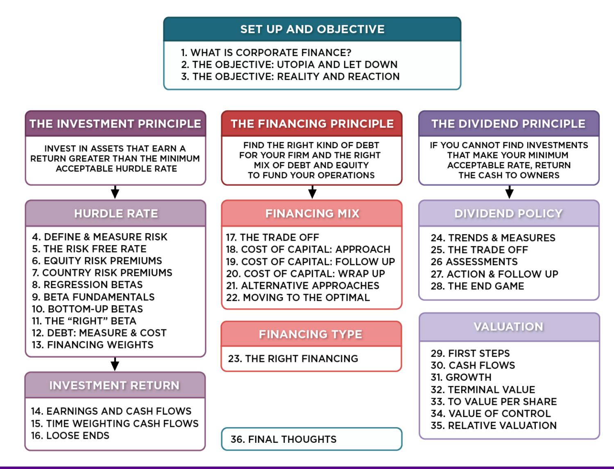
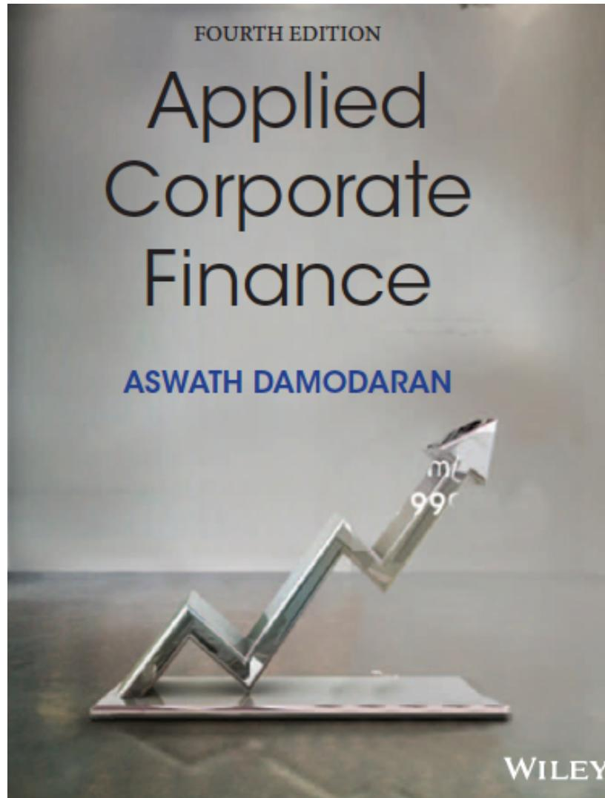

# **SESSION 19: COST OF CAPITAL FOLLOW UP**

A GPS to your optimal financing mix.

# **SESSION 19: COST OF CAPITAL FOLLOW UP**

# DISNEY'S COST OF CAPITAL SCHEDULE...

| Debt Ratio | Beta   | Cost of Equity | Cost of Debt (after-tax) | WACC   |
|------------|--------|----------------|--------------------------|--------|
| 0%         | 0.9239 | 8.07%          | 2.01%                    | 8.07%  |
| 10%        | 0.9895 | 8.45%          | 2.01%                    | 7.81%  |
| 20%        | 1.0715 | 8.92%          | 2.01%                    | 7.54%  |
| 30%        | 1.1770 | 9.53%          | 2.20%                    | 7.33%  |
| 40%        | 1.3175 | 10.34%         | 2.40%                    | 7.16%  |
| 50%        | 1.5143 | 11.48%         | 6.39%                    | 8.93%  |
| 60%        | 1.8095 | 13.18%         | 7.35%                    | 9.68%  |
| 70%        | 2.3762 | 16.44%         | 7.75%                    | 10.35% |
| 80%        | 3.6289 | 23.66%         | 8.97%                    | 11.90% |
| 90%        | 7.4074 | 45.43%         | 10.33%                   | 13.84% |

#### **THE COST OF CAPITAL APPROACH SUGGESTS THAT DISNEY SHOULD DO THE FOLLOWING…**

- Disney currently has \$15.96 billion in debt. The optimal dollar debt (at 40%) is roughly \$55.1 billion. Disney has excess debt capacity of 39.14 billion.
- To move to its optimal and gain the increase in value, Disney should borrow \$ 39.14 billion and buy back stock.
- Given the magnitude of this decision, you should expect to answer three questions: o Why should we do it? o What if something goes wrong? o What if we don't want to (or cannot ) buy back stock and want to make investments with the additional debt capacity?

#### **WHY SHOULD WE DO IT? EFFECT ON FIRM VALUE – FULL VALUATION**

- Step 1: Estimate the cash flows to Disney as a firm EBIT (1 – Tax Rate) = 10,032 (1 – 0.361) = \$6,410 + Depreciation and amortization = \$2,485
  - Capital expenditures = \$5,239
  - Change in noncash working capital \$0 Free cash flow to the firm = \$3,657
- Step 2: Back out the implied growth rate in the current market value Current enterprise value = \$121,878 + 15,961 = 3,931 = 133,908 Value of firm = \$ 133,908 = Growth rate = (Firm Value \* Cost of Capital – CF to Firm)/(Firm Value + CF to Firm) = (133,908\* 0.0781 – 3,657)/(133,908+ 3,657) = 0.0494 or 4.94%
- Step 3: Revalue the firm with the new cost of capital Firm value = FCFF0 (1+g) (Cost of Capital -g) = 3, 657(1+g) (.0781 -g) FCFF0 (1+g) (Cost of Capital -g) = 3, 657(1.0494) (.0716 -0.0494) = \$172, 935 million

Current enterprise value = 
$$\$1,214,878 + 1,5,061 - 2,031 - 123,908$$
  
 Value of firm =  $\$ 133,908 = \frac{\text{FCFF}_0(1+g)}{(\text{Cost of Capital -g})} = \frac{3,657(1+g)}{(.0781 - g)}$ 

Firm value = 
$$\frac{\text{FCFF}_0(1+g)}{(\text{Cost of Capital -g})} = \frac{3,657(1.0494)}{(.0716 - 0.0494)} = \$172,935 \text{ million}$$

The firm value increases by \$39,028 million = \$172,935 - \$133,908

### **EFFECT ON VALUE: INCREMENTAL APPROACH**

- In this approach, we start with the current market value and isolate the effect of changing the capital structure on the cash flow and the resulting value.

Enterprise Value before the change = \$133,908 million

Cost of financing Disney at existing debt ratio = \$ 133,908 \* 0.0781 = \$10,458 million

Cost of financing Disney at optimal debt ratio = \$ 133,908 \* 0.0716 = \$ 9,592 million

Annual savings in cost of financing = \$10,458 million – \$9,592 million = \$866 million

Enterprise value after recapitalization

= Existing enterprise value + PV of Savings = \$133,908 + \$19,623 = \$153,531 million

Increase in Value= 
$$\frac{\text{Annual Savings next year}}{(\text{Cost of Capital} - \text{g})} = \frac{\$866}{(0.0716 - 0.0275)} = \$19,623 \text{ million}$$

#### **FROM FIRM VALUE TO VALUE PER SHARE: THE RATIONAL INVESTOR SOLUTION**

- Because the increase in value accrues entirely to stockholders, we can estimate the increase in value per share by dividing by the total number of shares outstanding (1,800 million). o Increase in Value per Share = \$19,623/1800 = \$ 10.90 o New Stock Price = \$67.71 + \$10.90= \$78.61
- Implicit in this computation is the assumption that the increase in firm value will be spread evenly across both the stockholders who sell their stock back to the firm and those who do not and that is why we term this the "rational" solution, since it leaves investors indifferent between selling back their shares and holding on to them.

# **THE MORE GENERAL SOLUTION, GIVEN A BUYBACK PRICE**

- Start with the buyback price and compute the number of shares outstanding after the buyback: o Increase in Debt = Debt at optimal – Current Debt o # Shares after buyback = # Shares before –
- Then compute the equity value after the recapitalization, starting with the enterprise value at the optimal, adding back cash and subtracting out the debt at the optimal: o Equity value after buyback = Optimal Enterprise value + Cash – Debt
- Divide the equity value after the buyback by the post-buyback number of shares. o Value per share after buyback = Equity value after buyback/ Number of shares after buyback Increase in Debt Share Price

#### **LET'S TRY A PRICE: WHAT IF CAN BUY SHARES BACK AT THE OLD PRICE (\$67.71)?**

- Start with the buyback price and compute the number of shares outstanding after the buyback o Debt issued = \$ 55,136 - \$15,961 = \$39,175 million o # Shares after buyback = 1800 - \$39,175/\$67.71 = 1221.43 m
- Then compute the equity value after the recapitalization, starting with the enterprise value at the optimal, adding back cash and subtracting out the debt at the optimal: o Optimal Enterprise Value = \$153,531 o Equity value after buyback = \$153,531 + \$3,931– \$55,136 = \$102,326
- Divide the equity value after the buyback by the post-buyback number of shares. o Value per share after buyback = \$102,326/1221.43 = \$83.78

# **BACK TO THE RATIONAL PRICE (\$78.61): HERE IS THE PROOF**

- Start with the buyback price and compute the number of shares outstanding after the buyback o # Shares after buyback = 1800 - \$39,175/\$78.61 = 1301.65 m
- Then compute the equity value after the recapitalization, starting with the enterprise value at the optimal, adding back cash and subtracting out the debt at the optimal: o Optimal Enterprise Value = \$153,531 o Equity value after buyback = \$153,531 + \$3,931– \$55,136 = \$102,326
- Divide the equity value after the buyback by the post-buyback number of shares. o Value per share after buyback = \$102,326/1301.65 = \$78.61

#### **2. WHAT IF SOMETHING GOES WRONG? THE DOWNSIDE RISK**

- Doing What-if analysis on Operating Income
  - A. Statistical Approach o Standard Deviation In Past Operating Income o Reduce Base Case By One Standard Deviation (Or More)
  - B. "Economic Scenario" Approach o Look At What Happened To Operating Income During The Last Recession. (How Much Did It Drop In % Terms?) o Reduce Current Operating Income By Same Magnitude
- Constraint on Bond Ratings

# **DISNEY**'**S OPERATING INCOME: HISTORY**

| <i>Year</i> | <i>EBIT</i> | <i>% Change in EBIT</i> | <i>Year</i> | <i>EBIT</i> | <i>% Change in EBIT</i> |
|-------------|-------------|-------------------------|-------------|-------------|-------------------------|
| 1987        | \$756       |                         | 2001        | \$2,832     | 12.16%                  |
| 1988        | \$848       | 12.17%                  | 2002        | \$2,384     | -15.82%                 |
| 1989        | \$1,177     | 38.80%                  | 2003        | \$2,713     | 13.80%                  |
| 1990        | \$1,368     | 16.23%                  | 2004        | \$4,048     | 49.21%                  |
| 1991        | \$1,124     | -17.84%                 | 2005        | \$4,107     | 1.46%                   |
| 1992        | \$1,287     | 14.50%                  | 2006        | \$5,355     | 30.39%                  |
| 1993        | \$1,560     | 21.21%                  | 2007        | \$6,829     | 27.53%                  |
| 1994        | \$1,804     | 15.64%                  | 2008        | \$7,404     | 8.42%                   |
| 1995        | \$2,262     | 25.39%                  | 2009        | \$5,697     | -23.06%                 |
| 1996        | \$3,024     | 33.69%                  | 2010        | \$6,726     | 18.06%                  |
| 1997        | \$3,945     | 30.46%                  | 2011        | \$7,781     | 15.69%                  |
| 1998        | \$3,843     | -2.59%                  | 2012        | \$8,863     | 13.91%                  |
| 1999        | \$3,580     | -6.84%                  | 2013        | \$9,450     | 6.62%                   |
| 2000        | \$2,525     | -29.47%                 |             |             |                         |

Standard deviation in %

change in EBIT = 19.17%

| Recession  | Decline in Operating Income |
|------------|-----------------------------|
| 2009       | Drop of 23.06%              |
| 2002       | Drop of 15.82%              |
| 1991       | Drop of 22.00%              |
| 1981-82    | Increased by 12%            |
| Worst Year | Drop of 29.47%              |

# DISNEY: SAFETY BUFFERS?

| EBIT drops by | EBIT     | Optimal Debt ratio |
|---------------|----------|--------------------|
| 0%            | \$10,032 | 40%                |
| 10%           | \$9,029  | 40%                |
| 20%           | \$8,025  | 40%                |
| 30%           | \$7,022  | 40%                |
| 40%           | \$6,019  | 30%                |
| 50%           | \$5,016  | 30%                |
| 60%           | \$4,013  | 20%                |

# **CONSTRAINTS ON RATINGS**

- Management often specifies a 'desired rating' below which they do not want to fall.
- The rating constraint is driven by three factors o it is one way of protecting against downside risk in operating income (so do not do both) o a drop in ratings might affect operating income o there is an ego factor associated with high ratings
- Caveat: Every rating constraint has a cost. o The cost of a rating constraint is the difference between the unconstrained value and the value of the firm with the constraint. o Managers need to be made aware of the costs of the constraints they impose.

# **RATINGS CONSTRAINTS FOR DISNEY**

- At its optimal debt ratio of 40%, Disney has an estimated rating of A.
- If managers insisted on a AA rating, the optimal debt ratio for Disney is then 30% and the cost of the ratings constraint is fairly small: Cost of AA Rating Constraint = Value at 40% Debt – Value at 30% Debt = \$153,531 m – \$147,835 m = \$ 5,696 million
- If managers insisted on a AAA rating, the optimal debt ratio would drop to 20% and the cost of the ratings constraint would rise: Cost of AAA rating constraint = Value at 40% Debt – Value at 20% Debt = \$153,531 m – \$141,406 m = \$ 12,125 million

# **3. WHAT IF YOU DO NOT BUY BACK STOCK..**

- The optimal debt ratio is ultimately a function of the underlying riskiness of the business in which you operate and your tax rate.
- Will the optimal be different if you invested in projects instead of buying back stock? o No. As long as the projects financed are in the same business mix that the company has always been in and your tax rate does not change significantly. o Yes, if the projects are in entirely different types of businesses or if the tax rate is significantly different.

## Task

Evaluate the value effects of moving to the optimal debt ratio for your firm and your room for error.

Optional: Read Chapter 8