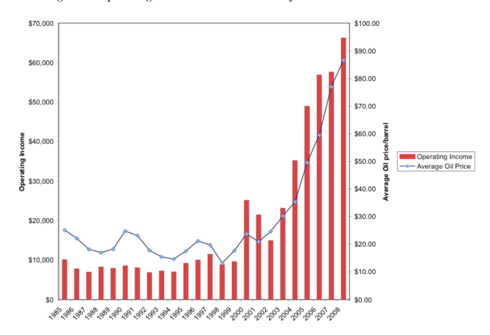
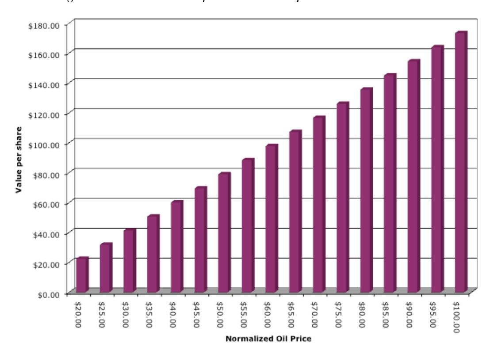
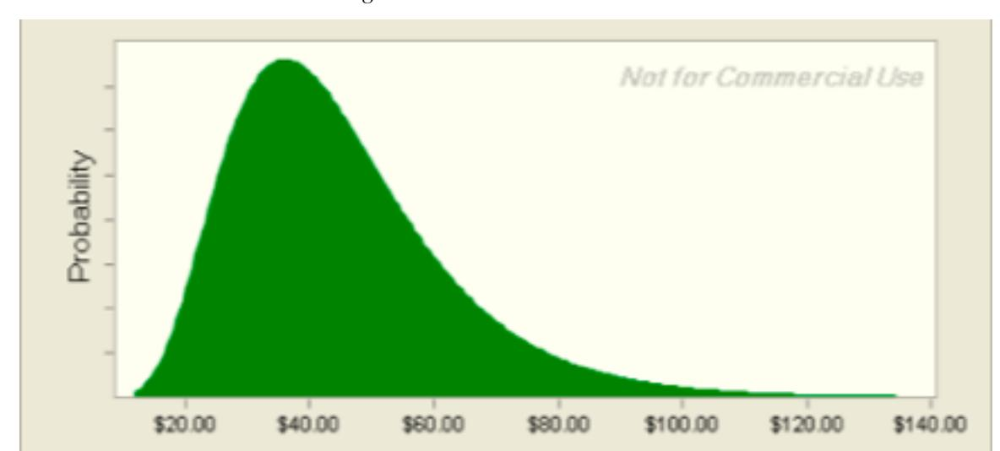
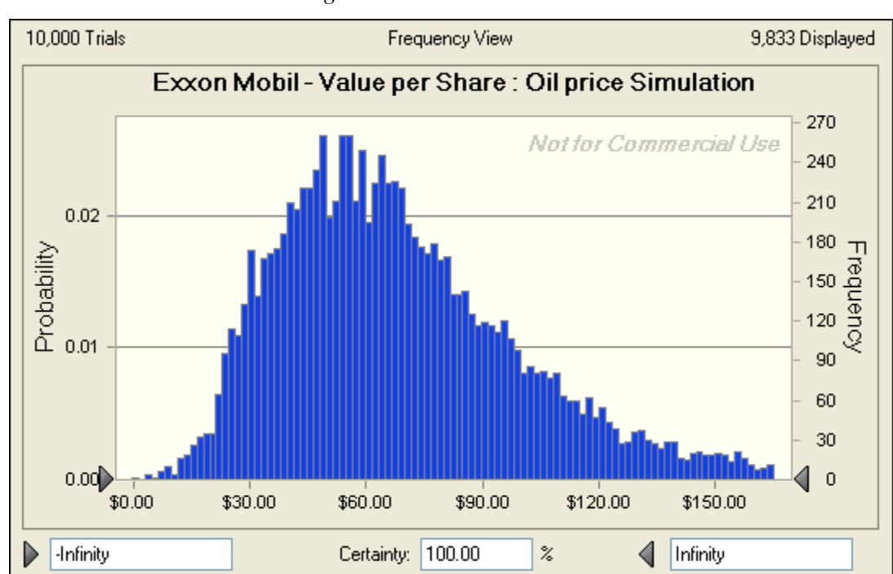
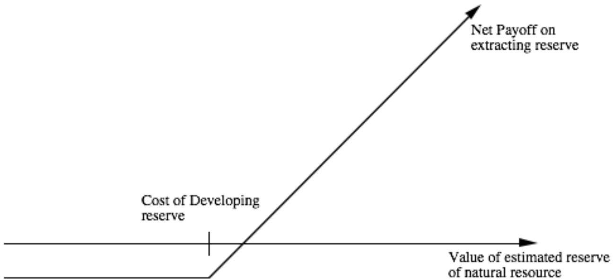

# **Ups and Downs: Valuing Cyclical and Commodity Companies**

*Aswath Damodaran*

*Stern School of Business, New York University*

*September 2009*

## **Ups and Downs: Valuing Cyclical and Commodity Companies**

#### *Abstract*

Cyclical and commodity companies share a common feature, insofar as their value is often more dependent on the movement of a macro variable (the commodity price or the growth in the underlying economy) than it is on firm specific characteristics. Thus, the value of an oil company is inextricably linked to the price of oil just as the value of a cyclical company is tied to how well the economy is doing. Since both commodity prices and economies move in cycles, the biggest problem we face in valuing companies tied to either is that the earnings and cash flows reported in the most recent year are a function of where we are in the cycle, and extrapolating those numbers into the future can result in serious misvaluations. In this paper, we look at the consequences of this dependence on cycles and how best to value companies that are exposed to this problem.

Uncertainty and volatility are endemic to valuation, but cyclical and commodity companies have volatility thrust upon them by external factors – the ups and downs of the economy with cyclical companies, and movements in commodity prices with commodity companies. As a consequence, even mature cyclical and commodity companies have volatile earnings and cash flows. When valuing these companies, the danger of focusing on the most recent fiscal year is that the resulting valuation will depend in great part on where in the cycle (economic or commodity price) that year fell. If the most recent year was a boom (down) year, the value will be high (low).

In this paper, we look at how best to deal with the swings in earnings that characterize commodity and cyclical companies in both discounted cash flow and relative valuations. We argue that trying to forecast the next cycle is not only futile but dangerous and that it is far better to normalize earnings and cash flows across the cycle.

## **The Setting**

There are two groups of companies that we look at in this paper. The first group includes cyclical companies, i.e., companies whose fortunes rest in large part on how the economy is doing. The second group of companies are commodity companies that derive their earnings from producing commodities that may become inputs to other companies in the economy (oil, iron ore) or be desired as investments in their own right (gold, platinum, diamonds).

#### **Cyclical Companies**

We usually define cyclical firms in relation to the overall economy. Firms that move up and down with the economy are considered cyclical companies. There are two ways of identifying these firms:

- The first is to categorize industry sectors into cyclical and non-cyclical, based on historical performance, and to assume that all firms in the sector share the same characteristics. For instance, the housing and automobile sectors have historically been considered to be cyclical, and all firms in these sectors will share that label. While the approach is low-cost and simple, we run the risk of tarring all firms in a sector with the same brush; thus Walmart and Abercombie & Fitch would both be categorized as cyclical firms because they are in the retailing business. In addition,

categorizing some sectors, such as technology, into cyclical or non-cyclical has become much more difficult to do.

- The second is to look at a company's own history, in conjunction with overall economic performance, to make a categorization. Thus, a company that has historically reported lower earnings/revenues during economic downturns and higher earnings/revenues during economic boom times would be viewed as cyclical. This approach allows for more nuance than the first one bit it works only when the companies being analyzed have long operating histories. Furthermore, factors specific to the firm can cause volatility in earnings that can make this analysis misleading.

In general, the shift from manufacturing-based economies to service-based economies has made it more difficult to categorize firms. At the same time, though, every economic recession reminds us that some firms are affected more negatively than other when the economy slows down. In other words, it is not that there are fewer cyclical firms today than there used to be two or three decades ago, but it is that we have a more difficult time pinpointing these firms ahead of the fact.

#### **Commodity Companies**

We can categorize commodity companies into three groups. The first group has products that are inputs to other businesses, but are not consumed by the general public; included in this group would be mining companies like Vale, Rio Tinto and BHP Billiton. The second group generates output that is marketed to consumers, though there may other intermediaries involved in the process; in this group would be most of the food and grains companies. The third group includes firms whose output serves both other businesses and consumers; the oil and natural gas businesses come to mind but gold mining companies can also be considered part of this group.

The key characteristic that commodity companies share is that they are producers of the commodity and are thus dependent upon the price of the commodity for their earnings and value. In some emerging market economies, with rich natural resources, commodity companies can represent a significant portion of overall value. In the Middle East, for instance, oil companies and their satellites account for the bulk of the overall value of traded companies. In Australia and Latin America, agricultural, forestry and mining companies have accounted for a disproportionate share of both the overall economy and market value.

#### **Characteristics**

While commodity companies can range the spectrum from food grains to precious metals and cyclical firms can be in diverse business, they do share some common factors that can affect both how we view them and the values we assign to them.

- 1. The Economic/Commodity price cycle: Cyclical companies are at the mercy of the economic cycle. While it is true that good management and the right strategic and business choices can make some cyclical firms less exposed to movements in the economy, the odds are high that all cyclical companies will see revenues decrease in the face of a significant economic downturn. Unlike firms in many other businesses, commodity companies are, for the most part, price takers. In other words, even the largest oil companies have to sell their output at the prevailing market price. Not surprisingly, the revenues of commodity companies will be heavily impacted by the commodity price. In fact, as commodity companies mature and output levels off, almost all of the variance in revenues can be traced to where we are in the commodity price cycle. When commodity prices are on the upswing, all companies that produce that commodity benefit, whereas during a downturn, even the best companies in the business will see the effects on operations.
- 2. Volatile earnings and cash flows: The volatility in revenues at cyclical and commodity companies will be magnified at the operating income level because these companies tend to have high operating leverage (high fixed costs). Thus, commodity companies may have to keep mines (mining), reserves (oil) and fields (agricultural) operating even during low points in price cycles, because the costs of shutting down and reopening operations can be prohibitive.
- 3. Volatility in earnings flows into volatility in equity values and debt ratios: While this does not have to apply for all cyclical and commodity companies, the large infrastructure investments that are needed to get these firms started has led many of them to be significant users of debt financing. Thus, the volatility in operating

income that we referenced earlier, manifests itself in even greater swing in net income.

- 4. Even the healthiest firms can be put at risk if macro move is very negative: Building on the theme that cyclical and commodity companies are exposed to cyclical risk over which they have little control and that this risk can be magnified as we move down the income statement, resulting in high volatility in net income, even for the healthiest and most mature firms in the sector, it is easy to see why we have to be more concerned about distress and survival with cyclical and commodity firms than with most others. An extended economic downturn or a lengthy phase of low commodity prices can put most of these companies at risk.
- 5. Finite resources: With commodity companies, there is one final shared characteristic. There is a finite quantity of natural resources on the planet; if oil prices increase, we can explore for more oil but we cannot create oil. When valuing commodity companies, this will not only play a role in what our forecasts of future commodity prices will be but may also operate as a constraint on our normal practice of assuming perpetual growth (in our terminal value computations).

In summary, then, when valuing commodity and cyclical companies, we have to grapple with the consequences of economic and commodity price cycles and how shifts in these cycles will affect revenues and earnings. We also have to come up with ways of dealing with the possibility of distress, induced not by bad management decisions or firm specific choices, but by macro economic forces.

## **The Dark Side of Valuation**

The volatility in earnings at cyclical and commodity firms, with macro factors at play rather than firm specific issues, can make it difficult to value even the most mature and largest firms in the sector. In many cases, errors in valuation arise either because analysts choose to completely ignore the economic or commodity price cycle or because they fixate on it too much.

### **Base Year fixation**

When valuing companies, we tend to put a great deal of weight on current financial statements. In fact, we would not be exaggerating if we said that most corporate valuations are built with the current year as the base year, with little heed paid to the firm's own history or the performance of the overall sector.

While this fixation of the current year's numbers is always dangerous, it is doubly so with cyclical and commodity firms for a simple reason. The most recent year's numbers for a steel company or an oil company will be., for the most part, determined by where we are in the cycle. Put another way, the earnings at all oil companies will be elevated if oil prices increase 30% during the course of a year, just as earnings at steel companies collectively will be depressed if the economy goes into a steep downturn. The consequences of using the most recent year's numbers as a base become obvious. If the base year is at the peak or close to the peak of a cycle, and we use the numbers from that year as the basis for valuation, we will over value companies. If the base year represents the bottom or trough of a cycle and we use the earnings from that year to value companies, we will consistently under estimate their values.

Note that it is not just the base year earnings that are skewed by where we are in the cycle. Other inputs into the valuation can also be affected:

- Profitability measures: Any ratios or measures based upon earnings profit margins and returns on equity or capital, for instance – will also be a function of whether we are closer to the peak or the bottom on the cycle.
- Reinvestment measures: If we measure reinvestment as capital expenditures and investments in working capital, these numbers will also ebb and flow with earnings. For instance, oil companies will spend more on exploration for and development of new oil reserves if oil prices are high, and cyclical, manufacturing companies are more likely to invest in new factories in good economic times.
- Debt ratios and cost of funding: To the extent that we use market debt ratios and costs of debt and equity to arrive at the cost of capital, there can be changes in the cost of funding as we move through the cycle, though the direction of the movement can be unpredictable. However, riskfree rates and risk premiums will change over the economic cycle, with the former decreasing and the latter increasing, as the economy slows. If we super impose the fact that the preferences for debt and equity can also shift over the cycle, we can see the cost of financing changing from period to period.

In summary, locking in earnings, reinvestment and cost of capital numbers from the most recent year for a cyclical or commodity firm is a recipe for erroneous valuations.

#### *Illustration 1: Valuing Exxon Mobil with 2008 Earnings*

Exxon Mobil had a banner year in 2008, reporting operating income of \$66.29 billion in operating income and \$45.22 billion in net income for the year. During the year, the firm reported net capital expenditures of about \$6.939 billion and negligible working capital investments. Using the effective tax rate of 35%, from the 2008 financial statements, on the income we estimate a free cash flow to the firm of \$36.15 billion. Free Cash flow to the firm = \$66.290 billion (1-.35) – \$6.939 = \$36.15 billion

To estimate Exxon Mobil's cost of equity in January 2009, we used the regression beta of 1.10, estimated using weekly returns from January 2007 to December 2008, and an equity risk premium of 6.5%: (The treasury bond rate was 2.5%)

Cost of equity = 2.5% + 1.1 (6.5%) = 9.65%

Exxon had \$9.4 billion in debt outstanding, resulting in a debt ratio of about 2.85%. Attaching a cost of debt of 3.75% (based on a AAA rating) to this debt yields a cost of capital of 9.44%:

Cost of capital = Cost of equity (E/(D+E)) + After-tax cost of debt (D/ (D+E))  

$$= 9.65\% (0.9715) + 3.75\% (1-.35) (.0285) = .0944 \text{ or } 9.44\%$$

If we assume a growth rate of 2% in perpetuity, we arrive at a value for Exxon Mobil's operating assets of \$495.34 billion.

Value of operating assets=

Expected FCFF next year = 
$$\frac{36.15(1.02)}{(.0944 - .02)} = \$495.34 \text{ billion}$$

Adding in the cash balance (\$32.007 billion) and subtracting out debt (\$9.4 billion) yields a value for equity of \$517.95 billion.

| Value of equity = Value of operating assets + cash – debt |
|-----------------------------------------------------------|
| $= \$495.34 + \$32.01 - \$9.4 = \$517.95 \text{ billion}$ |

At its existing market value of \$320.37 billion for equity, Exxon Mobil seems significantly under valued.

#### **The Macro Crystal Ball**

If some analysts are guilty of ignoring the effects of economic and commodity price cycles on valuation fundamentals, other analysts are guilty of the opposite sin. When valuing cyclical and commodity companies, these analysts spend almost all of their time forecasting not only the current but also future cycles, that they then use to estimate earnings and cash flows for their companies. On the face of it, their logic is impeccable. Cyclical and commodity companies have earnings and cash flows that have gone up and down with cycles in the past. Thus, any forecasts of earnings and cash flows should have the same characteristics. There are two problems with this reasoning:

- 1. The cash flows and earnings estimate that are built upon forecasts of future cycles may look more realistic to an outside observer, but that is deceptive. After all, the cash flow estimates will only be as good as the macro forecasts that underlie them. Thus, the valuation of a cyclical company, in 2009, that is built on forecasts of recessions in 2013 and 2018, will unravel if the recessions actually occur in 2011 and 2020.
- 2. If time is a constraint in any endeavor, an analyst who spends more time looking at macro variables will have less time to spend analyzing the company. Unless there is good reason to believe that this analyst has some special skills at forecasting macro economic movements or access to special macro economic data, it is difficult to see how the payoff can be positive.

Note that we are not arguing that there will be no cycles in the future. On the contrary, economic and commodity price cycles will continue to drive earnings and cash flows. However, if we cannot forecast economic and commodity price cycles with any accuracy, and even professional forecasters admit that their crystal balls are hazy even in the short term, trying to build in long term forecasts of cycles not only adds noise to the valuation and may actually undercut the quality of the overall estimate.

### **Macro POV (Point of View) Valuations**

Most analysts and investors have views on the overall economy or commodity prices and some of us may have very strong views on both. Analysts with strong views on the economy and the direction of commodity prices often find it difficult to leave their views behind when valuing these companies. Thus, they will insert their predictions of

future oil prices into the valuation of oil companies and their forecasts of real economic growth into the valuation of cyclical companies, even if (and perhaps especially if) these views are very different from those held by the rest of the market.

Any valuation that follows will jointly reflect the analyst's views on the specific company and his macro economic views. Put another way, an analyst who expects stronger economic growth in the future than most other market participants is more likely to find a cyclical company to be under valued, but a person looking at this valuation will have no way of disentangling how much of this under valuation is due to the analyst's views on the company and how much to his views on the economy. Similarly, an appraiser who believes that oil prices, at \$ 45 a barrel in March 2009, will bounce back to \$ 100 a barrel by year end and builds this forecasts into the valuation of an oil company, will find it under valued.

#### **Selective Normalization**

In the next section, we will argue that one of the remedies for cyclical earnings is normalization. Many analysts who value cyclical and commodity companies take this lesson to heart but make two common errors in putting it into practice:

- a. Incomplete normalization: To do normalization right, we have to carry it to its logical extreme. In addition to normalizing earnings, we also have to normalize return on capital, reinvestment and cost of financing. In many cases, the only number that is normalized in a valuation is the earnings number but the rest of the inputs are left at their current year figures. Thus, with a cyclical firm that has reported depressed earnings in a recessionary environment, we are replacing these earnings with normalized earnings, but combining these earnings with capital expenditure, working capital and cost of financing numbers extracted from the recessionary year.
- b. Inconsistent growth: Consider the cyclical company with low earnings that we used in the last section. If the problems are entirely the result of the aggregate economy's sluggishness, we should expect robust growth in earnings as the economy recovers. In fact, the estimates of earnings growth for cyclical companies often reflect this optimism, especially at the very start of the recovery. If we decide to replace the current earnings for this firm with normalized (and

higher earnings) and we use external estimates of earnings growth (from analysts or management) to forecast future earnings, we will over estimate these earnings and the value of the company. In effect, we are double counting growth, once by normalizing earnings and again by using a higher growth rate.

We will look at normalization as a way out of the difficulties in valuing cyclical and commodity companies, but makeshift approaches to normalization will not necessarily yield better estimates of value.

#### **False Stability**

It is human nature, when confronted with volatility in an input, to look for a more stable alternative. Analysts who value cyclical and commodity companies using relative valuation (multiples and comparables) try to get more stability in their valuations by doing the following:

- a. Move up the income statement: As we move up the income statement, we generally find more stability. Operating income is less volatile than net income and revenues have less variance than operating income. Using EBITDA or revenue multiples for cyclical companies therefore offers two advantages. The first is that these multiples can generally be computed for most cyclical and commodity firms, even in the midst of a downturn, whereas multiples ratios like PE ratios become impossible to estimate for large portions of the sample, as earnings become negative. The second is that these multiples will be more stable over time, since the denominator is less volatile.
- b. Normalized Earnings: In the last section, we talked about how analysts use normalized earnings in discounted cash flow valuation to value cyclical and commodity companies. Normalized earnings, estimated usually by looking at average earnings over a period (5 to 10 years), are also commonly used with multiples to value companies in these sectors.

While the search for a more stable base makes sense, we have to recognize that investors cannot lay claim to revenues or EBITDA and that they ultimately still care about the bottom line (earnings and cash flows). Failing to control for differences in volatility in these numbers across companies can lead us to make poor judgments on which companies are under and over valued.

#### *Illustration 2: EBITDA Multiples – Specialty Chemicals Companies*

To illustrate the potential problems with relying on multiples of operating income, we list the enterprise value, EBITDA and the resulting multiples for specialty chemical companies at the start of March 2009.

*Table 1: EV/EBITDA – Specialty Chemical Companies*

| Company Name          | Enterprise Value | EBITDA     | EV/EBITDA |
|-----------------------|------------------|------------|-----------|
| Airgas Inc.           | \$3,812.40       | \$855.70   | 4.46      |
| Amer. Vanguard Corp.  | \$374.90         | \$56.20    | 6.67      |
| Arch Chemicals        | \$464.70         | \$192.10   | 2.42      |
| Ashland Inc.          | -\$402.30        | \$449.00   | -0.90     |
| Balchem Corp          | \$374.80         | \$38.70    | 9.68      |
| Cabot Microelectr's   | \$238.30         | \$94.10    | 2.53      |
| Ecolab Inc.           | \$8,325.90       | \$1,270.80 | 6.55      |
| Ferro Corp.           | \$554.70         | \$272.60   | 2.03      |
| Fuller (H.B.)         | \$672.70         | \$161.40   | 4.17      |
| ICO Inc.              | \$76.30          | \$39.40    | 1.94      |
| Int'l Flavors & Frag. | \$3,049.90       | \$543.50   | 5.61      |
| KMG Chemicals Inc     | \$103.80         | \$22.90    | 4.53      |
| Lubrizol Corp.        | \$2,854.80       | \$802.70   | 3.56      |
| Lydall Inc.           | \$30.50          | \$46.50    | 0.66      |
| Minerals Techn.       | \$492.80         | \$270.80   | 1.82      |
| NewMarket Corp.       | \$534.20         | \$164.90   | 3.24      |
| OM Group              | \$326.00         | \$262.70   | 1.24      |
| Park Electrochemical  | \$82.60          | \$51.90    | 1.59      |
| Penford Corp.         | \$95.20          | \$43.80    | 2.17      |
| Praxair Inc.          | \$21,065.90      | \$3,331.00 | 6.32      |
| Quaker Chemical       | \$120.70         | \$54.30    | 2.22      |
| Rohm and Haas         | \$13,171.70      | \$2,018.00 | 6.53      |
| RPM Int'l             | \$2,032.40       | \$544.90   | 3.73      |
| Schulman (A.)         | \$341.30         | \$105.20   | 3.24      |
| Sherwin-Williams      | \$5,415.40       | \$1,327.80 | 4.08      |
| Sigma-Aldrich         | \$4,384.80       | \$668.10   | 6.56      |
| SurModics Inc.        | \$277.30         | \$39.40    | 7.04      |
| Tredegar Corp.        | \$540.30         | \$152.30   | 3.55      |
| Valspar Corp.         | \$2,362.40       | \$455.00   | 5.19      |
| Zep Inc.              | \$190.30         | \$51.40    | 3.70      |

Note that the EBITDA is from 2007 for most of these firms, whereas the enterprise values are updated to reflect current numbers. As cyclical companies, the earnings of these firms will undoubtedly wither as a result of the recession, and comparing the value today to these earnings measures tells us little about which companies are under valued and which are over valued.

Even as the 2008 numbers come out, note that the multiples may not revert to more reasonable numbers, simply because the effect on earnings will lag with some firms and lead with others, and vary in intensity across companies. Since the earnings are unstable, controlling for differences across companies becomes much more difficult to do.

## **The Light Side of Valuation**

If volatility in earnings is a given at cyclical and commodity companies, and forecasting the cycles that the cause the volatility is often impossible to do, how can we value such companies? In this section, we will examine healthy responses to the volatility in the valuation of these companies.

## **Discounted Cashflow Valuation**

The discounted cash flow value of a company rests on four inputs – earnings and cash flows from existing assets, the growth in these cash flows in the near term, a judgment on when the company will become mature and a discount rate to apply to the cash flows. Using this framework, we will develop two ways of adapting discounted cash flow valuations for cyclical and commodity companies. In the first, we will normalize our estimates for all four of these inputs, using normalized cash flows, growth rates and discount rates to estimate a normalized value for a firm. In the second, we will try to adjust the growth rate in the cash flows to reflect where we are in the cycle – setting it to low or even negative values at the peak of a cycle (reflecting the expectation that earnings will decline in the future) and high values at the bottom of a cycle.

### *Normalized Valuations*

The easiest way to value cyclical and commodity companies is to look past the year-to-year swings in earnings and cash flows and to look for a smoothed out numberunderneath. In this section, we will begin by defining what comprises a normal value first and then consider different techniques that can be used to estimate this number.

#### *What are normal numbers?*

If the current financial statements of a company answer the questions we have about how much a company earned, reinvested and generated as cash flows in the most recent period, the normalized versions of these numbers would answer a different question: How much earnings, reinvestment and cash flow would this company have generated in a normal year?

If we are talking about cyclical companies, a normal year would be one that represents the mid-point of the cycle, where the numbers are neither puffed up nor deflated by economic conditions. With commodity companies, a normal year would be one where commodity prices reflect the intrinsic price of the commodity, reflecting the underlying demand and supply. Each of these definitions conveys the subjective component to this process, since two analysts looking at the same economy or commodity can make very different judgments on what is normal.

#### *Measuring normalized values for cyclical companies*

If we accept the proposition that normalized earnings and cash flows have a subjective component to them, we can begin to lay out procedures for estimating them for individual companies. With cyclical companies, there are usually three standard techniques that are employed for normalizing earnings and cash flows:

1.Absolute average over time: The most common approach used to normalize numbers is to average them over time, though over what period remains in dispute. At least in theory, the averaging should occur over a period long enough to cover an entire cycle. In economic cycles, even in mature economies like the United States, can range from short periods (2-3 years) to very long ones (more than 10 years). The advantage of the approach is its simplicity. The disadvantage is that the use of absolute numbers over time can lead to normalized values being misestimated for any firm that changed its size over the normalization period. In other words, using the average earnings over the last 5 years as the normalized earnings for a firm that doubled its revenues over that period will understate the true earnings.

2. Relative average over time: A simple solution to the scaling problem is to compute averages for a scaled version of the variable over time. In effect, we can average profit margins over time, instead of net profits, and apply the average profit margin to revenues in the most recent period to estimate normalized earnings. We can employ the same tactics with capital expenditures and working capital, by looking at ratios of revenue or book capital over time, rather than the absolute values.

3. Sector averages: In the first two approaches to normalization, we are dependent upon the company having a long history. For cyclical firms with limited history or a history of operating changes, it may make more sense to look at sector averages to normalize. Thus, we will compute operating margins for all steel companies across the cycle and use the average margin to estimate operating income for an individual steel company. The biggest advantage of the approach is that sector margins tend to be less volatile than individual company margins, but this approach will also fail to incorporate the characteristics (operating efficiencies or inefficiencies) that may lead a firm to be different from the rest of the sector.

## *Illustration 3: Valuing Toyota – Normalized Earnings*

By most accounts in early 2009, Toyota was considered the best-run automobile company in the world. However, the firm was not immune to the ebbs and flows of the global economy and reported a loss in the last quarter of 2008, a precursor to much lower and perhaps negative earnings in its 2008-2009 fiscal year (stretching from April 2008 to March 2009).

To normalize Toyota's operating income, we look at its operating performance from 1998 to 2008 in table 2:

*Table 2: Toyota's Operating Performance – 1998-2009 (in millions of Yen)*

| Year          | Revenues    | Operating Income | EBITDA | Operating Margin | EBITDA/Revenues |
|---------------|-------------|------------|------------|-----------|---------|
| FY1 1998      | ¥11,678,400 | ¥779,800   | ¥1,382,950 | 6.68%     | 11.84%  |
| FY1 1999      | ¥12,749,010 | ¥774,947   | ¥1,415,997 | 6.08%     | 11.11%  |
| FY1 2000      | ¥12,879,560 | ¥775,982   | ¥1,430,982 | 6.02%     | 11.11%  |
| FY1 2001      | ¥13,424,420 | ¥870,131   | ¥1,542,631 | 6.48%     | 11.49%  |
| FY1 2002      | ¥15,106,300 | ¥1,123,475 | ¥1,822,975 | 7.44%     | 12.07%  |
| FY1 2003      | ¥16,054,290 | ¥1,363,680 | ¥2,101,780 | 8.49%     | 13.09%  |
| FY1 2004      | ¥17,294,760 | ¥1,666,894 | ¥2,454,994 | 9.64%     | 14.20%  |
| FY1 2005      | ¥18,551,530 | ¥1,672,187 | ¥2,447,987 | 9.01%     | 13.20%  |
| FY1 2006      | ¥21,036,910 | ¥1,878,342 | ¥2,769,742 | 8.93%     | 13.17%  |
| FY1 2007      | ¥23,948,090 | ¥2,238,683 | ¥3,185,683 | 9.35%     | 13.30%  |
| FY1 2008      | ¥26,289,240 | ¥2,270,375 | ¥3,312,775 | 8.64%     | 12.60%  |
| FY 2009 (Est) | ¥22,661,325 | ¥267,904   | ¥1,310,304 | 1.18%     | 5.78%   |
| Average       |             | ¥1,306,867 |            | 7.33%     |         |

Each year, we report the operating income or loss, the EBITDA and the margins relative to revenues. We considered three different normalization techniques:

- Average income: Averaging the operating income from 1998 to 2009 yields an value of 1,332.9 billion yen. Since the revenues over the period more than doubled, this will understate the normalized operating income for the firm.
- Industry average margin: The average pre-tax operating margin of automobile firms (global) over the same time period (1998-2008) is about 6%. In 2009, however, many of these firms were in far worse shape than Toyota and many are likely to report large losses. While we could apply the industry average margin to Toyota's 2009 revenues to estimate a normalized operating income (6% of 22,661 billion yen=1,360 billion yen), this will also understate the normalized operating income, since it will not reflect the fact that Toyota has been among the most profitable firms in the sector.
- Historical margin: Averaging the pre-tax operating margin from 1998 to 2009 yields an average operating margin of 7.33%. Applying this margin to the revenues in 2009 yields a normalized operating income of 1,660.7 billion yen (7.33% of 22,661 billion yen), an estimate that captures both the larger scale of the firm today and its success in this business. We will use this value as our normalized operating income.

To value the firm, we will also make the following assumptions.

- To estimate Toyota's cost of equity, we will use a bottom up beta (estimated from the automobile sector) of 1.10. Using the ten-year Japanese yen government bond rate of 1.50% as the riskfree rate and an equity risk premium of 6.5%, we compute a cost of equity of 8.65%. 1 Cost of equity = Riskfree rate + Beta \* Equity Risk Premium = 1.50% + 1.10 (6.5%) = 8.65%
- In early 2009, Toyota had 11,862 billion yen in debt outstanding and the market value of equity for the firm was 10,551 billion (3.448 billion shares outstanding at 3060 Yen/share). Using a rating of AA and an associated default spread of 1.75% over the riskfree rate, we estimated a pre-tax cost of debt of 3.25%. Assuming that

1 We are using a mature market equity risk premium of 6.5% for Toyota. An argument can be made that we should be adding a country risk premium to reflect Toyota's sales exposure in emerging markets in Asia and Latin America.

the current debt ratio is a sustainable one, we estimate a cost of capital of 5.09%; the marginal tax rate for Japan in 2009 was 40.7%.

Debt Ratio = 11,862/ (11,862+ 10,551) = 52.9%

Cost of capital = 8.65% (.471) + 3.25% (1-.407) (.529) = 5.09%

We did examine the cost of capital for Toyota over time, and since neither the debt ratio nor the cost of capital has moved substantially over time, we will use this as the normalized cost of capital.

- Since Toyota is already the largest automobile firm in the world, in terms of market share, we will assume that the firm is in stable growth, growing at 1.50% (capped at the riskfree rate) in perpetuity. We will also assume that the firm will be able to generate a return on capital equal to its cost of capital on its investments.2 The reinvestment rate that emerges from these two assumptions is 29.46%:

Stable period reinvestment rate = 
$$\frac{g}{\text{ROC}} = \frac{.015}{.0509} = .2946$$

€ Bringing together the normalized operating income (1,660.7 billion yen), the marginal tax rate for Japan (40.7%), the reinvestment rate (29.46%), the stable growth rate of 1.5% and the cost of capital of 5.09%, we can estimate the value of the operating assets at Toyota:

$$\begin{aligned} \text{Value}_{\text{Operating Assets}} &= \frac{\text{Operating Income } (1+g) (1- \text{tax rate}) (1- \text{Reinvestment Rate})}{(\text{Cost of capital} - g)} \\ &= \frac{1660.7 (1.015) (1- .407) (1- .2946)}{(.0509 - .015)} = 19,640 \text{ billion Yen} \end{aligned}$$

€ € Adding in cash (2,288 billion Yen) and non-operating assets (6,845 billion Yen), subtracting out debt (11,862 billion Yen) and minority interests in consolidated subsidiaries (583 billion Yen), and dividing by the number of shares (3.448 billion) yields a value per share of 4735 yen/share.3

2 Our reasoning was as follows. By most indicators, Toyota is the most efficiently run automobile firm. We are assuming that it will not generate excess returns but will be able to break even. In fact, the return on capital that we computed based on the normalized income and the capital invested at the end of 2008 was 4.98%, very close to the estimated value of 5.09%.

3 The non-operating assets include marketable securities and holdings in other companies. Absent detailed information, we are assuming that the book value of these assets is the market value. The minority interests

#### Value per share

$$= \frac{\text{Operating Assets} + \text{Cash} + \text{Non-operating Assets} - \text{Debt} - \text{Minority Interest}}{\text{Number of shares}} = \frac{19640 + 2288 + 6845 - 11862 - 583}{3.448} = 4735 \text{ Yen/share}$$

Based on the normalized income, Toyota looks significantly undervalued at its stock price of 3060 yen per share in early 2009.

#### *Measuring normalized earnings for commodity companies*

With commodity companies, the variable that causes the volatility is the price of the commodity. As it moves up and down, it not only impacts revenues and earnings but also reinvestment and financing costs. Consequently, normalization with commodity companies has to be built around a normalized commodity price.

#### *Normalized commodity prices*

What is a normalized price for oil? Or gold? There are two ways of answering this question.

- One is to look at history. Commodities have a long trading history and we can use the historical price data to come up with an average, which we can then adjust for inflation. Implicitly, we are assuming that the average inflation-adjusted price over a long period of history is the best estimate of the normalized price.
- The other approach is more complicated. Since the price of a commodity is a function of demand and supply for that commodity, we can assess (or at least try to assess the determinants of that demand and supply) and try to come up with an intrinsic value for the commodity.

Once we have normalized the price of the commodity, we can then assess what the revenues, earnings and cashflows would have been for the company being valued at that normalized price. With revenues and earnings, this may just require multiplying the number of units sold at the normalized price and making reasonable assumptions about costs. With reinvestment and cost of financing, it will require some subjective judgments

are also taken at book value, but the amount is small enough that using a market value would have made little difference in our final value per share.

on how much (if any) the reinvestment and cost of funding numbers would have changed at the normalized price.

#### *Market-based forecasts*

Using a normalized commodity price to value a commodity company does expose us to the critique that the valuations we obtain will reflect our commodity price views as much as they do our views on the company. For instance, assume that the current oil price is \$45 and that we use a normalized oil price of \$100 to value an oil company. We are likely to find the company to be undervalued, simply because of our view about the normalized oil price. If we want to remove our views of commodity prices from valuations of commodity companies, the safest way to do this is to use market-based prices for the commodity in our forecasts. Since most commodities have forward and futures markets, we can use the prices for these markets to estimate cash flows in the next few years. For an oil company, then, we will use today's oil prices to estimate cash flows for the current year and the expected oil prices (from the forward and futures markets) to estimate expected cash flows in future periods.

The advantage of this approach is that it comes with a built-in mechanism for hedging against commodity price risk. An investor who believes that a company is under valued but is shaky on what will happen to commodity prices in the future can buy stock in the company and sell oil price futures to protect herself against adverse price movements.

#### *Illustration 4: Valuing Exxon Mobil – Normalized commodity prices*

Exxon Mobil may be the largest of the oil companies, with diversified operations in multiple locations, but it is as dependent upon oil prices as the rest of the companies in its sector. In figure 1, we graph Exxon's operating income as a function of the average oil price each year from 1985 to 2008.

#### *Figure 1: Operating Income versus Oil Prices for Exxon Mobil: 1985-2008*

The operating income clearly increases (decreases) as the oil price increases (decreases). We regressed the operating income against the oil price per barrel over the period and obtained the following:

Operating Income = -6,395 + 911.32 (Average Oil Price) R2 = 90.2% (2.95) (14.59)

Put another way, Exxon Mobil's operating income increases about \$9.11 billion for every \$ 10 increase in the price per barrel of oil and 90% of the variation in Exxon's earnings over time comes from movements in oil prices.4

To get from operating income to equity value at Exxon, we made the following assumptions:

- We estimated a bottom-up beta of 0.90 for Exxon Mobil, and then used the treasury bond rate of 2.5% and an equity risk premium of 6.5% to estimate a cost of equity. Cost of equity = 2.5% + 0.90 (6.5%) = 8.35%

4 The relationship is very strong at Exxon because it has been a large and stable firm for decades. It is likely that the relationship between earnings and oil prices will be weaker at smaller, evolving oil companies.

Exxon has \$9.4 billion of debt outstanding and a market capitalization of \$320.4 billion (4941.63 million shares, trading at \$64.83/share), resulting in a debt ratio of 2.85%. As a AAA rated company, its cost of debt is expected to be 3.75%, reflecting a default spread of 1.25% over the risk free rate. Using a marginal tax rate of 38% (rather than the effective tax rate), we estimate a cost of capital of 8.18% for the firm.

Cost of capital = 8.35% (.9715) + 3.75% (1-.38) (.0285) = 8.18%

- Exxon Mobil is in stable growth with the operating income growing at 2% a year in perpetuity. New investments are expected to generate a return on capital that reflects the normalized operating income and current capital invested; this return on capital is used to compute a reinvestment rate.

Exxon reported pre-tax operating income in excess of \$60 billion in 2008, but that reflects the fact that the average oil price during the year was \$86.55. By March 2009, the price per barrel of oil had dropped to \$ 45 and the operating income for the coming year will be much lower. Using the regression results, the expected operating income at this oil price is \$34,614 billion:

Normalized Operating Income = -6,395 + 911.32 (\$45) = \$34,614

This operating income translates into a return on capital of approximately 21% and a reinvestment rate of 9.52%, based upon a 2% growth rate. 5

Reinvestment Rate = g/ ROC = 2/21% = 9.52%

Value of Operating Assets

$$= \frac{\text{Operating Income (1+g) (1- \frac{g}{\text{ROC}})}}{(\text{Cost of capital - g})}$$

$$= \frac{34614 (1.02) (1- .38) (1- \frac{2\%}{21\%})}{(.0818 - .02)} = \$320,472 \text{ million}$$

Adding the current cash balance (\$32,007 million), subtracting out debt (\$9,400 million) and dividing by the number of shares (4,941.63 million) yields the value per share.

5 To compute the return on capital, we aggregated the book value of equity (\$126,044 million), the book value of debt (\$9,566 million) and netted out cash (\$33,981 million) from the end of 2007, to arrive at an invested capital value of \$101,629 million. The return on capital is computed as follows:

Return on capital = Operating Income (1-tax rate)/ Invested Capital = 34614 (1-.38)/101629 = 21.1%

$$\begin{aligned} \text{Value per share} &= \frac{\text{Operating Assets} + \text{Cash} - \text{Debt}}{\text{Number of shares}} \\ &= \frac{320472 + 32007 - 9400}{4941.63} = \$69.43 / \text{share} \end{aligned}$$

€ At its current stock price of \$64.83, the stock looks slightly under valued. However, that reflects the assumption that the current oil price (of \$45) is the normalized price. In figure 2, we graph out the value of Exxon Mobil as a function of the normalized oil price:

*Figure 2: Normalized Oil price and Value per Share –Exxon Mobil*

As the oil price changes, the operating income and the return on capital change; we keep the capital invested number fixed at \$10,629 million and re-estimate the return on capital with the estimated operating income. If the normalized oil price is \$42.52, the value per share is \$64.83, equal to the current stock price. Put another way, any investor who believes that the oil price will stabilize above this level will find Exxon Mobil to be under valued.

#### *Adaptive Growth*

One of the perils of normalization, no matter what approach you use, is that we are replacing the current numbers of a company with what we believe the company will generate as earnings and cash flows, if the cycle rights itself. Since cycles can last for long periods, the danger is that normalization, even if warranted, may be a long time coming. One compromise solution is to assume normalization in the long term, but to allow earnings to follow the current cycle for the short term, and to use the growth rate as a mechanism to bring us back to normalcy.

Consider first the case of a cyclical company, with the economy mired in recession, or a commodity company, when the price is at the low point on the cycle. The earnings will be negative or low in the most recent time period and may get worse before it gets better. We can allow for the deterioration, by lowering revenues, earnings and cash flows in the near term (the first year) and for the improvement by allowing for higher revenue growth and improved margins in the medium term, as the company takes advantage of the economic cycle. With a cyclical company at the peak of the economic cycle or a commodity company when commodity companies have peaked, we reverse the process, allowing for short-term prosperity from the cycle, before reducing revenues and profit margins as the cycle reverts back to historic norms.

In effect, we are splitting the difference between normalization and forecasting the cycle. We are assuming that we have enough information to forecast how the economic or commodity price cycle will play out in the short term (next 6 months to a couple of years) but that we do not have to capacity to forecast it in the long term. Using the normalized numbers as our long-term targets, we estimate the rest of the numbers.

#### *Illustration 5: Valuing Toyota with adaptive growth*

In illustration 3, we valued Toyota, using normalized earnings and arrived at a value per share of 4735 Yen/share. Implicit in this valuation, however, is the assumption that while Toyota's earnings have been hurt by the economic slowdown that began in 2008, they will bounce back very quickly to pre-recession levels. To the extent that the recession that started in September 2008 was viewed as deeper and potentially longerlasting than other recessions, we will over value the equity as a consequence.

To generate a more realistic estimate of the value of equity, we started with the assumption that the revenues in the next financial year (April 2009 – March 2010) would decline 10% and be accompanied by operating losses, and that the recovery would gradually begin the following year before picking up steam in the third year. In year 4, we will assume that Toyota will reach the stable state that we assumed in illustration 3 – earning its historical average operating margin of 7.33% on revenues and generating a return on capital of 5.09% (equal to the cost of capital). Table 3 summarizes the year-byyear estimates of revenues, operating income and cash flows for the next 3 years and for the terminal year (year 4):

*Table 3: Expected Free Cash Flow to Firm – Toyota*

|                            | Current | 1       | 2       | 3       | Terminal year |
|----------------------------|---------|---------|---------|---------|---------------|
| Revenue growth rate        |         | -10%    | 4%      | 8%      | 1.50%         |
| Revenues                   | ¥22,661 | ¥20,395 | ¥21,211 | ¥22,908 | ¥23,251       |
| Operating Margin           | 1.18%   | -3%     | 1%      | 4%      | 7.33%         |
| Operating Income           | ¥268    | -¥612   | ¥212    | ¥916    | ¥1,704        |
| Taxes                      | ¥93     | ¥0      | ¥0      | ¥203    | ¥694          |
| After-tax Operating Income | ¥175    | -¥612   | ¥212    | ¥714    | ¥1,011        |
| - Reinvestment             | -¥79    | -¥200   | ¥300    | ¥400    | ¥298          |
| FCFF                       | ¥254    | -¥412   | -¥88    | ¥314    | ¥713          |
| Terminal value             |         |         |         | ¥19,856 |               |
| Present value              |         | -¥392   | -¥80    | ¥17,378 |               |

| Capital Invested  | ¥14,945 | ¥14,745 | ¥15,045 | ¥15,445 |        |
|-------------------|---------|---------|---------|---------|--------|
| Return on Capital | 1.79%   | -4.15%  | 1.41%   | 5.93%   | 5.09%  |
| Tax rate          | 34.73%  | 36.22%  | 37.72%  | 39.21%  | 40.70% |
| NOL               |         |         | ¥611.85 | ¥399.74 |        |
| Cost of capital   | 5.09%   | 5.09%   | 5.09%   | 5.09%   | 5.09%  |

| Value of Operating Assets =         | ¥16,907 |
|-------------------------------------|---------|
| + Cash & Other non-operating assets | ¥9,133  |
| - Debt                              | ¥11,862 |
| - Minority Interest                 | ¥583    |
| Value of Equity =                   | ¥13,595 |
| Value per share =                   | ¥3,943  |

Capital investedt = Capital investedt-1 + Reinvestmentt

There are several things to note about the projections. The first is that revenue growth is negative in year 1, but bounces back sharply in years 2 and 3, reflecting the climb back to normalcy. The second is that the operating loss that we forecast for year 1 creates a Net Operating Loss (NOL) carry forward that shelters the firm entirely from taxes in year 2 and partially in year 3; the tax rate also climbs from the current effective rate of 34.73% to the marginal rate of 40.7% in year 4. The third is that Toyota pulls back from reinvesting in the first year, but returns strongly to reinvest (again making up for lost ground) in years 2 and 3, before settling into its steady state reinvestment rate of 29.46%.

Stable period reinvestment rate = 
$$\frac{g}{\text{ROC}} = \frac{.015}{.0509} = .2946$$

We keep the cost of capital unchanged at 5.09% over the period, and the present value of the cash flows over the next 3 years and the terminal value yields a value for the operating assets of 16,907 billion Yen. Making the identical adjustments for cash, nonoperating assets, debt and minority interests that we used in illustration 3, we estimate a value of equity per share of 3,943 Yen. While this is lower than 4735 Yen per share we estimated, with instant normalization, it is still significantly higher than the price per share of 3,060 Yen in February 2009.

### *Probabilistic approaches*

Since the earnings, cash flow and value of cyclical and commodity firms are determined to a great extent by what happens to a few macro economic variables, probabilistic approaches work well with these firms.

- a. Scenario analysis: In its simplest form, we can categorize the economy or commodity prices into discrete scenarios: economic boom, stagnation or recession with cycles, for instance. We can value the firm under each scenario and use either the expected value across scenarios (which would require probability assessments of the scenarios) or the range in values across the scenarios (as a measure of risk) to make our investment judgments.
- b. Simulations: If we accept the premise that the key driver of earnings, cash flow and value for a commodity company is the price of the commodity, we can use simulations of the commodity price to derive the value of a commodity company. The process is made easier by the fact that commodities are publicly traded and that we can therefore estimate the parameters for the simulation far more simply than in most other simulations. The trickiest part of these simulations is to establish how the inputs to the valuation (earnings, reinvestment and cost of financing) will change as the price of the commodity changes.

In general, probabilistic approaches work best when you have only one or two variables that determine fundamental value and you have enough historical information on these variables to make estimates of probabilistic distributions (and parameters).

#### *Illustration 6: Valuing Exxon Mobil – Simulation*

In illustration 3, we valued Exxon Mobil using normalized operating income. Since the value per share is so dependent on the oil price, it would make more sent to allow the oil price to vary and value the company as a function of this price. Simulations are a good tool for assessing risk and we could apply this tool for valuing commodity companies:

Step 1: Determine the probability distribution for the oil prices: We used historical data on oil prices, adjusted for inflation, to both define the distribution and estimate its parameters. Figure 3 summarizes the distribution:

*Figure 3: Oil Price Distributin*

Note that oil prices can vary from about \$8 a barrel at the minimum to more than \$120 a barrel. While we have used the current price of \$45 as the mean of the distribution, we could have inserted a price view into the distribution by choosing a higher or lower mean value.6

Step 2: Link the operating results to commodity price: To link the operating income to commodity prices, we used the regression results from illustration 4:

Operating Income = -6,395 + 911.32 (Average Oil Price) R2 = 90.2% (2.95) (14.59)

6 We used thirty years of historical data on oil prices, adjusted for inflation, to create an empirical distribution. We then chose the statistical distribution that seemed to provide the closest fit (lognormal) and chose parameter values that yielded numbers closest to the historical data.

As we noted in the earlier section, the regression approach works well for Exxon but may not for smaller, more volatile commodity companies.

Step 3: Estimate the value as a function of the operating results: As the operating income changes, there are two levels at which the value of the firm is affected. The first is that lower operating income, other things remaining equal, lowers the base free cash flow, and reduces value. The second is that the return on capital is recomputed, holding the capital invested fixed, as the operating income changes. As operating income declines, the return on capital drops and the firm will have to reinvest more to sustain the stable growth rate of 2%. While we could also have allowed the cost of capital and the growth rate to vary, we feel comfortable with both numbers and have left them fixed.

Step 4: Develop a distribution for the value: We ran 10,000 simulations, letting the oil price vary and valuing the firm and equity value per share in each simulation. The results are summarized in figure 4 below:

*Figure 4: Simulation Results*

The average value per share across the simulations was \$69.59, with a minimum value of \$2.25 and a maximum value of \$324.42; there is, however, a greater than 50% chance that the value per share will be less than \$64.83 (the current stock price).

#### **Relative Valuation**

The two basic approaches that we developed in the discounted cash flow approach –using normalized earnings or adapting the growth rate – are also the approaches we have for making relative valuation work with cyclical and commodity companies.

#### *Normalized Earnings Multiples*

If the normalized earnings for a cyclical or commodity firm reflect what it can make in a normal year, there has to be consistency in the way the market values companies relative to these normalized earnings. In the extreme case, where there are no growth and risk differences across firms, all firms should trade at the same multiple of normalized earnings. In effect, the PE ratios for these firms, with normalized earnings per share, should be identical across firms.

In the more general case, where growth and risk differences persist even after normalization, we would expect to see differences in the multiples that companies trade at. In particular, we should expect to see firms that have more risky earnings trade at lower multiples of normalized earnings than firms with more stable earnings. We would also expect to see firms that have higher growth potential trade at higher multiples of normalized earnings than firms with lower growth potential. To provide a concrete illustration, Petrobras and Exxon Mobil are both oil companies whose earnings are affected by the price of oil. Even if we normalize earnings, thus controlling for the price of oil, Petrobras should trade at a different multiple of earnings than Exxon Mobil, because its earnings are riskier (because they are derived almost entirely from Brazilian reserves) and also because it has higher growth potential.

#### *Adaptive fundamentals*

For those analysts who are reluctant to replace the current operating numbers of a company with normalized values, the multiples at which cyclical and commodity firms trade at will change as we move through the cycle. In particular, the multiples of earnings for cyclical and commodity firms will bottom out at the peak of the cycle and be highest at the bottom of the cycle. While this may seem counter intuitive, it reflects the fact that markets have to value these companies for the long term,

If the earnings of all companies in a sector (cyclical and commodity) move in lock step, there are no serious consequences to comparing the multiples of current earnings that firms trade at. In effect, we may conclude that a steel company with a PE ratio of 6 is fairly valued at the peak of the cycle, when steel companies collectively report high earnings (and low PE). The same firm will be fairly valued at 15 times earnings at an economic trough, where the earnings of other steel companies are also down.

 As with normalized earnings, the primary concern is that we control for other factors that affect the PE. When the cycle is working in your favor (strong economy and high commodity prices), all firms in a sector may report high earnings, but some firms may have better long-term prospects and should trade at higher multiples. By the same token, all oil companies may report lower earnings, when oil prices are down, but some of these companies may have more predictable earnings and therefore trade at higher multiples of earnings.

## *Illustration 7: PE ratios for oil companies*

In February 2009, oil companies that had benefited over the prior five years of rising oil prices were shaken by the sudden drop in the price per barrel of oil, from \$ 140 a barrel a year prior to \$45 a barrel. While the market prices of oil companies tumbled to reflect the lower oil prices, the earnings reported by these companies for the previous year reflected the high oil prices over that period. In table 4, we report on the stock prices of oil companies, in conjunction with four measures of earnings per share – earnings in the most recent (reported) fiscal year, earnings in the last four quarters, expected earnings in the next four quarters and a measure of normalized earnings obtained by averaging earnings per share over the previous five years. The PE ratios are estimated using each measure of earnings.

*Table 4: PE Ratios – Oil Companies in February 2009*

| Company Name               | Stock Price | Current EPS | EPS Trail 12 Mo | EPS Next 4 quarters | Average EPS _ Last 5 years | Current PE | Trailing PE | Forward PE | Normalized PE |
|----------------------------|-------------|-------------|-----------------|---------------------|----------------------------|------------|-------------|------------|---------------|
| BP PLC ADR                 | \$37.21     | \$3.84      | \$8.18          | \$4.25              | \$6.20                     | 9.69       | 4.55        | 8.76       | 6.00          |
| Chevron Corp.              | \$61.22     | \$5.24      | \$11.67         | \$4.00              | \$7.30                     | 11.68      | 5.25        | 15.31      | 8.39          |
| ConocoPhillips             | \$37.98     | \$4.78      | \$10.69         | \$4.75              | \$6.25                     | 7.95       | 3.55        | 8.00       | 6.08          |
| Exxon Mobil Corp.          | \$65.77     | \$5.15      | \$8.66          | \$5.00              | \$6.50                     | 12.77      | 7.59        | 13.15      | 10.12         |
| Frontier Oil               | \$13.97     | \$0.21      | \$0.77          | \$1.35              | \$1.90                     | 66.52      | 18.14       | 10.35      | 7.35          |
| Hess Corp.                 | \$57.17     | \$0.42      | \$7.24          | \$1.05              | \$3.40                     | 136.12     | 7.90        | 54.45      | 16.81         |
| Holly Corp.                | \$22.03     | \$3.06      | \$2.41          | \$2.75              | \$3.50                     | 7.20       | 9.14        | 8.01       | 6.29          |
| Marathon Oil Corp.         | \$22.59     | \$2.04      | \$4.94          | \$2.90              | \$4.20                     | 11.07      | 4.57        | 7.79       | 5.38          |
| Murphy Oil Corp.           | \$41.00     | \$2.88      | \$8.73          | \$2.85              | \$5.50                     | 14.24      | 4.70        | 14.39      | 7.45          |
| Occidental Petroleum       | \$55.59     | \$3.18      | \$8.97          | \$3.05              | \$5.50                     | 17.48      | 6.20        | 18.23      | 10.11         |
| Petroleo Brasileiro ADR    | \$30.47     | \$4.05      | \$4.44          | \$4.05              | \$4.15                     | 7.52       | 6.86        | 7.52       | 7.34          |
| Repsol-YPF ADR             | \$15.76     | \$1.48      | \$3.49          | \$2.45              | \$3.70                     | 10.65      | 4.52        | 6.43       | 4.26          |
| Royal Dutch Shell 'A'      | \$43.32     | \$5.42      | \$10.15         | \$5.10              | \$6.40                     | 7.99       | 4.27        | 8.49       | 6.77          |
| Sunoco Inc.                | \$28.33     | \$5.68      | \$7.48          | \$3.65              | \$4.30                     | 4.99       | 3.79        | 7.76       | 6.59          |
| Tesoro Corp.               | \$13.67     | \$2.60      | \$1.76          | \$2.10              | \$2.80                     | 5.26       | 7.77        | 6.51       | 4.88          |
| Total ADR                  | \$49.85     | \$5.84      | \$9.16          | \$5.65              | \$7.15                     | 8.54       | 5.44        | 8.82       | 6.97          |

As can be seen from the table, each version of the PE ratio tells a different story. With current PE (based on earnings per share in the most recent fiscal year), the cheapest stock is Sunoco, with a PE of 4.99 and Hess is off the charts with its PE ratio of 136, but the fact that the most recent fiscal year is different for different firms – 2007 for some, midway through 2008 for others and the end of 2008 for a handful – gives us pause. With trailing PE, the cheapest stock is ConocoPhillips and the most expensive is Frontier Oil, and there are relatively few outliers. If we assume that all oil companies benefited equally from the oil price boom in the last four quarter and that there are no significant differences in growth and risk across oil companies, this would suggest that Conoco Phillips is cheap. However, perusing the expected growth rates in earnings per share, we find that Conoco has an expected growth rate of only 4% for the next 5 years, whereas analysts are forecasting growth of 8.5% a year for Petrobras. With forward PE ratios, there are no stocks that trade at PE ratios less than 6, but Repsol does have the lowest PE with 6.43. Finally, with normalized EPS, the cheapest stock remains Repsol with a PE of 4.26 and the most expensive is Hess; our assumption that the average earnings per share over the last 5 years is normal can be contested.

What are we to make of this mishmash of recommendations? First, it is critical that we stay consistent in how we measure earnings with commodity and cylcial companies. If we decide to use trailing earnings, we should do so for all companies. Second, the fundamentals that determine multiples – cash flows, growth and risk – apply just as much to commodity companies as they do to the rest of the market. To the extent that commodity companies are becoming more diverse, with large differences in growth potential and risk (especially in emerging markets), we should try to factor in these differences into our analyses.

#### **The Real Option argument for undeveloped reserves**

One critique of conventional valuation approaches is that they fail to consider adequately the interrelationship between the commodity price and the investment and financing actions of commodity companies. In other words, oil companies behave very differently (in terms of exploration and financing) when oil prices are \$100 a barrel than they do when oil prices are only \$20 a barrel. Since the managers of commodity companies get to observe the commodity price before they act, it can be argued that the learning and adaptive behavior that follows gives at least the semblance of a real options argument in these firms. If we accept this argument, the upshot in valuation is that we should be adding a premium to conventional discounted cash flow valuations, to reflect this optionality, and the premium should become larger as commodity prices become more volatile.

#### *Valuing a natural resource option*

 The simplest application of the options approach is in the valuation of a single natural resource reserve, where the owner has the right to develop the reserve over a prespecified time period. The estimated value of the natural resource in the reserve – oil under the ground, timber to be harvested – will be a function of the quantity of the resource and the current price. If we assume that the quantity if known, the value will entirely be a function of the current price. As the value rises and falls, the owner of the reserve will compare this value to the cost of developing the reserve, with development of the reserve (exercise) making sense only if the value exceeds the development cost. If the reserve never becomes viable, the owner loses whatever was expended to acquire the reserves (exploration costs, price paid in an auction). Figure 5 illustrates the payoff diagram:

## *Figure 5: Payoff from Developing Natural Resource Reserves*

If we accept the premise that natural resource reserves are options, we have to define the inputs to value its as such. In table 5, we list the standard option pricing inputs and how we would estimate them for a natural resource option.

*Table 5: Valuing a Natural Resource Option: Inputs*

| Input                         | Estimation procedure                                      |
|-------------------------------|-----------------------------------------------------------|
| Value of underlying asset (S) | Estimated value of natural resource in reserve. Usually estimated as quantity of resource times current price. |
| Strike Price (K)              | Cost of developing reserve. Generally assumed to be known and fixed. |
| Life of the option (t)        | Can be defined in one of two ways: a. If rights to reserve are for a finite period, use that period. b. Number of years of production it would take to exhaust the estimated reserve. Thus, a gold mine with a mine inventory of 3 million ounces and a capacity output rate of 150,000 ounces a year will be exhausted in 20 years |
| Variance in value of underlying asset | Since quantity of resource is assumed to be known, variance of price of natural resource. |
| Dividend yield (cost of delay) | Annual cash flow as a percent of the value of the underlying asset. Once the reserve becomes viable, this is what the firm is losing by not developing the reserve. |

An important issue in using option pricing models to value natural resource options is the effect of development lags on the value of these options. Since the resources cannot be extracted instantaneously, a time lag has to be allowed between the decision to extract the resources and the actual extraction. A simple adjustment for this lag is to adjust the value of the developed reserve for the loss of cash flows during the development period. Thus, if there is a one-year lag in development, the current value of the developed reserve will be discounted back one year at the cost of delay.7

To illustrate the concept, consider an offshore oil property estimated to hold 100 million barrels of oil; the up-front cost of developing the reserve is \$ 1.4 billion, and the development lag is two years. The cost of extracting a barrel of oil is estimated to be \$ 25 from this reserve and the price per barrel of oil is \$ 40. The firm has the rights to exploit this reserve for the next 15 years. Once developed, the net production revenue each year will be 6.67% of the value of the reserves. The riskless rate is 5%, and the standard deviation in oil prices is 40%. Given this information, the inputs to the option pricing model can be estimated:

Current Value of the asset = S = Value of the developed reserve discounted back the length of the development lag at the dividend yield = 100 (40-25) /(1.0667)2 = \$ 1.318 billion

Exercise Price = Cost of developing reserve = \$ 1.4 billion

Time to expiration on the option = 15 years

Variance in the value of the underlying asset = 0.16

Riskless rate =5%

7 Intuitively, it may seem like the discounting should occur at the riskfree rate. The simplest way of explaining why we discount at the dividend yield is to consider the analogy with a listed option on a stock. Assume that on exercising a listed option on a stock, you had to wait six months for the stock to be delivered to you. What you lose is the dividends you would have received over the six-month period by holding the stock. Hence, the discounting is at the dividend yield.

#### Dividend Yield = Cost of delay = 6.67%

Based upon these inputs, the Black-Scholes model provides the following value for the call:

| $d_1 = 0.5744$ | $N(d_1) = 0.7172$ |
|----------------|-------------------|
| $d_2 = -0.9748$ | $N(d_2) = 0.1648$ |

Call Value= 1,318 exp(-0.0667)(15) (0.7172) -1,400 (exp(-0.05)(15) (0.1648)= \$ 238.8 million

This oil reserve, though not viable at current prices, is still valuable because of its potential to create value, if oil prices go up.

#### *Valuing a natural resource firm*

The example provided above illustrates the use of option pricing theory in valuing an individual reserve. To the extent that a firm owns multiple reserves, the preferred approach would be to consider each reserve separately as an option, value it and cumulate the values of the options to get the value of the firm. Since this information is likely to be difficult to obtain for large natural resource firms, such as oil companies, which own hundreds of such reserves, a variant of this approach is to value all of the undeveloped reserves as one option. A purist would probably disagree, arguing that valuing an option on a portfolio of assets (as in this approach) will provide a lower value than valuing a portfolio of options (which is what the natural resource firm really own) because aggregating the assets that are correlated yields a lower variance which will lower the value of the portfolio of the aggregated assets. Nevertheless, the value obtained from the model still provides an interesting perspective on the determinants of the value of natural resource firms.

If we decide to apply the option pricing approach to estimate the value of aggregate undeveloped reserves, we have to estimate the inputs to the model. In general terms, while the process resembles the process used to value an individual reserve, there are a few differences. Table 6 examines the inputs into the option pricing value:

*Table 6: Valuing a Natural Resource Option: Inputs*

| Input                                 | Estimation procedure                                                                                                                                            |
|---------------------------------------|----------------------------------------------------------------------------------------------------------------------------------------------------------------|
| Value of underlying asset (S)         | Cumulate all of the undeveloped reserves owned by a company and estimate the value of these reserves, based upon the price of the resource today and the average variable cost of extracting these reserves today. |
| Strike Price (K)                      | Aggregate cost to the company to develop all of its undeveloped reserves immediately.                                                                          |
| Life of the option (t)                | Weighted average of the lives across undeveloped reserves, with weights based upon reserve quantities.                                                         |
| Variance in value of underlying asset | Variance in price of underlying commodity.                                                                                                                     |
| Dividend yield (cost of delay)        | Aggregate annual cash flow that will be generated, if reserves are developed, as a percent of the value of the reserves.                                       |

Once we have valued the undeveloped reserves as options, we can then value the developed reserves with conventional discounted cash flow models and cumulate the two to arrive at firm value. Table 7 summarizes the consequences:

*Table 7: Value of Commodity Company – Real Options Framework*

| Value of operating assets =                 | Value of developed reserves                                                                                          | + Value of undeveloped reserves                                                                      |
|---------------------------------------------|----------------------------------------------------------------------------------------------------------------------|-------------------------------------------------------------------------------------------------------|
| Valuation approach                          | DCF valuation: Present value of expected cash flows from extraction and sale of natural resource in developed reserves | Option valuation: Option value of undeveloped reserves (valued either individually or in the aggregate) |
| Effects of higher commodity price           | Increase value                                                                                                        | Increase value, but reduce time premium on option                                                     |
| Effects of higher volatility in commodity price | May reduce value by increasing risk and discount rate.                                                            | Increase option time premium.                                                                          |

Note that if we consider undeveloped reserves as options and value them separately, we cannot use the existences of these reserves to justify using higher growth rates in discounted cash flow models. That would be double counting.

The use of option pricing in valuing natural resource companies requires significant information on undeveloped reserves.

- a. Quantity of undeveloped reserves: To value undeveloped reserves as options, we need to know how much of the natural resource is in the undeveloped reserves. With oil companies, for instance, accounting convention has required disclosure of both developed reserved and proven undeveloped reserves, with the latter including only those reserves that are viable, given current oil prices and extraction costs. In effect, only in-the-money options are disclosed under this requirement. In recent years, some oil companies have also started disclosing probable reserves (slightly out of the money options) and possible reserves (well out of the money options). With other commodity companies, the information on undeveloped reserves is not as fully disclosed.
- b. Variable costs: In addition to knowing how much a company has in undeveloped reserves, we also need estimates of the per-unit costs of extracting the commodity from these reserves. Thus, in addition to know how many barrels of oil are in undeveloped reserves, we need a measure of how much it the average cost of extracting a barrel of oil from these reserves. Very few commodity companies provide this information. While we can make a guess, based on the location of the reserves, it will still be a very rough estimate.

In general, real options are much more useful as internal analyses tools within commodity companies, since they have access to this data. As outside investors, the information that is provided is usually too limited for us to estimate option values with any precision.

#### *Illustration 8: Valuing an oil company – Gulf Oil*

Gulf Oil was the target of a takeover in early 1984 at \$70 per share (It had 165.30 million shares outstanding and total debt of \$9.9 billion). It had estimated reserves of 3038 million barrels of oil and the average cost of developing these reserves at that time was estimated to be \$30.38 billion dollars (The development lag is approximately two years). The average relinquishment life of the reserves is 12 years. The price of oil was \$22.38 per barrel, and the production cost, taxes and royalties were estimated at \$7 per barrel. The bond rate at the time of the analysis was 9.00%. If Gulf chooses to develop these reserves, it was expected to have cash flows next year of approximately 5% of the value of the developed reserves. The variance in oil prices is 0.03.

Value of underlying asset = Value of estimated reserves discounted back for period of development lag = 
$$\frac{(3038)(22.38 - 7)}{1.05^2} = \$42,380 \text{ million}$$

Note that we could have used forecasted oil prices and estimated cash flows over the production period to estimate the value of the underlying asset, which is the present value of all of these cash flows. We have used as short cut of assuming that the current contribution margin of \$15.38 a barrel will remain unchanged in present value terms over the production period.

Exercise price = Estimated cost of developing reserves today= \$30,380 million

Time to expiration = Average length of relinquishment option = 12 years

Variance in value of asset = Variance in oil prices = 0.03

Riskless interest rate = 9%

Dividend yield = Net production revenue/ Value of developed reserves = 5%

Based upon these inputs, the Black-Scholes model provides the following value for the call.8

| $d_1 = 1.6548$ | $N(d_1) = 0.9510$ |
|----------------|-------------------|
| $d_2 = 1.0548$ | $N(d_2) = 0.8542$ |

Call Value = 
$$42,380e^{-(0.05)(12)}(0.9510) - 30,380e^{-(0.09)(12)}(0.8542) = \$13,306$$
 million

This stands in contrast to the discounted cash flow value of \$12 billion that we obtain by taking the difference between the present value of the cash flows of developing the reserve today (\$42.38 billion) and the cost of development (\$30.38 billion). The difference can be attributed to the option possessed by Gulf to choose when to develop its reserves.

This represents the value of the undeveloped reserves of oil owned by Gulf Oil. In addition, Gulf Oil had free cashflows to the firm from its oil and gas production from already developed reserves of \$915 million and assume that these cashflows are likely to be constant and continue for ten years (the remaining lifetime of developed reserves). The present value of these developed reserves, discounted at the weighted average cost of capital of 12.5%, yields:

8 With a binomial model, we estimate the value of the reserves to be \$13.73 billion.

$$\text{Value of already developed reserves} = \frac{915 \left(1 - \frac{1}{1.125^{10}}\right)}{0.125} = \$5,066$$

Adding the value of the developed and undeveloped reserves of Gulf Oil provides the value of the firm.

| Value of undeveloped reserves | = \$ 13,306 million |
|-------------------------------|---------------------|
| Value of production in place  | = \$ 5,066 million  |
| Total value of firm           | = \$ 18,372 million |
| Less Outstanding Debt         | = \$ 9,900 million  |
| Value of Equity               | = \$ 8,472 million  |
| Value per share               | = \$51.25           |

Value per share = 
$$\frac{\$8,472}{165.3} = \$51.25$$

This analysis would suggest that Gulf Oil was overvalued at \$70 per share.

#### *Implications*

Even if we never explicitly use option pricing models to value natural resource reserves or firms, there are implications for other valuation approaches:

- a. Price volatility affects value: The value of a commodity company is a function of not only the price of the commodity but also the expected volatility in that price. The price matters for obvious reasons – higher commodity prices translate into higher revenues, earnings and cash flows. The variance in that price can affect value by altering the option values of undeveloped reserves. Thus, if the price of oil goes from \$25 a barrel to \$40 a barrel, you would expect all oil companies to become more valuable. If the price drops back to \$25, the values of oil companies may not decline to their old levels, since the perceived volatility in oil prices may have changed.
- b. Mature versus Growth commodity companies: As commodity prices become more volatile, commodity companies that derive more of their value from undeveloped reserves will gain in value, relative to more mature companies that generate cash flows from developed reserves. In the example used above, where oil price volatility is perceived to have changed even though the price itself has not changed, we would expect Petrobras to gain in value, relative to Exxon Mobil.

- c. Development of reserves: As commodity price volatility increases, commodity companies will become more reluctant to develop their reserves. If we treat undeveloped reserves as options, and developing those reserves as the equivalent of exercising those options, higher volatility in the underlying commodity price will make exercise less likely (since we will lose the time premium on the option).
- d. Optionality increases as commodity price decreases: The time premium on an option becomes smaller (as a percent of the option value) as it becomes in-themoney. In the context of natural resource options, this would imply that the option premium is greatest when commodity prices are low (and the reserves are either marginally viable or not viable) and should decrease as commodity prices increases.

In closing, if we regard undeveloped reserves as options, discounted cash flow valuation will generally under estimate the value of natural resource companies, because the expected price of the commodity is used to estimate revenues and operating profits. As a consequence, we miss the option component of value. Again, the difference will be greatest for firms with significant undeveloped reserves and with commodities where price volatility is highest.

## **Conclusion**

Cyclical and commodity companies have volatile earnings, with the volatility coming from macro economic factors that are not in the control of these companies. As the economy weakens and strengthens, cyclical companies will see their earnings go up and down, and commodity companies will see their earnings and cash flows track the commodity price.

When valuing these companies, analysts make one of two mistakes. They either ignore the economic and commodity price cycles, and assume that the current year's earnings and cashflows (which are a function of where we are in the cycle) will continue forever, or they expend resources trying to forecast the cycle in the long term. We presented two ways of valuing these firms. In the first, we look past the cycle at the normalized earnings, growth and cash flow for the firm. In effect, we are assuming that while cycles can cause big swings in the numbers, we cannot forecast the year-to-year shifts in cycles. In the second, we still assume normalization, but only in the long term. In the near term, we forecast revenues, earnings and cash flows, based on where we are in the cycle. While the two approaches will converge when firms are in the middle of a cycle, they will diverge at the top or bottom of a cycle.

In the final section of this paper, we considered the possibility that the undeveloped reserves at commodity companies could be considered options, insofar as the company has the rights to develop these reserves but does not have to develop them. We argued that commodity companies, especially when the commodity price is volatile, can trade at a premium on their discounted cash flow values.