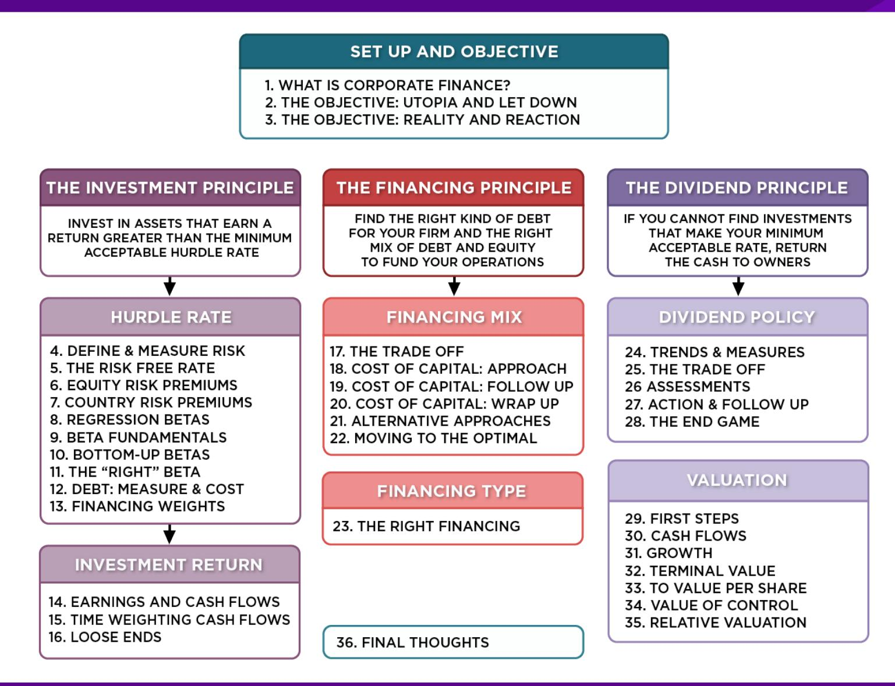
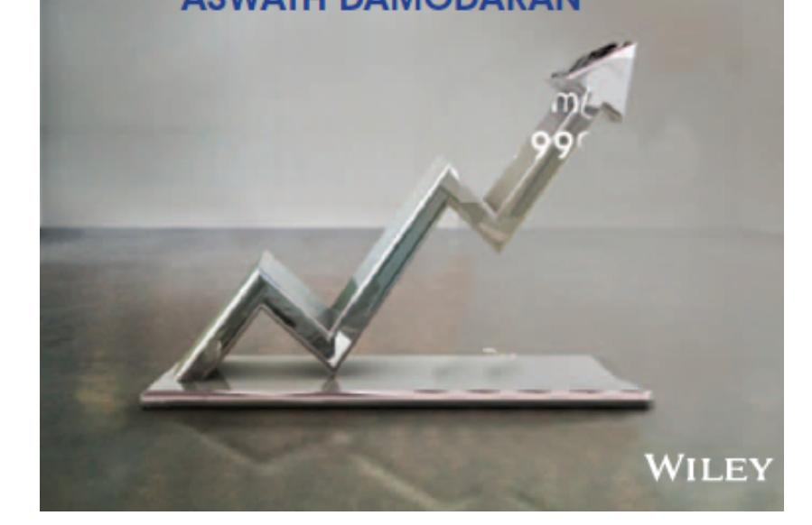

# **SESSION 21: ALTERNATIVE APPROACHES**

If you count the good stuff, you also have to count the bad stuff.

#### **SESSION 21: ALTERNATIVE APPROACHES**

# **I. THE APV APPROACH TO OPTIMAL CAPITAL STRUCTURE**

- In the adjusted present value approach, the value of the firm is written as the sum of the value of the firm without debt (the unlevered firm) and the effect of debt on firm value

Firm Value = Unlevered Firm Value + (Tax Benefits of Debt - Expected Bankruptcy Cost from the Debt)

- The optimal dollar debt level is the one that maximizes firm value

#### **IMPLEMENTING THE APV APPROACH**

- Step 1: Estimate the unlevered firm value. This can be done in one of two ways: o Estimating the unlevered beta, a cost of equity based upon the unlevered beta and valuing the firm using this cost of equity (which will also be the cost of capital, with an unlevered firm) o Alternatively, Unlevered Firm Value = Current Market Value of Firm - Tax Benefits of Debt (Current) + Expected Bankruptcy cost from Debt
- Step 2: Estimate the tax benefits at different levels of debt. The simplest assumption to make is that the savings are perpetual, in which case o Tax benefits = Dollar Debt \* Tax Rate
- Step 3: Estimate a probability of bankruptcy at each debt level, and multiply by the cost of bankruptcy (including both direct and indirect costs) to estimate the expected bankruptcy cost.

#### **ESTIMATING EXPECTED BANKRUPTCY COST**

- Probability of Bankruptcy o Estimate the synthetic rating that the firm will have at each level of debt o Estimate the probability that the firm will go bankrupt over time, at that level of debt (Use studies that have estimated the empirical probabilities of this occurring over time - Altman does an update every year)
- Cost of Bankruptcy o The direct bankruptcy cost is the easier component. It is generally between 5-10% of firm value, based upon empirical studies o The indirect bankruptcy cost is much tougher. It should be higher for sectors where operating income is affected significantly by default risk (like airlines) and lower for sectors where it is not (like groceries)

#### **RATINGS AND DEFAULT PROBABILITIES: RESULTS FROM ALTMAN STUDY OF BONDS**

RatingLikelihood of Default

AAA 0.07%

AA 0.51%

A+ 0.60%

A 0.66%

A- 2.50%

BBB 7.54%

BB 16.63%

B+ 25.00%

B 36.80%

B- 45.00%

CCC 59.01%

CC 70.00%

C 85.00%

Altman estimated these probabilities

by looking at bonds in each ratings

class ten years prior and then

examining the proportion of these

bonds that defaulted over the ten

years.

#### **DISNEY: ESTIMATING UNLEVERED FIRM VALUE**

Current Value of firm = \$121,878+ \$15,961 = \$ 137,839

- Tax Benefit on Current Debt = \$15,961 \* 0.361 = \$ 5,762

+ Expected Bankruptcy Cost = 0.66% \* (0.25 \* 137,839) = \$ 227

Unlevered Value of Firm = = \$ 132,304

o Cost of Bankruptcy for Disney = 25% of firm value o Probability of Bankruptcy = 0.66%, based on firm's current rating of A o Tax Rate = 36.1%

#### **DISNEY: APV AT DEBT RATIOS**

|            |           |          | Unlevered  |              |             | Probability of | Expected        | Value of     |
|------------|-----------|----------|------------|--------------|-------------|----------------|-----------------|--------------|
| Debt Ratio | \$ Debt   | Tax Rate |            |              |             |                |                 |              |
|            |           |          | Firm Value | Tax Benefits | Bond Rating |                | Bankruptcy Cost | Levered Firm |
| 0%         | \$0       | 36.10%   | \$132,304  | \$0          | AAA         | 0.07%          | \$23            | \$132,281    |
| 10%        | \$13,784  | 36.10%   | \$132,304  | \$4,976      | Aaa/AAA     | 0.07%          | \$24            | \$137,256    |
| 20%        | \$27,568  | 36.10%   | \$132,304  | \$9,952      | Aaa/AAA     | 0.07%          | \$25            | \$142,231    |
| 30%        | \$41,352  | 36.10%   | \$132,304  | \$14,928     | Aa2/AA      | 0.51%          | \$188           | \$147,045    |
| 40%        | \$55,136  | 36.10%   | \$132,304  | \$19,904     | A2/A        | 0.66%          | \$251           | \$151,957    |
| 50%        | \$68,919  | 36.10%   | \$132,304  | \$24,880     | B3/B-       | 45.00%         | \$17,683        | \$139,501    |
| 60%        | \$82,703  | 36.10%   | \$132,304  | \$29,856     | C2/C        | 59.01%         | \$23,923        | \$138,238    |
| 70%        | \$96,487  | 32.64%   | \$132,304  | \$31,491     | C2/C        | 59.01%         | \$24,164        | \$139,631    |
| 80%        | \$110,271 | 26.81%   | \$132,304  | \$29,563     | Ca2/CC      | 70.00%         | \$28,327        | \$133,540    |
| 90%        | \$124,055 | 22.03%   | \$132,304  | \$27,332     | Caa/CCC     | 85.00%         | \$33,923        | \$125,713    |

The optimal debt ratio is 40%, which is the point at which firm value is maximized.

# **II. RELATIVE ANALYSIS**

- The "safest" place for any firm to be is close to the industry average
- Subjective adjustments can be made to these averages to arrive at the right debt ratio. o Higher tax rates -> Higher debt ratios (Tax benefits) o Lower insider ownership -> Higher debt ratios (Greater discipline) o More stable income -> Higher debt ratios (Lower bankruptcy costs) o More intangible assets -> Lower debt ratios (More agency problems)

# **COMPARING TO INDUSTRY AVERAGES**

| Company | Book value | Debt to Capital Ratio Market value | Net Debt to Capital Ratio Book value | Market value | Comparable group                                   | Ratio Book value | Debt to Capital Market value | Ratio Book value | Net Debt to Capital Market value |
|---------|------------|------------------------------------|--------------------------------------|--------------|----------------------------------------------------|------------------|------------------------------|------------------|----------------------------------|
| Disney  | 22.88%     | 11.58%                             | 17.70%                               | 8.98%        | US                                                 |                  |                              |                  |                                  |
|         |            |                                    |                                      |              | Entertainment Global Diversified                   | 39.03%           | 15.44%                       | 24.92%           | 9.93%                            |
| Vale    | 39.02%     | 35.48%                             | 34.90%                               | 31.38%       |                                                    |                  |                              |                  |                                  |
| Tata    |            |                                    |                                      |              | Mining & Iron Ore (Market cap> \$1 b) Global Autos | 34.43%           | 26.03%                       | 26.01%           | 17.90%                           |
| Motors  | 58.51%     | 29.28%                             | 22.44%                               | 19.25%       |                                                    |                  |                              |                  |                                  |
|         |            |                                    |                                      |              | (Market Cap> \$1 b)                                | 35.96%           | 18.72%                       | 3.53%            | 0.17%                            |
| Baidu   | 32.93%     | 5.23%                              | 20.12%                               | 2.32%        | Global Online                                      |                  |                              |                  |                                  |
|         |            |                                    |                                      |              | Advertising                                        | 6.37%            | 1.83%                        | -27.13%          | -2.76%                           |

#### **GETTING PAST SIMPLE AVERAGES**

Step 1: Run a regression of debt ratios on the variables that you believe determine debt ratios in the sector. For example,

Debt Ratio = a + b (Tax rate) + c (Earnings Variability) + d (EBITDA/Firm Value)

Check this regression for statistical significance (t statistics) and predictive ability (R squared)

Step 2: Estimate the values of the proxies for the firm under consideration. Plugging into the cross sectional regression, we can obtain an estimate of predicted debt ratio.

Step 3: Compare the actual debt ratio to the predicted debt ratio.

#### **APPLYING THE REGRESSION METHODOLOGY: GLOBAL AUTO FIRMS**

- Using a sample of 56 global auto firms, we arrived at the following regression:

Debt to capital = 0.09 + 0.63 (Effective Tax Rate) + 1.01 (EBITDA/ Enterprise Value) - 0.93 (Cap Ex/ Enterprise Value)

- The R squared of the regression is 21%. This regression can be used to arrive at a predicted value for Tata Motors of:

Predicted Debt Ratio = 0.09 + 0.63 (0.252) +1.01 (0.1167) - 0.93 (0.1949) = .1854 or 18.54%

- Based upon the capital structure of other firms in the automobile industry, Tata Motors should have a market value debt ratio of 18.54%. It is over levered at its existing debt ratio of 29.28%.

#### **EXTENDING TO THE ENTIRE MARKET**

- Using 2014 data for US listed firms, we looked at the determinants of the market debt to capital ratio. The regression provides the following results

DFR = 0.27 - 0.24 ETR -0.10 g– 0.065 INST -0.338 CVOI+ 0.59 E/V

(15.79) (9.00) (2.71) (3.55) (3.10) (6.85)

DFR = Debt / ( Debt + Market Value of Equity)

ETR = Effective tax rate in most recent twelve months

INST = % of Shares held by institutions

CVOI = Std dev in OI in last 10 years/ Average OI in last 10 years

E/V = EBITDA/ (Market Value of Equity + Debt- Cash)

The regression has an **R-squared of 8%.**

# **APPLYING THE REGRESSION**

- Disney had the following values for these inputs in 2008. Estimate the optimal debt ratio using the debt regression.

ETR = 31.02%

Expected Revenue Growth = 6.45%

INST = 70.2%

CVOI = 0.0296

E/V = 9.35%

Optimal Debt Ratio

= 0.27 - 0.24 (.3102) -0.10 (.0645)– 0.065 (.702) -0.338 (.0296)+ 0.59 (.0935)

= 0.1886 or 18.86%

- What does this optimal debt ratio tell you?
- Why might it be different from the optimal calculated using the weighted average cost of capital?

# **SUMMARIZING THE OPTIMAL DEBT RATIOS…**

|                               | Disney | Vale Tata Motors Baidu |
|-------------------------------|--------|------------------------|
| Actual Debt Ratio Optimal     | 11.58% | 35.48% 29.28% 5.23%    |
| I. Operating income           | 35.00% | —                      |
| II. Standard Cost of capital  | 40.00% | 30.00% (actual)        |
|                               |        | 20.00% 10.00%          |
| III. Enhanced Cost of Capital | 40.00% | 30.00% (actual)        |
|                               |        | 10.00% 10.00%          |
| IV. APV V. Comparable         | 40.00% | 30.00% 20.00% 20.00%   |
| To industry                   | 28.54% | 26.03% 18.72% 1.83%    |
| To market                     | 18.86% | —                      |

## Applied Corporate Finance

#### **Task**

Relative to the sector in which your company operates, examine where it has too much or too little debt.

Optional: Read Chapter 8