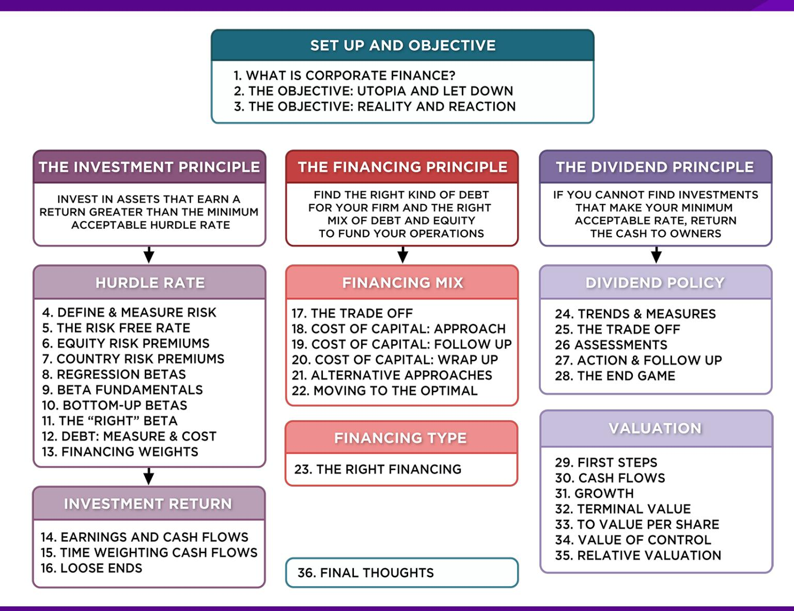
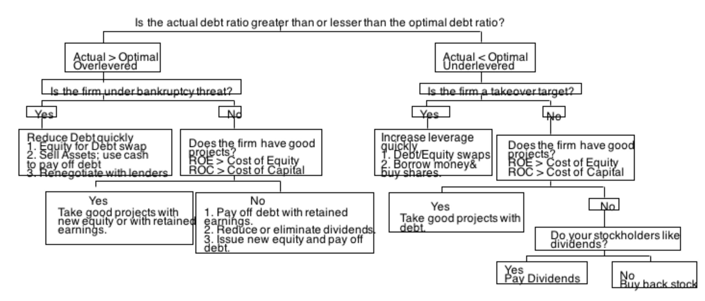
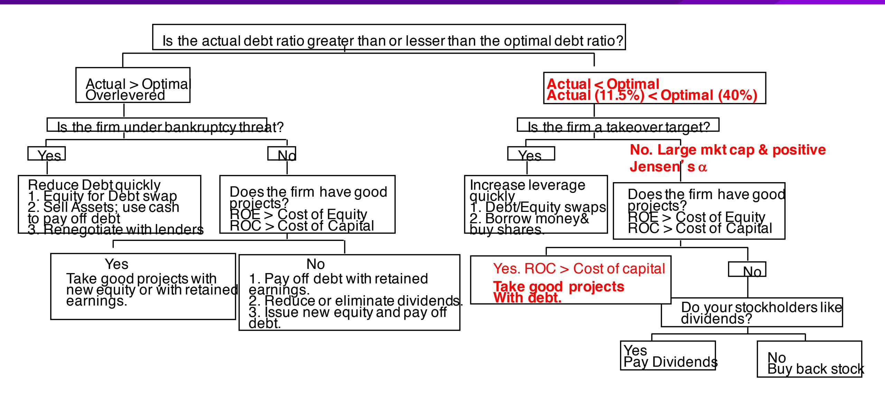
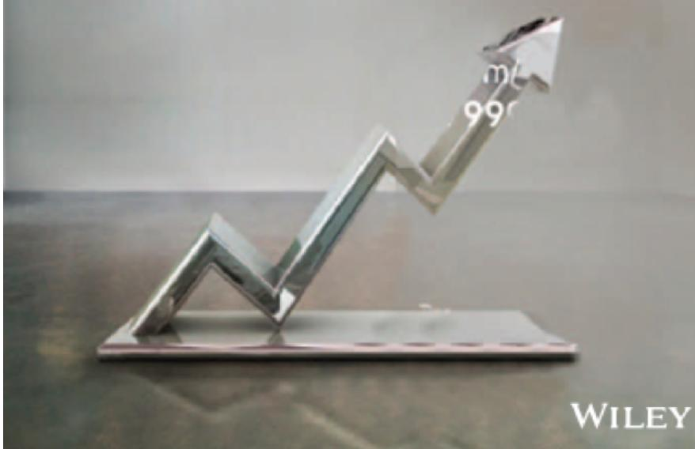

# **SESSION 22: MOVING TO THE OPTIMAL**

The pathway to the optimal ix can be rocky.

# **SESSION 22: MOVING TO THE OPTIMAL**

- At the end of the analysis of financing mix (using whatever tool(s) you choose to use), you can come to one of three conclusions: o The firm has the right financing mix o The firm has too little debt (it is under levered) o The firm has too much debt (it is over levered)
- The next step in the process is o Deciding how quickly or gradually the firm should move to its optimal o Assuming that it does, how should it move to its optimal, that is , a recapitalization or investments.

## **A FRAMEWORK FOR GETTING TO THE OPTIMAL**

### **DISNEY: APPLYING THE FRAMEWORK**

# 6 **APPLICATION TEST: GETTING TO THE OPTIMAL**

- Based upon your analysis of both the firm's capital structure and investment record, what path would you map out for the firm?
  - a. Immediate change in leverage
  - b. Gradual change in leverage
  - c. No change in leverage
- Would you recommend that the firm change its financing mix by
  - a. Paying off debt/buying back equity
  - b. Take projects with equity/debt

## Applied Corporate Finance

Optional: Read Chapter 9

**Task** If your firm's actual debt ratio is different from its optimal, evaluate how quickly it has to act and what the best course of action is.

