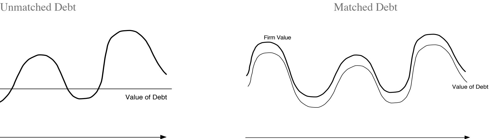
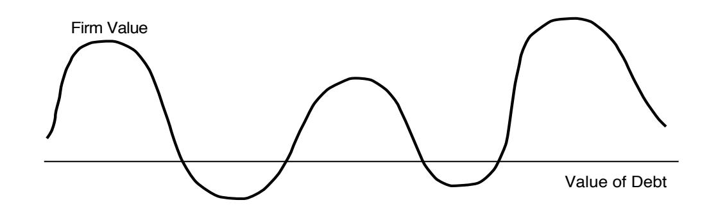
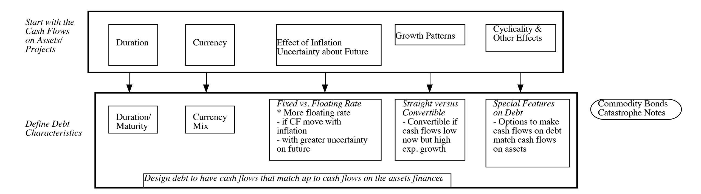
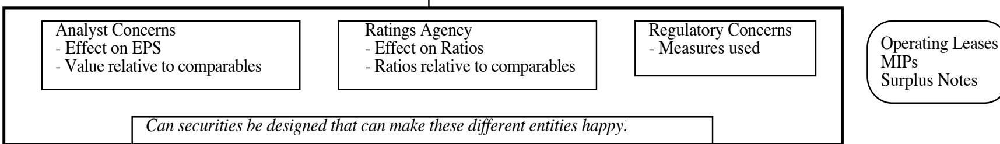
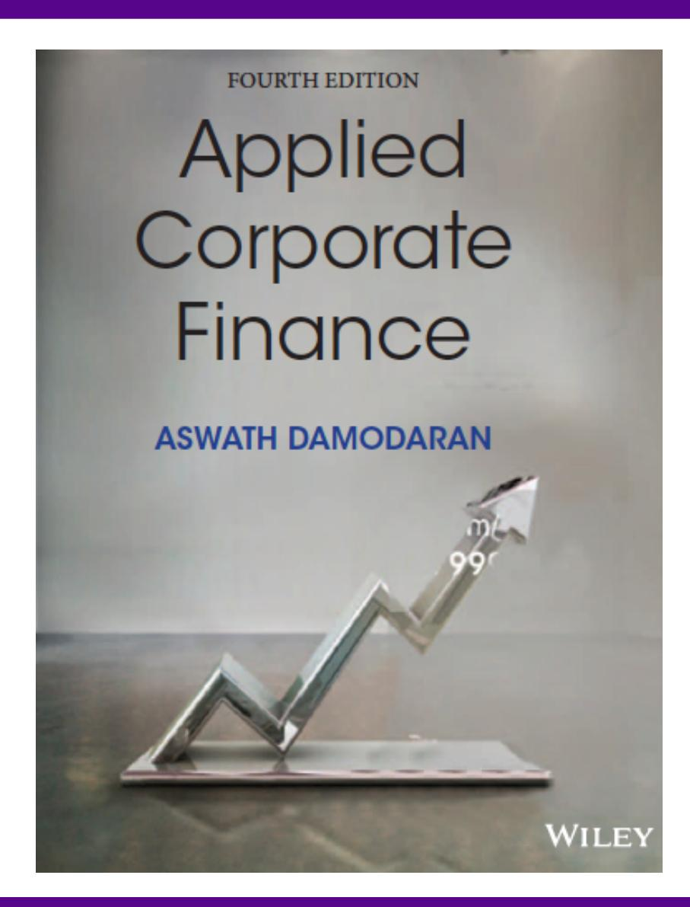

# **SESSION 23: THE RIGHT FINANCING**

The perfect financing for you. Yes, It exists!

#### **SESSION 23: THE RIGHT FINANCING**

# **DESIGNING DEBT: THE FUNDAMENTAL PRINCIPLE**

- The objective in designing debt is to make the cash flows on debt match up as closely as possible with the cash flows that the firm makes on its assets.
- By doing so, we reduce our risk of default, increase debt capacity and increase firm value.

## **DESIGN THE PERFECT FINANCING INSTRUMENT**

- The perfect financing instrument will o Have all of the tax advantages of debt o While preserving the flexibility offered by equity

#### **ENSURING THAT YOU HAVE NOT CROSSED THE LINE DRAWN BY THE TAX CODE**

- All of this design work is lost, however, if the security that you have designed does not deliver the tax benefits.
- In addition, there may be a trade off between mismatching debt and getting greater tax benefits.

*Overlay tax preferences*

#### **WHILE KEEPING EQUITY RESEARCH ANALYSTS, RATINGS AGENCIES AND REGULATORS APPLAUDING**

- Ratings agencies want companies to issue equity, since it makes them safer.
- Equity research analysts want them not to issue equity because it dilutes earnings per share.
- Regulatory authorities want to ensure that you meet their requirements in terms of capital ratios (usually book value). Financing that leaves all three groups happy is nirvana.

*Consider ratings agency & analyst concerns*

# **DEBT OR EQUITY: THE STRANGE CASE OF TRUST PREFERRED**

- Trust preferred stock has o A fixed dividend payment, specified at the time of the issue o That is tax deductible o And failing to make the payment can give preferred stockholders voting rights.
- When trust preferred was first created, ratings agencies treated it as equity. As they have become more savvy, ratings agencies have started giving firms only partial equity credit for trust preferred.
- Assuming that trust preferred stock gets treated as equity by ratings agencies, which of the following firms is the most appropriate firm to be issuing it? o A firm that is under levered, but has a rating constraint that would be violated if it moved to its optimal o A firm that is over levered that is unable to issue debt because of the rating agency concerns.

# **SOOTHE BONDHOLDER FEARS**

- There are some firms that face skepticism from bondholders when they go out to raise debt, because o Of their past history of defaults or other actions o They are small firms without any borrowing history
- Bondholders tend to demand much higher interest rates from these firms to reflect these concerns.

#### **AND DO NOT LOCK IN MARKET MISTAKES THAT WORK AGAINST YOU**

- Ratings agencies can sometimes under rate a firm, and markets can underprice a firm's stock or bonds. If this occurs, firms should not lock in these mistakes by issuing securities for the long term. In particular, o Issuing equity or equity based products (including convertibles), when equity is under priced transfers wealth from existing stockholders to the new stockholders o Issuing long term debt when a firm is under rated locks in rates at levels that are far too high, given the firm's default risk.
- What is the solution o if you need to use equity? o if you need to use debt?

# **DESIGNING DISNEY**'**S DEBT**

| Business       | Project Cash Flow Characteristics                                                      |    | Type of Financing        |
|----------------|----------------------------------------------------------------------------------------|----|--------------------------|
|                |                                                                                        | 1. | Short-term               |
|                |                                                                                        | 2. | Primarily dollar         |
|                |                                                                                        | 3. | If possible, tied to the |
| Media networks | Projects are likely to be                                                              |    |                          |
|                |                                                                                        | 1. | Short-term               |
|                |                                                                                        | 2. | Primarily dollar debt    |
|                |                                                                                        | 3. | If possible, linked to   |
| Park resorts   | Projects are likely to be                                                              |    |                          |
|                | 1. Very long-term                                                                      |    |                          |
|                | 2. Currency will be a function of the region (rather than country) where park is       |    |                          |
|                | 3. Affected by success of studio entertainment and media networks divisions            |    |                          |
|                |                                                                                        | 1. | Long-term                |
|                |                                                                                        | 2. | Mix of currencies, based |
|                | Projects are likely to be short- to medium-term and linked to the success of the       |    |                          |
|                |                                                                                        | 1. | Medium-term              |
|                |                                                                                        | 2. | Dollar debt              |
| Interactive    | Projects are likely to be short-term, with high growth potential and significant risk. |    |                          |

# **RECOMMENDATIONS FOR DISNEY**

- The debt issued should be long term and should have duration of about 4 to 5 years.
- A significant portion of the debt should be floating rate debt, reflecting Disney's capacity to pass inflation through to its customers and the fact that operating income tends to increase as interest rates go up.
- Given Disney's sensitivity to a stronger dollar, a portion of the debt should be in foreign currencies. The specific currency used and the magnitude of the foreign currency debt should reflect where Disney makes its revenues. Based upon 2013 numbers at least, this would indicate that about 18% of its debt should be foreign currency debt. As its broadcasting businesses expand into Latin America, it may want to consider using either Mexican Peso or Brazilian Real debt as well.

# **ANALYZING DISNEY**'**S CURRENT DEBT**

- Disney has \$14.3 billion in interest-bearing debt with a face-value weighted average maturity of 7.92 years. Allowing for the fact that the maturity of debt is higher than the duration, this would indicate that Disney's debt may be a little longer than would be optimal, but not by much.
- Of the debt, about 5.49% of the debt is in non-US dollar currencies (Indian rupees and Hong Kong dollars), but the rest is in US dollars and the company has no Euro debt. Based on our analysis, we would suggest that Disney increase its proportion of Euro debt to about 12% and tie the choice of currency on future debt issues to its expansion plans.
- Disney has no convertible debt and about 5.67% of its debt is floating rate debt, which looks low, given the company's pricing power. While the mix of debt in 2013 may be reflective of a desire to lock in low long-term interest rates on debt, as rates rise, the company should consider expanding its use of foreign currency debt.

# **ADJUSTING DEBT AT DISNEY**

- It can swap some of its existing fixed rate, dollar debt for floating rate, foreign currency debt. Given Disney's standing in financial markets and its large market capitalization, this should not be difficult to do.
- If Disney is planning new debt issues, either to get to a higher debt ratio or to fund new investments, it can use primarily floating rate, foreign currency debt to fund these new investments. Although it may be mismatching the funding on these investments, its debt matching will become better at the company level.

# **DEBT DESIGN FOR BOOKSCAPE & VALE**

- *Bookscape:* Given Bookscape's dependence on revenues at its New York bookstore, we would design the debt to be

Recommendation: Long-term, dollar denominated, fixed rate debt

Actual: Long term operating lease on the store

- *Vale:* Vale's mines are spread around the world, and it generates a large portion of its revenues in China (37%). Its mines typically have very long lives and require large up-front investments, and the costs are usually in the local currencies but its revenues are in US dollars. •Recommendation: Long term, dollar-denominated debt (with hedging of local currency risk exposure) and if possible, tied to commodity prices. •Actual: The existing debt at Vale is primarily US dollar debt (65.48%), with an average maturity of 14.70 years. All of the debt, as far as we can assess, is fixed rate and there is no commodity-linked debt.

# **AND FOR TATA MOTORS AND BAIDU**

- *Tata Motors*: As an manufacturing firm, with big chunks of its of its revenues coming from India and China (about 24% apiece) and the rest spread across developed markets. o Recommendation: Medium to long term, fixed rate debt in a mix of currencies reflecting operations. o Actual: The existing debt at Tata Motors is a mix of Indian rupee debt (about 71%) and Euro debt (about 29%), with an average maturity of 5.33 years and it is almost entirely fixed rate debt.
- *Baidu:* Baidu has relatively little debt at the moment, reflecting its status as a young, technology company. o Recommendation: Convertible, Chinese Yuan debt. o Actual: About 82% of Baidu's debt is in US dollars and Euros currently, with an average maturity of 5.80 years. A small portion is floating rate debt, but very little of the debt is convertible.

# 6 **APPLICATION TEST: CHOOSING YOUR FINANCING TYPE**

- Based upon the business that your firm is in, and the typical investments that it makes, what kind of financing would you expect your firm to use in terms of
  - a) Duration (long term or short term)
  - b) Currency
  - c) Fixed or Floating rate
  - d) Straight or Convertible

**Task** Determine the right type of financing for your firm, given its characteristics

**Optional: Read Chapter 9**