# **SESSION 24: TRENDS & MEASURES**

Dividends are sticky.

## **SESSION 24: TRENDS & MEASURES**

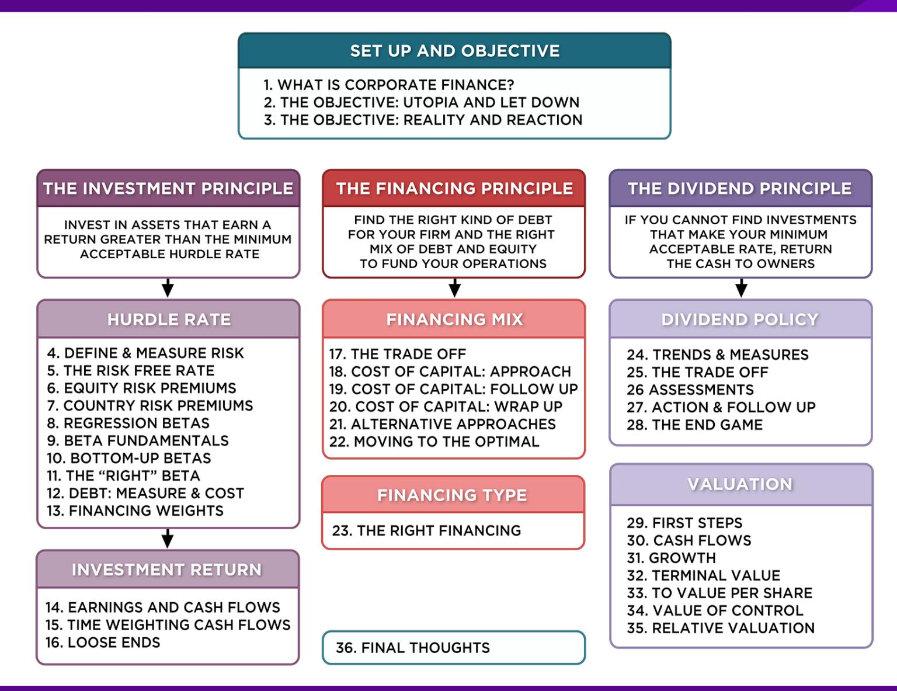

## **FIRST PRINCIPLES**

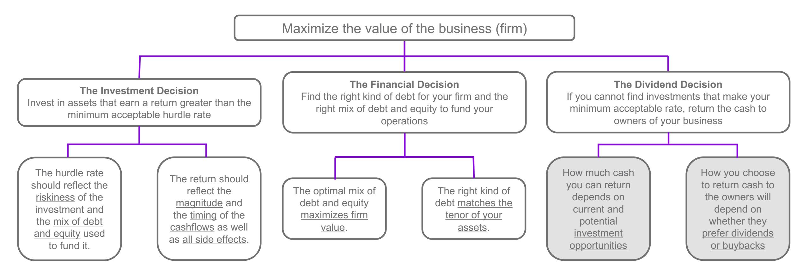

## **STEPS TO THE DIVIDEND DECISION . . .**

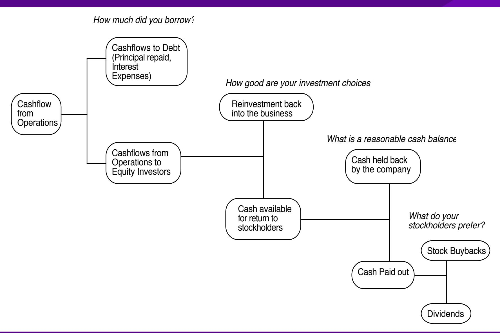

## **I. DIVIDENDS ARE STICKY**

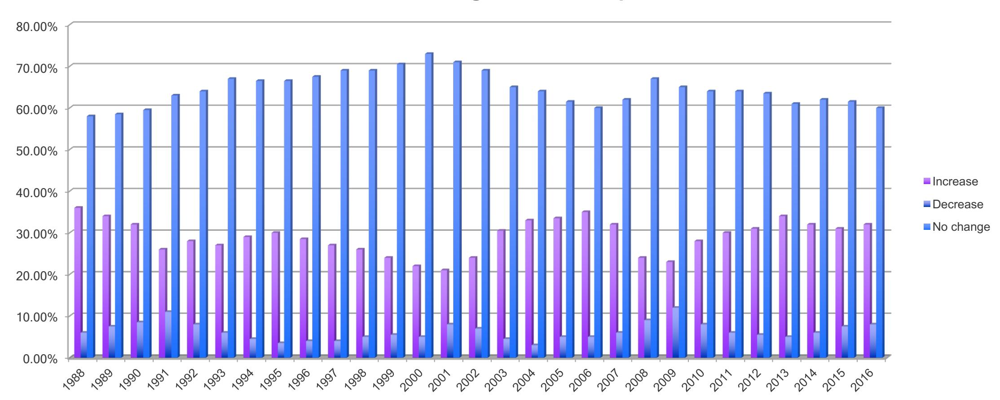

**Dividend Changes at US companies**

## **II. DIVIDENDS TEND TO FOLLOW EARNINGS**

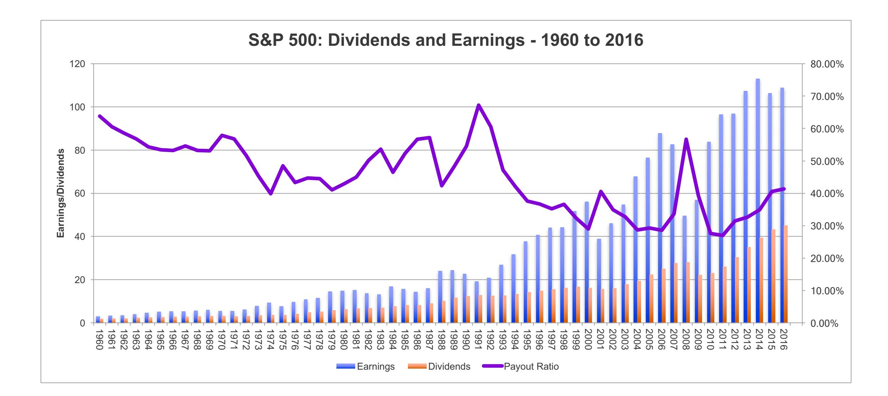

## **III. DIVIDENDS ARE AFFECTED BY TAX LAWS**

**In the last quarter of 2012**

- As the possibility of tax rates reverting to pre-2003 levels rose, 233 companies paid out \$31 billion in dividends.
- Of these companies, 101 had insider holdings in excess of 20% of the outstanding stock.

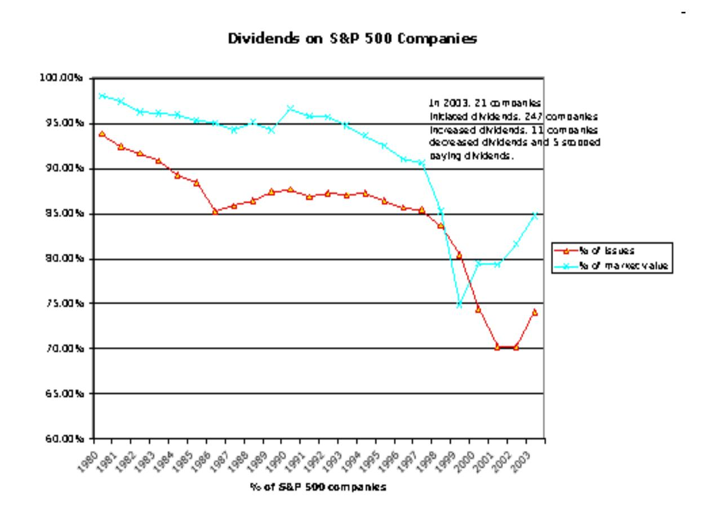

## **In 2003**

### **IV. MORE AND MORE FIRMS ARE BUYING BACK STOCK, RATHER THAN PAY DIVIDENDS**

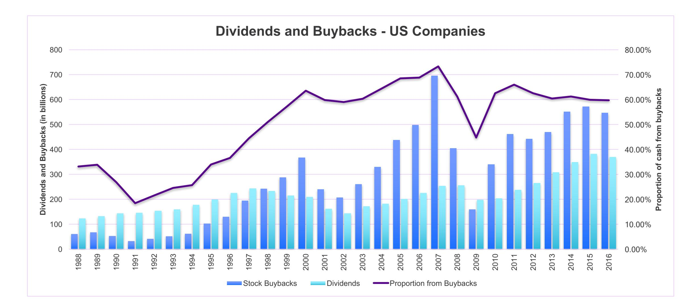

# V. AND THERE ARE DIFFERENCES ACROSS COUNTRIES ...

Figure 10.9: Dividend Payout Ratios - G7 Countries

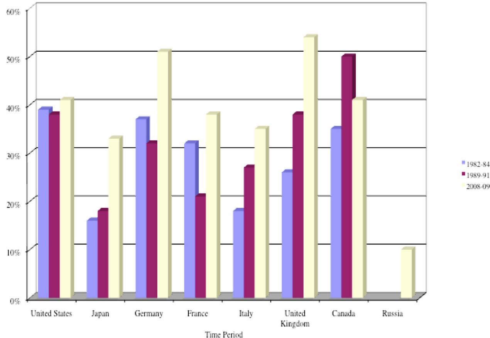

## **MEASURES OF DIVIDEND POLICY**

- Dividend Payout = Dividends / Net Income o Measures the percentage of earnings that the company pays in dividends o If the net income is negative, the payout ratio cannot be computed
- Dividend Yield = Dividends per share / Stock price o Measures the return than an investor can make from dividends alone o Becomes part of the expected return on the investment

B DES Page 3 PB Page 41-43

## **DIVIDEND PAYOUT RATIOS**

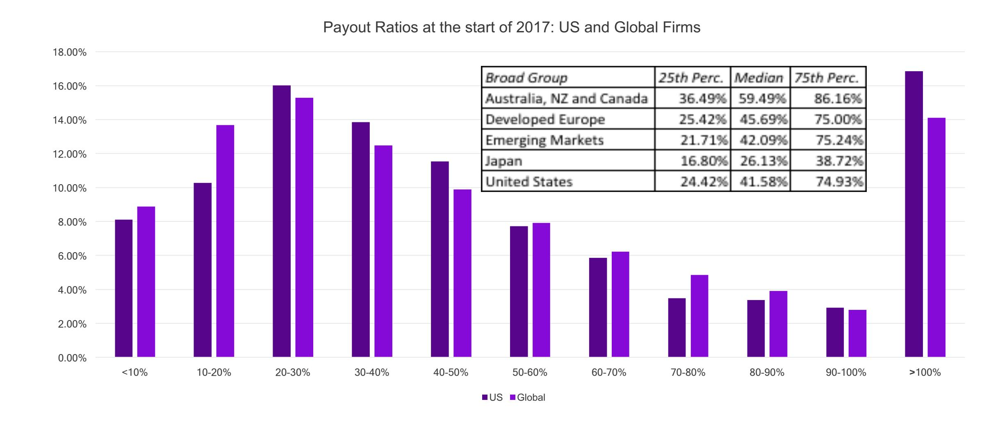

## **DIVIDEND YIELDS**

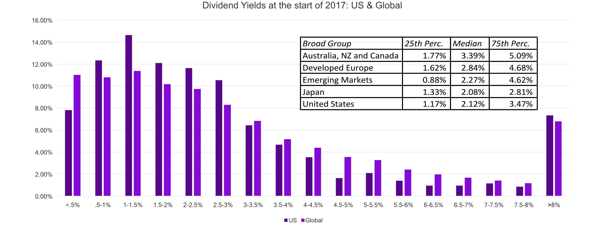

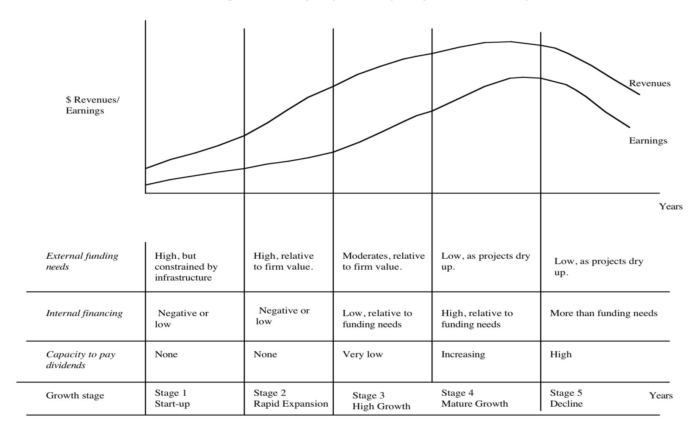

## **DIVIDEND YIELDS AND PAYOUT RATIOS: GROWTH CLASSES**

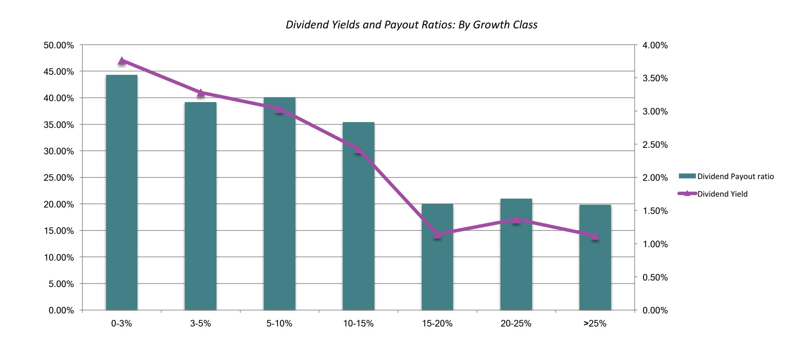

## **DIVIDEND POLICY: DISNEY ET AL.**

|                         |                | Disney | Vale    | Tata Motors | Baidu | Deutsche Bank |
|-------------------------|----------------|--------|---------|-------------|-------|---------------|
| Dividend Yield -        | Last 12 months | 1.09%  | 6.56%   | 1.31%       | 0.00% | 1.96%         |
| Dividend Payout ratio - | Last 12 months | 21.58% | 113.45% | 16.09%      | 0.00% | 362.63%       |
| Dividend Yield -        | 2008-2012      | 1.17%  | 4.01%   | 1.82%       | 0.00% | 3.14%         |
| Dividend Payout -       | 2008-2012      | 17.11% | 37.69%  | 15.53%      | 0.00% | 37.39%        |

## Applied Corporate Finance

Optional: Read Chapter 10

### **Task**

Evaluate how much your company has paid out in dividends, relative to earnings, and market cap

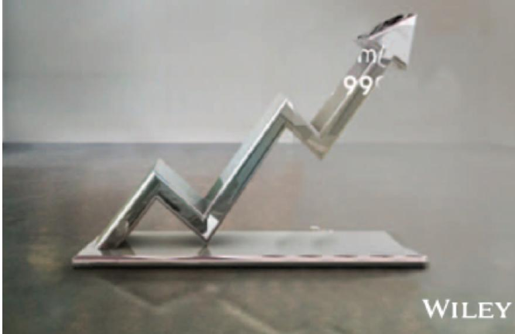