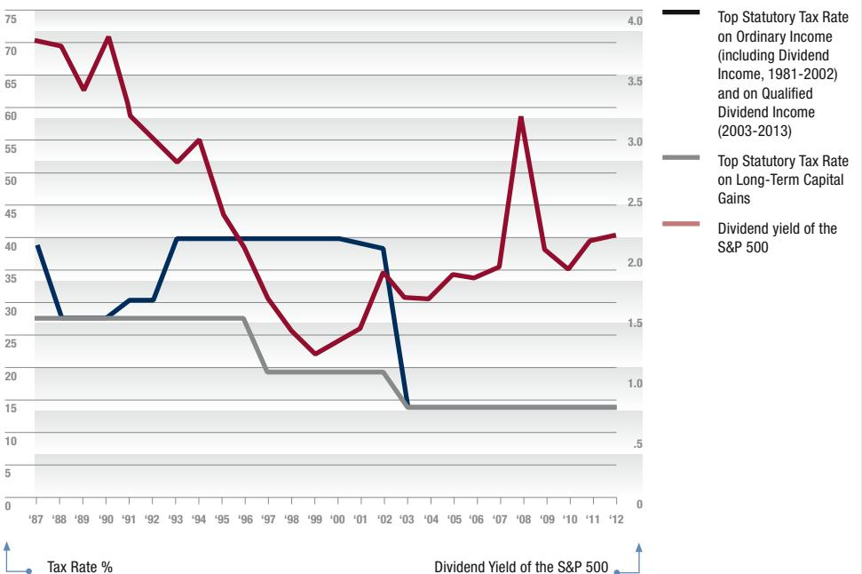

# ISSUE BRIEF

NOVEMBER 2013

PUBLICPOLICY.WHARTON.UPENN.EDU

VOLUME 1, NUMBER 10

## TAX POLICY AND THE DIVIDEND CLIENTELE EFFECT

LAURA KAWANO

In January of 2003, with the economy sagging and the need for some sort of stimulus becoming a pressing issue, the Administration of President George W. Bush proposed a package of tax cuts that would reduce personal taxes, provide a \$400-per-child rebate to most families, and increase the rate at which certain businesses could depreciate equipment, so as to stimulate small business.

“We cannot be satisfied until every part of our economy is healthy and vigorous,” Bush said. “We will not rest until every business has a chance to grow and every person who wants to find work can find a job.”1

The centerpiece of the Jobs and Growth Tax Relief Reconciliation Act of 2003 (JGTRRA)—passed by Congress and signed into law by President Bush six months after he proposed it—was a vast reduction in taxes on investment income. Long-term capital gains tax rates were cut, and dividend income was now to be taxed at the same rates as long-term capital gains (rather than being taxed as ordinary income). The act, which built upon the 2001 Bush tax cuts, was hailed by Republicans

as a way of bringing immediate benefit to the middle class, though Democrats were more than skeptical. New York Representative Charles B. Rangel termed it “an assault on the middle-class to the benefit of the wealthy.”2

The aggregate effect of JGTRRA on the overall economy remains debated. But the second set of Bush tax cuts—aspects of which were made permanent during the Obama Administration—had a large effect on individuals’ portfolio choices. High-income investors substantially increased the dividend yields on their equity portfolios, according to a study I undertook on the impact of changes in dividend and capital gains tax rates brought about by JGTRRA.

### ABOUT THE AUTHOR

**Laura Kawano, PhD**

*Visiting Assistant Professor of Business Economics and Public Policy, The Wharton School*

Dr. Laura Kawano is a Visiting Assistant Professor in the Business Economics and Public Policy Department at the Wharton School of the University of Pennsylvania for the Fall 2013 semester. She is a financial economist in the Business and International Tax Division in the Office of Tax Analysis at the U.S. Department of the Treasury.

Dr. Kawano’s research focuses on the impacts of tax policy on individual and firm choices. She has written on capital income taxes, taxes on high-income individuals, corporate income taxes, and whether taxpayers understand the tax system. She also studies the effects of unemployment and natural disasters on household income.

Dr. Kawano received her BA in Economics from Occidental College in 2002, and her PhD in Economics from the University of Michigan in 2010. She previously worked at the Federal Reserve Board of Governors.

This behavior on the part of wealthy investors carries important implications for tax policy—especially now, as tax reform has become a widely-discussed issue. My research on the effects of JGTRRA shows that investors respond to shifts in tax policy to reduce their tax burdens. Such behaviors should be taken into account by policymakers seeking to redress the nation's fiscal deficit by changing tax rates on capital income.3

## POLICY CHANGES UNDER JGTRRA

In the U.S., dividends generally have been taxed at a higher rate than long-term capital gains. Due to the progressivity of the tax system, this tax disadvantage of dividends—the gap between the tax rates on dividends and those on long-term capital gains—has increased with income. The difference between the dividend tax rate and the long-term capital gains tax rate has been greatest for people in the highest tax bracket.

Previous studies have shown that an investor's optimal portfolio is a function of the difference between dividend and capital gains tax rates; for a given level of expected returns, portfolio dividend yields increase as the relative tax disadvantage of dividends falls. Before the passage of JGTRRA, therefore, high-income individuals had a particularly strong incentive to select stocks based on dividend payouts because of their tax implications, avoiding those with high dividend yields, and investing instead in those that would deliver returns in the form of long-term capital gains.

JGTRRA changed this calculation. With the new legislation, the top marginal tax rate on long-term capital gains fell from 20 percent to 15 percent, while the 10 percent rate for lower-income taxpayers fell to 5 percent (and then to zero percent in 2008). Also, new qualified dividends now were taxed in the same way as capital gains (rather than at the traditional ordinary-income marginal tax rates).

In sum, the top marginal rate for dividends fell from 35 percent to 15 percent, and, for lower-income taxpayers, from 10 percent to 5 percent. The change extended across dividends from directly owned equities, as well as those owned through a mutual fund, partnership, real estate investment trust or common trust fund. This was a remarkable break with past tax policy. For decades prior to 2003, the long-term capital gains tax rate had been much lower than the ordinary income rate (except for a brief period after the Tax Reform Act of 1986, when dividends and capital gains were both taxed at 28 percent).

**FIGURE 1: TOP TAX RATES AND DIVIDEND YIELDS 1987-2012**

## DIVIDEND CLIENTELES

This change in dividend tax rates provides a rare opportunity to test the "dividend clientele hypothesis," the idea that investors sort into "clienteles" based on dividend payouts. Some have preferences for stocks that pay dividends while others prefer stocks whose expected returns come in the form of capital gains when the tax disadvantage of dividends varies across investors. To study the impact of these tax rate changes on equity portfolio choices, I used data from before and after JGTRRA to estimate the relationship between the dividend yield on a household's equity portfolio and the gap between dividend and long-term capital gains rates.

The data come from the Surveys of Consumer Finances (SCF) from 2001, 2004 and 2007. The SCF is a triennial survey conducted by the Federal Reserve Board of Governors; each survey samples about 4,500 households. An advantage of using the SCF for my analysis is that it provides detailed information on household investments and allows for accurate marginal tax rate calculations. Also included is information that allows me to control for other, non-tax-related factors that can influence portfolio choices, such as age, marital status, household size, educational attainment, risk preferences, and optimism about the future of the economy.

1 New York Times, January 8, 2003, <http://www.ny-times.com/2003/01/08/us/politics-economy-over-view-bush-unveils-plan-cut-tax-rates-spur-economy.html?pagewanted=all&src=pm>.  
2 Ibid.  
3 This brief is based on Laura Kawano, "The Dividend Clientele Hypothesis: Evidence from the 2003 Tax

Act," American Economic Journal: Economic Policy, February 2014, [http://papers.ssrn.com/sol3/papers.cfm?abstract\\_id=1668158](http://papers.ssrn.com/sol3/papers.cfm?abstract_id=1668158).  
4 Raj Chetty and Emmanuel Saez, "Dividend Taxes and Corporate Behavior: Evidence from the 2003 Dividend Tax Cut," Quarterly Journal of Economics 120 (3): 791-833.

Timing was important to my analysis, especially since people's expectations influence their decisions. Capital income tax cuts were not part of Bush's 2000 campaign platform. In fact, reductions in dividend tax rates were not seriously discussed until the end of 2002, just before Bush unveiled plans for his second tax cut in an address at the Economic Club of Chicago. The data from the 2001 SCF survey, derived from equity holdings in 2000, therefore are not at all affected by JGTRRA, or even by any anticipation that legislation like JGTRRA was on the horizon. By 2003, though, it was clear that dividends probably would be taxed at a lower rate. The 2004 and 2007 SCF surveys include dividend receipts from 2003 and 2006, respectively—both of which were affected by the 2003 act. A comparison of the data from these years can help shed light on the impact of the new tax rates.

JGTRRA—the provisions of which were made retroactive to January of 2003—represented a major policy shift, and the investor response was dramatic. Following the reduction in the tax disadvantage of dividends, investors did in fact gravitate toward dividend-paying investments. By closing the gap between tax rates on dividends and long-term capital gains, dividend income became more attractive for all investors—but especially for high-income investors who previously had faced the highest tax rates on dividends.

When dividends and capital gains became taxed similarly, the tax-based incentives for selecting stocks on the basis of dividend yields were dampened. In the same way that consumers contemplating a big purchase often choose to drive to another, sales-tax-free state to do their shopping, so did high-income investors seek and find alternatives that were in their best financial interest.

I estimated that because of the JGTRRA tax rate changes, households in the top bracket increased their portfolio dividend yields by 23 percent between 2001 and 2004. This increase is 13 percent

higher than the increase experienced by those households one bracket below. Longer term, the increase for households in the top tax bracket was even larger—a 35 percent increase in dividend yields, or almost 18 percent more than those one bracket below. These responses provide strong evidence for the dividend clientele hypothesis. That is, the differential tax treatment of dividends and capital gains caused a significant degree of investment sorting.

At the same time, firms also responded to the tax changes of 2003, increasing their dividend payments in response to JGTRRA. According to research by Raj Chetty of Harvard University and Emmanuel Saez

**“If policymakers ignore dividend clientele effects, their estimates of the revenue that will be generated by changes in capital tax rates will be off-base.”**

of the University of California, Berkeley, JGTRRA “indeed raised dividend payments significantly, and in particular induced many firms to initiate dividend payments.” Chetty and Saez find that, following a continuous decline in dividend payments during two decades, total regular dividends since 2003 have grown by nearly 20 percent.4

There is also some evidence that dividends were initiated at firms at which executive compensation was tied to stocks, so executives who could gain from the introduction of the new tax rates were the ones who ushered in the increases in dividends. Perhaps most notably, Microsoft, after long resisting calls to pay dividends, began a dividend payout for the first time—at rates that have grown since the initial dividend payout.

As a result, part of the portfolio adjustments that I estimated could have reflected

changes to dividend policies for stocks that were already held. Regardless, because individuals were able to respond to these firm changes in payout policies, the tax effects that I estimated can still be interpreted as reflecting investor choices.

Nevertheless, it is an important question to consider how much of the increase could be attributed to active portfolio shifts. To help sort out this question, I constructed hypothetical portfolios from stock market data for households in each tax bracket that matched observed portfolio dividend yields in the 2001 SCF. The increase in yields for these proxy portfolios for high-income households was only a portion of the estimated effect of the tax changes. This suggests that active decision-making accounted for a significant share of the tax effect.

Was investor response to the 2003 act temporary or permanent? Data measuring differences between 2001 and 2004, and then 2001 and 2007, are similar, suggesting a longer-term shift toward higher dividend yields. Under the Obama administration, the new tax rates were extended through 2010, and then again through the end of 2012. More recently, the provisions of JGTRRA eliminating the difference in the way capital gains and dividend income are taxed were made permanent. (For individuals in the highest tax bracket, the tax rate went back up to 20 percent.) These policy changes permanently reduced incentives to sort into dividend clienteles on the basis of tax considerations.

## POLICY IMPLICATIONS

The investor responses to JGTRRA provide telling lessons as the nation considers different proposals to reduce its long-term deficit. Moving forward, policymakers will have to seriously consider options that either reduce expenditures, increase revenue from taxes, or, as is most likely, a mixture of the two. Both Democrats and Republicans have signaled a desire to consider fundamental tax reform,

and changes to how capital income is taxed could be in the mix.

It is important to understand investor behavior as policymakers consider future tax reform options. If investment income tax rates increase, knowing how investors are likely to react is key to forecasting the tax revenue implications of such policies. All other things being equal, taxing capital income more heavily will increase the tax burden of high-income taxpayers. However, my research, and the research conducted by others, indicates that investors have shown both a sophisticated awareness of tax policy and a willingness to adjust portfolio positions to reduce their tax burdens. The evidence strongly suggests a dividend clientele hypothesis at work: investors respond to changes in tax policy, rationally seek the highest after-tax return, and actively steer their portfolios accordingly.

Behavioral responses like the clientele effect carry important consequences for the impacts of tax policy on the distribution of tax burdens, especially as equity holdings have historically been concentrated in the upper tail of income distribution. Moreover, if policymakers ignore dividend clientele effects, their estimates of the revenue that will be generated by changes in capital tax rates will be off-base. Policymakers will need to build a proper appreciation of investor behavior, particularly among affluent households, into their thinking about any tax reform proposal affecting capital income.

*The views expressed in this paper are those of the author and do not necessarily reflect the policy of the U.S. Department of the Treasury.*

### BRIEF IN BRIEF

- • The Jobs and Growth Tax Relief Reconciliation Act of 2003 (JGTRRA) significantly changed tax policy by cutting long-term capital gains tax rates and taxing dividend income at the same rates as long-term capital gains.
- • Following the reduction in the tax disadvantage of dividends, investors gravitated toward dividend-paying investments—especially high-income investors who previously had faced the highest tax rates on dividends.
- • The behavior of investors before and after the passage of JGTRRA suggests that they divide into “clienteles” based on dividend payouts when the tax disadvantage of dividends varies across investors.
- • Policymakers therefore need to build a proper appreciation of investor behavior, particularly among affluent households, into their thinking about any tax reform proposal affecting capital income. If dividend clientele effects are ignored, estimates of the revenue that can generated by changes in capital tax rates will be off-base.

Founded in 1881 as the first collegiate business school, the Wharton School of the University of Pennsylvania is recognized globally for intellectual leadership and ongoing innovation across every major discipline of business education. With a broad global community and one of the most published business school faculties, Wharton creates economic and social value around the world.

KNOWLEDGE FOR POLICY IMPACT

#### ABOUT THE PENN WHARTON PUBLIC POLICY INITIATIVE

The Penn Wharton Public Policy Initiative (PPI) is a hub for research and education, engaging faculty and students across University of Pennsylvania and reaching government decision-makers through independent, practical, timely, and nonpartisan policy briefs. With offices both at Penn and in Washington, DC, the initiative provides comprehensive research, coverage, and analysis, anticipating key policy issues on the horizon. Penn Wharton PPI is led by Faculty Director Mark Duggan, the Rowan Family Foundation Professor and Chair of Business Economics and Public Policy, and Professor of Health Care Management at Wharton.

#### ABOUT PENN WHARTON PPI ISSUE BRIEFS

Penn Wharton PPI publishes issue briefs at least once a month, tackling issues that are varied but share one common thread: they are central to the economic health of the nation and the American people. These Issue Briefs are nonpartisan, knowledge-driven documents written by Wharton and Penn faculty in their specific areas of expertise.

For additional copies, please visit the Penn Wharton PPI website at [publicpolicy.wharton.upenn.edu](http://publicpolicy.wharton.upenn.edu).

