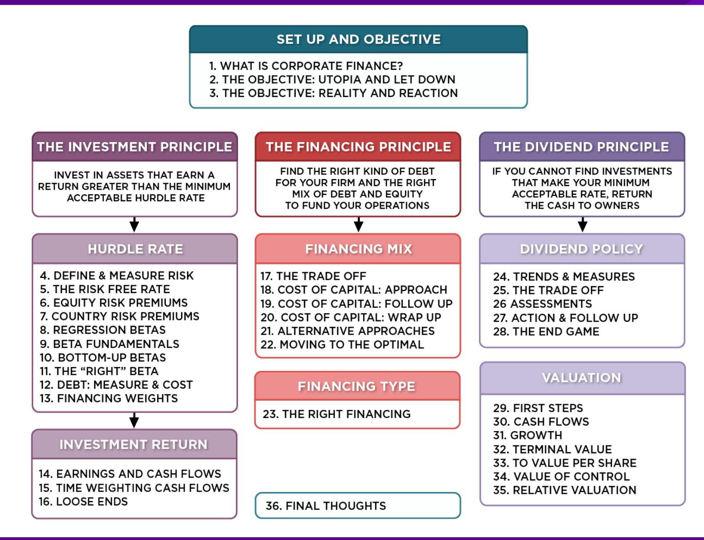
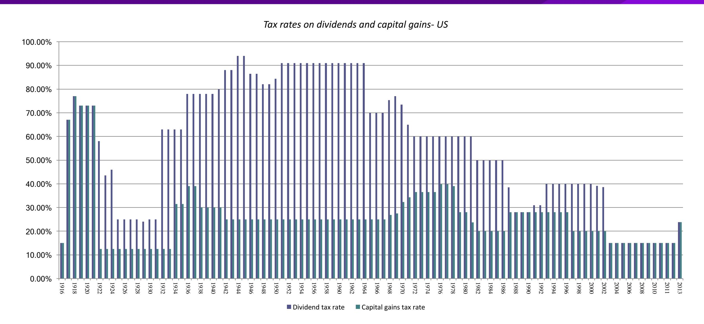
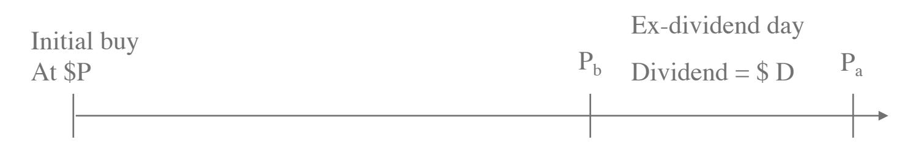
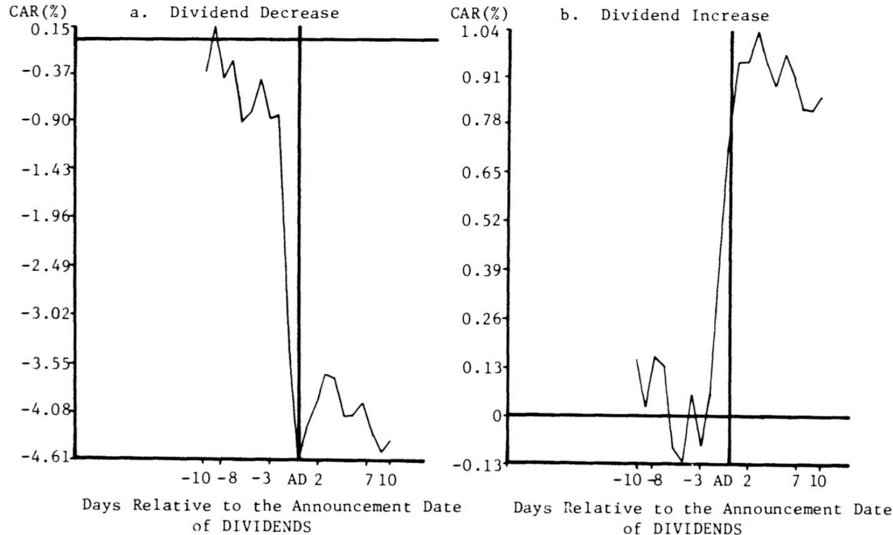
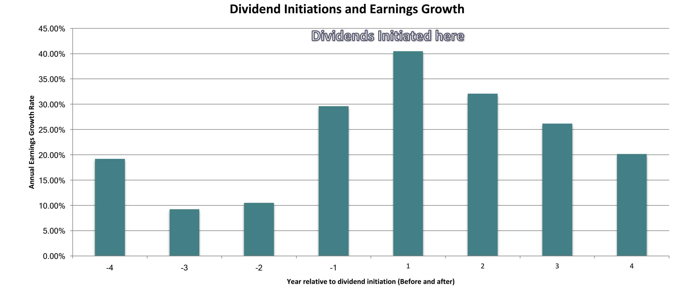
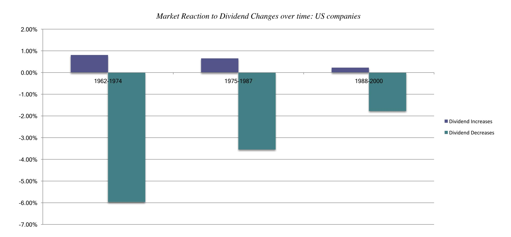
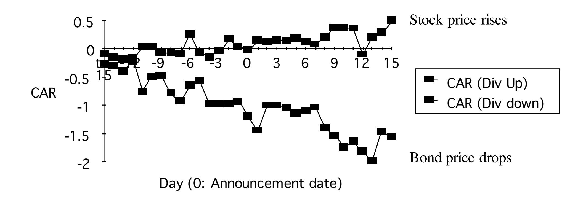
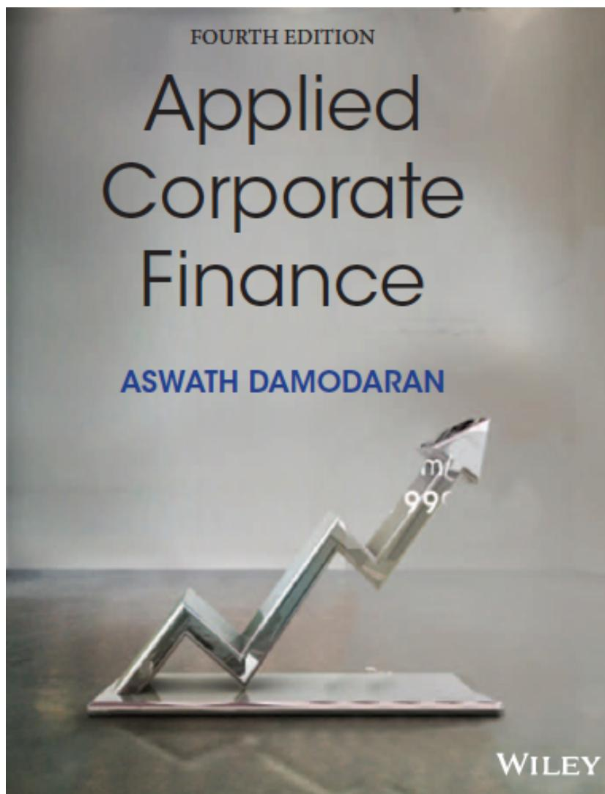

# **SESSION 25: THE TRADE OFF**

"Companies don't have cash. They hold cash for their stockholders."

#### **SESSION 25: THE TRADE OFF**

# **THREE SCHOOLS OF THOUGHT ON DIVIDENDS**

- 1. If there are no tax disadvantages associated with dividends & companies can issue stock, at no issuance cost, to raise equity, whenever needed

**Dividends do not matter, and dividend policy does not affect value.**

- 2. If dividends create a tax disadvantage for investors (relative to capital gains)

**Dividends are bad, and increasing dividends will reduce value**

- 3. If dividends create a tax advantage for investors (relative to capital gains) and/or stockholders like dividends

**Dividends are good, and increasing dividends will increase value**

#### **THE DIVIDENDS DON**'**T MATTER SCHOOL THE MILLER MODIGLIANI HYPOTHESIS**

- The Miller-Modigliani Hypothesis: Dividends do not affect value
- Basis: o If a firm's investment policies (and hence cash flows) don't change, the value of the firm cannot change as it changes dividends. o If a firm pays more in dividends, it will have to issue new equity to fund the same projects. By doing so, it will reduce expected price appreciation on the stock but it will be offset by a higher dividend yield. o If we ignore personal taxes, investors have to be indifferent to receiving either dividends or capital gains.
- Underlying Assumptions:
  - a) There are no tax differences to investors between dividends and capital gains.
  - b) If companies pay too much in cash, they can issue new stock, with no flotation costs or signaling consequences, to replace this cash.
  - c) If companies pay too little in dividends, they do not use the excess cash for bad projects or acquisitions.

#### **II. THE DIVIDENDS ARE** "**BAD**" **SCHOOL: AND THE EVIDENCE TO BACK THEM UP…**

#### **WHAT DO INVESTORS IN YOUR STOCK THINK ABOUT DIVIDENDS? CLUES ON THE EX-DIVIDEND DAY!**

- Assume that you are the owner of a stock that is approaching an ex-dividend day and you know that dollar dividend with certainty. In addition, assume that you have owned the stock for several years.

P = Price at which you bought the stock a "while" back Pb= Price before the stock goes ex-dividend Pa=Price after the stock goes ex-dividend D = Dividends declared on stock to, tcg = Taxes paid on ordinary income and capital gains respectively

# **CASHFLOWS FROM SELLING AROUND EX-DIVIDEND DAY**

- The cash flows from selling before ex-dividend day are:

$$P_b - (P_b - P) t_{cg}$$

- The cash flows from selling after ex-dividend day are:

$$P_a - (P_a - P) t_{cg} + D(1-t_o)$$

- Since the average investor should be indifferent between selling before the exdividend day and selling after the ex-dividend day -

$$P_b - (P_b - P) t_{cg} = P_a - (P_a - P) t_{cg} + D(1-t_o)$$

- Some basic algebra leads us to the following:

$$\frac{P_b - P_a}{D} = \frac{1 - t_o}{1 - t_{cg}}$$

### **INTUITIVE IMPLICATIONS**

- The relationship between the price change on the exdividend day and the dollar dividend will be determined by the difference between the tax rate on dividends and the tax rate on capital gains for the typical investor in the stock.

| <i>Tax Rates</i>                                           | <i>Ex-dividend day behavior</i> |
|------------------------------------------------------------|---------------------------------|
| If dividends and capital gains are taxed equally           | Price change = Dividend         |
| If dividends are taxed at a higher rate than capital gains | Price change < Dividend         |
| If dividends are taxed at a lower rate than capital gains  | Price change > Dividend         |

#### **THE EMPIRICAL EVIDENCE…**

- Ordinary tax rate = 70%
- Capital gains rate = 28%
- Price change as % of Dividend = 78%

#### 1966-1969

- Ordinary tax rate = 50%
- Capital gains rate = 20%
- Price change as % of Dividend = 85%

#### 1981-1985

- Ordinary tax rate = 28%
- Capital gains rate = 28%
- Price change as % of Dividend = 90%

#### 1986-1990

#### **TWO BAD REASONS FOR PAYING DIVIDENDS 1. THE BIRD IN THE HAND FALLACY**

- Argument: Dividends now are more certain than capital gains later. Hence dividends are more valuable than capital gains. Stocks that pay dividends will therefore be more highly valued than stocks that do not.
- Counter: The appropriate comparison should be between dividends today and price appreciation today. The stock price drops on the ex-dividend day.

### **2. WE HAVE EXCESS CASH THIS YEAR…**

- Argument: The firm has excess cash on its hands this year, no investment projects this year and wants to give the money back to stockholders.
- Counter: So why not just repurchase stock? If this is a onetime phenomenon, the firm has to consider future financing needs. The cost of raising new financing in future years, especially by issuing new equity, can be staggering.

# **THREE** "**GOOD**" **REASONS FOR PAYING DIVIDENDS…**

- Clientele Effect: The investors in your company like dividends.
- The Signalling Story: Dividends can be signals to the market that you believe that you have good cash flow prospects in the future.
- The Wealth Appropriation Story: Dividends are one way of transferring wealth from lenders to equity investors (this is good for equity investors but bad for lenders)

# **I. THE CLIENTELE EFFECT**

- Basis: Investors may form clienteles based upon their tax brackets. Investors in high tax brackets may invest in stocks which do not pay dividends and those in low tax brackets may invest in dividend paying stocks.
- Evidence: A study of 914 investors' portfolios was carried out to see if their portfolio positions were affected by their tax brackets. The study found that o (a) Older investors were more likely to hold high dividend stocks and o (b) Poorer investors tended to hold high dividend stocks

## 2. DIVIDENDS SEND A SIGNAL" INCREASES IN DIVIDENDS ARE GOOD NEWS..

Daily Cumulative Average Abnormal Returns: Cases Where Earnings Announcements  
*Precede* Dividend Announcements

#### **BUT HIGHER OR NEW DIVIDENDS MAY SIGNAL BAD NEWS (NOT GOOD)**

#### **BOTH DIVIDEND INCREASES AND DECREASES ARE BECOMING LESS INFORMATIVE…**

#### **3. DIVIDEND INCREASES MAY BE GOOD FOR STOCKS… BUT BAD FOR BONDS..**

EXCESS RETURNS ON STOCKS AND BONDS AROUND DIVIDEND CHANGES

# WHAT MANAGERS BELIEVE ABOUT DIVIDENDS...

| <i>Statement of Management Beliefs</i>                                                                               | <i>Agree</i> | <i>No Opinion</i> | <i>Disagree</i> |
|----------------------------------------------------------------------------------------------------------------------|--------------|-------------------|-----------------|
| 1. A firm's dividend payout ratio affects the price of the stock.                                                    | 61%          | 33%               | 6%              |
| 2. Dividend payments provide a signaling device of future prospects.                                                 | 52%          | 41%               | 7%              |
| 3. The market uses divided announcements as information for assessing firm value.                                    | 43%          | 51%               | 6%              |
| 4. Investors have different perceptions of the relative riskiness of dividends and retained earnings.                | 56%          | 42%               | 2%              |
| 5. Investors are basically indifferent with regard to returns from dividends and capital gains.                      | 6%           | 30%               | 64%             |
| 6. A stockholder is attracted to firms that have dividend policies appropriate to the stockholder's tax environment. | 44%          | 49%               | 7%              |
| 7. Management should be responsive to shareholders' preferences regarding dividends.                                 | 41%          | 49%               | 10%             |

## Applied Corporate Finance

Optional: Read Chapter 10

#### **Task**

Examine the trade offs on whether your company should be paying more or less in dividends.