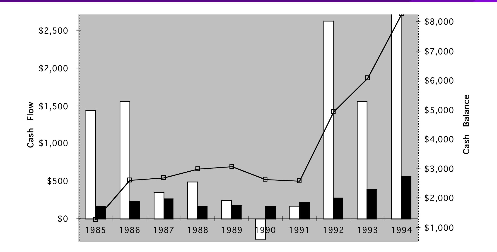
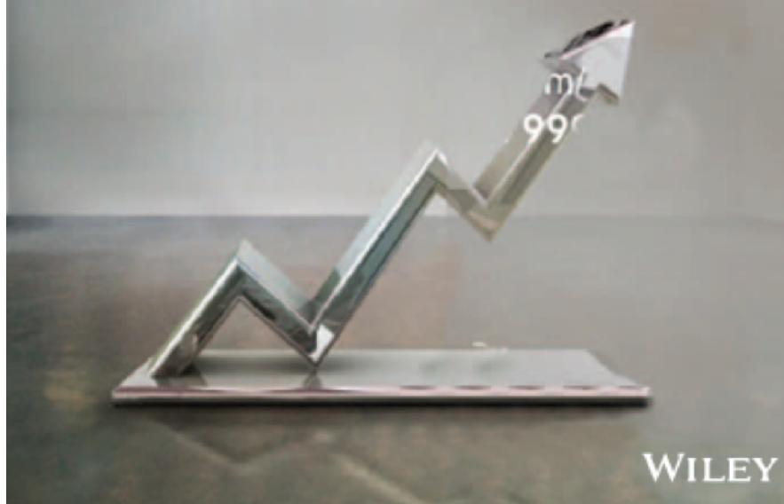

# **SESSION 26: ASSESSMENTS**

Dividend policy rests on management trust.

# SESSION 26: ASSESSMENTS

## **THE CASH/TRUST ASSESSMENT**

**Step 1**: How much could the company have paid out during the period under question?

**Step 2**: How much did the company actually pay out during the period in question?

**Step 3**: How much do I trust the management of this company with excess cash?

How well did they make investments during the period in question?

How well has my stock performed during the period in question?

## **HOW MUCH HAS THE COMPANY RETURNED TO STOCKHOLDERS?**

- As firms increasingly use stock buybacks, we have to measure cash returned to stockholders as not only dividends but also buybacks.
- For instance, for the companies we are analyzing, the cash returned looked as follows:

|         |           | Disney   |           | Vale     | Tata	Motors |          | Baidu     |          | Deutsche	Bank |          |
|---------|-----------|----------|-----------|----------|-------------|----------|-----------|----------|---------------|----------|
| Year    | Dividends | Buybacks | Dividends | Buybacks | Dividends   | Buybacks | Dividends | Buybacks | Dividends     | Buybacks |
| 2008    | \$648     | \$648    | \$2,993   | \$741    | 7,595₹      | 0₹       | ¥0        | ¥0       | 2,274	€       | 0	€      |
| 2009    | \$653     | \$2,669  | \$2,771   | \$9      | 3,496₹      | 0₹       | ¥0        | ¥0       | 309	€         | 0	€      |
| 2010    | \$756     | \$4,993  | \$3,037   | \$1,930  | 10,195₹     | 0₹       | ¥0        | ¥0       | 465	€         | 0	€      |
| 2011    | \$1,076   | \$3,015  | \$9,062   | \$3,051  | 15,031₹     | 0₹       | ¥0        | ¥0       | 691	€         | 0	€      |
| 2012    | \$1,324   | \$4,087  | \$6,006   | \$0      | 15,088₹     | 970₹     | ¥0        | ¥0       | 689	€         | 0	€      |
| 2008-12 | \$4,457   | \$15,412 | \$23,869  | \$5,731  | 51,405₹     | 970₹     | ¥0        | ¥0       | ¥4,428        | ¥0       |

# A MEASURE OF HOW MUCH A COMPANY COULD HAVE AFFORDED TO PAY OUT: FCFE

- • The Free Cash Flow to Equity (FCFE) is a measure of how much cash is left in the business after non-equity claimholders (debt and preferred stock) have been paid, and after any reinvestment needed to sustain the firm's assets and future growth.
  - + Depreciation & Amortization
    - = Cash flows from Operations to Equity Investors
      - - Preferred Dividends
      - - Capital Expenditures
      - - Working Capital Needs
      - - Principal Repayments
      - + Proceeds from New Debt Issues
        - = Free Cash flow to Equity

## **DISNEY'S FCFE: 2008-2012**

Disney returned about \$1.5 billion more that the \$18.1 billion it had available as FCFE with a normalized debt ratio of 11.58% (its current debt ratio).

|                                       | 2012    | 2011    | 2010    | 2009    | 2008    | Aggregate |
|---------------------------------------|---------|---------|---------|---------|---------|-----------|
| Net Income                            | \$6,136 | \$5,682 | \$4,807 | \$3,963 | \$3,307 | \$23,895  |
| (Cap. Exp - Depr)                     | \$604   | \$1,797 | \$1,718 | \$397   | \$122   | \$4,638   |
| ∂ Working Capital                     | (\$133) | \$940   | \$950   | \$308   | (\$109) | \$1,956   |
| Free CF to Equity (pre-debt)          | \$5,665 | \$2,945 | \$2,139 | \$3,258 | \$3,294 | \$17,301  |
| + Net Debt Issued                     | \$1,881 | \$4,246 | \$2,743 | \$1,190 | (\$235) | \$9,825   |
| = Free CF to Equity (actual debt)     | \$7,546 | \$7,191 | \$4,882 | \$4,448 | \$3,059 | \$27,126  |
| Free CF to Equity (target debt ratio) | \$5,720 | \$3,262 | \$2,448 | \$3,340 | \$3,296 | \$18,065  |
| Dividends                             | \$1,324 | \$1,076 | \$756   | \$653   | \$648   | \$4,457   |
| Dividends + Buybacks                  | \$5,411 | \$4,091 | \$5,749 | \$3,322 | \$1,296 | \$19,869  |

## **ESTIMATING FCFE WHEN LEVERAGE IS STABLE**

### Net Income

- (1 DR) (Capital Expenditures Depreciation)
- (1 DR) Working Capital Needs = Free Cash Flow to Equity
- DR = Debt/Capital Ratio
- For this firm, o Proceeds from new debt issues = Principal Repayments + d (Capital Expenditures – Depreciation + Working Capital Needs) o Thus, whatever debt has to be repaid gets paid off with new debt and additional debt is taken on to fund growth in the firm.

## **AN EXAMPLE: FCFE CALCULATION**

- Consider the following inputs for Microsoft in 1996. In 1996, Microsoft's FCFE was: o Net Income = \$2,176 million o Capital Expenditures = \$494 million o Depreciation = \$480 million o Increase in Non-Cash Working Capital = \$35 million o Debt Ration = 0%
- FCFE = Net Income (Cap ex Depr) (1-DR) Chg WC (1 DR) = \$2,176 – (494 – 480) (1 – 0) – \$35 (1 – 0) = \$2,127 million
- By this estimation, Microsoft could have paid \$2,127 million in dividends/stock buybacks in 1996. They paid no dividends and bought back no stock. Where will the \$2,127 million show up in Microsoft's balance sheet?

## **FCFE FOR A BANK?**

- We redefine reinvestment as investment in regulatory capital FCFEBank = Net Income – Increase in Regulatory Capital (Book Equity)
- Consider a bank with \$10 billion in outstanding loans and book equity of \$750 million. If it maintains its capital ration of 7.5%, intends to grow its loan base by 10% to \$11 billion and expects to generate \$150 million in nete income:

FCFE = \$150 million – (11,000 – 10,000) \* (0.075) = \$75 million

|                                  | Current   | 1         | 2         | 3         | 4         | 5         |
|----------------------------------|-----------|-----------|-----------|-----------|-----------|-----------|
| Asset Base                       | 439,851 € | 453,047 € | 466,638 € | 480,637 € | 495,056 € | 509,908 € |
| Capital ratio                    | 16.00%    | 16.00%    | 16.00%    | 16.00%    | 16.00%    | 16.00%    |
| Tier 1 Capital                   | 70,376 €  | 72,487 €  | 74,662 €  | 76,902 €  | 79,209 €  | 81,585 €  |
| Change in regulatory capital     |           | 2,111 €   | 2,175 €   | 2,240 €   | 2,307 €   | 2,376 €   |
| Book Equity                      | 76,829 €  | 78,940 €  | 81,115 €  | 83,355 €  | 85,662 €  | 88,038 €  |
| ROE                              | -1.08%    | 0.74%     | 2.55%     | 4.37%     | 6.18%     | 8.00%     |
| Net Income                       | -757 €    | 584 €     | 2,072 €   | 3,642 €   | 5,298 €   | 7,043 €   |
| Investment in Regulatory Capital |           | 2,111 €   | 2,175 €   | 2,240 €   | 2,307 €   | 2,376 €   |
| FCFE                             |           | -1,528 €  | -102 €    | 1,403 €   | 2,991 €   | 4,667 €   |

## **DIVIDENDS VERSUS FCFE: ACROSS THE GLOBE**

| Dividend Class                            | US     | Europe | Japan  | Emerging Markets | Aus, NZ & Canada | Global |
|-------------------------------------------|--------|--------|--------|------------------|------------------|--------|
| FCFE<0, No Dividends/Buybacks FCFE >0, No | 28.31% | 28.38% | 10.90% | 21.78%           | 59.49%           | 26.91% |
| Dividends/Buybacks FCFE >0,               | 29.86% | 19.56% | 13.26% | 23.01%           | 15.76%           | 22.05% |
| FCFE>Dividends+Buybacks                   | 14.52% | 22.93% | 35.04% | 22.98%           | 9.02%            | 21.10% |
| CASH ACCUMULATORS FCFE >0,                | 44.38% | 42.49% | 48.30% | 45.98%           | 24.77%           | 43.16% |
| FCFE<Dividends+Buybacks FCFE<0, 've       | 8.80%  | 9.74%  | 8.40%  | 7.91%            | 4.62%            | 8.05%  |
| Dividends+Buybacks                        | 18.51% | 19.38% | 32.40% | 24.34%           | 11.11%           | 21.88% |
| OVER PAYERS                               | 27.31% | 29.12% | 40.80% | 32.24%           | 15.73%           | 29.93% |

## **CONSEQUENCES OF FAILING TO PAY FCFE**

## 6 **APPLICATION TEST: ESTIMATING YOUR FIRM'S FCFE**

B FA page PB Page 44

- In General, If cash flow statement used Net Income Net Income + Depreciation & Amortization + Depreciation & Amortization
  - Capital Expenditures + Capital Expenditures
  - Change in Non-Cash Working Capital + Changes in Non-cash WC
  - Preferred Dividend + Preferred Dividend
  - Principal Repaid + Increase in LT Borrowing + New Debt Issued + Decrease in LT Borrowing + Change in ST Borrowing = FCFE = FCFE
- Compare to Dividends (Common) + Stock Buybacks

## Applied Corporate Finance

Optional: Read Chapter 11

**Task** Estimate the potential dividends for your company and its current cash balance.

