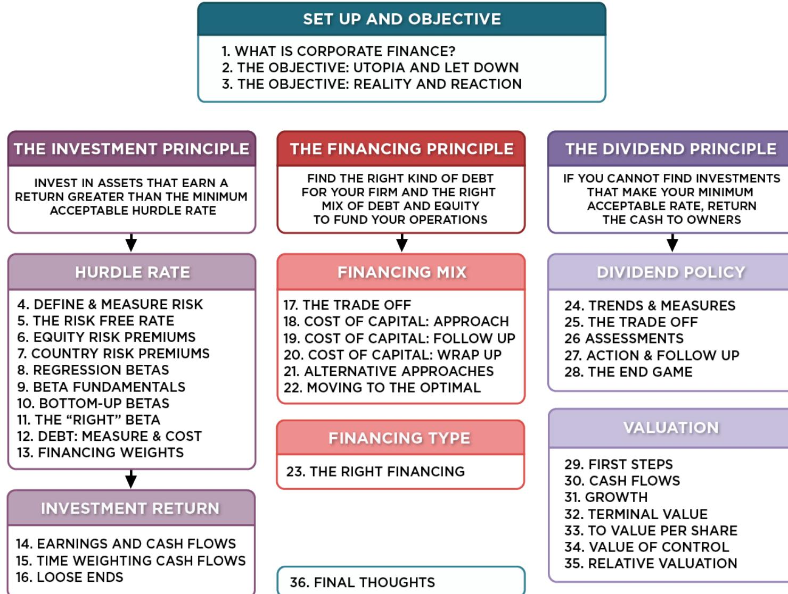
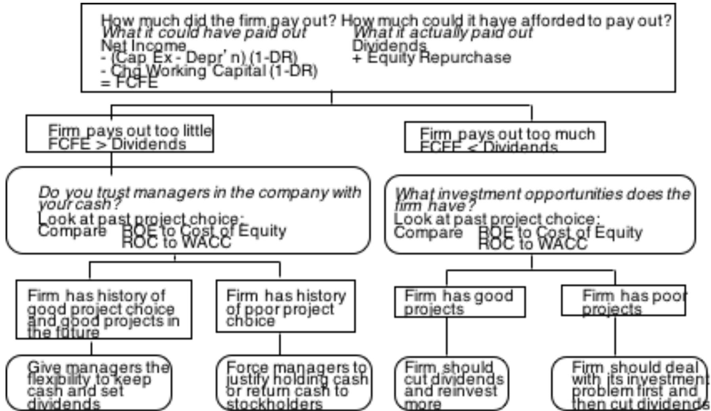
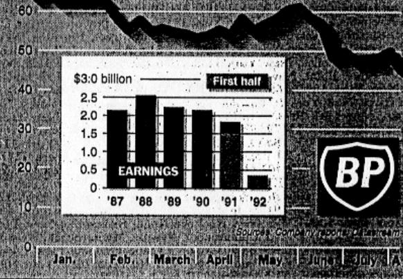
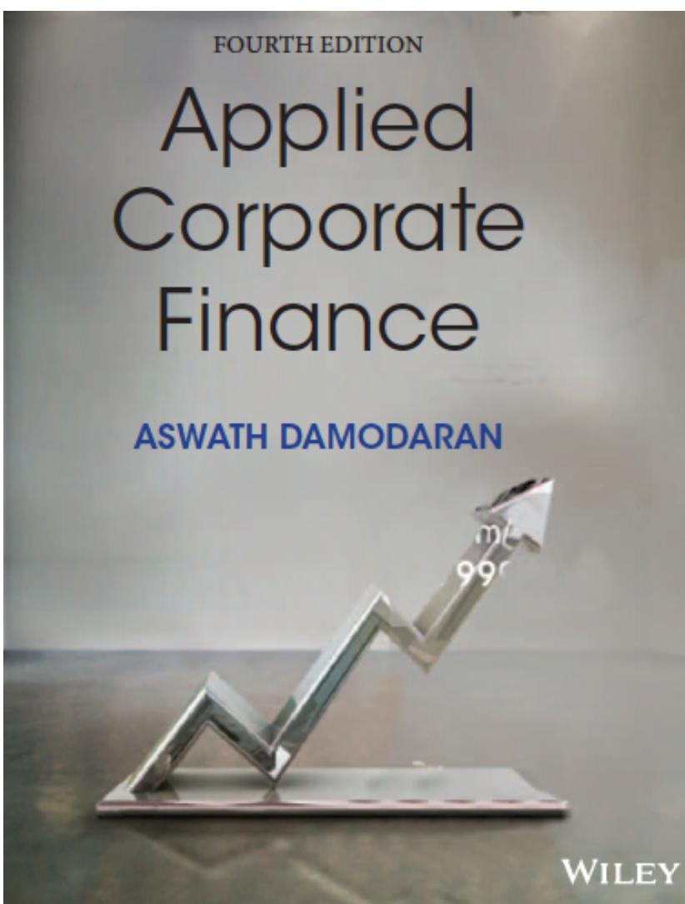

# **SESSION 27: ACTION & FOLLOW UP**

Changing dividend policy is hard to do, but not doing it can be worse.

# SESSION 27: ACTION & FOLLOW UP

# A PRACTICAL FRAMEWORK FOR ANALYZING DIVIDEND POLICY

### **A DIVIDEND MATRIX**

| Quality of projects taken: ROE versus Cost of Equity |                                                                                                                            |                                                                                       |
|------------------------------------------------------|----------------------------------------------------------------------------------------------------------------------------|---------------------------------------------------------------------------------------|
| Poor projects                                        | Good projects                                                                                                              |                                                                                       |
| Dividends paid out relative to FCFE Cash Deficit  | <i>Cash Surplus + Poor Projects</i> Significant pressure to pay out more to stockholders as dividends or stock buybacks | <i>Cash Surplus + Good Projects</i> Maximum flexibility in setting dividend policy |
|                                                      | <i>Cash Deficit + Poor Projects</i> Cut out dividends but real problem is in investment policy.                         | <i>Cash Deficit + Good Projects</i> Reduce cash payout, if any, to stockholders    |

### **CASE 1: DISNEY IN 2003**

- FCFE versus Dividends o Between 1994 & 2003, Disney generated \$969 million in FCFE each year. o Between 1994 & 2003, Disney paid out \$639 million in dividends and stock buybacks each year.
- Cash Balance o Disney had a cash balance in excess of \$ 4 billion at the end of 2003.
- Performance measures o Between 1994 and 2003, Disney has generated a return on equity, on it' s projects, about 2% less than the cost of equity, on average each year. o Between 1994 and 2003, Disney's stock has delivered about 3% less than the cost of equity, on average each year. o The underperformance has been primarily post 1996 (after the Capital Cities acquisition).

### **CAN YOU TRUST DISNEY'S MANAGEMENT?**

- Given Disney's track record between 1994 and 2003, if you were a Disney stockholder, would you be comfortable with Disney's dividend policy?
- a. Yes
- b. No
- Does the fact that the company is run by Michael Eisner, the CEO for the last 10 years and the initiator of the Cap Cities acquisition have an effect on your decision.
- a. Yes
- b. No

### **FOLLOWING UP: DISNEY IN 2009**

- Between 2004 and 2008, Disney made significant changes: o It replaced its CEO, Michael Eisner, with a new CEO, Bob Iger, who at least on the surface seemed to be more receptive to stockholder concerns. o Its stock price performance improved (positive Jensen's alpha) o Its project choice improved (ROC moved from being well below cost of capital to above)
- The firm also shifted from cash returned < FCFE to cash returned > FCFE and avoided making large acquisitions.
- If you were a stockholder in 2009 and Iger made a plea to retain cash in Disney to pursue investment opportunities, would you be more receptive?
  - a. Yes
  - b. No

### **FINAL TWIST: DISNEY IN 2013**

- Disney did return to holding cash between 2008 and 2013, with dividends and buybacks amounting to \$2.6 billion less than the FCFE (with a target debt ratio) over this period.
- Disney continues to earn a return on capital well in excess of the cost of capital and its stock has doubled over the last two years.
- Now, assume that Bob Iger asks you for permission to withhold even more cash to cover future investment needs. Are you likely to go along?
- a. Yes
- b. No

### **CASE 2: VALE – DIVIDENDS VERSUS FCFE**

|                                       | Aggregate     | Average |
|---------------------------------------|---------------|---------|
| Net Income                            | \$57,404      | \$5,740 |
| Dividends                             | \$36,766      | \$3,677 |
| Dividend Payout Ratio                 | \$1           | \$1     |
| Stock Buybacks                        | \$6,032       | \$603   |
| Dividends + Buybacks                  | \$42,798      | \$4,280 |
| Cash Payout Ratio                     | \$1           |         |
| Free CF to Equity (pre-debt)          | (\$1,903)     | (\$190) |
| Free CF to Equity (actual debt)       | \$1,036       | \$104   |
| Free CF to Equity (target debt ratio) | \$19,138      | \$1,914 |
| Cash payout as % of pre-debt FCFE     | FCFE negative |         |
| Cash payout as % of actual FCFE       | 4131.08%      |         |
| Cash payout as % of target FCFE       | 223.63%       |         |

### **VALE: ITS YOUR CALL..**

- Vale's managers have asked you for permission to cut dividends (to more manageable levels). Are you likely to go along?
  - a. Yes
  - b. No
- The reasons for Vale's dividend problem lie in it's equity structure. Like most Brazilian companies, Vale has two classes of shares - common shares with voting rights and preferred shares without voting rights. However, Vale has committed to paying out 35% of its earnings as dividends to the preferred stockholders. If they fail to meet this threshold, the preferred shares get voting rights. If you own the preferred shares, would your answer to the question above change?
  - a. Yes
  - b. No

## **CASE 3: BP: SUMMARY OF DIVIDEND POLICY: 1982-1991**

| Summary of calculations |            |                    |            |            |
|-------------------------|------------|--------------------|------------|------------|
|                         | Average    | Standard Deviation | Maximum    | Minimum    |
| Free CF to Equity       | \$571.10   | \$1,382.29         | \$3,764.00 | (\$612.50) |
| Dividends               | \$1,496.30 | \$448.77           | \$2,112.00 | \$831.00   |
| Dividends+Repurchases   | \$1,496.30 | \$448.77           | \$2,112.00 | \$831.00   |
| Dividend Payout Ratio   | 84.77%     |                    |            |            |
| Cash Paid as % of FCFE  | 262.00%    |                    |            |            |
| ROE - Required return   | -1.67%     | 11.49%             | 20.90%     | -21.59%    |

### Summary of calculations

## B.P.'s Shares Plummet After Dividend Is Slashed

By MATTHEW L. WALD

British Petroleum said yesterday that it would cut its dividend by 55 percent, take a pretax restructuring charge of \$1.82 billion for the second quarter and lay off 11,500 employees, or 10 percent of its worldwide work force. The moves came five weeks after Robert B. Horton, B.P.'s chairman, resigned under pressure from the company's outside directors.

Analysts anticipated a dividend cut by the oil company, the world's third largest, but the one announced was at the low end of their expectations. In response, shares of the company's American depository rights, each of which represents 12 shares of the London-based company, dropped \$3.625, or 7.36 percent, to \$45.375. It was the most active issue on the New York Stock Exchange, with 5.89 million shares traded.

The Royal Dutch/Shell group also reported a disappointing quarter yesterday, with earnings on a replacement cost basis — excluding gains or losses on inventory holdings — of \$868 million, down 22 percent.

Quel: Recovery Seems Unlikely

Adding to the gloom at B.P., the new chief executive, David A. G. Simon, said the prospects for a quick recovery were poor. "External trading conditions are expected to remain difficult, particularly for the downstream oil and chemicals businesses, with growth prospects for the world's economies remaining uncertain," he said in a statement. Downstream oil is an industry term for refining and marketing operations, as distinct from oil production.

Downstream margins in the United States would be hurt later this year, he predicted, when clean air rules

take effect and gasoline must be reformulated to reduce pollution. "In Europe, recovery will depend upon seasonal heating oil demand," Mr. Simon said.

The crude oil market, he predicted, would remain balanced unless Iraqi oil was allowed to re-enter the market. The company said it was well positioned to take advantage of any

### The giant British oil company bet on rising oil prices.

Increase in oil prices, but the company's oil production in the United States is declining. B.P. is the largest producer in Alaska.

The market for petrochemicals in Europe remains weak.

B.P.'s second quarter profits, before one-time transactions, declined to \$193 million from \$515 million, valuing inventories on a replacement-cost basis. James J. Murchle, an analyst at Stanford C. Bernstein, estimated that after exceptional items, earnings per share fell to 30 cents in the second quarter, compared with 62 cents a year earlier.

Analysts attributed B.P.'s problems to the company's acquisitions in the last few years, and heavy capital expenditures. Summing up the company's recent history, Frank P. Kneuttel of Prudential Securities Research said, "Debt rose, interest expense rose, and profits have gone to hell."

Mr. Murchle, who worked for Standard Oil of Ohio and then B.P.

### Britain's Oil Colossus

British Petroleum's 1992 stock price, weekly closings and trade on the New York Stock Exchange through April 6, and earnings, excluding extraordinary items and gains and losses on inventory, in dollars

after B.P. acquired Sohlo, said, "What you've got is a company that thought oil prices were going to go to \$25 and spent like it, in terms of capital." If B.P.'s costs of finding oil are the same as the industry average, he said, then the company has been spending enough to replace 120 percent to 130 percent of its annual production, which is not a successful strategy if prices do not rise.

In addition, he said, the company had been spending twice as much on its refining and marketing operation

as it was recording in depreciation.

Another analyst at a large stock brokerage house, who spoke on the condition of anonymity, said, "They took all the old Sohlo stations and turned them into modern B.P. stations; they took all the B.P. stations and turned them into ultramodern stations."

The analyst said that while some of the cuts were obvious, some came

Continued on Page D2

### **MANAGING CHANGES IN DIVIDEND POLICY**

| <i>Periods Around Announcement Date</i>                                      |                      |                            |                      |
|------------------------------------------------------------------------------|----------------------|----------------------------|----------------------|
| <i>Category</i>                                                              | <i>Prior Quarter</i> | <i>Announcement Period</i> | <i>Quarter After</i> |
| Simultaneous announcement of earnings decline/loss ( $N = 176$ )             | -7.23%               | -8.17%                     | +1.80%               |
| Prior announcement of earnings decline or loss ( $N = 208$ )                 | -7.58%               | -5.52%                     | +1.07%               |
| Simultaneous announcement of investment or growth opportunities ( $N = 16$ ) | -7.69%               | -5.16%                     | +8.79%               |

### **CASE 4: THE LIMITED: SUMMARY OF DIVIDEND POLICY: 1983-1992**

| <i>Summary of calculations</i> |                |                           |                |                |
|--------------------------------|----------------|---------------------------|----------------|----------------|
|                                | <i>Average</i> | <i>Standard Deviation</i> | <i>Maximum</i> | <i>Minimum</i> |
| <i>Free CF to Equity</i>       | (\$34.20)      | \$109.74                  | \$96.89        | (\$242.17)     |
| <i>Dividends</i>               | \$40.87        | \$32.79                   | \$101.36       | \$5.97         |
| <i>Dividends+Repurchases</i>   | \$40.87        | \$32.79                   | \$101.36       | \$5.97         |
| <i>Dividend Payout Ratio</i>   | 18.59%         |                           |                |                |
| <i>Cash Paid as % of FCFE</i>  | -119.52%       |                           |                |                |
| <i>ROE - Required return</i>   | 1.69%          | 19.07%                    | 29.26%         | -19.84%        |

### **GROWTH FIRMS AND DIVIDENDS**

- High growth firms are sometimes advised to initiate dividends because its increases the potential stockholder base for the company (since there are some investors - like pension funds - that cannot buy stocks that do not pay dividends) and, by extension, the stock price. Do you agree with this argument?
  - a. Yes
  - b. No
- Why?

### **5. TATA MOTORS**

| Net Income Dividends                  | Aggregate \$421,338.00 \$74,214.00 | Average \$42,133.80 \$7,421.40 |
|---------------------------------------|------------------------------------|--------------------------------|
| Dividend Payout Ratio                 | 17.61%                             | 15.09%                         |
| Stock Buybacks                        | \$970.00                           | \$97.00                        |
| Dividends + Buybacks                  | \$75,184.00                        | \$7,518.40                     |
| Cash Payout Ratio                     | 17.84%                             |                                |
| Free CF to Equity (pre-debt)          | (\$106,871.00)                     | (\$10,687.10)                  |
| Free CF to Equity (actual debt)       | \$825,262.00                       | \$82,526.20                    |
| Free CF to Equity (target debt ratio) | \$47,796.36                        | \$4,779.64                     |
| Cash payout as % of pre-debt FCFE     | FCFE negative                      | Negative FCFE, largely         |
| Cash payout as % of actual FCFE       | 9.11%                              | because of acquisitions.       |
| Cash payout as % of target FCFE       | 157.30%                            |                                |

### 6 **APPLICATION TEST: ASSESSING YOUR FIRM**'**S DIVIDEND POLICY**

- Compare your firm's dividends to its FCFE, looking at the last 5 years of information.
- Based upon your earlier analysis of your firm's project choices, would you encourage the firm to return more cash or less cash to its owners?
- If you would encourage it to return more cash, what form should it take (dividends versus stock buybacks)?

## Applied Corporate Finance

### **Task**

Compare the cash returned at your company to what is could have & make a judgment on whether its policies have to change.

Optional: Read Chapter 11