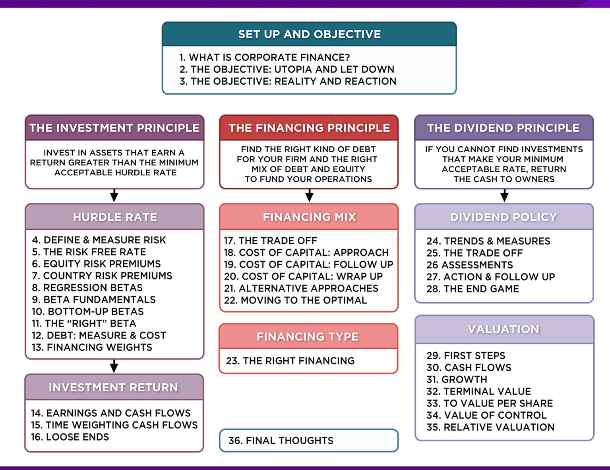
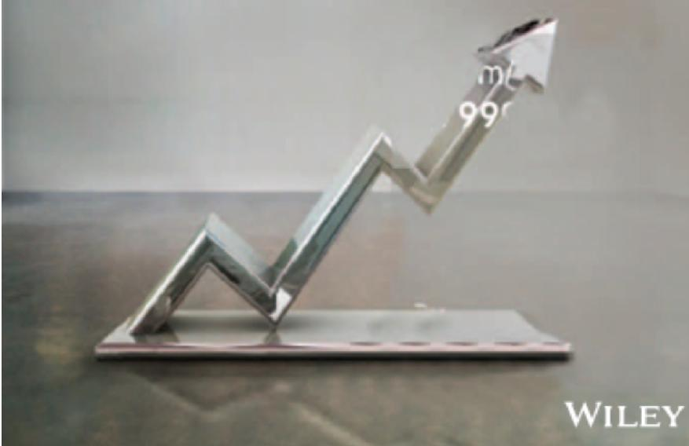

# **SESSION 28: THE END GAME**

Me too, me too . . .

#### **SESSION 28: THE END GAME**

### **THE PEER GROUP APPROACH**

- In the peer group approach, you compare your company to similar companies (usually in the same market and sector) to assess whether to pay dividends, and if yes, how much.

| Company       | 2013  | Dividend	Yield Average	2008-12 | 2013    | Dividend	Payout Average	2008-12 | Comparable	Group                                      | Dividend	Yield | Dividend	Payout |
|---------------|-------|--------------------------------|---------|---------------------------------|-------------------------------------------------------|----------------|-----------------|
| Disney        | 1.09% | 1.17%                          | 21.58%  | 17.11%                          | US Entertainment Global Diversified Mining & Iron Ore | 0.96%          | 22.51%          |
| Vale          | 6.56% | 4.01%                          | 113.45% | 37.69%                          |                                                       |                |                 |
|               |       |                                |         |                                 | (Market cap> \$1 b) Global Autos                      | 3.07%          | 316.32%         |
| Tata	Motors   | 1.31% | 1.82%                          | 16.09%  | 15.53%                          |                                                       |                |                 |
|               |       |                                |         |                                 | (Market Cap> \$1 b) Global Online                     | 2.13%          | 27.00%          |
| Baidu         | 0.00% | 0.00%                          | 0.00%   | 0.00%                           |                                                       |                |                 |
|               |       |                                |         |                                 | Advertising                                           | 0.09%          | 8.66%           |
| Deutsche	Bank | 1.96% | 3.14%                          | 362.63% | 37.39%                          | European Banks                                        | 1.96%          | 79.32%          |

#### **A CLOSER LOOK AT DISNEY'S PEER GROUP**

|                                | Market    |           | Dividends + | Net     |          | Dividend | Dividend | Cash        |
|--------------------------------|-----------|-----------|-------------|---------|----------|----------|----------|-------------|
|                                | Cap       | Dividends |             |         |          |          |          |             |
| Company                        |           |           | Buybacks    | Income  | FCFE     |          |          | Return/FCFE |
| The Walt Disney Company        | \$134,256 | \$1,324   | \$5,411     | \$6,136 | \$1,503  | 0.99%    | 21.58%   | 360.01%     |
| Twenty-First Century Fox, Inc. | \$79,796  | \$415     | \$2,477     | \$7,097 | \$2,408  | 0.52%    | 6.78%    | 102.87%     |
| Time Warner Inc                | \$63,077  | \$1,060   | \$4,939     | \$3,019 | -\$4,729 | 1.68%    | 27.08%   | NA          |
| Viacom, Inc.                   | \$38,974  | \$555     | \$5,219     | \$2,395 | -\$2,219 | 1.42%    | 23.17%   | NA          |
| The Madison Square Garden Co.  | \$4,426   | \$0       | \$0         | \$142   | -\$119   | 0.00%    | 0.00%    | NA          |
| Lions Gate Entertainment Corp  | \$4,367   | \$0       | \$0         | \$232   | -\$697   | 0.00%    | 0.00%    | NA          |
| Live Nation Entertainment, Inc | \$3,894   | \$0       | \$0         | -\$163  | \$288    | 0.00%    | NA       | 0.00%       |
| Cinemark Holdings Inc          | \$3,844   | \$101     | \$101       | \$169   | -\$180   | 2.64%    | 63.04%   | NA          |
| MGM Holdings Inc               | \$3,673   | \$0       | \$59        | \$129   | \$536    | 0.00%    | 0.00%    | 11.00%      |
| Regal Entertainment Group      | \$3,013   | \$132     | \$132       | \$145   | -\$18    | 4.39%    | 77.31%   | NA          |
| DreamWorks Animation SKG Inc.  | \$2,975   | \$0       | \$34        | -\$36   | -\$572   | 0.00%    | NA       | NA          |
| AMC Entertainment Holdings     | \$2,001   | \$0       | \$0         | \$63    | -\$52    | 0.00%    | 0.00%    | NA          |
| World Wrestling Entertainment  | \$1,245   | \$36      | \$36        | \$31    | -\$27    | 2.88%    | 317.70%  | NA          |
| SFX Entertainment Inc.         | \$1,047   | \$0       | \$0         | -\$16   | -\$137   | 0.00%    | NA       | NA          |
| Carmike Cinemas Inc.           | \$642     | \$0       | \$0         | \$96    | \$64     | 0.00%    | 0.00%    | 0.27%       |
| Rentrak Corporation            | \$454     | \$0       | \$0         | -\$23   | -\$13    | 0.00%    | NA       | NA          |
| Reading International, Inc.    | \$177     | \$0       | \$0         | -\$1    | \$15     | 0.00%    | 0.00%    | 0.00%       |
| Average                        | \$20,462  | \$213     | \$1,083     | \$1,142 | -\$232   | 0.85%    | 41.28%   | 79.02%      |
| Median                         | \$3,673   | \$0       | \$34        | \$129   | -\$27    | 0.00%    | 6.78%    | 5.63%       |

# **GOING BEYOND AVERAGES . . . LOOKING AT THE MARKET**

- Regressing dividend yield and payout against expected growth across all US companies in January 2014 yields:

PYT = Dividend Payout Ratio = Dividends / Net Income

YLD = Dividend Yield = Dividends / Current Price

BETA = Beta (Regression of Bottom up) for company

EGR = Expected growth rate in earning over next 5 years (analyst estimates)

DCAP = Total Debt / (Total Debt + Market Value of equity)

# **USING THE MARKET REGRESSION ON DISNEY**

- To illustrate the applicability of the market regression in analyzing the dividend policy of Disney, we estimate the values of the independent variables in the regressions for the firm.
  - Beta for Disney (bottom up) = 1.00
  - Disney's expected growth in earnings per share = 14.73% (analyst estimate)
  - Disney's market debt to capital ratio = 11.58%
- Substituting into the regression equations for the dividend payout ratio and dividend yield, we estimate a predicted payout ratio:
  - Predicted Payout = 0.649 0.296 (1.00) 0.800 (0.1473) + 0.300 (0.1158) = 0.2695
  - Predicted Yield = 0.0324 0.0154 (1.00) 0.038 (0.1473) + 0.023 (0.1158) = 0.0140
- Based on this analysis, Disney with its dividend yield of 1.09% and a payout ratio of approximately 21.58% is paying too little in dividends. This analysis, however, fails to factor in the huge stock buybacks made by Disney over the last few years.

# **THE PROBLEM WITH CHANGING DIVIDENDS**

- Investors pick companies based on dividend policy and companies generally pick dividend policies that reflect their characteristics (growth, reinvestment needs, etc.)
- When a company's characteristics change, and it needs to change its dividend policy, the clientele may not react well to the change, no matter how well-intentioned.

# **DIVIDEND POLICY AND CLIENTELE**

- Assume that you run a phone company, and that you have historically paid large dividends. You are now planning to enter the telecommunications and media markets. Which of the following paths are you most likely to follow?
  - a. Courageously announce to your stockholders that you plan to cut dividends and invest in the new markets.
  - b. Continue to pay the dividends that you used to, and defer investment in the new markets.
  - c. Continue to pay the dividends that you used to, make the investments in the new markets, and issue new stock to cover the shortfall.
  - d. Other

# **TIME FOR A RESET ON DIVIDENDS**

- Dividends, as we know them, were designed and structured for equity investments a century ago, when these investments were competing with bonds for investor money.
- In today's unpredictable and uncertain world, equity investments in most businesses cannot be viewed as bonds (fixed dividend yield) with price appreciation.
- Thus, the notion of fixed dividends may have to be abandoned for more flexible dividends, and this may already be happening in the shift to buybacks.

## Applied Corporate Finance

Optional: Read Chapter 11

**Task** Relative to the sector in which your company operates, evaluate whether it returns too much or too little cash.

