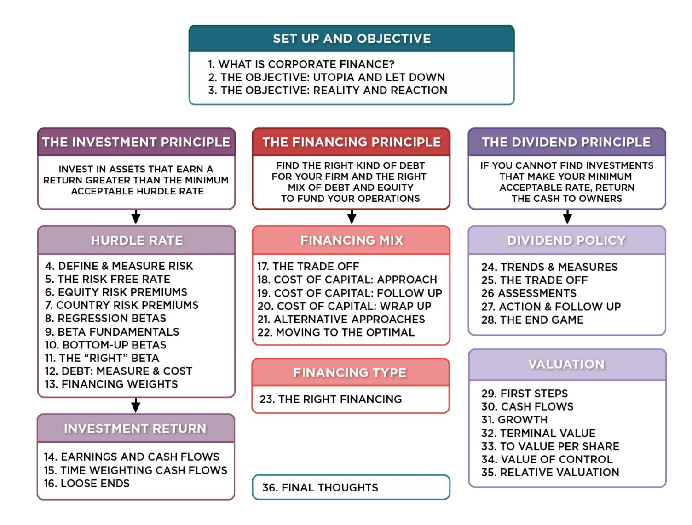
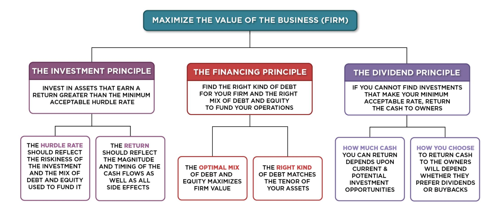
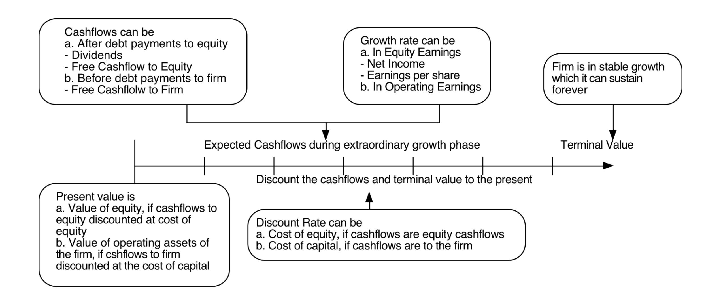
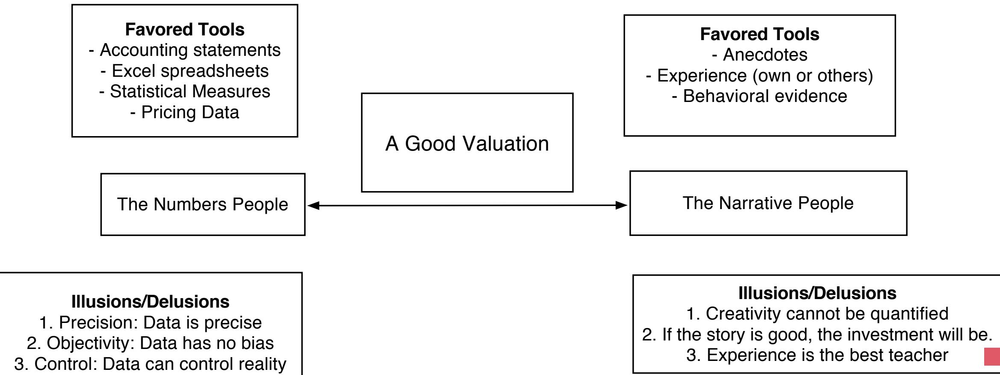
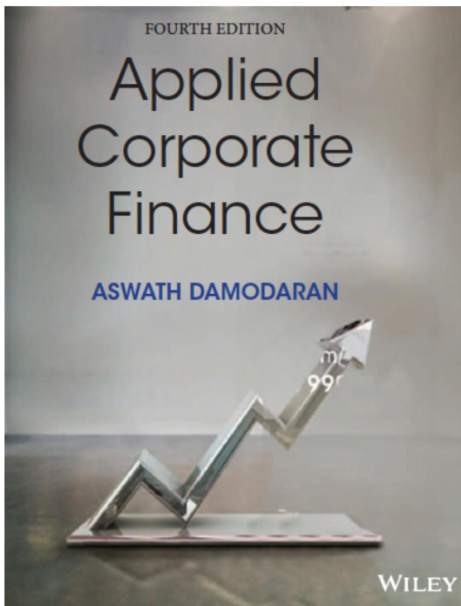

# **SESSION 29: FIRST STEPS**

Cynic: A person who knows the price of everything but the value of nothing..

### **SESSION 29: FIRST STEPS**

### **FIRST PRINCIPLES**

## **THREE APPROACHES TO VALUATION**

- Intrinsic valuation: The value of an asset is a function of its fundamentals – cash flows, growth and risk. In general, discounted cash flow models are used to estimate intrinsic value.
- Relative valuation: The value of an asset is estimated based upon what investors are paying for similar assets. In general, this takes the form of value or price multiples and comparing firms within the same business.
- Contingent claim valuation: When the cash flows on an asset are contingent on an external event, the value can be estimated using option pricing models.

### **ONE TOOL FOR ESTIMATING INTRINSIC VALUE: DISCOUNTED CASH FLOW VALUATION**

#### **Cash flows from existing assets**

The base earnings will reflect the earnings power of the existing assets of the firm, net of taxes and any reinvestment needed to sustain the base earnings.

#### **Value of growth**

The future cash flows will reflect expectations of how quickly earnings will grow in the future (as a positive) and how much the company will have to reinvest to generate that growth (as a negative). The net effect will determine the value of growth. Expected Cash Flow in year t = E(CF) = Expected Earnings in year t - Reinvestment needed for growth

#### **Risk in the Cash flows**

The risk in the investment is captured in the discount rate as a beta in the cost of equity and the default spread in the cost of debt.

#### **Steady state**

The value of growth comes from the capacity to generate excess returns. The length of your growth period comes from the strength & sustainability of your competitive advantages.

$$\text{Value of asset} = \frac{\text{E(CF}_1)}{(1+r)} + \frac{\text{E(CF}_2)}{(1+r)^2} + \frac{\text{E(CF}_3)}{(1+r)^3} \dots + \frac{\text{E(CF}_n)}{(1+r)^n}$$

### **EQUITY VALUATION**

- The value of equity is obtained by discounting expected cashflows to equity, i.e., the residual cashflows after meeting all expenses, tax obligations and interest and principal payments, at the cost of equity, i.e., the rate of return required by equity investors in the firm.

where,

CF to Equity t = Expected Cashflow to Equity in period t

ke = Cost of Equity

- The dividend discount model is a specialized case of equity valuation, and the value of a stock is the present value of expected future dividends.

$$\text{Value of Equity} = \sum_{t=1}^{t=n} \frac{\text{CF to Equity}_t}{(1+k_e)^t}$$

### **FIRM VALUATION**

- The value of the firm is obtained by discounting expected cashflows to the firm, i.e., the residual cashflows after meeting all operating expenses and taxes, but prior to debt payments, at the weighted average cost of capital, which is the cost of the different components of financing used by the firm, weighted by their market value proportions.

where,

CF to Firm t = Expected Cashflow to Firm in period t

WACC = Weighted Average Cost of Capital

$$\text{Value of Firm} = \sum_{t=1}^{t=n} \frac{\text{CF to Firm}_t}{(1+\text{WACC})^t}$$

## **CHOOSING A CASH FLOW TO DISCOUNT**

- When you cannot estimate the free cash flows to equity or the firm, the only cash flow that you can discount is dividends. For financial service firms, it is difficult to estimate free cash flows. For Deutsche Bank, we will be discounting dividends.
- If a firm's debt ratio is not expected to change over time, the free cash flows to equity can be discounted to yield the value of equity. For Tata Motors, we will discount free cash flows to equity.
- If a firm's debt ratio might change over time, free cash flows to equity become cumbersome to estimate. Here, we would discount free cash flows to the firm. For Vale and Disney, we will discount the free cash flow to the firm.

### **THE INGREDIENTS THAT DETERMINE VALUE.**

### **NARRATIVES AND NUMBERS**

## Applied Corporate Finance

### **Task**

Make a judgment on whether you want to value just the equity or the operating assets of your company.

Optional: Read Chapter 12