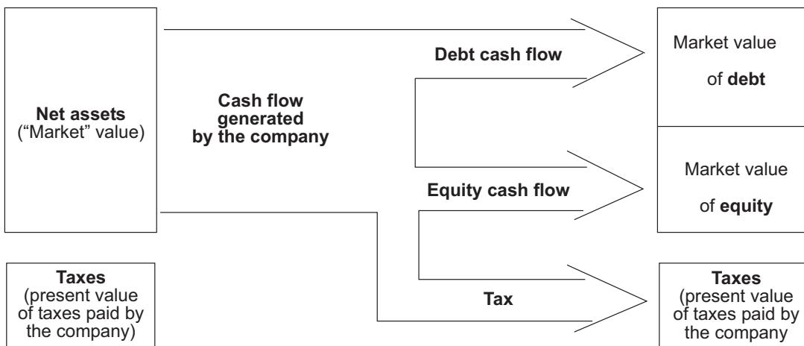
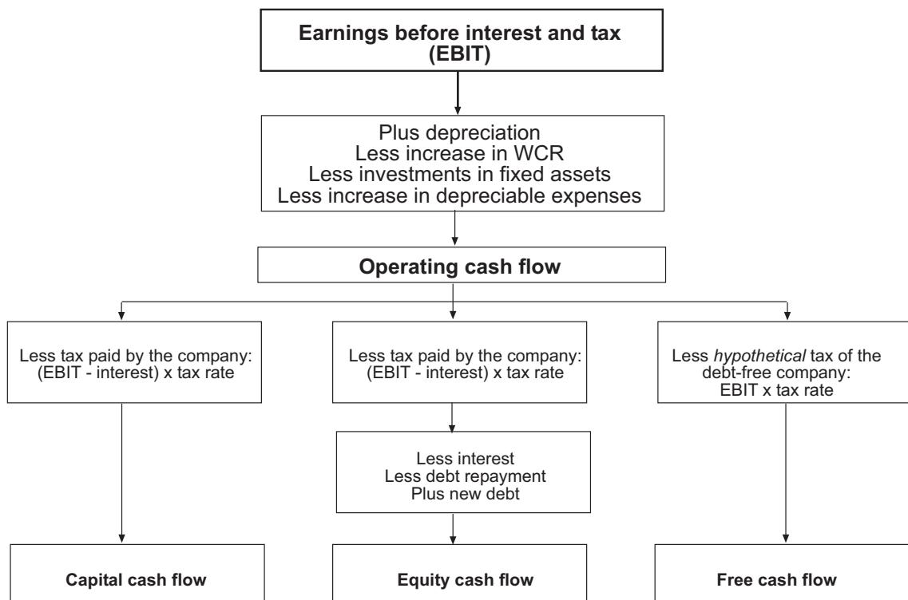

#### **CASH FLOW IS CASH AND IS A FACT: NET INCOME IS JUST AN OPINION**

Pablo Fernández

Working Paper WP no 629

May, 2006 CIIF

The CIIF, International Center for Financial Research, is an interdisciplinary center with an international outlook and a focus on teaching and research in finance. It was created at the beginning of 1992 to channel the financial research interests of a multidisciplinary group of professors at IESE Business School and has established itself as a nucleus of study within the School's activities.

Ten years on, our chief objectives remain the same:

- Find answers to the questions that confront the owners and managers of finance companies and the financial directors of all kinds of companies in the performance of their duties
- Develop new tools for financial management
- Study in depth the changes that occur in the market and their effects on the financial dimension of business activity

All of these activities are programmed and carried out with the support of our sponsoring companies. Apart from providing vital financial assistance, our sponsors also help to define the Center's research projects, ensuring their practical relevance.

The companies in question, to which we reiterate our thanks, are:

Aena, A.T. Kearney, Caja Madrid, Fundación Ramón Areces, Grupo Endesa, Telefónica and Unión Fenosa.

http://www.iese.edu/ciif/

#### **CASH FLOW IS CASH AND IS A FACT: NET INCOME IS JUST AN OPINION**

Pablo Fernández\*

## **Abstract**

A company's profit after tax (or net income) is quite an arbitrary figure, obtained after assuming certain accounting hypotheses regarding expenses and revenues. On the other hand, its cash flow is an objective measure, a single figure that is not subject to any personal criterion.

In general, to study a company's situation, it is more useful to operate with the cash flow (equity cash flow, free cash flow or capital cash flow) as it is a single figure, while the net income is one of several that can be obtained, depending on the criteria applied.

Profit after tax (PAT) is equal to the equity cash flow when the company is not growing, buys fixed assets for an amount identical to depreciation, keeps debt constant, and only writes off or sells fully depreciated assets. Profit after tax (PAT) is also equal to the equity cash flow when the company collects in cash, pays in cash, holds no stock (this company's working capital requirements are zero), and buys fixed assets for an amount identical to depreciation.

When making projections, the dividends and other forecast payments to shareholders must be exactly equal to expected equity cash flows.

\* Professor of Financial Management, PricewaterhouseCoopers Chair of Finance, IESE

#### **CASH FLOW IS CASH AND IS A FACT: NET INCOME IS JUST AN OPINION**

Even today, many analysts view net income as the key and only truly valid parameter for describing how a company is doing. According to this simple approach, if net income increases, the company is doing better; if net income falls, the company is doing worse. It is commonly said that a company that showed a higher net income last year "generated more wealth" for its shareholders than another company with a lower net income. Also, following the same logic, a company that has a positive net income "creates value" and a company that has losses "destroys value." Well, all these statements can be wrong.

Other analysts "refine" net income and calculate the so-called **"accounting cash flow,"** adding depreciation to the net income.1 They then make the same remarks as in the previous paragraph but referring to "cash flow" instead of net income. Of course, these statements too may be wrong.

The classic definition of net income (revenues for a period less the expenses that enabled these revenues to be obtained during that period), in spite of its conceptual simplicity, is based on a series of premises that seek to identify which expenses were necessary to obtain these revenues. This is not always a simple task and often implies accepting a number of assumptions. Issues such as the scheduling of expense accruals, the treatment of depreciation, calculating the product's cost, allowances for bad debts, etc., seek to identify, in the best possible manner, the quantity of resources that it was necessary to sacrifice in order to obtain the revenues. Although this "indicator," once we have accepted the premises used, can give us adequate information about how a company is doing, the figure obtained for the net income is often used without full knowledge of these hypotheses, which frequently leads to confusion.

Another possibility is to use an **objective measure**, which is not subject to any individual criterion. This is the difference between cash inflows and cash outflows, called cash flow in the strict sense: the money that has come into the company less the money that has gone out of it. Two definitions of cash flow in the strict sense are used: **equity cash flow** and **free cash flow**. Also, so-called **capital cash flow** is used. Generally speaking, it can be said that a company is doing better and "generates wealth" for its shareholders when the cash flows improve. In the following section, we will take a closer look at the definitions of these cash flows.

1 The sum of net income plus depreciation is often called "cash generated by operations" or "cash flow earnings." (see Anthony and Reece (1983), page 343). Net income is also called profit after tax (PAT).

#### **1. Accounting Cash Flow, Equity Cash Flow, Free Cash Flow and Capital Cash Flow**

Although the financial press often gives the following definition for accounting cash flow:

**Accounting cash flow** = profit after tax (PAT) + depreciation

we will use three different definitions of cash flow: equity cash flow (ECF), free cash flow (FCF) and capital cash flow (CCF).

**Equity cash flow (ECF)** is the money that remains available in the company after tax, having covered capital investment requirements and the increase in working capital requirements (WCR), having paid financial expenses, having repaid the debt's principal, and having received new debt.

The ECF represents the cash available in the company for its shareholders, which will be used for dividends or share repurchases. The equity cash flow in a period is simply the difference between cash inflows2 and cash outflows3 in that period.

**Equity cash flow =** cash inflows - cash outflows in a period

When making forecasts, the forecast equity cash flow4 in a period must be equal to forecast dividends plus share repurchases in that period.

**Free cash flow** is the cash flow generated by operations after tax, without taking into account the company's debt level, that is, without subtracting the company's interest expenses. It is, therefore, the cash that remains available in the company after having covered capital investment requirements and working capital requirements,5 assuming that there is no debt.6

The FCF is the company's **ECF** assuming that it has no debt.

**Free cash flow** = equity cash flow if the company has no debt

It is often said that the FCF represents the cash generated by the company for the providers of funds, that is, shareholders and debtholders.7 This is not true; the parameter that represents the cash generated by the company for its shareholders and debtholders is the *capital cash flow*.

**Capital cash flow** is the cash flow available for debtholders plus the equity cash flow. The cash flow for debtholders consists of the sum of the interest payments plus repayment of the principal (or less the increase in the principal).

#### **Capital cash flow** = equity cash flow + debt cash flow

Cash inflows normally consist of sums collected from customers and the increases in financial debt.

Cash outflows normally consist of payments to employees, suppliers, creditors, taxes... and interest payments and repayment of financial debt.

4 Equity cash flow is also called equity free cash flow and levered cash flow.

5 Some authors call it non-cash working capital investments. See, for example, Damodaran (2001, page 133)

6 Free cash flow is also called cash flow to the firm, free cash flow to the firm and unlevered cash flow.

7 See, for example, Damodaran (1994, page 144) and Copeland, Koller, and Murrin (2000, page 132).

#### **2. Calculating the Cash Flows**

**Equity cash flow** (ECF) corresponds to the concept of cash flow. The ECF in a period is the difference between all cash inflows and all cash outflows in that period. Consequently, the ECF is calculated as follows:

- Profit after tax (PAT) + Depreciation and amortization
- Increase in WCR (working capital requirements)
- Principal payments of financial debt + Increase in financial debt
- Increase in other assets
- Gross investment in fixed assets + Book value of disposals and sold fixed assets **ECF** (equity cash flow)

The ECF in a period is the increase in cash (above the minimum cash, whose increase is included in the increase in WCR) during that period, before dividend payments, share repurchases and capital increases.

The **free cash flow** (FCF) is equal to the hypothetical equity cash flow that the company would have had if it had no debt on the liabilities side of its balance sheet. Consequently, in order to calculate the FCF from the net income, the following operations must be performed:

- Profit after tax (PAT) + Depreciation and amortization
- Increase in WCR (working capital requirements)
- Increase in other assets
- Gross investment in fixed assets + Interest (1-T) + Book value of disposals and sold fixed assets

**FCF** (free cash flow)

Taking into account the above two calculations, it can be seen that, in the case of perpetuity, the relationship between ECF and FCF is the following:

### FCF = ECF + I (1-T) - ΔD

If the company has no debt in its liabilities, ECF and FCF are the same.

The **capital cash flow** (CCF) is the cash flow available for all debt and equity holders. It is the equity cash flow (ECF) plus the cash flow corresponding to the debtholders (CFd), which is equal to the interest received by the debt (I) less the increase in the debt's principal (∆D).

CFF = ECF + CFd = ECF + I - AD where I=DKd

The diagram below summarizes the company valuation approaches using discounted cash flows.

Another diagram that enables us to see the difference between the different cash flows is the following:8

Can a company have positive net income and negative cash flows? Of course: one has only to think of the many companies that file for voluntary reorganization after having a positive net income. This is precisely what happens to the company we show in the following example.

8 For a company without extraordinary net income or asset disposals.

## **3. A Company with Positive Net Income and Negative Cash Flows**

To give a better idea, we give an example in the four tables below. Table 1 shows the income statements for a company with strong growth in sales and also in net income. Table 2 shows the company's balance sheets. We assume that the minimum cash is zero. Table 3 shows that, even though the company generates a growing net income, the free cash flow is negative, and becomes increasingly negative with each year that passes. The equity cash flow is also negative. Table 4 is another way of explaining why the free cash flow is negative: because the cash inflows from operations were less than the cash outflows. Finally, Table 5 provides a few ratios and some additional information.

**Table 1** 

FausCommerce Income Statements

| Income Statement (million euros)                 | 1996  | 1997  | 1998  | 1999  | 2000  |
|--------------------------------------------------|-------|-------|-------|-------|-------|
| Sales                                            | 2,237 | 2,694 | 3,562 | 4,630 | 6,019 |
| Cost of sales                                    | 1,578 | 1,861 | 2,490 | 3,236 | 4,207 |
| Personnel expenses                               | 424   | 511   | 679   | 882   | 1,146 |
| Depreciation                                     | 25    | 28    | 39    | 34    | 37    |
| Other expenses                                   | 132   | 161   | 220   | 285   | 370   |
| Interest                                         | 62    | 73    | 81    | 96    | 117   |
| Extraordinary profits (disposal of fixed assets) |       | -15   | 32    |       |       |
| Taxes (30%)                                      | 4     | 13    | 25    | 29    | 42    |
| Profit after tax                                 | 12    | 32    | 60    | 68    | 100   |

1997: assets with a book value of €15 million were written off (gross fixed assets = €25 million; accumulated depreciation = €10 million).

1998: at the end of the year, assets with a book value of €28 million (gross fixed assets = €40 million; accumulated depreciation = €12 million) were sold for €60 million.

**Table 2** 

FausCommerce Balance Sheets

| Balance Sheet (million euros)              | 1996 | 1997  | 1998  | 1999  | 2000  |
|--------------------------------------------|------|-------|-------|-------|-------|
| Cash and temporary investments             | 32   | 28    | 26    | 25    | 25    |
| Accounts receivable                        | 281  | 329   | 439   | 570   | 742   |
| Inventories                                | 371  | 429   | 583   | 744   | 968   |
| Gross fixed assets (original cost)         | 307  | 335   | 342   | 375   | 410   |
| Accumulated depreciation                   | 50   | 68    | 95    | 129   | 166   |
| Net fixed assets                           | 257  | 267   | 247   | 246   | 244   |
| Total assets                               | 941  | 1,053 | 1,295 | 1,585 | 1,979 |
| Banks. Short-term debt                     | 402  | 462   | 547   | 697   | 867   |
| Taxes payable                              | 2    | 6     | 12    | 14    | 21    |
| Other expenses payable                     | 22   | 26    | 36    | 47    | 61    |
| Accounts payable                           | 190  | 212   | 303   | 372   | 485   |
| Long-term debt                             | 95   | 85    | 75    | 65    | 55    |
| Shareholders’ equity                       | 230  | 262   | 322   | 390   | 490   |
| Total liabilities and shareholders’ equity | 941  | 1,053 | 1,295 | 1,585 | 1,979 |

**Table 3** 

Faus Commerce Free Cash Flow, Equity Cash Flow, Debt Cash Flow and Capital Cash Flow

| Cash flow (million euros)                        | 1997 | 1998 | 1999 | 2000 |
|--------------------------------------------------|------|------|------|------|
| Profit after tax                                 | 32   | 60   | 68   | 100  |
| + depreciation                                   | 28   | 39   | 34   | 37   |
| - purchase of fixed assets                       | 53   | 47   | 33   | 35   |
| + book value of sold assets                      | 15   | 28   |      |      |
| - increase in WCR                                | 76   | 157  | 210  | 262  |
| + interest x (1 - 30%)                           | 51   | 57   | 67   | 82   |
| Free cash flow                                   | -3   | -20  | -74  | -78  |
| - interest x (1 - 30%)                           | 51   | 57   | 67   | 82   |
| + increase in short-term financial debt          | 60   | 85   | 150  | 170  |
| - principal payments in long-term financial debt | 10   | 10   | 10   | 10   |
| Equity cash flow                                 | -4   | -2   | -1   | 0    |
| Interest                                         | 73   | 81   | 96   | 117  |
| + principal payments in long-term financial debt | 10   | 10   | 10   | 10   |
| - increase in short-term financial debt          | 60   | 85   | 150  | 170  |
| Debt cash flow                                   | 23   | 6    | -44  | -43  |
| Capital cash flow                                | 19   | 4    | -45  | -43  |

**Table 4** 

FausCommerce Cash Inflows and Cash Outflows

**New Funding** (million euros)

| Cash inflows and cash outflows                        | 1997  | 1998  | 1999  | 2000  |
|-------------------------------------------------------|-------|-------|-------|-------|
| Cash inflows: collections from clients Cash outflows: | 2,646 | 3,452 | 4,499 | 5,847 |
| Payments to suppliers                                 | 1,897 | 2,553 | 3,328 | 4,318 |
| Labor                                                 | 511   | 679   | 882   | 1,146 |
| Other expenses                                        | 157   | 210   | 274   | 356   |
| Interest payments                                     | 73    | 81    | 96    | 117   |
| Tax                                                   | 9     | 19    | 27    | 35    |
| Capital expenditures                                  | 53    | 47    | 33    | 35    |
| Total cash outflows                                   | 2,700 | 3,589 | 4,640 | 6,007 |
| Cash inflows - cash outflows Financing:               | -54   | -137  | -141  | -160  |
| Increase in short-term debt                           | 60    | 85    | 150   | 170   |
| Reduction of cash                                     | 4     | 2     | 1     | 0     |
| Sale of fixed assets                                  | 0     | 60    |       |       |
| Payments of long-term debt                            | -10   | -10   | -10   | -10   |
| Source of funds                                       | 54    | 137   | 141   | 160   |

**Table 5**  FausCommerce Ratios

| RATIOS                              | 1996  | 1997  | 1998  | 1999  | 2000  |
|-------------------------------------|-------|-------|-------|-------|-------|
| Net income/sales                    | 0.5%  | 1.2%  | 1.7%  | 1.5%  | 1.7%  |
| Net income/net worth (mean)         | 5.4%  | 13.0% | 20.5% | 19.1% | 22.7% |
| Debt ratio                          | 68.4% | 67.9% | 66.3% | 66.6% | 65.8% |
| Days of debtors (collection period) | 45.8  | 44.6  | 45.0  | 45.0  | 45.0  |
| Days of suppliers (payment period)  | 40.3  | 40.3  | 41.8  | 40.0  | 40.0  |
| Days of stock                       | 85.8  | 84.1  | 85.5  | 84.0  | 84.0  |
| Cash ratio                          | 5.2%  | 4.0%  | 2.9%  | 2.2%  | 1.7%  |
| Sales growth                        | 27.9% | 20.4% | 32.2% | 30.0% | 30.0% |

#### **4. When Is Profit After Tax a Cash Flow?**

Using the formula that relates **profit after tax** with the equity cash flow, we can deduce that profit after tax (PAT) is the same as equity cash flow when the addends of the following equality, which have different signs, cancel out.

> **Equity cash flow** = profit after tax (PAT) + depreciation - gross investment in fixed assets - increase in WCR (working capital requirements) - decrease in financial debt + increase in financial debt - increase in other assets + book value of fixed assets sold

A particularly interesting case in which this happens is when the company is not growing (and therefore its customer, stock and supplier accounts remain constant), buys fixed assets for an amount identical to depreciation, keeps debt constant and only writes off or sells fully depreciated assets. Another case is that of a company which collects from its customers in cash, pays in cash to its suppliers, holds no stock (these three conditions can be summarized as this company's working capital requirements being zero), and buys fixed assets for an amount identical to depreciation.

# **5. When Is the Accounting Cash Flow a Cash Flow?**

Following the reasoning of the previous section, the accounting cash flow is equal to the equity cash flow in the case of a company that is not growing (and keeps its customer, stock and supplier accounts constant), keeps debt constant, only writes off or sells fully depreciated assets, and does *not* buy fixed assets. Also in the case of a company that collects from its customers in cash, pays in cash to its suppliers, holds no stock (this company's working capital requirements are zero), and does *not* buy fixed assets.

Is cash flow more useful than net income? This question cannot be answered if we have not defined beforehand who is the recipient of this information and what is the aim of analyzing the information. Also, both parameters come from the same accounting statements. But, as a general rule, yes: the reported net income is one among several that can be given (one opinion among many), while the equity cash flow or free cash flow is a fact: a single figure.

#### **6. Equity Cash Flow and Dividends**

We have already said that when making projections, the equity cash flow must be equal to the forecast dividends.9 When making projections, the forecast dividends must be exactly equal to the equity cash flow. Otherwise, we will be making hypotheses about what use is given to the part of the equity cash flow that is not to be used for dividends (cash, investments, repaying debt and so on) and it will be necessary to subtract it beforehand from the equity cash flow.

Distributing dividends in the form of shares is not stated as a cash flow because it isn't: the shareholder who receives shares now has more shares with a lower value but the same total value.

Let us look at an example. Tables 6 and 7 contain the forecast income statements and balance sheets for Santoma & Co, which plans to start operating at the end of 2001. The initial investment is €64 million, which is funded in equal proportions with long-term debt and equity. The company does not plan to distribute dividends in 2002, so as to reduce its mediumterm funding requirements for funding its working capital requirements.

**Table 6** 

Forecast Income Statements for Santoma & Co. (thousand euros)

| Year                    | 2002    | 2003    | 2004    | 2005    |
|-------------------------|---------|---------|---------|---------|
| Sales                   | 110,275 | 170,367 | 170,367 | 192,288 |
| Cost of sales           | 75,417  | 116,456 | 116,456 | 137,810 |
| Personnel expenses      | 10,735  | 10,950  | 10,950  | 11,169  |
| Depreciation            | 4,141   | 4,381   | 4,381   | 4,478   |
| Other expenses          | 9,532   | 6,872   | 6,872   | 6,885   |
| Interest                | 1,920   | 2,356   | 2,356   | 2,356   |
| Profit before tax (PBT) | 8,530   | 29,352  | 29,352  | 29,590  |
| Tax                     | 2,730   | 9,686   | 9,686   | 10,356  |
| Profit after tax (PAT)  | 5,801   | 19,666  | 19,666  | 19,233  |
| Dividends               | 0       | 18,388  | 19,666  | 8,817   |
| To reserves             | 5,801   | 1,278   | 0       | 10,417  |

9 When we say dividends, we are referring to payments to shareholders, which may be dividends, share repurchases, par value repayments, and so on.

**Table 7** 

Forecast Balance Sheets for Santoma & Co. (thousand euros)

| Assets                         | 2001   | 2002   | 2003   | 2004   | 2005   |
|--------------------------------|--------|--------|--------|--------|--------|
| Cash and temporary investments | 1,000  | 1,103  | 1,704  | 1,704  | 1,923  |
| Accounts receivable            |        | 18,788 | 21,471 | 21,471 | 24,234 |
| Inventories                    | 6,300  | 14,729 | 14,729 | 14,729 | 16,335 |
| Gross fixed assets             | 56,700 | 56,700 | 62,700 | 67,081 | 72,081 |
| Accumulated depreciation       | 0      | 4,141  | 8,522  | 12,903 | 17,381 |
| Net fixed assets               | 56,700 | 52,559 | 54,178 | 54,178 | 54,700 |
| Total assets                   | 64,000 | 87,179 | 92,082 | 92,082 | 97,191 |
| Liabilities                    | 2001   | 2002   | 2003   | 2004   | 2005   |
| Accounts payable               |        | 9,195  | 10,502 | 10,502 | 12,244 |
| Taxes payable                  |        | 910    | 3,229  | 3,229  | 3,452  |
| Medium-term financial debt     | 0      | 7,273  | 7,273  | 7,273  | 0      |
| Long-term financial debt       | 32,000 | 32,000 | 32,000 | 32,000 | 32,000 |
| Shareholders’ equity           | 32,000 | 37,801 | 39,078 | 39,078 | 49,495 |
| Total liabilities              | 64,000 | 87,179 | 92,082 | 92,082 | 97,191 |

Table 8 shows the company's different cash flows. It can be seen that the equity cash flow is equal to the forecast dividends.

It also enables another statement made in section 4 to be verified. As in 2004, the company:

- a) Does not grow (the income statement is identical to 2003);
- b) Keeps its working capital requirements constant;
- c) Keeps its financial debt constant; and
- d) Buys fixed assets for an amount identical to depreciation, the net income forecast for 2004 is identical to the forecast equity cash flow (and the forecast dividends).

**Table 8** 

Forecast Cash Flows for Santoma & Co. (thousand euros)

| Year                                    | 2001    | 2002   | 2003   | 2004   | 2005   |
|-----------------------------------------|---------|--------|--------|--------|--------|
| Net income (PAT)                        | 0       | 5,801  | 19,666 | 19,666 | 19,233 |
| + Depreciation                          | 0       | 4,141  | 4,381  | 4,381  | 4,478  |
| - Increase in WCR                       | 7,300   | 17,214 | -341   | 0      | 2,622  |
| - Increase in fixed assets              | 56,700  | 0      | 6,000  | 4,381  | 5,000  |
| + Increase in short-term financial debt | 0       | 7,273  | 0      | 0      | -7,273 |
| + Increase in long-term financial debt  | 32,000  | 0      | 0      | 0      | 0      |
| Equity cash flow                        | -32,000 | 0      | 18,388 | 19,666 | 8,817  |
| - Increase in short-term financial debt | 0       | 7,273  | 0      | 0      | -7,273 |
| - Increase in long-term financial debt  | 32,000  | 0      | 0      | 0      | 0      |
| + Interest (1-T)                        | 0       | 1,248  | 1,532  | 1,532  | 1,532  |
| Free cash flow                          | -64,000 | -6,025 | 19,920 | 21,197 | 17,621 |
| Accounting cash flow                    | 0       | 9,942  | 24,047 | 24,047 | 23,711 |
| Debt cash flow                          | -32,000 | -5,353 | 2,356  | 2,356  | 9,629  |
| Capital cash flow                       | -64,000 | -5,353 | 20,744 | 22,022 | 18,446 |
| Dividends                               |         | 0      | 18,388 | 19,666 | 8,817  |

#### **7. Recurrent Cash Flows**

Sometimes, people talk about recurrent equity cash flow and recurrent free cash flow. These cash flows are calculated in the same manner as the cash flows explained in this chapter, with just one difference: only the businesses in which the company was already present at the beginning of the year are considered. Therefore, net income, increases in WCR, increases in depreciable expenses or gross investment in fixed assets arising from acquisitions of companies, new business lines and, in general, investments in businesses that are still incipient, are not included.

#### **8. Summary**

A company's profit after tax (or net income) is quite an arbitrary figure, obtained after assuming certain accounting hypotheses regarding expenses and revenues. On the other hand, the cash flow is an objective measure, a single figure that is not subject to any personal criterion.

In general, to study a company's situation, it is more useful to operate with the cash flow (ECF, FCF or CCF) as it is a single figure, while the net income is one of several that can be obtained, depending on the criteria applied.

Profit after tax (PAT) is equal to the equity cash flow when the company is not growing (and keeps its customer, inventory and supplier accounts constant), buys fixed assets for an amount identical to depreciation, keeps debt constant, and only writes off or sells fully depreciated assets.

Profit after tax (PAT) is also equal to the equity cash flow when the company collects in cash, pays in cash, holds no stock (this company's working capital requirements are zero), and buys fixed assets for an amount identical to depreciation.

The accounting cash flow is equal to the equity cash flow in the case of a company that is not growing (and keeps its customer, inventory and supplier accounts constant), keeps debt constant, only writes off or sells fully depreciated assets and does *not* buy fixed assets.

When making projections, the dividends and other payments to shareholders forecast must be exactly equal to expected equity cash flows.

#### **Appendix 1**

Attention to the Accounting and the Managing of Net Income

When analyzing accounting statements, which are used by most listed companies, it is important to consider the accounting standards the techniques used by the firm. The most important are:

- Recognition of revenues. Some firms recognize revenues too early and others too late: companies have some degree of freedom to recognize revenues.10
- Capitalizing expenses. Companies may make payments that do not appear in the income statement but are entered directly as an increase in assets (capitalized). For example, oil companies capitalize exploration costs,11 electric utilities capitalize interest expenses, and so on.
- Use of accrual and reserves. Firms may build up accruals and reserves for court settlements, consumer demands, bad debts, and other potential losses and expected payments. However, many firms build up excess accruals and reserves in good years to use this excess in bad years. By doing that, companies smooth out net income.
- Extraordinary profits from investments. Many firms hold in their balance-sheets marketable securities valued below their market values and sell these investments in bad years to smooth out net income.
- In many countries outside the U.S. it is quite easy for some companies to charge some payments against retained earnings, without going through the profit and loss statements. This is the case of the staff reduction costs due to early retirement incurred by the Spanish banks. The table below shows the charges to retained earnings for early retirement costs incurred by the main Spanish banks:

| (Million euros) | 1996 | 1997 | 1998 | 1999 | 2000e | Total |
|-----------------|------|------|------|------|-------|-------|
| BBVA            | 0    | 225  | 395  | 384  | 666   | 1,670 |
| BSCH            | 250  | 56   | 210  | 802  | 480   | 1,798 |
| Popular         | 60   | 72   | 102  | 106  | 0     | 340   |

When analyzing international consolidated accounting statements, which are used by most listed companies, it is important to take into account the consolidation method used. Readers interested in a more detailed discussion of this subject are recommended to read chapter 25 of the book *Contabilidad para dirección* written by my colleagues at IESE's control department, headed by Professor Pereira Pereira, (F., E. Ballarín, M. J. Grandes, J. M. Rosanas and J. C.

10 See, for example, "The O. M. Scott & Sons Company", (Unknown author), Harvard Business School case N. 9-209- 102

11 See, for example, "Gulf Oil Corp.-Takeover", (Unknown author), Harvard Business School case N. 9-285-053

Vazquez-Dodero (2000), *Contabilidad para dirección*, 17th edition, Eunsa.) There are three ways of consolidating the purchase of another company's shares:

- Passive consolidation. The shares purchased are entered in the assets at purchase cost, the dividends received are entered as financial income, and the proceeds of the sale of the shares are entered as extraordinary income. In addition, a provision must be made for future losses, including potential losses. In order to calculate the provisions, the reference taken must be the share's price on the stock market.
- Equity method. Recommended for holdings between 20%-50% in unlisted companies and 3%-5% in listed companies. The shares purchased are entered in the assets at purchase cost (distributed between the shares' book value and goodwill); the corresponding percentage of the net income appears in the income statement (the balancing entry in the investment); the dividends received are entered as a decrease in the investment; and the proceeds of the sale of the shares are entered as extraordinary income. The goodwill generated in the purchase (difference between the shares' purchase value and book value) is depreciated over 20 years.
- Overall consolidation. In this case, the income statements and the balance sheets are added together, eliminating the accounting operations that start and end within the group. If the company is not fully owned, the percentage of the net income corresponding to outside partners is deducted from the income statement. On the liabilities side, the quantity of shareholders' equity corresponding to outside partners, also called minority holdings, is also indicated.

It is important to adequately analyze consolidation in order to correctly calculate the cash flows generated by the company. To calculate the cash flows in the case of overall consolidation, each company must be analyzed separately.

An excellent book on the analysis of financial statements is Penman, Stephen H. (2001), *Financial Statement Analysis and Security Valuation,* McGraw-Hill. Chapters 7 to 12 provide a very useful guide for interpreting balance sheets and income statements.

#### **References**

Anthony, R. N. and J. S. Reece (1983), *Accounting: Text and Cases*, Homewood Ill.: Irwin. Copeland, T. E., T. Koller, and J. Murrin (2000), *Valuation: Measuring and Managing the Value of Companies,* Third edition. New York: Wiley. Damodaran, Aswath (1994), *Damodaran on Valuation*, New York: John Wiley and Sons. Damodaran, Aswath (2001), *The Dark Side of Valuation*, New York: Prentice-Hall. Pereira, F., E. Ballarín, M. J. Grandes, J. M. Rosanas and J. C. Vazquez-Dodero (2000), *Contabilidad para dirección*, 17th edition, Eunsa. Penman, Stephen H. (2001), *Financial Statement Analysis and Security Valuation,* McGraw-Hill Unknown author, "Gulf Oil Corp.-Takeover", Harvard Business School case N. 9-285-053 Unknown author, "The O. M. Scott & Sons Company", Harvard Business School case N. 9-209- 102