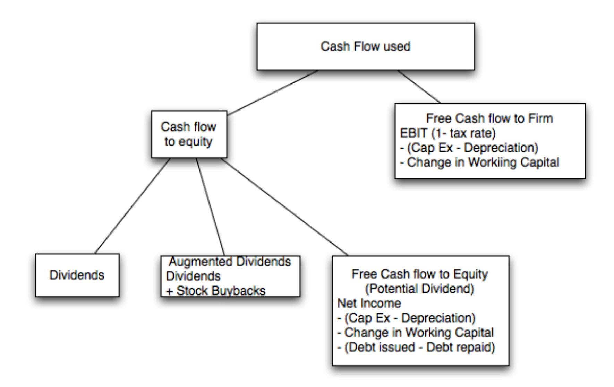
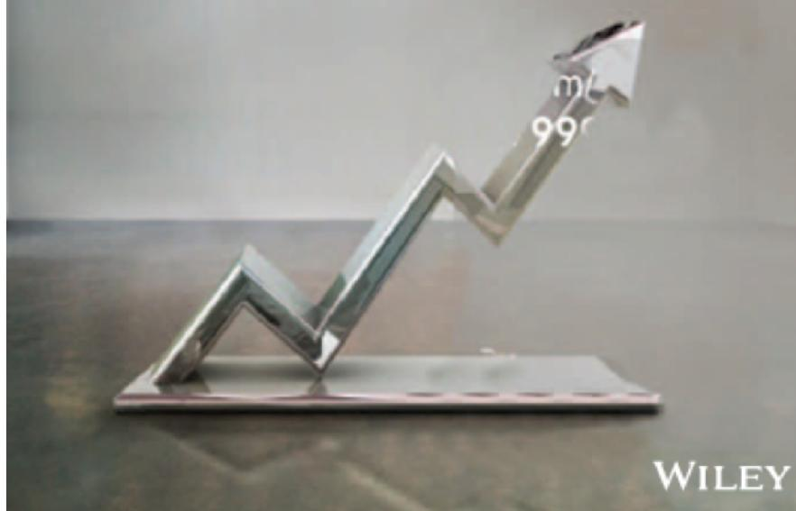

# **SESSION 30: CASH FLOWS**

Cash is king.

# SESSION 30: CASH FLOWS

## SET UP AND OBJECTIVE

1. 1. WHAT IS CORPORATE FINANCE?
2. 2. THE OBJECTIVE: UTOPIA AND LET DOWN
3. 3. THE OBJECTIVE: REALITY AND REACTION

### THE INVESTMENT PRINCIPLE

INVEST IN ASSETS THAT EARN A RETURN GREATER THAN THE MINIMUM ACCEPTABLE HURDLE RATE

#### HURDLE RATE

1. 4. DEFINE & MEASURE RISK
2. 5. THE RISK FREE RATE
3. 6. EQUITY RISK PREMIUMS
4. 7. COUNTRY RISK PREMIUMS
5. 8. REGRESSION BETAS
6. 9. BETA FUNDAMENTALS
7. 10. BOTTOM-UP BETAS
8. 11. THE "RIGHT" BETA
9. 12. DEBT: MEASURE & COST
10. 13. FINANCING WEIGHTS

#### INVESTMENT RETURN

1. 14. EARNINGS AND CASH FLOWS
2. 15. TIME WEIGHTING CASH FLOWS
3. 16. LOOSE ENDS

### THE FINANCING PRINCIPLE

FIND THE RIGHT KIND OF DEBT FOR YOUR FIRM AND THE RIGHT MIX OF DEBT AND EQUITY TO FUND YOUR OPERATIONS

#### FINANCING MIX

1. 17. THE TRADE OFF
2. 18. COST OF CAPITAL: APPROACH
3. 19. COST OF CAPITAL: FOLLOW UP
4. 20. COST OF CAPITAL: WRAP UP
5. 21. ALTERNATIVE APPROACHES
6. 22. MOVING TO THE OPTIMAL

#### FINANCING TYPE

1. 23. THE RIGHT FINANCING

1. 36. FINAL THOUGHTS

### THE DIVIDEND PRINCIPLE

IF YOU CANNOT FIND INVESTMENTS THAT MAKE YOUR MINIMUM ACCEPTABLE RATE, RETURN THE CASH TO OWNERS

#### DIVIDEND POLICY

1. 24. TRENDS & MEASURES
2. 25. THE TRADE OFF
3. 26. ASSESSMENTS
4. 27. ACTION & FOLLOW UP
5. 28. THE END GAME

#### VALUATION

1. 29. FIRST STEPS
2. 30. CASH FLOWS
3. 31. GROWTH
4. 32. TERMINAL VALUE
5. 33. TO VALUE PER SHARE
6. 34. VALUE OF CONTROL
7. 35. RELATIVE VALUATION

## **I. ESTIMATING CASH FLOWS**

## **DIVIDENDS AND MODIFIED DIVIDENDS FOR DEUTSCHE BANK**

- In 2007, Deutsche Bank paid out dividends of €2,146 million on net income of €6,510 million. In early 2008, we valued Deutsche Bank using the dividends it paid in 2007. In my 2008 valuation, I am assuming the dividends are not only reasonable, but also sustainable.
- In November 2013, Deutsche Bank's dividend policy was in flux. Not only did it report losses, but it was on a pathway to increase its regulatory capital ratio. Rather than focus on the dividends (which were small), we estimated the potential dividends (by estimating the free cash flows to equity after investments in regulatory capital).

#### **ESTIMATING FCFE (PAST): TATA MOTORS**

|           |            |          |              |              |                |                     | Equity   |
|-----------|------------|----------|--------------|--------------|----------------|---------------------|----------|
| Year      | Net Income | Cap Ex   | Depreciation | Change in WC | Change in Debt | Equity Reinvestment |          |
| 2008-09   | -25,053₹   | 99,708₹  | 25,072₹      | 13,441₹      | 25,789₹        | 62,288₹             | -248.63% |
| 2009-10   | 29,151₹    | 84,754₹  | 39,602₹      | -26,009₹     | 5,605₹         | 13,538₹             | 46.44%   |
| 2010-11   | 92,736₹    | 81,240₹  | 46,510₹      | 50,484₹      | 24,951₹        | 60,263₹             | 64.98%   |
| 2011-12   | 135,165₹   | 138,756₹ | 56,209₹      | 22,801₹      | 30,846₹        | 74,502₹             | 55.12%   |
| 2012-13   | 98,926₹    | 187,570₹ | 75,648₹      | 680₹         | 32,970₹        | 79,632₹             | 80.50%   |
| Aggregate | 330,925₹   | 592,028₹ | 243,041₹     | 61,397₹      | 120,160₹       | 290,224₹            | 87.70%   |

#### **ESTIMATING FCFF: DISNEY**

- In the fiscal year ended September 2013, Disney reported the following: o Operating income (adjusted for leases) = \$10,032 million o Effective tax rate = 31.02% o Capital Expenditures (including acquisitions) = \$5,239 million o Depreciation & Amortization = \$2,192 million o Change in non-cash working capital = \$103 million
- The free cash flow to the firm can be computes as follows: After-tax Operating Income = 10,032 (1 – 0.3102) = \$6,920
  - Net Cap Expenditures = \$5,239 \$2,192 = \$3,629 Change in Working Capital = \$103 = Free Cash Flow to Firm (FCFF) = \$3,188
- The reinvestment and reinvestment rate are as follows: o Reinvestment = \$3,629 + \$103 = \$3,732 million o Reinvestment Rate = \$3,732 / \$6,920 = 53.93%

## **II. DISCOUNT RATES**

- Critical ingredient in discounted cash flow valuation. Errors in estimating the discount rate or mismatching cash flows and discount rates can lead to serious errors in valuation.
- At an intuitive level, the discount rate used should be consistent with both the riskiness and the type of cash flow being discounted.
- The cost of equity is the rate at which hwe discount cash flows to equity (dividends or free cash flows to equity). The cost of capital is the rate at which we discount free cash flows to the firm.

## **COST OF EQUITY: DEUTSCHE BANK (2008 VERSUS 2013)**

- In early 2008, we estimated a beta of 1.162 for Deutsche Bank which, used in conjunction with the Euro risk-free rate of 4% (in January 2008) and an equity risk premium of 4.50%, yielded a cost of equity of 9.23%. Cost of EquityJan 2008 = Riskfree RateJan 2008 + Beta \* Mature Market Risk Premium = 4.00% + 1.162 (4.5%) = 9.23%
- In November 2013, the Euro risk-free rate had dropped to 1.75% and Deutsche's equity risk premium had risen to 6.12%: Cost of EquityNov 2013 = Riskfree RateNov 2013 + Beta (ERP) = 1.75% +1.1516 (6.12%) = 8.80%

$$\begin{aligned} \text{Cost of Equity}_{\text{Jan 2008}} &= \text{Riskfree Rate}_{\text{Jan 2008}} + \text{Beta} * \text{Mature Market Risk Premium} \\ &= 4.00\% + 1.162 (4.5\%) = 9.23\% \end{aligned}$$

## **COST OF EQUITY: TATA MOTORS**

- We will be valuing Tata Motors in rupee terms. That is a choice. Any company can be valued in any currency.
- Earlier, we estimated a levered beta for equity of 1.1007 for Tata Motors' operating assets. Since we will be discounting FCFE with the income from cash included in the cash, we recomputed a beta for Tata Motors as a company (with cash):

Levered BetaCompany = 1.1007 (1428/1630) + ) (202/1630) = 0.964

- With a nominal rupee risk-free rate of 6.57% and an equity risk premium of 7.19% for Tata Motors, we arrive at a cost of equity of 13.50%.

Cost of Equity = 6.57% + 0.964 (7.19%) = 13.50%

## **CURRENT COST OF CAPITAL: DISNEY**

- The beta for Disney's stock in November 2013 was 1.0013. The T-Bond rate at that time was 2.75%. Using an estimated equity risk premium of 5.76%, we estimated the cost of equity for Disney to be 8.52%:

Cost of Equity = 2.75% +1.0013 (5.76%) = 8.52%

- Disney's bond rating in May 2009 was A and, based on this rating, the estimated pre-tax cosst of debt for Disney is 3.75%. Using a marginal tax rate of 36.1, the after-tax cost of debt for Disney is 2.40%.

After-Tax Cost of Debt – 3.75% (1 – 0.361) = 2.40%

- The cost of capital was calculated using these costs and the weights based on market values of equity (121,878) and debt (15,961):

Cost of capital = 8.52% 
$$\frac{121,878}{(15,961+121,878)} + 2.40\% \frac{15,961}{(15,961+121,878)} = 7.81\%$$

#### **BUT COSTS OF EQUITY AND CAPITAL CAN AND SHOULD CHANGE OVER TIME . . .**

| Year | Beta   | Cost of Equity | After-tax Cost of Debt | Debt Ratio | Cost of capital |
|------|--------|----------------|------------------------|------------|-----------------|
| 1    | 1.0013 | 8.52%          | 2.40%                  | 11.50%     | 7.81%           |
| 2    | 1.0013 | 8.52%          | 2.40%                  | 11.50%     | 7.81%           |
| 3    | 1.0013 | 8.52%          | 2.40%                  | 11.50%     | 7.81%           |
| 4    | 1.0013 | 8.52%          | 2.40%                  | 11.50%     | 7.81%           |
| 5    | 1.0013 | 8.52%          | 2.40%                  | 11.50%     | 7.81%           |
| 6    | 1.0010 | 8.52%          | 2.40%                  | 13.20%     | 7.71%           |
| 7    | 1.0008 | 8.51%          | 2.40%                  | 14.90%     | 7.60%           |
| 8    | 1.0005 | 8.51%          | 2.40%                  | 16.60%     | 7.50%           |
| 9    | 1.0003 | 8.51%          | 2.40%                  | 18.30%     | 7.39%           |
| 10   | 1.0000 | 8.51%          | 2.40%                  | 20.00%     | 7.29%           |

## Applied Corporate Finance

Optional: Read Chapter 12

**Task** Estimate the base year's cash flows and current discount rate for your firm.