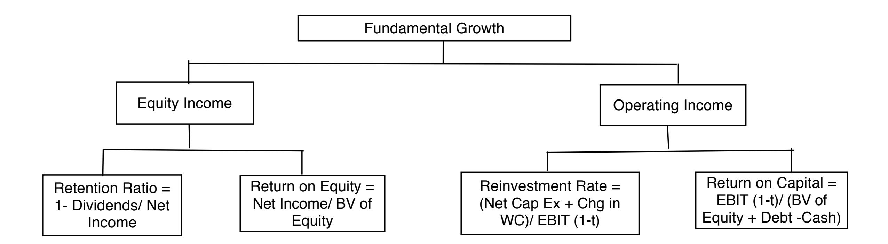
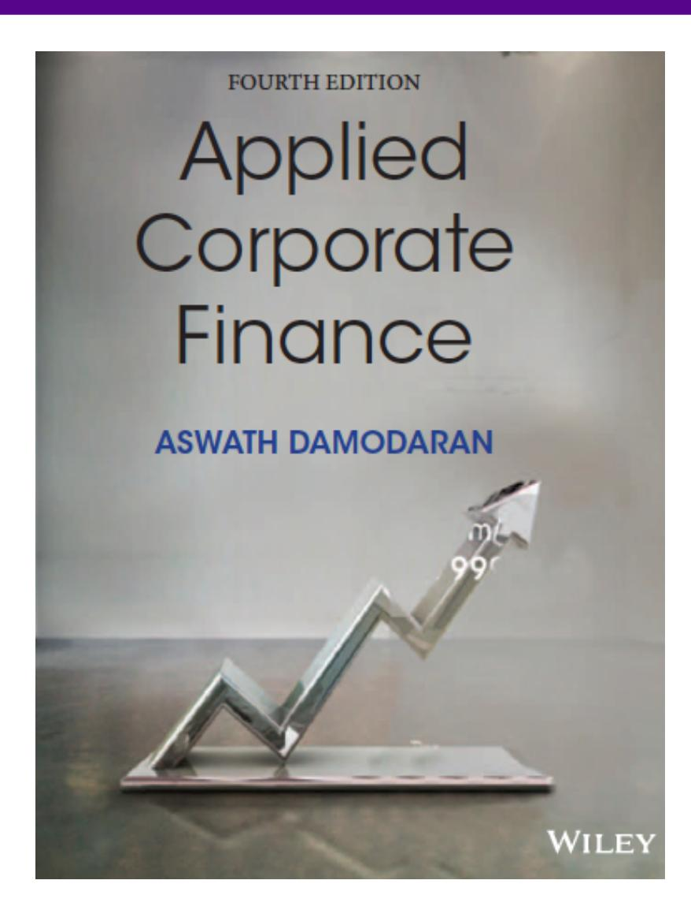

# **SESSION 31: GROWTH**

You will be wrong 100% of the time and it is okay.

# SESSION 31: GROWTH

## SET UP AND OBJECTIVE

1. 1. WHAT IS CORPORATE FINANCE?
2. 2. THE OBJECTIVE: UTOPIA AND LET DOWN
3. 3. THE OBJECTIVE: REALITY AND REACTION

### THE INVESTMENT PRINCIPLE

INVEST IN ASSETS THAT EARN A RETURN GREATER THAN THE MINIMUM ACCEPTABLE HURDLE RATE

#### HURDLE RATE

1. 4. DEFINE & MEASURE RISK
2. 5. THE RISK FREE RATE
3. 6. EQUITY RISK PREMIUMS
4. 7. COUNTRY RISK PREMIUMS
5. 8. REGRESSION BETAS
6. 9. BETA FUNDAMENTALS
7. 10. BOTTOM-UP BETAS
8. 11. THE "RIGHT" BETA
9. 12. DEBT: MEASURE & COST
10. 13. FINANCING WEIGHTS

#### INVESTMENT RETURN

1. 14. EARNINGS AND CASH FLOWS
2. 15. TIME WEIGHTING CASH FLOWS
3. 16. LOOSE ENDS

### THE FINANCING PRINCIPLE

FIND THE RIGHT KIND OF DEBT FOR YOUR FIRM AND THE RIGHT MIX OF DEBT AND EQUITY TO FUND YOUR OPERATIONS

#### FINANCING MIX

1. 17. THE TRADE OFF
2. 18. COST OF CAPITAL: APPROACH
3. 19. COST OF CAPITAL: FOLLOW UP
4. 20. COST OF CAPITAL: WRAP UP
5. 21. ALTERNATIVE APPROACHES
6. 22. MOVING TO THE OPTIMAL

#### FINANCING TYPE

1. 23. THE RIGHT FINANCING

1. 36. FINAL THOUGHTS

### THE DIVIDEND PRINCIPLE

IF YOU CANNOT FIND INVESTMENTS THAT MAKE YOUR MINIMUM ACCEPTABLE RATE, RETURN THE CASH TO OWNERS

#### DIVIDEND POLICY

1. 24. TRENDS & MEASURES
2. 25. THE TRADE OFF
3. 26. ASSESSMENTS
4. 27. ACTION & FOLLOW UP
5. 28. THE END GAME

#### VALUATION

1. 29. FIRST STEPS
2. 30. CASH FLOWS
3. 31. GROWTH
4. 32. TERMINAL VALUE
5. 33. TO VALUE PER SHARE
6. 34. VALUE OF CONTROL
7. 35. RELATIVE VALUATION

# **HISTORICAL GROWTH & OUTSIDE ESTIMATES**

- Historical growth is a function of the time period you look at (starting and ending points), the measure of earnings you look at and a function of your averaging approach. It is also not a particularly good predictor of the future.
- Outside estimates (from analysts or managers) is not only biased but tend not to be very good, especially for longer term forecasts.

# **EXPECTED GROWTH AND FUNDAMENTALS**

- In 2007, Deutsche Bank reported net income of 6.51 billion Euros on a book value of equity of 33.475 billion Euros at the start of the year (end of 2006), and paid out 2.146 billion Euros as dividends.

| Return on Equity = | $\frac{\text{Net Income}_{2007}}{\text{Book Value of Equity}_{2006}} = \frac{6,510}{33,475} = 19.45\%$ |
|--------------------|--------------------------------------------------------------------------------------------------------|
|--------------------|--------------------------------------------------------------------------------------------------------|

| Retention Ratio = | $1 - \frac{\text{Dividends}}{\text{Net Income}} = 1 - \frac{2,146}{6,510} = 67.03\%$ |
|-------------------|--------------------------------------------------------------------------------------|
|-------------------|--------------------------------------------------------------------------------------|

- If Deutsche Bank maintains the return on equity (ROE) and retention ratio that it delivered in 2007 for the long run: €

Expected Growth Rate Existing Fundamentals = 0.6703 \* 0.1945 = 13.04%

- If we replace the net income in 2007 with average net income of \$3,954 million, from 2003 to 2007:

| Normalized Return on Equity = | Average Net Income 2003-07 | $= \frac{3,954}{33,475} = 11.81\%$ |
|-------------------------------|---------------------------------------|------------------------------------|
|                               | Book Value of Equity 2006             |                                    |

| Normalized Retention Ratio = | $1 - \frac{\text{Dividends}}{\text{Net Income}} = 1 - \frac{2,146}{3,954} = 45.72\%$ |
|------------------------------|--------------------------------------------------------------------------------------|
|------------------------------|--------------------------------------------------------------------------------------|

- Expected Growth Rate Normalized Fundamentals = 0.4572 \* 0.1181 = 5.40%

# **ESTIMATING GROWTH IN NET INCOME: TATA MOTORS**

|           |            |          |              |              |                |                     | Equity   |
|-----------|------------|----------|--------------|--------------|----------------|---------------------|----------|
| Year      | Net Income |          |              |              |                |                     |          |
|           |            | Cap Ex   | Depreciation | Change in WC | Change in Debt | Equity Reinvestment |          |
| 2008-09   | -25,053₹   | 99,708₹  | 25,072₹      | 13,441₹      | 25,789₹        | 62,288₹             | -248.63% |
| 2009-10   | 29,151₹    | 84,754₹  | 39,602₹      | -26,009₹     | 5,605₹         | 13,538₹             | 46.44%   |
| 2010-11   | 92,736₹    | 81,240₹  | 46,510₹      | 50,484₹      | 24,951₹        | 60,263₹             | 64.98%   |
| 2011-12   | 135,165₹   | 138,756₹ | 56,209₹      | 22,801₹      | 30,846₹        | 74,502₹             | 55.12%   |
| 2012-13   | 98,926₹    | 187,570₹ | 75,648₹      | 680₹         | 32,970₹        | 79,632₹             | 80.50%   |
| Aggregate | 330,925₹   | 592,028₹ | 243,041₹     | 61,397₹      | 120,160₹       | 290,224₹            | 87.70%   |

|           |            | BV	of	Equity	at	start	of |         |
|-----------|------------|--------------------------|---------|
| Year      | Net	Income |                          |         |
|           |            | the	year                 | ROE     |
| 2008-09   | -25,053₹   | 91,658₹                  | -27.33% |
| 2009-10   | 29,151₹    | 63,437₹                  | 45.95%  |
| 2010-11   | 92,736₹    | 84,200₹                  | 110.14% |
| 2011-12   | 135,165₹   | 194,181₹                 | 69.61%  |
| 2012-13   | 98,926₹    | 330,056₹                 | 29.97%  |
| Aggregate | 330,925₹   | 763,532₹                 | 43.34%  |

|                   | 2013	value | Average values: 2008-2013 |
|-------------------|------------|---------------------------|
| Reinvestment	rate | 80.50%     | 87.70%                    |
| ROE               | 29.97%     | 43.34%                    |
| Expected	growth   | 24.13%     | 38.01%                    |

# **ROE AND LEVERAGE**

- A high ROE, other things remaining equal, should yield a higher expected growth rate in equity earnings.
- The ROE for a firm is a function of both the quality of its investments and how much debt it uses in funding these investments. In particular

ROE = ROC + D/E (ROC - i (1-t))

where,

ROC = (EBIT (1 - tax rate)) / (Book Value of Capital)

BV of Capital = BV of Debt + BV of Equity - Cash

D/E = Debt/ Equity ratio

i = Interest rate on debt

t = Tax rate on ordinary income.

# **DECOMPOSING ROE**

- Assume that you are analyzing a company with a 15% return on capital, an after-tax cost of debt of 5% and a book debt to equity ratio of 100%. Estimate the ROE for this company.
- Now assume that another company in the same sector has the same ROE as the company that you have just analyzed but no debt. Will these two firms have the same growth rates in earnings per share if they have the same dividend payout ratio?
- Will they have the same equity value?

# **ESTIMATING GROWTH IN EBIT: DISNEY**

- We started with the reinvestment rate that we computed from the 2013 financial statements:

Reinvestment rate = 
$$\frac{(3,629 + 103)}{10,032 (1-3,102)} = 53.93\%$$

We computed the reinvestment rate in prior years to ensure that the 2013 values were not unusual or outliers.

- We compute the return on capital, using operating income in 2013 and capital invested at the start of the year:

Return on Capital2013 = EBIT (1-t) (BV of Equity+ BV of Debt - Cash) = 10, 032 (1-.361) (41,958+ 16,328 - 3,387) =12.61%

Disney's return on capital has improved gradually over the last decade and has levelled off in the last two years.

- If Disney maintains its 2013 reinvestment rate and return on capital for the next five years, its growth rate will be 6.80 percent.

Expected Growth Rate from Existing Fundamentals = 53.93% \* 12.61% = 6.8%

#### **WHEN EVERYTHING IS IN FLUX: CHANGING GROWTH AND MARGINS**

- The elegant connection between reinvestment and growth in operating income breaks down, when you have a company in transition, where margins are changing over time.
- If that is the case, you have to estimate cash flows in three steps: o Forecast revenue growth and revenues in future years, taking into account market potential and competition. o Forecast a "target" margin in the future and a pathway from current margins to the target. o Estimate reinvestment from revenues, using a sales to capital ratio (measuring the dollars of revenues you get from each dollar of investment).

# **HERE IS AN EXAMPLE: BAIDU'S EXPECTED FCFF**

|      | Revenue |           | Operating |          |          |            | Chg in   | Sales/Capit | Reinvestmen |          |
|------|---------|-----------|-----------|----------|----------|------------|----------|-------------|-------------|----------|
|      | growth  | Revenues  |           |          |          |            |          |             |             |          |
|      |         |           | Margin    | EBIT     | Tax rate | EBIT (1-t) |          |             |             |          |
|      |         |           |           |          |          |            | Revenues |             | t           | FCFF     |
| year |         | \$28,756  | 48.72%    | \$14,009 | 16.31%   | \$11,724   |          | 2.64        |             |          |
| 1    | 25.00%  | \$35,945  | 47.35%    | \$17,019 | 16.31%   | \$14,243   | \$7,189  | 2.64        | \$2,722     | \$11,521 |
| 2    | 25.00%  | \$44,931  | 45.97%    | \$20,657 | 16.31%   | \$17,288   | \$8,986  | 2.64        | \$3,403     | \$13,885 |
| 3    | 25.00%  | \$56,164  | 44.60%    | \$25,051 | 16.31%   | \$20,965   | \$11,233 | 2.64        | \$4,253     | \$16,712 |
| 4    | 25.00%  | \$70,205  | 43.23%    | \$30,350 | 16.31%   | \$25,400   | \$14,041 | 2.64        | \$5,316     | \$20,084 |
| 5    | 25.00%  | \$87,756  | 41.86%    | \$36,734 | 16.31%   | \$30,743   | \$17,551 | 2.64        | \$6,646     | \$24,097 |
| 6    | 20.70%  | \$105,922 | 40.49%    | \$42,885 | 18.05%   | \$35,145   | \$18,166 | 2.64        | \$6,878     | \$28,267 |
| 7    | 16.40%  | \$123,293 | 39.12%    | \$48,227 | 19.79%   | \$38,685   | \$17,371 | 2.64        | \$6,577     | \$32,107 |
| 8    | 12.10%  | \$138,212 | 37.74%    | \$52,166 | 21.52%   | \$40,938   | \$14,918 | 2.64        | \$5,649     | \$35,289 |
| 9    | 7.80%   | \$148,992 | 36.37%    | \$54,191 | 23.26%   | \$41,585   | \$10,781 | 2.64        | \$4,082     | \$37,503 |
| 10   | 3.50%   | \$154,207 | 35.00%    | \$53,972 | 25.00%   | \$40,479   | \$5,215  | 2.64        | \$1,974     | \$38,505 |

Optional: Read Chapter 12

**Task** Estimate the expected growth/future cash flows for your firm.