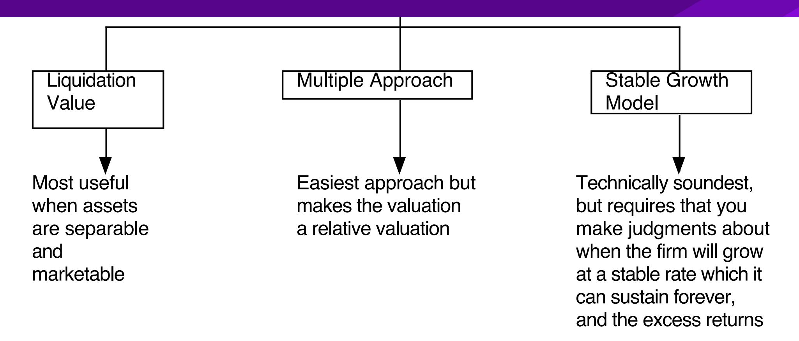
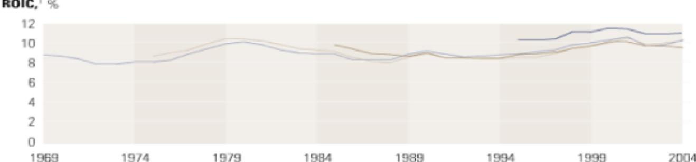
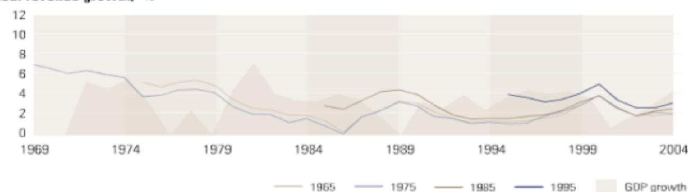
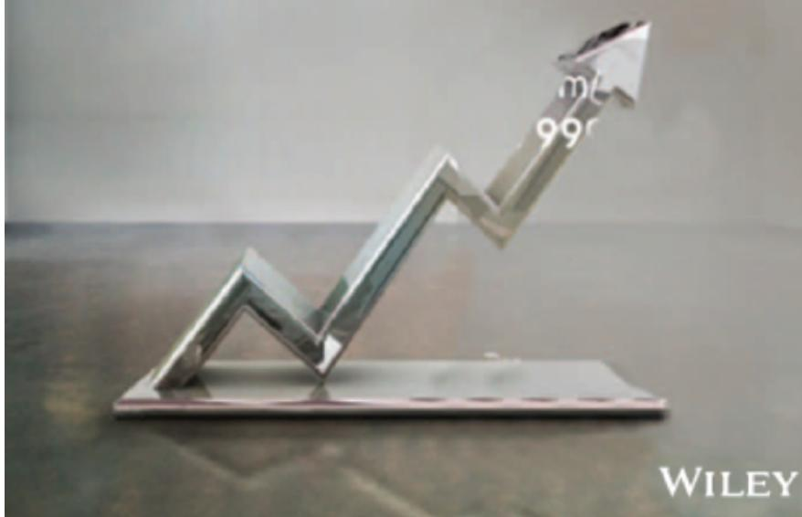

# **SESSION 32: TERMINAL VALUE**

The tail that wags the valuation dog.

# SESSION 32: TERMINAL VALUE

# **GETTING CLOSURE IN VALUATION**

- A publicly traded firm potentially has an infinite life. The value is therefore the present value of cash flows forever.

- Since we cannot estimate cash flows forever, we estimate cash flows for a "growth period" and then estimate a terminal value, to capture the value at the end of the period:

$$\text{Value} = \sum_{t=1}^{t=\infty} \frac{\text{CF}_t}{(1+r)^t}$$

$$\text{Value} = \sum_{t=1}^{t=N} \frac{\text{CF}_t}{(1+r)^t} + \frac{\text{Terminal Value}}{(1+r)^N}$$

### **WAYS OF ESTIMATING TERMINAL VALUE Terminal Value**

### **GETTING TERMINAL VALUE RIGHTS 1. OBEY THE GROWTH CAP**

- When a firm's cash flows grow at a "constant" rate forever, the present value of those cash flows can be written as:

Value = Expected Cash Flow Next Period / (r – g)

where,

r = Discount rate (Cost of Equity or Cost of Capital)

g = Expected Growth Rate

- The stable growth rate cannot exceed the growth rate of the economy, but it can be set lower. o If you assume that the economy is composed of high growth and stable growth firms, the growth rate of the latter will probably be lower than the growth rate of the economy. o The stable growth rate can be negative. The terminal value will be lower and you are assuming that your firm will disappear over time. o If you use nominal cash flows and discount rates, the growth rate should be nominal in the currency in which the valuation is denominated.
- One simple proxy for the nominal growth rate of the economy if the risk-free rate.

## **GETTING TERMINAL VALUE RIGHTS 2. DON'T WAIT TOO LONG . . .**

- Assume that you are valuing a young, high growth firm with great potential, just after its initial public offering. How long would you set your high growth period?
  - a. <5 years
  - b. 5 years
  - c. 10 years
  - d. >10 years
- While analysts routinely assume very long high growth periods (with substantial excess returns during the periods), the evidence suggests that they are much to optimistic. Most growth firms have difficulty sustaining their growth for long periods, especially while earning excess returns.

## **AND THE KEY DETERMINANT OF GROWTH PERIODS IS THE COMPANY'S COMPETITIVE ADVANTAGE . . .**

- Recapping a key lesson about growth, it is not growth per se that creates value but growth with excess returns. For growth firms to continue to generate value creating growth, they have to be able to keep the competition at bay. o Proposition 1: The stronger and more sustainable the competitive advantages, the longer a growth company can sustain "value creating" growth. o Proposition 2: Growth companies with strong and sustainable competitive advantages are rare.

# **CHOOSING A GROWTH PERIOD: EXAMPLES**

|                                     | Disney                                                                                                                                             | Vale                                                                                                                                       | Tata Motors                                                                                                                                                | Baidu                                                                                                               |
|-------------------------------------|----------------------------------------------------------------------------------------------------------------------------------------------------|--------------------------------------------------------------------------------------------------------------------------------------------|------------------------------------------------------------------------------------------------------------------------------------------------------------|---------------------------------------------------------------------------------------------------------------------|
| <b>Firm size/market size</b>        | Firm is one of the largest players in the entertainment and theme park business, but the businesses are being redefined and are expanding.         | The company is one of the largest mining companies in the world, and the overall market is constrained by limits on resource availability. | Firm has a large market share of Indian (domestic) market, but it is small by global standards. Growth is coming from Jaguar division in emerging markets. | Company is in a growing sector (online search) in a growing market (China).                                         |
| <b>Current excess returns</b>       | Firm is earning more than its cost of capital.                                                                                                     | Returns on capital are largely a function of commodity prices. Have generally exceeded the cost of capital.                                | Firm has a return on capital that is higher than the cost of capital.                                                                                      | Firm earns significant excess returns.                                                                              |
| <b>Competitive advantages</b>       | Has some of the most recognized brand names in the world. Its movie business now houses Marvel superheroes, Pixar animated characters & Star Wars. | Cost advantages because of access to low-cost iron ore reserves in Brazil.                                                                 | Competitive advantages in India are fading but Landrover has strong brand name value, giving Tata pricing power and growth potential.                      | Early entry into & knowledge of the Chinese market, coupled with government-imposed barriers to entry on outsiders. |
| <b>Length of high-growth period</b> | Ten years, entirely because of its strong competitive advantages/                                                                                  | None, though with normalized earnings and moderate excess returns.                                                                         | Five years, with much of the growth coming from outside India.                                                                                             | Ten years, with strong excess returns.                                                                              |

## Valuing Vale in November 2013 (in US dollars)

*Let's start with some history & estimate what a normalized year will look like*

| Year              | Operating Income (\$) | Effective tax rate | BV of Debt | BV of Equity | Cash     | Invested capital | Return on capital |
|-------------------|-----------------------|--------------------|------------|--------------|----------|------------------|-------------------|
| 2009              | \$6,057               | 27.79%             | \$18,168   | \$42,556     | \$12,639 | \$48,085         | 9.10%             |
| 2010              | \$23,033              | 18.67%             | \$23,613   | \$59,766     | \$11,040 | \$72,339         | 25.90%            |
| 2011              | \$30,206              | 18.54%             | \$27,668   | \$70,076     | \$9,913  | \$87,831         | 28.01%            |
| 2012              | \$13,346              | 18.96%             | \$23,116   | \$78,721     | \$3,538  | \$98,299         | 11.00%            |
| 2013 (TTM)        | \$15,487              | 20.65%             | \$30,196   | \$75,974     | \$5,818  | \$100,352        | 12.25%            |
| <b>Normalized</b> | <b>\$17,626</b>       | <b>20.92%</b>      |            |              |          |                  | <b>17.25%</b>     |

*Estimate the costs of equity & capital for Vale*

| Business               | Sample size | Unlevered beta of business | Revenues        | Peer Group EV/Sales | Value of Business | Proportion of Vale |
|------------------------|-------------|----------------------------|-----------------|---------------------|-------------------|--------------------|
| Metals & Min.          | 48          | 0.86                       | \$9,013         | 1.97                | \$17,739          | 16.65%             |
| Iron Ore               | 78          | 0.83                       | \$32,717        | 2.48                | \$81,188          | 76.20%             |
| Fertilizers            | 693         | 0.99                       | \$3,777         | 1.52                | \$5,741           | 5.39%              |
| Logistics              | 223         | 0.75                       | \$1,644         | 1.14                | \$1,874           | 1.76%              |
| <b>Vale Operations</b> |             | <b>0.8440</b>              | <b>\$47,151</b> |                     | <b>\$106,543</b>  | <b>100.00%</b>     |

Market D/E = 54.99%  
 Marginal tax rate = 34.00% (Brazil)  
 Levered Beta =  $0.844 (1 + (1 - .34)(.5499)) = 1.15$   
 Cost of equity =  $2.75\% + 1.15 (7.38\%) = 10.87\%$ 

|                       | % of revenues  | ERP          |
|-----------------------|----------------|--------------|
| US & Canada           | 4.90%          | 5.50%        |
| Brazil                | 16.90%         | 8.50%        |
| Rest of Latin America | 1.70%          | 10.09%       |
| China                 | 37.00%         | 6.94%        |
| Japan                 | 10.30%         | 6.70%        |
| Rest of Asia          | 8.50%          | 8.61%        |
| Europe                | 17.20%         | 6.72%        |
| Rest of World         | 3.50%          | 10.06%       |
| <b>Vale ERP</b>       | <b>100.00%</b> | <b>7.38%</b> |

Vale's rating: A-  
 Default spread based on rating = 1.30%  
 Cost of debt (pre-tax) =  $2.75\% + 1.30\% = 4.05\%$ 

Cost of capital =  $11.23\% (.6452) + 4.05\% (1 - .34) (.3548) = 8.20\%$ 

*Assume that the company is in stable growth, growing 2% a year in perpetuity*

$$\text{Reinvestment Rate} = \frac{g}{ROC} = \frac{2\%}{17.25\%} = 11.59\%$$

$$\text{Value of Operating Assets} = \frac{17,626 (1 - .2092)(1 - .1159)}{(.082 - .02)} = \$202,832$$

| Value of operating assets      | = \$202,832 |
|--------------------------------|-------------|
| + Cash & Marketable Securities | = \$ 7,133  |
| - Debt                         | = \$ 42,879 |
| Value of equity                | = \$167,086 |
| Value per share                | = \$ 32.44  |
| Stock price (11/2013)          | = \$ 13.57  |

### **DON'T FORGET THAT GROWTH HAS TO BE EARNED 3. THINK ABOUT WHAT YOUR FIRM WILL EARN AS RETURNS FOREVER**

- In the section on expected growth, we laid out the fundamental equation for growth:

Growth rate = Reinvestment Rate \* Return on invested capital + Growth rate from improved efficiency

- In stable growth, you cannot count on efficiency delivering growth (why?) and you have to reinvest to deliver the growth rate that you have forecast. Consequently, your reinvestment rate in stable growth will be a function of your stable growth rate and what you believe the firm will earn as a return on capital in perpetuity:
  - Reinvestment Rate = Stable growth rate / Stable period return on capital
- A key issue in valuation is whether it is okay to assume that firms can earn more than their cost of capital in perpetuity. There are some (such as McKinsey) who argue that the return on capital = cost of capital in stable growth.

# **THERE ARE SOME FIRMS THAT EARN EXCESS RETURNS**

- While growth rates seem to fade quickly as firms become larger, wellmanaged firms seem to do much better at sustaining excess returns for longer periods.

®ROIC shown is 7-year simple average, including goodwill; growth shown is 7-year compound annual growth rate for revenues adjusted for inflation.

## **GETTING TERMINAL VALUE RIGHT 4. BE INTERNALLY CONSISTENT**

- Risk and cost of equity and capital: Stable growth firms tend to: o Have betas closer to one o Have debt ratios closer to industry averages (or mature company averages) o Country risk premiums (especially in emerging markets should evolve over time)
- The excess returns at stable growth firms should approach (or become) zero. ROC à Cost of capital and ROE à Cost of equity
- The reinvestment needs and dividend payout ratios should reflect the lower growth and excess returns: o Stable period payout ratio = 1 – g /ROE o Stable period reinvestment rate = g / ROC

# **AND DON'T FALL FOR SLEIGHT OF HAND . . .**

- A typical assumption in many DCF valuations, when it comes to stable growth, is that capital expenditures offset depreciation and there are no working capital needs. Stable growth firms, we are told, just have to make maintenance cap ex (replacing existing assets) to deliver growth. If you make this assumption, what expected growth rate can you use in your terminal value computation?
- What is the stable growth rate = inflation rate? Is it okay to make this assumption then?

## **ESTIMATING STABLE PERIOD INPUTS AFTER A HIGH GROWTH PERIOD: DISNEY**

- Respect the cap: The growth rate forever is assumed to be 2.5%. This is set lower than the risk-free rate (2.75%).
- Stable period excess returns: The return on capital for Disney will drop from its high growth period level of 12.61% to a stable growth return of 10%. This is still higher than the cost of capital of 7.29%, but the competitive advantages that Disney has are unlikely to dissipate completely by the end of the 10th year.
- Reinvest to grow: Based on the expected growth rate in perpetuity (2.5%) and expected return on capital forever after year 10 of 10%, we compute a stable period reinvestment rate of 25%: Reinvestment Rate = Growth Rate / Return on Capital = 2.5% / 10% = 25%
- Adjust risk and cost of capital: The beta for the stock will drop to one, reflecting Disney's status as a mature company. o Cost of Equity = Risk-free Rate + Beta \* Risk Premium = 2.75% + 5.76% = 8.51% o The debt ratio for Disney will rise to 20%. Since we assume that the cost of debt remains unchanged at 3.75%, this will result in a cost of capital of 7.29%.
  - Cost of capital = 8.51% (0.80) + 3.75% (1 0.361) (0.20) = 7.29%

Applied  
Corporate  
Finance

**Optional: Read Chapter 12**

### **Task**

Evaluate your firm's expected characteristics when it reaches stable growth.