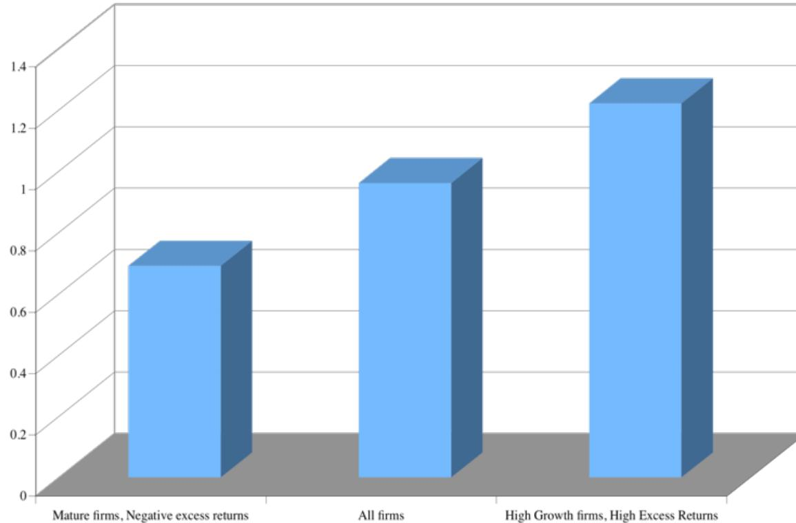
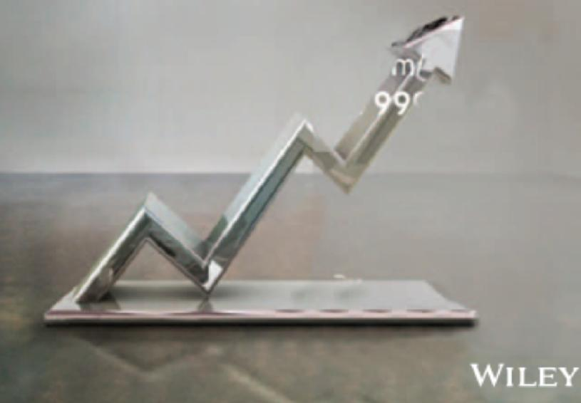

# **SESSION 33: TO VALUE PER SHARE**

Control is not always worth 20%.

### **SESSION 33: TO VALUE PER SHARE**

## **FROM FIRM VALUE TO EQUITY VALUE PER SHARE**

| Approach used                                      | To get to equity value per share                                                                                                                                                                                                                                                                                                                               |
|----------------------------------------------------|----------------------------------------------------------------------------------------------------------------------------------------------------------------------------------------------------------------------------------------------------------------------------------------------------------------------------------------------------------------|
| Discount dividends per share at the cost of equity | Present value is value of equity per share                                                                                                                                                                                                                                                                                                                     |
| Discount aggregate FCFE at the cost of equity      | Present value is value of aggregate equity. Subtract the value of equity options given to managers and divide by number of shares.                                                                                                                                                                                                                             |
| Discount aggregate FCFF at the cost of capital     | $  \begin{aligned}  &\text{PV} = \text{Value of operating assets} \\  &+ \text{Cash \& Near Cash investments} \\  &+ \text{Value of minority cross holdings} \\  &- \text{Debt outstanding} \\  &= \text{Value of equity} \\  &- \text{Value of equity options} \\  &= \text{Value of equity in common stock} \\  &/ \text{Number of shares}  \end{aligned}  $ |

## **1. THE VALUE OF CASH: AN EXERCISE IN CASH VALUATION**

| Enterprise Value Cash | Company A \$ 1 billion \$ 100 million | Company B \$ 1 billion \$ 100 million | Company C \$ 1 billion \$ 100 million |
|-----------------------|---------------------------------------|---------------------------------------|---------------------------------------|
| Return on Capital     | 10%                                   | 5%                                    | 22%                                   |
| Cost of Capital       | 10%                                   | 10%                                   | 12%                                   |
| Trades in             | US                                    | US                                    | Argentina                             |

# CASH: DISCOUNT OR PREMIUM?

*Market Value of \$ 1 in cash:  
Estimates obtained by regressing Enterprise Value against Cash Balances*

## **2. DEALING WITH HOLDINGS IN OTHER FIRMS**

- Holdings in other firms can be categorized into: o Minority passive holdings, in which case only the dividend form the holdings is shown in the balance sheet o Minority active holdings, in which case the share of equity income is shown in the income statements o Majority active holdings, in which case the financial statements are consolidated
- We tend to be sloppy in practice in dealing with cross holdings. After valuing the operating assets of a firm, using consolidated statements, it is common to add on the balance sheet value of minority holdings (which are in book value terms) and subtract out the minority interests (again in book value terms), representing the portion of the consolidated company that does not belong to the parent company.

### **HOW TO VALUE HOLDINGS IN OTHER FIRMS . . . IN A PERFECT WORLD . . .**

- In a perfect world, we would strip the parent company form its subsidiaries and value each one separately. The value of the combined firm will be: Value of parent company + Proportion of value of each subsidiary
- To do this right, you will need to be provided with detailed information on each subsidiary to estimated cash flows and discount rates.

# TWO COMPROMISE SOLUTIONS . . .

- • The Market Value Solution: When the subsidiaries are publicly traded, you could use their traded market capitalizations to estimate the values of the cross holdings. You do risk carrying into your valuation any mistakes that the market may be making in variation.
- • The Relative Value Solution: When there are too many cross holdings to value separately or when there is insufficient information provided on cross holdings, you can convert the book values of holdings that you have on the balance sheet (for both minority holdings and minority interests in majority holdings) by using the average price to book value ratio of the sector in which the subsidiaries operate.

## **3. OTHER ASSETS THAT HAVE NOT BEEN COUNTED YET . . .**

- Unutilized assets: If you have assets or property that are not being utilized (such as vacant land), you have not valued it yet. You can assess a market value for these assets and add them on to the value of the firm.
- Overfunded pension plans: If you have a defined benefit plan and your assets exceed your expected liabilities, you could consider the over funding with two caveats: o Collective bargaining agreements may prevent you from laying claim to these excess assets. o There are tax consequences. Often, withdrawals from pension plans get taxed at much higher rates. o Do not double count an asset. If you count the income from an asset in your cash flows, you cannot count the market value of the asset in your value.

## **4. EQUITY TO EMPLOYEES: EFFECT ON VALUE**

- In recent years, firms have turned to fiving employees (and especially top managers) equity option packages as part of compensation. These options are usually: o Long term o At-the-money when issues o On volatile stocks
- Are they worth money? And if yes, who is paying for them?
- Two key issues with employee options: o How do options granted in the past affect equity value per share today? o How do expected future option grants affect equity value today?

## **EQUITY OPTIONS AND VALUE**

- Options outstanding
  - Step 1: List all options outstanding, with maturity, exercise price and vesting status.
  - Step 2: Value the options, taking into account dilution, vesting and early exercise considerations.
  - Step 3: Subtract from the value of equity and divide by the actual number of shares outstanding (not diluted or partially diluted).
- Expected future option and restricted stock issues
  - Step 1: Forecast value of options that will be granted each year as percent of revenues that year. (As firm gets larger, this should decrease)
  - Step 2: Treat as operating expense and reduce operating income and cash flows.
  - Step 3: Take present value of cash flows to value operations or equity.

## Applied Corporate Finance

**Optional: Read Chapter 12**

#### **Task**

Estimate the value per share in your company, taking into account its non-operating assets and equity options.