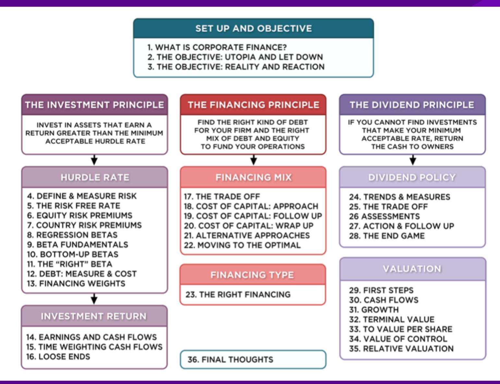
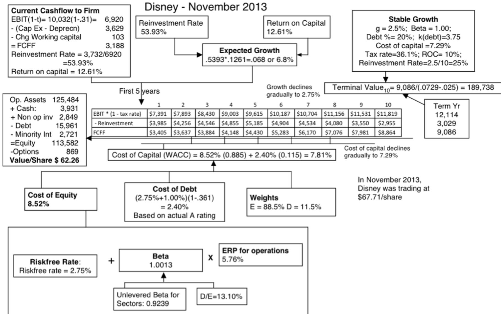
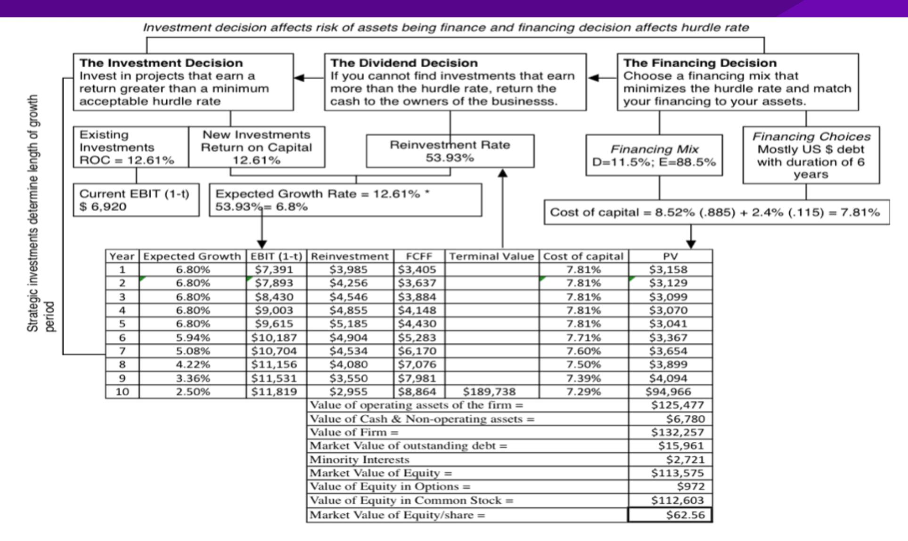
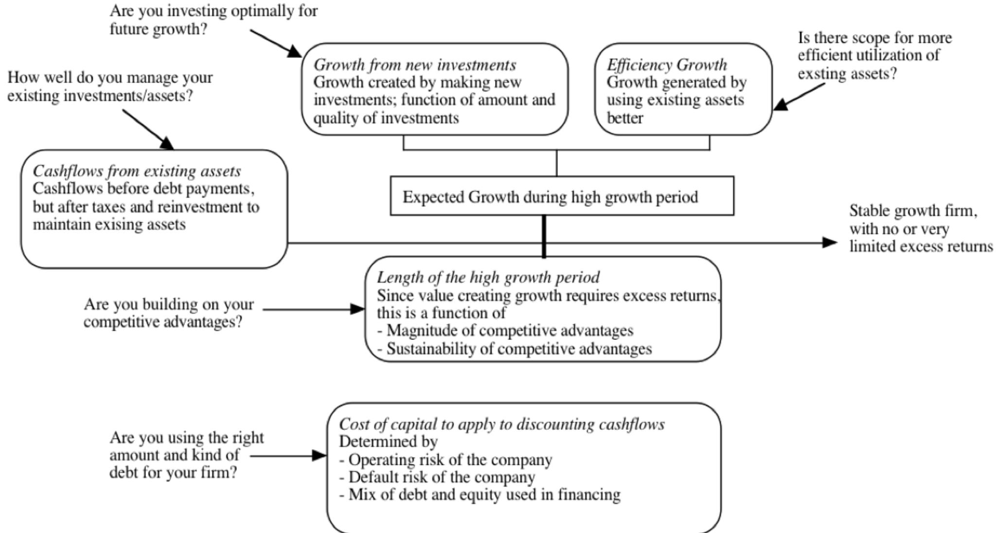
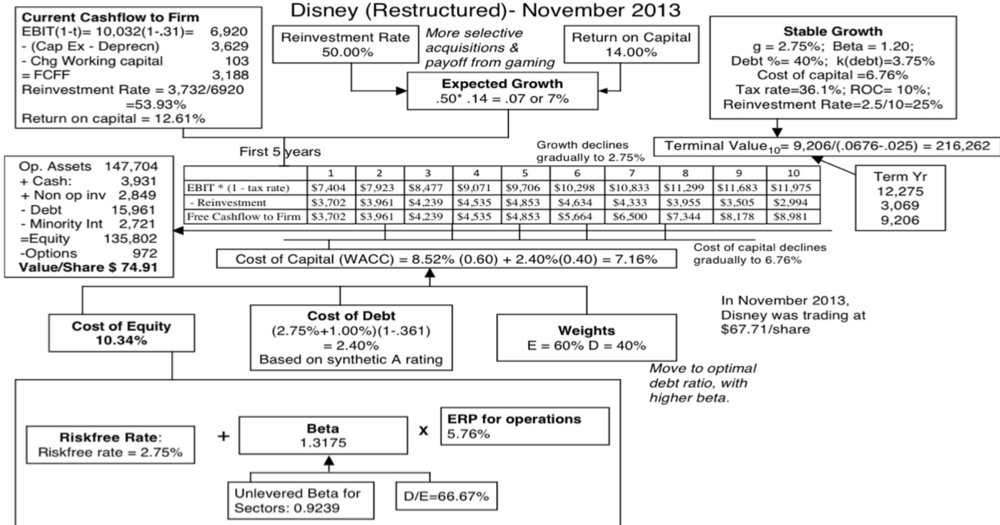
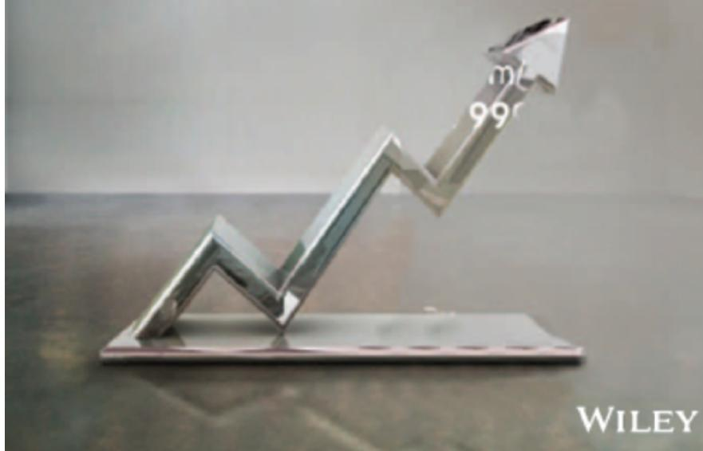

# **SESSION 34: VALUE OF CONTROL**

Control is not always worth 20%.

### **SESSION 34: VALUE OF CONTROL**

## **DISNEY: INPUTS TO VALUATION**

|                    | High Growth Phase           | Transition Phase                | Stable Growth Phase         |
|--------------------|-----------------------------|---------------------------------|-----------------------------|
| Length of Period   | 5 years                     | 5 years                         | Forever after 10 years      |
| Tax Rate           | 31.02% (effective)          |                                 |                             |
| Return on Capital  | 12.61%                      | Declines linearly to 10%        | Stable ROC of 10%           |
| Reinvestment Rate  | 53.93% (based on normalized |                                 |                             |
|                    |                             |                                 | Reinvestment rate = g/ROC = |
|                    |                             | Linear decline to Stable Growth |                             |
|                    |                             | Rate of 2.5%                    | 2.5%                        |
| Debt/Capital Ratio | 11.5%                       | Rises linearly to 20.0%         | 20%                         |
|                    | Beta = 1.0013, ke = 8.52%   |                                 |                             |
|                    |                             | Cost of debt stays at 3.75%     |                             |
|                    |                             |                                 | Beta = 1.00, ke = 8.5%      |
|                    |                             |                                 | Cost of debt stays ar 3.75% |

# DISNEY – NOVEMBER 2013

# WAYS OF CHANGING VALUE . . .

# DISNEY (RESTRUCTURED) – NOVEMBER 2013

### **THE VALUE OF CONTROL**

- We have two values for Disney. o The status quo value per share, run by existing management with its current policies in place, is \$62.56. o The "optimal" value, with changes to investing, financing and dividend policy, yields a value per share of \$74.91.
- The difference between the two values can legitimately be called the value of control. o Value of control = \$74.91 - \$62.56 = \$12.35/share

### **IMPLICATIONS**

- 1. The value of control should be greater at poorly managed firms than well-run firms.
- 2. The market price of a company should reflect the expected value of control, which incorporates the profitability that management will change.
  - a. If corporate governance is so weak that there is no chance of management change, the expected value of control should go to zero and the stock price should converge on the status quo value.
  - b. In the event of a control change (an acquisition or an activist investor waging a control battle), the likelihood of management change will increase and the stock should trade at close to its optimal value.

Applied  
Corporate  
Finance

Optional: Read Chapter 12

### **Task**

Estimate the status quo and optimal values for your firm, and the value of control