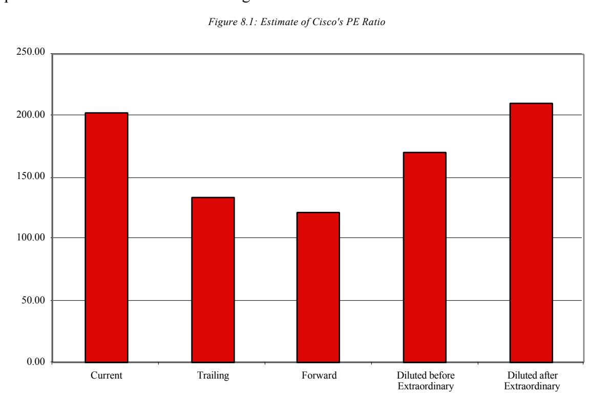
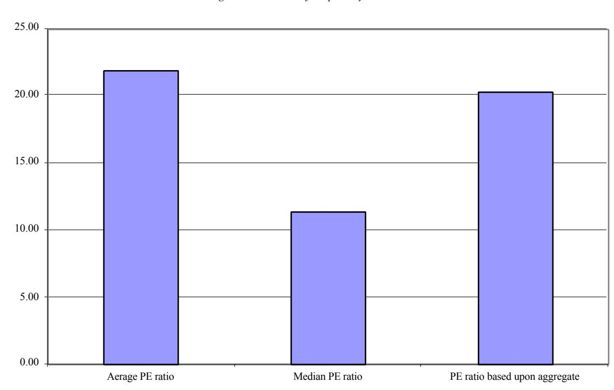

# RELATIVE VALUATION

In discounted cash flow valuation, the objective is to find the value of assets, given their cash flow, growth and risk characteristics. In relative valuation, the objective is to value assets, based upon how similar assets are currently priced in the market. While multiples are easy to use and intuitive, they are also easy to misuse. Consequently, a series of tests were developed that can be used to ensure that multiples are correctly used.

There are two components to relative valuation. The first is that, to value assets on a relative basis, prices have to be standardized, usually by converting prices into multiples of earnings, book values or sales. The second is to find similar firms, which is difficult to do since no two firms are identical and firms in the same business can still differ on risk, growth potential and cash flows. The question of how to control for these differences, when comparing a multiple across several firms, becomes a key one.

### **Use of Relative Valuation**

The use of relative valuation is widespread. Most equity research reports and many acquisition valuations are based upon a multiple such as a price to sales ratio or the Value to EBITDA multiple and a group of comparable firms. In fact, firms in the same business as the firm being valued are called comparable, though as you see later in this chapter, that is not always true. In this section, the reasons for the popularity of relative valuation are considered first, followed by some potential pitfalls.

#### *Reasons for Popularity*

Why is relative valuation so widely used? There are several reasons. First, a valuation based upon a multiple and comparable firms can be completed with far fewer assumptions and far more quickly than a discounted cash flow valuation. Second, a relative valuation is simpler to understand and easier to present to clients and customers than a discounted cash flow valuation. Finally, a relative valuation is much more likely to reflect the current mood of the market, since it is an attempt to measure relative and not intrinsic

value. Thus, in a market where all internet stocks see their prices bid up, relative valuation is likely to yield higher values for these stocks than discounted cash flow valuations. In fact, relative valuations will generally yield values that are closer to the market price than discounted cash flow valuations. This is particularly important for those whose job it is to make judgments on relative value, and who are themselves judged on a relative basis. Consider, for instance, managers of technology mutual funds. These managers will be judged based upon how their funds do relative to other technology funds. Consequently, they will be rewarded if they pick technology stocks that are under valued relative to other technology stocks, even if the entire sector is over valued.

# *Potential Pitfalls*

The strengths of relative valuation are also its weaknesses. First, the ease with which a relative valuation can be put together, pulling together a multiple and a group of comparable firms, can also result in inconsistent estimates of value where key variables such as risk, growth or cash flow potential are ignored. Second, the fact that multiples reflect the market mood also implies that using relative valuation to estimate the value of an asset can result in values that are too high, when the market is over valuing comparable firms, or too low, when it is under valuing these firms. Third, while there is scope for bias in any type of valuation, the lack of transparency regarding the underlying assumptions in relative valuations make them particularly vulnerable to manipulation. A biased analyst who is allowed to choose the multiple on which the valuation is based and to pick the comparable firms can essentially ensure that almost any value can be justified.

# **Standardized Values and Multiples**

The price of a stock is a function both of the value of the equity in a company and the number of shares outstanding in the firm. Thus, a stock split that doubles the number of units will approximately halve the stock price. Since stock prices are determined by the number of units of equity in a firm, stock prices cannot be compared across different firms.

To compare the values of "similar" firms in the market, you need to standardize the values in some way. Values can be standardized relative to the earnings firms generate, to the book value or replacement value of the firms themselves, to the revenues that firms generate or to measures that are specific to firms in a sector.

### *1. Earnings Multiples*

One of the more intuitive ways to think of the value of any asset is as a multiple of the earnings that assets generate. When buying a stock, it is common to look at the price paid as a multiple of the earnings per share generated by the company. This price/earnings ratio can be estimated using current earnings per share, which is called a trailing PE, or an expected earnings per share in the next year, called a forward PE.

When buying a business, as opposed to just the equity in the business, it is common to examine the value of the firm as a multiple of the operating income or the earnings before interest, taxes, depreciation and amortization (EBITDA). While, as a buyer of the equity or the firm, a lower multiple is better than a higher one, these multiples will be affected by the growth potential and risk of the business being acquired.

# *2. Book Value or Replacement Value Multiples*

While markets provide one estimate of the value of a business, accountants often provide a very different estimate of the same business. The accounting estimate of book value is determined by accounting rules and is heavily influenced by the original price paid for assets and any accounting adjustments (such as depreciation) made since. Investors often look at the relationship between the price they pay for a stock and the book value of equity (or net worth) as a measure of how over- or undervalued a stock is; the price/book value ratio that emerges can vary widely across industries, depending again upon the growth potential and the quality of the investments in each. When valuing businesses, you estimate this ratio using the value of the firm and the book value of all assets (rather than just the equity). For those who believe that book value is not a good measure of the true

value of the assets, an alternative is to use the replacement cost of the assets; the ratio of the value of the firm to replacement cost is called Tobin's Q.

### *3. Revenue Multiples*

Both earnings and book value are accounting measures and are determined by accounting rules and principles. An alternative approach, which is far less affected by accounting choices, is to use the ratio of the value of an asset to the revenues it generates. For equity investors, this ratio is the price/sales ratio (PS), where the market value per share is divided by the revenues generated per share. For firm value, this ratio can be modified as the value/sales ratio (VS), where the numerator becomes the total value of the firm. This ratio, again, varies widely across sectors, largely as a function of the profit margins in each. The advantage of using revenue multiples, however, is that it becomes far easier to compare firms in different markets, with different accounting systems at work, than it is to compare earnings or book value multiples.

#### *4. Sector-Specific Multiples*

While earnings, book value and revenue multiples are multiples that can be computed for firms in any sector and across the entire market, there are some multiples that are specific to a sector. For instance, when Internet firms first appeared on the market in the later 1990s, they had negative earnings and negligible revenues and book value. Analysts looking for a multiple to value these firms divided the market value of each of these firms by the number of hits generated by that firm's web site. Firms with a low market value per customer hit were viewed as more under valued. More recently, e-tailers have been judged by the market value of equity per customer in the firm.

While there are conditions under which sector-specific multiples can be justified, and you look at a few in Chapter 10, they are dangerous for two reasons. First, since they cannot be computed for other sectors or for the entire market, sector-specific multiples can result in persistent over or under valuations of sectors relative to the rest of the market. Thus, investors who would never consider paying 80 times revenues for a firm might not have the same qualms about paying \$ 2000 for every page hit (on the web site), largely because they have no sense of what high, low or average is on this measure. Second, it is far more difficult to relate sector specific multiples to fundamentals, which is an essential ingredient to using multiples well. For instance, does a visitor to a company's web site translate into higher revenues and profits? The answer will not only vary from company to company, but will also be difficult to estimate looking forward.

### **The Four Basic Steps to Using Multiples**

Multiples are easy to use and easy to misuse. There are four basic steps to using multiples wisely and for detecting misuse in the hands of others. The first step is to ensure that the multiple is defined consistently and that it is measured uniformly across the firms being compared. The second step is to be aware of the cross sectional distribution of the multiple, not only across firms in the sector being analyzed but also across the entire market. The third step is to analyze the multiple and understand not only what fundamentals determine the multiple but also how changes in these fundamentals translate into changes in the multiple. The final step is finding the right firms to use for comparison, and controlling for differences that may persist across these firms.

### *A. Definitional Tests*

Even the simplest multiples can be defined differently by different analysts. Consider, for instance, the price earnings ratio (PE). Most analysts define it to be the market price divided by the earnings per share but that is where the consensus ends. There are a number of variants on the PE ratio. While the current price is conventionally used in the numerator, there are some analysts who use the average price over the last six months or a year. The earnings per share in the denominator can be the earnings per share from the most recent financial year (yielding the current PE), the last four quarters of earnings (yielding the trailing PE) and expected earnings per share in the next financial year (resulting in a

forward PE). In addition, earnings per share can be computed based upon primary shares outstanding or fully diluted shares, and can include or exclude extraordinary items. Figure 8.1 provides the PE ratios for Cisco using each of these measures:

Not only can these variants on earnings yield vastly different values for the price earnings ratio, but the one that gets used by analysts depends upon their biases. For instance, in periods of rising earnings, the forward PE yields consistently lower values than the trailing PE, which, in turn, is lower than the current PE. A bullish analyst will tend to use the forward PE to make the case that the stock is trading at a low multiple of earnings, while a bearish analyst will focus on the current PE to make the case that the multiple is too high. The first step when discussing a valuation based upon a multiple is to ensure that everyone in the discussion is using the same definition for that multiple.

### *Consistency*

Every multiple has a numerator and a denominator. The numerator can be either an equity value (such as market price or value of equity) or a firm value (such as enterprise value, which is the sum of the values of debt and equity, net of cash). The denominator can be an equity measure (such as earnings per share, net income or book value of equity) or a firm measure (such as operating income, EBITDA or book value of capital).

One of the key tests to run on a multiple is to examine whether the numerator and denominator are defined consistently. *If the numerator for a multiple is an equity value, then the denominator should be an equity value as well. If the numerator is a firm value, then the denominator should be a firm value as well*. To illustrate, the price earnings ratio is a consistently defined multiple, since the numerator is the price per share (which is an equity value) and the denominator is earnings per share (which is also an equity value). So is the Enterprise value to EBITDA multiple, since the numerator and denominator are both firm value measures.

Are there any multiples in use that are inconsistently defined? Consider the price to EBITDA multiple, a multiple that has acquired adherents in the last few years among analysts. The numerator in this multiple is an equity value, and the denominator is a measure of earnings to the firm. The analysts who use this multiple will probably argue that the inconsistency does not matter since the multiple is computed the same way for all of the comparable firms; but they would be wrong. If some firms on the list have no debt and others carry significant amounts of debt, the latter will look cheap on a price to EBITDA basis, when in fact they might be over or correctly priced.

### *Uniformity*

In relative valuation, the multiple is computed for all of the firms in a group and then compared across these firms to make judgments on which firms are over priced and which are under priced. For this comparison to have any merit, the multiple has to be defined uniformly across all of the firms in the group. Thus, if the trailing PE is used for one firm, it has to be used for all of the others as well. In fact, one of the problems with using the current PE to compare firms in a group is that different firms can have different fiscal-year ends. This can lead to some firms having their prices divided by earnings from July 1999 to June 2000, with other firms having their prices divided by earnings from January 1999 to December 1999. While the differences can be minor in mature sectors, where earnings do not make quantum jumps over six months, they can be large in highgrowth sectors.

With both earnings and book value measures, there is another component to be concerned about and that is the accounting standards used to estimate earnings and book values. Differences in accounting standards can result in very different earnings and book value numbers for similar firms. This makes comparisons of multiples across firms in different markets, with different accounting standards, very difficult. Even within the United States, the fact that some firms use different accounting rules (on depreciation and expensing) for reporting purposes and tax purposes and others do not can throw off comparisons of earnings multiples1.

# *B. Descriptional Tests*

When using a multiple, it is always useful to have a sense of what a high value, a low value or a typical value for that multiple is in the market. In other words, knowing the distributional characteristics of a multiple is a key part of using that multiple to identify under or over valued firms. In addition, you need to understand the effects of outliers on averages and unearth any biases in these estimates, introduced in the process of estimating multiples.

### *Distributional Characteristics*

Many analysts who use multiples have a sector focus and have a good sense of how different firms in their sector rank on specific multiples. What is often lacking, however, is

1 Firms that adopt different rules for reporting and tax purposes generally report higher earnings to their stockholders than they do to the tax authorities. When they are compared on a price earnings basis to firms that do not maintain different reporting and tax books, they will look cheaper (lower PE).

a sense of how the multiple is distributed across the entire market. Why, you might ask, should a software analyst care about price earnings ratios of utility stocks? Because both software and utility stocks are competing for the same investment dollar, they have to, in a sense, play by the same rules. Furthermore, an awareness of how multiples vary across sectors can be very useful in detecting when the sector you are analyzing is over or under valued.

What are the distributional characteristics that matter? The standard statistics – the average and standard deviation – are where you should start, but they represent the beginning of the exploration. The fact that multiples such as the price earnings ratio can never be less than zero and are unconstrained in terms of a maximum results in distributions for these multiples that are skewed towards the positive values. Consequently, the average values for these multiples will be higher than median values2, and the latter are much more representative of the typical firm in the group. While the maximum and minimum values are usually of limited use, the percentile values (10th percentile, 25th percentile, 75th percentile, 90th percentile…) can be useful in judging what a high or low value for the multiple in the group is.

#### *Outliers and Averages*

As noted earlier, multiples are unconstrained on the upper end and firms can have price earnings ratios of 500 or 2000 or even 10000. This can occur not only because of high stock prices but also because earnings at firms can sometime drop to a few cents. These outliers will result in averages that are not representative of the sample. In most cases, services that compute and report average values for multiples either throw out these outliers when computing the averages or constrain the multiples to be less than or equal to a fixed number. For instance, any firm that has a price earnings ratio greater than 500 may be given a price earnings ratio of 500.

2 With the median, half of all firms in the group fall below this value and half lie above.

When using averages obtained from a service, it is important that you know how the service dealt with outliers in computing the averages. In fact, the sensitivity of the estimated average to outliers is another reason for looking at the median values for multiples.

#### *Biases in Estimating Multiples*

With every multiple, there are firms for which the multiple cannot be computed. Consider again the price-earnings ratio. When the earnings per share are negative, the price earnings ratio for a firm is not meaningful and is usually not reported. When looking at the average price earnings ratio across a group of firms, the firms with negative earnings will all drop out of the sample because the price earnings ratio cannot be computed. Why should this matter when the sample is large? The fact that the firms that are taken out of the sample are the firms losing money creates a bias in the selection process. In fact, the average PE ratio for the group will be biased upwards because of the elimination of these firms.

There are three solutions to this problem. The first is to be aware of the bias and build it into the analysis. In practical terms, this will mean adjusting the average PE down to reflect the elimination of the money-losing firms. The second is to aggregate the market value of equity and net income (or loss) for all of the firms in the group, including the money-losing ones, and compute the price earnings ratio using the aggregated values. Figure 8.2 summarizes the average PE ratio, the median PE ratio and the PE ratio based upon aggregated earnings for specialty retailers.

*Figure 8.2: PE Ratio for Specialty Retailers*

Note that the median PE ratio is much lower than the average than the PE ratio. Furthermore, the PE ratio based upon the aggregate values of market value of equity and net income is lower than the average across firms where PE ratios could be computed. The third choice is to use a multiple that can be computed for all of the firms in the group. The inverse of the price earning ratio, which is called the earnings yield, can be computed for all firms, including those losing money.

### *C. Analytical Tests*

In discussing why analysts were so fond of using multiples, it was argued that relative valuations require fewer assumptions than discounted cash flow valuations. While this is technically true, it is only so on the surface. In reality, you make just as many assumptions when you do a relative valuation as you make in a discounted cash flow valuation. The difference is that the assumptions in a relative valuation are implicit and unstated, whereas those in discounted cash flow valuation are explicit. The two primary questions that you need to answer before using a multiple are: What are the fundamentals that determine at what multiple a firm should trade? How do changes in the fundamentals affect the multiple?

#### *Determinants*

In the introduction to discounted cash flow valuation, you observed that the value of a firm is a function of three variables – it capacity to generate cash flows, its expected growth in these cash flows and the uncertainty associated with these cash flows. Every multiple, whether it is of earnings, revenues or book value, is a function of the same three variables – risk, growth and cash flow generating potential. Intuitively, then, firms with higher growth rates, less risk and greater cash flow generating potential should trade at higher multiples than firms with lower growth, higher risk and less cash flow potential.

The specific measures of growth, risk and cash flow generating potential that are used will vary from multiple to multiple. To look under the hood, so to speak, of equity and firm value multiples, you can go back to fairly simple discounted cash flow models for equity and firm value and use them to derive the multiples.

In the simplest discounted cash flow model for equity, which is a stable growth dividend discount model, the value of equity is:

$$\text{Value of Equity} = P_0 = \frac{\text{DPS}_1}{k_e - g_n}$$

where DPS1 is the expected dividend in the next year, ke is the cost of equity and gn is the expected stable growth rate. Dividing both sides by the earnings, you obtain the discounted cash flow equation specifying the PE ratio for a stable growth firm:

$$\frac{P_0}{\text{EPS}_0} = \text{PE} = \frac{\text{Payout Ratio} * (1 + g_n)}{k_e - g_n}$$

Dividing both sides by the book value of equity, you can estimate the price/book value ratio for a stable growth firm:

$$\frac{P_0}{BV_0} = PBV = \frac{ROE * Payout Ratio * (1 + g_n)}{k_e - g_n}$$

where ROE is the return on equity. Dividing by the Sales per share, the price/sales ratio for a stable growth firm can be estimated as a function of its profit margin, payout ratio, profit margin, and expected growth.

| $\frac{P_0}{\text{Sales}_0} = \text{PS} =$ | Profit Margin*Payout Ratio*(1 + $g_n$ ) |
|--------------------------------------------|-----------------------------------------|
|                                            | $k_e - g_n$                             |

You can do a similar analysis to derive the firm value multiples. The value of a firm in stable growth can be written as:

$$\text{Value of Firm} = V_0 = \frac{\text{FCFF}_1}{k_c - g_n}$$

Dividing both sides by the expected free cash flow to the firm yields the Value/FCFF multiple for a stable growth firm:

$$\frac{V_0}{\text{FCFF}_1} = \frac{1}{k_c - g_n}$$

Since the free cash flow the firm is the after-tax operating income netted against the net capital expenditures and working capital needs of the firm, the multiples of EBIT, aftertax EBIT and EBITDA can also be estimated similarly.

The point of this analysis is not to suggest that you go back to using discounted cash flow valuation, but to understand the variables that may cause these multiples to vary across firms in the same sector. If you ignore these variables, you might conclude that a stock with a PE of 8 is cheaper than one with a PE of 12, when the true reason may be that the latter has higher expected growth or you might decide that a stock with a P/BV ratio of 0.7 is cheaper than one with a P/BV ratio of 1.5, when the true reason may be that the latter has a much higher return on equity.

### *Relationship*

Knowing the fundamentals that determine a multiple is a useful first step, but understanding how the multiple changes as the fundamentals change is just as critical to using the multiple. To illustrate, knowing that higher growth firms have higher PE ratios is not a sufficient insight if you are called upon to analyze whether a firm with a growth rate that is twice as high as the average growth rate for the sector should have a PE ratio that is 1.5 times or 1.8 times or two times the average price earnings ratio for the sector. To make this judgment, you need to know how the PE ratio changes as the growth rate changes.

A surprisingly large number of analyses are based upon the assumption that there is a linear relationship between multiples and fundamentals. For instance, the PEG ratio, which is the ratio of the PE to the expected growth rate of a firm and widely used to analyze high growth firms, implicitly assumes that PE ratios and expected growth rates are linearly related.

One of the advantages of deriving the multiples from a discounted cash flow model, as was done in the last section, is that you can analyze the relationship between each fundamental variable and the multiple by keeping everything else constant and changing the value of that variable. When you do this, you will find that there are very few linear relationships in valuation.

### *Companion Variable*

While the variables that determine a multiple can be extracted from a discounted cash flow model, and the relationship between each variable and the multiple can be developed by holding all else constant and asking what-if questions, there is one variable that dominates when it comes to explaining each multiple. This variable, which is called the companion variable , can usually be identified by looking at how multiples are different across firms in a sector or across the entire market. In the next two chapters, the companion variables for the most widely used multiples from the price earnings ratio to the value to sales multiples is identified and then used in analysis.

#### *D. Application Tests*

When multiples are used, they tend to be used in conjunction with comparable firms to determine the value of a firm or its equity. But what is a comparable firm? While the conventional practice is to look at firms within the same industry or business as comparable firms, this is not necessarily always the correct or the best way of identifying these firms. In addition, no matter how carefully you choose comparable firms, differences will remain between the firm you are valuing and the comparable firms. Figuring out how to control for these differences is a significant part of relative valuation.

### *What is a comparable firm?*

A comparable firm is one with cash flows, growth potential, and risk similar to the firm being valued. It would be ideal if you could value a firm by looking at how an exactly identical firm - in terms of risk, growth and cash flows - is priced. Nowhere in this definition is there a component that relates to the industry or sector to which a firm belongs. Thus, a telecommunications firm can be compared to a software firm, if the two are identical in terms of cash flows, growth and risk. In most analyses, however, analysts define comparable firms to be other firms in the firm's business or businesses. If there are enough firms in the industry to allow for it, this list is pruned further using other criteria; for instance, only firms of similar size may be considered. The implicit assumption being made here is that firms in the same sector have similar risk, growth, and cash flow profiles and therefore can be compared with much more legitimacy.

This approach becomes more difficult to apply when there are relatively few firms in a sector. In most markets outside the United States, the number of publicly traded firms in a particular sector, especially if it is defined narrowly, is small. It is also difficult to define firms in the same sector as comparable firms if differences in risk, growth and cash flow profiles across firms within a sector are large. Thus, there may be hundreds of computer software companies listed in the United States, but the differences across these firms are also large. The tradeoff is therefore a simple one. Defining a industry more broadly increases the number of comparable firms, but it also results in a more diverse group.

There are alternatives to the conventional practice of defining comparable firms. One is to look for firms that are *similar in terms of valuation fundamentals*. For instance, to estimate the value of a firm with a beta of 1.2, an expected growth rate in earnings per share of 20% and a return on equity of 40%3, you would find other firms across the entire market with similar characteristics4. The other is *consider all firms in the market* as comparable firms and to control for differences on the fundamentals across these firms, using statistical techniques such as multiple regressions.

### *Controlling for Differences across Firms*

No matter how carefully you construct your list of comparable firms, you will end up with firms that are different from the firm you are valuing. The differences may be small on some variables and large on others and you will have to control for these differences in a relative valuation. There are three ways of controlling for these differences:

### *1. Subjective Adjustments*

3 The return on equity of 40% becomes a proxy for cash flow potential. With a 20% growth rate and a 40% return on equity, this firm will be able to return half of its earnings to its stockholders in the form of dividends or stock buybacks.

4 Finding these firms manually may tedious, when your universe includes 10000 stocks. You could draw on statistical techniques such as cluster analysis to find similar firms.

Relative valuation begins with two choices - the multiple used in the analysis and the group of firms that comprises the comparable firms. The multiple is calculated for each of the comparable firms, and the average is computed. To evaluate an individual firm, you then compare the multiple it trades at to the average computed; if it is significantly different, you make a subjective judgment about whether the firm's individual characteristics (growth, risk or cash flows) may explain the difference. Thus, a firm may have a PE ratio of 22 in a sector where the average PE is only 15, but you may conclude that this difference can be justified because the firm has higher growth potential than the average firm in the industry. If, in your judgment, the difference on the multiple cannot be explained by the fundamentals, the firm will be viewed as over valued (if its multiple is higher than the average) or undervalued (if its multiple is lower than the average).

## *2. Modified Multiples*

In this approach, you modify the multiple to take into account the most important variable determining it – the companion variable. Thus, the PE ratio is divided by the expected growth rate in EPS for a company to determine a growth-adjusted PE ratio or the PEG ratio. Similarly, the PBV ratio is divided by the ROE to find a Value Ratio , and the price sales ratio is divided by the net margin. These modified ratios are then compared across companies in a sector. The implicit assumption you make is that these firms are comparable on all the other measures of value, other the one being controlled for. In addition, you are assuming that the relationship between the multiples and fundamentals is linear.

# *Illustration 8.2 : Comparing PE ratios and growth rates across firms*

The PE ratios and expected growth rates in EPS over the next 5 years, based on consensus estimates from analysts, for the firms that are categorized as comparable to Cisco because they are in similar businesses are summarized in table 8.2.

*Table 8.2: Data Networking Firms*

| Company Name        | Beta | PE     | Projected Growth | PEG  |
|---------------------|------|--------|------------------|------|
| 3Com Corp.          | 1.35 | 37.20  | 11.00%           | 3.38 |
| ADC Telecom.        | 1.4  | 78.17  | 24.00%           | 3.26 |
| Alcatel ADR         | 0.9  | 51.50  | 24.00%           | 2.15 |
| Ciena Corp.         | 1.7  | 94.51  | 27.50%           | 3.44 |
| Cisco               | 1.4  | 133.76 | 35.20%           | 4.43 |
| Comverse Technology | 1.45 | 70.42  | 28.88%           | 2.44 |
| E-TEK Dynamics      | 1.85 | 295.56 | 55.00%           | 5.37 |
| JDS Uniphase        | 1.6  | 296.28 | 65.00%           | 4.56 |
| Lucent Technologies | 1.3  | 54.28  | 24.00%           | 2.26 |
| Nortel Networks     | 1.4  | 104.18 | 25.50%           | 4.09 |
| Tellabs, Inc.       | 1.75 | 52.57  | 22.00%           | 2.39 |
| Average             |      | 115.31 | 30.64%           | 3.43 |

Source: Value Line

Is Cisco under or over valued on a relative basis? A simple view of multiples would lead you to conclude that it is slightly overvalued because its PE ratio of 133.76 is higher than the average for the industry.

In making this comparison, you assume that the Cisco has a growth rate similar to the average for the sector. One way of bringing growth into the comparison is to compute the PEG ratio, which is reported in the last column. Based on the average PEG ratio of 3.43 for the sector and the estimated growth rate for Cisco, you obtain the following value for the PE ratio for Cisco:

PE Ratio = 3.43 \* 35.2 = 120.82

Based upon this adjusted PE, Cisco remains overvalued at its current PE ratio of 133.76. While this may seem like an easy adjustment to resolve the problem of differences across firms, the conclusion holds only if these firms are of equivalent risk. Implicitly, this approach assumes a linear relationship between growth rates and PE.

When firms differ on more than one variable, it becomes difficult to modify the multiples to account for the differences across firms. You can run regressions of the multiples against the variables and then use these regressions to find predicted values for each firm. This approach works reasonably well when the number of comparable firms is large and the relationship between the multiple and the variables is stable. When these conditions do not hold, a few outliers can cause the coefficients to change dramatically and make the predictions much less reliable.

# *Illustration 8.1: Revisiting the Cisco Analysis: Sector Regression*

The price earnings ratio is a function of the expected growth rate, risk and the payout ratio. None of the firms in Cisco's comparable firm list pay significant dividends but they differ in terms of risk. Table 8.1 summarizes the price earnings ratios, betas and expected growth rates for the firms on the list:

*Table 8.1: Data Networking Firms*

| Company Name        | PE     | Beta | Projected Growth |
|---------------------|--------|------|------------------|
| 3Com Corp.          | 37.20  | 1.35 | 11.00%           |
| ADC Telecom.        | 78.17  | 1.4  | 24.00%           |
| Alcatel ADR         | 51.50  | 1.8  | 24.00%           |
| Ciena Corp.         | 94.51  | 1.7  | 27.50%           |
| Cisco               | 133.76 | 1.4  | 35.20%           |
| Comverse Technology | 70.42  | 1.45 | 28.88%           |
| E-TEK Dynamics      | 295.56 | 1.25 | 55.00%           |
| JDS Uniphase        | 296.28 | 1.6  | 65.00%           |
| Lucent Technologies | 54.28  | 1.3  | 24.00%           |
| Nortel Networks     | 104.18 | 1.4  | 25.50%           |
| Tellabs, Inc.       | 52.57  | 1.75 | 22.00%           |

Since these firms differ on both risk and expected growth, a regression of PE ratios on both variables is run:

| PE = 35.08 - | 65.73 Beta + - | 573.10 Expected Growth | $R^2 = 93.63\%$ |
|----------------------------------------|-----------------------------|------------------------|-----------------|
| (0.56)                                 | (1.67)                      | (11.93)                |                 |

The numbers in brackets are t-statistics and suggest that the relationships between PE ratios and both variables in the regression are statistically significant. The R-squared indicates the percentage of the differences in PE ratios that is explained by the independent variables. Finally, the regression5 itself can be used to get predicted PE ratios for the companies in the list. Thus, the predicted PE ratio for Cisco, based upon its beta of 1.40 and the expected growth rate of 35.2%, would be:

Predicted  $\text{PE}_{\text{Cisco}} = 35.08 - 65.73 (1.40) + 573.10 (.352) = 144.79$ 

Since the actual PE ratio for Cisco was 133.76, this would suggest that the stock is undervalued by roughly 7.60%.

### *4. Market Regression*

Searching for comparable firms within the sector in which a firm operates is fairly restrictive, especially when there are relatively few firms in the sector or when a firm operates in more than one sector. Since the definition of a comparable firm is not one that is in the same business but one that has the same growth, risk and cash flow characteristics as the firm being analyzed, you need not restrict your choice of comparable firms to those in the same industry. The regression introduced in the previous section controls for differences on those variables that you believe cause multiples to vary across firms. Based

5 Both approaches described above assume that the relationship between a multiple and the variables driving value are linear. Since this is not always true, you might have to run non-linear versions of these regressions.

upon the variables that determine each multiple, you should be able to regress PE, PBV and PS ratios against the variables that should affect them:

Price Earnings = f (Growth, Payout ratios, Risk)

Price to Book Value = f (Growth, Payout ratios, Risk, ROE)

Price to Sales = f (Growth, Payout ratios, Risk, Margin)

It is, however, possible that the proxies that you use for risk (beta), growth (expected growth rate), and cash flow (payout) may be imperfect and that the relationship may not be linear. To deal with these limitations, you can add more variables to the regression - e.g., the size of the firm may operate as a good proxy for risk - and use transformations of the variables to allow for non-linear relationships.

The first advantage of this approach over the "subjective" comparison across firms in the same sector, described in the previous section, is that it does quantify, based upon actual market data, the degree to which higher growth or risk should affect the multiples. It is true that these estimates can be noisy, but noise is a reflection of the reality that many analysts choose not to face when they make subjective judgments. Second, by looking at all firms in the market, this approach allows you to make more meaningful comparisons of firms that operate in industries with relatively few firms. Third, it allows you to examine whether all firms in an industry are under- or overvalued, by estimating their values relative to other firms in the market.

### **Reconciling Relative and Discounted Cash Flow Valuations**

The two approaches to valuation – discounted cash flow valuation and relative valuation – will generally yield different estimates of value for the same firm. Furthermore, even within relative valuation, you can arrive at different estimates of value, depending upon which multiple you use and what firms you based the relative valuation on.

The differences in value between discounted cash flow valuation and relative valuation come from different views of market efficiency, or put more precisely, market inefficiency. In discounted cash flow valuation, you assume that markets make mistakes, that they correct these mistakes over time, and that these mistakes can often occur across entire sectors or even the entire market. In relative valuation, you assume that while markets make mistakes on individual stocks, they are correct on average. In other words, when you value InfoSoft relative to other small software companies, you are assuming that the market has priced these companies correctly, on average, even though it might have made mistakes in the pricing of each of them individually. Thus, a stock may be over valued on a discounted cash flow basis but under valued on a relative basis, if the firms used in the relative valuation are all overpriced by the market. The reverse would occur, if an entire sector or market were underpriced.

#### **Summary**

In relative valuation, you estimate the value of an asset by looking at how similar assets are priced. To make this comparison, you begin by converting prices into multiples – standardizing prices – and then comparing these multiples across firms that you define as comparable. Prices can be standardized based upon earnings, book value, revenue or sector-specific variables.

While the allure of multiples remains their simplicity, there are four steps in using them soundly. First, you have to define the multiple consistently and measure it uniformly across the firms being compared. Second, you need to have a sense of how the multiple varies across firms in the market. In other words, you need to know what a high value, a low value and a typical value are for the multiple in question. Third, you need to identify the fundamental variables that determine each multiple and how changes in these fundamentals affect the value of the multiple. Finally, you need to find truly comparable firms and adjust for differences between the firms on fundamental characteristics.

In the next chapter you take a closer look at earnings multiples. It is followed by a chapter looking at other multiples.