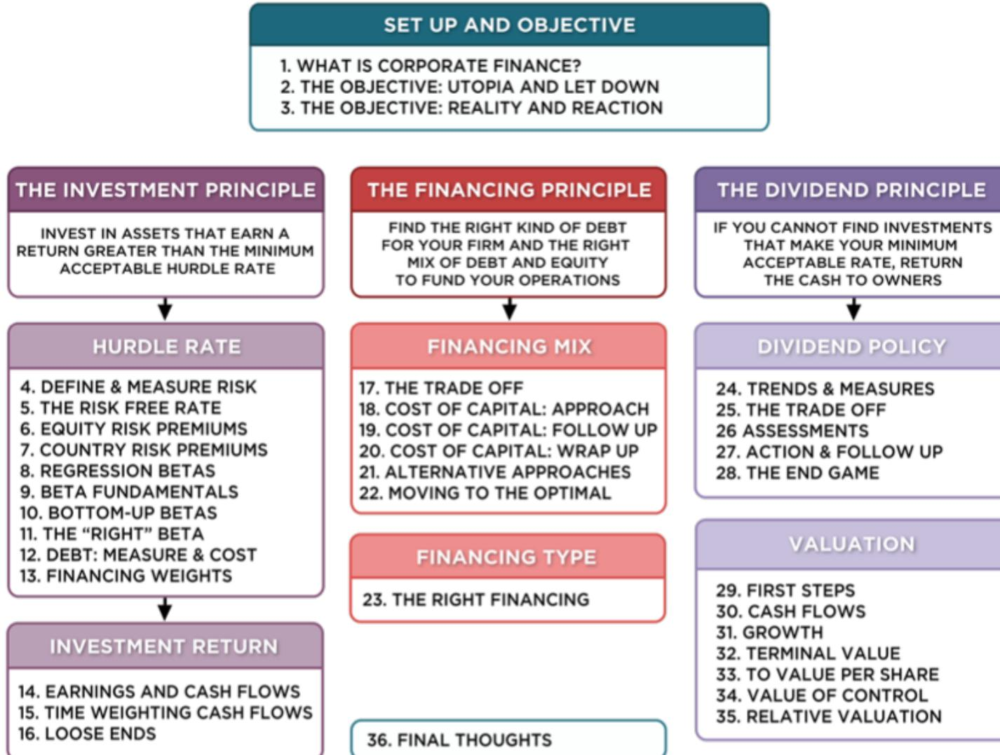
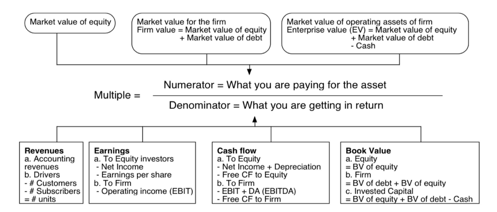
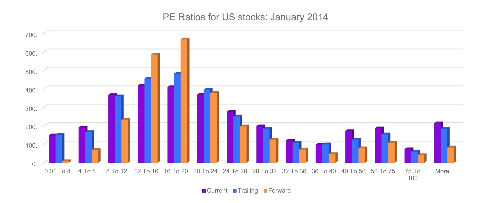
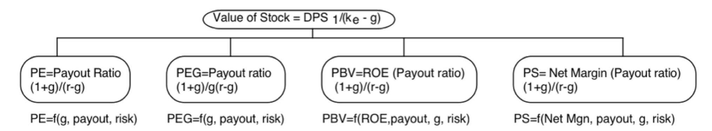
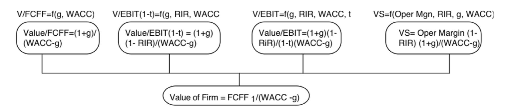

# **SESSION 35: RELATIVE VALUATION**

It's all relative.

# SESSION 36: RELATIVE VALUATION

## **THE ESSENCE OF RELATIVE VALUATION?**

- In relative valuation, the value of an asset is compared to the values assessed by the market for similar or comparable assets.
- To do relative valuation then, o we need to identify comparable assets and obtain market values for these assets o convert these market values into standardized values, since the absolute prices cannot be compared. This process of standardizing creates price multiples. o compare the standardized value or multiple for the asset being analyzed to the standardized values for comparable asset, controlling for any differences between the firms that might affect the multiple, to judge whether the asset is under- or over-valued.

#### **MULTIPLES ARE JUST STANDARDIZED ESTIMATES OF PRICE . . .**

### **THE FOUR STEPS TO DECONSTRUCTING MULTIPLES**

- Define the multiple o In use, the same multiple can be defined in different ways by different users. When comparing and using multiples, estimated by someone else, it is critical that we understand how the multiples have been estimated.
- Describe the multiple o Too many people who use a multiple have no idea what its cross-sectional distribution is. If you do know what the cross-sectional distribution of a multiple is, it is difficult to look at a number and pass judgement on whether is it too high or low.
- Analyze the multiple o It is critical that we understand the fundamentals that drive each multiple, and the nature of the relationship between the multiple and each variable.
- Apply the multiple o Defining the comparable universe and controlling for differences is far more difficult in practice that it is in theory.

#### **DEFINITIONAL TESTS**

- Is the multiple consistently defined? o Proposition 1: Both the value (the numerator) and the standardizing variable (the denominator) should be to the same claimholders in the firm. In other words, the value of equity should be divided by equity earnings or equity book value, and firm value should be divided by firm earnings or book value.
- Is the multiple uniformly estimated? o The variables used in defining the multiple should be estimated uniformly across assets in the "comparable firm" list. o If earnings-based multiples are used, the accounting rules to measure earnings should be applied consistently across assets. The same rule applies with book-value based multiples.

### **EXAMPLE 1: PRICE EARNINGS RATIO: DEFINITION**

PE = Market Price per Share/Earnings per Share

- There are a number of variants on the basic PE ratio is use. They are based upon how the price and the earnings are defined.

Price: is usually the current price

is sometimes the average price for the year

EPS: EPS in most recent financial year

EPS in trailing 12 months (Trailing PE)

Forecasted EPS next year (Forward PE)

Forecasted EPS in future year

### **EXAMPLE 2: ENTERPRISE VALUE/EBITDA MULTIPLE**

- The enterprise value to EBITDA is obtained by netting cash out against debt to arrive at enterprise value and dividing by EBITDA.

- Why do we net out cash from firm value?
- What happens if a firm has cross holdings which are categorized as: o Minority interests? o Majority active interests?

#### **DESCRIPTIVE TESTS**

- What is the average and standard deviation for this multiple, across the universe (market)?
- What is the media for this multiple? o The median for this multiple is often a more reliable point of comparison.
- How large are the outliers to the distribution, and how do we deal with the outliers? o Throwing out the outliers may seem like an obvious solution, but if the outliers all lie on one side of the distribution (they usually are large positive numbers), this can lead to a biased estimate.
- Are there cases where the multiple cannot be estimated? Will ignoring these cases lead to a biased estimate of the multiple?
- How has this multiple changed over time?

#### **MULTIPLES HAVE SKEWED DISTRIBUTIONS . . .**

#### **ANALYTICAL TESTS**

- What are the fundamentals that determine and drive these multiples? o Proposition 2: Embedded in every multiple are all of the variables that drive every discounted cash flow valuation – growth, risk and cash flow patterns. o In fact, using a simple discounted cash flow model and basic algebra should yield the fundamentals that drive a multiple.
- How do changes in these fundamentals change the multiple? o The relationship between a fundamental (like growth) and a multiple (such as PE) is seldom linear. For example, if firm A has twice the growth rate of firm B, it will generally not trade at twice its PE ratio. o Proposition 3: It is impossible to properly compare firms on a multiple, if we do not know the nature of the relationship between the fundamentals and the multiple.

## **PE RATIO: UNDERSTANDING THE FUNDAMENTALS**

- To understand the fundamentals, start with a basic equity discounted cash flow model.
- With the dividend discount model,

$$P_0 = \frac{DPS_1}{r - g_n}$$

- Dividing both sides by the current earnings per share,

$$\frac{P_0}{EPS_0} = PE = \frac{\text{Payout Ratio} * (1 + g_n)}{r - g_n}$$

- If this had been an FCFE Model,

$$P_0 = \frac{\text{FCFE}_1}{r - g_n}$$

$$\frac{P_0}{EPS_0} = PE = \frac{(\text{FCFE/Earnings}) * (1 + g_n)}{r - g_n}$$

#### **THE DETERMINANTS OF MULTIPLES . . .**

### **APPLICATION TESTS**

- Given the firm that we are valuing, what is a "comparable" firm? o While traditional analysis is built on the premise that firms in the same sector are comparable firms, valuation theory would suggest that a comparable firm is one which is similar to the one being analyzed in terms of fundamentals. o Proposition 4: There is no reason why a firm cannot be compared with another firm in a very different business, if the two firms have the same risk, growth and cash flow characteristics.
- Given the comparable firms, how do we adjust for differences across firms on the fundamentals? o Proposition 5: It is impossible to find an exactly identical firm to the one you are valuing.

#### **BACK TO FIRST PRINCIPLES**

| Company                              | Market Capitalization | Current PE | Trailing PE | Forward PE | Expected growth | PEG ratio |
|--------------------------------------|-----------------------|------------|-------------|------------|-----------------|-----------|
| The Walt Disney Company              | \$126,427             | 20.60      | 20.60       | 18.40      | 12.40%          | 1.66      |
| Twenty-First Century Fox, Inc.       | \$70,451              | 9.93       | 11.51       | 19.70      | 20.90%          | 0.55      |
| Time Warner Inc.                     | \$56,889              | 18.84      | 14.53       | 15.50      | 12.60%          | 1.15      |
| Viacom, Inc.                         | \$35,492              | 14.82      | 14.82       | 14.80      | 13.10%          | 1.13      |
| The Madison Square Garden Company    | \$4,300               | 30.19      | 29.53       | 28.50      | 17.60%          | 1.68      |
| Lions Gate Entertainment Corp.       | \$4,270               | 18.40      | 19.87       | 19.40      | 20.00%          | 0.99      |
| Live Nation Entertainment, Inc.      | \$4,068               | NA         | NA          | NM         | 9.00%           | NA        |
| Cinemark Holdings Inc.               | \$3,445               | 20.40      | 21.44       | 16.60      | 14.80%          | 1.45      |
| Regal Entertainment Group            | \$3,089               | 21.33      | 18.06       | 17.70      | 10.00%          | 1.81      |
| DreamWorks Animation SKG Inc.        | \$2,764               | NA         | NA          | 43.30      | 82.30%          | NA        |
| AMC Entertainment Holdings, Inc.     | \$2,079               | 32.85      | 20.28       | 14.90      | 86.60%          | 0.23      |
| World Wrestling Entertainment Inc.   | \$1,608               | 51.21      | 142.29      | NM         | 20.00%          | 7.11      |
| Rentrak Corporation                  | \$648                 | NA         | NA          | 152.80     | 115.00%         | NA        |
| Carmike Cinemas Inc. (NasdaqGS:CKEC) | \$606                 | 6.29       | 6.48        | 24.40      | 6.75%           | 0.96      |
| Average                              | \$22,581              | 22.26      | 29.04       | 32.17      | 31.50%          | 1.70      |
| Median                               | \$3,756               | 20.40      | 19.87       | 18.90      | 16.20%          | 1.15      |

#### **ANOTHER EXAMPLE: EUROPEAN BANKS**

| Company Name                                   | Price/Book Equity | ROE     | Tier 1 capital as a percentage of risk-adjusted assets |
|------------------------------------------------|-------------------|---------|--------------------------------------------------------|
| Allied Irish Banks                             | 0.70              | -31.62% | 15.06%                                                 |
| Banco Espírito Santo, S.A.                     | 0.68              | -5.30%  | 10.44%                                                 |
| Banco Santander, S.A.                          | 0.89              | 4.46%   | 11.17%                                                 |
| Bankinter, S.A.                                | 1.41              | 6.17%   | 10.77%                                                 |
| BNP Paribas SA                                 | 0.77              | 5.51%   | 13.63%                                                 |
| Commerzbank AG                                 | 0.56              | -2.47%  | 13.09%                                                 |
| Credit Agricole S.A.                           | 0.55              | -4.51%  | 11.67%                                                 |
| Crédit Industriel et Commercial                | 0.60              | 6.96%   | 12.11%                                                 |
| Credit Suisse Group AG                         | 0.91              | 6.25%   | 19.41%                                                 |
| Deutsche Bank AG                               | 0.67              | -0.93%  | 15.13%                                                 |
| Deutsche Postbank AG                           | 1.47              | 5.72%   | 11.97%                                                 |
| DNB ASA                                        | 1.27              | 11.41%  | 11.04%                                                 |
| Erste Group Bank AG                            | 0.81              | 2.07%   | 11.61%                                                 |
| HSBC Holdings plc                              | 1.05              | 8.83%   | 13.44%                                                 |
| Intesa Sanpaolo S.p.A.                         | 0.65              | 1.11%   | 12.06%                                                 |
| Investec plc                                   | 0.89              | 7.86%   | 10.96%                                                 |
| Julius Baer Group Ltd.                         | 2.19              | 5.25%   | 29.27%                                                 |
| KBC Group NV                                   | 1.30              | 10.62%  | 13.77%                                                 |
| Lloyds Banking Group plc                       | 1.47              | -0.20%  | 13.78%                                                 |
| Mediobanca Banca di Credito Finanziario S.p.A. | 0.78              | -1.64%  | 11.75%                                                 |
| National Bank of Greece SA                     | 1.14              | 8.18%   | -6.65%                                                 |
| Natixis                                        | 0.76              | 4.92%   | 12.33%                                                 |
| PIRAEUS BANK Société Anonyme                   | 0.92              | 36.50%  | 9.30%                                                  |
| Pohjola Bank plc                               | 1.65              | 12.50%  | 12.43%                                                 |
| Raiffeisen Bank International AG               | 0.56              | 2.84%   | 13.60%                                                 |
| Skandinaviska Enskilda Banken AB               | 1.60              | 11.91%  | 11.65%                                                 |
| Societe Generale Group                         | 0.62              | 2.49%   | 12.50%                                                 |
| Standard Chartered PLC                         | 1.15              | 9.29%   | 13.45%                                                 |
| Svenska Handelsbanken AB                       | 1.86              | 14.61%  | 20.95%                                                 |
| Bank of Ireland                                | 1.24              | -14.87% | 14.54%                                                 |
| The Royal Bank of Scotland Group plc           | 0.58              | -3.58%  | 12.43%                                                 |
| UBS AG                                         | 1.40              | 0.62%   | 21.29%                                                 |
| UniCredit S.p.A.                               | 0.50              | 0.71%   | 11.44%                                                 |
| Unione di Banche Italiane Scpa                 | 0.43              | -0.35%  | 10.79%                                                 |
| Average                                        | 1.00              | 3.57%   | 13.00%                                                 |
| Median                                         | 0.89              | 4.69%   | 12.38%                                                 |

## **IS DEUTSCHE BANK CHEAP?**

- Trading at 0.67 times book equity, Deutsche looks cheap, relative to the rest of the sector. However, part of the reason for this may be its low return on equity of - 0.93% in 2013.
- Because these firms differ on both capital policy and return on equity, we run a regression of PBV ratios on both variables:

| PBV = | $0.48 + 1.58 \text{ ROE}$ | + 3.55 Tier 1 capital ratio | $R^2 = 23.66\%$ |
|-------|---------------------------|-----------------------------|-----------------|
|       | (2.63)                    | (2.44)                      |                 |
|       | (2.76)                    |                             |                 |

- The predicted PBV ratio for Deutsche Bank, based on its return on equity of 0.93% and its tier 1 capital ratio of 15.13%, would be 1.003.

Predicted PBVDeutsche Bank = 0.48 + 1.58 (-0.0093)+3.55 (0.1513) = 1.003

- Because the actual PBV ratio for Deutsche Bank at the time of the analysis was 0.67, this would suggest that the stock in under-valued, relative to other banks.

Applied  
Corporate  
Finance

**Optional: Read Chapter 12**

#### **Task**

Given how the sector in which your firm operated is being priced, estimate a relative value for your firm.