# **SESSION 36: FINAL THOUGHTS**

Alas, it is time to leave.

### **SESSION 36: FINAL THOUGHTS**

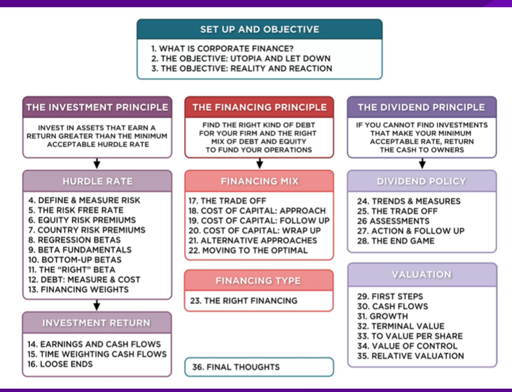

### **PONDEROUS THOUGHTS, OR MAYBE NOT**

- 1. There are few facts and lots of opinions.
  - a. Even the givens (cash and risk-free rate) are not
  - b. With accounting and market numbers, all bets are off.
- 2. The real world is a messy place.
  - a. Money making firms can become money losers.
  - b. Companies can be restructured/given facelifts.
- 3. Models do not compute values and optimal paths. You do.
- 4. Change is the only constant.

# I. WHAT ARE THE CONFLICTS OF INTEREST?

Consultants

**Inside stockholders**  
Want to maximize value while retaining control

**Outside stockholders**  
Want to maximize their returns (stock price plus dividends).

Auditors

**Lenders**  
Bankers/Bondholders want to minimize credit risk and ensure that interest/principal get paid.

**Board of Directors**  
Want to preserve personal connections with the managers and personal perks.

**Society**  
Wants companies to add to economic pie without creating social costs.

**Managers**  
Want to maximize their compensation and increase personal marketability.

**Regulators**  
Want to ensure that you follow the rules and do not create problems for them.

**Employees**  
Want to minimize job risk and maximize wages/benefits.

**Customers**  
Want the best possible product/service at the lowest price

Government

# **II. RISK AND THE MARGINAL INVESTOR**

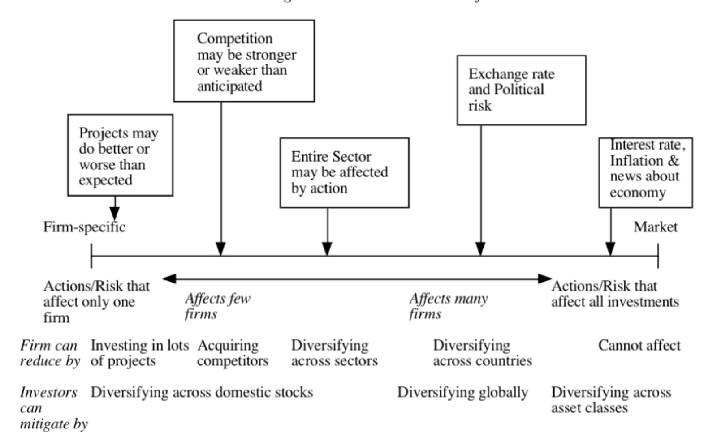

### **III. RISK PROFILES AND COSTS OF EQUITY**

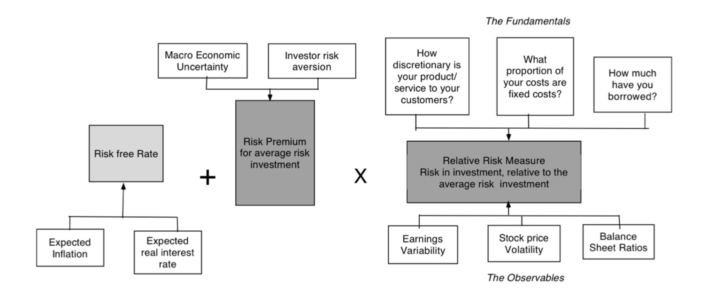

# **COST OF CAPITAL**

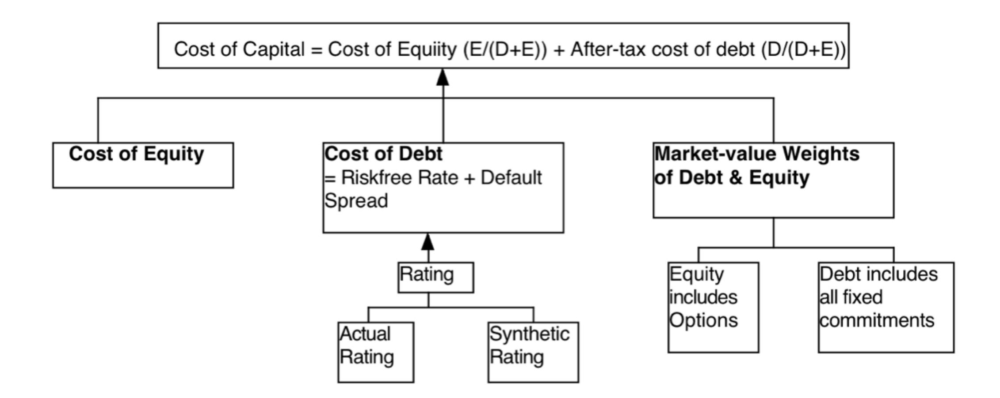

### **IV. THE QUALITY OF INVESTMENTS: THE FIRM VIEW**

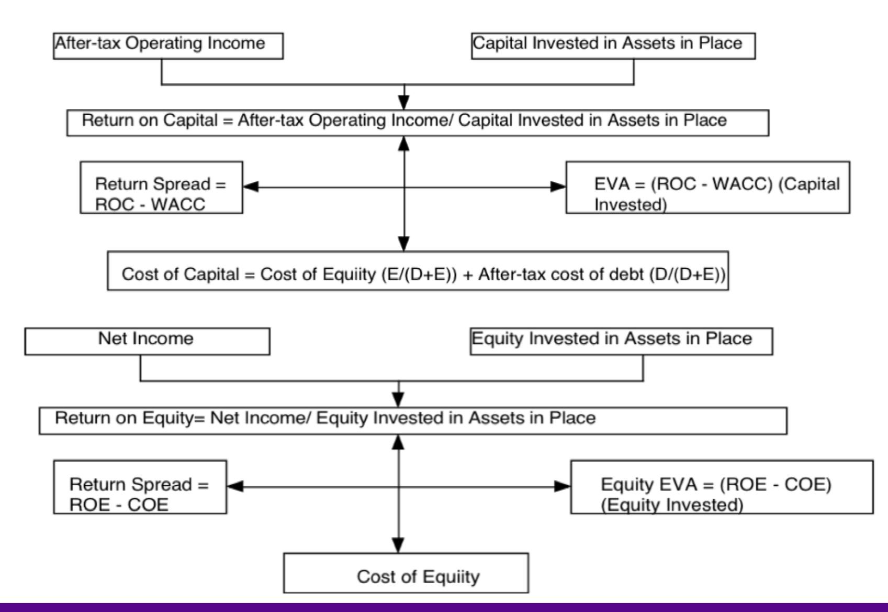

### **V. THE TRADE OFF ON DEBT**

| Advantages of Debt                                                              | Disadvantages of Debt                                            |
|---------------------------------------------------------------------------------|------------------------------------------------------------------|
| 1. Tax Benefit: Interest expenses on debt are tax deductible but cash flows to  |                                                                  |
| 1. Expected Bankruptcy Cost:                                                    | The expected cost of going bankrupt is a product                 |
| 1. Firms with more stable earnings should borrow more, for any given level of   |                                                                  |
| 2. Firms with lower bankruptcy costs should borrow more, for any given level of |                                                                  |
| 2. Added Discipline: Borrowing money may force managers to think about the      |                                                                  |
| 2. Agency Costs:                                                                | Actions that benefit equity investors may hurt lenders. The      |
| borrower (as higher interest rates or                                           | more covenants).                                                 |
| Implication:                                                                    | Firms where lenders can monitor/control how their money is being |
| 3. Loss of Flexibility:                                                         | Using up available debt capacity today will mean that you        |
| 1. Firms that can forecast future funding needs better should be able to borrow |                                                                  |
| 2. Firms with better access to capital markets should be more willing to borrow |                                                                  |

# VI. THE OPTIMAL MIX OF DEBT AND EQUITY

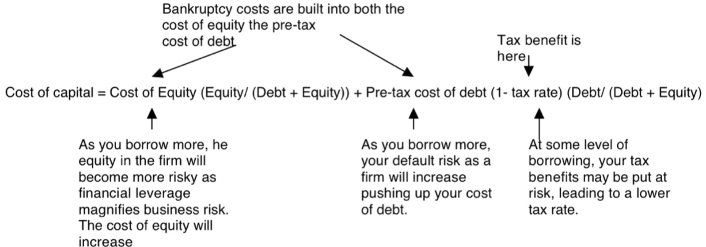

## **VII. GETTING TO THE OPTIMAL MIX**

- How quickly? o If under-levered, are you the potential target of a hostile acquisition? o If over-levered, are you under threat of bankruptcy?
- How? o Recapitalizations: Borrow money and buy back stock, if underlevered, or issue equity and retire debt, if over-levered. o Investments: Take investments primarily with debt, if underlevered, or take investments primarily with equity, if overlevered.

# **VIII. THE RIGHT KIND OF FINANCING**

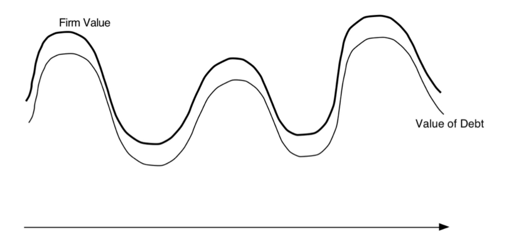

## **IX. MEASURING POTENTIAL DIVIDENDS**

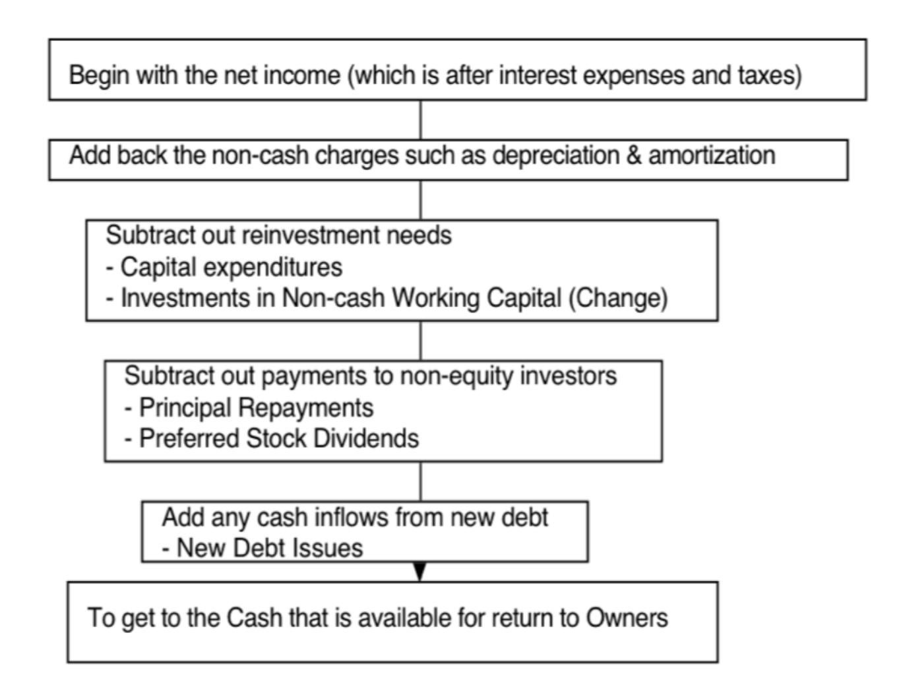

# X. VALUATION: MATCH UP CASH FLOWS AND DISCOUNT RATES . . .

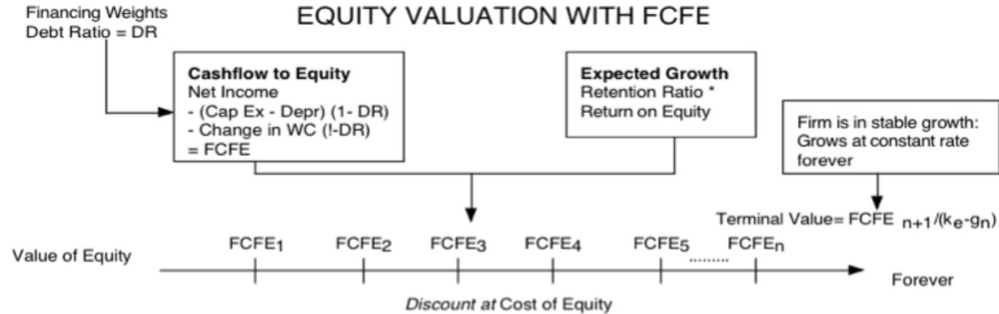

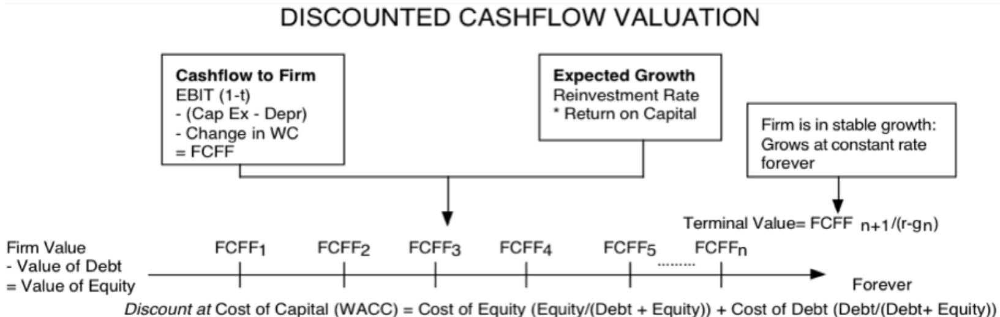

### **BACK TO FIRST PRINCIPLES**

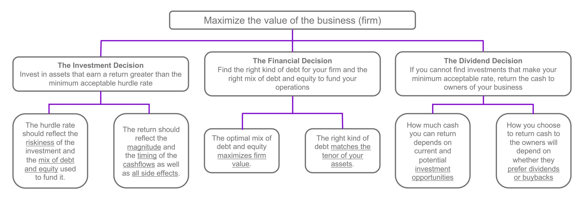

Applied  
Corporate  
Finance

Optional: Read Chapter 12

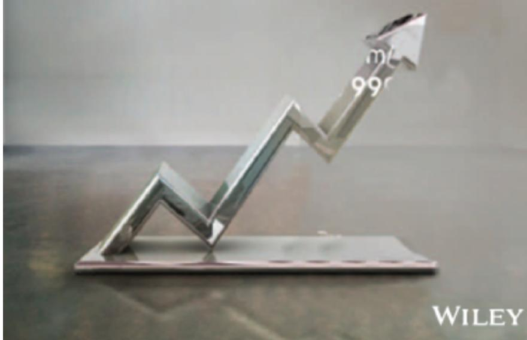

**Task** From a first principles standpoint, judge your firm